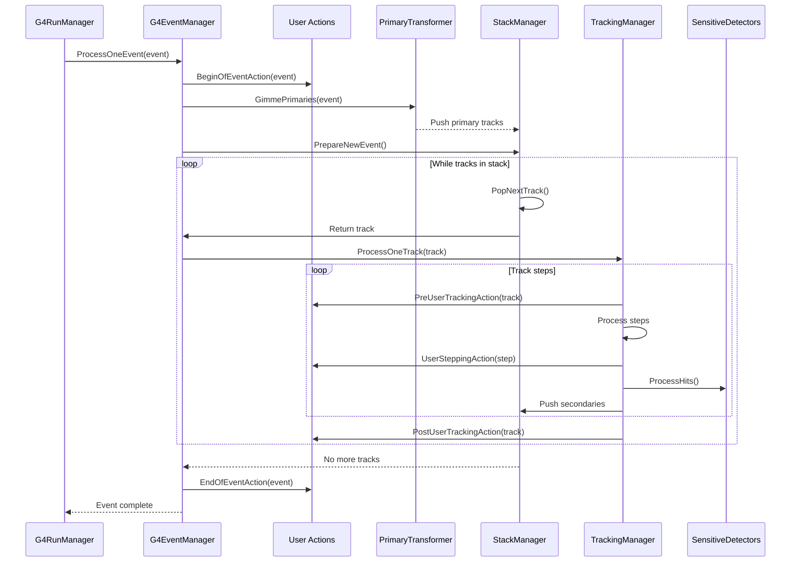

# G4EventManager API Documentation

## Overview

`G4EventManager` is the singleton class that controls event processing in Geant4. It orchestrates the complete simulation of an event, from primary particle generation through tracking of all secondaries to final data collection. This class coordinates user actions, stack management, tracking, and sensitive detector operations.

::: tip Header File
**Location:** `source/event/include/G4EventManager.hh`
**Source:** `source/event/src/G4EventManager.cc`
:::

## Key Responsibilities

1. **Event Orchestration**: Controls the complete event processing workflow
2. **Primary Transformation**: Converts primary particles to tracks via `G4PrimaryTransformer`
3. **Stack Management**: Manages track stacking through `G4StackManager`
4. **Tracking Coordination**: Interfaces with `G4TrackingManager` for track processing
5. **User Actions**: Invokes user action hooks at appropriate points
6. **Sub-Event Parallelism**: Supports parallel processing of sub-events

## Class Declaration

```cpp
class G4EventManager
{
  public:
    static G4EventManager* GetEventManager();

    G4EventManager();
   ~G4EventManager();

    G4EventManager(const G4EventManager &right) = delete;
    G4EventManager& operator=(const G4EventManager& right) = delete;

    void ProcessOneEvent(G4Event* anEvent);
    void ProcessOneEvent(G4TrackVector* trackVector, G4Event* anEvent = nullptr);

    // ... (methods detailed below)
};
```

## Singleton Access

### GetEventManager()
`source/event/include/G4EventManager.hh:59-60`

```cpp
static G4EventManager* GetEventManager();
```

**Returns:** Thread-local singleton instance

**Example:**
```cpp
G4EventManager* eventManager = G4EventManager::GetEventManager();
```

::: info Thread Safety
In multi-threaded mode, each worker thread has its own `G4EventManager` instance. The method returns the thread-local singleton.
:::

## Event Processing

### ProcessOneEvent(G4Event*)
`source/event/include/G4EventManager.hh:68-69`

```cpp
void ProcessOneEvent(G4Event* anEvent);
```

**Parameters:**
- `anEvent`: Event object with primary vertices/particles

**Purpose:** Main entry point for event simulation

**Workflow:**
1. Call user's `BeginOfEventAction`
2. Transform primary particles to tracks
3. Initialize stack with primary tracks
4. Process all tracks via tracking manager
5. Call user's `EndOfEventAction`
6. Store random number status if requested

**Example:**
```cpp
// Typically called by G4RunManager
G4Event* event = new G4Event(eventID);
primaryGenerator->GeneratePrimaries(event);

G4EventManager* eventManager = G4EventManager::GetEventManager();
eventManager->ProcessOneEvent(event);
```

::: warning Normal Usage
This method is normally called by `G4RunManager`. Direct invocation rarely needed.
:::

### ProcessOneEvent(G4TrackVector*, G4Event*)
`source/event/include/G4EventManager.hh:71-87`

```cpp
void ProcessOneEvent(G4TrackVector* trackVector, G4Event* anEvent = nullptr);
```

**Parameters:**
- `trackVector`: Vector of `G4Track` objects to process
- `anEvent`: Optional event object (can be `nullptr`)

**Purpose:** Alternative entry for external track creation

**Behavior:**
- If `anEvent` is `nullptr`: Creates dummy event (deleted at end)
- If `anEvent` is valid: Associates output with event
- Useful for HEP experiments creating tracks directly

**Example:**
```cpp
// Create tracks directly
G4TrackVector* tracks = new G4TrackVector();

G4Track* track = new G4Track(dynamicParticle, time, position);
tracks->push_back(track);

// Process with dummy event
eventManager->ProcessOneEvent(tracks);

// Or with real event
G4Event* event = new G4Event(0);
eventManager->ProcessOneEvent(tracks, event);
```

::: tip Use Case
This method is for specialized applications that bypass normal primary generation (e.g., external event generators).
:::

## Stack Management

### StackTracks()
`source/event/include/G4EventManager.hh:88-90`

```cpp
void StackTracks(G4TrackVector* trackVector, G4bool IDhasAlreadySet = false);
```

**Parameters:**
- `trackVector`: Tracks to add to stack
- `IDhasAlreadySet`: `true` if track IDs already assigned

**Purpose:** Add tracks to the current event's stack

**Example:**
```cpp
G4TrackVector* secondaries = new G4TrackVector();
// ... create secondary tracks
eventManager->StackTracks(secondaries, false);
```

### GetStackManager()
`source/event/include/G4EventManager.hh:126-127`

```cpp
inline G4StackManager* GetStackManager() const;
```

**Returns:** Pointer to stack manager

**Example:**
```cpp
G4StackManager* stackMgr = eventManager->GetStackManager();
G4int nWaiting = stackMgr->GetNWaitingTrack();
```

## Current Event Access

### GetConstCurrentEvent()
`source/event/include/G4EventManager.hh:92-93`

```cpp
inline const G4Event* GetConstCurrentEvent();
```

**Returns:** Const pointer to current event, or `nullptr` if no event processing

**Example:**
```cpp
const G4Event* event = eventManager->GetConstCurrentEvent();
if (event) {
    G4int evtID = event->GetEventID();
}
```

### GetNonconstCurrentEvent()
`source/event/include/G4EventManager.hh:94-95`

```cpp
inline G4Event* GetNonconstCurrentEvent();
```

**Returns:** Non-const pointer to current event

**Example:**
```cpp
G4Event* event = eventManager->GetNonconstCurrentEvent();
if (event) {
    event->KeepTheEvent();  // Modify event
}
```

::: warning Thread Safety
Current event is thread-local. Safe to access within same thread.
:::

## Event Control

### AbortCurrentEvent()
`source/event/include/G4EventManager.hh:100-104`

```cpp
void AbortCurrentEvent();
```

**Purpose:** Abort processing of current event

**Behavior:**
- Deletes all stacked tracks
- Sets event as aborted
- Event data may be incomplete
- Trajectories, hits, digits created before abortion are preserved

**Example:**
```cpp
// In user stepping action
if (criticalErrorDetected) {
    G4EventManager::GetEventManager()->AbortCurrentEvent();
    return;
}
```

### KeepTheCurrentEvent()
`source/event/include/G4EventManager.hh:122-124`

```cpp
void KeepTheCurrentEvent();
```

**Purpose:** Keep current event until end of run (not deleted)

**Example:**
```cpp
// In EndOfEventAction
if (interestingEvent) {
    eventManager->KeepTheCurrentEvent();
}
```

## User Actions

### SetUserAction(G4UserEventAction*)
`source/event/include/G4EventManager.hh:106`

```cpp
void SetUserAction(G4UserEventAction* userAction);
```

**Purpose:** Set event-level user action

**Example:**
```cpp
MyEventAction* eventAction = new MyEventAction();
eventManager->SetUserAction(eventAction);
```

### SetUserAction(G4UserStackingAction*)
`source/event/include/G4EventManager.hh:107`

```cpp
void SetUserAction(G4UserStackingAction* userAction);
```

**Purpose:** Set stacking user action

**Example:**
```cpp
MyStackingAction* stackingAction = new MyStackingAction();
eventManager->SetUserAction(stackingAction);
```

### SetUserAction(G4UserTrackingAction*)
`source/event/include/G4EventManager.hh:108`

```cpp
void SetUserAction(G4UserTrackingAction* userAction);
```

**Purpose:** Set tracking user action

### SetUserAction(G4UserSteppingAction*)
`source/event/include/G4EventManager.hh:109`

```cpp
void SetUserAction(G4UserSteppingAction* userAction);
```

**Purpose:** Set stepping user action

### Get User Actions

```cpp
inline G4UserEventAction* GetUserEventAction();
inline G4UserStackingAction* GetUserStackingAction();
inline G4UserTrackingAction* GetUserTrackingAction();
inline G4UserSteppingAction* GetUserSteppingAction();
```
`source/event/include/G4EventManager.hh:110-117`

**Returns:** Pointer to respective user action

**Example:**
```cpp
G4UserEventAction* eventAction = eventManager->GetUserEventAction();
if (eventAction) {
    // User action is set
}
```

## Tracking Manager Access

### GetTrackingManager()
`source/event/include/G4EventManager.hh:128-129`

```cpp
inline G4TrackingManager* GetTrackingManager() const;
```

**Returns:** Pointer to tracking manager

**Example:**
```cpp
G4TrackingManager* trackingMgr = eventManager->GetTrackingManager();
```

## Verbosity Control

### GetVerboseLevel() / SetVerboseLevel()
`source/event/include/G4EventManager.hh:131-138`

```cpp
inline G4int GetVerboseLevel();
inline void SetVerboseLevel(G4int value);
```

**Purpose:** Control diagnostic output level

**Levels:**
- 0: Silent
- 1: Minimal output
- 2: Detailed output
- 3+: Very detailed output

**Example:**
```cpp
eventManager->SetVerboseLevel(2);
G4int verbose = eventManager->GetVerboseLevel();
```

**Propagation:**
When set, verbosity propagates to:
- Stack manager
- Primary transformer

## User Event Information

### SetUserInformation() / GetUserInformation()
`source/event/include/G4EventManager.hh:141-145`

```cpp
void SetUserInformation(G4VUserEventInformation* anInfo);
G4VUserEventInformation* GetUserInformation();
```

**Purpose:** Set/get user information for current event

**Valid only during:** `G4State_EventProc`

**Example:**
```cpp
// In BeginOfEventAction
MyEventInfo* info = new MyEventInfo();
eventManager->SetUserInformation(info);

// Later retrieval
MyEventInfo* info = dynamic_cast<MyEventInfo*>(
    eventManager->GetUserInformation());
```

::: warning State Requirement
Only valid during event processing (`G4State_EventProc`). Returns `nullptr` otherwise.
:::

## Primary Transformer

### GetPrimaryTransformer() / SetPrimaryTransformer()
`source/event/include/G4EventManager.hh:147-150`

```cpp
inline G4PrimaryTransformer* GetPrimaryTransformer() const;
inline void SetPrimaryTransformer(G4PrimaryTransformer* tf);
```

**Purpose:** Access/replace primary particle transformer

**Example:**
```cpp
G4PrimaryTransformer* transformer = eventManager->GetPrimaryTransformer();
transformer->SetVerboseLevel(2);
```

::: tip Customization
Advanced users can provide custom transformer for specialized primary-to-track conversion.
:::

## Random Number Management

### StoreRandomNumberStatusToG4Event()
`source/event/include/G4EventManager.hh:151-152`

```cpp
inline void StoreRandomNumberStatusToG4Event(G4int vl);
```

**Parameters:**
- `vl`: Storage mode
  - 0: Don't store
  - 1: Store for reproduction
  - 2: Store for processing
  - 3: Store both

**Purpose:** Control random number status storage in events

**Example:**
```cpp
// Enable RNG status storage for event reproduction
eventManager->StoreRandomNumberStatusToG4Event(1);
```

## Sub-Event Parallelism (Advanced)

### UseSubEventParallelism()
`source/event/include/G4EventManager.hh:154-158`

```cpp
inline void UseSubEventParallelism(G4bool worker = false);
```

**Parameters:**
- `worker`: `true` if worker thread, `false` if master

**Purpose:** Enable sub-event parallel processing

### PopSubEvent()
`source/event/include/G4EventManager.hh:160-163`

```cpp
G4SubEvent* PopSubEvent(G4int ty);
```

**Parameters:**
- `ty`: Sub-event type

**Returns:** Sub-event for processing, or `nullptr` if none available

**Purpose:** Get next sub-event for worker thread

::: info Mutex Protection
This method is mutex-protected for thread safety.
:::

### TerminateSubEvent()
`source/event/include/G4EventManager.hh:165-169`

```cpp
void TerminateSubEvent(const G4SubEvent* se, const G4Event* evt);
```

**Parameters:**
- `se`: Completed sub-event
- `evt`: Event containing results from worker

**Purpose:** Register completion of sub-event processing

### StoreSubEvent()
`source/event/include/G4EventManager.hh:171-174`

```cpp
G4int StoreSubEvent(G4Event*, G4int&, G4SubEvent*);
```

**Purpose:** Store new sub-event (used by `G4SubEventTrackStack`)

## Data Members

### Private Members
`source/event/include/G4EventManager.hh:182-210`

```cpp
private:
    static G4ThreadLocal G4EventManager* fpEventManager;

    G4Event* currentEvent = nullptr;
    G4StackManager* trackContainer = nullptr;
    G4TrackingManager* trackManager = nullptr;
    G4TrajectoryContainer* trajectoryContainer = nullptr;
    G4int trackIDCounter = 0;
    G4int verboseLevel = 0;
    G4SDManager* sdManager = nullptr;
    G4PrimaryTransformer* transformer = nullptr;
    G4bool tracking = false;
    G4bool abortRequested = false;
    G4bool subEventPara = false;
    G4bool subEventParaWorker = false;
    G4int evID_inSubEv = -1;

    G4EvManMessenger* theMessenger = nullptr;

    G4UserEventAction* userEventAction = nullptr;
    G4UserStackingAction* userStackingAction = nullptr;
    G4UserTrackingAction* userTrackingAction = nullptr;
    G4UserSteppingAction* userSteppingAction = nullptr;

    G4int storetRandomNumberStatusToG4Event = 0;
    G4String randomNumberStatusToG4Event;

    G4StateManager* stateManager = nullptr;
```

## Event Processing Workflow

### Detailed Flow



## Complete Example

### Basic Event Processing Setup

```cpp
// In main() or initialization
G4EventManager* eventManager = G4EventManager::GetEventManager();

// Set user actions
eventManager->SetUserAction(new MyEventAction());
eventManager->SetUserAction(new MyStackingAction());
eventManager->SetUserAction(new MyTrackingAction());
eventManager->SetUserAction(new MySteppingAction());

// Set verbosity
eventManager->SetVerboseLevel(1);

// Enable RNG storage for reproducibility
eventManager->StoreRandomNumberStatusToG4Event(1);
```

### Custom Event Processing

```cpp
class MyEventAction : public G4UserEventAction
{
public:
    void BeginOfEventAction(const G4Event* event) override
    {
        G4EventManager* eventMgr = G4EventManager::GetEventManager();

        // Set custom event information
        MyEventInfo* info = new MyEventInfo();
        info->eventNumber = event->GetEventID();
        info->timestamp = std::time(nullptr);
        eventMgr->SetUserInformation(info);

        // Initialize per-event counters
        nGammas = 0;
        totalEdep = 0;
    }

    void EndOfEventAction(const G4Event* event) override
    {
        // Check if event was aborted
        if (event->IsAborted()) {
            G4cout << "Event " << event->GetEventID()
                   << " was aborted" << G4endl;
            return;
        }

        // Retrieve custom information
        G4EventManager* eventMgr = G4EventManager::GetEventManager();
        MyEventInfo* info = dynamic_cast<MyEventInfo*>(
            eventMgr->GetUserInformation());

        if (info) {
            G4cout << "Event " << info->eventNumber
                   << " processing time: "
                   << (std::time(nullptr) - info->timestamp)
                   << " seconds" << G4endl;
        }

        // Keep interesting events
        if (totalEdep > 100*MeV || nGammas > 10) {
            eventMgr->KeepTheCurrentEvent();
        }
    }

private:
    G4int nGammas;
    G4double totalEdep;
};
```

### Event Abortion Condition

```cpp
class MySteppingAction : public G4UserSteppingAction
{
public:
    void UserSteppingAction(const G4Step* step) override
    {
        // Abort if particle leaves world volume
        if (step->GetPostStepPoint()->GetStepStatus() == fWorldBoundary)
        {
            G4Track* track = step->GetTrack();
            if (track->GetTrackID() == 1)  // Primary particle
            {
                G4cout << "Primary particle left world! Aborting event."
                       << G4endl;
                G4EventManager::GetEventManager()->AbortCurrentEvent();
            }
        }
    }
};
```

### Direct Track Processing (Advanced)

```cpp
void ProcessExternalTracks()
{
    // Create tracks from external generator
    G4TrackVector* tracks = new G4TrackVector();

    // Read from external file/generator
    while (ExternalGenerator::HasMoreTracks()) {
        ExternalTrackData data = ExternalGenerator::GetNextTrack();

        // Create Geant4 track
        G4ParticleDefinition* particle = GetParticleDefinition(data.pdg);
        G4DynamicParticle* dynamicParticle = new G4DynamicParticle(
            particle, data.momentum);

        G4Track* track = new G4Track(
            dynamicParticle, data.time, data.position);

        tracks->push_back(track);
    }

    // Process tracks (creates dummy event internally)
    G4EventManager* eventMgr = G4EventManager::GetEventManager();
    eventMgr->ProcessOneEvent(tracks);

    delete tracks;
}
```

## Thread Safety

### Multi-Threading Behavior

- **Thread-Local Singleton**: Each worker thread has own instance
- **Independent Processing**: Events processed independently per thread
- **No Cross-Thread Access**: Current event is thread-local
- **Sub-Event Synchronization**: Mutex-protected for sub-event parallelism

### Thread-Safe Methods

All public methods are thread-safe when:
- Called from correct thread (owner of the instance)
- Operating on thread-local data

Sub-event methods (`PopSubEvent`, `TerminateSubEvent`) include additional mutex protection.

## Performance Considerations

1. **Event Abortion**: Minimizes wasted processing
2. **Stack Management**: LIFO urgent stack for cache efficiency
3. **Verbosity**: Set to 0 for production runs
4. **Event Keeping**: Use sparingly to avoid memory growth

## See Also

- [G4Event](g4event.md) - Event container class
- [G4PrimaryVertex](g4primaryvertex.md) - Primary vertex class
- [G4PrimaryParticle](g4primaryparticle.md) - Primary particle class
- [Event Module Overview](../index.md) - Complete module documentation
- [Run Module](../../../run/index.md) - Run management

---

::: info Source Reference
Complete implementation in:
- Header: `source/event/include/G4EventManager.hh`
- Source: `source/event/src/G4EventManager.cc`
:::
