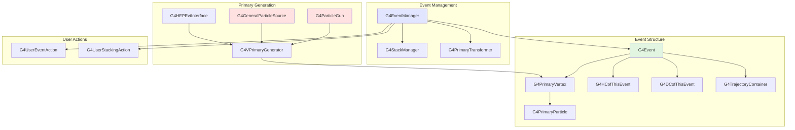
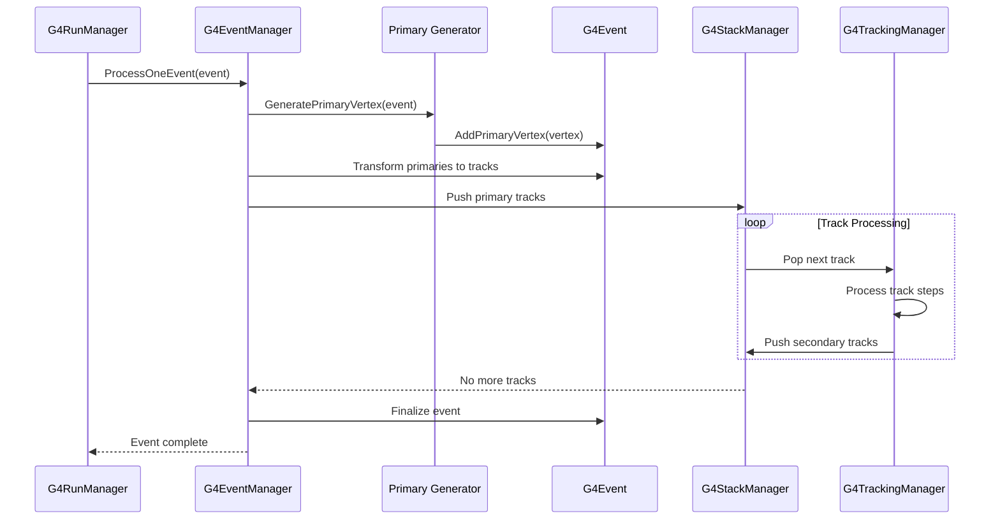
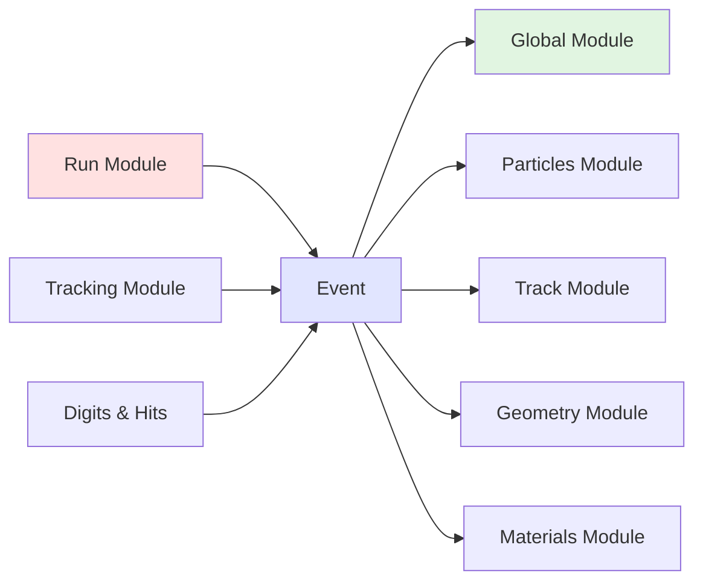

# Event Module

## Overview

The Event module is a fundamental component of Geant4 that handles event generation, management, and primary particle creation. It provides the infrastructure for defining primary vertices, creating primary particles, managing event processing, and controlling the stacking mechanism for secondary particles.

::: tip Module Location
**Source:** `source/event/`
**Headers:** `source/event/include/`
:::

## Purpose and Scope

The Event module serves several critical functions:

- **Event Container**: Provides `G4Event` as the central container for event data
- **Primary Generation**: Manages primary vertices and particles that initiate event simulation
- **Event Processing**: Controls the flow of event simulation through `G4EventManager`
- **Track Stacking**: Implements sophisticated stacking mechanisms for managing secondary particles
- **User Hooks**: Provides user action interfaces for customizing event processing
- **Sub-Event Parallelism**: Supports advanced parallel processing of sub-events (new in recent versions)

## Architecture

### Core Components



### Event Data Flow



## Key Classes

### Event Container

| Class | Purpose | Header |
|-------|---------|--------|
| [**G4Event**](api/g4event.md) | Main event container holding primary vertices, hits, digits, and trajectories | `G4Event.hh` |
| [**G4PrimaryVertex**](api/g4primaryvertex.md) | Represents a primary vertex with space-time position | `G4PrimaryVertex.hh` |
| [**G4PrimaryParticle**](api/g4primaryparticle.md) | Represents a primary particle with momentum and properties | `G4PrimaryParticle.hh` |

### Event Management

| Class | Purpose | Header |
|-------|---------|--------|
| [**G4EventManager**](api/g4eventmanager.md) | Controls event processing and coordinates simulation flow | `G4EventManager.hh` |
| **G4StackManager** | Manages stacking of tracks with urgent/waiting/postpone stacks | `G4StackManager.hh` |
| **G4PrimaryTransformer** | Transforms primary particles into G4Track objects | `G4PrimaryTransformer.hh` |

### Primary Generators

| Class | Purpose | Header |
|-------|---------|--------|
| **G4VPrimaryGenerator** | Abstract base class for primary particle generators | `G4VPrimaryGenerator.hh` |
| **G4ParticleGun** | Simple particle gun for shooting particles | `G4ParticleGun.hh` |
| **G4GeneralParticleSource** | Advanced generator with complex source distributions | `G4GeneralParticleSource.hh` |
| **G4HEPEvtInterface** | Interface for reading HEPEvt format event files | `G4HEPEvtInterface.hh` |

### User Actions

| Class | Purpose | Header |
|-------|---------|--------|
| **G4UserEventAction** | User hook for begin/end of event processing | `G4UserEventAction.hh` |
| **G4UserStackingAction** | User hook for track classification and stacking control | `G4UserStackingAction.hh` |
| **G4VUserEventInformation** | User-defined event information container | `G4VUserEventInformation.hh` |

### Sub-Event Parallelism (Advanced)

| Class | Purpose | Header |
|-------|---------|--------|
| **G4SubEvent** | Container for sub-event data in parallel processing | `G4SubEvent.hh` |
| **G4SubEventTrackStack** | Specialized stack for sub-event track management | `G4SubEventTrackStack.hh` |

## Usage Patterns

### Basic Event Structure

Every G4Event contains:

1. **Event ID**: Unique identifier (starts at 0, increments by 1)
2. **Primary Vertices**: One or more vertices representing primary interactions
3. **Primary Particles**: Particles associated with each vertex
4. **Hits Collections**: Detector response data (`G4HCofThisEvent`)
5. **Digits Collections**: Digitized detector signals (`G4DCofThisEvent`)
6. **Trajectories**: Particle trajectories if storing is enabled

### Event Processing Workflow

```cpp
// Typical event processing flow in G4EventManager
void G4EventManager::ProcessOneEvent(G4Event* anEvent)
{
    // 1. Begin of event user action
    userEventAction->BeginOfEventAction(anEvent);

    // 2. Transform primary particles to tracks
    transformer->GimmePrimaries(anEvent, trackManager);

    // 3. Stack primary tracks
    stackManager->PrepareNewEvent(anEvent);

    // 4. Track processing loop
    while (G4Track* track = stackManager->PopNextTrack())
    {
        trackingManager->ProcessOneTrack(track);
    }

    // 5. End of event user action
    userEventAction->EndOfEventAction(anEvent);
}
```

### Creating Primary Particles

#### Method 1: Using G4ParticleGun

```cpp
// In your PrimaryGeneratorAction
void MyPrimaryGeneratorAction::GeneratePrimaries(G4Event* anEvent)
{
    // Set particle properties
    particleGun->SetParticleDefinition(G4Electron::Definition());
    particleGun->SetParticleEnergy(10*GeV);
    particleGun->SetParticlePosition(G4ThreeVector(0, 0, 0));
    particleGun->SetParticleMomentumDirection(G4ThreeVector(0, 0, 1));

    // Generate the primary vertex
    particleGun->GeneratePrimaryVertex(anEvent);
}
```

#### Method 2: Manual Vertex Creation

```cpp
// Create vertex at specific space-time point
G4PrimaryVertex* vertex = new G4PrimaryVertex(x, y, z, t);

// Create primary particle
G4PrimaryParticle* particle = new G4PrimaryParticle(
    G4Electron::Definition(),  // particle type
    px, py, pz,                // momentum components
    energy                     // total energy
);

// Associate particle with vertex
vertex->SetPrimary(particle);

// Add vertex to event
anEvent->AddPrimaryVertex(vertex);
```

### Track Stacking Control

The stacking mechanism classifies tracks into three categories:

```cpp
// In your UserStackingAction
G4ClassificationOfNewTrack MyStackingAction::ClassifyNewTrack(
    const G4Track* aTrack)
{
    // Urgent: Process immediately
    if (aTrack->GetDefinition() == G4Gamma::Definition())
        return fUrgent;

    // Waiting: Process after all urgent tracks
    if (aTrack->GetKineticEnergy() > 100*MeV)
        return fWaiting;

    // Postpone to next event
    if (lowPriorityCondition)
        return fPostpone;

    // Kill: Discard this track
    if (outsideROI)
        return fKill;

    return fUrgent;  // default
}
```

### Event User Actions

```cpp
class MyEventAction : public G4UserEventAction
{
public:
    void BeginOfEventAction(const G4Event* event) override
    {
        G4int evtID = event->GetEventID();
        if (evtID % 1000 == 0)
            G4cout << "Processing event " << evtID << G4endl;

        // Initialize per-event data structures
        ResetEventCounters();
    }

    void EndOfEventAction(const G4Event* event) override
    {
        // Retrieve hits collections
        auto hitsCollection = event->GetHCofThisEvent();

        // Process and analyze event results
        AnalyzeEvent(event);

        // Optionally keep event for post-processing
        if (interestingEvent)
            event->KeepTheEvent(true);
    }
};
```

## Advanced Features

### Sub-Event Parallelism

Recent versions of Geant4 support sub-event parallelism for improved performance:

```cpp
// Event can spawn and manage sub-events
G4SubEvent* subEvent = event->PopSubEvent(subEventType);

// Process sub-event in worker thread
// ...

// Merge results back to master event
event->TerminateSubEvent(subEvent);
```

### Event Information

Attach custom information to events:

```cpp
// Define custom event information
class MyEventInfo : public G4VUserEventInformation
{
public:
    void Print() const override { /* ... */ }

    G4double totalEnergyDeposit;
    G4int numberOfHits;
    // ... custom fields
};

// Attach to event
MyEventInfo* info = new MyEventInfo();
event->SetUserInformation(info);

// Retrieve later
MyEventInfo* info =
    dynamic_cast<MyEventInfo*>(event->GetUserInformation());
```

### Random Number Status

For reproducibility, events can store RNG states:

```cpp
// Store random number status before event processing
G4String rndmStatus = CLHEP::HepRandom::getTheEngine()->name();
event->SetRandomNumberStatus(rndmStatus);

// Retrieve for event reproduction
const G4String& status = event->GetRandomNumberStatus();
```

## Thread Safety

### Multi-Threading Considerations

- **G4Event**: Created per-event, thread-local (one per worker thread)
- **G4EventManager**: Thread-local singleton
- **Primary Generators**: Should be thread-safe or thread-local
- **User Actions**: Separate instance per thread

```cpp
// Thread-local event manager
G4EventManager* eventMgr = G4EventManager::GetEventManager();
// Returns thread-local instance
```

### Sub-Event Parallelism

Sub-event parallelism allows parallel processing within a single event:

- Master thread manages `G4Event` with sub-events
- Worker threads process `G4SubEvent` objects
- Results merged back to master event
- Requires careful synchronization (handled internally)

## Integration with Other Modules

### Dependencies



### Relationship with Run Module

- Events are processed within Runs (managed by `G4RunManager`)
- Each Run contains multiple Events
- Event results accumulate into Run-level statistics
- See [Run Module](../run/index.md) documentation

### Relationship with Tracking Module

- Events create primary tracks
- `G4StackManager` provides tracks to `G4TrackingManager`
- Secondary tracks generated during tracking are pushed back to stack
- See Tracking Module documentation

## Performance Considerations

### Memory Management

- Events use custom allocators (`G4Allocator`) for efficiency
- Primary vertices and particles also use allocators
- Events deleted after processing unless explicitly kept
- Use `KeepTheEvent()` sparingly to avoid memory growth

### Event Abortion

```cpp
// Abort event if needed
G4EventManager::GetEventManager()->AbortCurrentEvent();

// Check if event was aborted
if (event->IsAborted())
{
    // Event data may be incomplete
}
```

### Stacking Optimization

- Urgent stack: LIFO (Last-In-First-Out) for cache efficiency
- Waiting stack: Processed after urgent stack empty
- Consider physics when classifying tracks

## Common Patterns and Best Practices

### 1. Event-Level Data Collection

```cpp
class MyEventAction : public G4UserEventAction
{
private:
    G4AnalysisManager* analysisManager;

public:
    void EndOfEventAction(const G4Event* event) override
    {
        // Fill event-level histograms
        G4int nTraj = event->GetTrajectoryContainer()->entries();
        analysisManager->FillH1(0, nTraj);

        // Fill n-tuples with event summary
        analysisManager->FillNtupleIColumn(0, event->GetEventID());
        analysisManager->FillNtupleDColumn(1, totalEdep);
        analysisManager->AddNtupleRow();
    }
};
```

### 2. Primary Vertex Iteration

```cpp
// Iterate over all primary vertices
G4int nVertex = event->GetNumberOfPrimaryVertex();
for (G4int i = 0; i < nVertex; ++i)
{
    G4PrimaryVertex* vertex = event->GetPrimaryVertex(i);
    G4ThreeVector pos = vertex->GetPosition();
    G4double time = vertex->GetT0();

    // Iterate over particles in this vertex
    G4PrimaryParticle* particle = vertex->GetPrimary();
    while (particle)
    {
        ProcessPrimaryParticle(particle);
        particle = particle->GetNext();
    }
}
```

### 3. Conditional Event Keeping

```cpp
void MyEventAction::EndOfEventAction(const G4Event* event) override
{
    // Keep only interesting events
    if (totalEnergyDeposit > threshold ||
        numberOfHits > minHits)
    {
        event->KeepTheEvent();
    }
}
```

## Debugging and Diagnostics

### Verbose Output

```cpp
// Set event manager verbosity
G4EventManager::GetEventManager()->SetVerboseLevel(2);

// Prints detailed event processing information
```

### Event Printing

```cpp
// Print event summary
event->Print();  // Prints event ID to G4cout

// Access event details for custom printing
G4cout << "Event " << event->GetEventID() << G4endl;
G4cout << "  Primary vertices: "
       << event->GetNumberOfPrimaryVertex() << G4endl;
G4cout << "  Trajectories: "
       << event->GetTrajectoryContainer()->entries() << G4endl;
```

## API Documentation

- [G4Event](api/g4event.md) - Event container class
- [G4PrimaryVertex](api/g4primaryvertex.md) - Primary vertex class
- [G4PrimaryParticle](api/g4primaryparticle.md) - Primary particle class
- [G4EventManager](api/g4eventmanager.md) - Event processing manager

## Source Files

Key source files in `source/event/`:

```
source/event/
├── include/
│   ├── G4Event.hh                      # Event container
│   ├── G4EventManager.hh               # Event processing manager
│   ├── G4ParticleGun.hh                # Simple particle gun
│   ├── G4GeneralParticleSource.hh      # Advanced particle source
│   ├── G4StackManager.hh               # Track stacking
│   ├── G4UserEventAction.hh            # Event user action
│   ├── G4UserStackingAction.hh         # Stacking user action
│   └── G4VPrimaryGenerator.hh          # Primary generator base
└── src/
    ├── G4Event.cc
    ├── G4EventManager.cc
    ├── G4ParticleGun.cc
    ├── G4GeneralParticleSource.cc
    └── G4StackManager.cc
```

::: tip Related Documentation
- [Run Module](../run/index.md) - Event management within runs
- [Materials Module](../materials/index.md) - Material definitions used in events
- [Architecture Overview](../../architecture.md) - Overall Geant4 architecture
- [Visualization](../../visualization.md) - Module dependency diagrams
:::

## See Also

- **Geant4 User's Guide**: Chapter on Event Processing
- **Primary Particle Generation**: Techniques and best practices
- **Stacking Mechanism**: Advanced control of track processing
- **Multi-Threading**: Thread safety in event processing
