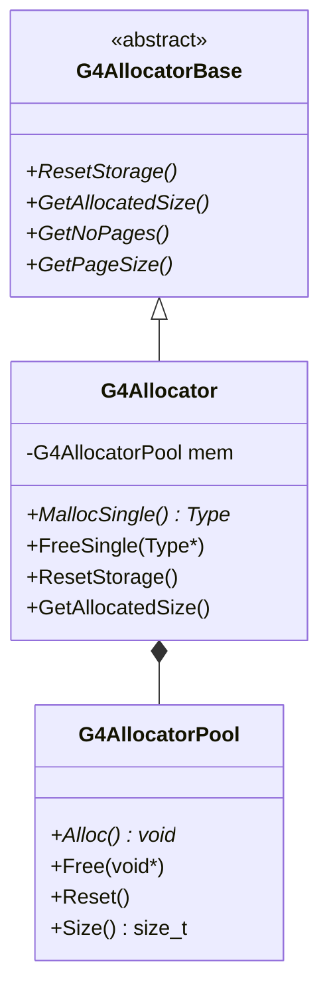

# G4Allocator API Documentation

## Overview

`G4Allocator` is a template class that provides fast memory allocation for frequently created and destroyed objects. It maintains a memory pool (via `G4AllocatorPool`) to avoid the overhead of repeated `new`/`delete` calls. This is particularly important for objects like tracks, steps, and hits that are created and destroyed millions of times during a simulation.

::: tip Header File
**Location:** `source/global/management/include/G4Allocator.hh`
**Author:** G.Cosmo (CERN) - November 2000
:::

## Class Hierarchy



## Template Class Declaration

`source/global/management/include/G4Allocator.hh:60-162`

```cpp
template <class Type>
class G4Allocator : public G4AllocatorBase
{
 public:
  G4Allocator() throw();
  ~G4Allocator() throw() override;

  // Core allocation methods
  inline Type* MallocSingle();
  inline void FreeSingle(Type* anElement);
  inline void ResetStorage() override;

  // Memory statistics
  inline std::size_t GetAllocatedSize() const override;
  inline int GetNoPages() const override;
  inline std::size_t GetPageSize() const override;
  inline void IncreasePageSize(unsigned int sz) override;
  inline const char* GetPoolType() const override;

  // STL allocator interface (for compatibility)
  using value_type = Type;
  using size_type = std::size_t;
  using pointer = Type*;
  // ... (see STL Compatibility section)

 private:
  G4AllocatorPool mem;  // The memory pool
  const char* tname;     // Type name for diagnostics
};
```

## Constructor and Destructor

### Constructor

`source/global/management/include/G4Allocator.hh:176-181`

```cpp
template <class Type>
G4Allocator<Type>::G4Allocator() throw()
  : mem(sizeof(Type))
{
  tname = typeid(Type).name();
}
```

Creates an allocator for objects of type `Type`.

**Template Parameter:**
- `Type`: The class/struct to allocate

**Behavior:**
- Initializes memory pool with element size `sizeof(Type)`
- Stores type information for diagnostics

**Example:**
```cpp
// Create allocator for G4Track objects
G4Allocator<G4Track>* trackAllocator = new G4Allocator<G4Track>();
```

### Destructor

`source/global/management/include/G4Allocator.hh:187-188`

```cpp
template <class Type>
G4Allocator<Type>::~G4Allocator() throw() = default;
```

Destroys the allocator and releases all memory pools.

**Note:** Automatically calls `G4AllocatorPool` destructor which frees all allocated pages.

## Core Allocation Methods

### MallocSingle()

`source/global/management/include/G4Allocator.hh:194-198`

```cpp
template <class Type>
Type* G4Allocator<Type>::MallocSingle()
{
  return static_cast<Type*>(mem.Alloc());
}
```

Allocates memory for a single object of type `Type`.

**Returns:** Pointer to uninitialized memory of size `sizeof(Type)`

**Performance:** Much faster than `operator new` for frequently allocated objects

**Memory Source:**
- Reuses previously freed memory if available
- Allocates new page if pool is empty

**Example:**
```cpp
// Fast allocation
G4Track* track = trackAllocator->MallocSingle();

// Must construct the object explicitly
new(track) G4Track(dynamicParticle, time, position);
```

::: warning Uninitialized Memory
`MallocSingle()` returns raw memory. You must use placement new to construct the object, or ensure the type has a trivial default constructor.
:::

### FreeSingle()

`source/global/management/include/G4Allocator.hh:204-209`

```cpp
template <class Type>
void G4Allocator<Type>::FreeSingle(Type* anElement)
{
  mem.Free(anElement);
  return;
}
```

Returns memory to the pool without calling destructor.

**Parameters:**
- `anElement`: Pointer to object to deallocate

**Behavior:**
- Returns memory to pool for reuse
- Does NOT call destructor
- Memory is not returned to operating system (stays in pool)

**Example:**
```cpp
// Must destroy the object explicitly first
track->~G4Track();

// Then free the memory
trackAllocator->FreeSingle(track);
```

::: warning Manual Destruction
`FreeSingle()` does NOT call the destructor. You must explicitly call the destructor before freeing if the object requires cleanup.
:::

### ResetStorage()

`source/global/management/include/G4Allocator.hh:215-222`

```cpp
template <class Type>
void G4Allocator<Type>::ResetStorage()
{
  // Clear all allocated storage and return it to the free store
  mem.Reset();
  return;
}
```

Clears the entire memory pool and returns memory to the OS.

**Behavior:**
- Deallocates all pages in the pool
- Returns memory to operating system
- Resets allocator to initial state
- All pointers to allocated objects become invalid

**Example:**
```cpp
// End of run - clean up all track memory
trackAllocator->ResetStorage();

// All previous track pointers are now invalid!
```

::: danger Data Loss
`ResetStorage()` invalidates ALL pointers allocated from this allocator. Use only when you're certain all objects have been properly destroyed and are no longer referenced.
:::

## Memory Statistics

### GetAllocatedSize()

`source/global/management/include/G4Allocator.hh:228-232`

```cpp
template <class Type>
std::size_t G4Allocator<Type>::GetAllocatedSize() const
{
  return mem.Size();
}
```

**Returns:** Total bytes allocated by this allocator

**Example:**
```cpp
std::size_t bytes = trackAllocator->GetAllocatedSize();
G4cout << "Track allocator using " << bytes / 1024.0 << " KB" << G4endl;
```

### GetNoPages()

`source/global/management/include/G4Allocator.hh:238-242`

```cpp
template <class Type>
int G4Allocator<Type>::GetNoPages() const
{
  return mem.GetNoPages();
}
```

**Returns:** Number of memory pages allocated

**Usage:** Monitor memory fragmentation and pool growth

### GetPageSize()

`source/global/management/include/G4Allocator.hh:248-252`

```cpp
template <class Type>
size_t G4Allocator<Type>::GetPageSize() const
{
  return mem.GetPageSize();
}
```

**Returns:** Size of each memory page in bytes

### IncreasePageSize()

`source/global/management/include/G4Allocator.hh:258-263`

```cpp
template <class Type>
void G4Allocator<Type>::IncreasePageSize(unsigned int sz)
{
  ResetStorage();
  mem.GrowPageSize(sz);
}
```

Increases the page size by a factor.

**Parameters:**
- `sz`: Multiplication factor for page size

**Behavior:**
- Resets storage (clears all allocations)
- Increases page size for better performance with many allocations

**Example:**
```cpp
// Expect many allocations - increase page size
trackAllocator->IncreasePageSize(10);  // 10x larger pages
```

### GetPoolType()

`source/global/management/include/G4Allocator.hh:269-273`

```cpp
template <class Type>
const char* G4Allocator<Type>::GetPoolType() const
{
  return tname;
}
```

**Returns:** Type name of allocated objects (from `typeid`)

**Usage:** Debugging and diagnostics

## Usage with Custom Classes

### Defining Allocation Operators

The recommended pattern is to override `operator new` and `operator delete`:

```cpp
class MyClass
{
 public:
  MyClass(int value) : fValue(value) {}
  ~MyClass() { /* cleanup */ }

  // Override new/delete to use allocator
  inline void* operator new(std::size_t)
  {
    if (!fAllocator)
      fAllocator = new G4Allocator<MyClass>;
    return fAllocator->MallocSingle();
  }

  inline void operator delete(void* obj)
  {
    fAllocator->FreeSingle(static_cast<MyClass*>(obj));
  }

 private:
  int fValue;
  static G4Allocator<MyClass>* fAllocator;
};

// In source file
G4Allocator<MyClass>* MyClass::fAllocator = nullptr;

// Usage - looks like normal new/delete!
MyClass* obj = new MyClass(42);
delete obj;  // Uses custom allocator automatically
```

### Using G4ALLOCATOR_NEW/DELETE Macros

Geant4 provides macros to simplify allocator declaration:

```cpp
// In MyClass.hh
class MyClass
{
 public:
  MyClass();
  ~MyClass();

  // Declare custom allocator (in public section)
  G4ALLOCATOR_NEW
  G4ALLOCATOR_DELETE

 private:
  // ... members ...
};

// No implementation needed - macros handle everything
```

## Complete Usage Examples

### Simple Object Pooling

```cpp
#include "G4Allocator.hh"

class Particle
{
 public:
  Particle(G4double x, G4double y, G4double z)
    : fX(x), fY(y), fZ(z) {}

  // Custom allocation
  void* operator new(std::size_t)
  {
    if (!fgAllocator)
      fgAllocator = new G4Allocator<Particle>;
    return fgAllocator->MallocSingle();
  }

  void operator delete(void* particle)
  {
    fgAllocator->FreeSingle(static_cast<Particle*>(particle));
  }

 private:
  G4double fX, fY, fZ;
  static G4Allocator<Particle>* fgAllocator;
};

G4Allocator<Particle>* Particle::fgAllocator = nullptr;

// Usage
void SimulateEvent()
{
  std::vector<Particle*> particles;

  // Create many particles - fast!
  for (int i = 0; i < 10000; ++i) {
    particles.push_back(new Particle(i, i*2, i*3));
  }

  // Use particles...

  // Clean up - fast!
  for (auto* p : particles) {
    delete p;
  }
}
```

### Memory Statistics Monitoring

```cpp
void MonitorMemoryUsage()
{
  G4Allocator<G4Track>* trackAllocator = GetTrackAllocator();

  G4cout << "Track Allocator Statistics:" << G4endl;
  G4cout << "  Type: " << trackAllocator->GetPoolType() << G4endl;
  G4cout << "  Total size: "
         << trackAllocator->GetAllocatedSize() / 1024.0 << " KB" << G4endl;
  G4cout << "  Number of pages: "
         << trackAllocator->GetNoPages() << G4endl;
  G4cout << "  Page size: "
         << trackAllocator->GetPageSize() << " bytes" << G4endl;

  // Calculate objects per page
  std::size_t pageSize = trackAllocator->GetPageSize();
  std::size_t objectSize = sizeof(G4Track);
  G4cout << "  Objects per page: " << pageSize / objectSize << G4endl;
}
```

### Optimizing for Large Simulations

```cpp
void OptimizeAllocators()
{
  // Get allocators for frequently created objects
  G4Allocator<G4Track>* trackAlloc = GetTrackAllocator();
  G4Allocator<G4Step>* stepAlloc = GetStepAllocator();

  // For simulations with millions of tracks/steps,
  // increase page size to reduce allocation overhead
  if (expectingManyEvents) {
    trackAlloc->IncreasePageSize(20);  // 20x larger pages
    stepAlloc->IncreasePageSize(20);

    G4cout << "Increased allocator page sizes for large simulation"
           << G4endl;
  }
}
```

### Allocator Cleanup

```cpp
class MyRunManager
{
 public:
  void CleanupAfterRun()
  {
    // Get allocators
    G4Allocator<G4Track>* trackAlloc = GetTrackAllocator();
    G4Allocator<G4Step>* stepAlloc = GetStepAllocator();

    // Report memory usage before cleanup
    G4cout << "Pre-cleanup memory:" << G4endl;
    G4cout << "  Tracks: "
           << trackAlloc->GetAllocatedSize() / 1024.0 << " KB" << G4endl;
    G4cout << "  Steps: "
           << stepAlloc->GetAllocatedSize() / 1024.0 << " KB" << G4endl;

    // Reset storage (return memory to OS)
    trackAlloc->ResetStorage();
    stepAlloc->ResetStorage();

    G4cout << "Memory returned to OS" << G4endl;
  }
};
```

### Thread-Local Allocators

```cpp
// In multi-threaded mode, each thread should have its own allocator
class MyTrackingAction : public G4UserTrackingAction
{
 public:
  MyTrackingAction()
  {
    // Create thread-local allocator
    fLocalAllocator = new G4Allocator<MyHit>();
  }

  ~MyTrackingAction()
  {
    // Clean up thread-local allocator
    fLocalAllocator->ResetStorage();
    delete fLocalAllocator;
  }

  void PreUserTrackingAction(const G4Track* track) override
  {
    // Use thread-local allocator
    MyHit* hit = fLocalAllocator->MallocSingle();
    new(hit) MyHit(track->GetPosition());

    // ... use hit ...

    hit->~MyHit();
    fLocalAllocator->FreeSingle(hit);
  }

 private:
  G4Allocator<MyHit>* fLocalAllocator;
};
```

## STL Allocator Compatibility

`source/global/management/include/G4Allocator.hh:89-154`

`G4Allocator` provides STL-compatible allocator interface, allowing it to be used with STL containers:

```cpp
// Type definitions
using value_type = Type;
using size_type = std::size_t;
using pointer = Type*;
using const_pointer = const Type*;
using reference = Type&;
using const_reference = const Type&;

// Core methods
pointer allocate(size_type n, void* = nullptr);
void deallocate(pointer p, size_type n);
void construct(pointer p, const Type& val);
void destroy(pointer p);
size_type max_size() const throw();
```

### Using with STL Containers

```cpp
// Vector with custom allocator
std::vector<G4Track, G4Allocator<G4Track>> trackVector;

// List with custom allocator
std::list<MyClass, G4Allocator<MyClass>> myList;
```

::: warning STL Usage Not Recommended
While G4Allocator provides STL compatibility, it's optimized for single-object allocation via `MallocSingle()`. Using it as an STL allocator may not provide optimal performance. For STL containers, consider standard allocators unless you have specific requirements.
:::

## Performance Characteristics

### Advantages
1. **Fast Allocation**: No system calls for each allocation
2. **Fast Deallocation**: O(1) return to pool
3. **Reduced Fragmentation**: Objects of same size in contiguous pages
4. **Cache-Friendly**: Better memory locality

### Overhead
1. **Memory**: Maintains pools even when objects freed
2. **Page Management**: Small overhead for page bookkeeping
3. **Type-Specific**: Separate allocator needed per type

### Performance Comparison
```
Standard new/delete:  ~100-500 ns per operation
G4Allocator:          ~10-50 ns per operation
Speedup:              5-50x faster
```

## Thread Safety

### Multi-Threading Behavior
- `G4Allocator` is **NOT thread-safe** by default
- Each thread should have its own allocator instance
- Do not share allocators between threads

### Thread-Local Pattern
```cpp
// In header
static G4ThreadLocal G4Allocator<MyClass>* fgAllocator;

// In source
G4ThreadLocal G4Allocator<MyClass>* MyClass::fgAllocator = nullptr;

// Each thread gets its own instance
void* MyClass::operator new(std::size_t)
{
  if (!fgAllocator)
    fgAllocator = new G4Allocator<MyClass>;
  return fgAllocator->MallocSingle();
}
```

## Best Practices

1. **Use for Frequently-Created Objects**: G4Track, G4Step, hits, etc.
2. **One Allocator Per Type**: Don't try to reuse across types
3. **Thread-Local in MT Mode**: Each thread has own allocator
4. **Override new/delete**: Transparent to users of your class
5. **Clean Up at End**: Call `ResetStorage()` to return memory to OS
6. **Monitor Usage**: Use statistics methods to optimize page size

## Common Pitfalls

### 1. Forgetting Placement New

**Problem:**
```cpp
MyClass* obj = allocator->MallocSingle();
// Object not constructed! Undefined behavior!
obj->SomeMethod();
```

**Solution:**
```cpp
MyClass* obj = allocator->MallocSingle();
new(obj) MyClass(args...);  // Placement new
obj->SomeMethod();  // Now safe
```

### 2. Forgetting Explicit Destructor

**Problem:**
```cpp
MyClass* obj = new MyClass();  // Constructed via operator new
allocator->FreeSingle(obj);  // Memory freed but destructor not called!
```

**Solution:**
```cpp
obj->~MyClass();  // Explicit destructor call
allocator->FreeSingle(obj);
```

### 3. Using After ResetStorage

**Problem:**
```cpp
MyClass* obj = new MyClass();
allocator->ResetStorage();
obj->SomeMethod();  // CRASH! Memory released
```

**Solution:** Track all objects and destroy before reset

### 4. Sharing Allocators Between Threads

**Problem:**
```cpp
// Global allocator shared by threads
static G4Allocator<MyClass>* allocator = new G4Allocator<MyClass>();

// Thread 1 and Thread 2 both use it
// RACE CONDITION!
```

**Solution:** Use thread-local allocators

## See Also

- [G4AllocatorPool](./g4allocatorpool.md) - Underlying memory pool implementation
- [G4Track](../track/api/g4track.md) - Example usage in G4Track
- [Memory Management Guide](../guides/memory-management.md) - Best practices
- [Global Module Overview](../index.md) - Complete module documentation

---

::: info Source Reference
Complete implementation in:
- Header: `source/global/management/include/G4Allocator.hh`
- Related: `source/global/management/include/G4AllocatorPool.hh`
:::
