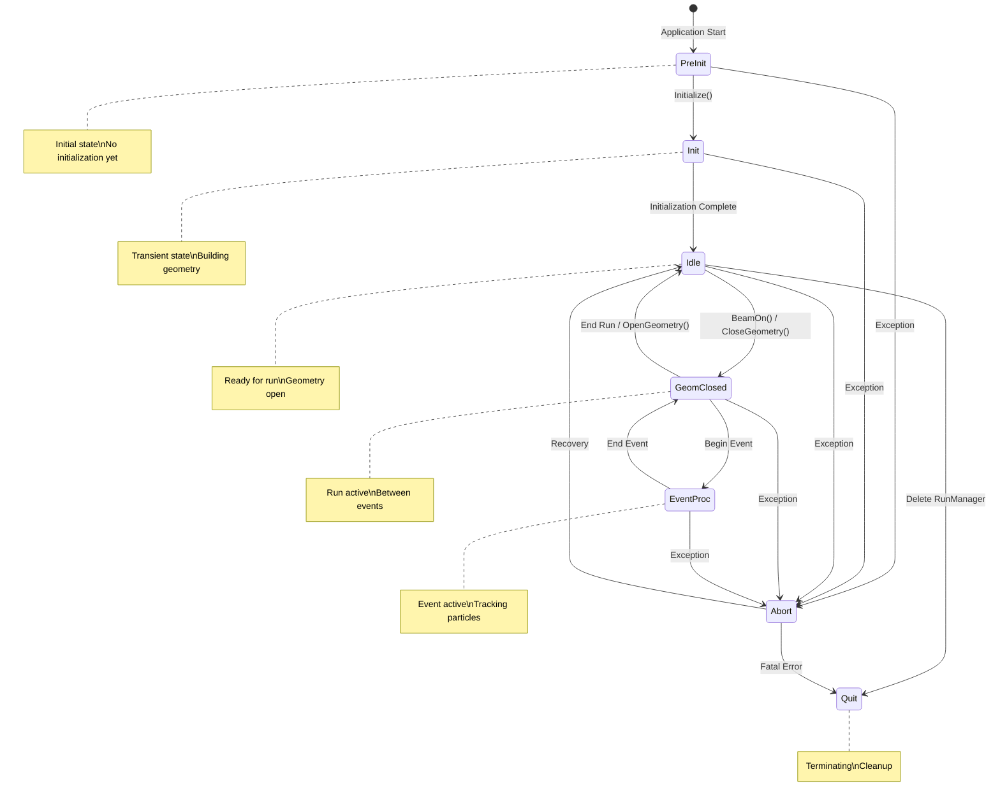

# G4ApplicationState API Documentation

## Overview

`G4ApplicationState` is an enumeration that defines all possible states of a Geant4 application during its lifecycle. The application state controls what operations are valid at any given time and ensures that geometry modifications, run initialization, and event processing occur in the correct sequence.

::: tip Header File
**Location:** `source/global/management/include/G4ApplicationState.hh`
:::

## Enumeration Definition

`source/global/management/include/G4ApplicationState.hh:82-91`

```cpp
enum G4ApplicationState
{
  G4State_PreInit,
  G4State_Init,
  G4State_Idle,
  G4State_GeomClosed,
  G4State_EventProc,
  G4State_Quit,
  G4State_Abort
};
```

## State Descriptions

### G4State_PreInit

`source/global/management/include/G4ApplicationState.hh:33-38`

**Meaning:** Pre-initialization state at application startup

**When Active:**
- From program start until `G4Initializer::Initialize()` is called
- Before any materials, geometry, particles, or physics processes are initialized

**Valid Operations:**
- Creating geometry
- Defining materials
- Setting up detector construction
- Registering physics lists

**Restrictions:**
- Cannot start runs
- Cannot generate events
- No particles or physics processes available yet

**Example:**
```cpp
int main()
{
    // State is G4State_PreInit here
    G4RunManager* runManager = new G4RunManager();

    // Still in PreInit - can modify geometry freely
    runManager->SetUserInitialization(new MyDetectorConstruction());
    runManager->SetUserInitialization(new MyPhysicsList());

    // Calling Initialize() will transition to Init state
}
```

### G4State_Init

`source/global/management/include/G4ApplicationState.hh:39-42`

**Meaning:** Initialization in progress

**When Active:**
- During execution of `G4Initializer::Initialize()`
- While geometry is being built
- While physics tables are being constructed

**Automatic Transition:**
- From: `G4State_PreInit` (when Initialize() called)
- To: `G4State_Idle` (when initialization complete)

**Valid Operations:**
- Internal initialization processes
- Building geometry
- Creating materials
- Initializing physics

**Restrictions:**
- User code should not be executing
- State is transient - typically very short duration

**Example:**
```cpp
// User calls Initialize
runManager->Initialize();  // State: PreInit -> Init -> Idle
```

### G4State_Idle

`source/global/management/include/G4ApplicationState.hh:43-49`

**Meaning:** Ready to start a run

**When Active:**
- After successful initialization
- Between runs
- When geometry is "open" (can be modified)

**Valid Operations:**
- Starting a new run with `BeamOn()`
- Modifying geometry (limited - see notes)
- Changing physics settings (with care)
- Accessing initialized data

**Restrictions:**
- Cannot directly modify geometry that affects already-created volumes
- Some physics changes require re-initialization

**Example:**
```cpp
// After Initialize(), state is Idle
G4StateManager* stateManager = G4StateManager::GetStateManager();
if (stateManager->GetCurrentState() == G4State_Idle) {
    // Ready to start run
    runManager->BeamOn(100);
}

// After run completes, returns to Idle
```

### G4State_GeomClosed

`source/global/management/include/G4ApplicationState.hh:50-55`

**Meaning:** Geometry is closed for a run (but no event in progress)

**When Active:**
- From `G4GeometryManager::CloseGeometry()` until `OpenGeometry()`
- During a run, between events
- After each event completes, before next event starts

**Valid Operations:**
- Starting new events
- Accessing geometry (read-only)
- Physics processes can operate
- Scoring and analysis

**Restrictions:**
- **Cannot modify geometry** (closed for optimization)
- Cannot change materials
- Cannot alter physics setup

**Example:**
```cpp
// During BeamOn(), state transitions:
// Idle -> GeomClosed (geometry closed for run)
//   GeomClosed -> EventProc (start event)
//   EventProc -> GeomClosed (end event)
//   ... repeat for each event ...
// GeomClosed -> Idle (geometry reopened at end)
```

### G4State_EventProc

`source/global/management/include/G4ApplicationState.hh:56-57`

**Meaning:** Processing an event

**When Active:**
- From construction of `G4Event` until `G4EventManager::ProcessOneEvent()` completes
- During primary particle generation
- During tracking
- During sensitive detector response

**Valid Operations:**
- Tracking particles
- Recording hits
- Generating secondaries
- Calling user actions (Tracking, Stepping, Stacking)
- Aborting current event

**Restrictions:**
- **Cannot modify geometry**
- **Cannot start new run**
- **Cannot change physics tables**
- Limited modifications to event data

**Example:**
```cpp
void MySteppingAction::UserSteppingAction(const G4Step* step)
{
    // State is G4State_EventProc during this call
    G4StateManager* stateManager = G4StateManager::GetStateManager();
    assert(stateManager->GetCurrentState() == G4State_EventProc);

    // Can analyze event, abort if needed
    if (criticalCondition) {
        G4EventManager::GetEventManager()->AbortCurrentEvent();
    }
}
```

### G4State_Quit

`source/global/management/include/G4ApplicationState.hh:59`

**Meaning:** Application is terminating

**When Active:**
- When `G4RunManager` destructor is invoked
- During final cleanup

**Valid Operations:**
- Cleanup and deallocation
- Writing final output
- Closing files

**Restrictions:**
- Cannot start new runs
- Cannot process events
- Should not attempt geometry operations

**Example:**
```cpp
int main()
{
    G4RunManager* runManager = new G4RunManager();

    // ... run simulation ...

    delete runManager;  // State transitions to Quit
    // All cleanup happens here

    return 0;
}
```

### G4State_Abort

`source/global/management/include/G4ApplicationState.hh:60-61`

**Meaning:** Application encountered an error

**When Active:**
- When `G4Exception` is invoked with severe error
- After unrecoverable error occurs

**Recovery:**
- Can transition back to `G4State_Idle` if error is recoverable
- May lead to `G4State_Quit` for fatal errors

**Valid Operations:**
- Error logging
- State recovery attempts
- Controlled shutdown

**Example:**
```cpp
// When severe error occurs
G4Exception("MyClass::MyMethod()", "ErrorCode001",
           FatalException, "Critical error occurred");

// State automatically transitions to Abort
// May call abort() or return to Idle depending on configuration
```

## State Transition Diagram

`source/global/management/include/G4ApplicationState.hh:64-76`



## ASCII State Diagram

From header file comments:

```
  PreInit
    |
    v
  Init
    |
    v
  Idle ------> Quit
    |^
    v|
  GeomClosed (at each run)
    |^
    v|
  EventProc (at each event)
```

## Usage Examples

### Checking Current State

```cpp
#include "G4StateManager.hh"
#include "G4ApplicationState.hh"

void CheckState()
{
    G4StateManager* stateManager = G4StateManager::GetStateManager();
    G4ApplicationState currentState = stateManager->GetCurrentState();

    switch(currentState) {
        case G4State_PreInit:
            G4cout << "Pre-initialization" << G4endl;
            break;
        case G4State_Init:
            G4cout << "Initializing" << G4endl;
            break;
        case G4State_Idle:
            G4cout << "Ready to run" << G4endl;
            break;
        case G4State_GeomClosed:
            G4cout << "Run in progress" << G4endl;
            break;
        case G4State_EventProc:
            G4cout << "Processing event" << G4endl;
            break;
        case G4State_Quit:
            G4cout << "Terminating" << G4endl;
            break;
        case G4State_Abort:
            G4cout << "Error state" << G4endl;
            break;
    }
}
```

### State-Dependent Operations

```cpp
void ModifyGeometry()
{
    G4StateManager* stateManager = G4StateManager::GetStateManager();
    G4ApplicationState state = stateManager->GetCurrentState();

    // Check if geometry modification is safe
    if (state != G4State_PreInit && state != G4State_Idle) {
        G4cerr << "ERROR: Cannot modify geometry in state: "
               << stateManager->GetStateString(state) << G4endl;
        G4Exception("ModifyGeometry()", "InvalidState",
                   FatalException,
                   "Geometry modification only allowed in PreInit or Idle");
        return;
    }

    // Safe to modify
    UpdateDetectorGeometry();
}
```

### Waiting for Correct State

```cpp
G4bool WaitForIdleState(G4int maxAttempts = 100)
{
    G4StateManager* stateManager = G4StateManager::GetStateManager();

    for (G4int i = 0; i < maxAttempts; ++i) {
        G4ApplicationState state = stateManager->GetCurrentState();

        if (state == G4State_Idle) {
            return true;
        }

        if (state == G4State_Quit || state == G4State_Abort) {
            return false;  // Can't reach Idle from these states
        }

        // Wait a bit and check again
        std::this_thread::sleep_for(std::chrono::milliseconds(10));
    }

    return false;  // Timeout
}
```

### State-Based User Action

```cpp
class MyEventAction : public G4UserEventAction
{
 public:
  void BeginOfEventAction(const G4Event* event) override
  {
    // Verify we're in the correct state
    G4StateManager* stateManager = G4StateManager::GetStateManager();

    // Should be in EventProc state
    assert(stateManager->GetCurrentState() == G4State_EventProc);

    // Initialize per-event data
    InitializeEventData();
  }

  void EndOfEventAction(const G4Event* event) override
  {
    // Still in EventProc state here
    ProcessEventData();

    // After this returns, state transitions back to GeomClosed
  }
};
```

### Implementing State-Dependent Class

```cpp
class GeometryModifier : public G4VStateDependent
{
 public:
  G4bool Notify(G4ApplicationState requestedState) override
  {
    G4StateManager* stateManager = G4StateManager::GetStateManager();
    G4ApplicationState currentState = stateManager->GetCurrentState();

    // React to state changes
    if (currentState == G4State_Idle &&
        requestedState == G4State_GeomClosed) {
        // Run is starting - geometry will be closed
        G4cout << "Geometry will be closed for run" << G4endl;
        FinalizeGeometry();
    }

    if (currentState == G4State_GeomClosed &&
        requestedState == G4State_Idle) {
        // Run is ending - geometry will be opened
        G4cout << "Geometry opened after run" << G4endl;
        AllowGeometryModifications();
    }

    return true;  // Allow state change
  }

 private:
  void FinalizeGeometry() { /* ... */ }
  void AllowGeometryModifications() { /* ... */ }
};

// Register with state manager
GeometryModifier* modifier = new GeometryModifier();
G4StateManager::GetStateManager()->RegisterDependent(modifier);
```

### Complete Application Lifecycle

```cpp
int main(int argc, char** argv)
{
    // STATE: PreInit
    G4cout << "Application starting (PreInit)" << G4endl;

    // Create run manager
    G4RunManager* runManager = new G4RunManager();

    // Setup (still PreInit)
    runManager->SetUserInitialization(new MyDetectorConstruction());
    runManager->SetUserInitialization(new MyPhysicsList());
    runManager->SetUserAction(new MyPrimaryGeneratorAction());

    // STATE: PreInit -> Init -> Idle
    G4cout << "Initializing..." << G4endl;
    runManager->Initialize();
    G4cout << "Initialization complete (Idle)" << G4endl;

    // STATE: Idle -> GeomClosed -> EventProc -> ... -> Idle
    G4cout << "Starting run..." << G4endl;
    runManager->BeamOn(1000);
    G4cout << "Run complete (Idle)" << G4endl;

    // STATE: Idle -> Quit
    G4cout << "Terminating..." << G4endl;
    delete runManager;

    return 0;
}
```

## State Requirements by Operation

| Operation | Required State(s) | Notes |
|-----------|------------------|-------|
| Define materials | PreInit, Idle | Preferably PreInit |
| Build geometry | PreInit, Init | Modified in Idle with restrictions |
| Initialize physics | Init | Automatic during initialization |
| Start run | Idle | Transitions to GeomClosed |
| Generate primaries | EventProc | During event processing |
| Track particles | EventProc | Automatic |
| Record hits | EventProc | In sensitive detectors |
| Abort event | EventProc | User action |
| End run | GeomClosed | Returns to Idle |
| Terminate | Any | Transitions to Quit |

## Comparison with Other States

### Idle vs PreInit
- **PreInit**: Nothing initialized yet; complete freedom to define everything
- **Idle**: Geometry and physics initialized; some restrictions on modifications

### GeomClosed vs EventProc
- **GeomClosed**: Between events; can start new event but geometry is locked
- **EventProc**: Event in progress; actively tracking particles

### Abort vs Quit
- **Abort**: Error recovery state; may return to Idle
- **Quit**: Normal termination; application ending

## Thread Safety

In multi-threaded mode:
- **Master Thread**: Goes through PreInit → Init → Idle → Quit
- **Worker Threads**: Cycle through GeomClosed ↔ EventProc repeatedly
- Each thread has independent state via `G4StateManager`

**Example:**
```cpp
// In worker thread
void WorkerRunManager::DoEventLoop(G4int n_event)
{
    // Worker starts in GeomClosed state
    for (G4int i = 0; i < n_event; ++i) {
        // State: GeomClosed -> EventProc
        ProcessOneEvent(i);
        // State: EventProc -> GeomClosed
    }
}
```

## Best Practices

1. **Always Check State**: Before operations that depend on specific states
2. **Use State Manager**: Don't try to track state manually
3. **Handle Abort**: Implement graceful recovery from Abort state
4. **Respect Restrictions**: Don't modify geometry in GeomClosed/EventProc
5. **Use State Dependents**: For automatic notification of state changes

## Common Pitfalls

### 1. Modifying Geometry During Run

**Problem:**
```cpp
// During event processing (EventProc state)
myDetector->ChangePosition(newPos);  // CRASH or corruption!
```

**Solution:** Only modify in PreInit or Idle states

### 2. Not Checking State

**Problem:**
```cpp
runManager->BeamOn(100);  // What if not in Idle state?
```

**Solution:**
```cpp
if (stateManager->GetCurrentState() == G4State_Idle) {
    runManager->BeamOn(100);
}
```

### 3. Assuming State After Exception

**Problem:**
```cpp
try {
    riskyOperation();
} catch (...) {
    // State might be Abort now!
    continueNormally();  // Might fail
}
```

**Solution:**
```cpp
if (stateManager->GetCurrentState() == G4State_Abort) {
    stateManager->SetNewState(G4State_Idle);  // Recovery
}
```

## See Also

- [G4StateManager](./g4statemanager.md) - State management class
- [G4RunManager](../run/api/g4runmanager.md) - Run control
- [G4VStateDependent](./g4vstatedependent.md) - State-dependent objects
- [Global Module Overview](../index.md) - Complete module documentation

---

::: info Source Reference
Complete implementation in:
- Header: `source/global/management/include/G4ApplicationState.hh`

This is a pure enumeration with no source file.
:::
