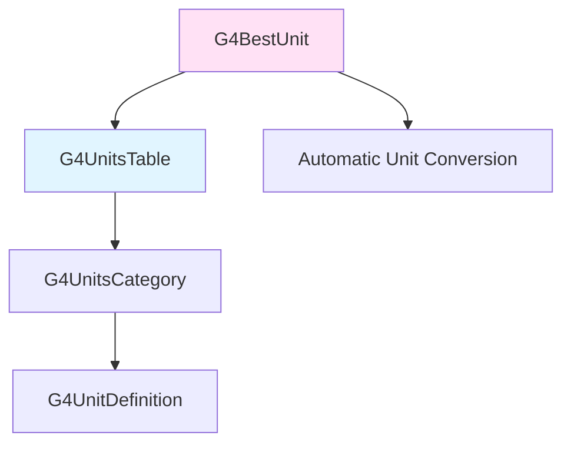

# G4UnitsTable API Documentation

## Overview

The `G4UnitsTable` system provides a comprehensive units management framework for Geant4. It allows physical quantities to be expressed in various units within the same dimensional category (Length, Time, Energy, etc.) and provides automatic conversion to the most appropriate unit for display. The system consists of three main classes: `G4UnitDefinition`, `G4UnitsCategory`, and `G4BestUnit`.

::: tip Header File
**Location:** `source/global/management/include/G4UnitsTable.hh`
**Authors:** M.Maire (1998), G.Cosmo (2001)
:::

## System Architecture



The units table is organized hierarchically:
- **G4UnitsTable**: Global table containing all unit categories
- **G4UnitsCategory**: Dimensional family (Length, Energy, Time, etc.)
- **G4UnitDefinition**: Individual unit (mm, cm, m, km, etc.)
- **G4BestUnit**: Helper class for automatic unit selection

## G4UnitDefinition Class

### Constructor

`source/global/management/include/G4UnitsTable.hh:77-78`

```cpp
G4UnitDefinition(const G4String& name, const G4String& symbol,
                 const G4String& category, G4double value);
```

Creates a new unit definition and registers it in the units table.

**Parameters:**
- `name`: Full name of the unit (e.g., "millimeter")
- `symbol`: Short symbol (e.g., "mm")
- `category`: Dimensional category (e.g., "Length")
- `value`: Conversion factor to internal units

**Example:**
```cpp
// Define a custom unit: 1 inch = 25.4 mm
new G4UnitDefinition("inch", "in", "Length", 25.4*mm);

// Define energy unit: 1 eV in internal units
new G4UnitDefinition("electronvolt", "eV", "Energy", 1.0*eV);
```

::: warning Registration
Constructor automatically registers the unit in the global units table. Units should only be defined once.
:::

### Accessors

#### GetName()
`source/global/management/include/G4UnitsTable.hh:84`

```cpp
inline const G4String& GetName() const;
```

**Returns:** Full name of the unit

#### GetSymbol()
`source/global/management/include/G4UnitsTable.hh:85`

```cpp
inline const G4String& GetSymbol() const;
```

**Returns:** Short symbol of the unit

#### GetValue()
`source/global/management/include/G4UnitsTable.hh:86`

```cpp
inline G4double GetValue() const;
```

**Returns:** Conversion factor to internal units

**Example:**
```cpp
G4double mmValue = G4UnitDefinition::GetValueOf("mm");
G4double length = 10.0;  // in internal units
G4double lengthInMm = length / mmValue;
```

### Static Methods

#### BuildUnitsTable()
`source/global/management/include/G4UnitsTable.hh:90`

```cpp
static void BuildUnitsTable();
```

Builds the default units table with standard SI and common units.

**Categories Created:**
- Length
- Area
- Volume
- Angle
- Solid angle
- Time
- Frequency
- Energy
- Mass
- Power
- Force
- Pressure
- Electric charge
- Electric potential
- Electric field
- Magnetic flux
- Magnetic flux density
- Temperature
- Amount of substance
- Activity
- Dose

#### PrintUnitsTable()
`source/global/management/include/G4UnitsTable.hh:91`

```cpp
static void PrintUnitsTable();
```

Prints all units in all categories to `G4cout`.

**Example Output:**
```
Category: Length
  millimeter (mm)   : 1
  centimeter (cm)   : 10
  meter (m)         : 1000
  kilometer (km)    : 1e+06
```

#### ClearUnitsTable()
`source/global/management/include/G4UnitsTable.hh:92`

```cpp
static void ClearUnitsTable();
```

Deletes all unit definitions and categories. Used during cleanup.

#### GetUnitsTable()
`source/global/management/include/G4UnitsTable.hh:94`

```cpp
static G4UnitsTable& GetUnitsTable();
```

**Returns:** Reference to the global units table

::: tip Thread Safety
In multithreaded mode, each thread has its own units table. Changes to one thread's table don't affect others.
:::

#### IsUnitDefined()
`source/global/management/include/G4UnitsTable.hh:96`

```cpp
static G4bool IsUnitDefined(const G4String&);
```

**Parameters:**
- Unit symbol or name to check

**Returns:** `true` if unit exists in table

**Example:**
```cpp
if (G4UnitDefinition::IsUnitDefined("GeV")) {
    G4cout << "GeV is defined" << G4endl;
}
```

#### GetValueOf()
`source/global/management/include/G4UnitsTable.hh:97`

```cpp
static G4double GetValueOf(const G4String&);
```

**Parameters:**
- Unit symbol or name

**Returns:** Conversion factor for the unit

**Example:**
```cpp
// Convert energy from internal units to GeV
G4double energy = 1000.0;  // in MeV (internal)
G4double geVValue = G4UnitDefinition::GetValueOf("GeV");
G4double energyInGeV = energy / geVValue;
```

#### GetCategory()
`source/global/management/include/G4UnitsTable.hh:98`

```cpp
static G4String GetCategory(const G4String&);
```

**Parameters:**
- Unit symbol or name

**Returns:** Category name of the unit

**Example:**
```cpp
G4String cat = G4UnitDefinition::GetCategory("mm");
// Returns "Length"
```

### Print Method

#### PrintDefinition()
`source/global/management/include/G4UnitsTable.hh:88`

```cpp
void PrintDefinition();
```

Prints this unit's definition to `G4cout`.

## G4UnitsCategory Class

Represents a dimensional family of units (all units with the same dimension).

### Constructor

`source/global/management/include/G4UnitsTable.hh:132`

```cpp
explicit G4UnitsCategory(const G4String& name);
```

**Parameters:**
- `name`: Category name (e.g., "Length", "Energy")

### Accessors

#### GetName()
`source/global/management/include/G4UnitsTable.hh:137`

```cpp
inline const G4String& GetName() const;
```

**Returns:** Category name

#### GetUnitsList()
`source/global/management/include/G4UnitsTable.hh:138`

```cpp
inline G4UnitsContainer& GetUnitsList();
```

**Returns:** Reference to vector of unit definitions in this category

#### GetNameMxLen() / GetSymbMxLen()
`source/global/management/include/G4UnitsTable.hh:139-140`

```cpp
inline G4int GetNameMxLen() const;
inline G4int GetSymbMxLen() const;
```

**Returns:** Maximum length of unit names/symbols (for formatting)

### Print Method

#### PrintCategory()
`source/global/management/include/G4UnitsTable.hh:143`

```cpp
void PrintCategory();
```

Prints all units in this category.

## G4BestUnit Class

Automatically converts a physical quantity to the most appropriate unit in its category.

### Constructors

`source/global/management/include/G4UnitsTable.hh:161-165`

```cpp
G4BestUnit(G4double internalValue, const G4String& category);
G4BestUnit(const G4ThreeVector& internalValue, const G4String& category);
```

Creates a best-unit representation of a value.

**Parameters:**
- `internalValue`: Value in Geant4 internal units (scalar or 3-vector)
- `category`: Unit category ("Length", "Energy", "Time", etc.)

**Example:**
```cpp
G4double energy = 1234.5 * MeV;
G4BestUnit bestEnergy(energy, "Energy");
G4cout << "Energy: " << bestEnergy << G4endl;
// Output: "Energy: 1.2345 GeV" (automatically chose GeV)

G4ThreeVector position(1.5*m, 2.3*m, 0.45*m);
G4BestUnit bestPos(position, "Length");
G4cout << "Position: " << bestPos << G4endl;
// Output: "Position: (150, 230, 45) cm"
```

### Accessors

#### GetValue()
`source/global/management/include/G4UnitsTable.hh:169`

```cpp
inline G4double* GetValue();
```

**Returns:** Pointer to converted value array (size 1 or 3)

#### GetCategory()
`source/global/management/include/G4UnitsTable.hh:170`

```cpp
inline const G4String& GetCategory() const;
```

**Returns:** Category name

#### GetIndexOfCategory()
`source/global/management/include/G4UnitsTable.hh:171`

```cpp
inline std::size_t GetIndexOfCategory() const;
```

**Returns:** Index of category in units table

### Conversion Operators

#### operator G4String()
`source/global/management/include/G4UnitsTable.hh:172`

```cpp
operator G4String() const;
```

Converts the best unit to a formatted string.

#### operator<<
`source/global/management/include/G4UnitsTable.hh:174`

```cpp
friend std::ostream& operator<<(std::ostream&, const G4BestUnit& VU);
```

Stream insertion operator for easy printing.

## G4UnitsTable Container

### In Single-Threaded Mode

`source/global/management/include/G4UnitsTable.hh:68`

```cpp
using G4UnitsTable = std::vector<G4UnitsCategory*>;
```

Simple typedef to vector of category pointers.

### In Multi-Threaded Mode

`source/global/management/include/G4UnitsTable.hh:55-65`

```cpp
class G4UnitsTable : public std::vector<G4UnitsCategory*>
{
 public:
  G4UnitsTable() = default;
  ~G4UnitsTable();

  void Synchronize();
  G4bool Contains(const G4UnitDefinition*, const G4String&);
};
```

#### Synchronize()
`source/global/management/include/G4UnitsTable.hh:63`

Synchronizes thread-local units table with master thread.

#### Contains()
`source/global/management/include/G4UnitsTable.hh:64`

Checks if a unit definition exists in the table.

## Comprehensive Units Reference

### Length
- **picometer (pm)**: 1e-9 mm
- **nanometer (nm)**: 1e-6 mm
- **micrometer (um)**: 1e-3 mm
- **millimeter (mm)**: 1 (internal unit)
- **centimeter (cm)**: 10 mm
- **meter (m)**: 1000 mm
- **kilometer (km)**: 1e6 mm
- **parsec (pc)**: 3.0857e19 mm
- **angstrom (Ang)**: 1e-7 mm
- **fermi (fm)**: 1e-12 mm

### Area
- **millimeter2 (mm2)**: 1
- **centimeter2 (cm2)**: 100
- **meter2 (m2)**: 1e6
- **kilometer2 (km2)**: 1e12
- **barn (barn)**: 1e-22
- **millibarn (mbarn)**: 1e-25
- **microbarn (mubarn)**: 1e-28
- **nanobarn (nbarn)**: 1e-31
- **picobarn (pbarn)**: 1e-34

### Volume
- **millimeter3 (mm3)**: 1
- **centimeter3 (cm3)**: 1000
- **meter3 (m3)**: 1e9
- **liter (L)**: 1e6
- **milliliter (mL)**: 1000

### Angle
- **radian (rad)**: 1 (internal unit)
- **milliradian (mrad)**: 0.001
- **degree (deg)**: π/180
- **arcminute (arcmin)**: π/10800
- **arcsecond (arcsec)**: π/648000

### Time
- **nanosecond (ns)**: 1 (internal unit)
- **picosecond (ps)**: 0.001
- **microsecond (us)**: 1000
- **millisecond (ms)**: 1e6
- **second (s)**: 1e9
- **minute (min)**: 6e10
- **hour (h)**: 3.6e12
- **day (d)**: 8.64e13
- **year (y)**: 3.1536e16

### Energy
- **electronvolt (eV)**: 1e-6 MeV
- **kiloelectronvolt (keV)**: 0.001 MeV
- **megaelectronvolt (MeV)**: 1 (internal unit)
- **gigaelectronvolt (GeV)**: 1000 MeV
- **teraelectronvolt (TeV)**: 1e6 MeV
- **petaelectronvolt (PeV)**: 1e9 MeV
- **joule (J)**: 6.24150e12 MeV

### Mass
- **milligram (mg)**: 1.78266e-24 MeV/c²
- **gram (g)**: 1.78266e-21 MeV/c²
- **kilogram (kg)**: 1.78266e-18 MeV/c²

### Electric Charge
- **coulomb (C)**: 6.24151e18 e
- **elementarycharge (e)**: 1 (internal unit)

### Electric Potential
- **volt (V)**: 1
- **kilovolt (kV)**: 1000
- **megavolt (MV)**: 1e6

### Magnetic Flux Density
- **tesla (T)**: 1000 (internal unit)
- **gauss (G)**: 1
- **kilogauss (kG)**: 1000

### Activity (Radioactivity)
- **becquerel (Bq)**: 1/s
- **curie (Ci)**: 3.7e10 Bq
- **millicurie (mCi)**: 3.7e7 Bq
- **microcurie (uCi)**: 3.7e4 Bq

### Dose
- **gray (Gy)**: 1 J/kg
- **kilogray (kGy)**: 1000 Gy
- **milligray (mGy)**: 0.001 Gy
- **microgray (uGy)**: 1e-6 Gy

## Usage Examples

### Basic Unit Conversion

```cpp
// Define a length in millimeters (internal unit)
G4double length = 15.3;  // 15.3 mm

// Convert to centimeters
G4double cmValue = G4UnitDefinition::GetValueOf("cm");
G4double lengthInCm = length / cmValue;
G4cout << length << " mm = " << lengthInCm << " cm" << G4endl;

// Convert to meters
G4double lengthInM = length / G4UnitDefinition::GetValueOf("m");
G4cout << length << " mm = " << lengthInM << " m" << G4endl;
```

### Using G4BestUnit for Automatic Formatting

```cpp
void PrintEventSummary(G4double energy, G4double time, G4ThreeVector pos)
{
    G4cout << "Event Summary:" << G4endl;
    G4cout << "  Energy: " << G4BestUnit(energy, "Energy") << G4endl;
    G4cout << "  Time:   " << G4BestUnit(time, "Time") << G4endl;
    G4cout << "  Position: " << G4BestUnit(pos, "Length") << G4endl;
}

// Example call:
// Energy = 2500 MeV, time = 15000 ns, position = (500, 1200, 350) mm
// Output:
//   Energy: 2.5 GeV
//   Time:   15 us
//   Position: (50, 120, 35) cm
```

### Defining Custom Units

```cpp
void DefineCustomUnits()
{
    // Define astronomical unit (AU)
    new G4UnitDefinition("astronomical_unit", "AU", "Length",
                        1.496e14 * mm);

    // Define light-year
    new G4UnitDefinition("light_year", "ly", "Length",
                        9.461e18 * mm);

    // Define custom energy unit (Hartree)
    new G4UnitDefinition("hartree", "Eh", "Energy",
                        27.211 * eV);

    // Test the new units
    G4double distance = 1.5e14 * mm;
    G4cout << "Distance: " << G4BestUnit(distance, "Length") << G4endl;
    // Will automatically select AU if appropriate
}
```

### Working with Unit Categories

```cpp
void ListEnergyUnits()
{
    G4UnitsTable& table = G4UnitDefinition::GetUnitsTable();

    // Find the Energy category
    for (auto* category : table) {
        if (category->GetName() == "Energy") {
            G4cout << "Energy units available:" << G4endl;

            G4UnitsContainer& units = category->GetUnitsList();
            for (auto* unit : units) {
                G4cout << "  " << unit->GetSymbol()
                       << " (" << unit->GetName() << ")"
                       << " = " << unit->GetValue() << " MeV"
                       << G4endl;
            }
            break;
        }
    }
}
```

### Conversion Helper Function

```cpp
G4double ConvertUnit(G4double value, const G4String& fromUnit,
                     const G4String& toUnit)
{
    // Get conversion factors
    G4double fromValue = G4UnitDefinition::GetValueOf(fromUnit);
    G4double toValue = G4UnitDefinition::GetValueOf(toUnit);

    // Convert: value * fromUnit = internalValue
    //         internalValue / toValue = result in toUnit
    return value * fromValue / toValue;
}

// Example usage:
G4double energyInEv = 1000.0;
G4double energyInMeV = ConvertUnit(energyInEv, "eV", "MeV");
// Result: 0.001 MeV
```

### Formatted Output in Data Analysis

```cpp
void AnalyzeTrack(const G4Track* track)
{
    G4double kinE = track->GetKineticEnergy();
    G4double time = track->GetGlobalTime();
    G4ThreeVector pos = track->GetPosition();
    G4ThreeVector mom = track->GetMomentum();

    G4cout << "Track Analysis:" << G4endl
           << "  Particle: " << track->GetParticleDefinition()->GetParticleName()
           << G4endl
           << "  Kinetic Energy: " << G4BestUnit(kinE, "Energy") << G4endl
           << "  Momentum: " << G4BestUnit(mom, "Energy") << G4endl
           << "  Position: " << G4BestUnit(pos, "Length") << G4endl
           << "  Time: " << G4BestUnit(time, "Time") << G4endl;
}
```

## Thread Safety

### Single-Threaded Mode
The global units table is shared across the entire application. Units should be defined during initialization.

### Multi-Threaded Mode
`source/global/management/include/G4UnitsTable.hh:109, 115`

- Each worker thread has its own thread-local units table
- The master thread maintains a shadow copy
- `Synchronize()` method copies units from shadow to thread-local table
- Units defined in one thread don't automatically propagate to others

**Best Practices:**
```cpp
// In main thread, before creating run manager
G4UnitDefinition::BuildUnitsTable();

// Define any custom units BEFORE starting workers
new G4UnitDefinition("custom_unit", "cu", "Length", 100*mm);

// Workers automatically get a copy of the units table
```

## Performance Considerations

1. **Unit Lookup**: `GetValueOf()` performs a linear search through categories and units. Cache frequently used conversion factors.

2. **G4BestUnit**: Creates temporary objects. For high-frequency operations, perform manual conversion.

3. **String Comparisons**: Unit lookup uses string comparison. Use numeric constants when possible:
   ```cpp
   // Fast
   G4double energy = 10 * MeV;

   // Slower (runtime string lookup)
   G4double energy = 10 * G4UnitDefinition::GetValueOf("MeV");
   ```

4. **Initialization**: Call `BuildUnitsTable()` once during initialization, not repeatedly.

## Common Pitfalls

### 1. Forgetting Internal Units

**Problem**: Assuming values are in different units
```cpp
G4double energy = 10;  // What units?
```

**Solution**: Always use internal units or explicit conversion
```cpp
G4double energy = 10 * MeV;  // Clear!
```

### 2. Wrong Category Name

**Problem**: Using wrong category with G4BestUnit
```cpp
G4BestUnit(energy, "Power");  // Wrong! Energy is not Power
```

**Solution**: Use correct category names (case-sensitive)
```cpp
G4BestUnit(energy, "Energy");  // Correct
```

### 3. Division vs Multiplication

**Problem**: Confusing direction of conversion
```cpp
// Wrong: multiplies instead of divides
G4double lengthInCm = length * G4UnitDefinition::GetValueOf("cm");
```

**Solution**: Divide to convert from internal units
```cpp
G4double lengthInCm = length / G4UnitDefinition::GetValueOf("cm");
```

## See Also

- [G4SystemOfUnits](./g4systemofunits.md) - Constants for standard units
- [G4PhysicalConstants](./g4physicalconstants.md) - Physical constants
- [Global Module Overview](../index.md) - Complete module documentation

---

::: info Source Reference
Complete implementation in:
- Header: `source/global/management/include/G4UnitsTable.hh`
- Source: `source/global/management/src/G4UnitsTable.cc`
- Inline: `source/global/management/include/G4UnitsTable.icc`
:::
