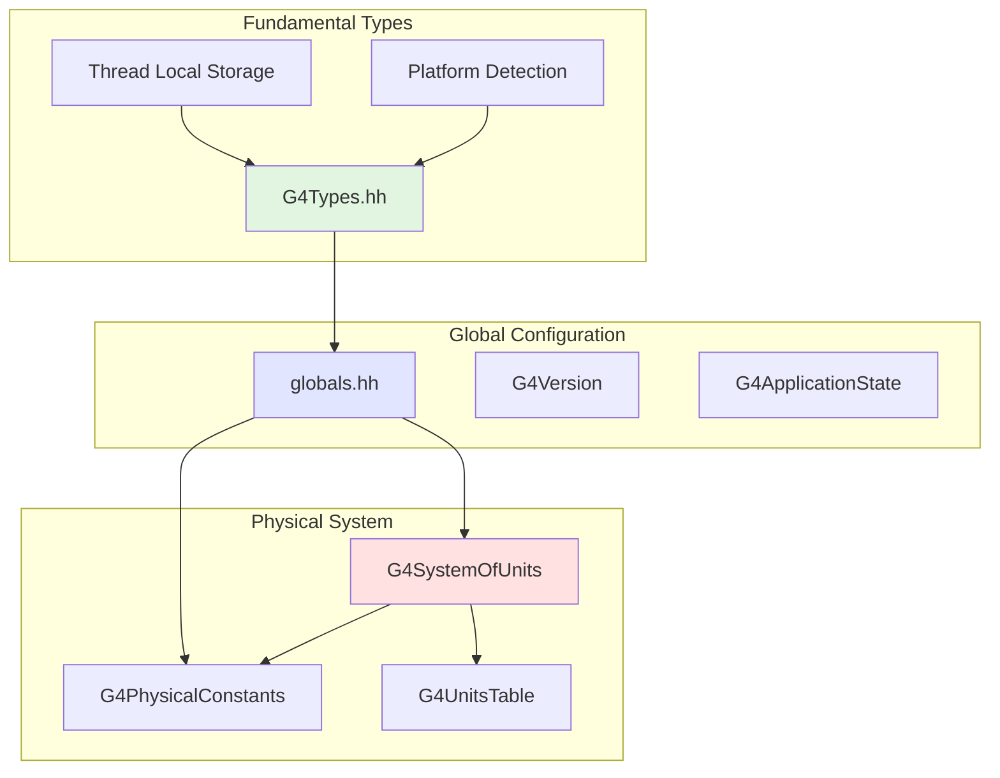
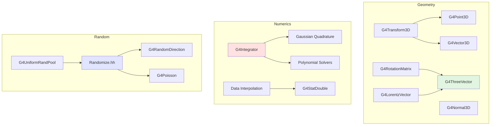
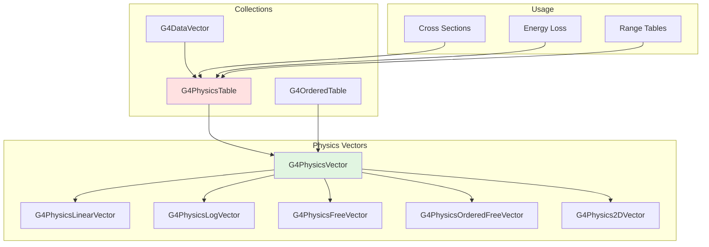
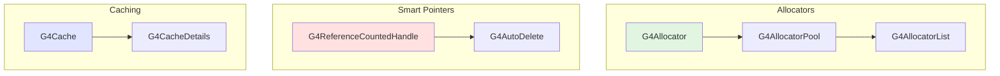

# Global Module

## Overview

The Global module is the foundational infrastructure of Geant4, providing essential utilities, types, mathematical functions, and framework components used throughout the entire toolkit. It contains the basic building blocks that all other modules depend on, including type definitions, physical constants, units, vectors, random number generation, numerical methods, threading support, and memory management.

::: tip Module Location
**Source:** `source/global/`
**Headers:** `source/global/{HEPGeometry,HEPNumerics,HEPRandom,management}/include/`
:::

## Purpose and Scope

The Global module serves as the foundation for all Geant4 functionality:

- **Type System**: Fundamental type definitions (`G4int`, `G4double`, `G4bool`) and platform-specific configurations
- **Units and Constants**: Complete system of physical units and fundamental constants
- **Mathematical Utilities**: Vectors, matrices, transformations, and optimized math functions
- **Random Number Generation**: High-quality random number generators and distributions
- **Numerical Methods**: Integration, polynomial solving, interpolation, and statistical analysis
- **Physics Data Structures**: Vectors and tables for storing cross-sections and energy loss data
- **Threading Support**: Multi-threading infrastructure, task management, and thread-local storage
- **Memory Management**: Efficient object allocation, smart pointers, and memory pools
- **I/O System**: Output formatting, logging, and destination management
- **Exception Handling**: Robust error reporting and exception management
- **Performance Tools**: Timing, profiling, and optimization utilities

## Module Organization

The Global module is organized into four main subdirectories:

### 1. HEPGeometry (8 classes)
Geometric primitives and transformations, wrapping CLHEP geometry classes:
- 3D points, vectors, and normals
- 3D transformations (rotation + translation)
- 4D Lorentz vectors and rotations
- Geometric definitions and enumerations

### 2. HEPNumerics (18 classes)
Numerical analysis and computational methods:
- Numerical integration (Simpson, Gaussian quadrature methods)
- Polynomial equation solving
- Data interpolation and approximation
- Statistical analysis and convergence testing
- Function optimization

### 3. HEPRandom (6 classes)
Random number generation utilities:
- High-quality random number generators
- Random distributions (Poisson, Gaussian, exponential)
- Random direction generation
- Thread-safe random number pools

### 4. Management (77 classes)
Core framework utilities and infrastructure:
- **Types and Constants**: Fundamental types, units, physical constants
- **Vectors and Matrices**: `G4ThreeVector`, `G4TwoVector`, `G4RotationMatrix`
- **Physics Data**: `G4PhysicsVector`, `G4PhysicsTable` families
- **Threading**: Thread pools, tasks, synchronization
- **Memory**: Allocators, smart pointers, caching
- **I/O**: Output destinations, formatters, logging
- **Exception Handling**: Error reporting and custom handlers
- **State Management**: Application state tracking
- **Mathematical Functions**: Optimized power, log, exponential functions
- **Utilities**: Tokenization, expression evaluation, file I/O

## Architecture

### Type System and Constants



### Mathematical Infrastructure



### Physics Data Storage



### Threading and Concurrency

```mermaid
graph TB
    subgraph "Thread Management"
        Threading[G4Threading]
        ThreadPool[G4ThreadPool]
        ThreadData[G4ThreadData]
        TLSingleton[G4ThreadLocalSingleton]
    end

    subgraph "Task System"
        Task[G4Task]
        TaskManager[G4TaskManager]
        TaskGroup[G4TaskGroup]
        TaskQueue[G4UserTaskQueue]
    end

    subgraph "Synchronization"
        AutoLock[G4AutoLock]
        MTBarrier[G4MTBarrier]
        Cache[G4Cache]
        Workspace[G4TWorkspacePool]
    end

    subgraph "Thread-Safe I/O"
        MTcout[G4MTcoutDestination]
        MasterForward[G4MasterForwardcoutDestination]
        Lockcout[G4LockcoutDestination]
    end

    Threading --> ThreadPool
    ThreadPool --> ThreadData
    ThreadData --> TLSingleton

    TaskManager --> Task
    TaskManager --> TaskGroup
    TaskGroup --> TaskQueue

    AutoLock --> MTBarrier
    Cache --> Workspace

    MTcout --> MasterForward
    MasterForward --> Lockcout

    style Threading fill:#e1f5e1
    style TaskManager fill:#ffe1e1
    style AutoLock fill:#e1e5ff
    style MTcout fill:#fff5e1
```



### Memory Management



## Key Classes by Category

### Fundamental Types and Constants
| Class | Purpose | Source File |
|-------|---------|-------------|
| [G4Types](/modules/global/api/g4types) | Fundamental type definitions | `management/include/G4Types.hh:1` |
| [G4SystemOfUnits](/modules/global/api/g4systemofunits) | Physical unit definitions | `management/include/G4SystemOfUnits.hh:1` |
| [G4PhysicalConstants](/modules/global/api/g4physicalconstants) | Physical constants | `management/include/G4PhysicalConstants.hh:1` |
| [globals.hh](/modules/global/api/globals) | Global definitions and includes | `management/include/globals.hh:1` |

### Vectors and Transformations
| Class | Purpose | Source File |
|-------|---------|-------------|
| [G4ThreeVector](/modules/global/api/g4threevector) | 3D vector (position, momentum) | `management/include/G4ThreeVector.hh:1` |
| [G4TwoVector](/modules/global/api/g4twovector) | 2D vector | `management/include/G4TwoVector.hh:1` |
| [G4RotationMatrix](/modules/global/api/g4rotationmatrix) | 3x3 rotation matrix | `management/include/G4RotationMatrix.hh:1` |
| [G4Transform3D](/modules/global/api/g4transform3d) | 3D transformation | `HEPGeometry/include/G4Transform3D.hh:1` |
| [G4LorentzVector](/modules/global/api/g4lorentzvector) | 4D energy-momentum vector | `HEPGeometry/include/G4LorentzVector.hh:1` |

### Physics Data Storage
| Class | Purpose | Source File |
|-------|---------|-------------|
| [G4PhysicsVector](/modules/global/api/g4physicsvector) | Base class for physics data vectors | `management/include/G4PhysicsVector.hh:1` |
| [G4PhysicsTable](/modules/global/api/g4physicstable) | Collection of physics vectors | `management/include/G4PhysicsTable.hh:1` |
| [G4PhysicsLinearVector](/modules/global/api/g4physicslinearvector) | Linear binning physics vector | `management/include/G4PhysicsLinearVector.hh:1` |
| [G4PhysicsLogVector](/modules/global/api/g4physicslogvector) | Logarithmic binning physics vector | `management/include/G4PhysicsLogVector.hh:1` |
| [G4PhysicsFreeVector](/modules/global/api/g4physicsfreevector) | Arbitrary binning physics vector | `management/include/G4PhysicsFreeVector.hh:1` |

### Random Number Generation
| Class | Purpose | Source File |
|-------|---------|-------------|
| [Randomize](/modules/global/api/randomize) | Main random number header | `HEPRandom/include/Randomize.hh:1` |
| [G4RandomDirection](/modules/global/api/g4randomdirection) | Random 3D direction generation | `HEPRandom/include/G4RandomDirection.hh:1` |
| [G4Poisson](/modules/global/api/g4poisson) | Poisson distribution sampling | `HEPRandom/include/G4Poisson.hh:1` |
| [G4UniformRandPool](/modules/global/api/g4uniformrandpool) | Thread-safe random pool | `HEPRandom/include/G4UniformRandPool.hh:1` |

### Numerical Methods
| Class | Purpose | Source File |
|-------|---------|-------------|
| [G4Integrator](/modules/global/api/g4integrator) | Numerical integration | `HEPNumerics/include/G4Integrator.hh:1` |
| [G4StatDouble](/modules/global/api/g4statdouble) | Statistical analysis | `HEPNumerics/include/G4StatDouble.hh:1` |
| [G4DataInterpolation](/modules/global/api/g4datainterpolation) | Cubic spline interpolation | `HEPNumerics/include/G4DataInterpolation.hh:1` |
| [G4PolynomialSolver](/modules/global/api/g4polynomialsolver) | Polynomial root finding | `HEPNumerics/include/G4PolynomialSolver.hh:1` |

### Threading and Tasks
| Class | Purpose | Source File |
|-------|---------|-------------|
| [G4Threading](/modules/global/api/g4threading) | Threading utilities | `management/include/G4Threading.hh:1` |
| [G4ThreadPool](/modules/global/api/g4threadpool) | Thread pool management | `management/include/G4ThreadPool.hh:1` |
| [G4Task](/modules/global/api/g4task) | Task-based parallelism | `management/include/G4Task.hh:1` |
| [G4TaskManager](/modules/global/api/g4taskmanager) | Task execution management | `management/include/G4TaskManager.hh:1` |
| [G4AutoLock](/modules/global/api/g4autolock) | RAII mutex lock | `management/include/G4AutoLock.hh:1` |

### Memory Management
| Class | Purpose | Source File |
|-------|---------|-------------|
| [G4Allocator](/modules/global/api/g4allocator) | Fast object pool allocator | `management/include/G4Allocator.hh:1` |
| [G4ReferenceCountedHandle](/modules/global/api/g4referencecountedhandle) | Smart pointer | `management/include/G4ReferenceCountedHandle.hh:1` |
| [G4Cache](/modules/global/api/g4cache) | Thread-safe caching | `management/include/G4Cache.hh:1` |

### I/O and Exception Handling
| Class | Purpose | Source File |
|-------|---------|-------------|
| [G4Exception](/modules/global/api/g4exception) | Exception/error handling | `management/include/G4Exception.hh:1` |
| [G4coutDestination](/modules/global/api/g4coutdestination) | Output destination base class | `management/include/G4coutDestination.hh:1` |
| [G4MTcoutDestination](/modules/global/api/g4mtcoutdestination) | Multi-threaded output | `management/include/G4MTcoutDestination.hh:1` |

### Utilities
| Class | Purpose | Source File |
|-------|---------|-------------|
| [G4Timer](/modules/global/api/g4timer) | CPU and wall clock timing | `management/include/G4Timer.hh:1` |
| [G4Pow](/modules/global/api/g4pow) | Optimized power functions | `management/include/G4Pow.hh:1` |
| [G4UnitsTable](/modules/global/api/g4unitstable) | Unit conversion utilities | `management/include/G4UnitsTable.hh:1` |
| [G4StateManager](/modules/global/api/g4statemanager) | Application state management | `management/include/G4StateManager.hh:1` |

## Usage Patterns

### Using Units and Constants

```cpp
#include "G4SystemOfUnits.hh"
#include "G4PhysicalConstants.hh"

// Define dimensions with units
G4double energy = 10.0 * MeV;
G4double length = 5.0 * cm;
G4double time = 1.0 * ns;
G4double angle = 30.0 * deg;

// Use physical constants
G4double speedOfLight = c_light;        // ~2.998e8 m/s
G4double electronMass = electron_mass_c2; // ~0.511 MeV
G4double fineStructure = fine_structure_const; // ~1/137
```

### Working with Vectors

```cpp
#include "G4ThreeVector.hh"
#include "G4RotationMatrix.hh"

// Create and manipulate 3D vectors
G4ThreeVector position(1.0*cm, 2.0*cm, 3.0*cm);
G4ThreeVector momentum(100*MeV, 50*MeV, 0);

// Vector operations
G4double magnitude = momentum.mag();
G4ThreeVector direction = momentum.unit();
G4double dotProduct = position.dot(momentum);
G4ThreeVector crossProduct = position.cross(momentum);

// Apply rotations
G4RotationMatrix rotation;
rotation.rotateZ(45*deg);
G4ThreeVector rotated = rotation * position;
```

### Physics Vector Usage

```cpp
#include "G4PhysicsLogVector.hh"
#include "G4PhysicsTable.hh"

// Create physics vector for cross-section data
G4PhysicsLogVector* crossSection = new G4PhysicsLogVector(
    1.0*keV,    // minimum energy
    10.0*GeV,   // maximum energy
    100         // number of bins
);

// Fill with data
for (size_t i = 0; i < crossSection->GetVectorLength(); ++i) {
    G4double energy = crossSection->Energy(i);
    G4double xs = CalculateCrossSection(energy);
    crossSection->PutValue(i, xs);
}

// Retrieve interpolated values
G4double value = crossSection->Value(5.0*MeV);
```

### Random Number Generation

```cpp
#include "Randomize.hh"
#include "G4RandomDirection.hh"

// Generate random numbers
G4double uniform = G4UniformRand();  // [0, 1)
G4double gaussian = G4RandGauss::shoot(mean, sigma);
G4double exponential = G4RandExponential::shoot(tau);
G4int poisson = G4Poisson(3.5);

// Random directions
G4ThreeVector randomDir = G4RandomDirection();
```

### Threading Support

```cpp
#include "G4Threading.hh"
#include "G4AutoLock.hh"
#include "G4Cache.hh"

namespace {
    G4Mutex myMutex = G4MUTEX_INITIALIZER;
    G4Cache<MyData> threadLocalData;
}

void ThreadSafeFunction() {
    // RAII lock
    G4AutoLock lock(&myMutex);

    // Critical section
    SharedResourceAccess();

    // lock released automatically
}

void UseThreadLocalData() {
    MyData& data = threadLocalData.Get();
    data.Process();
}
```

### Memory Allocation

```cpp
#include "G4Allocator.hh"

class MyClass {
public:
    void* operator new(size_t);
    void operator delete(void*);

private:
    static G4Allocator<MyClass> allocator;
};

G4Allocator<MyClass> MyClass::allocator;

void* MyClass::operator new(size_t) {
    return allocator.MallocSingle();
}

void MyClass::operator delete(void* obj) {
    allocator.FreeSingle((MyClass*)obj);
}
```

### Exception Handling

```cpp
#include "G4Exception.hh"

void MyFunction() {
    if (errorCondition) {
        G4Exception("MyFunction", "CODE001",
                    FatalException,
                    "Description of the error");
    }

    if (warningCondition) {
        G4Exception("MyFunction", "CODE002",
                    JustWarning,
                    "This is just a warning");
    }
}
```

## Thread Safety Considerations

The Global module provides extensive support for multi-threading:

### Thread-Safe Components
- **G4Cache**: Thread-local caching mechanism
- **G4ThreadLocalSingleton**: Thread-local singleton pattern
- **G4AutoLock**: RAII mutex locking
- **G4MTBarrier**: Thread synchronization barriers
- **G4UniformRandPool**: Thread-safe random number generation
- **G4MTcoutDestination**: Thread-safe output

### Thread-Unsafe Components (Require Protection)
- **G4PhysicsTable**: Shared physics data (read-only after initialization)
- **G4UnitsTable**: Unit definitions (initialized at startup)
- **Static allocators**: Use thread-local instances when possible

### Best Practices
1. Use `G4Cache` for thread-local data
2. Protect shared resources with `G4AutoLock`
3. Initialize physics tables before multi-threaded execution
4. Use `G4UniformRandPool` for thread-safe random generation
5. Use `G4MTcoutDestination` for thread-safe logging

## Performance Considerations

### Optimized Mathematical Functions
- **G4Pow**: Pre-computed power tables for common exponents
- **G4Log**: Fast logarithm calculations
- **G4Exp**: Fast exponential calculations
- **G4IEEE754**: Low-level floating-point optimizations

### Memory Efficiency
- **G4Allocator**: Object pooling reduces allocation overhead
- **G4PhysicsVector**: Compact storage with interpolation
- **G4Cache**: Reduces synchronization overhead

### Timing and Profiling
- **G4Timer**: Measure CPU and wall-clock time
- **G4SliceTimer**: High-resolution performance measurement

## Integration with Other Modules

The Global module is used by virtually every other module:

- **Materials**: Uses `G4PhysicsVector` for material properties
- **Geometry**: Uses vectors, transformations, and geometry definitions
- **Particles**: Uses units, constants, and physics tables
- **Processes**: Uses physics vectors/tables for cross-sections and energy loss
- **Tracking**: Uses vectors, random numbers, and state management
- **Run**: Uses threading, state management, and exception handling
- **Event**: Uses allocators, vectors, and random generation

## Common Pitfalls

### Unit Mismatches
```cpp
// WRONG: Mixing unit systems
G4double energy = 10.0;  // What unit? Undefined!

// CORRECT: Always specify units
G4double energy = 10.0 * MeV;
```

### Thread Safety
```cpp
// WRONG: Unprotected shared access
static G4int counter = 0;
counter++;  // Race condition!

// CORRECT: Use atomic or mutex
G4AutoLock lock(&mutex);
counter++;
```

### Physics Vector Binning
```cpp
// WRONG: Linear binning for exponential data
G4PhysicsLinearVector* vec = new G4PhysicsLinearVector(1*eV, 1*TeV, 100);
// Poor resolution at low energies!

// CORRECT: Logarithmic binning for wide range
G4PhysicsLogVector* vec = new G4PhysicsLogVector(1*eV, 1*TeV, 100);
```

## Related Modules

- [**Materials**](/modules/materials/) - Uses physics vectors for material properties
- [**Geometry**](/modules/geometry/) - Uses geometric primitives and transformations
- [**Particles**](/modules/particles/) - Uses units and constants for particle definitions
- [**Processes**](/modules/processes/) - Uses physics tables for cross-sections

## Documentation Status

::: info Documentation Progress
See the [Documentation Progress](/documentation-progress#global-module) page for detailed class-level documentation status.
:::

## References

### CLHEP Dependencies
The Global module wraps several CLHEP (Class Library for High Energy Physics) components:
- **HepGeom**: Geometric primitives (Point3D, Vector3D, Transform3D)
- **HepRandom**: Random number generation
- **HepVector**: Vector and matrix classes

### External Documentation
- [Geant4 User's Guide - Toolkit Fundamentals](https://geant4-userdoc.web.cern.ch/)
- [CLHEP Documentation](https://proj-clhep.web.cern.ch/)
- [System of Units in Geant4](https://geant4-userdoc.web.cern.ch/UsersGuides/ForApplicationDeveloper/html/Appendix/unitsAndDimensions.html)

---

::: tip Next Steps
Explore individual class documentation in the API reference sections:
- [HEPGeometry Classes](/modules/global/api/hepgeometry)
- [HEPNumerics Classes](/modules/global/api/hepnumerics)
- [HEPRandom Classes](/modules/global/api/heprandom)
- [Management Classes](/modules/global/api/management)
:::
