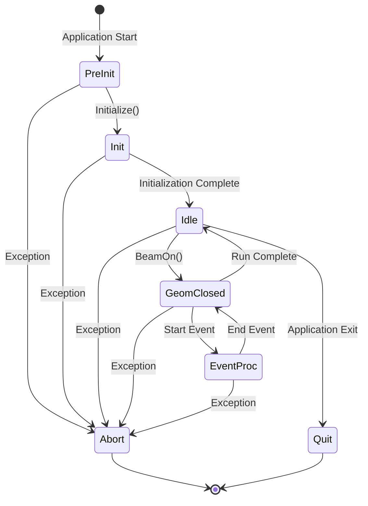
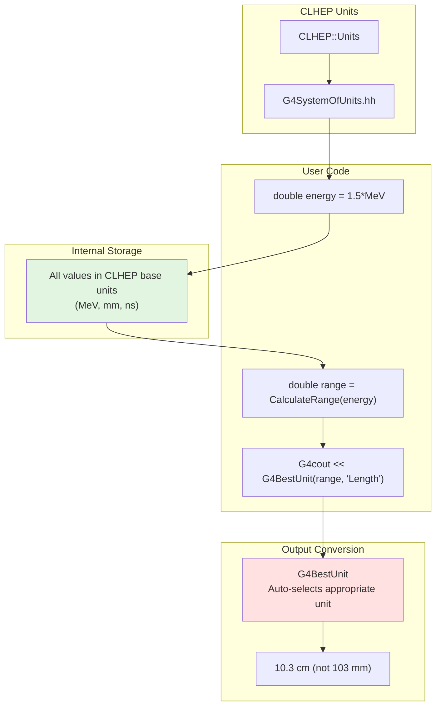
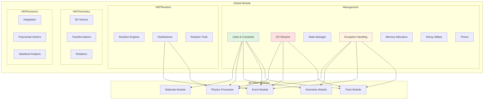
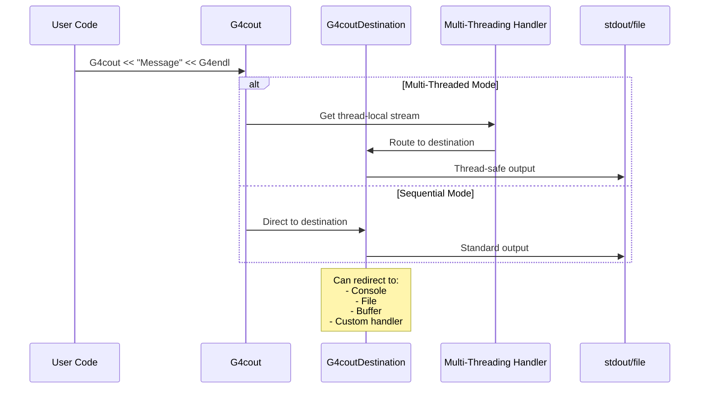
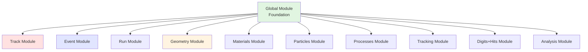

# Global Module

## Overview

The Global module provides the foundational infrastructure and utilities used throughout Geant4. It defines fundamental types, units, constants, I/O facilities, random number generation, exception handling, and state management that all other modules depend on. This is the most widely used module in Geant4 - every simulation uses its components.

::: tip Module Location
**Source:** `source/global/`
**Subdirectories:**
- `management/` - Core utilities, units, I/O, state management
- `HEPRandom/` - Random number generation
- `HEPGeometry/` - Basic geometry types (vectors, transforms)
- `HEPNumerics/` - Numerical methods and integration
:::

## Purpose and Scope

The Global module serves as the foundation for all of Geant4:

- **System of Units**: CLHEP-based unit system with automatic conversions
- **Physical Constants**: Fundamental constants (c, h, electron mass, etc.)
- **Random Number Generation**: High-quality random distributions
- **I/O Utilities**: Thread-safe output streams (G4cout, G4cerr)
- **Exception Handling**: Standardized error reporting and control
- **State Management**: Application lifecycle and state transitions
- **Memory Management**: Efficient allocators for high-performance objects
- **String Utilities**: Enhanced string handling and manipulation
- **Timers**: Performance measurement and profiling
- **Type Definitions**: Platform-independent fundamental types

## Core Concepts

### Application States

Geant4 progresses through well-defined states during execution:



States:
- **PreInit**: Before initialization
- **Init**: During initialization
- **Idle**: Ready to run, geometry open
- **GeomClosed**: Geometry closed, ready for events
- **EventProc**: Processing an event
- **Quit**: Clean shutdown
- **Abort**: Error condition

### Units System



### Exception Severity Levels

```cpp
enum G4ExceptionSeverity {
    FatalException,          // Abort with core dump
    FatalErrorInArgument,    // Fatal misuse of API
    RunMustBeAborted,        // Abort current run
    EventMustBeAborted,      // Abort current event
    JustWarning,            // Warning message only
    IgnoreTheIssue          // Silent (no message)
};
```

## Architecture

### Module Organization



### I/O Streaming Architecture



## Key Classes by Category

### System of Units

| Class/Header | Purpose | Usage |
|--------------|---------|-------|
| **G4SystemOfUnits.hh** | All CLHEP units (MeV, mm, ns, etc.) | `#include "G4SystemOfUnits.hh"` |
| **G4UnitsTable** | Unit definitions and categories | Unit registry and lookup |
| **G4UnitDefinition** | Individual unit definition | Define custom units |
| **G4BestUnit** | Automatic unit selection for output | `G4cout << G4BestUnit(value, "Energy")` |

### Physical Constants

| Constant | Description | Header |
|----------|-------------|--------|
| **c_light** | Speed of light | `G4PhysicalConstants.hh` |
| **h_Planck** | Planck's constant | `G4PhysicalConstants.hh` |
| **electron_mass_c2** | Electron mass energy | `G4PhysicalConstants.hh` |
| **proton_mass_c2** | Proton mass energy | `G4PhysicalConstants.hh` |
| **Avogadro** | Avogadro's number | `G4PhysicalConstants.hh` |
| **k_Boltzmann** | Boltzmann constant | `G4PhysicalConstants.hh` |

### Random Number Generation

| Class | Purpose | Header |
|-------|---------|--------|
| **G4UniformRand()** | Uniform random [0,1) | `Randomize.hh` |
| **G4RandGauss** | Gaussian distribution | `Randomize.hh` |
| **G4RandFlat** | Flat/uniform distribution | `Randomize.hh` |
| **G4RandExponential** | Exponential distribution | `Randomize.hh` |
| **G4RandPoisson** | Poisson distribution | `Randomize.hh` |
| **G4RandomDirection** | Isotropic direction generation | `G4RandomDirection.hh` |
| **G4Poisson** | Fast Poisson sampling | `G4Poisson.hh` |

### I/O Utilities

| Object/Function | Purpose | Header |
|-----------------|---------|--------|
| **G4cout** | Thread-safe standard output | `G4ios.hh` or `globals.hh` |
| **G4cerr** | Thread-safe error output | `G4ios.hh` or `globals.hh` |
| **G4endl** | End line (flush) | `G4ios.hh` or `globals.hh` |
| **G4coutDestination** | Custom output destination base | `G4coutDestination.hh` |

### State Management

| Class | Purpose | Header |
|-------|---------|--------|
| **G4StateManager** | Application state controller (singleton) | `G4StateManager.hh` |
| **G4ApplicationState** | State enumeration | `G4ApplicationState.hh` |
| **G4VStateDependent** | State change notification interface | `G4VStateDependent.hh` |

### Exception Handling

| Function/Type | Purpose | Header |
|---------------|---------|--------|
| **G4Exception()** | Throw exception with severity | `G4Exception.hh` or `globals.hh` |
| **G4ExceptionSeverity** | Exception severity levels | `G4ExceptionSeverity.hh` |
| **G4ExceptionDescription** | Stream for exception messages | `G4Exception.hh` |
| **G4VExceptionHandler** | Custom exception handler interface | `G4VExceptionHandler.hh` |

### Memory Management

| Class | Purpose | Header |
|-------|---------|--------|
| **G4Allocator\<T\>** | Fast memory pool allocator | `G4Allocator.hh` |
| **G4AllocatorPool** | Memory pool implementation | `G4AllocatorPool.hh` |
| **G4AllocatorList** | Global allocator registry | `G4AllocatorList.hh` |
| **G4Cache\<T\>** | Thread-local caching | `G4Cache.hh` |
| **G4AutoDelete** | Automatic cleanup utility | `G4AutoDelete.hh` |

### String Utilities

| Class/Type | Purpose | Header |
|------------|---------|--------|
| **G4String** | Enhanced std::string | `G4String.hh` or `globals.hh` |
| **G4Tokenizer** | String tokenization | `G4Tokenizer.hh` |

### Timers and Performance

| Class | Purpose | Header |
|-------|---------|--------|
| **G4Timer** | Elapsed time measurement | `G4Timer.hh` |
| **G4SliceTimer** | High-resolution timing | `G4SliceTimer.hh` |

### Geometry Types (HEPGeometry)

| Class | Purpose | Header |
|-------|---------|--------|
| **G4ThreeVector** | 3D vector (CLHEP) | `G4ThreeVector.hh` |
| **G4TwoVector** | 2D vector (CLHEP) | `G4TwoVector.hh` |
| **G4RotationMatrix** | 3D rotation matrix (CLHEP) | `G4RotationMatrix.hh` |
| **G4Transform3D** | 3D affine transformation | `G4Transform3D.hh` |
| **G4Point3D** | 3D point | `G4Point3D.hh` |
| **G4Vector3D** | 3D vector | `G4Vector3D.hh` |
| **G4Normal3D** | 3D normal vector | `G4Normal3D.hh` |

### Numerical Methods (HEPNumerics)

| Class | Purpose | Header |
|-------|---------|--------|
| **G4Integrator** | Numerical integration | `G4Integrator.hh` |
| **G4PolynomialSolver** | Polynomial root finding | `G4PolynomialSolver.hh` |
| **G4StatAnalysis** | Statistical analysis | `G4StatAnalysis.hh` |
| **G4SimplexDownhill** | Minimization algorithm | `G4SimplexDownhill.hh` |

## Usage Patterns

### Working with Units

```cpp
#include "G4SystemOfUnits.hh"
#include "G4PhysicalConstants.hh"

void DefineParticleEnergy()
{
    // Define values with units (automatic conversion to internal units)
    G4double energy = 10.5 * MeV;        // Energy in MeV
    G4double distance = 5.0 * cm;        // Distance in cm
    G4double time = 100 * ns;             // Time in nanoseconds

    // All arithmetic automatically in internal units
    G4double velocity = distance / time;

    // Output with automatic unit selection
    G4cout << "Energy: " << G4BestUnit(energy, "Energy") << G4endl;
    G4cout << "Distance: " << G4BestUnit(distance, "Length") << G4endl;
    G4cout << "Time: " << G4BestUnit(time, "Time") << G4endl;

    // Using physical constants
    G4double beta = velocity / c_light;
    G4double mass = electron_mass_c2;
    G4double momentum = sqrt(energy*energy - mass*mass);
}
```

### Using Physical Constants

```cpp
#include "G4PhysicalConstants.hh"
#include "G4SystemOfUnits.hh"

void CalculatePhysics()
{
    // Fundamental constants
    G4double speedOfLight = c_light;           // ~3e8 m/s
    G4double planck = h_Planck;               // Planck's constant
    G4double hbar = hbar_Planck;              // ℏ = h/2π

    // Particle masses
    G4double me = electron_mass_c2;           // ~0.511 MeV
    G4double mp = proton_mass_c2;             // ~938.3 MeV
    G4double mn = neutron_mass_c2;            // ~939.6 MeV

    // Other constants
    G4double alpha = fine_structure_const;    // ~1/137
    G4double Na = Avogadro;                   // 6.022e23 /mol
    G4double kB = k_Boltzmann;                // Boltzmann constant

    // Derived calculations
    G4double compton_wavelength = hbarc / me;  // Compton wavelength
    G4double bohr_radius = Bohr_radius;        // ~0.529 Angstrom
}
```

### Random Number Generation

```cpp
#include "Randomize.hh"
#include "G4RandomDirection.hh"

void GenerateRandomNumbers()
{
    // Uniform random [0, 1)
    G4double r = G4UniformRand();

    // Gaussian (mean=0, sigma=1)
    G4double gauss = G4RandGauss::shoot(0.0, 1.0);

    // Gaussian with different parameters
    G4double energy_spread = G4RandGauss::shoot(100*MeV, 5*MeV);

    // Exponential decay
    G4double decay_time = G4RandExponential::shoot(10*ns);

    // Flat distribution in range
    G4double angle = G4RandFlat::shoot(0, 2*pi);

    // Poisson distribution
    G4int n_particles = G4RandPoisson::shoot(5.3);

    // Random 3D direction (isotropic)
    G4ThreeVector direction = G4RandomDirection();

    // Random direction in cone
    G4double cosTheta = 1.0 - G4UniformRand() * (1.0 - cos(30*deg));
    G4double phi = 2 * pi * G4UniformRand();
    G4double sinTheta = sqrt(1.0 - cosTheta*cosTheta);
    G4ThreeVector coneDir(sinTheta*cos(phi), sinTheta*sin(phi), cosTheta);
}
```

### Exception Handling

```cpp
#include "G4Exception.hh"

void ValidateInput(G4double energy)
{
    // Fatal error - abort with core dump
    if (energy < 0) {
        G4Exception("ValidateInput()", "FATAL001",
                   FatalException,
                   "Energy cannot be negative!");
    }

    // Warning - continue execution
    if (energy < 1*keV) {
        G4ExceptionDescription msg;
        msg << "Energy " << energy/keV << " keV is very low.\n"
            << "Results may not be accurate.";
        G4Exception("ValidateInput()", "WARN001",
                   JustWarning, msg);
    }

    // Event must be aborted
    if (energy > 1*TeV) {
        G4Exception("ValidateInput()", "EVENT001",
                   EventMustBeAborted,
                   "Energy exceeds simulation limits!");
    }
}

void CheckGeometry(G4VPhysicalVolume* volume)
{
    if (!volume) {
        G4ExceptionDescription msg;
        msg << "Physical volume is null!\n"
            << "Check geometry construction.";
        G4Exception("CheckGeometry()", "GEOM001",
                   FatalErrorInArgument, msg);
    }
}
```

### State Management

```cpp
#include "G4StateManager.hh"

void CheckApplicationState()
{
    // Get state manager (singleton)
    G4StateManager* stateManager = G4StateManager::GetStateManager();

    // Query current state
    G4ApplicationState currentState = stateManager->GetCurrentState();

    // Check state before operations
    if (currentState == G4State_PreInit) {
        G4cout << "Still in pre-initialization" << G4endl;
    }
    else if (currentState == G4State_Idle) {
        G4cout << "Ready to start run" << G4endl;
    }
    else if (currentState == G4State_EventProc) {
        G4cout << "Processing event" << G4endl;
    }

    // Get state name as string
    G4String stateName = stateManager->GetStateString(currentState);
    G4cout << "Current state: " << stateName << G4endl;
}

// State-dependent class
class MyStateDependent : public G4VStateDependent
{
public:
    MyStateDependent() : G4VStateDependent(true) {
        // Register with state manager
        G4StateManager::GetStateManager()->RegisterDependent(this);
    }

    virtual G4bool Notify(G4ApplicationState requestedState) override
    {
        if (requestedState == G4State_Idle) {
            G4cout << "Transitioning to Idle state" << G4endl;
            // Perform state-dependent initialization
        }
        return true;  // Allow state change
    }
};
```

### I/O Streaming

```cpp
#include "globals.hh"  // Includes G4cout, G4cerr, G4endl

void PrintInformation()
{
    // Standard output
    G4cout << "Starting simulation..." << G4endl;

    // Formatted output
    G4cout << "Energy = " << 10.5 << " MeV" << G4endl;

    // With G4BestUnit
    G4double distance = 5.0 * cm;
    G4cout << "Distance: " << G4BestUnit(distance, "Length") << G4endl;

    // Error output
    G4cerr << "WARNING: Low statistics!" << G4endl;

    // Multi-threaded output (automatic thread ID)
    #ifdef G4MULTITHREADED
    G4cout << "Thread-safe output in MT mode" << G4endl;
    #endif
}

// Custom output destination
class MyOutputDestination : public G4coutDestination
{
public:
    virtual G4int ReceiveG4cout(const G4String& msg) override {
        // Custom handling of G4cout messages
        myLogFile << "[INFO] " << msg;
        return 0;
    }

    virtual G4int ReceiveG4cerr(const G4String& msg) override {
        // Custom handling of G4cerr messages
        myLogFile << "[ERROR] " << msg;
        return 0;
    }

private:
    std::ofstream myLogFile;
};
```

### Memory Management with Allocators

```cpp
#include "G4Allocator.hh"

class MyTrackData
{
public:
    MyTrackData() = default;
    ~MyTrackData() = default;

    // Custom memory management
    inline void* operator new(size_t);
    inline void operator delete(void* obj);

private:
    static G4Allocator<MyTrackData>* allocator;

    G4double energy;
    G4ThreeVector position;
    G4int trackID;
};

// Define allocator
G4Allocator<MyTrackData>* MyTrackData::allocator = nullptr;

// Efficient allocation from pool
inline void* MyTrackData::operator new(size_t)
{
    if (!allocator) {
        allocator = new G4Allocator<MyTrackData>;
    }
    return allocator->MallocSingle();
}

// Return to pool (not actually freed)
inline void MyTrackData::operator delete(void* obj)
{
    allocator->FreeSingle((MyTrackData*)obj);
}

void UseAllocator()
{
    // Fast allocation from pool
    MyTrackData* data = new MyTrackData();

    // Use the object
    // ...

    // Return to pool (very fast)
    delete data;
}
```

### Performance Timing

```cpp
#include "G4Timer.hh"

void MeasurePerformance()
{
    G4Timer timer;

    // Start timing
    timer.Start();

    // Perform operations
    for (int i = 0; i < 1000000; ++i) {
        G4double x = G4UniformRand();
        G4double y = sin(x);
    }

    // Stop timing
    timer.Stop();

    // Get elapsed times
    G4double realTime = timer.GetRealElapsed();
    G4double sysTime = timer.GetSystemElapsed();
    G4double userTime = timer.GetUserElapsed();

    G4cout << "Real time: " << realTime << " s" << G4endl;
    G4cout << "System time: " << sysTime << " s" << G4endl;
    G4cout << "User time: " << userTime << " s" << G4endl;

    // Convenient output
    G4cout << timer << G4endl;
}
```

### Custom Unit Definitions

```cpp
#include "G4UnitsTable.hh"
#include "G4SystemOfUnits.hh"

void DefineCustomUnits()
{
    // Define new unit in existing category
    new G4UnitDefinition("millielectronvolt", "meV", "Energy", 1.e-3*eV);

    // Define unit with custom symbol
    new G4UnitDefinition("atmosphere", "atm", "Pressure", atmosphere);

    // Define derived unit
    new G4UnitDefinition("barn", "b", "Surface", barn);
    new G4UnitDefinition("millibarn", "mb", "Surface", millibarn);

    // Use custom unit
    G4double crossSection = 50 * millibarn;
    G4cout << G4BestUnit(crossSection, "Surface") << G4endl;

    // Check if unit is defined
    if (G4UnitDefinition::IsUnitDefined("meV")) {
        G4double value = G4UnitDefinition::GetValueOf("meV");
        G4cout << "1 meV = " << value << " (internal units)" << G4endl;
    }
}
```

## Advanced Features

### Thread-Local Storage

```cpp
#include "G4Cache.hh"

// Thread-local cached data
class MyPhysicsData
{
public:
    void Initialize() {
        // Expensive initialization
        computedTable = ComputePhysicsTable();
    }

    G4PhysicsVector* GetTable() {
        return computedTable;
    }

private:
    G4PhysicsVector* computedTable;
};

// Use G4Cache for thread-local instances
G4Cache<MyPhysicsData*> threadLocalData;

void UseThreadLocalData()
{
    // Get thread-local instance
    MyPhysicsData* data = threadLocalData.Get();

    // Initialize if needed
    if (!data) {
        data = new MyPhysicsData();
        data->Initialize();
        threadLocalData.Put(data);
    }

    // Use thread-local data
    G4PhysicsVector* table = data->GetTable();
}
```

### Backtrace and Debugging

```cpp
#include "G4Backtrace.hh"

void DebugFunction()
{
    // Get backtrace for debugging
    #ifdef G4BACKTRACE
    G4Backtrace bt;
    bt.Dump();
    #endif
}
```

## Integration with All Modules

The Global module is the foundation for every other module in Geant4:



### Universal Dependencies

Every module depends on Global for:
- **Units**: All physical quantities use the unit system
- **Constants**: Physics calculations use fundamental constants
- **I/O**: All modules use G4cout/G4cerr for output
- **Exceptions**: All modules use G4Exception for error handling
- **Random**: Physics processes use random number generation
- **Types**: G4double, G4int, G4bool, G4String are ubiquitous
- **Vectors**: G4ThreeVector used throughout for positions/directions

## Thread Safety

### Multi-Threading Considerations

The Global module provides comprehensive thread safety:

| Component | Thread Safety | Notes |
|-----------|---------------|-------|
| **Units/Constants** | Thread-safe | Const values, no synchronization needed |
| **G4cout/G4cerr** | Thread-safe | Automatic thread identification in MT mode |
| **Random** | Thread-local | Separate engine per thread |
| **G4StateManager** | Thread-local | Per-thread state tracking |
| **G4Allocator** | Thread-safe | Lock-free pool allocation |
| **G4Cache** | Thread-local | Explicit thread-local storage |
| **G4Timer** | Thread-safe | Independent per thread |

### Multi-Threading Example

```cpp
#ifdef G4MULTITHREADED
#include "G4Threading.hh"

void ThreadSafeOperation()
{
    // Get thread ID
    G4int threadID = G4Threading::G4GetThreadId();

    // Thread-safe output (automatic thread ID prefix)
    G4cout << "Running on thread " << threadID << G4endl;

    // Thread-local random number generator
    G4double rand = G4UniformRand();  // Independent per thread

    // Thread-local state
    G4StateManager* stateManager = G4StateManager::GetStateManager();
    G4ApplicationState state = stateManager->GetCurrentState();
}
#endif
```

## Performance Considerations

### Best Practices

1. **Memory Allocators**
   - Use `G4Allocator` for frequently allocated/deallocated objects
   - Reduces memory fragmentation and allocation overhead
   - Particularly important for G4Track, G4Step, geometry objects

2. **Random Number Generation**
   - `G4UniformRand()` is highly optimized
   - Avoid creating temporary distribution objects in tight loops
   - Reuse distribution objects when possible

3. **String Operations**
   - Minimize string creation in performance-critical code
   - Use const references for string parameters
   - G4String is std::string with some extensions

4. **I/O Operations**
   - G4cout involves threading overhead in MT mode
   - Reduce output in tight loops
   - Consider buffering for batch output

5. **Unit Conversions**
   - Unit multiplication is compile-time in many cases
   - No runtime overhead for simple conversions
   - G4BestUnit involves lookup, use sparingly in loops

### Performance Example

```cpp
// GOOD: Efficient random number usage
void EfficientRandom()
{
    // Reuse for multiple samples
    CLHEP::RandGaussQ gaussGen(engine, 0.0, 1.0);

    for (int i = 0; i < 1000000; ++i) {
        G4double value = gaussGen.fire();  // Fast
    }
}

// POOR: Creates temporary objects
void InefficientRandom()
{
    for (int i = 0; i < 1000000; ++i) {
        G4double value = G4RandGauss::shoot(0.0, 1.0);  // Slower
    }
}
```

## Common Patterns

### Initialization Pattern

```cpp
#include "globals.hh"
#include "G4SystemOfUnits.hh"
#include "Randomize.hh"

class MyDetectorConstruction
{
public:
    MyDetectorConstruction()
    {
        // Use units in initialization
        detectorThickness = 10*cm;
        detectorRadius = 5*cm;
        absorberMaterial = nullptr;
    }

    G4VPhysicalVolume* Construct()
    {
        // State checking
        G4StateManager* stateManager = G4StateManager::GetStateManager();
        if (stateManager->GetCurrentState() != G4State_PreInit &&
            stateManager->GetCurrentState() != G4State_Idle) {
            G4Exception("Construct()", "DET001", FatalException,
                       "Geometry can only be built in PreInit or Idle state!");
        }

        // Construction with units
        G4Box* solidBox = new G4Box("Detector",
                                    detectorRadius,
                                    detectorRadius,
                                    detectorThickness/2);

        // Output for verification
        G4cout << "Detector thickness: "
               << G4BestUnit(detectorThickness, "Length") << G4endl;

        // ... geometry construction
    }

private:
    G4double detectorThickness;
    G4double detectorRadius;
    G4Material* absorberMaterial;
};
```

### Error Handling Pattern

```cpp
#include "G4Exception.hh"

class MyPhysicsProcess
{
public:
    G4double ComputeCrossSection(G4double energy, const G4Material* material)
    {
        // Validate inputs
        if (energy <= 0) {
            G4ExceptionDescription msg;
            msg << "Invalid energy: " << energy/MeV << " MeV\n"
                << "Energy must be positive.";
            G4Exception("ComputeCrossSection()", "PHYS001",
                       FatalErrorInArgument, msg);
        }

        if (!material) {
            G4Exception("ComputeCrossSection()", "PHYS002",
                       FatalErrorInArgument,
                       "Material pointer is null!");
        }

        // Warn about potential issues
        if (energy > 100*TeV) {
            G4ExceptionDescription msg;
            msg << "Very high energy: " << energy/TeV << " TeV\n"
                << "Cross section may be unreliable.";
            G4Exception("ComputeCrossSection()", "PHYS003",
                       JustWarning, msg);
        }

        // Compute and return
        return CalculateXS(energy, material);
    }
};
```

## Source Files

Key source files in `source/global/`:

```
source/global/
├── management/
│   ├── include/
│   │   ├── G4SystemOfUnits.hh            # CLHEP units
│   │   ├── G4PhysicalConstants.hh        # Physical constants
│   │   ├── G4UnitsTable.hh               # Unit definitions
│   │   ├── G4Exception.hh                # Exception handling
│   │   ├── G4ExceptionSeverity.hh        # Exception levels
│   │   ├── G4StateManager.hh             # State management
│   │   ├── G4ApplicationState.hh         # State enumeration
│   │   ├── G4ios.hh                      # I/O streams
│   │   ├── globals.hh                    # Common includes
│   │   ├── G4Allocator.hh                # Memory allocator
│   │   ├── G4String.hh                   # String utilities
│   │   ├── G4Timer.hh                    # Performance timing
│   │   ├── G4Types.hh                    # Type definitions
│   │   ├── G4Threading.hh                # Threading utilities
│   │   └── G4Cache.hh                    # Thread-local cache
│   └── src/
│       ├── G4UnitsTable.cc
│       ├── G4Exception.cc
│       ├── G4StateManager.cc
│       └── G4Timer.cc
│
├── HEPRandom/
│   ├── include/
│   │   ├── Randomize.hh                  # Main random header
│   │   ├── G4RandomDirection.hh          # Random directions
│   │   ├── G4Poisson.hh                  # Poisson sampling
│   │   └── G4UniformRandPool.hh          # Random pool
│   └── src/
│
├── HEPGeometry/
│   ├── include/
│   │   ├── G4ThreeVector.hh              # 3D vectors
│   │   ├── G4TwoVector.hh                # 2D vectors
│   │   ├── G4RotationMatrix.hh           # Rotations
│   │   ├── G4Transform3D.hh              # 3D transforms
│   │   └── geomdefs.hh                   # Geometry definitions
│   └── src/
│
└── HEPNumerics/
    ├── include/
    │   ├── G4Integrator.hh               # Numerical integration
    │   ├── G4PolynomialSolver.hh         # Polynomial solver
    │   ├── G4StatAnalysis.hh             # Statistical analysis
    │   └── G4SimplexDownhill.hh          # Minimization
    └── src/
```

::: tip Related Documentation
- [Track Module](../track/index.md) - Uses Global for units, I/O, types
- [Event Module](../event/index.md) - Uses Global for random numbers
- [Materials Module](../materials/index.md) - Uses Global for units and constants
- [Documentation Progress](../../documentation-progress.md) - Track documentation status
:::

## See Also

- **Geant4 User's Guide**: System of Units, Random Number Generation
- **CLHEP Documentation**: Underlying units and random number implementation
- **Multi-Threading Guide**: Thread safety and parallelization
- **Exception Handling**: Best practices for error reporting

---

::: info Foundation Module
The Global module is the foundation of Geant4. Understanding its components is essential for effective use of all other modules. Every Geant4 application depends on these utilities.
:::
