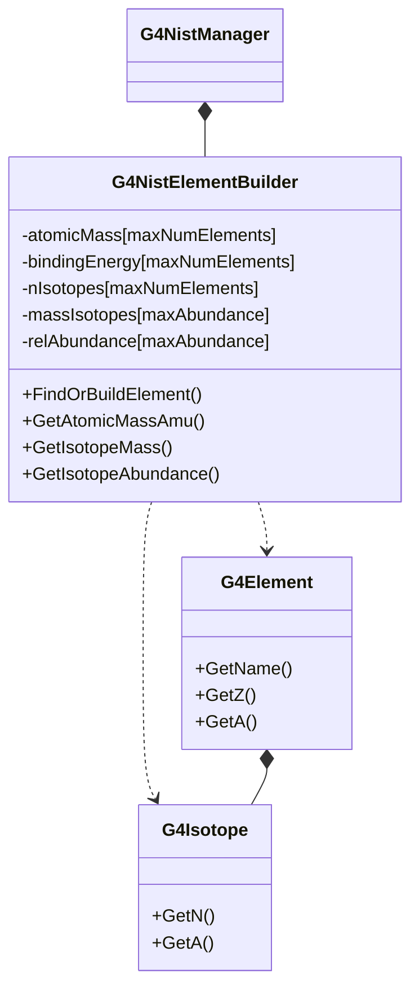

# G4NistElementBuilder

**File**: `source/materials/include/G4NistElementBuilder.hh`

## Overview

G4NistElementBuilder is a utility class that manages the NIST database of chemical elements and their isotopic composition. It provides access to element properties including atomic masses, isotope abundances, and binding energies based on data from the NIST (National Institute of Standards and Technology) database.

This class is primarily used internally by G4NistManager but can be accessed directly for detailed element and isotope queries.

## NIST Database Reference

Element data is sourced from the NIST database on Atomic Weights and Isotope Compositions:
http://physics.nist.gov/PhysRefData/Compositions/index.html

## Class Relationships



## Constants

### Database Limits

```cpp
const G4int maxNumElements = 108;
const G4int maxAbundance = 3500;
```

- `maxNumElements`: Maximum number of elements in the database (Z = 1 to 108)
- `maxAbundance`: Maximum total number of isotope entries

**Location**: G4NistElementBuilder.hh:60-61

## Constructor & Destructor

### Constructor

```cpp
explicit G4NistElementBuilder(G4int vb);
```

Constructs the element builder with specified verbosity.

**Parameters**:
- `vb`: Verbosity level (0 = silent, higher = more output)

**Location**: G4NistElementBuilder.hh:66

**Note**: Constructor is explicit to prevent implicit conversions. Typically instantiated only by G4NistManager.

### Destructor

```cpp
~G4NistElementBuilder() = default;
```

Default destructor (compiler-generated).

**Location**: G4NistElementBuilder.hh:67

## Element Finding and Building Methods

### FindElement

```cpp
inline G4Element* FindElement(G4int Z) const;
```

Finds an existing G4Element by atomic number without building a new one.

**Parameters**:
- `Z`: Atomic number (1-108)

**Returns**: Pointer to G4Element if already built, nullptr otherwise

**Location**: G4NistElementBuilder.hh:70, 233-238

**Usage**:
```cpp
G4NistElementBuilder* builder = ...;
G4Element* carbon = builder->FindElement(6);
if (carbon == nullptr) {
    // Element not yet built
}
```

### FindOrBuildElement (by Z)

```cpp
G4Element* FindOrBuildElement(G4int Z, G4bool buildIsotopes = true);
```

Finds or builds a G4Element by atomic number.

**Parameters**:
- `Z`: Atomic number (1-108)
- `buildIsotopes`: If true, builds element with natural isotope composition (default: true)

**Returns**: Pointer to G4Element

**Location**: G4NistElementBuilder.hh:71

**Behavior**:
- If element already exists, returns existing instance
- If not, builds new element from NIST database
- When `buildIsotopes` is true, creates G4Isotope objects for natural isotopes
- When `buildIsotopes` is false, creates simple element with mean atomic mass

**Usage**:
```cpp
// Build carbon with isotope composition (C-12, C-13)
G4Element* carbon = builder->FindOrBuildElement(6, true);

// Build oxygen without isotope details (faster, simpler)
G4Element* oxygen = builder->FindOrBuildElement(8, false);
```

### FindOrBuildElement (by symbol)

```cpp
G4Element* FindOrBuildElement(const G4String& symb, G4bool buildIsotopes = true);
```

Finds or builds a G4Element by chemical symbol.

**Parameters**:
- `symb`: Element symbol (e.g., "H", "He", "C", "O", "Fe", "Pb")
- `buildIsotopes`: If true, builds element with natural isotope composition (default: true)

**Returns**: Pointer to G4Element, or nullptr if symbol not recognized

**Location**: G4NistElementBuilder.hh:74

**Usage**:
```cpp
G4Element* hydrogen = builder->FindOrBuildElement("H");
G4Element* iron = builder->FindOrBuildElement("Fe");
G4Element* uranium = builder->FindOrBuildElement("U", false);
```

## Element Information Methods

### GetElementNames

```cpp
const std::vector<G4String>& GetElementNames() const;
```

Returns a reference to the vector of all NIST element symbols.

**Returns**: Vector of element symbols (e.g., "H", "He", "Li", ...)

**Location**: G4NistElementBuilder.hh:79, 218-221

**Usage**:
```cpp
const std::vector<G4String>& elements = builder->GetElementNames();
for (const auto& symbol : elements) {
    G4cout << symbol << G4endl;
}
```

### GetZ

```cpp
G4int GetZ(const G4String& symb) const;
```

Returns the atomic number for a given element symbol.

**Parameters**:
- `symb`: Element symbol (e.g., "H", "C", "Fe")

**Returns**: Atomic number, or 0 if symbol not found

**Location**: G4NistElementBuilder.hh:82

**Usage**:
```cpp
G4int carbonZ = builder->GetZ("C");      // Returns 6
G4int ironZ = builder->GetZ("Fe");       // Returns 26
G4int unknown = builder->GetZ("Xx");     // Returns 0
```

### PrintElement

```cpp
void PrintElement(G4int Z) const;
```

Prints detailed information about an element including all isotopes.

**Parameters**:
- `Z`: Atomic number

**Location**: G4NistElementBuilder.hh:76

**Output includes**:
- Element name and symbol
- Atomic mass
- All natural isotopes with abundances
- Binding energies

## Atomic Mass Methods

### GetAtomicMassAmu (by symbol)

```cpp
G4double GetAtomicMassAmu(const G4String& symb) const;
```

Returns the atomic mass in atomic mass units for a given element symbol.

**Parameters**:
- `symb`: Element symbol

**Returns**: Mean atomic mass in amu (includes electron shell mass)

**Location**: G4NistElementBuilder.hh:85

**Note**: Returns mean mass weighted by natural isotope abundances.

**Usage**:
```cpp
G4double carbonMass = builder->GetAtomicMassAmu("C");    // ~12.011 amu
G4double oxygenMass = builder->GetAtomicMassAmu("O");    // ~15.999 amu
```

### GetAtomicMassAmu (by Z)

```cpp
inline G4double GetAtomicMassAmu(G4int Z) const;
```

Returns the atomic mass in amu for a given atomic number.

**Parameters**:
- `Z`: Atomic number (1-108)

**Returns**: Mean atomic mass in amu, or 0.0 if Z is out of range

**Location**: G4NistElementBuilder.hh:89, 148-151

**Implementation**:
```cpp
return (Z > 0 && Z < maxNumElements) ? atomicMass[Z] : 0.0;
```

**Usage**:
```cpp
G4double hydrogenMass = builder->GetAtomicMassAmu(1);   // ~1.008 amu
G4double uraniumMass = builder->GetAtomicMassAmu(92);   // ~238.029 amu
```

## Isotope Mass Methods

### GetIsotopeMass

```cpp
inline G4double GetIsotopeMass(G4int Z, G4int N) const;
```

Returns the mass of a specific isotope **without electron shell**.

**Parameters**:
- `Z`: Atomic number (number of protons)
- `N`: Number of nucleons (mass number A = Z + number of neutrons)

**Returns**: Nuclear mass in Geant4 energy units (MeV), or 0.0 if isotope not in database

**Location**: G4NistElementBuilder.hh:92, 155-165

**Formula**: Pure nuclear mass (no electrons)

**Usage**:
```cpp
// Get mass of Carbon-12 nucleus
G4double c12Mass = builder->GetIsotopeMass(6, 12);

// Get mass of Uranium-238 nucleus
G4double u238Mass = builder->GetIsotopeMass(92, 238);
```

### GetAtomicMass

```cpp
inline G4double GetAtomicMass(G4int Z, G4int N) const;
```

Returns the mass of a specific isotope **including electron shell**.

**Parameters**:
- `Z`: Atomic number
- `N`: Number of nucleons

**Returns**: Atomic mass in Geant4 energy units (MeV), or 0.0 if isotope not in database

**Location**: G4NistElementBuilder.hh:96, 169-179

**Formula**:
```
Atomic mass = Nuclear mass + Z × electron_mass - binding_energy
```

**Usage**:
```cpp
// Get mass of Carbon-12 atom (with electrons)
G4double c12AtomMass = builder->GetAtomicMass(6, 12);

// Compare with nuclear mass
G4double c12NuclearMass = builder->GetIsotopeMass(6, 12);
G4double difference = c12AtomMass - c12NuclearMass;
// difference ≈ 6 × electron_mass - binding_energy
```

## Binding Energy Method

### GetTotalElectronBindingEnergy

```cpp
inline G4double GetTotalElectronBindingEnergy(G4int Z) const;
```

Returns the total electron binding energy for an atom.

**Parameters**:
- `Z`: Atomic number

**Returns**: Total binding energy in Geant4 energy units (MeV), or 0.0 if Z is out of range

**Location**: G4NistElementBuilder.hh:99, 183-186

**Note**: This is the sum of binding energies for all electron shells.

**Usage**:
```cpp
G4double carbonBinding = builder->GetTotalElectronBindingEnergy(6);
G4double leadBinding = builder->GetTotalElectronBindingEnergy(82);
```

## Isotope Information Methods

### GetIsotopeAbundance

```cpp
inline G4double GetIsotopeAbundance(G4int Z, G4int N) const;
```

Returns the natural abundance of a specific isotope.

**Parameters**:
- `Z`: Atomic number
- `N`: Number of nucleons

**Returns**: Abundance as a fraction (0.0 to 1.0), or 0.0 if isotope not in database

**Location**: G4NistElementBuilder.hh:102, 190-200

**Usage**:
```cpp
// Carbon isotopes
G4double c12Abundance = builder->GetIsotopeAbundance(6, 12);  // ~0.989
G4double c13Abundance = builder->GetIsotopeAbundance(6, 13);  // ~0.011

// Verify they sum to 1.0
G4double total = c12Abundance + c13Abundance;  // ≈ 1.0
```

### GetNistFirstIsotopeN

```cpp
inline G4int GetNistFirstIsotopeN(G4int Z) const;
```

Returns the number of nucleons (N) for the first natural isotope of an element.

**Parameters**:
- `Z`: Atomic number

**Returns**: Number of nucleons for first isotope, or 0 if Z is out of range

**Location**: G4NistElementBuilder.hh:105, 204-207

**Usage**:
```cpp
// Carbon's first isotope is C-12
G4int firstN = builder->GetNistFirstIsotopeN(6);  // Returns 12

// Hydrogen's first isotope is H-1
G4int firstH = builder->GetNistFirstIsotopeN(1);  // Returns 1
```

### GetNumberOfNistIsotopes

```cpp
inline G4int GetNumberOfNistIsotopes(G4int Z) const;
```

Returns the number of natural isotopes for an element in the NIST database.

**Parameters**:
- `Z`: Atomic number

**Returns**: Number of natural isotopes, or 0 if Z is out of range

**Location**: G4NistElementBuilder.hh:108, 211-214

**Usage**:
```cpp
G4int carbonIsotopes = builder->GetNumberOfNistIsotopes(6);   // Returns 2 (C-12, C-13)
G4int oxygenIsotopes = builder->GetNumberOfNistIsotopes(8);   // Returns 3 (O-16, O-17, O-18)
G4int tinIsotopes = builder->GetNumberOfNistIsotopes(50);     // Returns 10 (most stable isotopes)

// Iterate over all isotopes
G4int Z = 6;  // Carbon
G4int firstN = builder->GetNistFirstIsotopeN(Z);
G4int nIsotopes = builder->GetNumberOfNistIsotopes(Z);
for (G4int i = 0; i < nIsotopes; ++i) {
    G4int N = firstN + i;
    G4double abundance = builder->GetIsotopeAbundance(Z, N);
    G4double mass = builder->GetIsotopeMass(Z, N);
    G4cout << "Isotope " << Z << "-" << N
           << ": abundance = " << abundance
           << ", mass = " << mass << G4endl;
}
```

## Database Query Methods

### GetMaxNumElements

```cpp
inline G4int GetMaxNumElements() const;
```

Returns the maximum atomic number supported by the database.

**Returns**: Maximum Z value (107, for elements 1-108)

**Location**: G4NistElementBuilder.hh:111, 225

**Usage**:
```cpp
G4int maxZ = builder->GetMaxNumElements();  // Returns 107
// Database supports elements Z = 1 to maxZ
```

## Verbosity Control

### SetVerbose

```cpp
inline void SetVerbose(G4int);
```

Sets the verbosity level for debugging output.

**Parameters**:
- Verbosity level (0 = silent, higher = more verbose)

**Location**: G4NistElementBuilder.hh:113, 229

**Usage**:
```cpp
builder->SetVerbose(1);  // Enable basic output
builder->SetVerbose(0);  // Silent mode
```

## Data Members

### Atomic Properties

```cpp
G4double atomicMass[maxNumElements];      // Mean atomic masses in amu
G4double bindingEnergy[maxNumElements];   // Total electron binding energies
```

**Location**: G4NistElementBuilder.hh:128-129

**Note**: Indexed by atomic number Z.

### Isotope Organization

```cpp
G4int nIsotopes[maxNumElements];          // Number of isotopes per element
G4int nFirstIsotope[maxNumElements];      // N value of first isotope
G4int idxIsotopes[maxNumElements];        // Index into isotope arrays
```

**Location**: G4NistElementBuilder.hh:130-132

**Example**:
- For Carbon (Z=6): nIsotopes[6]=2, nFirstIsotope[6]=12, idxIsotopes[6]=index_to_C12_data
- Natural isotopes are C-12 and C-13

### Element Tracking

```cpp
G4int elmIndex[maxNumElements];           // Index in G4ElementTable (-1 if not built)
```

**Location**: G4NistElementBuilder.hh:134

### Isotope Data Arrays

```cpp
G4double massIsotopes[maxAbundance];      // Isotope masses in Geant4 units
G4double sigMass[maxAbundance];           // Mass uncertainties in Geant4 units
G4double relAbundance[maxAbundance];      // Natural abundances (0.0-1.0)
```

**Location**: G4NistElementBuilder.hh:136-138

**Note**: Arrays contain data for all isotopes of all elements, indexed via idxIsotopes array.

### Element Names

```cpp
std::vector<G4String> elmSymbol;          // Element symbols (H, He, Li, ...)
```

**Location**: G4NistElementBuilder.hh:143

### Internal State

```cpp
G4int index;                               // Current index for building
G4int verbose;                             // Verbosity level
```

**Location**: G4NistElementBuilder.hh:140-141

## Private Methods

### Initialise

```cpp
void Initialise();
```

Initializes the NIST database by calling AddElement for all known elements.

**Location**: G4NistElementBuilder.hh:116

### AddElement

```cpp
void AddElement(const G4String& symbol, G4int Z, G4int NumberOfIsotopes,
                const G4int& N, const G4double& A, const G4double& sigmaA,
                const G4double& W);
```

Adds element parameters to internal database.

**Parameters**:
- `symbol`: Element symbol
- `Z`: Atomic number
- `NumberOfIsotopes`: Number of natural isotopes
- `N`: Array of nucleon numbers for isotopes
- `A`: Array of atomic masses in amu
- `sigmaA`: Array of mass uncertainties
- `W`: Array of natural abundances in percent

**Location**: G4NistElementBuilder.hh:121-122

**Note**: Internal method called during initialization.

### BuildElement

```cpp
G4Element* BuildElement(G4int Z);
```

Builds a G4Element from the internal database.

**Parameters**:
- `Z`: Atomic number

**Returns**: Pointer to newly created G4Element

**Location**: G4NistElementBuilder.hh:125

**Note**: Internal method called by FindOrBuildElement.

## Usage Examples

### Basic Element Access

```cpp
// Typically accessed via G4NistManager
G4NistManager* nist = G4NistManager::Instance();

// Get elements
G4Element* H = nist->FindOrBuildElement("H");
G4Element* C = nist->FindOrBuildElement(6);
G4Element* N = nist->FindOrBuildElement("N");
G4Element* O = nist->FindOrBuildElement("O");
```

### Isotope Query Example

```cpp
G4NistManager* nist = G4NistManager::Instance();

// Query carbon isotopes
G4int Z = 6;
G4cout << "Carbon isotope information:" << G4endl;
G4cout << "Mean atomic mass: " << nist->GetAtomicMassAmu(Z) << " amu" << G4endl;

G4int firstN = nist->GetNistFirstIsotopeN(Z);
G4int nIsotopes = nist->GetNumberOfNistIsotopes(Z);

for (G4int i = 0; i < nIsotopes; ++i) {
    G4int N = firstN + i;
    G4cout << "  C-" << N << ": "
           << "abundance = " << nist->GetIsotopeAbundance(Z, N) * 100 << "%, "
           << "mass = " << nist->GetIsotopeMass(Z, N) / CLHEP::amu_c2 << " amu"
           << G4endl;
}
```

### Element Properties Example

```cpp
G4NistManager* nist = G4NistManager::Instance();

// Query various element properties
for (G4int Z = 1; Z <= 10; ++Z) {
    G4double mass = nist->GetAtomicMassAmu(Z);
    G4double binding = nist->GetTotalElectronBindingEnergy(Z);
    G4int nIso = nist->GetNumberOfNistIsotopes(Z);

    G4cout << "Z=" << Z
           << ", mass=" << mass << " amu"
           << ", binding=" << binding << " MeV"
           << ", isotopes=" << nIso
           << G4endl;
}
```

### Comparing Nuclear and Atomic Masses

```cpp
G4NistManager* nist = G4NistManager::Instance();

G4int Z = 6;   // Carbon
G4int N = 12;  // C-12

G4double nuclearMass = nist->GetIsotopeMass(Z, N);
G4double atomicMass = nist->GetAtomicMass(Z, N);
G4double bindingEnergy = nist->GetTotalElectronBindingEnergy(Z);

G4cout << "C-12 nuclear mass: " << nuclearMass / CLHEP::amu_c2 << " amu" << G4endl;
G4cout << "C-12 atomic mass: " << atomicMass / CLHEP::amu_c2 << " amu" << G4endl;
G4cout << "Difference: " << (atomicMass - nuclearMass) << " MeV" << G4endl;
G4cout << "Expected (6×me - BE): "
       << (6 * CLHEP::electron_mass_c2 - bindingEnergy) << " MeV" << G4endl;
```

### Building Elements With/Without Isotopes

```cpp
G4NistManager* nist = G4NistManager::Instance();

// Build with isotopes (for detailed simulations)
G4Element* H_detailed = nist->FindOrBuildElement("H", true);
// This creates H with H-1 and H-2 (deuterium) isotopes

// Build without isotopes (for faster simulations)
G4Element* H_simple = nist->FindOrBuildElement("H", false);
// This creates H with average atomic mass only

// Check the difference
G4cout << "H with isotopes has " << H_detailed->GetNumberOfIsotopes() << " isotopes" << G4endl;
// Output: H with isotopes has 2 isotopes (H-1, H-2)
```

## Performance Considerations

### Pre-computed Tables

The class uses pre-allocated arrays for fast lookup:
- Direct array access by atomic number: O(1) complexity
- No dynamic memory allocation during queries
- All data loaded at initialization

### Isotope vs Non-Isotope Elements

- **With isotopes** (`buildIsotopes=true`):
  - Creates detailed isotopic composition
  - Slightly slower element construction
  - More accurate for low-energy physics
  - Required for neutron transport simulations

- **Without isotopes** (`buildIsotopes=false`):
  - Uses mean atomic mass only
  - Faster element construction
  - Sufficient for most high-energy physics
  - Recommended when isotope effects are negligible

## Thread Safety

- All const methods are thread-safe for reading
- Element building (FindOrBuildElement) is synchronized by G4NistManager
- Database arrays are read-only after initialization
- No modification methods exposed to users

## Version History

Key modifications (from header comments, G4NistElementBuilder.hh:39-45):

- **06.08.08**: V. Ivanchenko added binding energy parameterization and use isotope mass in G4 units
- **02.05.07**: V. Ivanchenko added GetNistFirstIsotopeN and GetNumberOfNistIsotopes
- **17.10.06**: V. Ivanchenko added GetAtomicMass and GetNistElementNames methods
- **27.02.06**: V. Ivanchenko added GetAtomicMassAmu
- **27.02.06**: V. Ivanchenko return m=0 if Z&N combination is out of NIST
- **21.11.2004**: V. Ivanchenko - Initial creation

## See Also

- [G4NistManager](./g4nistmanager.md) - Main NIST database manager
- [G4NistMaterialBuilder](./g4nistmaterialbuilder.md) - NIST material database and builder
- [G4Element](./g4element.md) - Element class
- [G4Isotope](./g4isotope.md) - Isotope class
- [Materials Module Overview](../overview.md) - Materials module documentation
