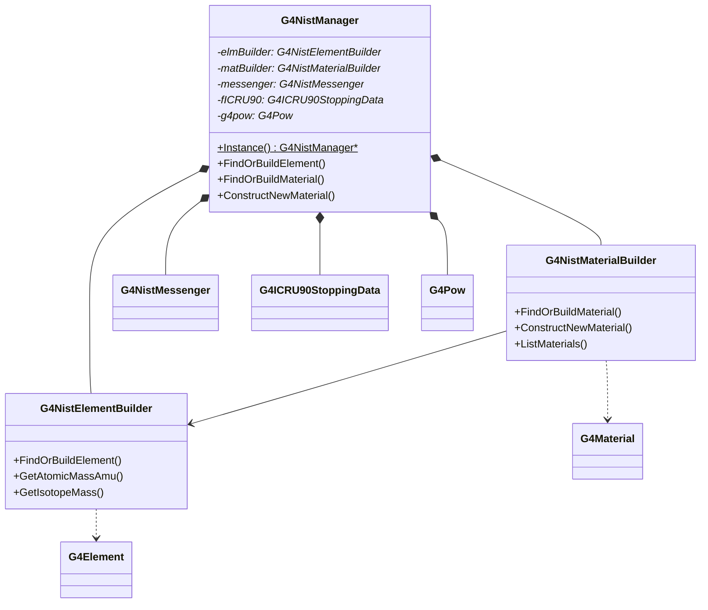

# G4NistManager

**File**: `source/materials/include/G4NistManager.hh`

## Overview

G4NistManager is the central singleton class providing access to Geant4's NIST (National Institute of Standards and Technology) database of elements and materials. It serves as a convenient unified interface to retrieve pre-defined elements, isotopes, and materials, as well as construct custom materials using NIST database components.

The class aggregates functionality from G4NistElementBuilder and G4NistMaterialBuilder, providing a single point of access for all NIST-related operations in Geant4 simulations.

## Singleton Pattern

G4NistManager implements the singleton design pattern to ensure only one instance exists throughout the application lifecycle.

### Instance Access

```cpp
static G4NistManager* Instance();
```

Returns the singleton instance of G4NistManager.

**Location**: G4NistManager.hh:78

**Thread Safety**: The implementation uses thread-safe initialization with G4Mutex protection in multithreaded mode.

**Usage**:
```cpp
G4NistManager* nist = G4NistManager::Instance();
```

## NIST Database Reference

Element data is sourced from the NIST database on Atomic Weights and Isotope Compositions:
http://physics.nist.gov/PhysRefData/Compositions/index.html

## Class Relationships



## Element Methods

### GetElement

```cpp
inline G4Element* GetElement(std::size_t index) const;
```

Retrieves a G4Element by its index in the element table.

**Parameters**:
- `index`: Index in the global element table

**Returns**: Pointer to G4Element, or nullptr if index is out of range

**Location**: G4NistManager.hh:83, 288-291

### FindElement

```cpp
inline G4Element* FindElement(G4int Z) const;
```

Finds an existing G4Element by atomic number.

**Parameters**:
- `Z`: Atomic number

**Returns**: Pointer to G4Element if found, nullptr otherwise

**Location**: G4NistManager.hh:87, 295

**Note**: Only finds already-built elements; does not create new ones.

### FindOrBuildElement (by Z)

```cpp
inline G4Element* FindOrBuildElement(G4int Z, G4bool isotopes = true);
```

Finds or builds a G4Element by atomic number.

**Parameters**:
- `Z`: Atomic number (1-108)
- `isotopes`: If true, builds element with natural isotope composition (default: true)

**Returns**: Pointer to G4Element

**Location**: G4NistManager.hh:88, 299-302

**Usage**:
```cpp
G4NistManager* nist = G4NistManager::Instance();
G4Element* carbon = nist->FindOrBuildElement(6);  // Carbon with isotopes
G4Element* oxygen = nist->FindOrBuildElement(8, false);  // Oxygen without isotope details
```

### FindOrBuildElement (by symbol)

```cpp
inline G4Element* FindOrBuildElement(const G4String& symb, G4bool isotopes = true);
```

Finds or builds a G4Element by chemical symbol.

**Parameters**:
- `symb`: Element symbol (e.g., "H", "He", "C", "O")
- `isotopes`: If true, builds element with natural isotope composition (default: true)

**Returns**: Pointer to G4Element

**Location**: G4NistManager.hh:92, 306-309

**Usage**:
```cpp
G4Element* hydrogen = nist->FindOrBuildElement("H");
G4Element* iron = nist->FindOrBuildElement("Fe");
```

### GetNumberOfElements

```cpp
inline std::size_t GetNumberOfElements() const;
```

Returns the total number of elements currently defined.

**Location**: G4NistManager.hh:96, 313

### GetZ

```cpp
inline G4int GetZ(const G4String& symb) const;
```

Returns the atomic number for a given element symbol.

**Parameters**:
- `symb`: Element symbol (e.g., "H", "C", "Fe")

**Returns**: Atomic number, or 0 if symbol not found

**Location**: G4NistManager.hh:100, 317

## Element Property Methods

### GetAtomicMassAmu (by symbol)

```cpp
inline G4double GetAtomicMassAmu(const G4String& symb) const;
```

Returns the atomic mass in atomic mass units (amu) for a given element symbol.

**Parameters**:
- `symb`: Element symbol

**Returns**: Mean atomic mass in amu (includes electron shell mass)

**Location**: G4NistManager.hh:105, 321-324

**Note**: Returns mean mass for natural isotope composition.

### GetAtomicMassAmu (by Z)

```cpp
inline G4double GetAtomicMassAmu(G4int Z) const;
```

Returns the atomic mass in amu for a given atomic number.

**Parameters**:
- `Z`: Atomic number

**Returns**: Mean atomic mass in amu

**Location**: G4NistManager.hh:110, 328-331

### GetIsotopeMass

```cpp
inline G4double GetIsotopeMass(G4int Z, G4int N) const;
```

Returns the mass of a specific isotope without electron shell.

**Parameters**:
- `Z`: Atomic number (number of protons)
- `N`: Number of nucleons (A = Z + number of neutrons)

**Returns**: Isotope mass in Geant4 energy units (MeV)

**Location**: G4NistManager.hh:114, 335-338

### GetAtomicMass

```cpp
inline G4double GetAtomicMass(G4int Z, G4int N) const;
```

Returns the mass of a specific isotope including electron shell.

**Parameters**:
- `Z`: Atomic number
- `N`: Number of nucleons

**Returns**: Atomic mass in Geant4 energy units (MeV)

**Location**: G4NistManager.hh:119, 342-345

**Formula**: Isotope mass + Z × electron mass - binding energy

### GetTotalElectronBindingEnergy

```cpp
inline G4double GetTotalElectronBindingEnergy(G4int Z) const;
```

Returns the total electron binding energy for an atom.

**Parameters**:
- `Z`: Atomic number

**Returns**: Total binding energy in Geant4 energy units (MeV)

**Location**: G4NistManager.hh:123, 349-352

## Isotope Information Methods

### GetNistFirstIsotopeN

```cpp
inline G4int GetNistFirstIsotopeN(G4int Z) const;
```

Returns the number of nucleons (N) for the first natural isotope.

**Parameters**:
- `Z`: Atomic number

**Returns**: Number of nucleons for first natural isotope

**Location**: G4NistManager.hh:127, 363-366

### GetNumberOfNistIsotopes

```cpp
inline G4int GetNumberOfNistIsotopes(G4int Z) const;
```

Returns the number of natural isotopes for an element.

**Parameters**:
- `Z`: Atomic number

**Returns**: Number of natural isotopes in NIST database

**Location**: G4NistManager.hh:131, 370-373

### GetIsotopeAbundance

```cpp
inline G4double GetIsotopeAbundance(G4int Z, G4int N) const;
```

Returns the natural abundance of a specific isotope.

**Parameters**:
- `Z`: Atomic number
- `N`: Number of nucleons

**Returns**: Abundance as a fraction (0.0 to 1.0)

**Location**: G4NistManager.hh:135, 356-359

**Usage**:
```cpp
// Get abundance of Carbon-12
G4double abundance = nist->GetIsotopeAbundance(6, 12);  // Returns ~0.989
```

## Element Information Methods

### PrintElement (by Z)

```cpp
inline void PrintElement(G4int Z) const;
```

Prints element information for a given atomic number.

**Parameters**:
- `Z`: Atomic number

**Location**: G4NistManager.hh:139, 398

### PrintElement (by symbol)

```cpp
void PrintElement(const G4String&) const;
```

Prints element information by symbol, or all elements if "all" is specified.

**Parameters**:
- Symbol name, or "all" to print all elements

**Location**: G4NistManager.hh:143

### PrintG4Element

```cpp
void PrintG4Element(const G4String&) const;
```

Prints G4Element information by name, or all G4Elements if "all" is specified.

**Parameters**:
- Element name, or "all" to print all G4Elements

**Location**: G4NistManager.hh:147

### GetNistElementNames

```cpp
inline const std::vector<G4String>& GetNistElementNames() const;
```

Returns a reference to the vector of all NIST element names.

**Returns**: Vector of element symbol strings

**Location**: G4NistManager.hh:151, 377-380

### GetMeanIonisationEnergy

```cpp
inline G4double GetMeanIonisationEnergy(G4int Z) const;
```

Returns the mean ionisation energy for an element.

**Parameters**:
- `Z`: Atomic number (Z <= 98)

**Returns**: Mean ionisation energy in eV

**Location**: G4NistManager.hh:155, 384-387

**Note**: Data available for Z = 1 to 98.

### GetNominalDensity

```cpp
inline G4double GetNominalDensity(G4int Z) const;
```

Returns the nominal density for simple materials by atomic number, or by index for other NIST materials.

**Parameters**:
- `Z`: Atomic number for simple materials, or index for NIST materials

**Returns**: Density in g/cm³

**Location**: G4NistManager.hh:160, 391-394

## Material Retrieval Methods

### GetMaterial

```cpp
inline G4Material* GetMaterial(std::size_t index) const;
```

Retrieves a G4Material by its index in the material table.

**Parameters**:
- `index`: Index in the global material table

**Returns**: Pointer to G4Material, or nullptr if index is out of range

**Location**: G4NistManager.hh:164, 402-405

### FindMaterial

```cpp
inline G4Material* FindMaterial(const G4String& name) const;
```

Finds an existing G4Material by name.

**Parameters**:
- `name`: Material name

**Returns**: Pointer to G4Material if found, nullptr otherwise

**Location**: G4NistManager.hh:168, 413-416

**Note**: Only finds already-built materials; does not create new ones.

### FindOrBuildMaterial

```cpp
inline G4Material* FindOrBuildMaterial(
    const G4String& name, G4bool isotopes = true, G4bool warning = false);
```

Finds or builds a G4Material from the NIST database.

**Parameters**:
- `name`: Material name (e.g., "G4_WATER", "G4_AIR", "G4_Pb")
- `isotopes`: If true, builds elements with isotope composition (default: true)
- `warning`: If true, prints warning if material not found (default: false)

**Returns**: Pointer to G4Material

**Location**: G4NistManager.hh:169-170, 420-423

**Available Materials**:
- Simple materials: "G4_H", "G4_He", ..., "G4_U" (elements 1-92)
- NIST compounds: "G4_WATER", "G4_AIR", "G4_CONCRETE", etc.
- HEP materials: "G4_Galactic", "G4_SILICON_DIOXIDE", etc.

**Usage**:
```cpp
G4Material* water = nist->FindOrBuildMaterial("G4_WATER");
G4Material* lead = nist->FindOrBuildMaterial("G4_Pb");
G4Material* air = nist->FindOrBuildMaterial("G4_AIR");
```

### FindSimpleMaterial

```cpp
inline G4Material* FindSimpleMaterial(G4int Z) const;
```

Finds an existing simple material (single element) by atomic number.

**Parameters**:
- `Z`: Atomic number

**Returns**: Pointer to G4Material if found, nullptr otherwise

**Location**: G4NistManager.hh:174, 427-430

### FindOrBuildSimpleMaterial

```cpp
inline G4Material* FindOrBuildSimpleMaterial(G4int Z, G4bool warning = false);
```

Finds or builds a simple material by atomic number.

**Parameters**:
- `Z`: Atomic number
- `warning`: If true, prints warning if material cannot be built (default: false)

**Returns**: Pointer to G4Material

**Location**: G4NistManager.hh:175, 434-437

**Usage**:
```cpp
G4Material* silicon = nist->FindOrBuildSimpleMaterial(14);  // Silicon
G4Material* tungsten = nist->FindOrBuildSimpleMaterial(74); // Tungsten
```

## Material Construction Methods

### BuildMaterialWithNewDensity

```cpp
G4Material* BuildMaterialWithNewDensity(const G4String& name,
                                        const G4String& basename,
                                        G4double density = 0.0,
                                        G4double temp = NTP_Temperature,
                                        G4double pres = CLHEP::STP_Pressure);
```

Builds a new material based on an existing NIST material with modified density.

**Parameters**:
- `name`: New material name
- `basename`: Name of base NIST material
- `density`: New density (0.0 = use base material density) in g/cm³
- `temp`: Temperature in Kelvin (default: 293.15 K)
- `pres`: Pressure in atmospheres (default: STP)

**Returns**: Pointer to new G4Material

**Location**: G4NistManager.hh:180-181

**Usage**:
```cpp
// Create low-density water for foam simulation
G4Material* waterFoam = nist->BuildMaterialWithNewDensity(
    "WaterFoam", "G4_WATER", 0.5*g/cm3);
```

### ConstructNewMaterial (by atom count)

```cpp
inline G4Material* ConstructNewMaterial(const G4String& name,
                                        const std::vector<G4String>& elm,
                                        const std::vector<G4int>& nbAtoms,
                                        G4double dens,
                                        G4bool isotopes = true,
                                        G4State state = kStateSolid,
                                        G4double temp = NTP_Temperature,
                                        G4double pressure = CLHEP::STP_Pressure);
```

Constructs a new material from scratch by specifying atom counts.

**Parameters**:
- `name`: Material name
- `elm`: Vector of element symbols
- `nbAtoms`: Vector of atom counts for each element
- `dens`: Density in g/cm³
- `isotopes`: Include isotope composition (default: true)
- `state`: Material state (default: kStateSolid)
- `temp`: Temperature (default: 293.15 K)
- `pressure`: Pressure (default: STP)

**Returns**: Pointer to new G4Material

**Location**: G4NistManager.hh:186-189, 441-447

**Usage**:
```cpp
// Create water (H2O) from scratch
std::vector<G4String> elements = {"H", "O"};
std::vector<G4int> atomCounts = {2, 1};
G4Material* myWater = nist->ConstructNewMaterial(
    "MyWater", elements, atomCounts, 1.0*g/cm3);

// Create calcium carbonate (CaCO3)
std::vector<G4String> elements2 = {"Ca", "C", "O"};
std::vector<G4int> atomCounts2 = {1, 1, 3};
G4Material* caco3 = nist->ConstructNewMaterial(
    "CalciumCarbonate", elements2, atomCounts2, 2.71*g/cm3);
```

### ConstructNewMaterial (by mass fraction)

```cpp
inline G4Material* ConstructNewMaterial(const G4String& name,
                                        const std::vector<G4String>& elm,
                                        const std::vector<G4double>& weight,
                                        G4double dens,
                                        G4bool isotopes = true,
                                        G4State state = kStateSolid,
                                        G4double temp = NTP_Temperature,
                                        G4double pressure = CLHEP::STP_Pressure);
```

Constructs a new material from scratch by specifying mass fractions.

**Parameters**:
- `name`: Material name
- `elm`: Vector of element symbols
- `weight`: Vector of mass fractions (must sum to 1.0)
- `dens`: Density in g/cm³
- `isotopes`: Include isotope composition (default: true)
- `state`: Material state (default: kStateSolid)
- `temp`: Temperature (default: 293.15 K)
- `pressure`: Pressure (default: STP)

**Returns**: Pointer to new G4Material

**Location**: G4NistManager.hh:194-197, 451-456

**Usage**:
```cpp
// Create air by mass fraction (simplified)
std::vector<G4String> airElements = {"N", "O"};
std::vector<G4double> airFractions = {0.7, 0.3};
G4Material* myAir = nist->ConstructNewMaterial(
    "MyAir", airElements, airFractions, 1.29*mg/cm3, true, kStateGas);
```

### ConstructNewGasMaterial

```cpp
inline G4Material* ConstructNewGasMaterial(const G4String& name,
                                           const G4String& nameNist,
                                           G4double temp,
                                           G4double pres,
                                           G4bool isotopes = true);
```

Constructs a gas material based on a NIST material at specified temperature and pressure.

**Parameters**:
- `name`: New material name
- `nameNist`: Name of base NIST material
- `temp`: Temperature in Kelvin
- `pres`: Pressure in atmospheres
- `isotopes`: Include isotope composition (default: true)

**Returns**: Pointer to new G4Material

**Location**: G4NistManager.hh:201-202, 460-464

**Usage**:
```cpp
// Create argon gas at custom temperature and pressure
G4Material* warmArgon = nist->ConstructNewGasMaterial(
    "WarmArgon", "G4_Ar", 350*kelvin, 2.0*atmosphere);
```

### ConstructNewIdealGasMaterial

```cpp
inline G4Material* ConstructNewIdealGasMaterial(const G4String& name,
                                                const std::vector<G4String>& elm,
                                                const std::vector<G4int>& nbAtoms,
                                                G4bool isotopes = true,
                                                G4double temp = NTP_Temperature,
                                                G4double pressure = CLHEP::STP_Pressure);
```

Constructs an ideal gas material from elements.

**Parameters**:
- `name`: Material name
- `elm`: Vector of element symbols
- `nbAtoms`: Vector of atom counts
- `isotopes`: Include isotope composition (default: true)
- `temp`: Temperature (default: 293.15 K)
- `pressure`: Pressure (default: STP)

**Returns**: Pointer to new G4Material

**Location**: G4NistManager.hh:206-208, 468-473

**Note**: Density is computed using ideal gas law.

**Usage**:
```cpp
// Create ideal gas mixture
std::vector<G4String> gasElements = {"H", "He"};
std::vector<G4int> gasCounts = {2, 1};
G4Material* idealGasMix = nist->ConstructNewIdealGasMaterial(
    "H2He_Mix", gasElements, gasCounts);
```

## Density Effect Methods

### SetDensityEffectCalculatorFlag (by name)

```cpp
void SetDensityEffectCalculatorFlag(const G4String&, G4bool);
```

Enables or disables the density effect calculator for a material by name.

**Parameters**:
- Material name
- Flag: true to enable, false to disable

**Location**: G4NistManager.hh:212

### SetDensityEffectCalculatorFlag (by pointer)

```cpp
void SetDensityEffectCalculatorFlag(G4Material*, G4bool);
```

Enables or disables the density effect calculator for a material by pointer.

**Parameters**:
- Material pointer
- Flag: true to enable, false to disable

**Location**: G4NistManager.hh:216

## Material Information Methods

### GetNumberOfMaterials

```cpp
inline std::size_t GetNumberOfMaterials() const;
```

Returns the total number of materials currently defined.

**Location**: G4NistManager.hh:220, 284

### ListMaterials

```cpp
inline void ListMaterials(const G4String&) const;
```

Prints a list of available materials by category.

**Parameters**:
- `"simple"`: Pure materials in basic state (Z = 1, ..., 98)
- `"compound"`: NIST compounds
- `"hep"`: HEP materials and compounds
- `"bio"`: Bio-medical materials and compounds
- `"all"`: All materials

**Location**: G4NistManager.hh:237, 477-480

**Usage**:
```cpp
nist->ListMaterials("hep");  // List all HEP materials
nist->ListMaterials("all");  // List all available materials
```

### GetNistMaterialNames

```cpp
inline const std::vector<G4String>& GetNistMaterialNames() const;
```

Returns a reference to the vector of all NIST material names.

**Returns**: Vector of material name strings

**Location**: G4NistManager.hh:241, 484-487

### PrintG4Material

```cpp
void PrintG4Material(const G4String&) const;
```

Prints detailed information about a specific G4Material by name.

**Parameters**:
- Material name

**Location**: G4NistManager.hh:228

## Verbosity Control

### GetVerbose

```cpp
inline G4int GetVerbose() const;
```

Returns the current verbosity level.

**Location**: G4NistManager.hh:222, 409

### SetVerbose

```cpp
void SetVerbose(G4int);
```

Sets the verbosity level for debugging output.

**Parameters**:
- Verbosity level (0 = silent, higher = more output)

**Location**: G4NistManager.hh:224

## Fast Computation Methods

### GetZ13 (double)

```cpp
inline G4double GetZ13(G4double Z) const;
```

Fast computation of Z^(1/3) for any value.

**Parameters**:
- `Z`: Value to compute cube root

**Returns**: Z^(1/3)

**Location**: G4NistManager.hh:245, 491

### GetZ13 (int)

```cpp
inline G4double GetZ13(G4int Z) const;
```

Fast computation of Z^(1/3) for integer atomic numbers.

**Parameters**:
- `Z`: Atomic number

**Returns**: Z^(1/3)

**Location**: G4NistManager.hh:246, 495

**Note**: Uses pre-computed table for performance.

### GetA27

```cpp
inline G4double GetA27(G4int Z) const;
```

Fast computation of A^0.27 for natural abundances.

**Parameters**:
- `Z`: Atomic number

**Returns**: A^0.27 where A is the atomic mass

**Location**: G4NistManager.hh:250, 499-502

**Note**: Uses pre-computed table for Z = 0-100, computes on-the-fly for larger Z.

### GetLOGZ

```cpp
inline G4double GetLOGZ(G4int Z) const;
```

Fast computation of log(Z).

**Parameters**:
- `Z`: Atomic number

**Returns**: Natural logarithm of Z

**Location**: G4NistManager.hh:254, 506

### GetLOGAMU

```cpp
inline G4double GetLOGAMU(G4int Z) const;
```

Fast computation of log(A) for natural abundances.

**Parameters**:
- `Z`: Atomic number

**Returns**: Natural logarithm of atomic mass in amu

**Location**: G4NistManager.hh:255, 510-513

**Note**: Available for Z = 0-100.

## ICRU90 Stopping Data

### GetICRU90StoppingData

```cpp
G4ICRU90StoppingData* GetICRU90StoppingData();
```

Returns pointer to ICRU90 stopping power data.

**Returns**: Pointer to G4ICRU90StoppingData

**Location**: G4NistManager.hh:257

## Thread Safety

The G4NistManager singleton is thread-safe in multi-threaded mode:

- Instance creation is protected by G4Mutex (nistManagerMutex)
- Uses Meyer's singleton pattern with static local variable
- All getter methods are const and thread-safe for read operations
- Material/element construction methods are synchronized internally

**Implementation**: See G4NistManager.cc:52 (mutex declaration) and :57-61 (Instance method)

## Common Usage Patterns

### Basic Material Retrieval

```cpp
// Get singleton instance
G4NistManager* nist = G4NistManager::Instance();

// Retrieve standard NIST materials
G4Material* water = nist->FindOrBuildMaterial("G4_WATER");
G4Material* air = nist->FindOrBuildMaterial("G4_AIR");
G4Material* lead = nist->FindOrBuildMaterial("G4_Pb");
G4Material* silicon = nist->FindOrBuildMaterial("G4_Si");
```

### HEP Detector Materials

```cpp
// Common HEP detector materials
G4Material* vacuum = nist->FindOrBuildMaterial("G4_Galactic");
G4Material* scintillator = nist->FindOrBuildMaterial("G4_PLASTIC_SC_VINYLTOLUENE");
G4Material* liquidArgon = nist->FindOrBuildMaterial("G4_lAr");
G4Material* pwoCrystal = nist->FindOrBuildMaterial("G4_PbWO4");
```

### Custom Material Construction

```cpp
// Construct BGO (Bismuth Germanate) scintillator crystal
std::vector<G4String> bgoElements = {"Bi", "Ge", "O"};
std::vector<G4int> bgoAtoms = {4, 3, 12};
G4Material* BGO = nist->ConstructNewMaterial(
    "BGO", bgoElements, bgoAtoms, 7.13*g/cm3);

// Construct custom steel alloy by mass fraction
std::vector<G4String> steelElements = {"Fe", "C", "Cr", "Ni"};
std::vector<G4double> steelFractions = {0.70, 0.02, 0.18, 0.10};
G4Material* steel = nist->ConstructNewMaterial(
    "StainlessSteel", steelElements, steelFractions, 8.0*g/cm3);
```

### Element Access

```cpp
// Get elements for custom material construction
G4Element* H = nist->FindOrBuildElement("H");
G4Element* C = nist->FindOrBuildElement(6);  // Carbon by Z
G4Element* N = nist->FindOrBuildElement("N");
G4Element* O = nist->FindOrBuildElement("O");

// Build custom material using elements
G4Material* myMaterial = new G4Material("MyMaterial", 1.5*g/cm3, 4);
myMaterial->AddElement(H, 2);
myMaterial->AddElement(C, 1);
myMaterial->AddElement(N, 1);
myMaterial->AddElement(O, 3);
```

### Isotope Information

```cpp
// Query isotope properties
G4int firstN = nist->GetNistFirstIsotopeN(6);  // First C isotope
G4int nIsotopes = nist->GetNumberOfNistIsotopes(6);  // Number of C isotopes
G4double abundance = nist->GetIsotopeAbundance(6, 12);  // C-12 abundance
G4double mass = nist->GetIsotopeMass(6, 12);  // C-12 mass
```

## Data Members

### Builder Components

```cpp
G4NistElementBuilder* elmBuilder;    // Element database and builder
G4NistMaterialBuilder* matBuilder;   // Material database and builder
G4NistMessenger* messenger;          // UI messenger
```

**Location**: G4NistManager.hh:266-268

### Physics Data

```cpp
G4ICRU90StoppingData* fICRU90;       // ICRU90 stopping power data
G4Pow* g4pow;                         // Fast power computations
```

**Location**: G4NistManager.hh:265, 269

### Pre-computed Tables

```cpp
G4double POWERA27[101];               // A^0.27 for Z=0-100
G4double LOGAZ[101];                  // log(A) for Z=0-100
```

**Location**: G4NistManager.hh:274-275

### Internal State

```cpp
std::size_t nElements;                // Number of elements
std::size_t nMaterials;               // Number of materials
G4int verbose;                        // Verbosity level
```

**Location**: G4NistManager.hh:277-279

## Version History

Key modifications (from header comments, G4NistManager.hh:36-46):

- **09.02.12**: P. Gumplinger added ConstructNewIdealGasMaterial
- **01.11.10**: V. Ivanchenko added G4Pow for fast computations
- **29.04.10**: V. Ivanchenko added GetMeanIonisationEnergy method
- **28.10.07**: V. Ivanchenko added state, T, P to material build
- **28.07.07**: V. Ivanchenko made simple methods inline
- **02.05.07**: V. Ivanchenko added GetNistFirstIsotopeN and GetNumberOfNistIsotopes
- **17.10.06**: V. Ivanchenko added GetAtomicMass, GetNistElementNames, GetNistMaterialNames
- **11.05.06**: V. Ivanchenko added warning flag to FindMaterial method
- **27.02.06**: V. Ivanchenko added GetAtomicMassAmu and ConstructNewGasMaterial
- **23.12.2004**: V. Ivanchenko - Initial creation

## See Also

- [G4NistElementBuilder](./g4nistelementbuilder.md) - NIST element database and builder
- [G4NistMaterialBuilder](./g4nistmaterialbuilder.md) - NIST material database and builder
- [G4Material](./g4material.md) - Material class
- [G4Element](./g4element.md) - Element class
- [G4Isotope](./g4isotope.md) - Isotope class
- [Materials Module Overview](../overview.md) - Materials module documentation
