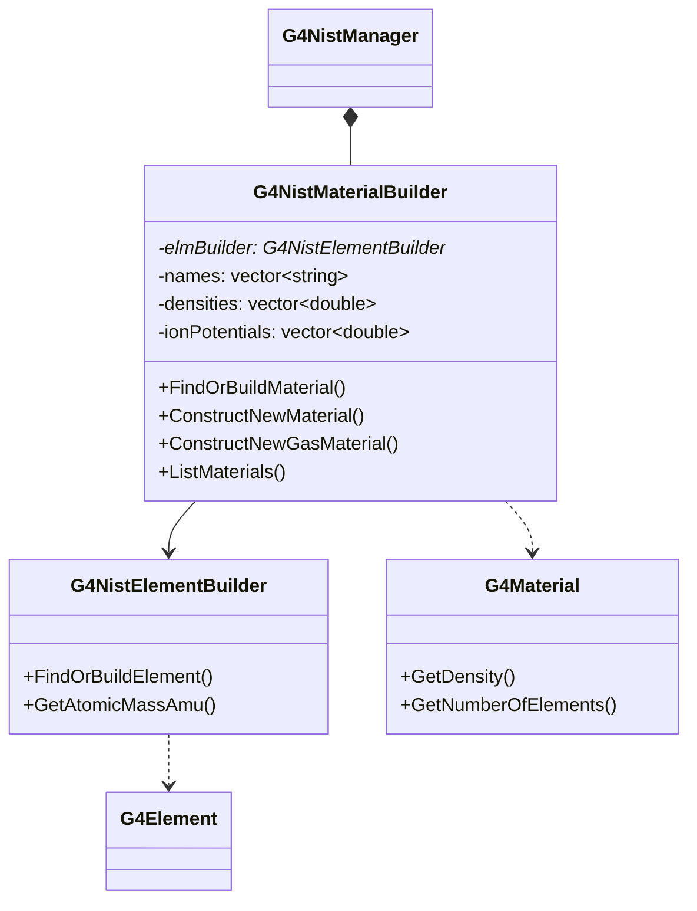

# G4NistMaterialBuilder

**File**: `source/materials/include/G4NistMaterialBuilder.hh`

## Overview

G4NistMaterialBuilder is a utility class that manages the NIST database of materials and provides methods to find, build, and construct materials for Geant4 simulations. The class maintains a comprehensive database of pre-defined materials including:

- **Simple materials**: Pure elements (Z = 1 to 98)
- **NIST compounds**: Standard materials from the NIST database (water, air, concrete, etc.)
- **HEP materials**: Materials commonly used in high-energy physics detectors
- **Space materials**: Materials for space applications
- **Bio-chemical materials**: Biological and medical materials

The class is primarily used internally by G4NistManager but provides a rich API for material construction and customization.

## NIST Database Reference

Material data is sourced from the NIST database on Atomic Weights and Isotope Compositions:
http://physics.nist.gov/PhysRefData/Compositions/index.html

## Class Relationships



## Constructor & Destructor

### Constructor

```cpp
G4NistMaterialBuilder(G4NistElementBuilder*, G4int verb = 0);
```

Constructs the material builder.

**Parameters**:
- Pointer to G4NistElementBuilder instance
- `verb`: Verbosity level (0 = silent, higher = more output) (default: 0)

**Location**: G4NistMaterialBuilder.hh:68

**Note**: Typically instantiated only by G4NistManager.

### Destructor

```cpp
~G4NistMaterialBuilder() = default;
```

Default destructor (compiler-generated).

**Location**: G4NistMaterialBuilder.hh:70

## Deleted Copy Operations

```cpp
G4bool operator==(const G4NistMaterialBuilder&) const = delete;
G4bool operator!=(const G4NistMaterialBuilder&) const = delete;
G4NistMaterialBuilder(const G4NistMaterialBuilder&) = delete;
const G4NistMaterialBuilder& operator=(const G4NistMaterialBuilder&) = delete;
```

Copy construction, assignment, and comparison are explicitly disabled.

**Location**: G4NistMaterialBuilder.hh:124-127

## Material Finding Methods

### FindMaterial

```cpp
inline G4Material* FindMaterial(const G4String& name) const;
```

Finds an existing G4Material by name without building a new one.

**Parameters**:
- `name`: Material name (e.g., "G4_WATER", "G4_Pb")

**Returns**: Pointer to G4Material if already built, nullptr otherwise

**Location**: G4NistMaterialBuilder.hh:73, 205-216

**Usage**:
```cpp
G4Material* water = builder->FindMaterial("G4_WATER");
if (water == nullptr) {
    // Material not yet built
}
```

### FindOrBuildMaterial

```cpp
G4Material* FindOrBuildMaterial(const G4String& name, G4bool warning = true);
```

Finds or builds a G4Material from the NIST database.

**Parameters**:
- `name`: Material name
- `warning`: Print warning if material not found (default: true)

**Returns**: Pointer to G4Material, or nullptr if material name not in database

**Location**: G4NistMaterialBuilder.hh:74

**Behavior**:
- Searches for existing material first
- If not found, builds from NIST database
- Handles legacy name conversions (e.g., "G4_NYLON-6/6" → "G4_NYLON-6-6")

**Usage**:
```cpp
// Common NIST materials
G4Material* water = builder->FindOrBuildMaterial("G4_WATER");
G4Material* air = builder->FindOrBuildMaterial("G4_AIR");
G4Material* lead = builder->FindOrBuildMaterial("G4_Pb");

// With warning suppressed
G4Material* custom = builder->FindOrBuildMaterial("CustomMaterial", false);
```

### FindSimpleMaterial

```cpp
inline G4Material* FindSimpleMaterial(G4int Z) const;
```

Finds an existing simple material (pure element) by atomic number.

**Parameters**:
- `Z`: Atomic number (1-98)

**Returns**: Pointer to G4Material if found, nullptr otherwise

**Location**: G4NistMaterialBuilder.hh:77, 218-221

**Note**: Only finds materials already built; does not create new ones.

### FindOrBuildSimpleMaterial

```cpp
G4Material* FindOrBuildSimpleMaterial(G4int Z, G4bool warning);
```

Finds or builds a simple material by atomic number.

**Parameters**:
- `Z`: Atomic number (1-98)
- `warning`: Print warning if material cannot be built

**Returns**: Pointer to G4Material

**Location**: G4NistMaterialBuilder.hh:78

**Usage**:
```cpp
G4Material* silicon = builder->FindOrBuildSimpleMaterial(14, false);  // Si
G4Material* tungsten = builder->FindOrBuildSimpleMaterial(74, false); // W
G4Material* lead = builder->FindOrBuildSimpleMaterial(82, false);     // Pb
```

## Material Construction Methods

### ConstructNewMaterial (by atom count)

```cpp
G4Material* ConstructNewMaterial(const G4String& name,
                                 const std::vector<G4String>& elm,
                                 const std::vector<G4int>& nbAtoms,
                                 G4double dens,
                                 G4State state = kStateSolid,
                                 G4double temp = NTP_Temperature,
                                 G4double pressure = CLHEP::STP_Pressure);
```

Constructs a new material from scratch by specifying atom counts.

**Parameters**:
- `name`: Material name
- `elm`: Vector of element symbols (e.g., {"H", "O"})
- `nbAtoms`: Vector of atom counts for each element (e.g., {2, 1} for H2O)
- `dens`: Density in g/cm³
- `state`: Material state (default: kStateSolid)
- `temp`: Temperature in Kelvin (default: 293.15 K)
- `pressure`: Pressure (default: STP)

**Returns**: Pointer to new G4Material

**Location**: G4NistMaterialBuilder.hh:81-83

**Usage**:
```cpp
// Water (H2O)
std::vector<G4String> waterElm = {"H", "O"};
std::vector<G4int> waterAtoms = {2, 1};
G4Material* water = builder->ConstructNewMaterial(
    "Water", waterElm, waterAtoms, 1.0*g/cm3, kStateLiquid);

// Silicon dioxide (SiO2) - quartz
std::vector<G4String> quartzElm = {"Si", "O"};
std::vector<G4int> quartzAtoms = {1, 2};
G4Material* quartz = builder->ConstructNewMaterial(
    "Quartz", quartzElm, quartzAtoms, 2.64*g/cm3);

// Sodium iodide (NaI) scintillator
std::vector<G4String> naiElm = {"Na", "I"};
std::vector<G4int> naiAtoms = {1, 1};
G4Material* nai = builder->ConstructNewMaterial(
    "NaI", naiElm, naiAtoms, 3.67*g/cm3);
```

### ConstructNewMaterial (by mass fraction)

```cpp
G4Material* ConstructNewMaterial(const G4String& name,
                                 const std::vector<G4String>& elm,
                                 const std::vector<G4double>& weight,
                                 G4double dens,
                                 G4State state = kStateSolid,
                                 G4double temp = NTP_Temperature,
                                 G4double pressure = CLHEP::STP_Pressure);
```

Constructs a new material from scratch by specifying mass fractions.

**Parameters**:
- `name`: Material name
- `elm`: Vector of element symbols
- `weight`: Vector of mass fractions (must sum to 1.0)
- `dens`: Density in g/cm³
- `state`: Material state (default: kStateSolid)
- `temp`: Temperature in Kelvin (default: 293.15 K)
- `pressure`: Pressure (default: STP)

**Returns**: Pointer to new G4Material

**Location**: G4NistMaterialBuilder.hh:86-88

**Usage**:
```cpp
// Air (simplified composition by mass)
std::vector<G4String> airElm = {"N", "O"};
std::vector<G4double> airFrac = {0.7, 0.3};
G4Material* air = builder->ConstructNewMaterial(
    "Air", airElm, airFrac, 1.29*mg/cm3, kStateGas);

// Concrete (simplified)
std::vector<G4String> concreteElm = {"H", "C", "O", "Na", "Mg", "Al", "Si", "K", "Ca", "Fe"};
std::vector<G4double> concreteFrac = {0.01, 0.001, 0.529, 0.016, 0.002, 0.034, 0.337, 0.013, 0.044, 0.014};
G4Material* concrete = builder->ConstructNewMaterial(
    "Concrete", concreteElm, concreteFrac, 2.3*g/cm3);
```

### ConstructNewGasMaterial

```cpp
G4Material* ConstructNewGasMaterial(const G4String& name,
                                    const G4String& nameDB,
                                    G4double temp,
                                    G4double pres);
```

Constructs a gas material based on a NIST material at specified temperature and pressure.

**Parameters**:
- `name`: New material name
- `nameDB`: Name of base material in NIST database
- `temp`: Temperature in Kelvin
- `pres`: Pressure in atmospheres

**Returns**: Pointer to new G4Material

**Location**: G4NistMaterialBuilder.hh:91-92

**Note**: Density is automatically adjusted for temperature and pressure using ideal gas law.

**Usage**:
```cpp
// Argon gas at 350K and 2 atm
G4Material* warmArgon = builder->ConstructNewGasMaterial(
    "WarmArgon", "G4_Ar", 350*kelvin, 2.0*atmosphere);

// Nitrogen at custom conditions
G4Material* coldN2 = builder->ConstructNewGasMaterial(
    "ColdNitrogen", "G4_N", 200*kelvin, 0.5*atmosphere);
```

### ConstructNewIdealGasMaterial

```cpp
G4Material* ConstructNewIdealGasMaterial(const G4String& name,
                                         const std::vector<G4String>& elm,
                                         const std::vector<G4int>& nbAtoms,
                                         G4double temp = NTP_Temperature,
                                         G4double pressure = CLHEP::STP_Pressure);
```

Constructs an ideal gas material from elements.

**Parameters**:
- `name`: Material name
- `elm`: Vector of element symbols
- `nbAtoms`: Vector of atom counts
- `temp`: Temperature (default: 293.15 K)
- `pressure`: Pressure (default: STP)

**Returns**: Pointer to new G4Material

**Location**: G4NistMaterialBuilder.hh:95-97

**Note**: Density is computed using ideal gas law: ρ = (P × M) / (R × T)

**Usage**:
```cpp
// Ideal gas mixture of H2 and He
std::vector<G4String> gasElm = {"H", "He"};
std::vector<G4int> gasAtoms = {2, 1};
G4Material* idealGas = builder->ConstructNewIdealGasMaterial(
    "H2He_Mix", gasElm, gasAtoms, 300*kelvin, 1.0*atmosphere);

// Methane (CH4) as ideal gas
std::vector<G4String> ch4Elm = {"C", "H"};
std::vector<G4int> ch4Atoms = {1, 4};
G4Material* methane = builder->ConstructNewIdealGasMaterial(
    "Methane", ch4Elm, ch4Atoms);
```

## Material Information Methods

### GetMaterialNames

```cpp
const std::vector<G4String>& GetMaterialNames() const;
```

Returns a reference to the vector of all NIST material names.

**Returns**: Vector of material name strings

**Location**: G4NistMaterialBuilder.hh:118, 190-193

**Usage**:
```cpp
const std::vector<G4String>& materials = builder->GetMaterialNames();
G4cout << "Total NIST materials: " << materials.size() << G4endl;
for (const auto& name : materials) {
    G4cout << name << G4endl;
}
```

### GetMeanIonisationEnergy

```cpp
inline G4double GetMeanIonisationEnergy(G4int index) const;
```

Returns the mean ionisation energy for a material by its database index.

**Parameters**:
- `index`: Material index in internal database

**Returns**: Mean ionisation energy in eV

**Location**: G4NistMaterialBuilder.hh:121, 195-198

**Formula**: Returns stored value, or 10.0 × index if out of range

### GetNominalDensity

```cpp
inline G4double GetNominalDensity(G4int index) const;
```

Returns the nominal density for a material by its database index.

**Parameters**:
- `index`: Material index in internal database

**Returns**: Density in g/cm³, or 0.0 if out of range

**Location**: G4NistMaterialBuilder.hh:122, 200-203

## Material Listing Methods

### ListMaterials

```cpp
void ListMaterials(const G4String&) const;
```

Prints a categorized list of available materials.

**Parameters**:
- `"simple"`: Pure materials in basic state (Z = 1, ..., 98)
- `"compound"`: NIST compounds (water, air, concrete, etc.)
- `"hep"`: HEP materials and compounds (scintillators, detector materials)
- `"biochemical"` or `"bio"`: Bio-chemical materials (tissue, bone, etc.)
- `"space"`: Space materials
- `"all"`: All materials

**Location**: G4NistMaterialBuilder.hh:108

**Usage**:
```cpp
builder->ListMaterials("hep");         // List HEP materials
builder->ListMaterials("compound");    // List NIST compounds
builder->ListMaterials("all");         // List everything
```

### ListNistSimpleMaterials

```cpp
void ListNistSimpleMaterials() const;
```

Prints list of simple (pure element) materials.

**Location**: G4NistMaterialBuilder.hh:111

### ListNistCompoundMaterials

```cpp
void ListNistCompoundMaterials() const;
```

Prints list of NIST compound materials.

**Location**: G4NistMaterialBuilder.hh:112

### ListHepMaterials

```cpp
void ListHepMaterials() const;
```

Prints list of HEP and nuclear materials.

**Location**: G4NistMaterialBuilder.hh:113

### ListSpaceMaterials

```cpp
void ListSpaceMaterials() const;
```

Prints list of space application materials.

**Location**: G4NistMaterialBuilder.hh:114

### ListBioChemicalMaterials

```cpp
void ListBioChemicalMaterials() const;
```

Prints list of bio-chemical and medical materials.

**Location**: G4NistMaterialBuilder.hh:115

## Verbosity Control

### SetVerbose

```cpp
void SetVerbose(G4int val);
```

Sets the verbosity level for debugging output.

**Parameters**:
- `val`: Verbosity level (0 = silent, 1 = warnings, >1 = verbose)

**Location**: G4NistMaterialBuilder.hh:100

## Data Members

### Element Builder Reference

```cpp
G4NistElementBuilder* elmBuilder;      // Pointer to element builder
```

**Location**: G4NistMaterialBuilder.hh:160

### Material Counters

```cpp
G4int verbose;                         // Verbosity level
G4int nMaterials{0};                   // Total number of materials in database
G4int nComponents{0};                  // Total number of components
G4int nCurrent{0};                     // Current material being built
G4int nElementary;                     // Number of simple materials (Z=1-98)
G4int nNIST;                           // Number of NIST compound materials
G4int nHEP;                            // Number of HEP materials
G4int nSpace;                          // Number of space materials
```

**Location**: G4NistMaterialBuilder.hh:162-169

### Material Property Arrays

```cpp
std::vector<G4String> names;           // Material names
std::vector<G4String> chFormulas;      // Chemical formulas
std::vector<G4double> densities;       // Densities in g/cm³
std::vector<G4double> ionPotentials;   // Mean ionisation potentials in eV
std::vector<G4State> states;           // Material states
std::vector<G4bool> STP;               // Standard temperature/pressure flag
```

**Location**: G4NistMaterialBuilder.hh:171-183

### Composition Arrays

```cpp
std::vector<G4double> fractions;       // Mass fractions or atom counts
std::vector<G4bool> atomCount;         // True if by atom count, false if by mass
std::vector<G4int> components;         // Number of components per material
std::vector<G4int> indexes;            // Start index in elements/fractions arrays
std::vector<G4int> elements;           // Element Z or index values
std::vector<G4int> matIndex;           // Index in G4MaterialTable (-1 if not built)
```

**Location**: G4NistMaterialBuilder.hh:177-182

### Gas Properties

```cpp
std::vector<G4int> idxGas;             // Indices of gas materials
std::vector<G4double> gasTemperature;  // Gas temperatures
std::vector<G4double> gasPressure;     // Gas pressures
```

**Location**: G4NistMaterialBuilder.hh:185-187

## Private Methods

### Initialise

```cpp
void Initialise();
```

Initializes the material database by calling category initialization methods.

**Location**: G4NistMaterialBuilder.hh:130

### Category Initialization Methods

```cpp
void NistSimpleMaterials();            // Initialize simple materials (Z=1-98)
void NistCompoundMaterials();          // Initialize NIST compounds (part 1)
void NistCompoundMaterials2();         // Initialize NIST compounds (part 2)
void HepAndNuclearMaterials();         // Initialize HEP materials
void SpaceMaterials();                 // Initialize space materials
void BioChemicalMaterials();           // Initialize bio-chemical materials
```

**Location**: G4NistMaterialBuilder.hh:131-136

### Material Definition Methods

```cpp
void AddMaterial(const G4String& nameMat, G4double dens, G4int Z = 0,
                 G4double pot = 0.0, G4int ncomp = 1, G4State = kStateSolid,
                 G4bool stp = true);
```

Adds material definition to internal database.

**Parameters**:
- `nameMat`: Material name
- `dens`: Density in g/cm³
- `Z`: Atomic number for simple materials (default: 0)
- `pot`: Mean ionisation potential in eV (default: 0.0)
- `ncomp`: Number of components (default: 1)
- Material state (default: kStateSolid)
- `stp`: Standard temperature/pressure (default: true)

**Location**: G4NistMaterialBuilder.hh:141-142

### Gas Definition Method

```cpp
void AddGas(const G4String& nameMat, G4double T, G4double P);
```

Adds gas-specific properties to a material.

**Location**: G4NistMaterialBuilder.hh:144

### Component Addition Methods

```cpp
void AddElementByWeightFraction(G4int Z, G4double);
void AddElementByAtomCount(G4int Z, G4int);
void AddElementByWeightFraction(const G4String& name, G4double);
void AddElementByAtomCount(const G4String& name, G4int);
```

Internal methods to add element components during material construction.

**Location**: G4NistMaterialBuilder.hh:146-150

### Material Building Methods

```cpp
G4Material* BuildNistMaterial(const G4String& matname, G4bool warning);
G4Material* BuildMaterial(G4int idx);
```

Internal methods to build G4Material objects from database.

**Location**: G4NistMaterialBuilder.hh:153-154

### Debug Methods

```cpp
void DumpElm(G4int) const;
void DumpMix(G4int) const;
```

Debug output for element and mixture information.

**Location**: G4NistMaterialBuilder.hh:156-157

## Common NIST Materials

### Simple Materials (Elements)

Access via "G4_" + element symbol:
- `G4_H`: Hydrogen
- `G4_C`: Carbon
- `G4_N`: Nitrogen
- `G4_O`: Oxygen
- `G4_Al`: Aluminum
- `G4_Si`: Silicon
- `G4_Fe`: Iron
- `G4_Cu`: Copper
- `G4_W`: Tungsten
- `G4_Pb`: Lead
- `G4_U`: Uranium

### NIST Compounds

- `G4_WATER`: Water (H2O)
- `G4_AIR`: Standard air
- `G4_CONCRETE`: Standard concrete
- `G4_GLASS_PLATE`: Plate glass
- `G4_POLYSTYRENE`: Polystyrene plastic
- `G4_SILICON_DIOXIDE`: SiO2

### HEP Materials

- `G4_Galactic`: Ultra-low density vacuum (for tracking volumes)
- `G4_lAr`: Liquid Argon (for calorimeters)
- `G4_lXe`: Liquid Xenon (for detectors)
- `G4_PLASTIC_SC_VINYLTOLUENE`: Plastic scintillator
- `G4_BGO`: Bismuth Germanate (scintillator crystal)
- `G4_PbWO4`: Lead Tungstate (electromagnetic calorimeter crystal)
- `G4_CESIUM_IODIDE`: CsI scintillator
- `G4_SODIUM_IODIDE`: NaI scintillator

### Bio-Medical Materials

- `G4_TISSUE_SOFT_ICRP`: Soft tissue (ICRP)
- `G4_BONE_COMPACT_ICRU`: Compact bone
- `G4_MUSCLE_SKELETAL_ICRP`: Skeletal muscle
- `G4_LUNG_ICRP`: Lung tissue
- `G4_BRAIN_ICRP`: Brain tissue
- `G4_BLOOD_ICRP`: Blood

## Usage Examples

### Basic Material Access

```cpp
// Typically accessed via G4NistManager
G4NistManager* nist = G4NistManager::Instance();

// Get common materials
G4Material* water = nist->FindOrBuildMaterial("G4_WATER");
G4Material* air = nist->FindOrBuildMaterial("G4_AIR");
G4Material* lead = nist->FindOrBuildMaterial("G4_Pb");
G4Material* silicon = nist->FindOrBuildMaterial("G4_Si");
```

### HEP Detector Example

```cpp
G4NistManager* nist = G4NistManager::Instance();

// Vacuum for tracking volume
G4Material* vacuum = nist->FindOrBuildMaterial("G4_Galactic");

// Silicon detector
G4Material* silicon = nist->FindOrBuildMaterial("G4_Si");

// Liquid argon calorimeter
G4Material* LAr = nist->FindOrBuildMaterial("G4_lAr");

// Lead tungstate crystal calorimeter
G4Material* PbWO4 = nist->FindOrBuildMaterial("G4_PbWO4");

// Plastic scintillator
G4Material* scintillator = nist->FindOrBuildMaterial("G4_PLASTIC_SC_VINYLTOLUENE");
```

### Custom Scintillator Example

```cpp
G4NistManager* nist = G4NistManager::Instance();

// BGO scintillator: Bi4Ge3O12
std::vector<G4String> bgoElm = {"Bi", "Ge", "O"};
std::vector<G4int> bgoAtoms = {4, 3, 12};
G4Material* BGO = nist->ConstructNewMaterial(
    "BGO", bgoElm, bgoAtoms, 7.13*g/cm3);

// LSO scintillator: Lu2SiO5
std::vector<G4String> lsoElm = {"Lu", "Si", "O"};
std::vector<G4int> lsoAtoms = {2, 1, 5};
G4Material* LSO = nist->ConstructNewMaterial(
    "LSO", lsoElm, lsoAtoms, 7.4*g/cm3);
```

### Gas Detector Example

```cpp
G4NistManager* nist = G4NistManager::Instance();

// Argon gas at custom conditions for drift chamber
G4Material* argonGas = nist->ConstructNewGasMaterial(
    "ArgonGas", "G4_Ar", 293.15*kelvin, 1.0*atmosphere);

// P10 gas mixture (90% Ar, 10% CH4) for wire chamber
std::vector<G4String> p10Elm = {"Ar", "C", "H"};
std::vector<G4int> p10Atoms = {90, 10, 40};  // 90 Ar + 10 CH4
G4Material* P10 = nist->ConstructNewIdealGasMaterial(
    "P10", p10Elm, p10Atoms);
```

### Medical Physics Example

```cpp
G4NistManager* nist = G4NistManager::Instance();

// Standard tissue materials
G4Material* softTissue = nist->FindOrBuildMaterial("G4_TISSUE_SOFT_ICRP");
G4Material* bone = nist->FindOrBuildMaterial("G4_BONE_COMPACT_ICRU");
G4Material* muscle = nist->FindOrBuildMaterial("G4_MUSCLE_SKELETAL_ICRP");
G4Material* lung = nist->FindOrBuildMaterial("G4_LUNG_ICRP");

// Custom tissue-equivalent material
std::vector<G4String> tissueElm = {"H", "C", "N", "O"};
std::vector<G4double> tissueFrac = {0.101, 0.111, 0.026, 0.762};
G4Material* customTissue = nist->ConstructNewMaterial(
    "CustomTissue", tissueElm, tissueFrac, 1.04*g/cm3);
```

### Exploring Available Materials

```cpp
G4NistManager* nist = G4NistManager::Instance();

// List all HEP materials
nist->ListMaterials("hep");

// Get all material names programmatically
const std::vector<G4String>& allMaterials = nist->GetNistMaterialNames();
G4cout << "Total available materials: " << allMaterials.size() << G4endl;

// Search for specific materials
for (const auto& matName : allMaterials) {
    if (matName.find("TISSUE") != std::string::npos) {
        G4cout << "Found tissue material: " << matName << G4endl;
        G4Material* mat = nist->FindOrBuildMaterial(matName);
        G4cout << "  Density: " << mat->GetDensity()/(g/cm3) << " g/cm3" << G4endl;
    }
}
```

## Thread Safety

The G4NistMaterialBuilder is thread-safe:

- Material building operations are protected by G4Mutex (nistMaterialMutex)
- All const methods are thread-safe for read operations
- Material construction is synchronized to prevent race conditions
- Safe for use in multi-threaded applications

**Implementation**: See G4NistMaterialBuilder.cc:82 (mutex declaration)

## Performance Considerations

### Material Caching

- Materials are built once and cached in the material table
- Subsequent calls to FindOrBuildMaterial return cached instances
- No overhead for repeated access to same material

### Database Organization

The material database is organized into categories for efficient initialization:
1. **Simple materials**: Elements Z=1-98 (nElementary)
2. **NIST compounds**: Standard compounds (nNIST)
3. **HEP materials**: Detector materials (nHEP)
4. **Space materials**: Space applications (nSpace)
5. **Bio-chemical**: Medical materials

### Construction Methods

- **ConstructNewMaterial** creates materials at runtime
- **FindOrBuildMaterial** uses pre-defined database (faster)
- Use database materials when possible for consistency

## Version History

Key modifications (from header and source comments):

- **30.04.13**: M. Trocme & S. Seltzer - Replace AddElementByWeightFraction with AddElementByAtomCount where possible
- **09.02.12**: P. Gumplinger added ConstructNewIdealGasMaterial
- **14.06.11**: A. Ivantchenko updated body materials (G4_...ICRP) according to ICRU Report 46 (1992)
- **12.12.10**: A. Ivantchenko added BioChemicalMaterials() and SpaceMaterials()
- **03.11.09**: A. Lechner changed nylon material names (6/6 → 6-6, 6/10 → 6-10)
- **30.10.09**: V. Ivanchenko updated graphite density, added G4_GRAPHITE_POROUS
- **27.07.07**: V. Ivanchenko removed dependence on NistManager
- **27.06.06**: V. Ivanchenko fixed graphite description
- **11.05.06**: V. Ivanchenko added warning flag to FindMaterial method
- **27.02.06**: V. Ivanchenko added ConstructNewGasMaterial
- **31.10.05**: Added chemical effect and gas properties
- **23.12.2004**: V. Ivanchenko - Initial creation

## See Also

- [G4NistManager](./g4nistmanager.md) - Main NIST database manager
- [G4NistElementBuilder](./g4nistelementbuilder.md) - NIST element database and builder
- [G4Material](./g4material.md) - Material class
- [G4Element](./g4element.md) - Element class
- [Materials Module Overview](../overview.md) - Materials module documentation
