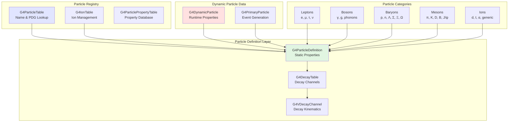
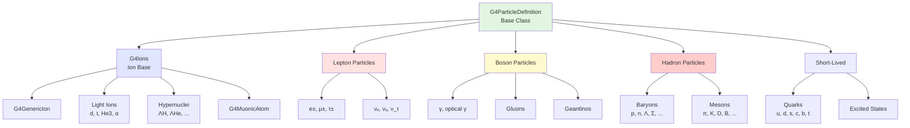
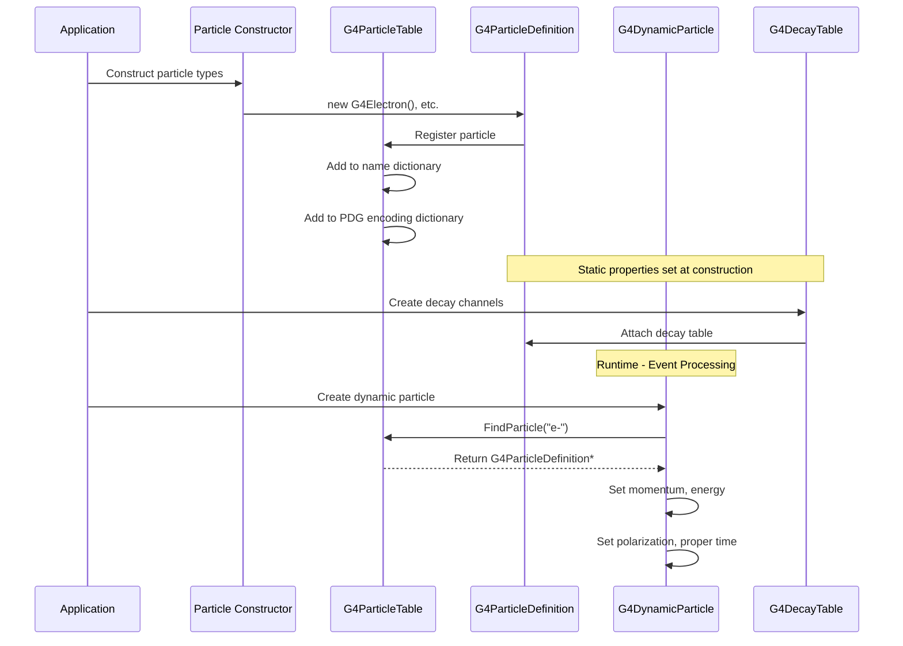
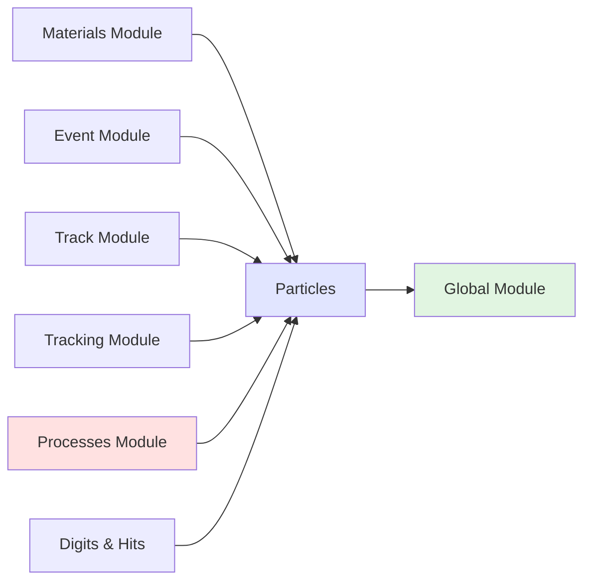

# Particles Module

## Overview

The Particles module is a foundational component of Geant4 that implements the Standard Model of particle physics and provides infrastructure for defining, managing, and tracking all particle types used in simulations. It contains comprehensive definitions of leptons, hadrons (baryons and mesons), bosons, ions, and special simulation particles, along with their decay channels and quantum properties.

::: tip Module Location
**Source:** `source/particles/`
**Headers:** `source/particles/management/include/` (core infrastructure)
**Subdirectories:** 7 categories (management, leptons, bosons, hadrons, shortlived, adjoint, utils)
:::

## Purpose and Scope

The Particles module serves several critical functions:

- **Particle Definitions**: Provides static definitions of ~252 particle types with complete quantum numbers
- **Particle Registry**: Manages global tables for particle lookup by name or PDG encoding
- **Dynamic Particle Data**: Handles runtime particle properties (momentum, energy, polarization)
- **Decay Management**: Implements 13+ decay channel types and decay kinematics
- **Ion Management**: Specialized handling for ions, isotopes, and exotic nuclei
- **Thread Safety**: Full multi-threading support with shadow pointers and workspace management
- **Standard Model Coverage**: Complete implementation of quarks, leptons, gauge bosons, and hadrons

## Architecture

### Core Components



### Particle Hierarchy



### Particle Lifecycle



## Module Organization

The Particles module is organized into 7 main categories:

### 1. Management (Core Infrastructure)

**Location:** `source/particles/management/`
**Classes:** ~50 classes
**Purpose:** Particle definition, tables, decay management, properties

**Key Classes:**
- [**G4ParticleDefinition**](api/g4particledefinition.md) - Base class for all particles
- [**G4ParticleTable**](api/g4particletable.md) - Singleton particle registry
- [**G4DynamicParticle**](api/g4dynamicparticle.md) - Dynamic particle properties
- [**G4IonTable**](api/g4iontable.md) - Ion-specific management
- [**G4DecayTable**](api/g4decaytable.md) - Particle decay channels
- **G4VDecayChannel** - Base class for decay kinematics

### 2. Leptons

**Location:** `source/particles/leptons/`
**Classes:** 13 classes
**Purpose:** Electron, muon, tau families and neutrinos

**Particles:**
- **Electrons:** `G4Electron`, `G4Positron`
- **Muons:** `G4MuonMinus`, `G4MuonPlus`
- **Taus:** `G4TauMinus`, `G4TauPlus`
- **Neutrinos:** `G4NeutrinoE`, `G4AntiNeutrinoE`, `G4NeutrinoMu`, `G4AntiNeutrinoMu`, `G4NeutrinoTau`, `G4AntiNeutrinoTau`

### 3. Bosons

**Location:** `source/particles/bosons/`
**Classes:** 10 classes
**Purpose:** Gauge bosons and special simulation particles

**Particles:**
- **Photons:** `G4Gamma`, `G4OpticalPhoton`
- **Phonons:** `G4PhononLong`, `G4PhononTransFast`, `G4PhononTransSlow`
- **Gluons:** `G4Gluons`
- **Special:** `G4Geantino`, `G4ChargedGeantino`, `G4UnknownParticle`

### 4. Hadrons

**Location:** `source/particles/hadrons/`
**Subdirectories:** 3 (barions, mesons, ions)
**Classes:** ~99 classes total

#### 4a. Baryons (47 classes)

**Light Baryons:**
- Nucleons: `G4Proton`, `G4Neutron`, `G4AntiProton`, `G4AntiNeutron`
- Delta resonances: `G4DeltaPlusPlus`, `G4DeltaPlus`, `G4DeltaZero`, `G4DeltaMinus`

**Strange Baryons:**
- Λ: `G4Lambda`, `G4AntiLambda`
- Σ: `G4SigmaPlus`, `G4SigmaZero`, `G4SigmaMinus` (+ anti)
- Ξ: `G4XiMinus`, `G4XiZero` (+ anti)
- Ω: `G4OmegaMinus`, `G4AntiOmegaMinus`

**Charm Baryons:**
- `G4LambdacPlus`, `G4SigmacPlusPlus`, `G4SigmacPlus`, `G4SigmacZero`
- `G4XicPlus`, `G4XicZero`, `G4OmegacZero` (+ anti)

**Bottom Baryons:**
- `G4Lambdab`, `G4SigmabPlus`, `G4SigmabZero`, `G4SigmabMinus`
- `G4XibZero`, `G4XibMinus`, `G4OmegabMinus` (+ anti)

#### 4b. Mesons (29 classes)

**Light Mesons:**
- Pions: `G4PionPlus`, `G4PionMinus`, `G4PionZero`
- Eta: `G4Eta`, `G4EtaPrime`

**Strange Mesons:**
- Kaons: `G4KaonPlus`, `G4KaonMinus`, `G4KaonZero`, `G4AntiKaonZero`
- Neutral kaons: `G4KaonZeroShort`, `G4KaonZeroLong`

**Charm Mesons:**
- D mesons: `G4DMesonPlus`, `G4DMesonMinus`, `G4DMesonZero`, `G4AntiDMesonZero`
- Ds mesons: `G4DsMesonPlus`, `G4DsMesonMinus`
- Charmonium: `G4Etac`, `G4JPsi`

**Bottom Mesons:**
- B mesons: `G4BMesonPlus`, `G4BMesonMinus`, `G4BMesonZero`, `G4AntiBMesonZero`
- Bs meson: `G4BsMesonZero`, `G4AntiBsMesonZero`
- Bc mesons: `G4BcMesonPlus`, `G4BcMesonMinus`
- Bottomonium: `G4Upsilon`

#### 4c. Ions (23 classes)

**Light Ions:**
- `G4Deuteron`, `G4AntiDeuteron`
- `G4Triton`, `G4AntiTriton`
- `G4He3`, `G4AntiHe3`
- `G4Alpha`, `G4AntiAlpha`

**Hypernuclei:**
- `G4HyperTriton`, `G4AntiHyperTriton`
- `G4HyperAlpha`, `G4AntiHyperAlpha`
- `G4HyperH4`, `G4HyperHe5`
- `G4DoubleHyperH4`, `G4DoubleHyperDoubleNeutron`

**Generic:**
- `G4GenericIon` - Placeholder for any ion
- `G4GenericMuonicAtom` - Muonic atom placeholder

### 5. Short-Lived Particles

**Location:** `source/particles/shortlived/`
**Classes:** 14 classes
**Purpose:** Quarks, gluons, and excited hadron states

**Content:**
- Quarks (6 flavors): u, d, s, c, b, t
- Di-quarks
- Gluons
- Excited mesons (ρ, K*, φ, ω, etc.)
- Excited baryons (N*, Δ*, Λ*, Σ*, Ξ*, etc.)

### 6. Adjoint Particles

**Location:** `source/particles/adjoint/`
**Classes:** 11 classes
**Purpose:** Reverse Monte Carlo simulation particles

**Particles:**
- `G4AdjointElectron`, `G4AdjointPositron`
- `G4AdjointGamma`
- `G4AdjointProton`
- `G4AdjointAlpha`, `G4AdjointDeuteron`, `G4AdjointTriton`, `G4AdjointHe3`
- `G4AdjointGenericIon`, `G4AdjointIons`

### 7. Utilities

**Location:** `source/particles/utils/`
**Classes:** 7 classes
**Purpose:** Property reporters and retrievers

## Key Classes

### Core Management Classes

| Class | Purpose | Header |
|-------|---------|--------|
| [**G4ParticleDefinition**](api/g4particledefinition.md) | Base class containing static particle data (mass, charge, spin, lifetime, quantum numbers) | `G4ParticleDefinition.hh` |
| [**G4ParticleTable**](api/g4particletable.md) | Singleton table managing all particle definitions with name and PDG encoding lookup | `G4ParticleTable.hh` |
| [**G4DynamicParticle**](api/g4dynamicparticle.md) | Dynamic aspects of moving particles (momentum, energy, polarization, proper time) | `G4DynamicParticle.hh` |
| [**G4IonTable**](api/g4iontable.md) | Specialized table for ion management and creation | `G4IonTable.hh` |

### Decay Management

| Class | Purpose | Header |
|-------|---------|--------|
| **G4DecayTable** | Table of decay channels for a particle | `G4DecayTable.hh` |
| **G4VDecayChannel** | Abstract base class for decay kinematics | `G4VDecayChannel.hh` |
| **G4DecayProducts** | Container for decay products | `G4DecayProducts.hh` |
| **G4PhaseSpaceDecayChannel** | Generic phase space decay | `G4PhaseSpaceDecayChannel.hh` |
| **G4DalitzDecayChannel** | Dalitz decay (e.g., π⁰ → γe⁺e⁻) | `G4DalitzDecayChannel.hh` |
| **G4MuonDecayChannel** | Muon decay with V-A structure | `G4MuonDecayChannel.hh` |
| **G4TauLeptonicDecayChannel** | Tau leptonic decay | `G4TauLeptonicDecayChannel.hh` |

### Particle Properties

| Class | Purpose | Header |
|-------|---------|--------|
| **G4ParticlePropertyTable** | Table of particle properties from database | `G4ParticlePropertyTable.hh` |
| **G4ParticlePropertyData** | Storage for particle property data | `G4ParticlePropertyData.hh` |
| **G4PDGCodeChecker** | Validates PDG encoding schemes | `G4PDGCodeChecker.hh` |
| **G4IsotopeProperty** | Isotope-specific properties | `G4IsotopeProperty.hh` |
| **G4NuclideTable** | Database of nuclide properties | `G4NuclideTable.hh` |

## Usage Patterns

### Accessing Particles

#### Method 1: Direct Access via Static Method

```cpp
// Get particle definitions directly
G4ParticleDefinition* electron = G4Electron::Definition();
G4ParticleDefinition* proton = G4Proton::Definition();
G4ParticleDefinition* gamma = G4Gamma::Definition();

// Check quantum numbers
G4double mass = electron->GetPDGMass();      // 0.511 MeV
G4double charge = electron->GetPDGCharge();  // -1.0 eplus
G4int leptonNumber = electron->GetLeptonNumber();  // 1
```

#### Method 2: Lookup via Particle Table

```cpp
// Get particle table instance
G4ParticleTable* particleTable = G4ParticleTable::GetParticleTable();

// Find by name
G4ParticleDefinition* muon = particleTable->FindParticle("mu-");
G4ParticleDefinition* pion = particleTable->FindParticle("pi+");

// Find by PDG encoding
G4ParticleDefinition* neutron = particleTable->FindParticle(2112);
G4ParticleDefinition* kaon = particleTable->FindParticle(-321);  // K-

// Iterate over all particles
G4ParticleTable::G4PTblDicIterator* iterator =
    particleTable->GetIterator();
iterator->reset();
while ((*iterator)())
{
    G4ParticleDefinition* particle = iterator->value();
    G4cout << particle->GetParticleName() << G4endl;
}
```

### Creating Dynamic Particles

```cpp
// Method 1: From momentum direction and kinetic energy
G4ParticleDefinition* electronDef = G4Electron::Definition();
G4ThreeVector direction(0, 0, 1);  // Along z-axis
G4double kineticEnergy = 10*GeV;

G4DynamicParticle* dynamicElectron =
    new G4DynamicParticle(electronDef, direction, kineticEnergy);

// Method 2: From momentum vector
G4ThreeVector momentum(100*MeV, 0, 0);  // px=100 MeV
G4DynamicParticle* dynamicProton =
    new G4DynamicParticle(G4Proton::Definition(), momentum);

// Method 3: From 4-momentum
G4LorentzVector fourMomentum(px, py, pz, E);
G4DynamicParticle* dynamicPhoton =
    new G4DynamicParticle(G4Gamma::Definition(), fourMomentum);

// Access dynamic properties
G4double totalEnergy = dynamicElectron->GetTotalEnergy();
G4double totalMomentum = dynamicElectron->GetTotalMomentum();
G4ThreeVector momentum3 = dynamicElectron->GetMomentum();
G4double beta = dynamicElectron->GetBeta();

// Set polarization
dynamicElectron->SetPolarization(G4ThreeVector(0, 1, 0));
```

### Working with Ions

```cpp
// Get ion table
G4IonTable* ionTable = G4ParticleTable::GetParticleTable()->GetIonTable();

// Get specific ion (Z, A, excitation energy)
G4ParticleDefinition* carbon12 = ionTable->GetIon(6, 12);  // ¹²C
G4ParticleDefinition* uranium238 = ionTable->GetIon(92, 238);  // ²³⁸U

// Get excited state (Z, A, excitation energy in MeV)
G4ParticleDefinition* carbon12Excited = ionTable->GetIon(6, 12, 4.44*MeV);

// Get isomer state (Z, A, E, lvl)
G4ParticleDefinition* isomer = ionTable->GetIon(73, 180, 0.0, 0.0772);

// Access ion properties
G4int Z = carbon12->GetAtomicNumber();
G4int A = carbon12->GetAtomicMass();
G4double ionMass = carbon12->GetPDGMass();
```

### Decay Tables

```cpp
// Get particle with decay
G4ParticleDefinition* muon = G4MuonMinus::Definition();
G4DecayTable* decayTable = muon->GetDecayTable();

if (decayTable != nullptr)
{
    G4int nChannels = decayTable->entries();
    G4cout << "Muon has " << nChannels << " decay channels" << G4endl;

    // Get decay channel
    for (G4int i = 0; i < nChannels; ++i)
    {
        G4VDecayChannel* channel = decayTable->GetDecayChannel(i);
        G4double branchingRatio = channel->GetBR();
        G4int nDaughters = channel->GetNumberOfDaughters();

        G4cout << "Channel " << i << ": BR = " << branchingRatio
               << ", daughters = " << nDaughters << G4endl;

        // Get daughter particles
        for (G4int j = 0; j < nDaughters; ++j)
        {
            G4String daughterName = channel->GetDaughterName(j);
            G4cout << "  Daughter " << j << ": " << daughterName << G4endl;
        }
    }
}

// Perform decay (returns G4DecayProducts)
G4DynamicParticle* parentParticle =
    new G4DynamicParticle(muon, G4ThreeVector(0,0,1), 100*MeV);
G4VDecayChannel* channel = decayTable->SelectADecayChannel();
G4DecayProducts* products = channel->DecayIt(parentParticle->GetMass());

// Access decay products
G4int nProducts = products->entries();
for (G4int i = 0; i < nProducts; ++i)
{
    G4DynamicParticle* daughter = (*products)[i];
    G4cout << daughter->GetDefinition()->GetParticleName()
           << " E=" << daughter->GetTotalEnergy() << G4endl;
}
```

### Quantum Number Queries

```cpp
G4ParticleDefinition* particle = G4Lambda::Definition();

// Get quantum numbers
G4double spin = particle->GetPDGSpin();           // Spin in units of ħ
G4int iSpin = particle->GetPDGiSpin();            // Spin in units of ħ/2
G4int parity = particle->GetPDGiParity();         // Parity quantum number
G4int baryonNumber = particle->GetBaryonNumber(); // Baryon number
G4double isospin = particle->GetPDGIsospin();     // Isospin
G4double isospin3 = particle->GetPDGIsospin3();   // Isospin 3rd component

// Check quark content
G4int nUpQuarks = particle->GetQuarkContent(2);     // u quark
G4int nDownQuarks = particle->GetQuarkContent(1);   // d quark
G4int nStrangeQuarks = particle->GetQuarkContent(3); // s quark

// Λ has quark content: uds
// Returns: up=1, down=1, strange=1
```

### Particle Classification

```cpp
G4ParticleDefinition* particle = // ... get particle

// Get type information
G4String particleType = particle->GetParticleType();
G4String particleSubType = particle->GetParticleSubType();

// Common particle types:
// - "lepton" (e, μ, τ, neutrinos)
// - "baryon" (p, n, Λ, Σ, Ξ, Ω, ...)
// - "meson" (π, K, D, B, ...)
// - "boson" (γ, g)
// - "nucleus" (ions)

// Check if ion
if (particle->GetParticleType() == "nucleus")
{
    G4int Z = particle->GetAtomicNumber();
    G4int A = particle->GetAtomicMass();
    G4bool isGenericIon = particle->IsGeneralIon();
}

// Check stability
G4bool isStable = particle->GetPDGStable();
G4double lifetime = particle->GetPDGLifeTime();  // seconds
G4bool isShortLived = particle->IsShortLived();  // not tracked

// PDG encoding
G4int pdgCode = particle->GetPDGEncoding();
G4int antiPdgCode = particle->GetAntiPDGEncoding();
```

## Advanced Features

### Particle Construction

Particles are typically constructed as singletons during initialization:

```cpp
// In physics list or particle construction
#include "G4LeptonConstructor.hh"
#include "G4BosonConstructor.hh"
#include "G4BaryonConstructor.hh"
#include "G4MesonConstructor.hh"
#include "G4IonConstructor.hh"
#include "G4ShortLivedConstructor.hh"

void MyPhysicsList::ConstructParticle()
{
    // Construct all leptons
    G4LeptonConstructor leptonConstructor;
    leptonConstructor.ConstructParticle();

    // Construct all bosons
    G4BosonConstructor bosonConstructor;
    bosonConstructor.ConstructParticle();

    // Construct all baryons
    G4BaryonConstructor baryonConstructor;
    baryonConstructor.ConstructParticle();

    // Construct all mesons
    G4MesonConstructor mesonConstructor;
    mesonConstructor.ConstructParticle();

    // Construct ions
    G4IonConstructor ionConstructor;
    ionConstructor.ConstructParticle();

    // Construct short-lived particles
    G4ShortLivedConstructor shortLivedConstructor;
    shortLivedConstructor.ConstructParticle();
}
```

### Hypernuclei Support

```cpp
// Check if particle is a hypernucleus
G4ParticleDefinition* particle = // ... get particle

if (particle->IsHypernucleus())
{
    G4int nLambdas = particle->GetNumberOfLambdasInHypernucleus();
    G4cout << "Hypernucleus with " << nLambdas << " Lambdas" << G4endl;
}

// Predefined hypernuclei
G4ParticleDefinition* hyperTriton = G4HyperTriton::Definition();    // ³ΛH
G4ParticleDefinition* hyperAlpha = G4HyperAlpha::Definition();      // ⁴ΛHe
G4ParticleDefinition* hyperH4 = G4HyperH4::Definition();            // ⁴ΛH
G4ParticleDefinition* hyperHe5 = G4HyperHe5::Definition();          // ⁵ΛHe
G4ParticleDefinition* doubleHyperH4 = G4DoubleHyperH4::Definition(); // ⁴ΛΛH
```

### Muonic Atoms

```cpp
// Check if particle is a muonic atom
if (particle->IsMuonicAtom())
{
    // Special handling for muonic atoms
    G4int Z = particle->GetAtomicNumber();
    G4int A = particle->GetAtomicMass();
}

// Generic muonic atom placeholder
G4ParticleDefinition* genericMuonicAtom =
    G4ParticleTable::GetParticleTable()->GetGenericMuonicAtom();
```

### Electron Occupancy (for Ions)

```cpp
// For ions, electron occupancy can be set
G4DynamicParticle* ion = new G4DynamicParticle(/* ... */);

// Add/remove electrons from atomic shells
ion->AddElectron(0, 2);     // Add 2 electrons to K-shell (orbit 0)
ion->AddElectron(1, 8);     // Add 8 electrons to L-shell (orbit 1)
ion->RemoveElectron(0, 1);  // Remove 1 electron from K-shell

// Query electron occupancy
G4int totalElectrons = ion->GetTotalOccupancy();
G4int kShellElectrons = ion->GetOccupancy(0);
const G4ElectronOccupancy* occupancy = ion->GetElectronOccupancy();
```

### Pre-Assigned Decay

```cpp
// Pre-assign decay products (for forced decay)
G4DynamicParticle* parent = new G4DynamicParticle(/* ... */);

// Create decay products manually
G4DecayProducts* products = new G4DecayProducts(*parent);
products->PushProducts(new G4DynamicParticle(G4Electron::Definition(), ...));
products->PushProducts(new G4DynamicParticle(G4AntiNeutrinoE::Definition(), ...));

// Assign to parent
parent->SetPreAssignedDecayProducts(products);
parent->SetPreAssignedDecayProperTime(properTime);

// Retrieve later
const G4DecayProducts* assignedProducts =
    parent->GetPreAssignedDecayProducts();
G4double decayTime = parent->GetPreAssignedDecayProperTime();
```

## Thread Safety

### Multi-Threading Considerations

The Particles module is fully thread-safe for multi-threaded Geant4:

- **G4ParticleDefinition**: Static properties are shared (read-only) across threads
- **G4ParticleTable**: Thread-local dictionaries with shadow pointers to master
- **G4DynamicParticle**: Thread-local, created per particle track
- **G4ProcessManager**: Shadow pointers for thread-safe access

```cpp
// Thread-local particle table access
G4ParticleTable* particleTable = G4ParticleTable::GetParticleTable();
// Returns thread-local instance in worker threads

// Particle definitions are shared (read-only)
G4ParticleDefinition* electron = G4Electron::Definition();
// Same singleton instance accessible from all threads

// Process manager uses shadow pointers
G4ProcessManager* processMgr = electron->GetProcessManager();
// Returns thread-local process manager in worker threads

// Master process manager (master thread only)
G4ProcessManager* masterPM = electron->GetMasterProcessManager();
```

### Worker Thread Initialization

```cpp
// In worker thread initialization
G4ParticleTable* particleTable = G4ParticleTable::GetParticleTable();
particleTable->WorkerG4ParticleTable();  // Initialize worker tables

// In worker thread cleanup
particleTable->DestroyWorkerG4ParticleTable();  // Clean up worker tables
```

## Integration with Other Modules

### Dependencies



### Relationship with Materials Module

Particles interact with materials through:
- Atomic number and mass (for ions)
- Charge state (electron occupancy)
- See [Materials Module](../materials/index.md)

### Relationship with Processes Module

Physics processes are attached to particles:
- Each particle has a G4ProcessManager
- Processes define particle interactions
- Decay channels implement physics models

### Relationship with Track Module

Tracks are built from dynamic particles:
- `G4Track` contains `G4DynamicParticle`
- Particle definition provides static properties
- Dynamic particle provides kinematic state

## Performance Considerations

### Memory Management

```cpp
// Dynamic particles use custom allocator for efficiency
G4Allocator<G4DynamicParticle> aDynamicParticleAllocator;

// Efficient new/delete through allocator
G4DynamicParticle* particle = new G4DynamicParticle(...);
delete particle;  // Returns to allocator pool

// Particle definitions are singletons (created once)
// No memory overhead per track
```

### Particle Lookup Optimization

```cpp
// Cache particle pointers for frequently used particles
// (Faster than repeated table lookups)
class MyPrimaryGenerator
{
private:
    G4ParticleDefinition* fElectron;
    G4ParticleDefinition* fGamma;

public:
    MyPrimaryGenerator()
    {
        // Cache at initialization
        fElectron = G4Electron::Definition();
        fGamma = G4Gamma::Definition();
    }

    void GeneratePrimaries(G4Event* event)
    {
        // Use cached pointers (fast)
        G4DynamicParticle* particle = new G4DynamicParticle(fElectron, ...);
    }
};
```

### Ion Creation Optimization

```cpp
// For repeatedly used ions, cache the definition
std::map<std::pair<G4int, G4int>, G4ParticleDefinition*> ionCache;

G4ParticleDefinition* GetIon(G4int Z, G4int A)
{
    auto key = std::make_pair(Z, A);
    auto it = ionCache.find(key);
    if (it != ionCache.end())
        return it->second;

    G4IonTable* ionTable =
        G4ParticleTable::GetParticleTable()->GetIonTable();
    G4ParticleDefinition* ion = ionTable->GetIon(Z, A);
    ionCache[key] = ion;
    return ion;
}
```

## Common Patterns and Best Practices

### 1. Particle Construction in Physics Lists

```cpp
#include "G4LeptonConstructor.hh"
#include "G4MesonConstructor.hh"
#include "G4BaryonConstructor.hh"
#include "G4IonConstructor.hh"
#include "G4ShortLivedConstructor.hh"

void MyPhysicsList::ConstructParticle()
{
    // Construct all particles needed for simulation
    G4LeptonConstructor::ConstructParticle();
    G4MesonConstructor::ConstructParticle();
    G4BaryonConstructor::ConstructParticle();
    G4IonConstructor::ConstructParticle();
    G4ShortLivedConstructor::ConstructParticle();

    // Or use pre-built physics lists
    // G4EmStandardPhysics, QGSP_BERT, etc.
}
```

### 2. Primary Particle Generation

```cpp
void MyPrimaryGeneratorAction::GeneratePrimaries(G4Event* event)
{
    // Create primary vertex
    G4PrimaryVertex* vertex = new G4PrimaryVertex(
        G4ThreeVector(0, 0, 0),  // position
        0.0                       // time
    );

    // Create primary particle
    G4ParticleDefinition* particle = G4Electron::Definition();
    G4PrimaryParticle* primary = new G4PrimaryParticle(
        particle,
        px, py, pz,  // momentum components
        E            // total energy
    );

    vertex->SetPrimary(primary);
    event->AddPrimaryVertex(vertex);
}
```

### 3. Particle Type Checking

```cpp
void ProcessParticle(const G4ParticleDefinition* particle)
{
    // Check particle type
    if (particle == G4Gamma::Definition())
    {
        // Handle photon
    }
    else if (particle->GetParticleType() == "lepton")
    {
        if (particle->GetPDGCharge() != 0)
        {
            // Charged lepton (e, μ, τ)
        }
        else
        {
            // Neutrino
        }
    }
    else if (particle->GetParticleType() == "nucleus")
    {
        // Handle ion
        G4int Z = particle->GetAtomicNumber();
        G4int A = particle->GetAtomicMass();
    }
}
```

## Debugging and Diagnostics

### Verbose Output

```cpp
// Set particle table verbosity
G4ParticleTable* particleTable = G4ParticleTable::GetParticleTable();
particleTable->SetVerboseLevel(2);  // 0=silent, 1=warning, 2=more

// Set particle definition verbosity
G4ParticleDefinition* particle = G4Electron::Definition();
particle->SetVerboseLevel(2);
```

### Dumping Particle Information

```cpp
// Dump all particles
G4ParticleTable* particleTable = G4ParticleTable::GetParticleTable();
particleTable->DumpTable();  // Dump all particles

// Dump specific particle
particleTable->DumpTable("e-");  // Dump electron only

// Dump particle definition details
G4ParticleDefinition* muon = G4MuonMinus::Definition();
muon->DumpTable();  // Print all properties

// Dump dynamic particle info
G4DynamicParticle* dynamicParticle = // ...
dynamicParticle->DumpInfo(0);  // mode 0: minimal
dynamicParticle->DumpInfo(1);  // mode 1: include electron occupancy
```

### Iterating All Particles

```cpp
G4ParticleTable* particleTable = G4ParticleTable::GetParticleTable();
G4ParticleTable::G4PTblDicIterator* iterator =
    particleTable->GetIterator();

iterator->reset();
while ((*iterator)())
{
    G4ParticleDefinition* particle = iterator->value();

    G4cout << "Name: " << particle->GetParticleName()
           << ", PDG: " << particle->GetPDGEncoding()
           << ", Mass: " << particle->GetPDGMass() / GeV << " GeV"
           << ", Charge: " << particle->GetPDGCharge() / eplus << " e"
           << ", Type: " << particle->GetParticleType()
           << G4endl;
}
```

## API Documentation

Detailed API documentation for key classes:

- [G4ParticleDefinition](api/g4particledefinition.md) - Base particle class
- [G4ParticleTable](api/g4particletable.md) - Particle registry
- [G4DynamicParticle](api/g4dynamicparticle.md) - Dynamic particle properties
- [G4IonTable](api/g4iontable.md) - Ion management
- [G4DecayTable](api/g4decaytable.md) - Decay channel management
- [G4VDecayChannel](api/g4vdecaychannel.md) - Decay kinematics base class

## Source Files

Key source directories in `source/particles/`:

```
source/particles/
├── management/           # Core infrastructure (~50 classes)
│   ├── include/
│   │   ├── G4ParticleDefinition.hh
│   │   ├── G4ParticleTable.hh
│   │   ├── G4DynamicParticle.hh
│   │   ├── G4IonTable.hh
│   │   ├── G4DecayTable.hh
│   │   ├── G4VDecayChannel.hh
│   │   └── ...
│   └── src/
│
├── leptons/              # Leptons and neutrinos (13 classes)
│   ├── include/
│   │   ├── G4Electron.hh, G4Positron.hh
│   │   ├── G4MuonMinus.hh, G4MuonPlus.hh
│   │   ├── G4TauMinus.hh, G4TauPlus.hh
│   │   ├── G4NeutrinoE.hh, ...
│   │   └── G4LeptonConstructor.hh
│   └── src/
│
├── bosons/               # Bosons and special particles (10 classes)
│   ├── include/
│   │   ├── G4Gamma.hh, G4OpticalPhoton.hh
│   │   ├── G4Geantino.hh, G4ChargedGeantino.hh
│   │   └── G4BosonConstructor.hh
│   └── src/
│
├── hadrons/
│   ├── barions/          # Baryons (47 classes)
│   │   ├── include/
│   │   │   ├── G4Proton.hh, G4Neutron.hh
│   │   │   ├── G4Lambda.hh, G4SigmaPlus.hh, ...
│   │   │   └── G4BaryonConstructor.hh
│   │   └── src/
│   │
│   ├── mesons/           # Mesons (29 classes)
│   │   ├── include/
│   │   │   ├── G4PionPlus.hh, G4PionMinus.hh
│   │   │   ├── G4KaonPlus.hh, ...
│   │   │   └── G4MesonConstructor.hh
│   │   └── src/
│   │
│   └── ions/             # Light ions and hypernuclei (23 classes)
│       ├── include/
│       │   ├── G4Deuteron.hh, G4Triton.hh
│       │   ├── G4Alpha.hh, G4He3.hh
│       │   ├── G4GenericIon.hh
│       │   └── G4IonConstructor.hh
│       └── src/
│
├── shortlived/           # Quarks and excited states (14 classes)
│   ├── include/
│   │   ├── G4Quarks.hh, G4DiQuarks.hh
│   │   ├── G4ExcitedMesons.hh
│   │   └── G4ShortLivedConstructor.hh
│   └── src/
│
├── adjoint/              # Adjoint particles (11 classes)
│   ├── include/
│   │   ├── G4AdjointElectron.hh
│   │   ├── G4AdjointGamma.hh
│   │   └── ...
│   └── src/
│
└── utils/                # Utility classes (7 classes)
    ├── include/
    └── src/
```

## Statistics

- **Total Header Files**: 198
- **Total Implementation Files**: 192
- **Total Classes**: ~252
- **Total Lines of Code**: ~45,000 (headers + implementations)
- **Particle Types Defined**: 200+ distinct particles
- **Decay Channel Types**: 13+
- **Supported Quantum Numbers**: 10+ (spin, parity, charge, baryon number, lepton number, etc.)

::: tip Related Documentation
- [Event Module](../event/index.md) - Primary particle generation
- [Track Module](../track/index.md) - Track container using particles
- [Materials Module](../materials/index.md) - Materials that particles interact with
- [Architecture Overview](../../architecture.md) - Overall Geant4 architecture
- [Visualization](../../visualization.md) - Module dependency diagrams
:::

## See Also

- **Geant4 User's Guide**: Chapter on Particle Definitions
- **Particle Data Group (PDG)**: [pdg.lbl.gov](https://pdg.lbl.gov) - Particle properties and encoding
- **Standard Model of Particle Physics**: Physics background
- **Nuclear Data Tables**: Ion properties and decay data

---

::: info Last Updated
**Date:** 2025-11-17
**Status:** Comprehensive module overview complete
**Next:** Detailed API documentation for management classes
:::
