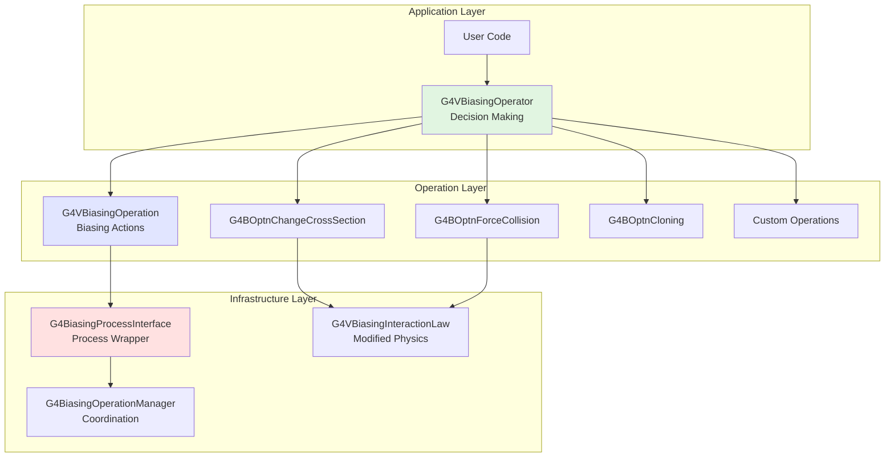

# Biasing (Variance Reduction) Sub-Module

## Overview

The Biasing sub-module provides powerful variance reduction techniques for Monte Carlo simulations, enabling efficient simulation of rare events, deep penetration problems, and detector optimization studies. This module implements both traditional importance sampling methods and a modern, flexible generic biasing framework that can modify process cross-sections, force interactions, and perform particle splitting/killing.

::: tip Module Location
**Source:** `source/processes/biasing/`
**Headers:** `source/processes/biasing/{generic,importance,management}/include/`
**Size:** ~40 classes across 3 sub-directories
:::

## Purpose and Scope

Variance reduction techniques are essential for efficient Monte Carlo simulations when:

- **Rare Events:** Simulating low-probability interactions (e.g., neutron capture in detectors)
- **Deep Penetration:** Tracking particles through thick shielding materials
- **Detector Optimization:** Maximizing statistics in specific detector regions
- **Thin Target Forcing:** Ensuring interactions in thin materials (foils, gases)
- **Shielding Studies:** Efficient calculation of dose behind shielding

The biasing framework provides:

1. **Generic Biasing Framework** - Flexible, modern approach for arbitrary biasing
2. **Importance Sampling** - Traditional geometry-based weight windows
3. **Cross-Section Biasing** - Modify interaction probabilities
4. **Forced Interactions** - Guarantee collisions in specified regions
5. **Splitting/Russian Roulette** - Particle population control
6. **Weight Management** - Automatic weight correction for unbiased results

::: warning Statistical Correctness
Variance reduction techniques modify the simulation but maintain statistical correctness through automatic weight adjustments. **Properly implemented biasing yields the same mean results as analog simulation but with reduced variance** (smaller statistical uncertainties).
:::

## Architecture

### Three-Layer Framework

The biasing infrastructure consists of three conceptual layers:



### Module Organization

```
source/processes/biasing/
├── generic/              # Modern biasing framework
│   ├── G4BiasingProcessInterface.hh    # Process wrapper
│   ├── G4BOptnChangeCrossSection.hh    # XS modification
│   ├── G4BOptnForceCommonTruncatedExp.hh # Force collision
│   ├── G4BOptnCloning.hh               # Particle splitting
│   ├── G4BOptrForceCollision.hh        # Force collision operator
│   └── G4ILaw*.hh                      # Interaction laws
│
├── importance/           # Classical importance sampling
│   ├── G4GeometrySampler.hh           # Setup helper
│   ├── G4ImportanceProcess.hh         # Importance process
│   ├── G4ImportanceConfigurator.hh    # Configuration
│   ├── G4WeightWindowProcess.hh       # Weight windows
│   └── G4VSampler.hh                  # Base sampler
│
└── management/           # Core infrastructure
    ├── G4VBiasingOperator.hh          # Operator base class
    ├── G4VBiasingOperation.hh         # Operation base class
    ├── G4VBiasingInteractionLaw.hh    # Interaction law base
    └── G4BiasingOperationManager.hh   # Manager

```

## Core Concepts

### 1. Biasing Operators

**`G4VBiasingOperator`** (source/processes/biasing/management/include/G4VBiasingOperator.hh:173) is the decision-making entity attached to logical volumes.

**Key Responsibilities:**
- Decide which biasing operations to apply
- Respond to process queries during tracking
- Manage biasing strategy for a detector region

**Three Decision Methods:**
```cpp
// 1. Non-physics biasing (splitting, killing)
virtual G4VBiasingOperation* ProposeNonPhysicsBiasingOperation(
    const G4Track* track,
    const G4BiasingProcessInterface* callingProcess) = 0;

// 2. Physics occurrence biasing (modify interaction length)
virtual G4VBiasingOperation* ProposeOccurenceBiasingOperation(
    const G4Track* track,
    const G4BiasingProcessInterface* callingProcess) = 0;

// 3. Final state biasing (modify interaction products)
virtual G4VBiasingOperation* ProposeFinalStateBiasingOperation(
    const G4Track* track,
    const G4BiasingProcessInterface* callingProcess) = 0;
```

### 2. Biasing Operations

**`G4VBiasingOperation`** (source/processes/biasing/management/include/G4VBiasingOperation.hh:66) represents a specific biasing action.

**Operation Types:**

| Operation Class | Purpose | Use Case |
|----------------|---------|----------|
| **G4BOptnChangeCrossSection** | Modify process cross-section | Enhance rare interactions |
| **G4BOptnForceCommonTruncatedExp** | Force interaction in range | Thin target forcing |
| **G4BOptnCloning** | Split/kill particles | Population control |
| **G4BOptnForceFreeFlight** | Force free flight | Paired with force collision |
| Custom operations | User-defined biasing | Application-specific needs |

### 3. Interaction Laws

**`G4VBiasingInteractionLaw`** (source/processes/biasing/management/include/G4VBiasingInteractionLaw.hh:53) defines modified probability distributions.

**Key Concepts:**
- **Non-interaction probability:** P_NI(l) = probability of traveling distance l without interaction
- **Effective cross-section:** σ_eff(l) = p(l) / P_NI(l)
- **Truncated exponential:** Exponential law limited to range [0, L]

**Common Laws:**
- **G4ILawTruncatedExp** - Single-process truncated exponential
- **G4ILawCommonTruncatedExp** - Multi-process combined exponential
- **G4InteractionLawPhysical** - Analog physics law wrapper
- **G4ILawForceFreeFlight** - Zero interaction probability

### 4. Process Interface

**`G4BiasingProcessInterface`** (source/processes/biasing/generic/include/G4BiasingProcessInterface.hh:63) wraps physics processes to enable biasing.

**Two Construction Modes:**

```cpp
// 1. Wrap an existing physics process
G4BiasingProcessInterface* biasWrapper =
    new G4BiasingProcessInterface(wrappedProcess,
                                  wrappedIsAtRest,
                                  wrappedIsAlongStep,
                                  wrappedIsPostStep,
                                  processName);

// 2. Non-physics biasing (no wrapped process)
G4BiasingProcessInterface* biasWrapper =
    new G4BiasingProcessInterface("biasWrapper");
```

**Functionality:**
- Queries biasing operator for operations
- Applies occurrence biasing (modifies interaction length)
- Applies final state biasing (modifies products)
- Handles weight corrections automatically

## Variance Reduction Techniques

### 1. Cross-Section Biasing

**Purpose:** Modify interaction probability to enhance rare events

**Implementation:** `G4BOptnChangeCrossSection` (source/processes/biasing/generic/include/G4BOptnChangeCrossSection.hh:41)

**How it Works:**
```
Analog:    σ_biased = σ_physical
Biased:    σ_biased = f × σ_physical    (where f > 1 increases interaction rate)
Weight:    w_new = w_old × (σ_physical / σ_biased)
```

**Use Cases:**
- Enhance photonuclear interactions (typically rare)
- Increase neutron capture in thin detectors
- Boost weak processes for better statistics

**Example - Enhance Photonuclear Interactions:**
```cpp
class PhotonuclearBiasing : public G4VBiasingOperator {
public:
    PhotonuclearBiasing() : G4VBiasingOperator("PhotonuclearBias") {
        fChangeCrossSectionOperation =
            new G4BOptnChangeCrossSection("ChangeCrossSectionForGammaNuclear");
    }

    virtual G4VBiasingOperation* ProposeOccurenceBiasingOperation(
        const G4Track* track,
        const G4BiasingProcessInterface* callingProcess) override {

        // Check if this is the photonuclear process
        G4String processName = callingProcess->GetWrappedProcess()->GetProcessName();
        if (processName == "photonNuclear") {
            // Enhance cross-section by factor of 100
            G4double enhancementFactor = 100.0;
            G4double analogXS = /* get from process */;
            G4double biasedXS = enhancementFactor * analogXS;

            fChangeCrossSectionOperation->SetBiasedCrossSection(biasedXS);
            fChangeCrossSectionOperation->Sample();

            return fChangeCrossSectionOperation;
        }
        return nullptr;
    }

private:
    G4BOptnChangeCrossSection* fChangeCrossSectionOperation;
};
```

### 2. Forced Collision (Interaction Forcing)

**Purpose:** Guarantee particles interact within a specified region

**Implementation:** `G4BOptrForceCollision` (source/processes/biasing/generic/include/G4BOptrForceCollision.hh:55)

**Algorithm (MCNP-like):**
1. **Clone Track:** Upon entering biased volume, create two copies
2. **Non-interacting Clone:** Weight = P_NI(L), travels to volume exit
3. **Interacting Clone:** Weight = 1 - P_NI(L), forced to interact in [0,L]

Where:
- L = distance to volume exit
- P_NI(L) = exp(-σ × L) = non-interaction probability

**Weight Relations:**
```
w_non_interact = w_original × exp(-σL)
w_interact     = w_original × [1 - exp(-σL)]
w_non_interact + w_interact = w_original  ✓
```

**Use Cases:**
- Thin gas detectors (ensure interactions)
- Thin foil targets
- Low-density materials
- Short path lengths through dense materials

**Example - Force Collision in Thin Detector:**
```cpp
// In detector construction
void DetectorConstruction::ConstructSDandField() {
    // Create force collision operator for neutrons
    G4BOptrForceCollision* forceCollisionOperator =
        new G4BOptrForceCollision("neutron", "ForceCollisionOp");

    // Attach to thin gas detector logical volume
    forceCollisionOperator->AttachTo(fGasDetectorLogical);

    G4cout << "Force collision enabled for neutrons in gas detector" << G4endl;
}

// In physics list - wrap processes with biasing interface
void PhysicsList::ConstructProcess() {
    // ... standard processes ...

    // Enable biasing for neutrons
    G4ParticleDefinition* neutron = G4Neutron::Definition();
    G4ProcessManager* pManager = neutron->GetProcessManager();

    // Get the process list
    G4ProcessVector* processList = pManager->GetProcessList();

    // Wrap each process with biasing interface
    for (size_t i = 0; i < processList->size(); ++i) {
        G4VProcess* process = (*processList)[i];

        // Don't wrap transportation
        if (process->GetProcessType() == fTransportation) continue;

        // Create biasing wrapper
        G4BiasingProcessInterface* biasWrapper =
            new G4BiasingProcessInterface(
                process,
                process->GetProcessType() == fAtRest,
                process->GetProcessType() == fAlongStep,
                true,  // PostStep
                "biasWrapper(" + process->GetProcessName() + ")"
            );

        // Replace process with wrapper
        pManager->RemoveProcess(process);
        pManager->AddProcess(biasWrapper);
        pManager->SetProcessOrderingToLast(biasWrapper, idxAlongStep);
        pManager->SetProcessOrderingToLast(biasWrapper, idxPostStep);
    }
}
```

### 3. Particle Splitting and Russian Roulette

**Purpose:** Control particle population based on importance

**Implementation:** `G4BOptnCloning` (source/processes/biasing/generic/include/G4BOptnCloning.hh:41)

**Splitting (Entering Important Region):**
```
Importance increases:  I_new = 2 × I_old
Action: Split particle into 2 copies
Weight: w_new = w_old / 2  (each copy)
```

**Russian Roulette (Leaving Important Region):**
```
Importance decreases:  I_new = I_old / 2
Action: Kill particle with probability 0.5
If survives: w_new = 2 × w_old
Average weight conserved: 0.5 × (2w_old) = w_old ✓
```

**Use Cases:**
- Shielding studies (increase importance near detector)
- Deep penetration problems
- Detector region optimization
- Albedo calculations

**Example - Importance Sampling for Shielding:**
```cpp
class ShieldingBiasing : public G4VBiasingOperator {
public:
    ShieldingBiasing() : G4VBiasingOperator("ShieldingBias") {
        fCloningOperation = new G4BOptnCloning("Cloning");
    }

    virtual G4VBiasingOperation* ProposeNonPhysicsBiasingOperation(
        const G4Track* track,
        const G4BiasingProcessInterface* callingProcess) override {

        // Get importance from current volume
        G4double currentImportance = GetImportance(track->GetVolume());

        // Check if importance changed (boundary crossing)
        if (fPreviousImportance > 0) {
            G4double importanceRatio = currentImportance / fPreviousImportance;

            if (importanceRatio > 1.0) {
                // Entering more important region - SPLIT
                G4int nSplit = G4int(importanceRatio + 0.5);
                G4double cloneWeight = track->GetWeight() / nSplit;

                fCloningOperation->SetCloneWeights(cloneWeight, cloneWeight);

                // Create additional clones
                for (G4int i = 1; i < nSplit; ++i) {
                    // Operation will handle cloning
                }

                return fCloningOperation;

            } else if (importanceRatio < 1.0) {
                // Entering less important region - RUSSIAN ROULETTE
                G4double survivalProbability = importanceRatio;

                if (G4UniformRand() < survivalProbability) {
                    // Survive with increased weight
                    G4double newWeight = track->GetWeight() / survivalProbability;
                    // Set weight (done through particle change)
                } else {
                    // Kill track
                    // (return operation that kills)
                }
            }
        }

        fPreviousImportance = currentImportance;
        return nullptr;
    }

private:
    G4BOptnCloning* fCloningOperation;
    G4double fPreviousImportance = 1.0;

    G4double GetImportance(const G4VPhysicalVolume* volume) {
        // Return importance value for volume
        // Higher importance = more particles desired
        if (volume == fDetectorVolume) return 16.0;
        if (volume == fShield1Volume) return 8.0;
        if (volume == fShield2Volume) return 4.0;
        return 1.0;  // World importance
    }
};
```

### 4. Importance Sampling (Classical Method)

**Purpose:** Geometry-based weight windows using parallel worlds

**Implementation:**
- `G4GeometrySampler` (source/processes/biasing/importance/include/G4GeometrySampler.hh:48)
- `G4ImportanceProcess` (source/processes/biasing/importance/include/G4ImportanceProcess.hh:57)

**Setup Components:**
1. **Importance Store:** Maps geometry cells to importance values
2. **Importance Algorithm:** Defines splitting/killing rules
3. **Importance Process:** Applies biasing at boundaries
4. **Geometry Sampler:** Configures everything

**Use Cases:**
- Deep penetration shielding calculations
- Albedo calculations (backscatter from thick targets)
- Detector tallies behind shielding
- Traditional variance reduction (MCNP-style)

**Example - Classical Importance Sampling:**
```cpp
// In detector construction
#include "G4GeometrySampler.hh"
#include "G4IStore.hh"

void DetectorConstruction::ConstructSDandField() {
    // Create importance store
    G4IStore* importanceStore = G4IStore::GetInstance();

    // Assign importance values to volumes
    // Higher importance = more particles
    importanceStore->AddImportanceGeometryCell(1.0, *fWorldPhysical);
    importanceStore->AddImportanceGeometryCell(2.0, *fShield1Physical);
    importanceStore->AddImportanceGeometryCell(4.0, *fShield2Physical);
    importanceStore->AddImportanceGeometryCell(8.0, *fShield3Physical);
    importanceStore->AddImportanceGeometryCell(16.0, *fDetectorPhysical);

    // Create geometry sampler
    G4GeometrySampler* geoSampler =
        new G4GeometrySampler(fWorldPhysical, "neutron");

    // Configure importance sampling
    geoSampler->PrepareImportanceSampling(importanceStore, nullptr);

    // Apply configuration
    geoSampler->Configure();

    G4cout << "Importance sampling configured for neutrons" << G4endl;
}
```

### 5. Weight Windows

**Purpose:** Maintain particle weights within acceptable bounds

**Implementation:** `G4WeightWindowProcess` (source/processes/biasing/importance/include/G4WeightWindowProcess.hh:58)

**Algorithm:**
- **Lower Bound (w_min):** If w < w_min, play Russian roulette
  - Survive with probability w/w_survive
  - If survive: w_new = w_survive

- **Upper Bound (w_max):** If w > w_max, split particle
  - Create n copies where n = floor(w/w_survive)
  - Each copy gets w_new = w/n

**Parameters:**
```
w_survive = survival weight (target weight)
w_min     = w_survive / k  (lower window)
w_max     = k × w_survive  (upper window)
```

Typical values: k = 2 to 5

**Use Cases:**
- Prevent weight explosion in deep penetration
- Maintain computational efficiency
- Automatic population control
- Combined with importance sampling

**Example - Weight Window Configuration:**
```cpp
void DetectorConstruction::ConstructSDandField() {
    // Create weight window store
    G4VWeightWindowStore* wwStore = /* create store */;

    // Define weight windows for each cell
    // Format: (lower_bound, upper_bound) per energy/position
    wwStore->AddCell(0.5, 2.0, cellID1);  // Window [0.5, 2.0]
    wwStore->AddCell(0.25, 1.0, cellID2); // Window [0.25, 1.0]

    // Create geometry sampler
    G4GeometrySampler* geoSampler =
        new G4GeometrySampler(fWorldPhysical, "neutron");

    // Configure weight windows
    geoSampler->PrepareWeightWindow(wwStore,
                                    nullptr,  // algorithm
                                    onBoundary);  // when to apply

    geoSampler->Configure();
}
```

## Weight Management

### Automatic Weight Correction

**The biasing framework automatically maintains weight conservation:**

```cpp
// Occurrence biasing weight correction
w_after = w_before × (σ_physical / σ_biased) × (P_NI_biased / P_NI_physical)

// Final state biasing
// User responsible for weight in custom operations
// Framework applies occurrence weight on top if both applied

// Splitting
w_clone = w_parent / n_clones

// Russian roulette
w_survive = w_original / p_survival  (if survives)
```

### Weight Accumulation

**Key principle:** Weights multiply through successive biasing operations

```
Initial weight:     w₀ = 1.0
After XS biasing:   w₁ = w₀ × (σ_phys / σ_bias) = 0.01
After splitting:    w₂ = w₁ / 2 = 0.005
Score contribution: score += w₂ × detected_energy
```

### Monitoring Weights

```cpp
// In sensitive detector or scoring
void MySensitiveDetector::ProcessHits(G4Step* step, G4TouchableHistory*) {
    G4Track* track = step->GetTrack();
    G4double weight = track->GetWeight();
    G4double energy = step->GetTotalEnergyDeposit();

    // Weighted score
    fTotalScore += weight * energy;

    // Track weight statistics
    if (weight < fMinWeight) fMinWeight = weight;
    if (weight > fMaxWeight) fMaxWeight = weight;

    // Warning for extreme weights
    if (weight > 1e6 || weight < 1e-6) {
        G4cout << "WARNING: Extreme weight " << weight
               << " at position " << track->GetPosition() << G4endl;
    }
}
```

## Creating Custom Biasing Operators

### Step-by-Step Guide

**1. Inherit from G4VBiasingOperator:**

```cpp
#include "G4VBiasingOperator.hh"

class MyBiasingOperator : public G4VBiasingOperator {
public:
    MyBiasingOperator(G4String name)
        : G4VBiasingOperator(name) {
        // Initialize biasing operations
        fMyOperation = new MyBiasingOperation("MyOperation");
    }

    virtual ~MyBiasingOperator() {
        delete fMyOperation;
    }
```

**2. Implement Three Mandatory Methods:**

```cpp
    // Non-physics biasing (splitting, killing)
    virtual G4VBiasingOperation* ProposeNonPhysicsBiasingOperation(
        const G4Track* track,
        const G4BiasingProcessInterface* callingProcess) override {

        // Decide if non-physics biasing should occur
        if (ShouldSplitParticle(track)) {
            return fCloningOperation;
        }
        return nullptr;  // No non-physics biasing
    }

    // Occurrence biasing (modify interaction probability)
    virtual G4VBiasingOperation* ProposeOccurenceBiasingOperation(
        const G4Track* track,
        const G4BiasingProcessInterface* callingProcess) override {

        // Check which process is calling
        G4String processName = callingProcess->GetWrappedProcess()->GetProcessName();

        // Apply biasing to specific process
        if (processName == "targetProcess") {
            // Modify cross-section
            return fChangeCrossSectionOperation;
        }
        return nullptr;  // No occurrence biasing
    }

    // Final state biasing (modify interaction products)
    virtual G4VBiasingOperation* ProposeFinalStateBiasingOperation(
        const G4Track* track,
        const G4BiasingProcessInterface* callingProcess) override {

        // Typically used for custom physics modifications
        return nullptr;  // No final state biasing
    }

private:
    G4BOptnCloning* fCloningOperation;
    G4BOptnChangeCrossSection* fChangeCrossSectionOperation;
    MyBiasingOperation* fMyOperation;
};
```

**3. Attach to Logical Volume:**

```cpp
// In ConstructSDandField()
void DetectorConstruction::ConstructSDandField() {
    MyBiasingOperator* biasOperator =
        new MyBiasingOperator("MyBias");

    // Attach to logical volume where biasing should occur
    biasOperator->AttachTo(fTargetLogicalVolume);

    G4cout << "Biasing operator attached to "
           << fTargetLogicalVolume->GetName() << G4endl;
}
```

**4. Wrap Physics Processes (in Physics List):**

```cpp
void PhysicsList::ConstructProcess() {
    // Standard process construction
    // ...

    // Wrap processes for biasing
    WrapProcessesForBiasing();
}

void PhysicsList::WrapProcessesForBiasing() {
    // Iterate over particles that need biasing
    std::vector<G4String> particles = {"gamma", "neutron", "e-"};

    for (const G4String& particleName : particles) {
        G4ParticleDefinition* particle =
            G4ParticleTable::GetParticleTable()->FindParticle(particleName);

        if (!particle) continue;

        G4ProcessManager* pManager = particle->GetProcessManager();
        G4ProcessVector* processList = pManager->GetProcessList();

        // Wrap each process
        std::vector<G4VProcess*> processesToWrap;
        for (size_t i = 0; i < processList->size(); ++i) {
            G4VProcess* process = (*processList)[i];

            // Skip transportation
            if (process->GetProcessType() == fTransportation) continue;

            processesToWrap.push_back(process);
        }

        // Create wrappers
        for (G4VProcess* process : processesToWrap) {
            G4BiasingProcessInterface* wrapper =
                new G4BiasingProcessInterface(
                    process,
                    false,  // isAtRest
                    true,   // isAlongStep
                    true,   // isPostStep
                    "biasWrapper(" + process->GetProcessName() + ")"
                );

            // Replace process with wrapper
            G4int originalOrdering = pManager->GetProcessOrdering(process, idxPostStep);
            pManager->RemoveProcess(process);
            pManager->AddProcess(wrapper);
            pManager->SetProcessOrdering(wrapper, idxAlongStep);
            pManager->SetProcessOrdering(wrapper, idxPostStep, originalOrdering);
        }
    }
}
```

### Custom Biasing Operation Example

**Creating a Custom Operation:**

```cpp
#include "G4VBiasingOperation.hh"

class MyCustomBiasing : public G4VBiasingOperation {
public:
    MyCustomBiasing(G4String name) : G4VBiasingOperation(name) {
        fInteractionLaw = new G4ILawTruncatedExp("MyInteractionLaw");
    }

    // For occurrence biasing
    virtual const G4VBiasingInteractionLaw*
    ProvideOccurenceBiasingInteractionLaw(
        const G4BiasingProcessInterface* callingProcess,
        G4ForceCondition& proposeForceCondition) override {

        // Get physical cross-section from process
        G4double physicalXS = /* get from calling process */;

        // Bias the cross-section
        G4double biasedXS = 10.0 * physicalXS;  // 10x enhancement

        // Set in interaction law
        fInteractionLaw->SetForceCrossSection(biasedXS);
        fInteractionLaw->SetMaximumDistance(100.0*cm);

        // Sample the law
        fInteractionLaw->Sample();

        proposeForceCondition = NotForced;
        return fInteractionLaw;
    }

    // For final state biasing
    virtual G4VParticleChange* ApplyFinalStateBiasing(
        const G4BiasingProcessInterface* callingProcess,
        const G4Track* track,
        const G4Step* step,
        G4bool& forceBiasedFinalState) override {

        // Modify final state here
        // Can change particle energies, directions, create secondaries, etc.

        forceBiasedFinalState = false;  // Let framework apply weight
        return nullptr;  // Or return custom particle change
    }

    // For non-physics biasing
    virtual G4double DistanceToApplyOperation(
        const G4Track* track,
        G4double previousStepSize,
        G4ForceCondition* condition) override {

        *condition = NotForced;
        return DBL_MAX;  // Don't limit step
    }

    virtual G4VParticleChange* GenerateBiasingFinalState(
        const G4Track* track,
        const G4Step* step) override {

        // Custom final state for non-physics biasing
        return nullptr;
    }

private:
    G4ILawTruncatedExp* fInteractionLaw;
};
```

## Practical Examples

### Example 1: Enhance Rare Process in Detector

**Scenario:** Photonuclear interactions are rare. Enhance them by 100x in detector region.

```cpp
class PhotonuclearBiasing : public G4VBiasingOperator {
public:
    PhotonuclearBiasing() : G4VBiasingOperator("PhotonuclearBias") {
        fBiasOperation = new G4BOptnChangeCrossSection("BiasPhotonuclear");
    }

    virtual G4VBiasingOperation* ProposeOccurenceBiasingOperation(
        const G4Track* track,
        const G4BiasingProcessInterface* callingProcess) override {

        // Only bias photonuclear process
        if (callingProcess->GetWrappedProcess()->GetProcessName() == "photonNuclear") {
            // Enhance by factor of 100
            G4double enhancementFactor = 100.0;

            // Get wrapped process to query cross-section
            const G4VProcess* wrappedProcess = callingProcess->GetWrappedProcess();

            // Get current cross-section (energy dependent)
            G4double physicalXS = /* query from process */;
            G4double biasedXS = enhancementFactor * physicalXS;

            // Set biased cross-section
            fBiasOperation->SetBiasedCrossSection(biasedXS);
            fBiasOperation->Sample();

            return fBiasOperation;
        }

        return nullptr;
    }

    // Other methods return nullptr
    virtual G4VBiasingOperation* ProposeNonPhysicsBiasingOperation(...) override
        { return nullptr; }
    virtual G4VBiasingOperation* ProposeFinalStateBiasingOperation(...) override
        { return nullptr; }

private:
    G4BOptnChangeCrossSection* fBiasOperation;
};
```

### Example 2: Force Interaction in Thin Gas Detector

**Scenario:** 1 cm gas detector, ensure neutrons interact

```cpp
// Simply use built-in G4BOptrForceCollision
void DetectorConstruction::ConstructSDandField() {
    // Create operator for neutrons
    G4BOptrForceCollision* forceCollision =
        new G4BOptrForceCollision("neutron", "ForceCollisionInGas");

    // Attach to gas detector volume
    forceCollision->AttachTo(fGasDetectorLogical);

    // Done! The operator handles:
    // - Track cloning on entry
    // - Forced interaction for one clone
    // - Free flight for other clone
    // - Automatic weight correction
}
```

### Example 3: Geometry-Based Splitting for Shielding

**Scenario:** Deep shielding calculation, split particles approaching detector

```cpp
class ShieldingSplitting : public G4VBiasingOperator {
public:
    ShieldingSplitting() : G4VBiasingOperator("ShieldingSplit") {
        fCloningOperation = new G4BOptnCloning("Cloning");
        fLastImportance = 1.0;
    }

    virtual void StartTracking(const G4Track* track) override {
        fLastImportance = GetImportanceForVolume(track->GetVolume());
    }

    virtual G4VBiasingOperation* ProposeNonPhysicsBiasingOperation(
        const G4Track* track,
        const G4BiasingProcessInterface* callingProcess) override {

        // Get current importance
        G4double currentImportance = GetImportanceForVolume(track->GetVolume());

        // Check if we crossed a boundary
        if (currentImportance != fLastImportance) {
            G4double importanceRatio = currentImportance / fLastImportance;

            if (importanceRatio > 1.0) {
                // Split particle
                G4int nSplit = static_cast<G4int>(importanceRatio + 0.5);
                G4double newWeight = track->GetWeight() / nSplit;

                fCloningOperation->SetCloneWeights(newWeight, newWeight);

                fLastImportance = currentImportance;
                return fCloningOperation;
            }
            else if (importanceRatio < 1.0) {
                // Russian roulette
                G4double survivalProb = importanceRatio;

                if (G4UniformRand() > survivalProb) {
                    // Kill track
                    const_cast<G4Track*>(track)->SetTrackStatus(fStopAndKill);
                }
                else {
                    // Increase weight
                    G4double newWeight = track->GetWeight() / survivalProb;
                    const_cast<G4Track*>(track)->SetWeight(newWeight);
                }

                fLastImportance = currentImportance;
            }
        }

        return nullptr;
    }

    virtual G4VBiasingOperation* ProposeOccurenceBiasingOperation(...) override
        { return nullptr; }
    virtual G4VBiasingOperation* ProposeFinalStateBiasingOperation(...) override
        { return nullptr; }

private:
    G4BOptnCloning* fCloningOperation;
    G4double fLastImportance;

    G4double GetImportanceForVolume(const G4VPhysicalVolume* volume) {
        // Define importance map
        if (volume->GetName() == "Detector") return 32.0;
        if (volume->GetName() == "Shield1") return 16.0;
        if (volume->GetName() == "Shield2") return 8.0;
        if (volume->GetName() == "Shield3") return 4.0;
        if (volume->GetName() == "Shield4") return 2.0;
        return 1.0;  // World
    }
};
```

### Example 4: Energy-Dependent Biasing

**Scenario:** Enhance low-energy neutron interactions (E < 1 MeV)

```cpp
class LowEnergyNeutronBiasing : public G4VBiasingOperator {
public:
    LowEnergyNeutronBiasing() : G4VBiasingOperator("LowENeutronBias") {
        fXSBiasing = new G4BOptnChangeCrossSection("BiasLowE");
    }

    virtual G4VBiasingOperation* ProposeOccurenceBiasingOperation(
        const G4Track* track,
        const G4BiasingProcessInterface* callingProcess) override {

        // Get particle energy
        G4double energy = track->GetKineticEnergy();

        // Only bias if E < 1 MeV
        if (energy < 1.0*MeV) {
            // Enhancement factor increases at lower energies
            G4double enhancementFactor = 10.0 * (1.0*MeV / energy);

            // Cap maximum enhancement
            if (enhancementFactor > 1000.0) enhancementFactor = 1000.0;

            // Get physical cross-section
            const G4VProcess* process = callingProcess->GetWrappedProcess();
            G4double physicalXS = /* get from process */;

            // Apply biasing
            G4double biasedXS = enhancementFactor * physicalXS;
            fXSBiasing->SetBiasedCrossSection(biasedXS);
            fXSBiasing->Sample();

            return fXSBiasing;
        }

        return nullptr;  // No biasing for E > 1 MeV
    }

    virtual G4VBiasingOperation* ProposeNonPhysicsBiasingOperation(...) override
        { return nullptr; }
    virtual G4VBiasingOperation* ProposeFinalStateBiasingOperation(...) override
        { return nullptr; }

private:
    G4BOptnChangeCrossSection* fXSBiasing;
};
```

## Performance Considerations

### Efficiency Gains

**Variance Reduction Figure of Merit:**
```
FOM = 1 / (σ² × CPU_time)

Where σ² = variance of result
```

**Good biasing can achieve:**
- 10-100x speedup for rare event simulation
- 100-10000x speedup for deep penetration problems
- Improvement depends on problem geometry and physics

### Best Practices

**1. Start Conservative:**
- Begin with small enhancement factors (2-10x)
- Gradually increase based on weight statistics
- Monitor weight distributions

**2. Avoid Over-Biasing:**
- Very large weights lead to poor statistics
- Rule of thumb: keep max_weight / min_weight < 10⁴

**3. Regional Application:**
- Apply biasing only where needed
- Use different strategies for different regions
- Minimize biased volume to reduce overhead

**4. Weight Window Optimization:**
- Set w_survive to expected particle importance
- Use weight windows to prevent weight explosion
- Adjust window parameters based on weight statistics

**5. Monitor Statistics:**
```cpp
// Track weight statistics
G4double sumWeights = 0.0;
G4double sumWeightsSq = 0.0;
G4int nParticles = 0;

void RecordWeight(G4double weight) {
    sumWeights += weight;
    sumWeightsSq += weight * weight;
    nParticles++;
}

void PrintStatistics() {
    G4double meanWeight = sumWeights / nParticles;
    G4double variance = (sumWeightsSq / nParticles) - (meanWeight * meanWeight);
    G4double rms = std::sqrt(variance);

    G4cout << "Weight Statistics:" << G4endl;
    G4cout << "  Mean: " << meanWeight << G4endl;
    G4cout << "  RMS: " << rms << G4endl;
    G4cout << "  RMS/Mean: " << rms/meanWeight << G4endl;
}
```

### Common Pitfalls

**1. Forgetting to Wrap Processes:**
- Biasing requires `G4BiasingProcessInterface` wrappers
- Must wrap in physics list construction
- Transportation should NOT be wrapped

**2. Incorrect Weight Handling:**
- Don't manually modify weights unless necessary
- Framework handles weight corrections automatically
- Check `forceBiasedFinalState` usage

**3. Importance Inversions:**
- Importance should generally increase toward detector
- Avoid sharp importance gradients (factor > 4-8)
- Use smooth transitions

**4. Not Validating Results:**
- Always compare biased vs. unbiased results
- Check mean values match
- Verify variance reduction

## Debugging and Validation

### Enable Verbose Output

```cpp
// In operator constructor or initialization
void MyBiasingOperator::StartRun() {
    G4cout << "========================================" << G4endl;
    G4cout << "Biasing Operator: " << GetName() << G4endl;
    G4cout << "========================================" << G4endl;
}

void MyBiasingOperator::StartTracking(const G4Track* track) {
    G4cout << "Start tracking particle " << track->GetParticleDefinition()->GetParticleName()
           << " with weight " << track->GetWeight() << G4endl;
}
```

### Check Weight Conservation

```cpp
// In event action
void EventAction::BeginOfEventAction(const G4Event* event) {
    fInitialWeight = 1.0;  // Assuming primary has weight 1
    fFinalWeightSum = 0.0;
}

void EventAction::EndOfEventAction(const G4Event* event) {
    // Sum weights of all particles reaching detector
    // fFinalWeightSum should approximately equal fInitialWeight

    G4double weightDifference = std::abs(fFinalWeightSum - fInitialWeight);
    if (weightDifference > 0.01 * fInitialWeight) {
        G4cout << "WARNING: Weight conservation issue!" << G4endl;
        G4cout << "  Initial: " << fInitialWeight << G4endl;
        G4cout << "  Final sum: " << fFinalWeightSum << G4endl;
    }
}
```

### Compare Biased vs. Unbiased

```cpp
// Run same simulation with and without biasing
// Compare results:

// Unbiased run
G4double meanUnbiased = totalScore / nEvents;
G4double sigmaUnbiased = std::sqrt(variance / nEvents);

// Biased run
G4double meanBiased = totalWeightedScore / nEvents;
G4double sigmaBiased = std::sqrt(varianceBiased / nEvents);

// Check agreement
G4double difference = std::abs(meanBiased - meanUnbiased);
G4double combinedSigma = std::sqrt(sigmaUnbiased*sigmaUnbiased +
                                   sigmaBiased*sigmaBiased);

if (difference < 2.0 * combinedSigma) {
    G4cout << "Results agree within 2 sigma" << G4endl;
} else {
    G4cout << "WARNING: Biased and unbiased results disagree!" << G4endl;
}

// Check efficiency gain
G4double efficiencyRatio = (sigmaUnbiased*sigmaUnbiased) /
                           (sigmaBiased*sigmaBiased);
G4cout << "Variance reduction factor: " << efficiencyRatio << G4endl;
```

## API Documentation

### Core Classes

- **[G4VBiasingOperator](./api/g4vbiasingoperator.md)** - Base class for biasing operators
- **[G4VBiasingOperation](./api/g4vbiasingoperation.md)** - Base class for biasing operations
- **[G4VBiasingInteractionLaw](./api/g4vbiasinginteractionlaw.md)** - Interaction probability distributions
- **[G4BiasingProcessInterface](./api/g4biasingprocessinterface.md)** - Process wrapper for biasing

### Generic Biasing Operations

- **[G4BOptnChangeCrossSection](./api/g4boptnchangecrosssection.md)** - Cross-section modification
- **[G4BOptnForceCommonTruncatedExp](./api/g4boptnforcecommontruncatedexp.md)** - Force collision operation
- **[G4BOptnCloning](./api/g4boptncloning.md)** - Particle splitting/killing
- **[G4BOptrForceCollision](./api/g4boptrforcecollision.md)** - Force collision operator

### Importance Sampling

- **[G4GeometrySampler](./api/g4geometrysampler.md)** - Importance sampling configurator
- **[G4ImportanceProcess](./api/g4importanceprocess.md)** - Importance-based splitting/killing
- **[G4ImportanceConfigurator](./api/g4importanceconfigurator.md)** - Configuration helper
- **[G4WeightWindowProcess](./api/g4weightwindowprocess.md)** - Weight window technique

### Interaction Laws

- **[G4ILawTruncatedExp](./api/g4ilawtruncatedexp.md)** - Truncated exponential law
- **[G4ILawCommonTruncatedExp](./api/g4ilawcommontruncatedexp.md)** - Combined truncated exponential
- **[G4InteractionLawPhysical](./api/g4interactionlawphysical.md)** - Physical law wrapper

## Related Documentation

- [**Processes Module**](../) - Main processes framework
- [**Management Sub-module**](../management/) - Process infrastructure
- [**Track Module**](../../track/) - Track and step handling
- [**Tracking Module**](../../tracking/) - Tracking manager

---

## References

### Literature

1. **MCNP Manual** - Classic variance reduction techniques
2. **Booth, T. E.** - "A Weight Window Tutorial" (Monte Carlo methods)
3. **Geant4 Collaboration** - "Biasing and Reverse Monte Carlo" (Physics Reference Manual)
4. **Verderi, M. et al.** - Generic biasing framework (Geant4 developers)

### Code Examples

- `examples/extended/biasing/B01` - Importance sampling example
- `examples/extended/biasing/B02` - Scoring and biasing
- `examples/extended/biasing/B03` - Force collision example
- `examples/extended/biasing/GB01` - Generic biasing framework
- `examples/extended/biasing/GB02` - Cross-section biasing
- `examples/extended/biasing/GB03` - Splitting and killing
- `examples/extended/biasing/GB04` - Force collision MCNP-like
- `examples/extended/biasing/GB05` - Final state biasing
- `examples/extended/biasing/GB06` - Parallel geometries and scoring

---

::: tip Next Steps
- Start with [G4BOptrForceCollision](./api/g4boptrforcecollision.md) for simple forcing
- Learn [G4BOptnChangeCrossSection](./api/g4boptnchangecrosssection.md) for rare events
- Study [G4GeometrySampler](./api/g4geometrysampler.md) for importance sampling
- Create custom operators with [G4VBiasingOperator](./api/g4vbiasingoperator.md)
- Review examples in `examples/extended/biasing/`
:::

---

::: info Last Updated
**Date:** 2025-11-17
**Module Version:** Geant4 11.4.0.beta
**Author:** Claude Code Documentation
**Status:** Comprehensive overview complete
:::
