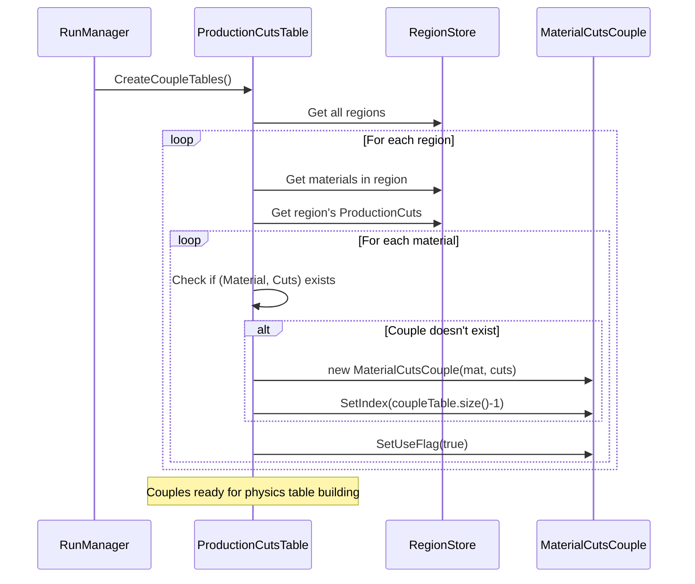

# G4MaterialCutsCouple API Documentation

## Overview

`G4MaterialCutsCouple` represents the association between a material and a set of production cuts. These couples serve as indices into physics tables, enabling efficient lookup of cross-sections, stopping powers, and other physics data. Each unique (Material, ProductionCuts) pair creates one couple, which is assigned an index used throughout particle tracking.

::: tip Header Files
**Location:** `source/processes/cuts/include/G4MaterialCutsCouple.hh`
**Source:** `source/processes/cuts/src/G4MaterialCutsCouple.cc`
:::

## Purpose

Physics processes in Geant4 organize their data in tables indexed by material-cuts couples:

```
Process Physics Table Layout:
  Index 0: Data for (Material A, Cuts 1)
  Index 1: Data for (Material B, Cuts 1)
  Index 2: Data for (Material A, Cuts 2)
  Index 3: Data for (Material C, Cuts 1)
  ...
```

During tracking, the current couple is retrieved from the track's volume:
```cpp
const G4MaterialCutsCouple* couple = track.GetMaterialCutsCouple();
G4int index = couple->GetIndex();
// Use index to look up cross-sections, energy loss, etc.
```

## Class Declaration

```cpp
class G4MaterialCutsCouple
{
  public:
    G4MaterialCutsCouple();
    G4MaterialCutsCouple(const G4Material*, G4ProductionCuts* cut = nullptr);
    virtual ~G4MaterialCutsCouple();

    G4MaterialCutsCouple(const G4MaterialCutsCouple& right);
    G4MaterialCutsCouple& operator=(const G4MaterialCutsCouple& right);

    G4bool operator==(const G4MaterialCutsCouple& right) const;
    G4bool operator!=(const G4MaterialCutsCouple& right) const;

    // Material access
    void SetMaterial(const G4Material*);
    const G4Material* GetMaterial() const;

    // Production cuts access
    void SetProductionCuts(G4ProductionCuts*);
    G4ProductionCuts* GetProductionCuts() const;

    // Modification tracking
    G4bool IsRecalcNeeded() const;
    void PhysicsTableUpdated();

    // Index management
    void SetIndex(G4int idx);
    G4int GetIndex() const;

    // Usage tracking
    void SetUseFlag(G4bool flg = true);
    G4bool IsUsed() const;

  private:
    G4bool isMaterialModified = false;
    const G4Material* fMaterial = nullptr;
    G4ProductionCuts* fCuts = nullptr;
    G4int indexNumber = -1;
    G4bool isUsedInGeometry = false;
};
```

## Constructors and Destructor

### Default Constructor
`source/processes/cuts/include/G4MaterialCutsCouple.hh:56`
`source/processes/cuts/src/G4MaterialCutsCouple.cc:37-39`

```cpp
G4MaterialCutsCouple();
```

Creates an empty couple with no material or cuts assigned. Typically used internally by `G4ProductionCutsTable`.

### Parametrized Constructor
`source/processes/cuts/include/G4MaterialCutsCouple.hh:57`
`source/processes/cuts/src/G4MaterialCutsCouple.cc:42-48`

```cpp
G4MaterialCutsCouple(const G4Material* material,
                     G4ProductionCuts* cut = nullptr);
```

**Parameters:**
- `material`: Pointer to material
- `cut`: Pointer to production cuts (default: `nullptr`)

**Example:**
```cpp
const G4Material* silicon = /*...*/;
G4ProductionCuts* trackerCuts = /*...*/;

G4MaterialCutsCouple* couple =
    new G4MaterialCutsCouple(silicon, trackerCuts);
```

::: warning Internal Creation
Users rarely create couples directly. `G4ProductionCutsTable::CreateCoupleTables()` creates all necessary couples automatically.
:::

### Copy Constructor / Assignment
`source/processes/cuts/src/G4MaterialCutsCouple.cc:51-75`

```cpp
G4MaterialCutsCouple(const G4MaterialCutsCouple& right);
G4MaterialCutsCouple& operator=(const G4MaterialCutsCouple& right);
```

Copies all member data including material pointer, cuts pointer, index, and flags.

## Material Management

### SetMaterial() / GetMaterial()
`source/processes/cuts/include/G4MaterialCutsCouple.hh:71-75`
`source/processes/cuts/include/G4MaterialCutsCouple.hh:159-169`

```cpp
void SetMaterial(const G4Material* material);
const G4Material* GetMaterial() const;
```

**SetMaterial Behavior:**
- Sets material pointer
- Marks couple as modified (`isMaterialModified = true`)

**Example:**
```cpp
const G4Material* water =
    G4NistManager::Instance()->FindOrBuildMaterial("G4_WATER");

const G4MaterialCutsCouple* couple = track.GetMaterialCutsCouple();
const G4Material* material = couple->GetMaterial();

if (material == water) {
    G4cout << "Track is in water" << G4endl;
}
```

## Production Cuts Management

### SetProductionCuts() / GetProductionCuts()
`source/processes/cuts/include/G4MaterialCutsCouple.hh:77-81`
`source/processes/cuts/include/G4MaterialCutsCouple.hh:135-144`

```cpp
void SetProductionCuts(G4ProductionCuts* cuts);
G4ProductionCuts* GetProductionCuts() const;
```

**Example:**
```cpp
const G4MaterialCutsCouple* couple = track.GetMaterialCutsCouple();
G4ProductionCuts* cuts = couple->GetProductionCuts();

G4double electronCut = cuts->GetProductionCut("e-");
G4cout << "Electron cut: " << electronCut/mm << " mm" << G4endl;
```

## Index Management

### SetIndex() / GetIndex()
`source/processes/cuts/include/G4MaterialCutsCouple.hh:90-92`
`source/processes/cuts/include/G4MaterialCutsCouple.hh:110-120`

```cpp
void SetIndex(G4int idx);
G4int GetIndex() const;
```

**Purpose:** The index uniquely identifies this couple and is used as a key into physics tables.

**Set by:** `G4ProductionCutsTable` during couple table creation

**Example:**
```cpp
const G4MaterialCutsCouple* couple = track.GetMaterialCutsCouple();
G4int idx = couple->GetIndex();

// Use index to lookup physics data
G4double crossSection = (*crossSectionTable)[idx]->Value(energy);
G4double dEdx = (*dEdxTable)[idx]->Value(energy);
```

::: tip Physics Table Indexing
All physics processes organize their tables using couple indices. This enables O(1) lookup of material and cut-dependent physics data.
:::

## Modification Tracking

### IsRecalcNeeded()
`source/processes/cuts/include/G4MaterialCutsCouple.hh:83-85`
`source/processes/cuts/include/G4MaterialCutsCouple.hh:171-177`

```cpp
G4bool IsRecalcNeeded() const;
```

**Returns:**
- `true` if material or cuts have been modified since last physics table update
- `false` if couple is synchronized with physics tables

**Implementation:**
```cpp
inline G4bool G4MaterialCutsCouple::IsRecalcNeeded() const
{
  G4bool isCutModified = false;
  if (fCuts != nullptr)
    isCutModified = fCuts->IsModified();

  return (isMaterialModified || isCutModified);
}
```

Used by `G4ProductionCutsTable::IsModified()` to determine if physics tables need rebuilding.

### PhysicsTableUpdated()
`source/processes/cuts/include/G4MaterialCutsCouple.hh:87-88`
`source/processes/cuts/include/G4MaterialCutsCouple.hh:179-184`

```cpp
void PhysicsTableUpdated();
```

**Purpose:** Resets modification flags after physics tables have been updated.

**Implementation:**
```cpp
inline void G4MaterialCutsCouple::PhysicsTableUpdated()
{
  if (fCuts != nullptr)
    fCuts->PhysicsTableUpdated();
  isMaterialModified = false;
}
```

::: danger Internal Use
Should only be called by `G4ProductionCutsTable`. Never call directly in user code.
:::

## Usage Flags

### SetUseFlag() / IsUsed()
`source/processes/cuts/include/G4MaterialCutsCouple.hh:94-95`
`source/processes/cuts/include/G4MaterialCutsCouple.hh:122-132`

```cpp
void SetUseFlag(G4bool flg = true);
G4bool IsUsed() const;
```

**Purpose:** Tracks whether this couple is actually used in the current geometry.

**Use Case:**
- During couple table creation, all existing couples are marked as unused
- Couples referenced by the current geometry are marked as used
- Unused couples are removed to save memory

## Equality Operators

### operator== / operator!=
`source/processes/cuts/include/G4MaterialCutsCouple.hh:67-69`
`source/processes/cuts/include/G4MaterialCutsCouple.hh:147-156`

```cpp
G4bool operator==(const G4MaterialCutsCouple& right) const;
G4bool operator!=(const G4MaterialCutsCouple& right) const;
```

**Behavior:** Compares object addresses (pointer equality), not content.

```cpp
inline G4bool G4MaterialCutsCouple::operator==(
    const G4MaterialCutsCouple& right) const
{
  return (this == &right);
}
```

::: warning Identity Comparison
These operators check if two pointers refer to the same object. They do NOT compare material or cuts values.
:::

## Usage Examples

### Retrieving Couple from Track

```cpp
// In tracking/stepping code
const G4MaterialCutsCouple* couple = track.GetMaterialCutsCouple();

// Get material
const G4Material* material = couple->GetMaterial();
G4cout << "Material: " << material->GetName() << G4endl;

// Get production cuts
G4ProductionCuts* cuts = couple->GetProductionCuts();
G4cout << "e- cut: " << cuts->GetProductionCut("e-")/mm << " mm" << G4endl;

// Get couple index for physics table lookup
G4int index = couple->GetIndex();
```

### Physics Table Lookup

```cpp
// In a physics process
G4double ComputeCrossSection(const G4Track& track, G4double energy) {
    const G4MaterialCutsCouple* couple = track.GetMaterialCutsCouple();
    G4int idx = couple->GetIndex();

    // Look up pre-computed cross-section
    G4PhysicsTable* xsecTable = GetCrossSectionTable();
    G4PhysicsVector* xsecVector = (*xsecTable)[idx];

    return xsecVector->Value(energy);
}
```

### Iterating Over All Couples

```cpp
G4ProductionCutsTable* cutsTable =
    G4ProductionCutsTable::GetProductionCutsTable();

for (std::size_t i = 0; i < cutsTable->GetTableSize(); ++i) {
    const G4MaterialCutsCouple* couple =
        cutsTable->GetMaterialCutsCouple(i);

    G4cout << "Couple " << couple->GetIndex() << ":\n"
           << "  Material: " << couple->GetMaterial()->GetName() << "\n"
           << "  e- cut: " << couple->GetProductionCuts()
                                  ->GetProductionCut("e-")/mm << " mm\n"
           << "  Used: " << (couple->IsUsed() ? "Yes" : "No") << G4endl;
}
```

### Finding Specific Couple

```cpp
const G4Material* silicon =
    G4NistManager::Instance()->FindOrBuildMaterial("G4_Si");
G4ProductionCuts* trackerCuts = /*...*/;

const G4MaterialCutsCouple* couple =
    cutsTable->GetMaterialCutsCouple(silicon, trackerCuts);

if (couple) {
    G4cout << "Found couple with index " << couple->GetIndex() << G4endl;
} else {
    G4cout << "Couple not found - may not be in current geometry" << G4endl;
}
```

## Couple Creation Process

Understanding when and how couples are created:



## Integration with Physics Processes

### Energy Cut Lookup

```cpp
// Inside a process (e.g., G4eIonisation)
G4double GetEnergyCut(const G4Track& track) {
    const G4MaterialCutsCouple* couple = track.GetMaterialCutsCouple();
    G4int idx = couple->GetIndex();

    // Get energy cut for electrons
    const std::vector<G4double>* energyCuts =
        G4ProductionCutsTable::GetProductionCutsTable()
            ->GetEnergyCutsVector(idxG4ElectronCut);

    return (*energyCuts)[idx];
}
```

### Physics Table Organization

```cpp
// Building a physics table (in process initialization)
void BuildPhysicsTable() {
    G4ProductionCutsTable* cutsTable =
        G4ProductionCutsTable::GetProductionCutsTable();

    std::size_t nCouples = cutsTable->GetTableSize();

    // Create table with one vector per couple
    G4PhysicsTable* table = new G4PhysicsTable(nCouples);

    for (std::size_t i = 0; i < nCouples; ++i) {
        const G4MaterialCutsCouple* couple =
            cutsTable->GetMaterialCutsCouple(i);

        // Build physics vector for this (material, cuts) combination
        G4PhysicsVector* vector = ComputePhysicsVector(
            couple->GetMaterial(),
            couple->GetProductionCuts());

        table->insert(vector);
    }
}
```

## Performance Considerations

### Couple Count Optimization

Minimize the number of couples to reduce:
- Memory footprint (each couple needs physics table entries)
- Initialization time (tables built for each couple)

**Strategy:**
```cpp
// BAD: Many duplicate couples
for (auto region : regions) {
    G4ProductionCuts* cuts = new G4ProductionCuts();
    cuts->SetProductionCut(1*mm);
    region->SetProductionCuts(cuts);
}
// Result: N regions × M materials = N×M couples (many duplicates!)

// GOOD: Reuse cuts
G4ProductionCuts* standardCuts = new G4ProductionCuts();
standardCuts->SetProductionCut(1*mm);

for (auto region : regions) {
    region->SetProductionCuts(standardCuts);
}
// Result: 1 cuts object × M materials = M couples (optimal!)
```

### Index-Based Lookup Performance

Couple indices enable O(1) physics data lookup:

```cpp
// Fast: Direct index into table
G4int idx = couple->GetIndex();
G4double value = (*physicsTable)[idx]->Value(energy);  // O(1)

// Slow: Linear search (avoid!)
for (auto vec : *physicsTable) {
    if (/* material matches */) {
        value = vec->Value(energy);  // O(N)
    }
}
```

## Thread Safety

`G4MaterialCutsCouple` objects are thread-safe for reading:

- **Creation**: In master thread during initialization
- **Modification**: Not allowed after worker threads start
- **Access**: Read-only from worker threads during tracking
- **Shared**: Same couple objects shared across threads

::: warning MT Mode
Never modify couple properties (material, cuts, index) during event processing in multi-threaded mode.
:::

## Common Patterns

### Pattern: Material-Specific Logic

```cpp
void ProcessStep(const G4Step& step) {
    const G4MaterialCutsCouple* couple =
        step.GetPreStepPoint()->GetMaterialCutsCouple();

    const G4Material* material = couple->GetMaterial();

    if (material->GetName() == "G4_Si") {
        // Special handling for silicon
    }
}
```

### Pattern: Cut-Dependent Processing

```cpp
G4bool ShouldCreateSecondary(const G4Track& track, G4double secondaryEnergy) {
    const G4MaterialCutsCouple* couple = track.GetMaterialCutsCouple();
    G4int idx = couple->GetIndex();

    const std::vector<G4double>* energyCuts =
        G4ProductionCutsTable::GetProductionCutsTable()
            ->GetEnergyCutsVector(idxG4ElectronCut);

    G4double cutEnergy = (*energyCuts)[idx];

    return (secondaryEnergy > cutEnergy);
}
```

## Troubleshooting

### Issue: Index is -1

**Symptom:** `GetIndex()` returns -1

**Cause:** Couple created but not added to table, or index never set

**Solution:**
```cpp
// Couples should be created by ProductionCutsTable
// Don't create manually unless you know what you're doing
```

### Issue: Material or Cuts are nullptr

**Symptom:** Null pointer when accessing material/cuts

**Cause:** Couple not properly initialized

**Solution:**
```cpp
const G4MaterialCutsCouple* couple = track.GetMaterialCutsCouple();

if (couple == nullptr) {
    G4cout << "No couple assigned to track!" << G4endl;
}

const G4Material* material = couple->GetMaterial();
if (material == nullptr) {
    G4cout << "Couple has no material!" << G4endl;
}
```

## Related Classes

- [**G4ProductionCuts**](g4productioncuts.md) - Cut values stored in couple
- [**G4ProductionCutsTable**](g4productioncutstable.md) - Manages all couples
- [**G4Material**](../../materials/) - Material properties in couple
- [**G4Track**](../../track/) - Provides access to current couple during tracking

## References

- Header: `source/processes/cuts/include/G4MaterialCutsCouple.hh`
- Source: `source/processes/cuts/src/G4MaterialCutsCouple.cc`
- [Cuts Module Overview](../index.md)

---

::: info API Version
**Geant4 Version:** 11.4.0.beta
**Last Updated:** 2025-11-17
**Status:** Complete API documentation
:::
