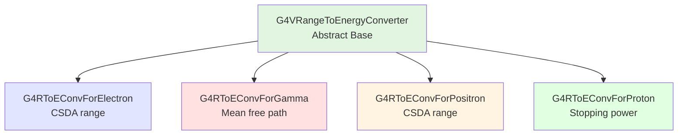

# G4VRangeToEnergyConverter API Documentation

## Overview

`G4VRangeToEnergyConverter` is the abstract base class for converting range cuts (distance) to energy cuts for different particle types. Each supported particle (gamma, e-, e+, proton) has a concrete converter class that implements the particle-specific physics for range-to-energy conversion.

::: tip Header Files
**Location:** `source/processes/cuts/include/G4VRangeToEnergyConverter.hh`
**Source:** `source/processes/cuts/src/G4VRangeToEnergyConverter.cc`
:::

## Purpose

The converter classes enable Geant4's range-based cut system by:

1. **Building Range Tables**: Computing particle range vs energy for each material
2. **Inverting Tables**: Converting user-specified range cuts to energy thresholds
3. **Material Adaptation**: Automatically adjusting energy cuts based on material density
4. **Physics Accuracy**: Using appropriate physics models per particle type

## Class Hierarchy



## Class Declaration

```cpp
class G4VRangeToEnergyConverter
{
public:
    explicit G4VRangeToEnergyConverter();
    virtual ~G4VRangeToEnergyConverter();

    // Conversion
    virtual G4double Convert(const G4double rangeCut,
                            const G4Material* material);

    // Energy range configuration (static)
    static void SetEnergyRange(const G4double lowedge,
                               const G4double highedge);
    static G4double GetLowEdgeEnergy();
    static G4double GetHighEdgeEnergy();
    static G4double GetMaxEnergyCut();
    static void SetMaxEnergyCut(const G4double value);

    // Particle type
    const G4ParticleDefinition* GetParticleType() const;

    // Verbosity
    void SetVerboseLevel(G4int value);
    G4int GetVerboseLevel() const;

protected:
    // Must be implemented by derived classes
    virtual G4double ComputeValue(const G4int Z,
                                  const G4double kinEnergy) = 0;

    const G4ParticleDefinition* theParticle = nullptr;
    G4int fPDG = 0;

private:
    // Energy binning (shared across all instances)
    static G4double sEmin;
    static G4double sEmax;
    static std::vector<G4double>* sEnergy;
    static G4int sNbinPerDecade;
    static G4int sNbin;

    G4int verboseLevel = 1;
    G4bool isFirstInstance = false;
};
```

## Constructor and Destructor

### Constructor
`source/processes/cuts/src/G4VRangeToEnergyConverter.cc:53-69`

```cpp
G4VRangeToEnergyConverter::G4VRangeToEnergyConverter()
{
  if (nullptr == sEnergy) {
    // Thread-safe initialization of shared energy grid
    isFirstInstance = true;
  }
  if (isFirstInstance) {
    FillEnergyVector(CLHEP::keV, 10.0*CLHEP::GeV);
  }
}
```

**Behavior:**
- First instance initializes shared energy grid
- Energy grid shared across all converter instances
- Default energy range: 1 keV to 10 GeV

### Destructor
`source/processes/cuts/src/G4VRangeToEnergyConverter.cc:72-81`

```cpp
G4VRangeToEnergyConverter::~G4VRangeToEnergyConverter()
{
  if (isFirstInstance) {
    delete sEnergy;
    sEnergy = nullptr;
    sEmin = CLHEP::keV;
    sEmax = 10.*CLHEP::GeV;
  }
}
```

## Primary Conversion Method

### Convert()
`source/processes/cuts/include/G4VRangeToEnergyConverter.hh:61`
`source/processes/cuts/src/G4VRangeToEnergyConverter.cc:84-116`

```cpp
virtual G4double Convert(const G4double rangeCut,
                        const G4Material* material);
```

**Parameters:**
- `rangeCut`: Range cut value in distance units (typically mm)
- `material`: Material in which range is specified

**Returns:**
- Corresponding energy cut
- Clamped to `[sEmin, sEmax]` range

**Process:**
1. Calls particle-specific conversion method
2. Applies low-energy corrections for charged particles
3. Clamps result to valid energy range

**Example:**
```cpp
G4RToEConvForElectron* converter = new G4RToEConvForElectron();

const G4Material* silicon =
    G4NistManager::Instance()->FindOrBuildMaterial("G4_Si");

G4double rangeCut = 100*um;
G4double energyCut = converter->Convert(rangeCut, silicon);

G4cout << "100 um in Si -> " << energyCut/keV << " keV" << G4endl;
```

**Low-Energy Correction:**
`source/processes/cuts/src/G4VRangeToEnergyConverter.cc:105-111`

For charged particles below 30 keV, applies density-dependent correction to improve accuracy:

```cpp
const G4double tune = 0.025*mm*g/cm3;
const G4double lowen = 30.*keV;

if (cut < lowen) {
    cut /= (1.+(1.-cut/lowen)*tune/(rangeCut*material->GetDensity()));
}
```

## Energy Range Configuration

### SetEnergyRange()
`source/processes/cuts/include/G4VRangeToEnergyConverter.hh:65-66`
`source/processes/cuts/src/G4VRangeToEnergyConverter.cc:119-127`

```cpp
static void SetEnergyRange(const G4double lowedge,
                          const G4double highedge);
```

**Parameters:**
- `lowedge`: Minimum energy for conversion tables
- `highedge`: Maximum energy (capped at 10 GeV)

**Purpose:** Sets energy range for all converters globally.

**Example:**
```cpp
// Extend for high-energy applications
G4VRangeToEnergyConverter::SetEnergyRange(1*keV, 100*GeV);
// Note: Max is capped at 10 GeV internally

// For low-energy studies
G4VRangeToEnergyConverter::SetEnergyRange(100*eV, 1*GeV);
```

::: tip Static Method
This is a static method affecting ALL converter instances globally. Call before creating any converters.
:::

### GetLowEdgeEnergy() / GetHighEdgeEnergy()
`source/processes/cuts/include/G4VRangeToEnergyConverter.hh:68-69`
`source/processes/cuts/src/G4VRangeToEnergyConverter.cc:130-138`

```cpp
static G4double GetLowEdgeEnergy();
static G4double GetHighEdgeEnergy();
```

**Returns:** Current energy range limits

**Default Values:**
- `sEmin = 1 keV` (G4VRangeToEnergyConverter.cc:44)
- `sEmax = 10 GeV` (G4VRangeToEnergyConverter.cc:45)

### SetMaxEnergyCut() / GetMaxEnergyCut()
`source/processes/cuts/include/G4VRangeToEnergyConverter.hh:72-74`
`source/processes/cuts/src/G4VRangeToEnergyConverter.cc:142-151`

```cpp
static void SetMaxEnergyCut(const G4double value);
static G4double GetMaxEnergyCut();
```

**Purpose:** Set maximum allowed energy cut (no validation)

## Particle Type Access

### GetParticleType()
`source/processes/cuts/include/G4VRangeToEnergyConverter.hh:77`
`source/processes/cuts/include/G4VRangeToEnergyConverter.hh:137-140`

```cpp
inline const G4ParticleDefinition* GetParticleType() const;
```

**Returns:** Pointer to particle definition for this converter

**Example:**
```cpp
G4RToEConvForElectron* electronConverter = new G4RToEConvForElectron();

const G4ParticleDefinition* particle = electronConverter->GetParticleType();
G4cout << "Converter for: " << particle->GetParticleName() << G4endl;
// Output: "Converter for: e-"
```

## Verbosity Control

### SetVerboseLevel() / GetVerboseLevel()
`source/processes/cuts/include/G4VRangeToEnergyConverter.hh:79-84`
`source/processes/cuts/include/G4VRangeToEnergyConverter.hh:124-134`

```cpp
inline void SetVerboseLevel(G4int value);
inline G4int GetVerboseLevel() const;
```

**Verbose Levels:**
- **0**: Silent
- **1**: Warning messages (default)
- **2**: Detailed information

**Example:**
```cpp
converter->SetVerboseLevel(2);
G4double energy = converter->Convert(1*mm, material);
// Will print detailed conversion information
```

## Protected Interface (for Derived Classes)

### ComputeValue() [Pure Virtual]
`source/processes/cuts/include/G4VRangeToEnergyConverter.hh:88`

```cpp
virtual G4double ComputeValue(const G4int Z,
                              const G4double kinEnergy) = 0;
```

**Purpose:** Compute range for given atomic number and kinetic energy

**Must be implemented by:** All concrete converter classes

**Parameters:**
- `Z`: Atomic number
- `kinEnergy`: Kinetic energy

**Returns:** Range in internal units (mm)

**Implementation Examples:**

**Electrons/Positrons:** Use CSDA (Continuous Slowing Down Approximation) range
**Photons:** Use mean free path based on total cross-section
**Protons:** Integrate stopping power

## Energy Grid

### Static Energy Grid Parameters
`source/processes/cuts/src/G4VRangeToEnergyConverter.cc:44-50`

```cpp
G4double G4VRangeToEnergyConverter::sEmin = CLHEP::keV;
G4double G4VRangeToEnergyConverter::sEmax = 10.*CLHEP::GeV;
std::vector<G4double>* G4VRangeToEnergyConverter::sEnergy = nullptr;
G4int G4VRangeToEnergyConverter::sNbinPerDecade = 50;
G4int G4VRangeToEnergyConverter::sNbin = 350;
```

**Grid Properties:**
- **Total bins**: 350 (sNbin)
- **Binning**: 50 bins per decade (sNbinPerDecade)
- **Range**: 1 keV to 10 GeV (7 decades)
- **Logarithmic spacing**: Equal spacing in log(E)

## Concrete Converter Classes

### G4RToEConvForElectron
**Purpose:** Electron range-to-energy conversion using CSDA range

**Physics:** Integrates ionization stopping power to compute range

**Header:** `G4RToEConvForElectron.hh`

**Usage:**
```cpp
G4RToEConvForElectron* electronConv = new G4RToEConvForElectron();
G4double eCut = electronConv->Convert(1*mm, material);
```

### G4RToEConvForGamma
**Purpose:** Photon range-to-energy conversion using mean free path

**Physics:** Uses total cross-section (Compton + photoelectric + pair production)

**Header:** `G4RToEConvForGamma.hh`

**Note:** For photons, "range" is actually mean free path, not CSDA range

### G4RToEConvForPositron
**Purpose:** Positron range-to-energy conversion using CSDA range

**Physics:** Similar to electrons but with positron-specific processes

**Header:** `G4RToEConvForPositron.hh`

### G4RToEConvForProton
**Purpose:** Proton range-to-energy conversion using stopping power

**Physics:** Integrates proton stopping power in matter

**Header:** `G4RToEConvForProton.hh`

**Special:** Overrides `Convert()` method with proton-specific implementation

## Usage Examples

### Basic Conversion

```cpp
// Create converter for electrons
G4VRangeToEnergyConverter* converter = new G4RToEConvForElectron();

// Convert 1 mm range in water
const G4Material* water =
    G4NistManager::Instance()->FindOrBuildMaterial("G4_WATER");

G4double rangeCut = 1.0*mm;
G4double energyCut = converter->Convert(rangeCut, water);

G4cout << "1 mm in water = " << energyCut/keV << " keV for e-" << G4endl;
```

### Comparing Particles

```cpp
std::vector<G4VRangeToEnergyConverter*> converters;
converters.push_back(new G4RToEConvForGamma());
converters.push_back(new G4RToEConvForElectron());
converters.push_back(new G4RToEConvForPositron());
converters.push_back(new G4RToEConvForProton());

const G4Material* silicon =
    G4NistManager::Instance()->FindOrBuildMaterial("G4_Si");
G4double rangeCut = 100*um;

for (auto* conv : converters) {
    G4double energyCut = conv->Convert(rangeCut, silicon);
    G4cout << conv->GetParticleType()->GetParticleName() << ": "
           << energyCut/keV << " keV" << G4endl;
}

// Output example:
// gamma: 15 keV
// e-: 250 keV
// e+: 245 keV
// proton: 4200 keV
```

### Material Dependence

```cpp
G4RToEConvForElectron* electronConv = new G4RToEConvForElectron();
G4double rangeCut = 1.0*mm;

std::vector<G4String> materials = {"G4_AIR", "G4_WATER", "G4_Si", "G4_Pb"};

for (const auto& matName : materials) {
    const G4Material* material =
        G4NistManager::Instance()->FindOrBuildMaterial(matName);

    G4double energyCut = electronConv->Convert(rangeCut, material);

    G4cout << matName << " (density " << material->GetDensity()/(g/cm3)
           << " g/cm3): " << energyCut/keV << " keV" << G4endl;
}

// Output shows denser materials require higher energy for same range:
// G4_AIR (0.0012 g/cm3): 10 keV
// G4_WATER (1.0 g/cm3): 200 keV
// G4_Si (2.33 g/cm3): 350 keV
// G4_Pb (11.35 g/cm3): 500 keV
```

## Integration with ProductionCutsTable

The `G4ProductionCutsTable` maintains one converter instance per particle type:

```cpp
// Inside G4ProductionCutsTable
G4VRangeToEnergyConverter* converters[NumberOfG4CutIndex];

// Initialized with:
converters[idxG4GammaCut] = new G4RToEConvForGamma();
converters[idxG4ElectronCut] = new G4RToEConvForElectron();
converters[idxG4PositronCut] = new G4RToEConvForPositron();
converters[idxG4ProtonCut] = new G4RToEConvForProton();

// Used in conversion:
G4double energyCut = converters[particleIndex]->Convert(rangeCut, material);
```

## Performance Considerations

### Caching

Converters build range tables once and cache results:

- **First call per material**: Computes full range table
- **Subsequent calls**: Table lookup and interpolation
- **Shared data**: Energy grid shared across all instances

### Interpolation

Range-to-energy conversion uses linear interpolation:

`source/processes/cuts/include/G4VRangeToEnergyConverter.hh:142-147`

```cpp
inline G4double LiniearInterpolation(const G4double e1, const G4double e2,
                                     const G4double r1, const G4double r2,
                                     const G4double r)
{
  return (r1 == r2) ? e1 : e1 + (e2 - e1)*(r - r1)/(r2 - r1);
}
```

## Thread Safety

Converter classes use thread-safe initialization:

`source/processes/cuts/src/G4VRangeToEnergyConverter.cc:39-42`

```cpp
namespace {
  G4Mutex theREMutex = G4MUTEX_INITIALIZER;
}
```

- **Static data**: Protected by mutex during initialization
- **After initialization**: Read-only access (thread-safe)
- **Instances**: Can be shared across threads

## Common Patterns

### Pattern: Custom Energy Range

```cpp
// Set before creating converters
G4VRangeToEnergyConverter::SetEnergyRange(100*eV, 100*GeV);

// All subsequent converters use new range
G4RToEConvForElectron* conv = new G4RToEConvForElectron();
```

### Pattern: Verbose Debugging

```cpp
converter->SetVerboseLevel(3);

G4double energy = converter->Convert(1*mm, material);
// Prints detailed conversion steps, range table lookups, etc.
```

## Troubleshooting

### Issue: Unexpected Energy Cuts

**Check energy range:**
```cpp
G4cout << "Energy range: "
       << G4VRangeToEnergyConverter::GetLowEdgeEnergy()/eV << " eV to "
       << G4VRangeToEnergyConverter::GetHighEdgeEnergy()/GeV << " GeV"
       << G4endl;
```

### Issue: Inconsistent Conversions

**Verify material:**
```cpp
if (material == nullptr) {
    G4cout << "Null material passed to converter!" << G4endl;
}
```

## Related Classes

- [**G4ProductionCutsTable**](g4productioncutstable.md) - Uses converters for cut transformation
- [**G4ProductionCuts**](g4productioncuts.md) - Stores range cuts
- [**Concrete Converters**](g4rtoeconvforelectron.md) - Particle-specific implementations

## References

- Header: `source/processes/cuts/include/G4VRangeToEnergyConverter.hh`
- Source: `source/processes/cuts/src/G4VRangeToEnergyConverter.cc`
- [Cuts Module Overview](../index.md)

---

::: info API Version
**Geant4 Version:** 11.4.0.beta
**Last Updated:** 2025-11-17
**Status:** Complete API documentation
:::
