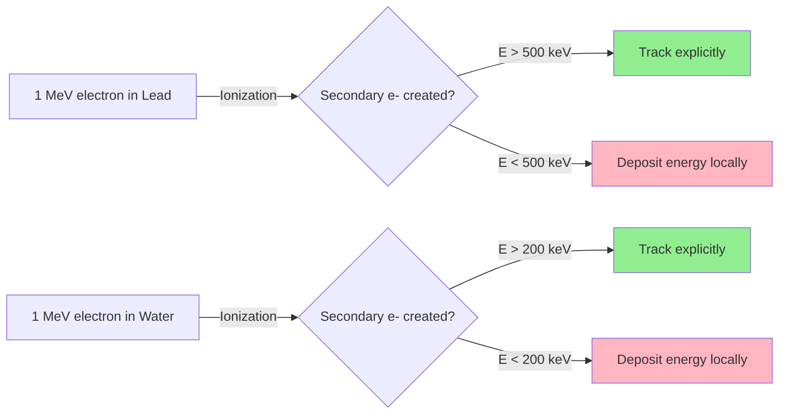
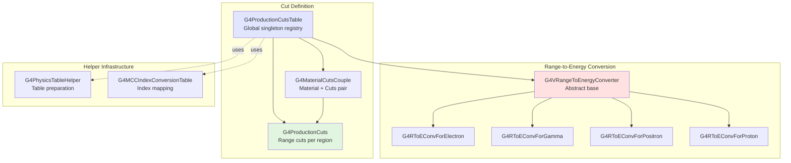
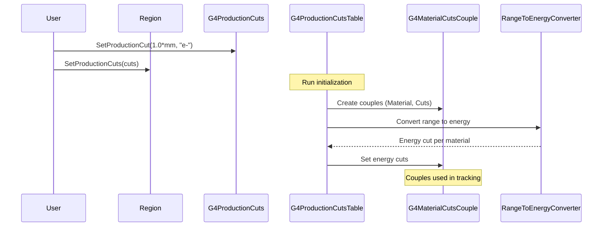
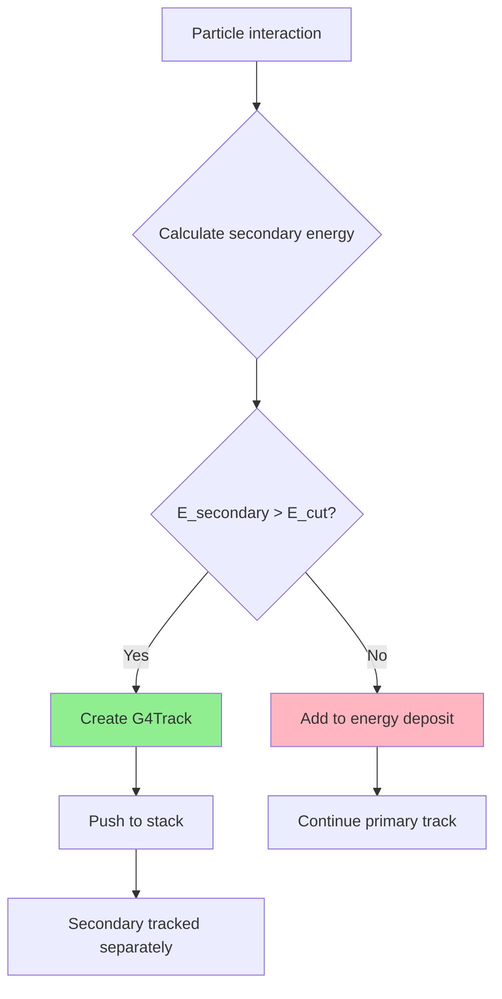

# Cuts Sub-Module

## Overview

The Cuts sub-module provides the infrastructure for managing production cuts (energy thresholds) in Geant4 simulations. Production cuts control when secondary particles are created versus absorbed into continuous energy loss, directly impacting simulation accuracy and performance. This module implements the range-based cut system where users specify cuts as tracking range (distance), which are then converted to energy thresholds material-by-material.

::: tip Module Location
**Source:** `source/processes/cuts/`
**Headers:** `source/processes/cuts/include/`
**Size:** 11 classes (11 headers, 11 source files)
:::

## Purpose and Scope

The Cuts module serves critical functions for simulation optimization:

- **Production Threshold Management**: Define energy thresholds for secondary particle creation
- **Range-Based Cuts**: Specify cuts in distance units (range) rather than energy for consistency
- **Material-Specific Conversion**: Automatically convert range cuts to energy cuts per material
- **Region-Based Cuts**: Apply different cut values to different detector regions
- **Physics Table Coupling**: Link cuts to material-cuts couples for efficient process lookup
- **Performance Optimization**: Balance simulation accuracy with computational speed
- **Memory Efficiency**: Minimize physics table storage through couple reuse

## Conceptual Foundation

### Production Cuts Explained

In Geant4, **production cuts** determine the threshold below which secondary particles are not explicitly created and tracked. Instead, their energy is deposited locally through continuous energy loss processes.

#### Why Production Cuts Matter

1. **Performance Impact**: Creating and tracking every low-energy secondary would make simulations prohibitively slow
2. **Physics Validity**: Below certain energies, particles travel very short distances before stopping
3. **Detector Relevance**: In many cases, very low-energy particles don't reach sensitive volumes
4. **Memory Efficiency**: Fewer tracks mean less memory consumption

#### Range vs Energy Cuts

Geant4 uses **range cuts** (specified in distance units like mm) rather than direct energy cuts:

```
Range Cut (1 mm) --> Energy Cut depends on material
  - In Lead (dense):     ~500 keV for electrons
  - In Water (light):    ~200 keV for electrons
  - In Air (very light): ~10 keV for electrons
```

**Advantages of range-based cuts:**
- **Physical intuition**: "Don't track particles that travel less than 1 mm"
- **Material independence**: Same range cut adapts to different materials
- **Consistency**: Uniform tracking resolution across detector
- **User-friendly**: Easier to reason about detector geometry

### Cut Application Example



## Architecture

### Class Hierarchy



### Data Flow



## Key Classes

### Core Cut Management

| Class | Purpose | Header |
|-------|---------|--------|
| [**G4ProductionCuts**](api/g4productioncuts.md) | Container for range cuts (gamma, e-, e+, proton) per region | `G4ProductionCuts.hh` |
| [**G4ProductionCutsTable**](api/g4productioncutstable.md) | Singleton managing all cuts and material-cuts couples | `G4ProductionCutsTable.hh` |
| [**G4MaterialCutsCouple**](api/g4materialcutscouple.md) | Pairs material with production cuts for physics table indexing | `G4MaterialCutsCouple.hh` |

### Range-to-Energy Conversion

| Class | Purpose | Header |
|-------|---------|--------|
| [**G4VRangeToEnergyConverter**](api/g4vrangetoenergyconverter.md) | Abstract base for range-to-energy conversion | `G4VRangeToEnergyConverter.hh` |
| [**G4RToEConvForElectron**](api/g4rtoeconvforelectron.md) | Electron range conversion using ionization tables | `G4RToEConvForElectron.hh` |
| [**G4RToEConvForGamma**](api/g4rtoeconvforgamma.md) | Gamma range conversion (mean free path based) | `G4RToEConvForGamma.hh` |
| [**G4RToEConvForPositron**](api/g4rtoeconvforpositron.md) | Positron range conversion using ionization tables | `G4RToEConvForPositron.hh` |
| [**G4RToEConvForProton**](api/g4rtoeconvforproton.md) | Proton range conversion using stopping power | `G4RToEConvForProton.hh` |

### Helper Classes

| Class | Purpose | Header |
|-------|---------|--------|
| **G4PhysicsTableHelper** | Utility for physics table preparation and retrieval | `G4PhysicsTableHelper.hh` |
| **G4MCCIndexConversionTable** | Maps stored MCC indices to runtime indices | `G4MCCIndexConversionTable.hh` |

## Production Cut Types

Geant4 supports production cuts for four particle types, defined by `G4ProductionCutsIndex` enumeration:

```cpp
enum G4ProductionCutsIndex
{
  idxG4GammaCut = 0,      // Photon production threshold
  idxG4ElectronCut,       // Electron production threshold
  idxG4PositronCut,       // Positron production threshold
  idxG4ProtonCut,         // Proton production threshold
  NumberOfG4CutIndex = 4
};
```

### Cut Meanings by Particle

- **Gamma (idxG4GammaCut)**: Minimum energy for secondary photons (from bremsstrahlung, annihilation)
- **Electron (idxG4ElectronCut)**: Minimum energy for secondary electrons (delta rays from ionization)
- **Positron (idxG4PositronCut)**: Minimum energy for secondary positrons (pair production)
- **Proton (idxG4ProtonCut)**: Minimum energy for secondary protons (nuclear reactions)

::: warning Limited Particle Support
Production cuts apply **only** to gamma, e-, e+, and proton. Other particles (muons, pions, etc.) do not use production cuts. Attempting to set cuts for other particles has no effect.
:::

## Range-to-Energy Conversion

### Conversion Process

The range-to-energy conversion is material-dependent and uses physics tables:

1. **Build Range Table**: For each material, calculate range vs energy using:
   - **Electrons/Positrons**: CSDA (Continuous Slowing Down Approximation) range from ionization
   - **Photons**: Mean free path from total cross-section (Compton + photoelectric + pair production)
   - **Protons**: Stopping power integration

2. **Invert Table**: Given range cut (e.g., 1 mm), find corresponding energy cut by interpolation

3. **Store Energy Cuts**: Energy cuts stored in `G4ProductionCutsTable` for fast lookup

### Energy Range

Default energy range for conversion:
- **Lower edge**: 1 keV (G4VRangeToEnergyConverter.cc:44)
- **Upper edge**: 10 GeV (G4VRangeToEnergyConverter.cc:45)
- **Binning**: 50 bins per decade (G4VRangeToEnergyConverter.cc:49)
- **Total bins**: 350 (G4VRangeToEnergyConverter.cc:50)

Users can modify energy range:
```cpp
G4ProductionCutsTable::GetProductionCutsTable()
    ->SetEnergyRange(100*eV, 100*GeV);
```

### Conversion Example

For 1 mm range cut in different materials:

| Material | Density (g/cm³) | Electron Energy Cut | Gamma Energy Cut |
|----------|-----------------|---------------------|------------------|
| Air      | 0.001           | ~10 keV             | ~1 keV           |
| Water    | 1.0             | ~200 keV            | ~20 keV          |
| Silicon  | 2.33            | ~350 keV            | ~40 keV          |
| Lead     | 11.35           | ~500 keV            | ~100 keV         |

::: tip Physical Insight
Denser materials require higher energy cuts for the same range because particles lose energy faster through increased interaction probability.
:::

## Material-Cuts Coupling

### The Couple Concept

`G4MaterialCutsCouple` objects uniquely identify (Material, ProductionCuts) pairs:

```
Example Detector:
  Region "Tracker"  → Cuts: e-=0.1mm, γ=0.1mm
  Region "Calorimeter" → Cuts: e-=1.0mm, γ=10mm

Materials:
  Silicon, Lead, Air

Material-Cuts Couples:
  [0] Silicon + Tracker Cuts
  [1] Lead + Calorimeter Cuts
  [2] Air + Tracker Cuts
  [3] Air + Calorimeter Cuts
```

### Why Couples?

Physics processes use couples as indices into physics tables:

```cpp
// In a process
G4int coupleIndex = materialCutsCouple->GetIndex();
G4double crossSection = (*theCrossSectionTable)[coupleIndex]->Value(energy);
```

**Benefits:**
- **Efficient lookup**: Single index retrieves all physics data
- **Table organization**: One physics vector per couple
- **Memory sharing**: Same material with different cuts = different couples, but share base data
- **Update tracking**: Couple knows if physics tables need recalculation

## Usage Patterns

### Setting Default Cuts

```cpp
// In your physics list
void MyPhysicsList::SetCuts()
{
    // Default range cut for all particles
    defaultCutValue = 1.0*mm;
    SetCutValue(defaultCutValue, "gamma");
    SetCutValue(defaultCutValue, "e-");
    SetCutValue(defaultCutValue, "e+");
    SetCutValue(defaultCutValue, "proton");
}
```

### Region-Specific Cuts

```cpp
// Create region with custom cuts
G4Region* detectorRegion = new G4Region("DetectorRegion");
logicalDetector->SetRegion(detectorRegion);
detectorRegion->AddRootLogicalVolume(logicalDetector);

// Create and configure production cuts
G4ProductionCuts* cuts = new G4ProductionCuts();
cuts->SetProductionCut(0.1*mm, "gamma");    // Fine gamma tracking
cuts->SetProductionCut(0.05*mm, "e-");      // Very fine electron tracking
cuts->SetProductionCut(0.05*mm, "e+");      // Very fine positron tracking
cuts->SetProductionCut(1.0*mm, "proton");   // Standard proton tracking

// Assign to region
detectorRegion->SetProductionCuts(cuts);
```

### Different Cuts for Different Regions

```cpp
// Sensitive detector: low cuts (high accuracy)
G4Region* trackerRegion = new G4Region("Tracker");
G4ProductionCuts* trackerCuts = new G4ProductionCuts();
trackerCuts->SetProductionCut(0.01*mm);  // 10 micron cut for all particles
trackerRegion->SetProductionCuts(trackerCuts);

// Shielding: high cuts (fast simulation)
G4Region* shieldRegion = new G4Region("Shield");
G4ProductionCuts* shieldCuts = new G4ProductionCuts();
shieldCuts->SetProductionCut(10*cm);  // 10 cm cut for all particles
shieldRegion->SetProductionCuts(shieldCuts);

// Calorimeter: medium cuts (balanced)
G4Region* caloRegion = new G4Region("Calorimeter");
G4ProductionCuts* caloCuts = new G4ProductionCuts();
caloCuts->SetProductionCut(5*mm);  // 5 mm cut for all particles
caloRegion->SetProductionCuts(caloCuts);
```

### Programmatic Cut Access

```cpp
// Get production cuts table
G4ProductionCutsTable* cutsTable =
    G4ProductionCutsTable::GetProductionCutsTable();

// Get default cuts
G4ProductionCuts* defaultCuts = cutsTable->GetDefaultProductionCuts();
G4double electronCut = defaultCuts->GetProductionCut("e-");

// Iterate over all couples
G4int nCouples = cutsTable->GetTableSize();
for (G4int i = 0; i < nCouples; ++i) {
    const G4MaterialCutsCouple* couple = cutsTable->GetMaterialCutsCouple(i);
    const G4Material* material = couple->GetMaterial();
    G4ProductionCuts* cuts = couple->GetProductionCuts();

    G4cout << "Couple " << i << ": "
           << material->GetName() << ", "
           << "e- cut = " << cuts->GetProductionCut("e-")/mm << " mm"
           << G4endl;
}
```

### Converting Range to Energy

```cpp
// Manual range-to-energy conversion
G4ProductionCutsTable* cutsTable =
    G4ProductionCutsTable::GetProductionCutsTable();

G4double rangeCut = 1.0*mm;
const G4Material* silicon =
    G4NistManager::Instance()->FindOrBuildMaterial("G4_Si");
const G4ParticleDefinition* electron = G4Electron::Definition();

G4double energyCut = cutsTable->ConvertRangeToEnergy(
    electron, silicon, rangeCut);

G4cout << "1 mm range in Silicon = "
       << energyCut/keV << " keV energy cut for electrons" << G4endl;
```

## Performance Implications

### Cut Value Selection Strategy

The choice of production cuts critically affects simulation performance:

| Cut Value | Track Count | Accuracy | Speed | Recommended For |
|-----------|-------------|----------|-------|-----------------|
| 10 μm     | Very High   | Excellent| Slow  | Micro-dosimetry, nano-structures |
| 100 μm    | High        | Very Good| Moderate | Tracking detectors (silicon) |
| 1 mm      | Medium      | Good     | Fast  | General purpose (default) |
| 1 cm      | Low         | Reduced  | Very Fast | Calorimeters, shielding |
| 10 cm     | Very Low    | Limited  | Fastest | Bulk shielding, air volumes |

### Performance Scaling

Simulation time scales roughly as `1 / (cut_value)^2` for EM processes:

```
Cut Value    Relative Tracks    Relative Time
  0.01 mm         10,000×              ~500×
  0.1 mm           1,000×              ~100×
  1 mm (ref)           1×                1×
  10 mm              0.1×              0.2×
  100 mm            0.01×             0.05×
```

### Region-Based Optimization

**Best Practice**: Use fine cuts only where needed

```cpp
// GOOD: Fine cuts in tracker, coarse elsewhere
trackerRegion->SetProductionCuts(0.01*mm);  // Sensitive
caloRegion->SetProductionCuts(5*mm);        // Less critical
shieldRegion->SetProductionCuts(10*cm);     // Just absorption

// BAD: Fine cuts everywhere
SetCutValue(0.01*mm, "gamma");  // Slow!
```

**Example Performance Gain**:
- All regions at 0.01 mm: 1000 seconds
- Tracker at 0.01 mm, calo at 1 mm, shield at 10 cm: 100 seconds (10× faster!)

### Memory Considerations

Each unique (Material, Cuts) couple requires:
- Physics table entries for all processes
- Range and energy cut vectors
- Cross-section tables

**Memory optimization**:
```cpp
// GOOD: Share cuts across similar regions
G4ProductionCuts* generalCuts = new G4ProductionCuts();
region1->SetProductionCuts(generalCuts);
region2->SetProductionCuts(generalCuts);  // Reuses same cuts object

// LESS EFFICIENT: Duplicate cuts
region1->SetProductionCuts(new G4ProductionCuts(1*mm));
region2->SetProductionCuts(new G4ProductionCuts(1*mm));  // Different objects!
```

## Advanced Features

### Storing and Retrieving Cuts

Cuts can be persisted to files for faster initialization:

```cpp
G4ProductionCutsTable* cutsTable =
    G4ProductionCutsTable::GetProductionCutsTable();

// Store cuts and material info
cutsTable->StoreCutsTable("./cutdata", false);  // Binary format
// or
cutsTable->StoreCutsTable("./cutdata", true);   // ASCII format

// Retrieve in subsequent runs
if (cutsTable->CheckForRetrieveCutsTable("./cutdata", false)) {
    cutsTable->RetrieveCutsTable("./cutdata", false);
    // Physics tables rebuilt from stored data
}
```

**Benefits**:
- Faster initialization (skip range-to-energy conversion)
- Reproducibility across runs
- Useful for large geometries with many couples

### Setting Energy Cuts Directly

While discouraged, you can set energy cuts directly:

```cpp
G4ProductionCutsTable* cutsTable =
    G4ProductionCutsTable::GetProductionCutsTable();

std::vector<G4double> energyCuts;
energyCuts.push_back(10*keV);  // Gamma
energyCuts.push_back(100*keV); // Electron
energyCuts.push_back(100*keV); // Positron
energyCuts.push_back(1*MeV);   // Proton

cutsTable->SetEnergyCutVector(energyCuts, coupleIndex);
```

::: warning Range Cuts Preferred
Directly setting energy cuts bypasses material-dependent conversion and can lead to inconsistent tracking resolution across materials. Use range cuts unless you have a specific reason.
:::

### Verbose Output

```cpp
G4ProductionCutsTable* cutsTable =
    G4ProductionCutsTable::GetProductionCutsTable();

cutsTable->SetVerboseLevel(2);
// 0: Silent
// 1: Warning messages
// 2: Detailed information

cutsTable->DumpCouples();  // Print all couples
```

## Integration with Physics Processes

### How Processes Use Cuts

EM processes query cuts via the material-cuts couple:

```cpp
// Inside a process (e.g., G4eIonisation)
const G4MaterialCutsCouple* couple = track.GetMaterialCutsCouple();
G4int idx = couple->GetIndex();

// Get energy cut for this couple
G4double energyCut = (*energyCutTable)[idx][idxG4ElectronCut];

// Only create secondary if E > energyCut
if (secondaryEnergy > energyCut) {
    // Create and track secondary
} else {
    // Deposit energy locally
}
```

### Secondary Production Logic



### Cut Update and Physics Tables

When cuts change, physics tables must be rebuilt:

```cpp
// Modify cuts
region->GetProductionCuts()->SetProductionCut(0.5*mm, "e-");

// Run manager detects changes
G4RunManager* runManager = G4RunManager::GetRunManager();
runManager->PhysicsHasBeenModified();  // Triggers table rebuild

// Internally:
// - G4ProductionCutsTable::IsModified() returns true
// - All processes rebuild their physics tables
// - Couples marked as needing recalculation
```

## Common Patterns and Best Practices

### Pattern 1: Geometry-Driven Cuts

```cpp
// Define cuts based on geometry hierarchy
void SetupCuts(G4LogicalVolume* worldLV) {
    // World: very coarse
    G4Region* worldRegion = new G4Region("World");
    worldRegion->AddRootLogicalVolume(worldLV);
    G4ProductionCuts* worldCuts = new G4ProductionCuts();
    worldCuts->SetProductionCut(1*m);
    worldRegion->SetProductionCuts(worldCuts);

    // Detectors: fine
    // (handled separately for each detector volume)
}
```

### Pattern 2: Energy-Dependent Cuts

```cpp
// For studies requiring energy-dependent resolution
void AdaptiveCuts(G4double particleEnergy) {
    if (particleEnergy < 10*MeV) {
        cuts->SetProductionCut(0.1*mm);  // Fine for low energy
    } else if (particleEnergy < 100*MeV) {
        cuts->SetProductionCut(1*mm);    // Medium for moderate energy
    } else {
        cuts->SetProductionCut(10*mm);   // Coarse for high energy
    }
}
```

### Pattern 3: Material-Specific Cuts

```cpp
// Different cuts for different materials in same region
// Requires creating separate regions per material
void MaterialSpecificCuts() {
    // Silicon detectors: very fine
    G4Region* siRegion = new G4Region("Silicon");
    siLogical->SetRegion(siRegion);
    G4ProductionCuts* siCuts = new G4ProductionCuts();
    siCuts->SetProductionCut(0.01*mm);
    siRegion->SetProductionCuts(siCuts);

    // Aluminum support: coarse
    G4Region* alRegion = new G4Region("Aluminum");
    alLogical->SetRegion(alRegion);
    G4ProductionCuts* alCuts = new G4ProductionCuts();
    alCuts->SetProductionCut(1*cm);
    alRegion->SetProductionCuts(alCuts);
}
```

### Best Practices Summary

1. **Use Range Cuts**: Always specify cuts as range (mm), not energy (keV)
2. **Regional Optimization**: Fine cuts in sensitive volumes, coarse in bulk
3. **Material Awareness**: Remember same range = different energies in different materials
4. **Default First**: Start with 1 mm default, optimize as needed
5. **Measure Impact**: Profile your simulation to understand cut effects
6. **Validate Physics**: Ensure cuts don't compromise required physics accuracy
7. **Document Choices**: Record cut values and rationale in code comments

## Troubleshooting

### Common Issues

**Issue**: Simulation very slow
```cpp
// Check if cuts are too low
G4ProductionCutsTable::GetProductionCutsTable()->DumpCouples();
// Look for cuts < 0.1 mm in large volumes
```

**Issue**: Missing energy deposition
```cpp
// Cuts may be too high, secondaries absorbed
// Lower cuts in sensitive regions
detectorRegion->GetProductionCuts()->SetProductionCut(0.1*mm);
```

**Issue**: Inconsistent results across materials
```cpp
// Ensure using range cuts, not energy cuts
// Range cuts automatically adapt to material density
cuts->SetProductionCut(1.0*mm, "e-");  // GOOD: range
// NOT: SetEnergyCutVector()  // BAD: material-independent
```

**Issue**: Memory consumption high
```cpp
// Too many unique couples
// Consolidate regions with same cuts
// Reuse G4ProductionCuts objects where possible
```

## Thread Safety

The Cuts module is designed for multi-threaded simulations:

- **Shared Read-Only**: `G4ProductionCutsTable` is shared across threads
- **Thread-Local**: None (all data is const during event processing)
- **Initialization**: Cuts must be finalized before worker threads start
- **Modification**: Cut changes require re-initialization (single-threaded)

## Related Documentation

- [**Processes Module Overview**](../) - Parent module documentation
- [**Materials Module**](../../materials/) - Materials used in cut conversion
- [**Particles Module**](../../particles/) - Particle definitions for cuts
- [**Electromagnetic Processes**](../electromagnetic/) - Processes using production cuts
- [**Run Module**](../../run/) - Run manager coordinates cut initialization

## API Documentation

Detailed class-by-class API documentation:

- [**G4ProductionCuts**](api/g4productioncuts.md) - Cut value container
- [**G4ProductionCutsTable**](api/g4productioncutstable.md) - Global cuts manager
- [**G4MaterialCutsCouple**](api/g4materialcutscouple.md) - Material-cuts pairing
- [**G4VRangeToEnergyConverter**](api/g4vrangetoenergyconverter.md) - Conversion base class
- [**Concrete Converters**](api/g4rtoeconvforelectron.md) - Particle-specific implementations

## Module Statistics

| Metric | Value | Notes |
|--------|-------|-------|
| Total Classes | 11 | Complete cuts infrastructure |
| Header Files | 11 | One per class |
| Source Files | 11 | Full implementations |
| Supported Particles | 4 | gamma, e-, e+, proton |
| Default Cut Range | 1 keV - 10 GeV | Configurable |
| Energy Bins | 350 | 50 per decade |

## Historical Notes

- **Geant4 5.0**: Introduction of range-based cuts system
- **Geant4 7.0**: Added proton production cuts
- **Geant4 8.0**: Improved range-to-energy converter accuracy
- **Geant4 9.0**: Multi-threading support preparation
- **Geant4 10.0**: Full MT support with shared tables
- **Geant4 11.0**: Enhanced performance for large geometries

---

::: tip Next Steps
- Review [**G4ProductionCuts API**](api/g4productioncuts.md) to understand cut value management
- Explore [**G4ProductionCutsTable API**](api/g4productioncutstable.md) for global cut control
- See [**Performance Guide**](#performance-implications) for optimization strategies
- Check [**Usage Patterns**](#usage-patterns) for implementation examples
:::

---

::: info Last Updated
**Date:** 2025-11-17
**Geant4 Version:** 11.4.0.beta
**Author:** Claude Code Documentation System
**Status:** Comprehensive documentation complete
:::
