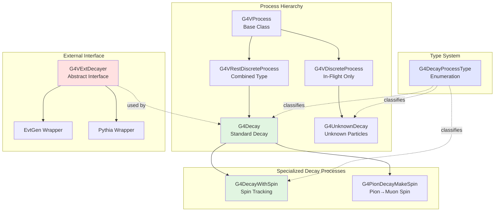
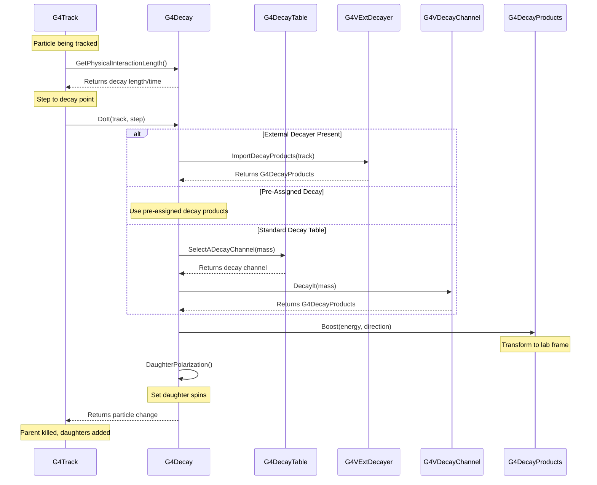

# Processes Decay Sub-Module

## Overview

The Decay sub-module provides the infrastructure for simulating particle decay processes in Geant4. It handles both stable and unstable particle decay, supporting decay in-flight and at-rest scenarios, polarization and spin effects, and integration with external decay libraries. This sub-module is essential for accurately simulating the decay of particles ranging from short-lived resonances to long-lived radioactive nuclei.

::: tip Module Location
**Source:** `source/processes/decay/`
**Headers:** `source/processes/decay/include/`
**Size:** 6 header files, 4 source files
:::

## Purpose

The Decay sub-module serves several critical functions:

- **Standard Decay Process**: Implementation of decay for all unstable particles
- **Spin-Dependent Decay**: Handling of polarization and spin precession in magnetic fields
- **External Decayer Interface**: Integration with specialized decay libraries (EvtGen, Pythia)
- **Decay Tables**: Management of branching ratios and decay channels
- **In-Flight and At-Rest Decay**: Support for both discrete and rest decay processes
- **Polarization Transfer**: Propagation of spin information to daughter particles

---

## Architecture

### Core Components



### Decay Execution Flow



---

## Key Concepts

### In-Flight vs At-Rest Decay

The decay module handles two fundamentally different decay scenarios:

#### **In-Flight Decay (PostStepDoIt)**

Occurs when a particle decays while moving. The decay process:

- Computes mean free path: `λ = cτβγ` where τ is proper lifetime
- Samples decay length along the particle trajectory
- Handles relativistic time dilation effects
- Boosts decay products from rest frame to lab frame

**Implementation**: Lines 87-90, 503-515 in `source/processes/decay/include/G4Decay.hh`

```cpp
virtual G4VParticleChange* PostStepDoIt(
    const G4Track& aTrack,
    const G4Step& aStep
) override;
```

**Mean Free Path Calculation**: Lines 128-169 in `source/processes/decay/src/G4Decay.cc`

The mean free path includes:
- Proper lifetime from particle definition
- Lorentz factor β = v/c
- Time dilation factor γ = 1/√(1-β²)

#### **At-Rest Decay (AtRestDoIt)**

Occurs when a particle stops and decays:

- Uses proper lifetime directly (no relativistic effects)
- Samples remainder lifetime from exponential distribution
- No Lorentz boost needed (decay in lab frame = rest frame)
- Common for muon decay, nuclear de-excitation

**Implementation**: Lines 92-95, 181-187 in `source/processes/decay/include/G4Decay.hh`

```cpp
virtual G4VParticleChange* AtRestDoIt(
    const G4Track& aTrack,
    const G4Step& aStep
) override;
```

**Physical Interaction Length**: Lines 473-490 in `source/processes/decay/src/G4Decay.cc`

### Decay Tables and Decay Channels

Particle decay is governed by decay tables that specify all possible decay modes:

#### **G4DecayTable**

Each unstable particle has a decay table containing:
- List of decay channels (G4VDecayChannel objects)
- Branching ratios for each channel
- Total width information for resonances

**Access**: Lines 200, 236-302 in `source/processes/decay/src/G4Decay.cc`

```cpp
G4DecayTable* decaytable = aParticleDef->GetDecayTable();
G4VDecayChannel* decaychannel = decaytable->SelectADecayChannel(massParent);
```

#### **Channel Selection**

The decay process selects a channel based on:
1. **Branching Ratios**: Probabilistic selection weighted by BR
2. **Kinematic Thresholds**: Channel must be energetically allowed
3. **Dynamic Mass**: For resonances, accounts for mass distribution

**Implementation**: Lines 236-302 in `source/processes/decay/src/G4Decay.cc`

Wide resonances can have dynamic mass below nominal mass, requiring kinematic checks:

```cpp
// Keep trying to choose a candidate decay channel if the dynamic mass
// of the decaying particle is below the sum of the PDG masses of the
// candidate daughter particles.
```

### External Decayers

For complex decay physics (e.g., B-mesons, charm hadrons), Geant4 can interface with specialized decay libraries:

#### **G4VExtDecayer Interface**

Abstract base class for external decayers:

**Declaration**: Lines 45-75 in `source/processes/decay/include/G4VExtDecayer.hh`

```cpp
class G4VExtDecayer {
public:
    virtual G4DecayProducts* ImportDecayProducts(
        const G4Track& aTrack
    ) = 0;
};
```

#### **Setting External Decayer**

**Method**: Lines 151-153, 493-501 in `source/processes/decay/include/G4Decay.hh` and `source/processes/decay/src/G4Decay.cc`

```cpp
void G4Decay::SetExtDecayer(G4VExtDecayer* val) {
    pExtDecayer = val;
    // Set process sub-type to external
    if (pExtDecayer != nullptr) {
        SetProcessSubType(static_cast<int>(DECAY_External));
    }
}
```

#### **External Decayer Execution**

**Implementation**: Lines 202-234 in `source/processes/decay/src/G4Decay.cc`

```cpp
G4bool isExtDecayer = (decaytable == nullptr) && (pExtDecayer != nullptr);

if (isExtDecayer) {
    // Decay according to external decayer
    products = pExtDecayer->ImportDecayProducts(aTrack);
}
```

#### **Common External Decayers**

1. **EvtGen**: Specialized for heavy flavor physics
   - Full angular correlations in B/D meson decays
   - CP violation effects
   - Time-dependent phenomena

2. **Pythia8**: General-purpose hadronization and decay
   - String fragmentation models
   - Multi-body resonance decays
   - QCD radiation in decays

### Spin and Polarization

#### **Polarization in Standard Decay**

The base G4Decay class provides a hook for daughter polarization:

**Declaration**: Lines 116-119 in `source/processes/decay/include/G4Decay.hh`

```cpp
virtual void DaughterPolarization(const G4Track& aTrack,
                                   G4DecayProducts* products);
```

**Default Implementation**: Lines 382-385 in `source/processes/decay/src/G4Decay.cc`

The base class has no implementation—derived classes override for specific physics.

#### **Spin Precession (G4DecayWithSpin)**

For particles decaying in magnetic fields, spin precession must be considered:

**AtRestDoIt Implementation**: Lines 109-184 in `source/processes/decay/src/G4DecayWithSpin.cc`

Key features:
1. **Initial Polarization**: Get or generate parent polarization
2. **Field Lookup**: Query electromagnetic field at decay point
3. **Spin Precession**: Calculate rotation during lifetime
4. **Channel Setting**: Propagate polarization to decay channels

**Precession Calculation**: Lines 186-223 in `source/processes/decay/src/G4DecayWithSpin.cc`

```cpp
G4ThreeVector Spin_Precession(const G4Step& aStep,
                               G4ThreeVector B,
                               G4double deltatime)
{
    G4double Bnorm = std::sqrt(sqr(B[0]) + sqr(B[1]) + sqr(B[2]));
    G4double q = aStep.GetTrack()->GetDefinition()->GetPDGCharge();
    G4double a = 1.165922e-3;  // muon anomalous magnetic moment
    G4double s_omega = 8.5062e+7*rad/(s*kilogauss);

    G4double omega = -(q*s_omega)*(1.+a) * Bnorm;
    G4double rotationangle = deltatime * omega;

    G4Transform3D SpinRotation = G4Rotate3D(rotationangle, B.unit());
    // ... apply rotation to spin vector
}
```

#### **Pion Decay Polarization (G4PionDecayMakeSpin)**

Specialized for π/K → μν decays to correctly set muon polarization:

**Implementation**: Lines 48-148 in `source/processes/decay/src/G4PionDecayMakeSpin.cc`

The muon spin is calculated from:
- Parent pion/kaon properties
- Muon and neutrino four-momenta
- V-A weak interaction structure

**Formula**: Lines 126-136 in `source/processes/decay/src/G4PionDecayMakeSpin.cc`

```cpp
// For two-body decay (π/K → μν)
G4double scale = -(eneutrino - (p_muon * p_neutrino)/(emu+emmu));
p_muon = scale * p_muon;
p_neutrino = emmu * p_neutrino;
spin = p_muon + p_neutrino;

scale = 2./(amass*amass - emmu*emmu);
spin = scale * spin;

if (aParticle->GetCharge() < 0.0) spin = -spin;
```

### Pre-Assigned Decay Products

For specialized applications, decay products can be pre-assigned:

**Check**: Lines 194-231 in `source/processes/decay/src/G4Decay.cc`

```cpp
const G4DecayProducts* o_products =
    aParticle->GetPreAssignedDecayProducts();
G4bool isPreAssigned = (o_products != nullptr);

if (isPreAssigned) {
    // Copy decay products
    products = new G4DecayProducts(*o_products);
}
```

This mechanism allows:
- Custom decay implementations
- Fixed decay products for testing
- Event generator integration

---

## Key Classes

### Core Decay Processes

#### [G4Decay](./api/g4decay.md)
**Standard particle decay process**

The main decay process class handling both in-flight and at-rest decay:
- Inherits from G4VRestDiscreteProcess (both PostStep and AtRest)
- Manages decay tables and channel selection
- Supports external decayers
- Handles Lorentz boosts to laboratory frame
- Base class for specialized decay processes

**File**: `source/processes/decay/include/G4Decay.hh`

#### [G4DecayWithSpin](./api/g4decaywithspin.md)
**Spin-dependent decay with magnetic field effects**

Extends G4Decay to include spin precession:
- Calculates spin rotation in magnetic fields
- Propagates polarization through decay
- Essential for muon decay physics
- Implements g-2 precession formula

**File**: `source/processes/decay/include/G4DecayWithSpin.hh`

#### [G4UnknownDecay](./api/g4unknowndecay.md)
**Decay process for unknown particles**

Special decay process for unknown/generic particles:
- Only PostStepDoIt (no AtRest)
- Uses pre-assigned decay time
- Simpler than standard decay
- For exotic or hypothetical particles

**File**: `source/processes/decay/include/G4UnknownDecay.hh`

#### [G4PionDecayMakeSpin](./api/g4piondecaymakespin.md)
**Pion/kaon decay with correct muon polarization**

Specialized for meson decays producing muons:
- Handles π→μν, K→μν decays
- Calculates muon spin from V-A structure
- Correctly implements helicity in weak decays
- Critical for muon physics experiments

**File**: `source/processes/decay/include/G4PionDecayMakeSpin.hh`

### External Decayer Interface

#### [G4VExtDecayer](./api/g4vextdecayer.md)
**Abstract interface for external decay libraries**

Base class for interfacing with external decay generators:
- Pure virtual ImportDecayProducts method
- Used by EvtGen, Pythia wrappers
- Provides G4DecayProducts from external code
- Enables sophisticated decay modeling

**File**: `source/processes/decay/include/G4VExtDecayer.hh`

### Type Definitions

#### [G4DecayProcessType](./api/g4decayprocesstype.md)
**Process sub-type enumeration**

Defines decay process sub-types:
- `DECAY = 201`: Standard decay
- `DECAY_WithSpin`: Spin-dependent decay
- `DECAY_PionMakeSpin`: Pion decay with spin
- `DECAY_Radioactive = 210`: Radioactive decay
- `DECAY_Unknown = 211`: Unknown particle decay
- `DECAY_MuAtom = 221`: Muonic atom decay
- `DECAY_External = 231`: External decayer

**File**: `source/processes/decay/include/G4DecayProcessType.hh`

---

## Usage Examples

### Example 1: Using Standard Decay

Most particles use the standard G4Decay process:

```cpp
#include "G4Decay.hh"
#include "G4ProcessManager.hh"
#include "G4ParticleDefinition.hh"

// Create decay process
G4Decay* decay = new G4Decay("Decay");

// Get particle's process manager
G4ProcessManager* pManager = particle->GetProcessManager();

// Add decay process
// Order: 1000 (doesn't matter for decay)
// Both PostStep and AtRest active
pManager->AddProcess(decay);
pManager->SetProcessOrdering(decay, idxPostStep);
pManager->SetProcessOrdering(decay, idxAtRest);
```

### Example 2: Integrating External Decayer (EvtGen)

For heavy flavor physics with EvtGen:

```cpp
#include "G4Decay.hh"
#include "EvtGenDecayer.hh"  // Your EvtGen wrapper

// Create external decayer wrapper
EvtGenDecayer* evtGen = new EvtGenDecayer();
evtGen->Initialize("DECAY.DEC", "evt.pdl");

// Create decay process
G4Decay* decay = new G4Decay("Decay");

// Set external decayer
decay->SetExtDecayer(evtGen);

// Add to particles (e.g., B mesons)
G4ProcessManager* pManager = B_plus->GetProcessManager();
pManager->AddProcess(decay);
pManager->SetProcessOrdering(decay, idxPostStep);
pManager->SetProcessOrdering(decay, idxAtRest);
```

### Example 3: Implementing Custom External Decayer

Create your own external decayer:

```cpp
#include "G4VExtDecayer.hh"
#include "G4DecayProducts.hh"
#include "G4Track.hh"
#include "G4DynamicParticle.hh"

class MyCustomDecayer : public G4VExtDecayer {
public:
    MyCustomDecayer() : G4VExtDecayer("MyDecayer") {}

    virtual ~MyCustomDecayer() {}

    virtual G4DecayProducts* ImportDecayProducts(const G4Track& track) {
        // Get parent particle info
        const G4DynamicParticle* parent = track.GetDynamicParticle();
        G4double mass = parent->GetMass();

        // Create decay products container
        G4DecayProducts* products = new G4DecayProducts(*parent);

        // Your custom decay algorithm here
        // - Calculate daughter momenta
        // - Create daughter particles
        // - Add to products

        // Example: simple two-body decay
        G4DynamicParticle* daughter1 = new G4DynamicParticle(
            /* particle def */,
            /* momentum */
        );
        G4DynamicParticle* daughter2 = new G4DynamicParticle(
            /* particle def */,
            /* momentum */
        );

        products->PushProducts(daughter1);
        products->PushProducts(daughter2);

        return products;
    }
};
```

### Example 4: Spin-Dependent Muon Decay

For muon decay in magnetic fields:

```cpp
#include "G4DecayWithSpin.hh"
#include "G4ProcessManager.hh"
#include "G4MuonPlus.hh"
#include "G4MuonMinus.hh"

// Create spin-dependent decay
G4DecayWithSpin* decayWithSpin = new G4DecayWithSpin("DecayWithSpin");

// Apply to muons
G4ProcessManager* pManager;

pManager = G4MuonPlus::Definition()->GetProcessManager();
pManager->AddProcess(decayWithSpin);
pManager->SetProcessOrdering(decayWithSpin, idxPostStep);
pManager->SetProcessOrdering(decayWithSpin, idxAtRest);

pManager = G4MuonMinus::Definition()->GetProcessManager();
pManager->AddProcess(decayWithSpin);
pManager->SetProcessOrdering(decayWithSpin, idxPostStep);
pManager->SetProcessOrdering(decayWithSpin, idxAtRest);
```

### Example 5: Pion Decay with Muon Spin

For pion/kaon decays where muon polarization matters:

```cpp
#include "G4PionDecayMakeSpin.hh"
#include "G4PionPlus.hh"
#include "G4PionMinus.hh"
#include "G4KaonPlus.hh"
#include "G4KaonMinus.hh"

// Create pion decay with spin
G4PionDecayMakeSpin* pionDecay = new G4PionDecayMakeSpin("Decay");

// Apply to charged pions and kaons
std::vector<G4ParticleDefinition*> particles = {
    G4PionPlus::Definition(),
    G4PionMinus::Definition(),
    G4KaonPlus::Definition(),
    G4KaonMinus::Definition()
};

for (auto particle : particles) {
    G4ProcessManager* pManager = particle->GetProcessManager();
    pManager->AddProcess(pionDecay);
    pManager->SetProcessOrdering(pionDecay, idxPostStep);
    pManager->SetProcessOrdering(pionDecay, idxAtRest);
}
```

### Example 6: Accessing Decay Information

Query decay properties during simulation:

```cpp
#include "G4Decay.hh"
#include "G4Track.hh"
#include "G4Step.hh"

// In stepping action
void MySteppingAction::UserSteppingAction(const G4Step* step) {
    const G4Track* track = step->GetTrack();

    // Get decay process if present
    const G4VProcess* process = step->GetPostStepPoint()->GetProcessDefinedStep();

    if (process && process->GetProcessType() == fDecay) {
        const G4Decay* decay = dynamic_cast<const G4Decay*>(process);

        if (decay) {
            // Get remainder lifetime for at-rest decay
            G4double remainderLife = decay->GetRemainderLifeTime();

            // Check if external decayer is used
            const G4VExtDecayer* extDecayer = decay->GetExtDecayer();
            if (extDecayer) {
                G4cout << "External decayer: "
                       << extDecayer->GetName() << G4endl;
            }

            // Get particle lifetime
            G4double properTime = track->GetProperTime();
            G4double lifetime = track->GetDefinition()->GetPDGLifeTime();

            G4cout << "Particle proper time: " << properTime/ns << " ns" << G4endl;
            G4cout << "Particle lifetime: " << lifetime/ns << " ns" << G4endl;
        }
    }
}
```

### Example 7: Pre-Assigning Decay Products

For testing or special event generation:

```cpp
#include "G4DecayProducts.hh"
#include "G4DynamicParticle.hh"
#include "G4PrimaryParticle.hh"

// Create parent particle
G4DynamicParticle* parent = new G4DynamicParticle(
    particleDef,
    G4ThreeVector(px, py, pz)
);

// Create decay products
G4DecayProducts* products = new G4DecayProducts(*parent);

// Add daughter particles with specific momenta
G4DynamicParticle* daughter1 = new G4DynamicParticle(
    electronDef,
    G4ThreeVector(p1x, p1y, p1z)
);
G4DynamicParticle* daughter2 = new G4DynamicParticle(
    positronDef,
    G4ThreeVector(p2x, p2y, p2z)
);

products->PushProducts(daughter1);
products->PushProducts(daughter2);

// Pre-assign to parent
parent->SetPreAssignedDecayProducts(products);

// Now when decay process acts, it will use these products
```

---

## Physics Considerations

### Lifetime and Mean Free Path

The decay probability is governed by:
- **Proper lifetime (τ)**: Particle's rest-frame lifetime
- **Lab frame lifetime**: γτ (time dilation)
- **Decay length**: cβγτ (mean free path in flight)

### Branching Ratios

When multiple decay channels exist:
- Selection is probabilistic based on BR
- Sum of all BRs should be 1.0
- Kinematic thresholds apply dynamically

### Lorentz Boost

Decay products are generated in parent rest frame then boosted:
- **At Rest**: No boost needed (lab = rest frame)
- **In Flight**: Full Lorentz transformation applied
- Preserves four-momentum conservation

### Polarization Effects

Spin and polarization affect:
- Angular distributions of daughters
- Asymmetries in decay rates
- Correlations between daughter spins
- Critical for precision measurements (g-2, EDM)

### External Decayer Considerations

When using external libraries:
- **No Lorentz boost** applied by G4Decay (external code handles it)
- Exception: Pre-assigned decays are boosted at rest
- Ensure proper initialization of external library
- Memory management of decay products

---

## Advanced Topics

### Multi-Threading Considerations

Decay processes are cloned per thread:
- Process instances are thread-local
- External decayers must be thread-safe
- Decay tables are shared (read-only)

### Verbose Output

Control decay process verbosity:

```cpp
decay->SetVerboseLevel(2);  // 0=silent, 1=warning, 2=detailed
```

Provides information on:
- Selected decay channels
- Decay vertex position/time
- Daughter particle momenta
- Physics table building

### Custom Decay Tables

Modify decay tables programmatically:

```cpp
#include "G4DecayTable.hh"
#include "G4PhaseSpaceDecayChannel.hh"

// Get particle decay table
G4DecayTable* table = particle->GetDecayTable();

// Clear existing channels
table->clear();

// Add custom channel
G4VDecayChannel* channel = new G4PhaseSpaceDecayChannel(
    "parentName",
    0.5,  // Branching ratio
    2,    // Number of daughters
    "daughter1",
    "daughter2"
);
table->Insert(channel);

// Add more channels...
```

### Decay Time Sampling

The decay time is sampled from exponential distribution:
- Use pre-assigned time for controlled studies
- Override GetMeanLifeTime() for custom distributions
- Proper time tracking ensures correct decay probability

---

## Related Modules

- **[Processes Management](../management/index.md)**: Base process framework
- **Particles**: Particle definitions and decay tables
- **Event**: Track and step handling
- **Electromagnetic**: Decay channels using EM physics
- **Hadronic**: Hadron decay modes

---

## References

### Key Source Files

- `source/processes/decay/include/G4Decay.hh` - Main decay process
- `source/processes/decay/src/G4Decay.cc` - Decay implementation
- `source/processes/decay/include/G4DecayWithSpin.hh` - Spin-dependent decay
- `source/processes/decay/src/G4DecayWithSpin.cc` - Spin precession
- `source/processes/decay/include/G4VExtDecayer.hh` - External decayer interface

### External Decay Libraries

- **EvtGen**: Heavy flavor decay generator (CERN)
- **Pythia8**: General purpose hadronization and decay
- **PHOTOS**: QED radiative corrections in decays
- **TAUOLA**: Tau lepton decay library

### Physics Background

- Particle Data Group (PDG) - Particle properties and lifetimes
- V-A Theory - Weak interaction decay structure
- Muon g-2 Experiments - Spin precession measurements
- B-Physics Experiments - External decayer applications
