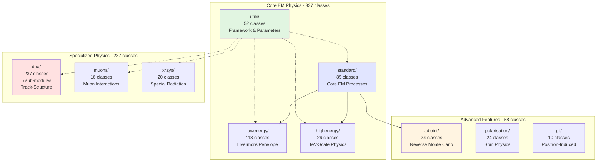
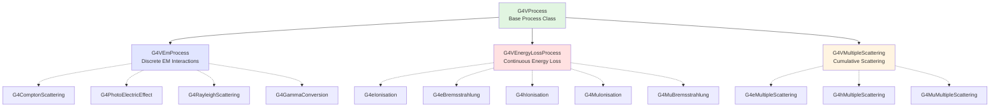
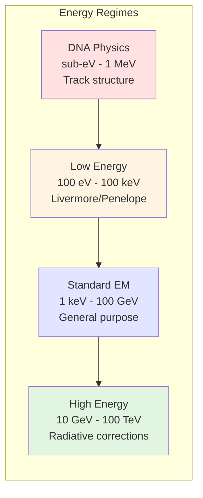
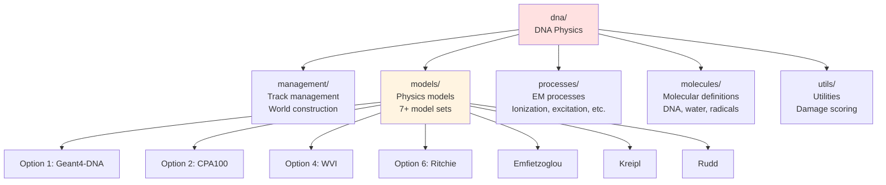
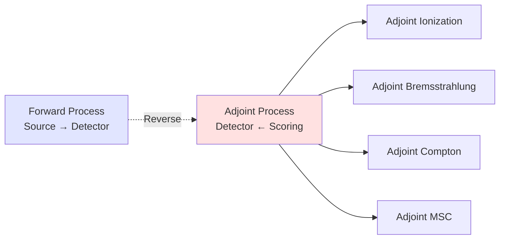
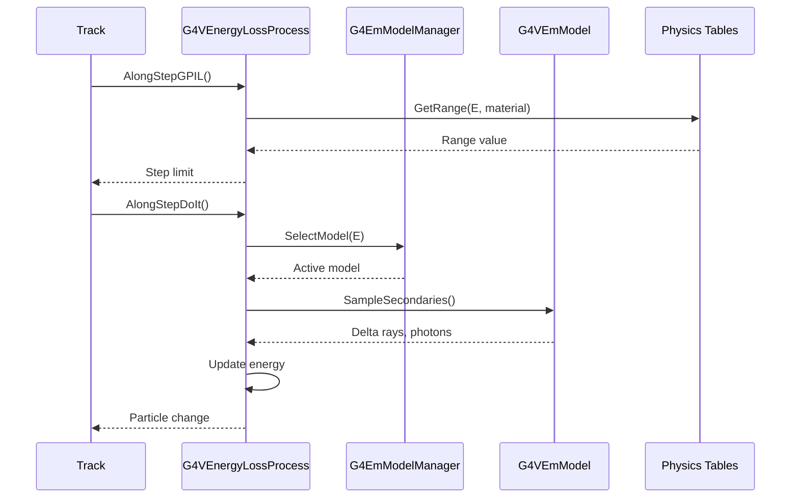
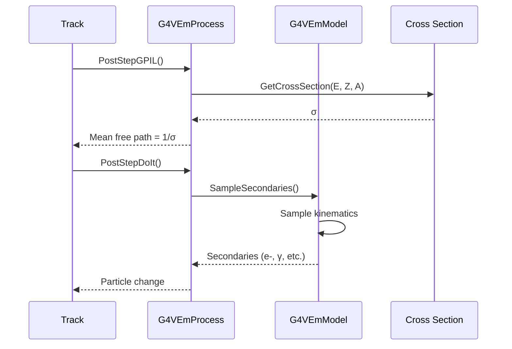

# Electromagnetic Processes Sub-Module

## Overview

The Electromagnetic (EM) sub-module is the most comprehensive physics component in Geant4, providing a complete suite of electromagnetic interaction processes for all charged particles and photons. With 612 header files across 10 specialized sub-directories, this module covers energy regimes from sub-eV (DNA physics) to multi-TeV scales (high-energy EM), making it suitable for applications ranging from medical physics and radiation biology to high-energy physics experiments.

::: tip Module Location
**Source:** `source/processes/electromagnetic/`
**Headers:** Distributed across 10 sub-directories
**Total Classes:** ~612 header files (375+ physics classes)
**Energy Range:** sub-eV to multi-TeV
:::

## Purpose and Scope

The Electromagnetic sub-module provides:

- **Standard EM Physics**: Core processes for electrons, positrons, photons, and charged hadrons
- **Low-Energy Models**: Detailed physics for keV-scale interactions (Livermore, Penelope)
- **High-Energy Models**: TeV-scale corrections including LPM effect and radiative corrections
- **Muon Physics**: Specialized processes for muon interactions
- **DNA Physics**: Track-structure models for radiation biology and nanodosimetry
- **Adjoint Processes**: Reverse Monte Carlo for detector optimization
- **Specialized Radiation**: Transition radiation, synchrotron radiation, Cerenkov, scintillation
- **Polarization Physics**: Polarized photon and electron interactions
- **Configuration Framework**: Centralized parameter management via G4EmParameters

## Module Organization

The EM sub-module is organized into 10 specialized categories, each addressing specific physics domains or energy regimes:



### Sub-Directory Breakdown

| Directory | Classes | Purpose | Key Features |
|-----------|---------|---------|--------------|
| **standard/** | 85 | Core EM physics for all particles | Ionization, bremsstrahlung, MSC, Compton, photoelectric, pair production |
| **lowenergy/** | 118 | Enhanced accuracy at keV scales | Livermore/Penelope models, detailed atomic structure, fluorescence |
| **highenergy/** | 26 | TeV-scale corrections | LPM effect, radiative corrections, muon pair production |
| **muons/** | 16 | Muon-specific processes | Muon ionization, bremsstrahlung, pair production, nuclear interactions |
| **dna/** | 237 | Nanometer-scale track structure | DNA damage, water radiolysis, multiple physics models (5 sub-modules) |
| **adjoint/** | 24 | Reverse Monte Carlo | Adjoint tracking for all EM processes, detector response optimization |
| **utils/** | 52 | Infrastructure and configuration | G4EmParameters, model managers, calculators, table builders |
| **polarisation/** | 24 | Spin-dependent interactions | Polarized Compton, Bhabha, Moller, annihilation |
| **xrays/** | 20 | Special radiation mechanisms | Transition radiation, synchrotron, Cerenkov, scintillation, X-ray reflection |
| **pii/** | 10 | Positron-atom interactions | PIXE cross-sections, impact ionization |

## Key EM Processes

### Process Hierarchy

Geant4 EM processes follow a well-defined class hierarchy based on interaction type:



### Major Process Categories

#### 1. Ionization Processes (Energy Loss)

Continuous energy loss through atomic ionization and excitation:

| Process | Particle | Energy Range | Models |
|---------|----------|--------------|--------|
| **G4eIonisation** | e-, e+ | 100 eV - 100 TeV | Moller/Bhabha, EEDL (low-E), PAI |
| **G4hIonisation** | Charged hadrons | keV - TeV | Bethe-Bloch, Bragg (low-E), ICRU73 |
| **G4ionIonisation** | Heavy ions | keV/u - TeV/u | Bethe-Bloch, ICRU49/73, Barkas/Bloch corrections |
| **G4MuIonisation** | μ±, τ± | keV - PeV | Bethe-Bloch with muon corrections |

**Key Models:**
- **Moller/Bhabha:** e-/e+ ionization with delta-ray production
- **Bethe-Bloch:** Universal stopping power formula
- **Bragg:** Low-energy (<1 MeV) ionization with charge-changing effects
- **PAI (Photoabsorption Ionization):** Detailed energy loss fluctuations for thin absorbers
- **ICRU73:** Improved stopping powers for ions

**Source:** `source/processes/electromagnetic/standard/include/G4*Ionisation.hh`

---

#### 2. Bremsstrahlung (Radiative Energy Loss)

Photon emission by charged particles in nuclear/atomic fields:

| Process | Particle | Energy Range | Models |
|---------|----------|--------------|--------|
| **G4eBremsstrahlung** | e-, e+ | keV - TeV | Seltzer-Berger, relativistic Bethe-Heitler |
| **G4MuBremsstrahlung** | μ±, τ± | GeV - PeV | Petrukhin-Shestakov, Kelner-Kokoulin |
| **G4hBremsstrahlung** | Charged hadrons | GeV - TeV | Scaled from muon models |

**Key Models:**
- **Seltzer-Berger:** Accurate electron bremsstrahlung for E < 1 GeV
- **Relativistic Bethe-Heitler:** High-energy e+/e- bremsstrahlung with LPM effect
- **Petrukhin-Shestakov:** Muon bremsstrahlung with nuclear form factors
- **LPM Suppression:** Landau-Pomeranchuk-Migdal effect at ultra-high energies

**Source:** `source/processes/electromagnetic/standard/include/G4*Bremsstrahlung.hh`

---

#### 3. Multiple Scattering

Cumulative small-angle Coulomb scattering (transport approximation):

| Model | Particles | Features |
|-------|-----------|----------|
| **Urban MSC** | e±, hadrons, ions | Default, fast, good accuracy for most applications |
| **Wentzel VI** | All charged | Single-scattering at boundaries, better for thin layers |
| **Goudsmit-Saunderson** | e± | Most accurate, angle-energy correlations |
| **Single Scattering** | All charged | True event-by-event scattering (slow, high accuracy) |

**Key Classes:**
- `G4UrbanMscModel` - Default condensed-history MSC
- `G4WentzelVIModel` - Wentzel model with improved boundary handling
- `G4GoudsmitSaundersonMscModel` - Most accurate e± MSC
- `G4eCoulombScatteringModel` - Single Coulomb scattering

**Source:** `source/processes/electromagnetic/standard/include/G4*MultipleScattering.hh`

---

#### 4. Photon Processes

Discrete interactions for photons:

##### Photoelectric Effect
- **Process:** G4PhotoElectricEffect
- **Energy Range:** eV - MeV
- **Models:**
  - Livermore: Detailed sub-shell cross-sections
  - Standard: Parametrized total cross-sections
- **Secondaries:** Photoelectrons, fluorescence photons, Auger electrons

##### Compton Scattering
- **Process:** G4ComptonScattering
- **Energy Range:** keV - 100 GeV
- **Models:**
  - Klein-Nishina: Free-electron approximation
  - Livermore: Shell-binding corrections
  - Polarized: Spin-dependent cross-sections
- **Secondaries:** Scattered photon, Compton electron

##### Pair Production
- **Process:** G4GammaConversion
- **Energy Range:** > 1.022 MeV (2×m_e)
- **Models:**
  - Bethe-Heitler: Standard pair production
  - Bethe-Heitler 5D: Full kinematics including nuclear recoil
  - Nuclear pair production: γ + nucleus → e+e- + nucleus
  - Triplet production: γ + e- → e+e-e- (high energies)
- **Secondaries:** e+e- pair (+ nuclear recoil in 5D model)

##### Rayleigh Scattering
- **Process:** G4RayleighScattering
- **Energy Range:** keV - MeV
- **Description:** Coherent elastic scattering on atoms
- **Secondaries:** Scattered photon (no energy loss)

**Source:** `source/processes/electromagnetic/standard/include/G4PhotoElectricEffect.hh` and related

---

#### 5. Positron Annihilation

| Process | Type | Energy | Secondaries |
|---------|------|--------|-------------|
| **In-flight** | Discrete | Any E > 0 | 2γ (occasionally 3γ) |
| **At-rest** | Rest | E ≈ 0 | 2γ back-to-back, or positronium → 2γ/3γ |

**Models:**
- Simple: Direct 2γ annihilation
- Allison: Positronium formation (para-Ps → 2γ, ortho-Ps → 3γ)
- Ore-Powell: Enhanced positronium physics

**Source:** `source/processes/electromagnetic/standard/include/G4eplusAnnihilation.hh`

---

## Energy Regime Coverage

The EM sub-module covers an unprecedented energy range through specialized models:



### Model Energy Ranges

| Physics Domain | Energy Range | Applications | Key Features |
|----------------|--------------|--------------|--------------|
| **DNA Physics** | sub-eV to 1 MeV | Radiobiology, microdosimetry | Event-by-event ionizations, discrete secondaries |
| **Low Energy** | 100 eV - 1 GeV | Medical physics, X-ray fluorescence | Shell effects, fluorescence, Auger cascades |
| **Standard EM** | 1 keV - 100 GeV | General HEP, nuclear physics | Fast, validated, universal |
| **High Energy** | 10 GeV - 100 TeV | Cosmic rays, colliders | LPM effect, radiative corrections |

### Physics Model Selection

Models are automatically selected by energy range using `G4EmModelManager`:

```cpp
// Example: Electron ionization
G4eIonisation* eIoni = new G4eIonisation();

// Low energy: Livermore model (100 eV - 100 keV)
G4LivermoreIonisationModel* livermore = new G4LivermoreIonisationModel();
eIoni->AddEmModel(1, livermore, new G4UniversalFluctuation());

// Standard: Moller-Bhabha (1 keV - 100 TeV)
G4MollerBhabhaModel* moller = new G4MollerBhabhaModel();
eIoni->SetEmModel(moller);  // Default model
```

## DNA Physics Sub-Module

The DNA sub-module (237 classes across 5 sub-modules) provides nanometer-scale physics for radiation biology:

### DNA Sub-Structure



### DNA Physics Models

| Model Package | Energy Range | Particles | Applications |
|---------------|--------------|-----------|--------------|
| **Geant4-DNA (Option 1)** | 7.4 eV - 1 MeV | e-, p, H, He, α | General purpose, validated |
| **CPA100 (Option 2)** | 11 eV - 255.6 keV | e-, p | Enhanced electron transport |
| **Option 4 (WVI)** | 11 eV - 10 MeV | e-, p, ions | Light ion extensions |
| **Option 6 (Ritchie)** | 7.4 eV - 100 MeV | e- only | Accurate e- cross-sections |

**Key Features:**
- Event-by-event tracking down to sub-eV
- Discrete ionization/excitation interactions
- Water radiolysis and chemistry
- Direct/indirect DNA damage scoring
- Multiple independent physics models for validation

**Source:** `source/processes/electromagnetic/dna/`

---

## Adjoint Processes

Reverse Monte Carlo for efficient detector response calculations:

### Adjoint Process Architecture



### Available Adjoint Processes

| Adjoint Process | Forward Equivalent | Purpose |
|-----------------|-------------------|----------|
| **G4AdjointeIonisationModel** | e± ionization | Reverse energy gain |
| **G4AdjointBremsstrahlungModel** | e± bremsstrahlung | Photon absorption |
| **G4AdjointComptonModel** | Compton scattering | Energy/direction reversal |
| **G4AdjointPhotoElectricModel** | Photoelectric effect | Photon creation from e- |
| **G4AdjointhMultipleScattering** | Multiple scattering | Reverse angular diffusion |

**Applications:**
- Detector optimization (minimize background)
- Shielding design
- Dose calculation from distributed sources
- Importance map generation

**Source:** `source/processes/electromagnetic/adjoint/include/`

---

## G4EmParameters: Configuration Framework

The `G4EmParameters` singleton provides centralized configuration for all EM physics:

### Key Configuration Categories

#### 1. Energy Range and Binning

```cpp
G4EmParameters* param = G4EmParameters::Instance();

// Set energy range for tables
param->SetMinEnergy(100*eV);     // Default: 100 eV
param->SetMaxEnergy(100*TeV);    // Default: 100 TeV

// Set table binning
param->SetNumberOfBinsPerDecade(7);  // Default: 7 bins/decade

// CSDA range table
param->SetMaxEnergyForCSDARange(1*GeV);  // Default: 1 GeV
```

#### 2. Physics Flags

```cpp
// Fluctuations
param->SetLossFluctuations(true);  // Enable energy loss fluctuations

// LPM effect
param->SetLPM(true);  // Landau-Pomeranchuk-Migdal suppression

// Fluorescence and Auger
param->SetFluo(true);        // Atomic de-excitation
param->SetAuger(true);       // Auger electron emission
param->SetPixe(true);        // Particle-Induced X-ray Emission

// Integral approach
param->SetIntegral(true);    // Use integral method for XS sampling
```

#### 3. Multiple Scattering

```cpp
// MSC step limitation
param->SetMscStepLimitType(fUseSafety);  // Options: fMinimal, fUseSafety, fUseSafetyPlus, fUseDistanceToBoundary

// MSC range factor
param->SetMscRangeFactor(0.04);  // Default: 0.04 (4% of range)

// Lateral displacement
param->SetLateralDisplacement(true);  // Enable lateral displacement

// Skin parameter
param->SetMscSkin(1.0);  // Safety margin for MSC
```

#### 4. Ionization and Step Function

```cpp
// Step function: limits step size in energy loss regions
// SetStepFunction(dRoverRange, finalRange)
param->SetStepFunction(0.2, 1*mm);  // Max 20% range change per step, min 1mm final range

// Separate control for ions
param->SetStepFunctionIons(0.1, 0.1*mm);

// Linear energy loss limit
param->SetLinearLossLimit(0.01);  // Max 1% energy loss per step
```

#### 5. Advanced Options

```cpp
// Use ICRU90 stopping powers
param->SetUseICRU90Data(true);

// DNA-specific
param->SetDNAFast(false);        // Disable fast DNA mode
param->SetDNAStationary(true);   // Stationary target approximation
param->SetDNAElectronMsc(true);  // MSC for DNA electrons

// Fluctuation models
param->SetFluctuationType(fUrbanFluctuation);  // Options: fDummy, fUniversal, fUrban

// Positronium formation
param->SetPositronAtRestModelType(fAllisonPositronium);
```

### Region-Specific Configuration

```cpp
// Apply special models to specific regions
param->AddPAIModel("e-", "DetectorRegion", "pai");
param->AddDNA("MicroRegion", "Opt4");

// Force interaction in region
param->ActivateForcedInteraction("eBrem", "TargetRegion", 10*cm, true);

// Secondary biasing
param->ActivateSecondaryBiasing("eIoni", "DetectorRegion", 2.0, 100*keV);
```

**Source:** `source/processes/electromagnetic/utils/include/G4EmParameters.hh`

---

## Common EM Physics Configurations

### 1. Standard EM Physics (Option 0)

Default configuration for general-purpose simulations:

```cpp
#include "G4EmStandardPhysics.hh"

// In physics list constructor
RegisterPhysics(new G4EmStandardPhysics());
```

**Features:**
- Optimized for speed and accuracy balance
- Energy range: 1 keV - 100 TeV
- Urban MSC model
- Minimal atomic de-excitation

---

### 2. Option 1: Enhanced EM Physics

Increased accuracy for medical/low-energy applications:

```cpp
#include "G4EmStandardPhysics_option1.hh"

RegisterPhysics(new G4EmStandardPhysics_option1());
```

**Differences from Option 0:**
- Fano cavity test compliant
- Better low-energy accuracy
- Enhanced fluctuations
- Full ICRU73 stopping powers

---

### 3. Option 2: Experimental/Testing

Physics under development or testing:

```cpp
#include "G4EmStandardPhysics_option2.hh"

RegisterPhysics(new G4EmStandardPhysics_option2());
```

**Features:**
- Latest developments
- May change between releases
- Not recommended for production

---

### 4. Option 3: High-Precision EM

Best accuracy for critical applications:

```cpp
#include "G4EmStandardPhysics_option3.hh"

RegisterPhysics(new G4EmStandardPhysics_option3());
```

**Features:**
- Goudsmit-Saunderson MSC for electrons
- Enhanced models
- Lower step function (dRoverR = 0.1)
- Suitable for medical dosimetry

---

### 5. Option 4: Most Accurate EM

Maximum accuracy with performance trade-off:

```cpp
#include "G4EmStandardPhysics_option4.hh"

RegisterPhysics(new G4EmStandardPhysics_option4());
```

**Features:**
- Most accurate models available
- Single scattering at boundaries
- Full atomic de-excitation
- Slowest but most accurate

---

### 6. Low-Energy EM (Livermore)

Enhanced accuracy below 100 keV:

```cpp
#include "G4EmLivermorePhysics.hh"

RegisterPhysics(new G4EmLivermorePhysics());
```

**Features:**
- Livermore data libraries (EPDL, EEDL, EADL)
- Detailed atomic shell structure
- Fluorescence and Auger electrons
- Valid down to 100 eV
- Applications: X-ray fluorescence, medical imaging

---

### 7. Penelope EM Physics

Alternative low-energy models:

```cpp
#include "G4EmPenelopePhysics.hh"

RegisterPhysics(new G4EmPenelopePhysics());
```

**Features:**
- Penelope physics models
- Good agreement with experiments
- Alternative to Livermore
- Particularly good for photon physics

---

### 8. DNA Physics

Nanoscale track-structure physics:

```cpp
#include "G4EmDNAPhysics.hh"

RegisterPhysics(new G4EmDNAPhysics());
// Or specific options:
// RegisterPhysics(new G4EmDNAPhysics_option2());  // CPA100
// RegisterPhysics(new G4EmDNAPhysics_option4());  // Extended particles
```

**Features:**
- Event-by-event tracking
- Valid to sub-eV energies
- Water radiolysis
- DNA damage scoring
- Applications: Radiobiology, microdosimetry

---

## Usage Examples

### Basic EM Physics Setup

```cpp
#include "G4VModularPhysicsList.hh"
#include "G4EmStandardPhysics.hh"

class MyPhysicsList : public G4VModularPhysicsList
{
public:
    MyPhysicsList() {
        // Set default cut value
        SetDefaultCutValue(1.0*mm);

        // Add EM physics
        RegisterPhysics(new G4EmStandardPhysics());

        // Configure EM parameters
        G4EmParameters* param = G4EmParameters::Instance();
        param->SetVerbose(1);
        param->SetMinEnergy(100*eV);
        param->SetMaxEnergy(10*TeV);
        param->SetLossFluctuations(true);
        param->SetBuildCSDARange(true);
    }
};
```

### Custom EM Configuration

```cpp
void SetupCustomEM()
{
    G4EmParameters* param = G4EmParameters::Instance();

    // Energy range
    param->SetMinEnergy(10*eV);
    param->SetMaxEnergy(1*PeV);
    param->SetNumberOfBinsPerDecade(10);  // Higher precision tables

    // Multiple scattering
    param->SetMscStepLimitType(fUseDistanceToBoundary);
    param->SetMscRangeFactor(0.02);  // Tighter MSC
    param->SetMscGeomFactor(2.5);

    // Ionization
    param->SetStepFunction(0.1, 100*um);  // Fine steps in tracker
    param->SetStepFunctionMuHad(0.2, 1*mm);  // Coarser for muons/hadrons

    // Physics options
    param->SetLPM(true);                    // LPM effect
    param->SetFluo(true);                   // Fluorescence
    param->SetAuger(true);                  // Auger electrons
    param->SetDeexcitationIgnoreCut(true);  // Always produce fluorescence

    // Fluctuations
    param->SetFluctuationType(fUrbanFluctuation);

    // Advanced
    param->SetUseMottCorrection(true);      // Mott corrections for e- scattering
    param->SetUseICRU90Data(true);          // Latest stopping powers
    param->SetIntegral(true);               // Integral approach
}
```

### Region-Specific Physics

```cpp
void ConfigureRegionalPhysics()
{
    G4EmParameters* param = G4EmParameters::Instance();

    // Use PAI model in thin gas detector
    param->AddPAIModel("e-", "GasDetector", "pai");
    param->AddPAIModel("mu-", "GasDetector", "pai");

    // DNA physics in micro-dosimeter
    param->AddDNA("MicroDosimeter", "Opt4");

    // Low-energy models in X-ray detector
    param->AddPhysics("XrayDetector", "Livermore");

    // Enhanced de-excitation in scintillator
    param->SetDeexActiveRegion("Scintillator", true, true, true);
    // Arguments: region name, fluorescence, Auger, PIXE
}
```

### Accessing EM Information

```cpp
#include "G4EmCalculator.hh"

void PrintEMInfo()
{
    G4EmCalculator calc;

    G4ParticleDefinition* electron = G4Electron::Definition();
    G4Material* water = G4Material::GetMaterial("G4_WATER");

    G4double energy = 1*MeV;

    // Get stopping power (dE/dx)
    G4double dedx = calc.ComputeDEDX(energy, electron, "eIoni", water);
    G4cout << "dE/dx at " << energy/MeV << " MeV = "
           << dedx/(MeV/cm) << " MeV/cm" << G4endl;

    // Get range
    G4double range = calc.GetRange(energy, electron, water);
    G4cout << "Range = " << range/mm << " mm" << G4endl;

    // Get cross-section
    G4double xsec = calc.ComputeCrossSectionPerVolume(
        energy, electron, "eBrem", water);
    G4cout << "Bremsstrahlung XS = " << xsec*cm << " cm^-1" << G4endl;

    // Mean free path
    G4double mfp = calc.ComputeMeanFreePath(energy, electron, "eBrem", water);
    G4cout << "Mean free path = " << mfp/cm << " cm" << G4endl;
}
```

---

## Process Architecture Details

### Energy Loss Process Flow



### Discrete Process Flow



---

## Performance Considerations

### 1. Production Cuts Strategy

```cpp
// Global default (coarse, for shielding)
SetDefaultCutValue(10*mm);

// Fine cuts in sensitive detectors
G4Region* detector = new G4Region("Detector");
G4ProductionCuts* cuts = new G4ProductionCuts();
cuts->SetProductionCut(0.1*mm, "gamma");
cuts->SetProductionCut(0.01*mm, "e-");
cuts->SetProductionCut(0.01*mm, "e+");
detector->SetProductionCuts(cuts);
```

**Guidelines:**
- **Trackers**: 0.01-0.1 mm (resolve hits)
- **Calorimeters**: 0.5-5 mm (balance resolution vs speed)
- **Shielding**: 10-100 mm (minimize secondaries)
- **Medical**: 0.01-0.1 mm (dose accuracy)

### 2. Multiple Scattering Optimization

| Model | Speed | Accuracy | Use Case |
|-------|-------|----------|----------|
| **Urban** | Fast | Good | General purpose, thick absorbers |
| **Wentzel VI** | Medium | Better | Thin layers, boundaries |
| **Goudsmit-Saunderson** | Slow | Best | High-precision, medical |
| **Single scattering** | Very slow | Exact | Validation only |

```cpp
// Fast configuration (Urban)
param->SetMscStepLimitType(fUseSafety);
param->SetMscRangeFactor(0.04);

// Accurate configuration (GS)
param->SetMscStepLimitType(fUseDistanceToBoundary);
param->SetMscRangeFactor(0.02);
```

### 3. Table vs On-the-Fly Calculation

```cpp
// Build comprehensive tables (slower init, faster run)
param->SetNumberOfBinsPerDecade(10);
param->SetBuildCSDARange(true);
param->SetIntegral(true);

// Minimal tables (faster init, slower run)
param->SetNumberOfBinsPerDecade(5);
param->SetBuildCSDARange(false);
param->SetIntegral(false);
```

**Recommendation:** Use tables for production runs, minimal for testing.

### 4. Step Function Tuning

```cpp
// Fast (coarse steps)
param->SetStepFunction(0.8, 10*mm);  // Up to 80% energy change, 10mm min

// Accurate (fine steps)
param->SetStepFunction(0.05, 0.1*mm);  // Max 5% energy change, 0.1mm min

// Balanced (default)
param->SetStepFunction(0.2, 1*mm);
```

### 5. Fluorescence and Auger Control

```cpp
// Disable for speed (if not needed)
param->SetFluo(false);
param->SetAuger(false);

// Enable only in specific regions
param->SetDeexActiveRegion("XrayDetector", true, true, false);
```

**Impact:** Fluorescence can double EM shower secondaries below 100 keV.

---

## Best Practices

### 1. Choosing the Right Physics List

| Application | Recommended Physics | Rationale |
|-------------|-------------------|-----------|
| **HEP Detectors** | G4EmStandardPhysics (Opt0) | Fast, validated, general purpose |
| **Medical Physics** | G4EmStandardPhysics_option3/4 | High accuracy, good MSC |
| **Space Radiation** | G4EmStandardPhysics_option4 | Accurate cross-sections |
| **X-ray Fluorescence** | G4EmLivermorePhysics | Detailed atomic structure |
| **Low-Energy Electrons** | G4EmPenelopePhysics | Accurate down to 100 eV |
| **Radiobiology** | G4EmDNAPhysics | Track structure, chemistry |

### 2. Validation Workflow

```cpp
// 1. Enable verbose output during development
param->SetVerbose(2);

// 2. Build and check physics tables
/run/initialize
/process/eLoss/printTables e-

// 3. Use G4EmCalculator for cross-checks
G4EmCalculator calc;
G4double dedx = calc.ComputeDEDX(1*MeV, "e-", "eIoni", "G4_WATER");

// 4. Compare with NIST ESTAR/PSTAR data
// https://physics.nist.gov/PhysRefData/Star/Text/

// 5. Test with known benchmarks
// - Fano cavity test (Opt1, Opt3)
// - Range-energy tables (ICRU reports)
```

### 3. Thread Safety

```cpp
// Thread-safe: G4EmParameters is a singleton
G4EmParameters* param = G4EmParameters::Instance();
param->SetMinEnergy(100*eV);  // OK in master thread

// NOT thread-safe: Don't modify in worker threads
void WorkerThreadRun() {
    // WRONG: Don't modify parameters in workers
    // G4EmParameters::Instance()->SetMinEnergy(10*eV);

    // OK: Read parameters
    G4double eMin = G4EmParameters::Instance()->MinKinEnergy();
}
```

### 4. Memory Management

```cpp
// Tables are shared across threads (read-only)
// Per-thread: Process state, particle change

// Clean up properly in physics list
~MyPhysicsList() {
    // Don't delete EM processes manually
    // They're managed by G4ProcessManager
}
```

### 5. Debugging EM Issues

```cpp
// Enable process-level verbosity
G4ProcessTable* processTable = G4ProcessTable::GetProcessTable();
G4VProcess* eIoni = processTable->FindProcess("eIoni", "e-");
eIoni->SetVerboseLevel(2);

// Enable model verbosity
G4LossTableManager* lossManager = G4LossTableManager::Instance();
lossManager->SetVerbose(1);

// Enable material-cuts couple table
G4ProductionCutsTable* cutsTable = G4ProductionCutsTable::GetProductionCutsTable();
cutsTable->SetVerboseLevel(1);

// Dump EM parameters
G4EmParameters::Instance()->Dump();
```

---

## Special Radiation Mechanisms (xrays/)

The xrays sub-directory includes advanced radiation emission processes:

### Transition Radiation

Radiation emitted when charged particle crosses boundary between media with different dielectric constants:

| Process | Description | Applications |
|---------|-------------|--------------|
| **G4TransitionRadiation** | Base class for TR | - |
| **G4ForwardXrayTR** | Forward X-ray TR | Particle identification (TRT detectors) |
| **G4XTRGammaRadModel** | Gamma-distributed TR | Realistic TR spectrum |
| **G4StrawTubeXTRadiator** | Straw tube geometry | ATLAS TRT, similar detectors |

### Synchrotron Radiation

Radiation from charged particles in magnetic fields:

| Process | Description |
|---------|-------------|
| **G4SynchrotronRadiation** | Vacuum synchrotron radiation |
| **G4SynchrotronRadiationInMat** | Synchrotron in materials |

### Cerenkov and Scintillation

```cpp
// Note: These are in xrays/ directory but are optical-like processes
G4Cerenkov* cerenkov = new G4Cerenkov();
G4Scintillation* scint = new G4Scintillation();
```

**Source:** `source/processes/electromagnetic/xrays/include/`

---

## Polarization Physics

Full treatment of spin-dependent EM interactions:

### Polarized Processes

| Process | Standard Equivalent | Spin Effects |
|---------|-------------------|--------------|
| **G4ePolarizedIonisation** | G4eIonisation | Moller/Bhabha with spin |
| **G4ePolarizedBremsstrahlung** | G4eBremsstrahlung | Polarized photon emission |
| **G4PolarizedCompton** | G4ComptonScattering | Spin-dependent Compton |
| **G4PolarizedAnnihilation** | G4eplusAnnihilation | Polarized 2γ/3γ |
| **G4PolarizedPhotoElectric** | G4PhotoElectricEffect | Shell spin coupling |

**Applications:**
- Polarized electron beams
- Spin asymmetry measurements
- Polarimetry

**Source:** `source/processes/electromagnetic/polarisation/include/`

---

## Links to Key Implementations

### Core Base Classes
- **G4VEnergyLossProcess:** `source/processes/electromagnetic/utils/include/G4VEnergyLossProcess.hh`
- **G4VEmProcess:** `source/processes/electromagnetic/utils/include/G4VEmProcess.hh`
- **G4VMultipleScattering:** `source/processes/electromagnetic/utils/include/G4VMultipleScattering.hh`
- **G4EmParameters:** `source/processes/electromagnetic/utils/include/G4EmParameters.hh`

### Standard Processes
- **G4eIonisation:** `source/processes/electromagnetic/standard/include/G4eIonisation.hh`
- **G4eBremsstrahlung:** `source/processes/electromagnetic/standard/include/G4eBremsstrahlung.hh`
- **G4eMultipleScattering:** `source/processes/electromagnetic/standard/include/G4eMultipleScattering.hh`
- **G4ComptonScattering:** `source/processes/electromagnetic/standard/include/G4ComptonScattering.hh`
- **G4PhotoElectricEffect:** `source/processes/electromagnetic/standard/include/G4PhotoElectricEffect.hh`
- **G4GammaConversion:** `source/processes/electromagnetic/standard/include/G4GammaConversion.hh`

### Muon Processes
- **G4MuIonisation:** `source/processes/electromagnetic/muons/include/G4MuIonisation.hh`
- **G4MuBremsstrahlung:** `source/processes/electromagnetic/muons/include/G4MuBremsstrahlung.hh`
- **G4MuPairProduction:** `source/processes/electromagnetic/muons/include/G4MuPairProduction.hh`

### Utilities
- **G4EmCalculator:** `source/processes/electromagnetic/utils/include/G4EmCalculator.hh`
- **G4EmModelManager:** `source/processes/electromagnetic/utils/include/G4EmModelManager.hh`
- **G4LossTableManager:** `source/processes/electromagnetic/utils/include/G4LossTableManager.hh`

---

## References and Further Reading

### Official Documentation
- [Geant4 Physics Reference Manual](https://geant4-userdoc.web.cern.ch/UsersGuides/PhysicsReferenceManual/html/index.html) - Comprehensive EM physics description
- [Geant4 User Guide for Application Developers](https://geant4-userdoc.web.cern.ch/UsersGuides/ForApplicationDeveloper/html/index.html) - Chapter on EM processes

### Physics Models
- **ICRU Reports:** Stopping powers and ranges for electrons/ions
- **NIST Databases:** ESTAR, PSTAR, ASTAR stopping power databases
- **Livermore Libraries:** EPDL, EEDL, EADL evaluated photon/electron data
- **Penelope:** Monte Carlo code for low-energy physics (basis for Penelope models)

### Validation
- [Geant4 Validation Repository](https://geant-val.cern.ch/) - EM physics validation results
- [Geant4-DNA Documentation](https://geant4-dna.in2p3.fr/) - DNA physics validation and examples

---

## Module Statistics

| Category | Count | Description |
|----------|-------|-------------|
| **Total Headers** | 612 | All .hh files |
| **Physics Classes** | 375+ | Actual process and model classes |
| **Sub-Directories** | 10 | Major physics categories |
| **Energy Range** | sub-eV to 100 TeV | 16 orders of magnitude |
| **Particle Types** | 20+ | e±, γ, μ±, τ±, p, ions, DNA species |

### Sub-Directory Details

| Sub-Directory | Headers | Source Files | Primary Focus |
|---------------|---------|--------------|---------------|
| standard/ | 85 | 85 | Core EM for all particles |
| lowenergy/ | 118 | 118 | Livermore/Penelope models |
| highenergy/ | 26 | 26 | TeV-scale physics |
| muons/ | 16 | 16 | Muon-specific processes |
| dna/ | 237 | 237 | Track-structure nanophysics |
| adjoint/ | 24 | 24 | Reverse Monte Carlo |
| utils/ | 52 | 52 | Infrastructure |
| polarisation/ | 24 | 24 | Spin physics |
| xrays/ | 20 | 20 | Special radiation |
| pii/ | 10 | 10 | Positron-induced |

---

## Integration with Other Modules

The EM sub-module integrates with:

- **[Particles Module](../../particles/)** - Process applicability per particle type
- **[Materials Module](../../materials/)** - EM properties, cross-sections, stopping powers
- **[Track Module](../../track/)** - G4Track and G4Step for process execution
- **[Geometry Module](../../geometry/)** - Material boundaries, MSC boundary handling
- **[Run Module](../../run/)** - Physics list registration and initialization

---

::: tip Next Steps
- Explore detailed process implementations in sub-directories
- Review [G4EmParameters API documentation](./api/g4emparameters.md) for configuration
- Check [DNA Physics documentation](./dna/) for radiobiology applications
- See [parent Processes module](../) for overall process framework
:::

---

::: info Last Updated
**Date:** 2025-11-17
**Geant4 Version:** 11.4.0.beta
**Status:** Comprehensive overview complete
**Classes Documented:** 612 headers across 10 sub-directories
:::
