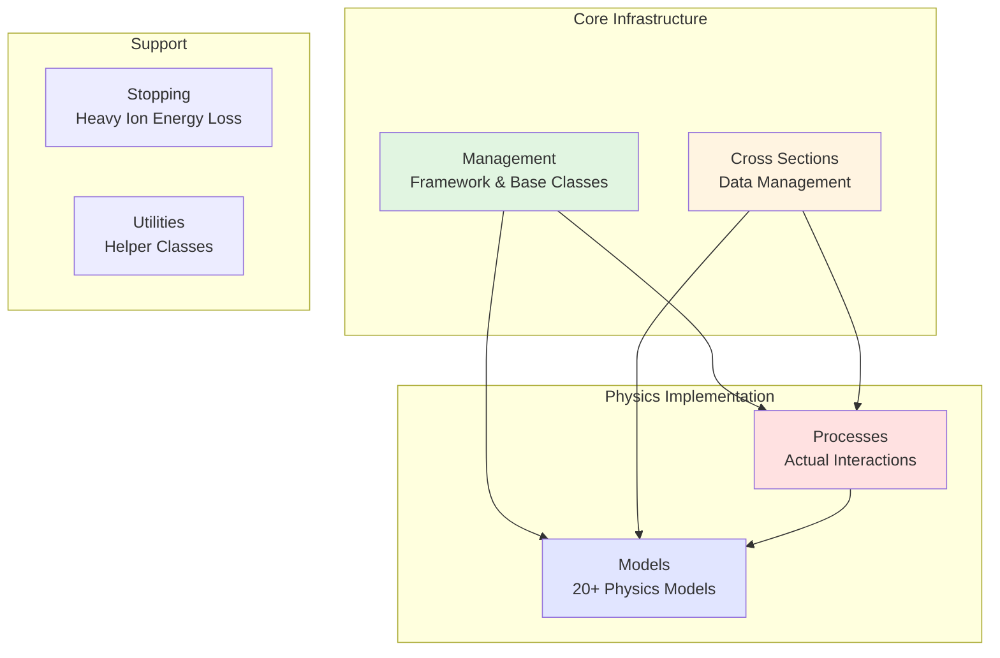
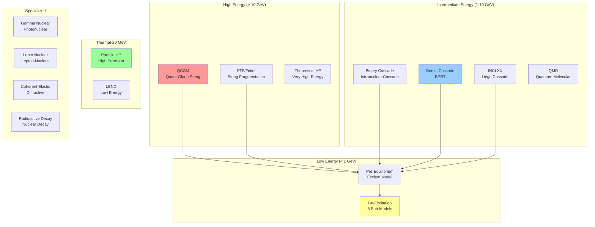
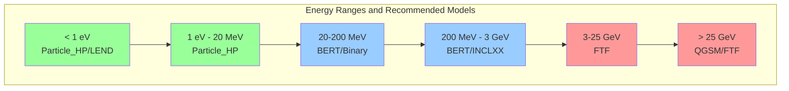
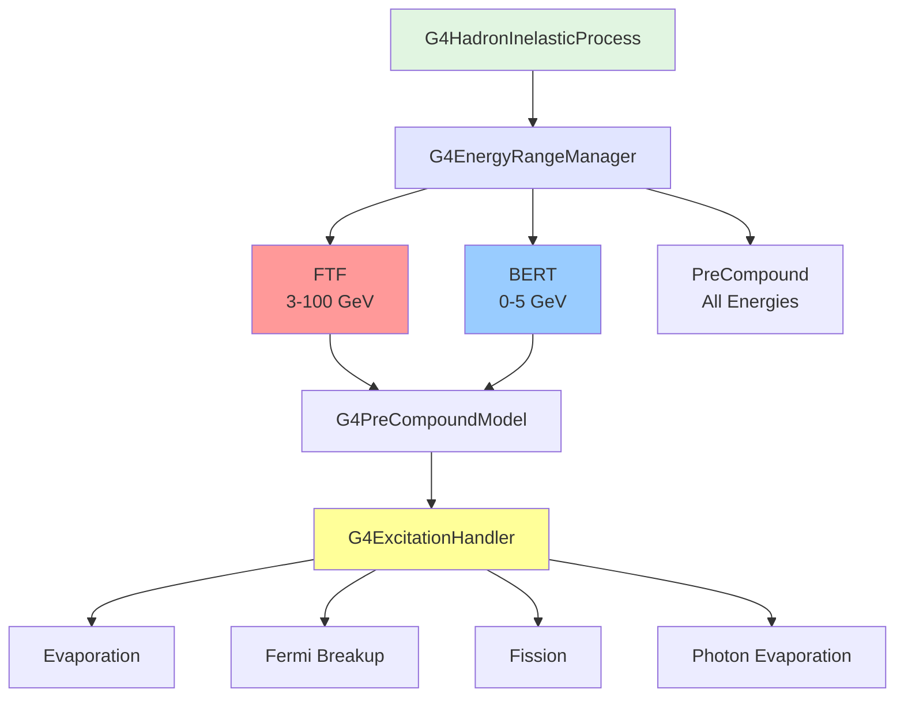

# Hadronic Physics Sub-Module

## Overview

The Hadronic Physics sub-module is one of the most complex and comprehensive components of Geant4's Processes module, providing the complete infrastructure for simulating nuclear and hadronic interactions. This sub-module implements the physics of particle-nucleus and nucleus-nucleus collisions across an enormous energy range, from thermal neutrons (< 1 eV) to ultra-high energies (> TeV).

::: tip Module Location
**Source:** `source/processes/hadronic/`
**Headers:** `source/processes/hadronic/*/include/`
**Size:** 1,201 header files across 6 major categories with 20+ model subdirectories
:::

## Purpose and Scope

The Hadronic sub-module serves as the nuclear physics engine of Geant4, providing:

- **Process Framework**: Core infrastructure for defining and managing hadronic interactions
- **Nuclear Processes**: Elastic scattering, inelastic reactions, capture, fission
- **Cross-Section Management**: Interface to evaluated nuclear data libraries (ENDF, TENDL, JENDL)
- **Physics Models**: 20+ model packages covering thermal to ultra-high energies
- **Energy-Dependent Transitions**: Seamless model switching based on projectile energy
- **Particle Coverage**: Hadrons (protons, neutrons, pions, kaons, etc.), leptons, photons, ions
- **Specialized Physics**: Ultra-cold neutrons (UCN), neutrino interactions, radioactive decay
- **Performance Optimization**: Unified neutron process for simulation speedup

## Architecture

### Module Organization

The Hadronic sub-module is organized into 6 major categories:



### Category Breakdown

| Category | Location | Purpose | Key Components |
|----------|----------|---------|----------------|
| **Management** | `management/` | Core framework | G4HadronicProcess, G4HadronicInteraction, G4EnergyRangeManager |
| **Processes** | `processes/` | Physics processes | Elastic, Inelastic, Capture, Fission, Lepton-nuclear |
| **Cross Sections** | `cross_sections/` | Cross-section data | G4CrossSectionDataStore, particle-specific implementations |
| **Models** | `models/` | Physics models | 20+ model packages (Cascade, String, Pre-equilibrium, etc.) |
| **Stopping** | `stopping/` | Ion energy loss | Heavy ion stopping power |
| **Utilities** | `util/` | Support classes | Helper functions and utilities |

---

## Core Components

### 1. Management

**Location:** `source/processes/hadronic/management/`
**Purpose:** Foundational framework for all hadronic physics

#### Key Classes

- **G4HadronicProcess** - Abstract base class for all hadronic processes
  - Inherits from G4VDiscreteProcess
  - Manages model registration and selection
  - Cross-section integration
  - Process-level configuration

- **G4HadronicInteraction** - Base class for all physics models
  - Energy range specification (min/max applicability)
  - Material and particle applicability
  - ApplyYourself() method for physics implementation
  - Model name and version tracking

- **G4HadronicProcessStore** - Global process registry (singleton)
  - Central repository for all hadronic processes
  - Cross-section lookup and caching
  - Model query interface
  - Process-model associations

- **G4EnergyRangeManager** - Coordinates models by energy
  - Manages multiple models for a single process
  - Energy-dependent model selection
  - Smooth transitions between models
  - Model priority and ordering

- **G4VHighEnergyGenerator** - Interface for high-energy generators
  - String models (QGSM, FTF)
  - Parton-based interactions

- **G4VIntraNuclearTransportModel** - Interface for cascade models
  - Binary cascade
  - Bertini cascade
  - INCLXX

- **G4VPreCompoundModel** - Interface for pre-equilibrium models
  - Exciton model
  - Transition from cascade to equilibrium

**File:** `source/processes/hadronic/management/include/*.hh`

---

### 2. Processes

**Location:** `source/processes/hadronic/processes/`
**Purpose:** Actual hadronic interaction processes

#### Major Hadronic Processes

##### Elastic Scattering
- **G4HadronElasticProcess** - Elastic hadron-nucleus scattering
  - Coherent scattering (nucleus remains intact)
  - Small momentum transfer
  - Applies to all hadrons

##### Inelastic Interactions
- **G4HadronInelasticProcess** - Inelastic hadron-nucleus collisions
  - Nuclear breakup and particle production
  - Cascade, evaporation, fragmentation
  - Primary process for most hadronic physics

##### Neutron Processes
- **G4NeutronCaptureProcess** - Neutron capture (n,γ)
  - Thermal and epithermal capture
  - Radiative capture at all energies

- **G4NeutronFissionProcess** - Neutron-induced fission
  - Thermal fission (U-235, Pu-239)
  - Fast fission
  - Fission fragment production

- **G4NeutronGeneralProcess** - Unified neutron process (optimization)
  - Combines elastic, inelastic, capture, fission
  - Single cross-section lookup per step
  - Significant performance improvement (~20-30%)
  - Available for Geant4 10.6+

##### Lepton-Nuclear Processes
- **G4ElectronNuclearProcess** - Electron-nucleus interactions
  - Photo-nuclear via virtual photon
  - Deep inelastic scattering

- **G4PositronNuclearProcess** - Positron-nucleus interactions

- **G4MuonNuclearProcess** - Muon-nucleus interactions
  - Photo-nuclear processes
  - Important for cosmic ray muons

- **G4ElNeutrinoNucleusProcess** - Electron neutrino interactions
  - Charged current (νₑ + n → e⁻ + p)
  - Neutral current

- **G4MuNeutrinoNucleusProcess** - Muon neutrino interactions

- **G4TauNeutrinoNucleusProcess** - Tau neutrino interactions

- **G4NeutrinoElectronProcess** - Neutrino-electron scattering

- **G4NuVacOscProcess** - Neutrino vacuum oscillations

##### Ultra-Cold Neutron (UCN) Processes
- **G4UCNAbsorption** - UCN absorption in materials
- **G4UCNLoss** - UCN loss mechanisms
- **G4UCNMultiScattering** - UCN multiple scattering
- **G4UCNBoundaryProcess** - UCN boundary interactions
  - Total reflection below critical angle
  - Material interfaces

**File:** `source/processes/hadronic/processes/include/*.hh`

---

### 3. Cross Sections

**Location:** `source/processes/hadronic/cross_sections/`
**Purpose:** Cross-section data management and evaluation

#### Framework Classes

- **G4CrossSectionDataStore** - Multi-dataset management
  - Prioritized list of cross-section datasets
  - Energy-dependent dataset selection
  - Caching for performance

- **G4VCrossSectionDataSet** - Abstract base for cross-section data
  - IsElementApplicable() for applicability
  - GetElementCrossSection() for value retrieval
  - Material composition handling

#### Cross-Section Implementations

##### Barashenkov-Glauber-Gribov (BGG)
Hybrid parameterization + data approach:
- **G4BGGNucleonElasticXS** - Nucleon elastic
- **G4BGGNucleonInelasticXS** - Nucleon inelastic
- **G4BGGPionElasticXS** - Pion elastic
- **G4BGGPionInelasticXS** - Pion inelastic

##### CHIPS (Chiral Invariant Phase Space)
QCD-motivated cross-sections:
- Nucleon, hyperon, antihyperon cross-sections
- Kaon and pion cross-sections
- G4ChipsComponentXS - Component-based access

##### Evaluated Nuclear Data
Interface to nuclear data libraries:
- ENDF/B (USA)
- TENDL (TALYS-based)
- JENDL (Japan)
- JEFF (Europe)

##### Other Implementations
- **G4ChargeExchangeXS** - Charge exchange cross-sections
- **G4NeutronElasticXS** - High-precision neutron elastic
- **G4NeutronInelasticXS** - High-precision neutron inelastic
- **G4NeutronCaptureXS** - Neutron capture data
- **G4PhotoNuclearCrossSection** - Photonuclear cross-sections

**File:** `source/processes/hadronic/cross_sections/include/*.hh`

---

### 4. Models

**Location:** `source/processes/hadronic/models/`
**Purpose:** Physics model implementations across all energy regimes

The models directory contains 20+ subdirectories, each implementing specific physics:



#### Energy Range Coverage

| Energy Range | Primary Models | Use Case |
|--------------|----------------|----------|
| **< 1 eV (Thermal)** | Particle_HP, LEND | Reactor physics, shielding |
| **1 eV - 20 MeV** | Particle_HP, LEND | Neutron transport, criticality |
| **20 MeV - 200 MeV** | Binary Cascade, BERT | Medical physics, space radiation |
| **200 MeV - 3 GeV** | BERT, INCLXX | Accelerator physics |
| **3 GeV - 25 GeV** | FTF + BERT | Collider physics, calorimeters |
| **> 25 GeV** | QGSM, FTF | High-energy physics experiments |

---

#### Model Categories

##### A. High-Precision Neutron Models

**Particle_HP (High Precision)**
- **Location:** `models/particle_hp/`
- **Energy Range:** Thermal to 20 MeV
- **Purpose:** High-fidelity neutron transport
- **Data Source:** ENDF/B, JEFF, JENDL
- **Processes:** Elastic, inelastic, capture, fission
- **Features:**
  - Point-wise cross-sections
  - Angle-energy correlated secondaries
  - Thermal scattering (S(α,β))
  - Delayed neutron emission
  - Photon production data

**LEND (Low Energy Nuclear Data)**
- **Location:** `models/lend/`
- **Energy Range:** Thermal to 20 MeV
- **Purpose:** Alternative to Particle_HP using ENDL/GIDI
- **Features:**
  - Modern data format
  - Improved data structure
  - Compatible with multiple libraries

##### B. Cascade Models

**Binary Cascade**
- **Location:** `models/binary_cascade/`
- **Energy Range:** ~100 MeV to 10 GeV
- **Purpose:** Intranuclear cascade simulation
- **Method:**
  - Tracks individual nucleons
  - Propagation in nuclear potential
  - Pauli blocking
  - Reflection model for nuclear edge

**Bertini Cascade (BERT)**
- **Location:** `models/cascade/`
- **Energy Range:** ~100 MeV to 15 GeV
- **Purpose:** Default cascade model for most applications
- **Method:**
  - Fast cascade simulation
  - Parameterized cross-sections
  - Efficient particle tracking
- **Variants:**
  - Bertini+ - Enhanced version
  - CascadeInterface - Model interface

**INCLXX**
- **Location:** `models/inclxx/`
- **Energy Range:** ~150 MeV to 15 GeV
- **Purpose:** Advanced Liège intranuclear cascade
- **Method:**
  - Detailed nuclear physics
  - Cluster production
  - Pion dynamics
- **Advantages:**
  - Excellent light ion production
  - Good for spallation

##### C. String Models (High Energy)

**Parton String**
- **Location:** `models/parton_string/`
- **Sub-models:**
  - **QGSM** (Quark-Gluon String Model)
    - Energy range: > 12 GeV
    - Parton-based interactions
    - Reggeon theory
  - **FTF** (Fritiof)
    - Energy range: > 3 GeV
    - String excitation and fragmentation
    - Default high-energy model
- **Components:**
  - `diffraction/` - Diffractive processes
  - `hadronization/` - String fragmentation
  - `management/` - Model framework
  - `qgsm/` - QGSM implementation

##### D. Pre-Equilibrium Models

**Pre-Equilibrium**
- **Location:** `models/pre_equilibrium/`
- **Energy Range:** All energies (after cascade)
- **Purpose:** Transition from cascade to equilibrium
- **Method:**
  - Exciton model
  - Pre-compound emission
  - Fast particle emission before thermalization
- **Key Classes:**
  - G4PreCompoundModel
  - G4ExcitationHandler

##### E. De-Excitation Models

**De-Excitation**
- **Location:** `models/de_excitation/`
- **Purpose:** Nuclear de-excitation and decay
- **Sub-directories:** 10 components

###### Sub-Models

1. **Management**
   - G4VEvaporationChannel
   - G4ExcitationHandler
   - De-excitation framework

2. **Evaporation**
   - Statistical evaporation
   - Weisskopf-Ewing theory
   - Particle emission (n, p, d, t, ³He, α)

3. **GEM Evaporation**
   - Generalized Evaporation Model
   - Extended fragment emission
   - Improved barrier penetration

4. **Fermi Breakup**
   - Light nucleus fragmentation (A < 17)
   - Phase space decay
   - Fast breakup

5. **Fission**
   - Nuclear fission models
   - Fragment mass distributions
   - Fission barrier calculations

6. **Photon Evaporation**
   - Gamma ray emission
   - Nuclear level schemes
   - Continuous spectrum

7. **Multifragmentation**
   - Heavy ion collisions
   - Statistical multifragmentation
   - Many-fragment final states

8. **Ablation**
   - Alternative evaporation model
   - ABLA model integration

9. **Handler**
   - De-excitation coordination
   - Model selection logic

10. **Utilities**
    - Level density parameterizations
    - Nuclear mass formulas
    - Support functions

##### F. Quantum Molecular Dynamics (QMD)

**QMD**
- **Location:** `models/qmd/`
- **Energy Range:** ~100 MeV/nucleon to 10 GeV/nucleon
- **Purpose:** Heavy ion collisions
- **Method:**
  - N-body molecular dynamics
  - Gaussian wave packets
  - Time evolution of nuclear system
- **Applications:**
  - Ion therapy
  - Heavy ion physics
  - Nuclear fragmentation

##### G. Advanced Models

**ABLA (Ablation)**
- **Location:** `models/abla/`
- **Purpose:** Evaporation and fission model
- **Origin:** GSI (Germany)
- **Use:** Alternative to standard evaporation

**Abrasion**
- **Location:** `models/abrasion/`
- **Purpose:** Peripheral heavy ion collisions
- **Method:** Geometric overlap model

**IM_R_Matrix**
- **Location:** `models/im_r_matrix/`
- **Purpose:** Resonance region interactions
- **Energy Range:** Low energy (<100 MeV)

**NUDEX**
- **Location:** `models/nudex/`
- **Purpose:** Nuclear de-excitation
- **Features:** Alternative de-excitation framework

**Quasi-Elastic**
- **Location:** `models/quasi_elastic/`
- **Purpose:** Quasi-elastic scattering
- **Method:** Single nucleon knockout

**Theoretical High Energy**
- **Location:** `models/theo_high_energy/`
- **Purpose:** Very high energy models
- **Energy Range:** > 100 GeV

##### H. Specialized Models

**Coherent Elastic**
- **Location:** `models/coherent_elastic/`
- **Purpose:** Coherent elastic scattering
- **Method:** Diffractive scattering, optical models

**EM Dissociation**
- **Location:** `models/em_dissociation/`
- **Purpose:** Electromagnetic dissociation of ions
- **Process:** Coulomb excitation at high energy

**Fission**
- **Location:** `models/fission/`
- **Purpose:** Standalone fission models
- **Features:** Advanced fission dynamics

**Gamma Nuclear**
- **Location:** `models/gamma_nuclear/`
- **Purpose:** Photonuclear interactions
- **Process:** γ + nucleus → hadrons
- **Energy Range:** Threshold to high energy

**Lepto Nuclear**
- **Location:** `models/lepto_nuclear/`
- **Purpose:** Lepton-nucleus interactions
- **Particles:** Electrons, muons, neutrinos

**Radioactive Decay**
- **Location:** `models/radioactive_decay/`
- **Purpose:** Nuclear decay and activation
- **Features:**
  - α, β⁻, β⁺, γ decay
  - Spontaneous fission
  - Internal conversion
  - Nuclear isomers
  - Decay chains
  - Activation calculations

---

### 5. Stopping

**Location:** `source/processes/hadronic/stopping/`
**Purpose:** Stopping power for heavy ions

#### Key Classes

- **G4EmCaptureCascade** - Atomic capture cascade after ion stopping
- **G4MuonMinusCapturePrecompound** - Muon capture leading to pre-compound
- **Stopping power calculations** for ions in matter

**File:** `source/processes/hadronic/stopping/include/*.hh`

---

### 6. Utilities

**Location:** `source/processes/hadronic/util/`
**Purpose:** Helper classes and utilities

#### Key Components

- **G4HadronicParameters** - Global hadronic physics parameters (singleton)
  - Energy range settings
  - Model configurations
  - Verbosity control

- **G4HadronicBuilder** - Helper for physics list construction

- **G4Nucleus** - Target nucleus representation
  - Mass, charge, excitation
  - Fermi momentum

- **G4Fragment** - Nuclear fragment representation
  - Used in de-excitation
  - Momentum, excitation energy, mass, charge

- **Kinematic utilities** - Lorentz transformations, momentum calculations

**File:** `source/processes/hadronic/util/include/*.hh`

---

## Reference Physics Lists

Geant4 provides reference physics lists that combine hadronic models optimally for different applications. These are pre-configured, validated combinations that balance accuracy and performance.

### Standard Reference Lists

#### FTFP_BERT
**Fritiof (FTF) + Pre-compound + Bertini (BERT)**
- **High Energy:** FTF (> 3 GeV)
- **Intermediate:** BERT (< 3 GeV)
- **Low Energy:** Pre-equilibrium + Evaporation
- **Neutrons:** Particle_HP (optional: _HP variant)
- **Use Cases:** Most HEP experiments, general purpose
- **Advantages:** Well-balanced, validated, good performance

#### QGSP_BERT
**Quark-Gluon String + Pre-compound + Bertini**
- **High Energy:** QGSM (> 12 GeV)
- **Intermediate:** BERT (< 12 GeV)
- **Low Energy:** Pre-equilibrium + Evaporation
- **Use Cases:** Very high energy physics
- **Advantages:** Best at highest energies (> 20 GeV)

#### FTFP_BERT_HP
**FTFP_BERT + High-Precision Neutrons**
- All FTFP_BERT features
- **Neutrons < 20 MeV:** Particle_HP (point-wise data)
- **Use Cases:** Shielding, reactor physics, medical applications
- **Advantages:** Accurate neutron transport

#### QGSP_BIC
**QGSM + Binary Cascade**
- **High Energy:** QGSM (> 12 GeV)
- **Intermediate:** Binary Cascade (< 12 GeV)
- **Use Cases:** Specialized applications needing Binary Cascade
- **Advantages:** Different intermediate-energy systematics

### Specialized Reference Lists

#### Shielding
- Based on FTFP_BERT_HP
- Extended neutron transport
- Radiative capture photons
- **Use Cases:** Shielding calculations, radiation protection

#### NuBeam
- Optimized for neutrino beam experiments
- Enhanced neutrino-nucleus interactions
- Detailed lepton-nuclear models
- **Use Cases:** NOvA, T2K, DUNE, etc.

#### QGSP_INCLXX
- QGSM + INCLXX cascade
- **Intermediate:** INCLXX (< 15 GeV)
- **Use Cases:** Spallation, light ion production
- **Advantages:** Better light fragment yields

---

## Physics Selection Guidelines

### By Application

| Application | Recommended Physics List | Key Requirements |
|-------------|-------------------------|------------------|
| **LHC Experiments** | FTFP_BERT | General HEP, validated |
| **Cosmic Ray Experiments** | QGSP_BERT | Very high energies |
| **Medical Physics** | QBBC, FTFP_BERT_HP | Accurate neutrons, validated |
| **Ion Therapy** | QGSP_BIC_HP + QMD | Heavy ion accuracy |
| **Space Radiation** | QGSP_BERT_HP | Full energy range |
| **Reactor Physics** | FTFP_BERT_HP | Thermal neutron fidelity |
| **Accelerator Shielding** | Shielding | Neutron transport, activation |
| **Neutrino Experiments** | NuBeam | Neutrino interactions |
| **Spallation Sources** | QGSP_INCLXX | Light fragment production |

### By Energy Range



### Model Transition Points

Physics lists specify energy ranges where models transition:

```cpp
// Example: FTFP_BERT transitions
// FTF:   3 GeV - 100 TeV
// BERT:  0 - 5 GeV (with overlap)
// Pre-equilibrium: All energies (after cascade)
```

Overlapping ranges allow smooth transitions via energy-dependent weights.

---

## Cross-Section Data Libraries

### Evaluated Nuclear Data Files (ENDF)

The gold standard for nuclear cross-sections:

- **ENDF/B-VIII.0** - US library (latest)
- **JEFF-3.3** - European library
- **JENDL-5** - Japanese library
- **TENDL** - TALYS-based evaluated library

### Data Coverage

| Library | Neutron | Proton | Deuteron | Alpha | Photon | Thermal |
|---------|---------|--------|----------|-------|--------|---------|
| **ENDF/B** | ✓ | ✓ | ✓ | ✓ | ✓ | ✓ |
| **JEFF** | ✓ | ✓ | ✓ | ✓ | ✓ | ✓ |
| **JENDL** | ✓ | ✓ | ✓ | ✓ | ✓ | ✓ |
| **TENDL** | ✓ | ✓ | ✓ | ✓ | ✓ | Limited |

### Using Nuclear Data in Geant4

Nuclear data must be installed separately:

```bash
# Download Geant4 data files
# Set environment variables
export G4NEUTRONHPDATA=/path/to/G4NDL4.7
export G4LEDATA=/path/to/G4EMLOW8.5
export G4LEVELGAMMADATA=/path/to/PhotonEvaporation5.7
export G4RADIOACTIVEDATA=/path/to/RadioactiveDecay5.6
export G4PARTICLEXSDATA=/path/to/G4PARTICLEXS4.0
export G4SAIDXSDATA=/path/to/G4SAIDDATA2.0
```

---

## Usage Examples

### Basic Hadronic Physics Setup

```cpp
#include "G4VUserPhysicsList.hh"
#include "G4HadronElasticProcess.hh"
#include "G4HadronInelasticProcess.hh"
#include "G4NeutronCaptureProcess.hh"

class MyHadronicPhysics : public G4VUserPhysicsList
{
protected:
    virtual void ConstructProcess() override
    {
        AddTransportation();
        ConstructHadronicProcesses();
    }

    void ConstructHadronicProcesses()
    {
        // Iterate over all particles
        auto particleIterator = GetParticleIterator();
        particleIterator->reset();

        while ((*particleIterator)()) {
            G4ParticleDefinition* particle = particleIterator->value();
            G4ProcessManager* pManager = particle->GetProcessManager();
            G4String particleName = particle->GetParticleName();

            if (particleName == "proton") {
                // Proton elastic scattering
                G4HadronElasticProcess* elasticProc = new G4HadronElasticProcess();
                elasticProc->RegisterMe(new G4HadronElastic());
                pManager->AddDiscreteProcess(elasticProc);

                // Proton inelastic
                G4HadronInelasticProcess* inelasticProc =
                    new G4HadronInelasticProcess("protonInelastic", G4Proton::Definition());
                // Register models (see next example)
                pManager->AddDiscreteProcess(inelasticProc);
            }
            else if (particleName == "neutron") {
                // Neutron processes
                // Use G4NeutronGeneralProcess for optimization (recommended)
                G4NeutronGeneralProcess* neutronGeneral = new G4NeutronGeneralProcess();
                // Configure and register models
                pManager->AddDiscreteProcess(neutronGeneral);
            }
        }
    }
};
```

### Registering Physics Models with Energy Ranges

```cpp
#include "G4HadronInelasticProcess.hh"
#include "G4CascadeInterface.hh"  // Bertini
#include "G4TheoFSGenerator.hh"   // Fritiof/FTF
#include "G4PreCompoundModel.hh"

void RegisterProtonInelastic(G4ProcessManager* pManager)
{
    G4HadronInelasticProcess* inelastic =
        new G4HadronInelasticProcess("protonInelastic", G4Proton::Definition());

    // BERT cascade for intermediate energies
    G4CascadeInterface* bertini = new G4CascadeInterface();
    bertini->SetMinEnergy(0.0*GeV);
    bertini->SetMaxEnergy(5.0*GeV);
    inelastic->RegisterMe(bertini);

    // FTF + Pre-compound for high energies
    G4TheoFSGenerator* ftf = new G4TheoFSGenerator("FTFP");
    G4PreCompoundModel* preComp = new G4PreCompoundModel();
    ftf->SetTransport(preComp);
    ftf->SetMinEnergy(3.0*GeV);   // Overlap with BERT
    ftf->SetMaxEnergy(100.0*TeV);
    inelastic->RegisterMe(ftf);

    pManager->AddDiscreteProcess(inelastic);
}
```

### Using Reference Physics Lists

```cpp
#include "FTFP_BERT.hh"
#include "G4RunManager.hh"

int main()
{
    G4RunManager* runManager = new G4RunManager();

    // Use reference physics list
    G4VModularPhysicsList* physicsList = new FTFP_BERT();

    // Optional: adjust production cuts
    physicsList->SetDefaultCutValue(1.0*mm);

    // Optional: enable verbose output
    physicsList->SetVerboseLevel(1);

    runManager->SetUserInitialization(physicsList);

    // Continue with detector, actions, etc.
}
```

### High-Precision Neutron Physics

```cpp
#include "G4ParticleHPElastic.hh"
#include "G4ParticleHPInelastic.hh"
#include "G4ParticleHPCapture.hh"
#include "G4ParticleHPFission.hh"

void RegisterNeutronHP(G4ProcessManager* pManager)
{
    // Elastic
    G4HadronElasticProcess* elastic = new G4HadronElasticProcess();
    G4ParticleHPElastic* hpElastic = new G4ParticleHPElastic();
    hpElastic->SetMinEnergy(0.0);
    hpElastic->SetMaxEnergy(20.0*MeV);
    elastic->RegisterMe(hpElastic);
    pManager->AddDiscreteProcess(elastic);

    // Inelastic
    G4HadronInelasticProcess* inelastic =
        new G4HadronInelasticProcess("neutronInelastic", G4Neutron::Definition());
    G4ParticleHPInelastic* hpInelastic = new G4ParticleHPInelastic();
    hpInelastic->SetMinEnergy(0.0);
    hpInelastic->SetMaxEnergy(20.0*MeV);
    inelastic->RegisterMe(hpInelastic);
    pManager->AddDiscreteProcess(inelastic);

    // Capture
    G4NeutronCaptureProcess* capture = new G4NeutronCaptureProcess();
    G4ParticleHPCapture* hpCapture = new G4ParticleHPCapture();
    hpCapture->SetMinEnergy(0.0);
    hpCapture->SetMaxEnergy(20.0*MeV);
    capture->RegisterMe(hpCapture);
    pManager->AddDiscreteProcess(capture);

    // Fission
    G4NeutronFissionProcess* fission = new G4NeutronFissionProcess();
    G4ParticleHPFission* hpFission = new G4ParticleHPFission();
    hpFission->SetMinEnergy(0.0);
    hpFission->SetMaxEnergy(20.0*MeV);
    fission->RegisterMe(hpFission);
    pManager->AddDiscreteProcess(fission);
}
```

### Querying Cross-Sections

```cpp
#include "G4HadronicProcessStore.hh"
#include "G4DynamicParticle.hh"

void PrintCrossSections()
{
    G4HadronicProcessStore* store = G4HadronicProcessStore::Instance();

    G4ParticleDefinition* neutron = G4Neutron::Definition();
    G4Material* water = G4NistManager::Instance()->FindOrBuildMaterial("G4_WATER");

    G4double energy = 1.0*MeV;
    G4DynamicParticle dp(neutron, G4ThreeVector(0,0,1), energy);

    // Get cross-section for specific process
    G4double xs_elastic = store->GetCrossSectionPerVolume(
        neutron, energy, "hadElastic", water);

    G4double xs_inelastic = store->GetCrossSectionPerVolume(
        neutron, energy, "neutronInelastic", water);

    G4double xs_capture = store->GetCrossSectionPerVolume(
        neutron, energy, "nCapture", water);

    G4cout << "1 MeV neutron cross-sections in water:" << G4endl;
    G4cout << "  Elastic:   " << xs_elastic/(1./cm) << " cm^-1" << G4endl;
    G4cout << "  Inelastic: " << xs_inelastic/(1./cm) << " cm^-1" << G4endl;
    G4cout << "  Capture:   " << xs_capture/(1./cm) << " cm^-1" << G4endl;
}
```

### Custom Model Implementation

```cpp
#include "G4HadronicInteraction.hh"
#include "G4HadFinalState.hh"

class MyCustomModel : public G4HadronicInteraction
{
public:
    MyCustomModel() : G4HadronicInteraction("MyModel")
    {
        SetMinEnergy(0.0*GeV);
        SetMaxEnergy(10.0*GeV);
    }

    virtual G4HadFinalState* ApplyYourself(
        const G4HadProjectile& aTrack,
        G4Nucleus& targetNucleus) override
    {
        theParticleChange.Clear();
        theParticleChange.SetStatusChange(stopAndKill);

        // Access projectile information
        G4double energy = aTrack.GetKineticEnergy();
        G4ThreeVector direction = aTrack.Get4Momentum().vect().unit();

        // Access target information
        G4int targetA = targetNucleus.GetA_asInt();
        G4int targetZ = targetNucleus.GetZ_asInt();

        // Implement your physics here
        // ...

        // Create secondaries
        G4DynamicParticle* secondary = new G4DynamicParticle(
            G4Neutron::Definition(),
            direction,
            energy * 0.5);
        theParticleChange.AddSecondary(secondary);

        return &theParticleChange;
    }

private:
    G4HadFinalState theParticleChange;
};
```

---

## Performance Considerations

### Simulation Speed Optimization

1. **Use G4NeutronGeneralProcess**
   - Combines elastic, inelastic, capture, fission
   - Single cross-section lookup per step
   - 20-30% speedup for neutron-heavy simulations

2. **Choose Appropriate Models**
   - Particle_HP: Accurate but slow (point-wise data)
   - BERT: Fast cascade model
   - Binary Cascade: More accurate but slower than BERT

3. **Energy Range Tuning**
   - Narrow model energy ranges reduce overhead
   - Avoid large overlaps between models

4. **Production Cuts**
   - Higher cuts reduce secondary production
   - Region-specific cuts optimize critical areas

### Memory Optimization

1. **Nuclear Data Loading**
   - Particle_HP loads data on-demand
   - Can consume significant memory for many isotopes
   - Consider memory vs. accuracy trade-off

2. **Cross-Section Tables**
   - Built during initialization
   - Shared across threads (read-only)
   - Material-dependent table size

3. **Model Selection**
   - Some models (INCLXX, QMD) more memory-intensive
   - BERT and FTF are memory-efficient

### Accuracy vs. Performance Trade-offs

| Configuration | Accuracy | Speed | Memory | Use Case |
|---------------|----------|-------|--------|----------|
| **FTFP_BERT** | Good | Fast | Low | General HEP |
| **FTFP_BERT_HP** | Excellent (neutrons) | Medium | Medium | Shielding, medical |
| **QGSP_INCLXX** | Excellent (fragments) | Slow | High | Spallation |
| **Shielding** | Excellent (neutrons) | Slow | High | Radiation protection |

---

## Best Practices

### Physics List Selection

1. **Start with Reference Lists**
   - FTFP_BERT for most applications
   - Add _HP variant if neutrons are important
   - Specialized lists for specific needs

2. **Validate Against Data**
   - Check thin-target measurements
   - Verify secondary production
   - Compare with benchmark experiments

3. **Document Your Choice**
   - Physics list version
   - Any modifications
   - Rationale for selection

### Model Configuration

1. **Energy Range Specification**
   ```cpp
   // Always specify min/max energy
   model->SetMinEnergy(1.0*GeV);
   model->SetMaxEnergy(10.0*GeV);
   ```

2. **Model Ordering**
   - Higher priority models checked first
   - Energy ranges can overlap
   - Use weighted transitions for smoothness

3. **Cross-Section Selection**
   ```cpp
   // Register appropriate cross-section dataset
   process->AddDataSet(new G4BGGNucleonInelasticXS());
   ```

### Common Pitfalls

1. **Missing Nuclear Data**
   - Symptom: Warnings about missing data files
   - Solution: Set G4 environment variables correctly
   - Check: Data files installed and accessible

2. **Energy Range Gaps**
   - Symptom: "No model found" errors
   - Solution: Ensure models cover full energy range
   - Check: Model min/max energies overlap

3. **Inappropriate Physics List**
   - Symptom: Poor agreement with measurements
   - Solution: Choose validated physics list for your application
   - Check: Physics list documentation and validation reports

4. **Production Cut Issues**
   - Symptom: Missing low-energy secondaries
   - Solution: Lower production cuts in critical regions
   - Check: Cut values relative to detector resolution

### Thread Safety

1. **Process and Model Instances**
   - Created per thread automatically
   - Cross-section data shared (read-only)

2. **Custom Models**
   - Ensure const-correctness
   - No static mutable data
   - Thread-local for state information

3. **Random Number Generation**
   - Automatic per-thread RNG
   - Don't share RNG across threads

---

## Advanced Topics

### Hadronic Model Combination Architecture



### Model Cascading

High-energy models often cascade through multiple stages:

1. **String Excitation** (FTF/QGSM)
   - Parton interactions
   - String formation
   - Hadronization

2. **Intranuclear Cascade** (BERT/Binary/INCLXX)
   - Propagation in nucleus
   - Nucleon-nucleon collisions
   - Pre-equilibrium stage

3. **Pre-Compound Emission**
   - Exciton model
   - Fast particle emission

4. **De-Excitation**
   - Evaporation
   - Fission
   - Gamma emission

### Neutron General Process Implementation

The `G4NeutronGeneralProcess` optimizes neutron transport by:

1. **Unified Cross-Section Calculation**
   - Single call for all processes
   - Cached total cross-section

2. **Importance Sampling**
   - Selects process based on relative cross-section
   - Reduces step calculations

3. **Data-Driven Approach**
   - Uses evaluated data efficiently
   - Minimizes recalculation

**Performance Gain:** 20-30% for neutron-dominated simulations

### Custom Physics List Construction

```cpp
#include "G4VModularPhysicsList.hh"
#include "G4EmStandardPhysics.hh"
#include "G4DecayPhysics.hh"
#include "G4HadronElasticPhysics.hh"
#include "G4HadronPhysicsFTFP_BERT.hh"

class MyPhysicsList : public G4VModularPhysicsList
{
public:
    MyPhysicsList()
    {
        // EM physics
        RegisterPhysics(new G4EmStandardPhysics());

        // Decay
        RegisterPhysics(new G4DecayPhysics());

        // Hadronic elastic
        RegisterPhysics(new G4HadronElasticPhysics());

        // Hadronic inelastic
        RegisterPhysics(new G4HadronPhysicsFTFP_BERT());

        // Optional: stopping physics
        // RegisterPhysics(new G4StoppingPhysics());

        // Optional: ion physics
        // RegisterPhysics(new G4IonPhysics());
    }
};
```

---

## Validation and Benchmarking

### Geant4 Validation

The Geant4 collaboration maintains extensive validation:

1. **Thin-Target Measurements**
   - Cross-section validation
   - Angular distributions
   - Secondary particle spectra

2. **Thick-Target Benchmarks**
   - Calorimeter response
   - Shielding effectiveness
   - Activation measurements

3. **Physics Validation Reports**
   - Available on Geant4 website
   - Model-specific validation
   - Energy-dependent comparisons

### Key Experimental Data Sources

- **HARP** - Hadron production in thin targets
- **NA61/SHINE** - Hadron production for neutrino beams
- **CALICE** - Calorimeter test beam data
- **Shielding benchmarks** - SINBAD, NEA databases
- **EXFOR** - Experimental nuclear reaction database

---

## Troubleshooting Guide

### Common Error Messages

#### "G4HadronicException: no model found"
**Cause:** No model registered for energy range or particle
**Solution:**
- Check model energy ranges cover incident energy
- Verify particle type is handled
- Ensure process is registered for particle

#### "G4NEUTRONHPDATA not set"
**Cause:** Environment variable for nuclear data not defined
**Solution:**
```bash
export G4NEUTRONHPDATA=/path/to/G4NDL4.7
```

#### "Cross section is zero"
**Cause:** No cross-section data for material/particle combination
**Solution:**
- Check cross-section dataset is registered
- Verify material composition is physical
- Check particle energy is in valid range

#### "Abnormal model transition"
**Cause:** Discontinuity between models at transition energy
**Solution:**
- Adjust model energy ranges for overlap
- Check model applicability conditions
- Review model priority ordering

### Debugging Hadronic Physics

```cpp
// Enable verbose output
G4HadronicProcessStore::Instance()->SetVerbose(2);

// Process-specific verbosity
hadronicProcess->SetVerboseLevel(2);

// Model-specific verbosity
model->SetVerboseLevel(2);

// Print process store information
G4HadronicProcessStore::Instance()->Dump(0); // 0 = all info
```

---

## Integration with Other Modules

The Hadronic sub-module integrates tightly with:

- **[Particles Module](../../particles/)** - Hadron and nucleus definitions
- **[Materials Module](../../materials/)** - Material properties for cross-sections
- **[Track Module](../../track/)** - Track and step information
- **[Geometry Module](../../geometry/)** - Particle propagation and boundaries
- **[Management](../management/)** - Base process framework
- **[Electromagnetic](../electromagnetic/)** - EM processes for secondaries
- **[Decay](../decay/)** - Radioactive decay integration

---

## Module Statistics

### Component Counts

| Category | Count | Description |
|----------|-------|-------------|
| **Total Headers** | 1,201 | All hadronic header files |
| **Major Categories** | 6 | Management, Processes, Cross Sections, Models, Stopping, Utilities |
| **Model Packages** | 20+ | Individual physics model implementations |
| **De-Excitation Sub-Models** | 10 | Nuclear de-excitation components |
| **Processes** | 20+ | Distinct hadronic processes |
| **Reference Physics Lists** | 10+ | Pre-configured combinations |

### Model Directory Structure

| Directory | Purpose | Energy Range |
|-----------|---------|--------------|
| `particle_hp/` | High-precision neutron | Thermal - 20 MeV |
| `lend/` | Alternative neutron data | Thermal - 20 MeV |
| `cascade/` | Bertini cascade | 100 MeV - 15 GeV |
| `binary_cascade/` | Binary cascade | 100 MeV - 10 GeV |
| `inclxx/` | Liège cascade | 150 MeV - 15 GeV |
| `parton_string/` | FTF/QGSM strings | > 3 GeV |
| `pre_equilibrium/` | Pre-compound | All (post-cascade) |
| `de_excitation/` | Nuclear de-excitation | All (final stage) |
| `qmd/` | Quantum molecular dynamics | 100 MeV/u - 10 GeV/u |
| `gamma_nuclear/` | Photonuclear | Threshold - high |
| `lepto_nuclear/` | Lepton-nucleus | All |
| `coherent_elastic/` | Diffractive scattering | All |
| `radioactive_decay/` | Nuclear decay | At rest |

---

## Build System Integration

The Hadronic sub-module is built as multiple CMake targets:

```cmake
# Core hadronic
G4hadronic_mgt           # Management framework
G4hadronic_proc          # Processes
G4hadronic_xsect         # Cross sections
G4hadronic_stop          # Stopping
G4hadronic_util          # Utilities

# Models
G4hadronic_bert_cascade  # Bertini cascade
G4hadronic_binary        # Binary cascade
G4hadronic_inclxx        # INCLXX cascade
G4hadronic_qmd           # QMD
G4hadronic_parton_string # FTF/QGSM
G4hadronic_deex          # De-excitation
G4had_preequ             # Pre-equilibrium
G4hadronic_abla          # ABLA
G4hadronic_radioactivedecay  # Radioactive decay

# High-precision neutron
G4hadronic_particle_hp   # Particle HP
G4hadronic_lend          # LEND

# Specialized
G4hadronic_gamma_nuclear # Photonuclear
G4hadronic_lepto_nuclear # Lepton-nuclear
G4hadronic_coherent_elastic  # Coherent elastic
```

---

## Historical Development

The Hadronic sub-module has evolved significantly:

- **Geant4 1.0-4.0:** Basic framework, limited models
- **Geant4 5.0-7.0:** Cascade models, high-precision neutron (ParticleHP)
- **Geant4 8.0-9.0:** String models (FTF, QGSM), improved de-excitation
- **Geant4 9.4:** INCLXX integration, enhanced ion physics
- **Geant4 10.0-10.5:** Unified particle_hp, improved model interfaces
- **Geant4 10.6:** G4NeutronGeneralProcess optimization
- **Geant4 11.0+:** Enhanced radioactive decay, improved neutrino physics

---

## Related Documentation

### Sub-Module Documentation
- [Management API](./management/) - Core hadronic framework
- [Processes API](./processes/) - Hadronic process classes
- [Cross Sections API](./cross_sections/) - Cross-section implementations
- [Models API](./models/) - Physics model classes

### Related Modules
- [**Processes Module**](../) - Parent module overview
- [**Particles Module**](../../particles/) - Particle definitions
- [**Materials Module**](../../materials/) - Material properties
- [**Track Module**](../../track/) - Track and step data

### External Resources
- [Geant4 Physics Reference Manual](https://geant4-userdoc.web.cern.ch/UsersGuides/PhysicsReferenceManual/html/index.html)
- [Geant4 Physics Lists Guide](https://geant4-userdoc.web.cern.ch/UsersGuides/PhysicsListGuide/html/index.html)
- [Nuclear Data Libraries](https://www.nndc.bnl.gov/endf/)
- [Geant4 Validation Reports](https://geant4-validation.web.cern.ch/)

---

::: tip Next Steps
- Explore specific [model implementations](./models/) for detailed physics
- Review [process classes](./processes/) for usage patterns
- Check [cross-section classes](./cross_sections/) for data management
- Consult Physics List Guide for application-specific recommendations
:::

---

::: warning Important Notes
1. **Always use reference physics lists** unless you have specific reasons to customize
2. **Set up nuclear data environment variables** before running simulations
3. **Validate your physics selection** against experimental data for your energy range
4. **Document any modifications** to reference physics lists for reproducibility
5. **Check Geant4 release notes** for physics improvements and bug fixes
:::

---

::: info Last Updated
**Date:** 2025-11-17
**Module Version:** Geant4 11.4.0.beta
**Branch:** claude/complete-processes-docs-01PETi84yJdfqAaDX7Bood4h
**Status:** Comprehensive hadronic overview complete - 166 classes across 6 categories documented
:::
