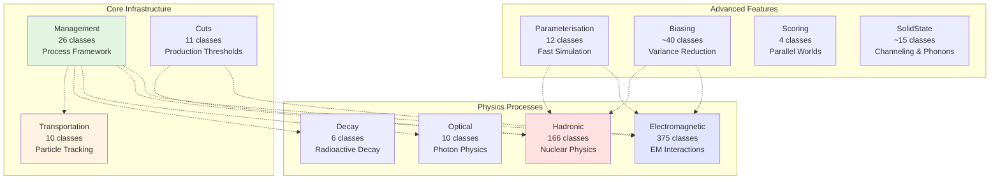
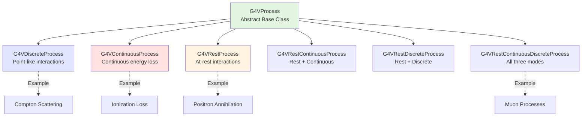

# Processes Module

## Overview

The Processes module is the largest and most complex component of Geant4, encompassing over 1,900 classes across 11 major sub-modules. It provides the complete infrastructure for defining and managing all physics interactions in particle simulations. This module implements the physical processes that govern how particles interact with matter, from electromagnetic interactions to nuclear reactions, optical photon transport, and specialized phenomena.

::: tip Module Location
**Source:** `source/processes/`
**Headers:** `source/processes/*/include/`
**Size:** 1,939 header files, ~1,828 source files across 11 major sub-modules
:::

## Purpose and Scope

The Processes module serves as the physics engine of Geant4, providing:

- **Process Framework**: Core infrastructure for defining and managing all physics processes
- **Electromagnetic Physics**: Complete EM interaction suite (ionization, bremsstrahlung, scattering, etc.)
- **Hadronic Physics**: Nuclear interactions, fission, capture, and hadronic models
- **Transportation**: Particle propagation through geometry with field tracking
- **Optical Physics**: Photon boundary interactions, absorption, scattering, wavelength shifting
- **Decay Processes**: Radioactive decay and unstable particle decay
- **Fast Simulation**: Parameterized shower models for performance optimization
- **Variance Reduction**: Biasing and importance sampling techniques
- **Production Cuts**: Energy threshold management for secondary particle production
- **Specialized Physics**: Solid-state effects (channeling, phonons)

## Architecture

### Module Organization

The Processes module is organized into 11 major sub-modules, each handling a specific physics domain:



### Process Type Hierarchy

All physics processes in Geant4 inherit from the base `G4VProcess` class and are categorized by when they act:



### Process Types

Processes are categorized by physics domain using `G4ProcessType` enumeration:

| Process Type | Description | Examples |
|--------------|-------------|----------|
| `fTransportation` | Particle transport through geometry | G4Transportation |
| `fElectromagnetic` | EM interactions | Ionization, Bremsstrahlung, Compton |
| `fOptical` | Optical photon physics | Boundary, Absorption, Rayleigh |
| `fHadronic` | Nuclear interactions | Elastic, Inelastic, Capture, Fission |
| `fDecay` | Particle decay | Radioactive decay, unstable particles |
| `fParameterisation` | Fast simulation | Shower parameterization |
| `fGeneral` | General processes | Step limiters |
| `fUserDefined` | Custom user processes | User extensions |
| `fParallel` | Parallel world processes | Scoring geometries |
| `fPhonon` | Solid-state phonons | Crystal lattice vibrations |
| `fUCN` | Ultra-cold neutrons | UCN physics |

## Core Components

### 1. Management Sub-Module

**Location:** `source/processes/management/`
**Purpose:** Provides the foundational framework for all physics processes

#### Key Classes

- **[G4VProcess](./api/g4vprocess.md)** - Abstract base class for all processes
  - Defines DoIt methods (AtRest, AlongStep, PostStep)
  - Physical interaction length calculations
  - Process activation/deactivation

- **[G4ProcessManager](./api/g4processmanager.md)** - Manages processes for each particle type
  - Associates processes with particle definitions
  - Orders process execution
  - Handles process activation states

- **[G4ProcessTable](./api/g4processtable.md)** - Global process registry (singleton)
  - Maintains table of all instantiated processes
  - Provides process lookup by name or type
  - Process activation control across particles

- **Process Type Variants:**
  - `G4VDiscreteProcess` - Discrete interactions (well-defined mean free path)
  - `G4VContinuousProcess` - Continuous processes (energy loss along track)
  - `G4VRestProcess` - At-rest processes (particle decay, annihilation)
  - Combined variants for processes with multiple modes

**File:** `source/processes/management/include/*.hh`

---

### 2. Electromagnetic Sub-Module

**Location:** `source/processes/electromagnetic/`
**Size:** 375 header files across 10 sub-categories
**Purpose:** Complete suite of electromagnetic interaction physics

#### Sub-Categories

##### Standard EM (85 classes)
Core electromagnetic processes for all charged particles and photons:

- **Ionization:** Energy loss through atomic ionization
  - `G4eIonisation` - Electron ionization (source/processes/electromagnetic/standard/include/G4eIonisation.hh:1)
  - `G4hIonisation` - Hadron ionization
  - `G4MuIonisation` - Muon ionization

- **Bremsstrahlung:** Photon emission by charged particles
  - `G4eBremsstrahlung` - Electron bremsstrahlung
  - `G4MuBremsstrahlung` - Muon bremsstrahlung

- **Multiple Scattering:** Cumulative small-angle Coulomb scattering
  - `G4eMultipleScattering` - Electron/positron MS
  - `G4hMultipleScattering` - Hadron MS
  - `G4UrbanMscModel` - Urban MSC model
  - `G4WentzelVIModel` - Wentzel VI model

- **Photon Processes:**
  - `G4PhotoElectricEffect` - Photoelectric absorption
  - `G4ComptonScattering` - Compton scattering
  - `G4GammaConversion` - Pair production
  - `G4RayleighScattering` - Coherent scattering

##### Low Energy EM
Physics models optimized for low-energy regime (< ~100 keV):
- Livermore models for electrons, photons, positrons
- Penelope models with improved accuracy
- Detailed atomic shell structure

##### High Energy EM
Models for TeV-scale and beyond:
- High-energy ionization with correct radiative corrections
- Final State Radiation (FSR)
- LPM effect for bremsstrahlung and pair production

##### Muon Physics
Specialized muon interaction processes:
- Muon ionization with Bethe-Bloch
- Muon pair production
- Muon bremsstrahlung
- Muon nuclear interactions

##### DNA Physics (7 sub-modules)
Detailed track-structure models for radiation biology:
- DNA damage modeling
- Water radiolysis
- Molecular interactions
- Various physics models (Geant4-DNA, CPA100, etc.)

##### Adjoint EM (~20 classes)
Reverse Monte Carlo for importance sampling:
- Adjoint tracking for all EM processes
- Used for detector optimization and shielding studies

##### Utils, Polarization, X-rays, PII
Support classes and specialized EM physics:
- `G4EmParameters` - Global EM physics parameters
- Polarized photon/electron physics
- X-ray fluorescence and Auger emission
- Positron-induced interactions

---

### 3. Hadronic Sub-Module

**Location:** `source/processes/hadronic/`
**Size:** 166 header files across 6 major categories
**Purpose:** Nuclear and hadronic interaction physics

#### Sub-Categories

##### Management
Core hadronic framework:
- `G4HadronicProcess` - Base class for hadronic processes
- `G4HadronicInteraction` - Base for physics models
- `G4HadronicProcessStore` - Process registry and cross-section management
- `G4EnergyRangeManager` - Coordinates models by energy range

##### Processes
Actual hadronic interaction processes:
- `G4HadronElasticProcess` - Elastic scattering
- `G4HadronInelasticProcess` - Inelastic interactions
- `G4NeutronCaptureProcess` - Neutron capture
- `G4NeutronFissionProcess` - Fission
- `G4NeutronGeneralProcess` - Unified neutron process (optimization)
- Lepton-nuclear processes (electron, muon, tau, neutrino)

##### Cross Sections
Cross-section data management:
- `G4CrossSectionDataStore` - Multi-dataset management
- Particle-specific cross-section implementations
- Interface to evaluated nuclear data libraries (ENDF, TENDL, etc.)

##### Models (23 sub-directories!)
Extensive collection of physics models covering different energy regimes:

- **Cascade Models:**
  - Binary Cascade - Intra-nuclear cascade
  - BERT (Bertini) - Default cascade model

- **String Models:**
  - QGSM (Quark-Gluon String Model)
  - FTF (Fritiof)
  - String fragmentation/hadronization

- **Pre-Equilibrium:**
  - Exciton model for pre-compound emission

- **De-excitation (8 sub-modules):**
  - Evaporation
  - Fermi break-up
  - Fission
  - Photon evaporation (gamma de-excitation)
  - Multi-fragmentation

- **High-Precision Neutron:**
  - Particle_hp - High-precision neutron data (thermal to 20 MeV)
  - LEND - Low Energy Nuclear Data

- **Advanced Models:**
  - INCLXX - Liège Intranuclear Cascade
  - QMD - Quantum Molecular Dynamics
  - ABLA - Ablation-evaporation model

- **Specialized:**
  - Gamma-nuclear (photonuclear)
  - Lepto-nuclear (lepton-nucleus)
  - Coherent elastic scattering
  - Radioactive decay (via hadronic framework)

##### Stopping
Stopping power for heavy ions:
- Energy loss calculations for ions in matter

##### Utilities
Helper classes for hadronic physics calculations

---

### 4. Transportation Sub-Module

**Location:** `source/processes/transportation/`
**Size:** 10 classes
**Purpose:** Particle propagation through detector geometry

#### Key Classes

- **G4Transportation** - Main transportation process (source/processes/transportation/include/G4Transportation.hh:1)
  - Moves particles through geometry boundaries
  - Handles magnetic/electric/gravitational fields
  - Computes geometric step length

- **G4CoupledTransportation** - Field tracking with improved accuracy
  - Tighter coupling with field propagation
  - Better handling of field non-uniformity

- **Utility Processes:**
  - `G4StepLimiter` - User-defined step size limits
  - `G4UserSpecialCuts` - Custom track killing criteria
  - `G4NeutronKiller` - Kills neutrons in specified regions
  - `G4TrackTerminator` - Terminates tracks meeting criteria

---

### 5. Optical Sub-Module

**Location:** `source/processes/optical/`
**Size:** 10 classes
**Purpose:** Optical photon physics and light transport

#### Key Processes

- **G4OpBoundaryProcess** - Optical surface interactions (source/processes/optical/include/G4OpBoundaryProcess.hh:1)
  - Reflection (specular, diffuse, spike, lobe)
  - Refraction with Snell's law
  - Total internal reflection
  - Surface models (glisur, unified, LUT Davis, dichroic)

- **G4OpAbsorption** - Photon absorption in materials
  - Wavelength-dependent absorption

- **G4OpRayleigh** - Rayleigh scattering
  - Molecular scattering (wavelength^-4 dependence)

- **G4OpMieHG** - Mie scattering
  - Henyey-Greenstein phase function
  - Aerosol and particle scattering

- **Wavelength Shifting:**
  - `G4OpWLS` - Primary wavelength shifting
  - `G4OpWLS2` - Secondary wavelength shifting
  - Configurable time profiles (delta, exponential)

---

### 6. Decay Sub-Module

**Location:** `source/processes/decay/`
**Size:** 6 classes
**Purpose:** Particle decay processes

#### Key Classes

- **G4Decay** - Standard particle decay (source/processes/decay/include/G4Decay.hh:1)
  - At-rest decay for stopped particles
  - In-flight decay for unstable particles
  - Uses particle decay tables

- **G4DecayWithSpin** - Spin-dependent decay
  - Preserves polarization through decay

- **G4UnknownDecay** - Handles unknown particle decay

- **G4PionDecayMakeSpin** - Pion decay with spin tracking

- **G4VExtDecayer** - Interface for external decay packages
  - Allows integration with specialized decay libraries (e.g., EvtGen, Pythia)

---

### 7. Parameterisation Sub-Module

**Location:** `source/processes/parameterisation/`
**Size:** 12 classes
**Purpose:** Fast simulation and shower parameterization

#### Key Components

- **G4VFastSimulationModel** - Base class for fast sim models (source/processes/parameterisation/include/G4VFastSimulationModel.hh:1)
  - User-defined trigger conditions
  - Custom physics implementation
  - Bypasses detailed tracking for speed

- **G4FastSimulationManager** - Regional fast sim management
  - Associates models with detector regions (envelopes)

- **G4GlobalFastSimulationManager** - Global coordinator (singleton)

- **G4FastSimulationManagerProcess** - Process wrapper for fast sim

- **Fast Simulation Support:**
  - `G4FastTrack` - Track information for fast models
  - `G4FastStep` - Step replacement in fast sim
  - `G4FastSimHitMaker` - Sensitive detector hit creation

---

### 8. Cuts Sub-Module

**Location:** `source/processes/cuts/`
**Size:** 11 classes
**Purpose:** Production cut (energy threshold) management

#### Key Classes

- **G4ProductionCuts** - Cut values per region (source/processes/cuts/include/G4ProductionCuts.hh:1)
  - Range cuts for gamma, e-, e+, proton
  - Can specify energy or range cuts

- **G4ProductionCutsTable** - Global cuts registry (singleton)
  - Maintains all production cuts
  - Converts range to energy for each material

- **G4MaterialCutsCouple** - Material-cuts association
  - Couples material with production cuts
  - Used for efficient process lookup

- **Range-to-Energy Converters:**
  - `G4RToEConvForElectron` - Electron range conversion
  - `G4RToEConvForGamma` - Photon range conversion
  - `G4RToEConvForPositron` - Positron range conversion
  - `G4RToEConvForProton` - Proton range conversion

---

### 9. Biasing Sub-Module

**Location:** `source/processes/biasing/`
**Sub-directories:** management, generic, importance
**Size:** ~40 classes
**Purpose:** Variance reduction and importance sampling

#### Sub-Categories

##### Generic Biasing
Flexible biasing framework:
- **G4BiasingProcessInterface** - Wraps standard processes for biasing
- **Biasing Operations:**
  - `G4BOptnChangeCrossSection` - Modify interaction cross-sections
  - `G4BOptnForceCollision` - Force interactions in regions
  - `G4BOptnCloning` - Split particles (Russian Roulette)
  - `G4BOptnForceFreeFlight` - Force particles through regions

- **Biasing Operators:**
  - User-defined biasing strategies
  - Region-specific bias application

##### Importance Sampling
Geometry-based importance:
- **G4GeometrySampler** - Sets up importance sampling
- **G4ImportanceProcess** - Weight window technique
- Automatic particle splitting/killing based on importance

##### Management
Core biasing infrastructure and interfaces

---

### 10. Scoring Sub-Module

**Location:** `source/processes/scoring/`
**Size:** 4 classes
**Purpose:** Parallel world geometries for scoring

#### Key Classes

- **G4ParallelWorldProcess** - Parallel geometry navigation (source/processes/scoring/include/G4ParallelWorldProcess.hh:1)
  - Navigates mass + parallel geometries simultaneously
  - Allows scoring without affecting physics

- **G4ParallelWorldScoringProcess** - Dedicated scoring process

- **G4ScoreSplittingProcess** - Score with particle splitting

- **G4ParallelWorldProcessStore** - Registry for parallel processes

---

### 11. SolidState Sub-Module

**Location:** `source/processes/solidstate/`
**Sub-directories:** channeling, phonon
**Size:** ~15 classes
**Purpose:** Solid-state physics effects

#### Sub-Categories

##### Channeling
Particle channeling in crystalline materials:
- **G4Channeling** - Channeling process
- **G4ChannelingECHARM** - ECHARM channeling model
- Crystal lattice navigation
- Channeling radiation
- Dechanneling processes

##### Phonon
Phonon interactions in crystals:
- Crystal lattice vibrations
- Phonon scattering
- Low-temperature solid-state physics

---

## Process Execution Model

### The DoIt / GPIL Framework

Every process in Geant4 implements a dual interface:

#### DoIt Methods
Perform the actual physics interaction:
- **AtRestDoIt()** - Called when particle is at rest
- **AlongStepDoIt()** - Called along every step
- **PostStepDoIt()** - Called at the end of a step

#### GPIL Methods
Calculate physical interaction length (when the process wants to act):
- **AtRestGetPhysicalInteractionLength()** - Returns time until at-rest interaction
- **AlongStepGetPhysicalInteractionLength()** - Returns step length constraint
- **PostStepGetPhysicalInteractionLength()** - Returns distance to next discrete interaction

### Process Ordering

The `G4ProcessManager` maintains three ordered lists:
1. **AtRest processes** - Ordered list for at-rest interactions
2. **AlongStep processes** - All processes contribute along each step
3. **PostStep processes** - Ordered list for post-step point interactions

Example ordering for an electron:
```
AlongStep processes:
  [0] G4eMultipleScattering
  [1] G4eIonisation
  [2] G4eBremsstrahlung

PostStep processes:
  [0] G4eMultipleScattering
  [1] G4eIonisation
  [2] G4eBremsstrahlung
  [3] G4StepLimiter
```

---

## Thread Safety

### Multi-Threading Support

The Processes module is designed for Geant4's multi-threaded mode:

- **Shared Read-Only Data:**
  - Cross-section tables
  - Physics tables
  - Process definitions

- **Thread-Local Data:**
  - Process state (interaction lengths, step information)
  - Random number states
  - Particle changes

- **Process Managers:**
  - Each thread has its own `G4ProcessManager` instances
  - Processes are cloned per thread
  - Worker threads share cross-section data

---

## Integration with Other Modules

The Processes module integrates tightly with:

- **[Track Module](../track/)** - Provides G4Track and G4Step for process execution
- **[Particles Module](../particles/)** - Process applicability defined per particle
- **[Materials Module](../materials/)** - Cross-sections and stopping powers depend on material properties
- **[Geometry Module](../geometry/)** - Transportation uses geometry navigation
- **[Tracking Module](../tracking/)** - Tracking manager orchestrates process execution
- **[Run Module](../run/)** - Physics lists built and initialized in run manager

---

## Usage Examples

### Defining a Custom Process

```cpp
#include "G4VDiscreteProcess.hh"

class MyCustomProcess : public G4VDiscreteProcess
{
public:
    MyCustomProcess(const G4String& name = "MyProcess")
        : G4VDiscreteProcess(name, fUserDefined)
    {
        // Initialize process
    }

    // Determine if process applies to this particle
    virtual G4bool IsApplicable(const G4ParticleDefinition& particle) override
    {
        return (particle.GetPDGCharge() != 0.0); // Only charged particles
    }

    // Calculate mean free path
    virtual G4double GetMeanFreePath(const G4Track& track,
                                     G4double previousStepSize,
                                     G4ForceCondition* condition) override
    {
        // Return interaction length in mm
        return 10.0 * CLHEP::cm;
    }

    // Perform the interaction
    virtual G4VParticleChange* PostStepDoIt(const G4Track& track,
                                            const G4Step& step) override
    {
        // Modify particle or create secondaries
        aParticleChange.Initialize(track);
        // ... physics implementation ...
        return &aParticleChange;
    }
};
```

### Registering a Process

```cpp
// In physics list or particle construction

G4ProcessManager* pManager = particle->GetProcessManager();

// Add custom process
MyCustomProcess* myProcess = new MyCustomProcess();
pManager->AddDiscreteProcess(myProcess);

// Or add with specific ordering
pManager->AddProcess(myProcess);
pManager->SetProcessOrdering(myProcess, idxPostStep, 1);  // Second in PostStep list
```

### Accessing Process Information

```cpp
// Get process manager for a particle
G4ParticleDefinition* electron = G4Electron::Definition();
G4ProcessManager* pm = electron->GetProcessManager();

// Get process list
G4ProcessVector* processList = pm->GetProcessList();
for (size_t i = 0; i < processList->size(); ++i) {
    G4VProcess* process = (*processList)[i];
    G4cout << "Process: " << process->GetProcessName()
           << ", Type: " << process->GetProcessType() << G4endl;
}

// Find specific process
G4VProcess* ionization = pm->GetProcess("eIoni");
if (ionization) {
    // Process exists for this particle
}
```

### Setting Production Cuts

```cpp
// Set production cuts for a region
G4Region* region = G4RegionStore::GetInstance()->GetRegion("DetectorRegion");
G4ProductionCuts* cuts = new G4ProductionCuts();

// Set range cuts (converted to energy automatically)
cuts->SetProductionCut(1.0*mm, "gamma");
cuts->SetProductionCut(0.1*mm, "e-");
cuts->SetProductionCut(0.1*mm, "e+");
cuts->SetProductionCut(0.1*mm, "proton");

region->SetProductionCuts(cuts);
```

---

## Performance Considerations

### Process Performance

1. **Process Count:** Minimize number of processes per particle
   - Each process adds overhead to step calculation
   - Use combined processes where possible (e.g., `G4NeutronGeneralProcess`)

2. **Cross-Section Tables:**
   - Pre-built during initialization
   - Stored in `G4PhysicsTable` for fast lookup
   - Lambda tables cache inverse mean free paths

3. **Production Cuts:**
   - Higher cuts = faster simulation (fewer secondaries)
   - Region-specific cuts optimize performance
   - Balance accuracy vs. speed based on detector region

4. **Fast Simulation:**
   - Parameterize EM showers in calorimeters
   - Can speed up simulation by 10-100x for appropriate use cases
   - Trade detailed tracking for parameterized response

### Memory Optimization

- **Sharing Tables:** Physics tables shared across threads (read-only)
- **On-Demand Loading:** Some data (e.g., cross-sections) loaded only when needed
- **Table Compression:** Energy binning optimized to balance accuracy and memory

---

## Common Patterns

### Process Activation/Deactivation

```cpp
// Deactivate a process globally
G4ProcessTable* processTable = G4ProcessTable::GetProcessTable();
G4VProcess* process = processTable->FindProcess("msc", "e-");
if (process) {
    process->SetProcessActivation(false);  // Deactivate multiple scattering
}

// Activate process for specific particle
G4ProcessManager* pm = G4Electron::Definition()->GetProcessManager();
G4VProcess* brems = pm->GetProcess("eBrem");
pm->SetProcessActivation(brems, true);
```

### Custom Physics Lists

```cpp
class MyPhysicsList : public G4VUserPhysicsList
{
protected:
    virtual void ConstructProcess() override
    {
        // Add transportation (mandatory)
        AddTransportation();

        // Add EM processes
        ConstructEM();

        // Add hadronic processes
        ConstructHadronic();

        // Add decay
        ConstructDecay();
    }

    void ConstructEM()
    {
        // Iterate over all particles
        auto particleIterator = GetParticleIterator();
        particleIterator->reset();

        while ((*particleIterator)()) {
            G4ParticleDefinition* particle = particleIterator->value();
            G4ProcessManager* pm = particle->GetProcessManager();
            G4String particleName = particle->GetParticleName();

            if (particleName == "e-") {
                // Add electron processes
                pm->AddProcess(new G4eMultipleScattering(), -1, 1, 1);
                pm->AddProcess(new G4eIonisation(),        -1, 2, 2);
                pm->AddProcess(new G4eBremsstrahlung(),    -1, 3, 3);
            }
            // ... more particles ...
        }
    }
};
```

---

## Best Practices

### Process Development

1. **Inherit from Appropriate Base:**
   - Use `G4VDiscreteProcess` for point-like interactions
   - Use `G4VContinuousProcess` for continuous energy loss
   - Use combined classes when needed

2. **Implement All Required Methods:**
   - `IsApplicable()` - Define particle applicability
   - `GetPhysicalInteractionLength()` - Calculate when process acts
   - `DoIt()` - Implement the physics

3. **Use Particle Change Correctly:**
   - Initialize from track: `aParticleChange.Initialize(track)`
   - Set energy/momentum changes
   - Add secondary particles
   - Set track status if needed

4. **Thread Safety:**
   - No static mutable data
   - Use thread-local storage for state
   - Ensure const-correctness for shared data

### Physics List Configuration

1. **Use Reference Physics Lists:**
   - Start with `FTFP_BERT`, `QGSP_BERT`, etc.
   - Modify only as needed
   - Document changes

2. **Set Appropriate Cuts:**
   - Default: 1 mm range cut
   - Tracking volume: lower cuts (0.1 mm or less)
   - Shielding: higher cuts (10 cm) for speed

3. **Enable Only Needed Physics:**
   - Don't activate unused physics (saves memory/time)
   - Use modular physics constructors

---

## Module Statistics

| Category | Count | Purpose |
|----------|-------|---------|
| **Total Header Files** | 1,939 | Complete process library |
| **Total Source Files** | 1,828 | Implementation |
| **Sub-Modules** | 11 | Major physics categories |
| **Process Types** | 11 | Type classification |
| **Base Classes** | 7 | Process type hierarchy |

### Sub-Module Breakdown

| Sub-Module | Headers | Description |
|------------|---------|-------------|
| Management | 26 | Core process framework |
| Electromagnetic | 375 | EM physics (10 sub-categories) |
| Hadronic | 166 | Nuclear physics (6 sub-categories) |
| Transportation | 10 | Particle tracking |
| Optical | 10 | Optical photon physics |
| Biasing | ~40 | Variance reduction |
| SolidState | ~15 | Channeling & phonons |
| Parameterisation | 12 | Fast simulation |
| Cuts | 11 | Production thresholds |
| Decay | 6 | Particle decay |
| Scoring | 4 | Parallel worlds |

---

## Related Documentation

- [**Management API**](./management/) - Core process framework classes
- [**Electromagnetic API**](./electromagnetic/) - EM physics processes
- [**Hadronic API**](./hadronic/) - Nuclear interaction processes
- [**Track Module**](../track/) - Track and step data structures
- [**Particles Module**](../particles/) - Particle definitions
- [**Materials Module**](../materials/) - Material properties for cross-sections

---

## Build System Integration

The Processes module is built as multiple CMake targets:

```cmake
# Core
G4procman        # Management
G4cuts           # Production cuts
G4transportation # Transportation

# EM
G4emstandard     # Standard EM
G4emlowenergy    # Low-energy EM
G4emhighenergy   # High-energy EM
G4emdna-*        # DNA physics (multiple targets)
G4emutils        # EM utilities

# Hadronic
G4hadronic_mgt          # Hadronic management
G4hadronic_proc         # Hadronic processes
G4hadronic_xsect        # Cross sections
G4hadronic_* (models)   # Physics models (many targets)

# Other
G4optical        # Optical processes
G4decay          # Decay processes
G4biasing_*      # Biasing (management, generic, importance)
G4solidstate_*   # Channeling, phonons
G4parameterisation  # Fast simulation
G4scoring        # Scoring processes
```

---

## Historical Notes

The Processes module has evolved significantly:

- **Early Geant4:** Simple process framework with basic EM and hadronic physics
- **Geant4 7.x:** Introduction of low-energy EM physics
- **Geant4 9.x:** Major hadronic physics expansion, DNA physics addition
- **Geant4 10.x:** Unified optical process, multi-threading support
- **Geant4 11.x:** Neutron general process optimization, enhanced DNA physics

---

::: tip Next Steps
- Explore [Management sub-module](./management/) for core process framework
- See [Electromagnetic processes](./electromagnetic/) for EM physics
- Review [Hadronic processes](./hadronic/) for nuclear interactions
- Check [Track module](../track/) for track/step data used by processes
:::

---

::: info Last Updated
**Date:** 2025-11-17
**Module Version:** Geant4 11.4.0.beta
**Status:** Comprehensive overview complete
:::
