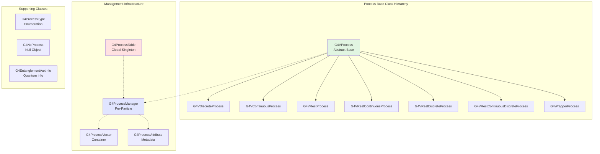
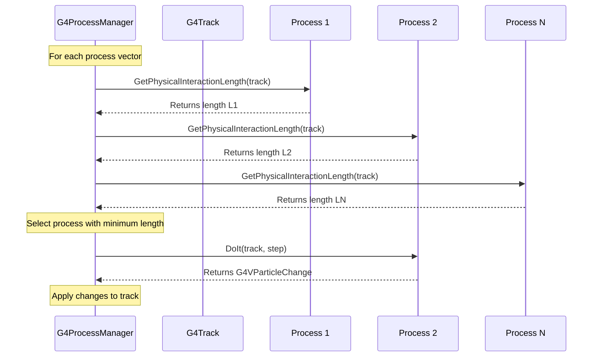

# Processes Management Sub-Module

## Overview

The Management sub-module provides the foundational framework for all physics processes in Geant4. It defines the abstract base classes, process lifecycle management, registration mechanisms, and the infrastructure that enables the process execution model throughout the simulation.

::: tip Module Location
**Source:** `source/processes/management/`
**Headers:** `source/processes/management/include/`
**Size:** 22 header files
:::

## Purpose

The Management sub-module serves as the backbone of the entire Processes module:

- **Process Base Classes**: Abstract interfaces defining process behavior
- **Process Management**: Per-particle process registration and ordering
- **Global Registry**: Centralized process table for lookup and control
- **Process Type System**: Classification and categorization of processes
- **Lifecycle Management**: Process initialization, execution, and cleanup
- **Multi-Threading Support**: Master/worker process architecture

---

## Architecture

### Core Components



### Process Execution Flow



---

## Key Classes

### Core Framework

#### [G4VProcess](./api/g4vprocess.md)
**Abstract base class for all physics processes**

The fundamental interface that all physics processes must implement. Defines the DoIt/GPIL execution model.

**Key Methods:**
- `PostStepDoIt()` / `PostStepGetPhysicalInteractionLength()` - Discrete interactions
- `AlongStepDoIt()` / `AlongStepGetPhysicalInteractionLength()` - Continuous processes
- `AtRestDoIt()` / `AtRestGetPhysicalInteractionLength()` - At-rest processes
- `IsApplicable()` - Defines particle applicability
- `BuildPhysicsTable()` - Constructs cross-section tables

**Usage:** Never instantiated directly; always subclassed.

**File:** `source/processes/management/include/G4VProcess.hh`

---

#### [G4ProcessManager](./api/g4processmanager.md)
**Manages all processes for a single particle type**

Each `G4ParticleDefinition` has one `G4ProcessManager` that maintains ordered lists of all applicable processes.

**Key Responsibilities:**
- **Process Registration**: Add processes to particle
- **Ordering Management**: Control process execution order
- **Process Vectors**: Maintain separate lists for AtRest, AlongStep, PostStep
- **Process Lookup**: Find processes by name or type

**Key Methods:**
- `AddProcess()` - Register a process with ordering
- `AddDiscreteProcess()`, `AddContinuousProcess()`, `AddRestProcess()` - Convenience methods
- `GetProcessList()` - Retrieve all processes
- `SetProcessOrdering()` - Control execution order
- `GetProcess()` - Find process by name

**Usage:** Automatically created for each particle definition.

**File:** `source/processes/management/include/G4ProcessManager.hh`

---

#### [G4ProcessTable](./api/g4processtable.md)
**Global registry of all processes (Singleton)**

Maintains a global table of all process instances across all particles, providing centralized control and lookup.

**Key Responsibilities:**
- **Global Registry**: Track all instantiated processes
- **Process Lookup**: Find processes by name, type, or particle
- **Activation Control**: Enable/disable processes globally
- **Diagnostic Tools**: Dump process information

**Key Methods:**
- `GetProcessTable()` - Get singleton instance
- `FindProcess()` - Lookup by name and particle
- `SetProcessActivation()` - Enable/disable processes
- `DumpInfo()` - Print process table

**Usage:** Accessed via singleton pattern for global process operations.

**File:** `source/processes/management/include/G4ProcessTable.hh`

---

### Process Type Base Classes

These provide concrete implementations of the DoIt/GPIL model for specific process patterns:

#### G4VDiscreteProcess
**Base class for point-like interactions**

For processes that occur at discrete points (well-defined mean free path):
- Only `PostStepDoIt()` and `PostStepGPIL()` are active
- Examples: Compton scattering, photoelectric effect, hadronic interactions

**File:** `source/processes/management/include/G4VDiscreteProcess.hh`

---

#### G4VContinuousProcess
**Base class for continuous energy loss**

For processes that act continuously along the track:
- Only `AlongStepDoIt()` and `AlongStepGPIL()` are active
- Examples: Ionization energy loss (continuous approximation)

**File:** `source/processes/management/include/G4VContinuousProcess.hh`

---

#### G4VRestProcess
**Base class for at-rest processes**

For processes that occur when particles are at rest:
- Only `AtRestDoIt()` and `AtRestGPIL()` are active
- Examples: Positron annihilation, radioactive decay (at rest)

**File:** `source/processes/management/include/G4VRestProcess.hh`

---

#### G4VRestContinuousProcess
**Combined rest + continuous process**

For processes with both at-rest and along-step components:
- `AtRestDoIt()`, `AtRestGPIL()`, `AlongStepDoIt()`, `AlongStepGPIL()` active

**File:** `source/processes/management/include/G4VRestContinuousProcess.hh`

---

#### G4VRestDiscreteProcess
**Combined rest + discrete process**

For processes with both at-rest and post-step components:
- `AtRestDoIt()`, `AtRestGPIL()`, `PostStepDoIt()`, `PostStepGPIL()` active
- Example: Particle decay (can decay in-flight or at rest)

**File:** `source/processes/management/include/G4VRestDiscreteProcess.hh`

---

#### G4VRestContinuousDiscreteProcess
**Combined rest + continuous + discrete process**

For processes with all three modes active:
- All six methods (`AtRest`, `AlongStep`, `PostStep` × `DoIt`/`GPIL`) are active
- Example: Some muon processes

**File:** `source/processes/management/include/G4VRestContinuousDiscreteProcess.hh`

---

### Supporting Classes

#### G4ProcessVector
**Container for process collections**

A specialized container (vector) for storing and managing collections of processes.

**Features:**
- Ordered storage of process pointers
- Vector-style interface
- Used by `G4ProcessManager` for process lists

**File:** `source/processes/management/include/G4ProcessVector.hh`

---

#### G4ProcessAttribute
**Process metadata and state**

Stores metadata about a process registered with a process manager:
- Ordering parameters for AtRest, AlongStep, PostStep
- Activation status
- Process categorization

**File:** `source/processes/management/include/G4ProcessAttribute.hh`

---

#### G4ProcessType (Enumeration)
**Process classification by physics domain**

Enumerates the major process categories:

```cpp
enum G4ProcessType {
    fNotDefined,
    fTransportation,
    fElectromagnetic,
    fOptical,
    fHadronic,
    fPhotolepton_hadron,
    fDecay,
    fGeneral,
    fParameterisation,
    fUserDefined,
    fParallel,
    fPhonon,
    fUCN
};
```

**File:** `source/processes/management/include/G4ProcessType.hh`

---

#### G4WrapperProcess
**Wrapper for modifying process behavior**

Allows wrapping an existing process to modify or extend its behavior without subclassing:
- Delegates DoIt/GPIL calls to wrapped process
- Can intercept and modify behavior
- Used for biasing and other advanced techniques

**File:** `source/processes/management/include/G4WrapperProcess.hh`

---

#### G4NoProcess
**Null object pattern for processes**

A concrete process that does nothing, implementing the null object pattern:
- Used as placeholder or default
- All DoIt methods return unchanged particle

**File:** `source/processes/management/include/G4NoProcess.hh`

---

#### G4EntanglementAuxInfo
**Quantum entanglement information**

Stores auxiliary information about quantum entanglement for processes involving entangled particles:
- Used for specialized quantum physics simulations
- Supports entangled particle pair tracking

**File:** `source/processes/management/include/G4EntanglementAuxInfo.hh`

---

#### G4VEntanglementClipBoard
**Base class for entanglement data storage**

Abstract interface for storing entanglement-related data:
- Clipboard pattern for passing entanglement information
- Specialized implementations for different entangled systems

**File:** `source/processes/management/include/G4VEntanglementClipBoard.hh`

---

#### G4eplusAnnihilationEntanglementClipBoard
**Entanglement clipboard for positron annihilation**

Specific implementation for tracking entangled photon pairs from positron annihilation:
- Stores correlations between two-gamma decay products
- Enables quantum correlation studies

**File:** `source/processes/management/include/G4eplusAnnihilationEntanglementClipBoard.hh`

---

### Messenger Classes

#### G4ProcessManagerMessenger
**UI commands for G4ProcessManager**

Provides interactive commands for controlling process managers.

**File:** `source/processes/management/include/G4ProcessManagerMessenger.hh`

---

#### G4ProcessTableMessenger
**UI commands for G4ProcessTable**

Provides interactive commands for global process table operations:
- `/process/list` - List all processes
- `/process/activate` - Activate process
- `/process/inactivate` - Deactivate process
- `/process/verbose` - Set verbosity

**File:** `source/processes/management/include/G4ProcessTableMessenger.hh`

---

## The DoIt / GPIL Execution Model

### Fundamental Concept

Every process in Geant4 operates using a dual-interface model:

1. **GPIL (Get Physical Interaction Length)**: How far can the particle travel before this process wants to act?
2. **DoIt (Do It)**: Perform the physics interaction.

### Three Process Modes

#### 1. AtRest
- **GPIL**: Returns time until interaction for stopped particle
- **DoIt**: Performs interaction when particle is at rest
- **Example**: Positron annihilation at rest

#### 2. AlongStep
- **GPIL**: Returns step length constraint for continuous process
- **DoIt**: Applies continuous changes along the step (always called!)
- **Example**: Continuous ionization energy loss

#### 3. PostStep
- **GPIL**: Returns distance to next discrete interaction
- **DoIt**: Performs discrete interaction at step end
- **Example**: Compton scattering

### Process Ordering

The `G4ProcessManager` maintains ordered lists for each mode:

```cpp
// Example: Electron process ordering
AtRest processes: (none)

AlongStep processes (ordered):
  [0] G4eMultipleScattering  - Order: 1
  [1] G4eIonisation          - Order: 2
  [2] G4eBremsstrahlung      - Order: 3

PostStep processes (ordered):
  [0] G4eMultipleScattering  - Order: 1
  [1] G4eIonisation          - Order: 2
  [2] G4eBremsstrahlung      - Order: 3
  [3] G4StepLimiter          - Order: 1000
```

**Ordering Rules:**
- Lower order number = executed first
- `ordDefault` = 1000 (default ordering)
- `ordLast` = 9999 (always last)
- `ordInActive` = -1 (process not in this vector)

---

## Multi-Threading Architecture

### Master/Worker Pattern

In multi-threaded mode, the process framework uses a master/worker pattern:

#### Master Thread
- Creates one instance of each process (master process)
- Builds shared physics tables
- Initializes cross-section data

#### Worker Threads
- Clone processes from master (worker processes)
- Share read-only physics tables
- Have independent process state (interaction lengths, etc.)

### Thread Safety

**Shared (Read-Only) Data:**
- Physics tables (cross-sections, stopping powers)
- Material properties
- Particle definitions

**Thread-Local Data:**
- Process state (`currentInteractionLength`, `theNumberOfInteractionLengthLeft`)
- Random number states
- `G4VParticleChange` objects

**Implementation Example:**

```cpp
void MyProcess::BuildWorkerPhysicsTable(const G4ParticleDefinition& part)
{
    // Worker threads can access master process tables
    if (this != GetMasterProcess()) {
        // Worker: use master's physics table
        const MyProcess* masterProcess =
            static_cast<const MyProcess*>(GetMasterProcess());
        thePhysicsTable = masterProcess->thePhysicsTable;
    }
    // Master thread already built the table
}
```

---

## Usage Patterns

### Defining a Custom Process

```cpp
#include "G4VDiscreteProcess.hh"
#include "G4Electron.hh"

class MyCustomProcess : public G4VDiscreteProcess
{
public:
    MyCustomProcess(const G4String& name = "MyProcess")
        : G4VDiscreteProcess(name, fUserDefined)
    {
        SetProcessSubType(100);  // Custom subtype
    }

    // Define which particles this process applies to
    virtual G4bool IsApplicable(const G4ParticleDefinition& particle) override
    {
        return (&particle == G4Electron::Definition());
    }

    // Build physics tables (if needed)
    virtual void BuildPhysicsTable(const G4ParticleDefinition& particle) override
    {
        // Build cross-section tables, stopping powers, etc.
    }

    // Calculate mean free path
    virtual G4double GetMeanFreePath(const G4Track& track,
                                     G4double previousStepSize,
                                     G4ForceCondition* condition) override
    {
        // Calculate interaction length based on track properties
        const G4Material* material = track.GetMaterial();
        G4double energy = track.GetKineticEnergy();

        // Your physics model here
        G4double lambda = CalculateLambda(material, energy);

        *condition = NotForced;  // or Forced for must-happen processes
        return lambda;
    }

    // Perform the interaction
    virtual G4VParticleChange* PostStepDoIt(const G4Track& track,
                                            const G4Step& step) override
    {
        // Initialize particle change
        aParticleChange.Initialize(track);

        // Modify primary particle
        G4double newEnergy = /* ... */;
        aParticleChange.ProposeEnergy(newEnergy);

        // Create secondaries (if any)
        G4DynamicParticle* secondary = /* ... */;
        aParticleChange.AddSecondary(secondary);

        return &aParticleChange;
    }
};
```

### Registering a Process with a Particle

```cpp
// In physics list construction

void MyPhysicsList::ConstructProcess()
{
    // Create process instance
    MyCustomProcess* myProc = new MyCustomProcess();

    // Get process manager for electron
    G4ProcessManager* pManager = G4Electron::Definition()->GetProcessManager();

    // Add as discrete process (appears only in PostStep vector)
    pManager->AddDiscreteProcess(myProc);

    // Or add with explicit ordering control
    pManager->AddProcess(myProc);
    pManager->SetProcessOrdering(myProc, idxPostStep, 2);  // Second in PostStep
}
```

### Accessing Process Information

```cpp
// Get process manager for a particle
G4ParticleDefinition* electron = G4Electron::Definition();
G4ProcessManager* pm = electron->GetProcessManager();

// List all processes for this particle
G4ProcessVector* processVector = pm->GetProcessList();
G4cout << "Processes for " << electron->GetParticleName() << ":" << G4endl;
for (size_t i = 0; i < processVector->size(); ++i) {
    G4VProcess* process = (*processVector)[i];
    G4cout << "  [" << i << "] " << process->GetProcessName()
           << " (Type: " << process->GetProcessType() << ")" << G4endl;
}

// Find a specific process
G4VProcess* ionization = pm->GetProcess("eIoni");
if (ionization) {
    G4cout << "Found ionization process" << G4endl;
}

// Get processes for a specific mode
G4ProcessVector* postStepProcs = pm->GetPostStepProcessVector();
G4cout << "PostStep processes: " << postStepProcs->size() << G4endl;
```

### Using G4ProcessTable for Global Operations

```cpp
// Get the global process table
G4ProcessTable* processTable = G4ProcessTable::GetProcessTable();

// Find a process globally
G4VProcess* msc = processTable->FindProcess("msc", "e-");
if (msc) {
    // Deactivate multiple scattering for electrons
    msc->SetProcessActivation(false);
}

// List all instances of a process across all particles
G4ProcessVector* allIonization =
    processTable->FindProcesses("Ionisation");  // Partial name match

// Dump full process table
processTable->DumpInfo();
```

---

## Best Practices

### Process Development

1. **Choose the Right Base Class:**
   - Discrete: Use `G4VDiscreteProcess` for point-like interactions
   - Continuous: Use `G4VContinuousProcess` for continuous energy loss
   - Rest: Use `G4VRestProcess` for at-rest processes
   - Combinations: Use combined classes only when necessary

2. **Implement IsApplicable Correctly:**
   - Return `true` only for particles the process applies to
   - Process will not be registered if `IsApplicable` returns `false`

3. **Build Physics Tables Efficiently:**
   - Pre-compute cross-sections/stopping powers in `BuildPhysicsTable()`
   - Store in `G4PhysicsTable` for fast interpolation
   - Share tables across threads in MT mode

4. **Handle Particle Changes Properly:**
   - Always initialize: `aParticleChange.Initialize(track)`
   - Set energy: `ProposeEnergy()` (final energy, not delta)
   - Set momentum: `ProposeMomentumDirection()`
   - Add secondaries with proper ownership transfer

5. **Thread Safety:**
   - No mutable static data
   - Use `GetMasterProcess()` to access shared data
   - Independent state per thread

### Process Registration

1. **Order Matters:**
   - Transportation should always be first in AlongStep
   - Multiple scattering typically before ionization
   - User limiters typically last

2. **Use Convenience Methods:**
   ```cpp
   AddDiscreteProcess(proc);     // Simpler than AddProcess with ordering
   AddContinuousProcess(proc);
   AddRestProcess(proc);
   ```

3. **Verify Registration:**
   - Check `GetProcessListLength()` after registration
   - Use `/process/list` command to verify

---

## Performance Considerations

### Process Overhead

- Each active process adds overhead to step calculation
- Minimize number of processes per particle
- Use combined processes where appropriate (e.g., `G4NeutronGeneralProcess`)

### Physics Table Size

- Balance table granularity vs. memory
- Use logarithmic binning for energy
- Consider material-specific tables

### AlongStep Optimization

- AlongStep processes called for EVERY step
- Keep `AlongStepDoIt()` very fast
- Pre-compute as much as possible

---

## Common Patterns

### Process Activation/Deactivation

```cpp
// Global deactivation
G4ProcessTable* table = G4ProcessTable::GetProcessTable();
table->SetProcessActivation("msc", "e-", false);

// Per-particle deactivation
G4ProcessManager* pm = G4Electron::Definition()->GetProcessManager();
G4VProcess* msc = pm->GetProcess("msc");
pm->SetProcessActivation(msc, false);
```

### Process Ordering Adjustment

```cpp
G4ProcessManager* pm = /* ... */;
G4VProcess* proc = /* ... */;

// Set ordering for PostStep
pm->SetProcessOrdering(proc, idxPostStep, 1);  // First

// Set ordering for AlongStep
pm->SetProcessOrdering(proc, idxAlongStep, 2); // Second

// Set to last
pm->SetProcessOrdering(proc, idxPostStep, ordLast);
```

---

## Module Statistics

| Category | Count |
|----------|-------|
| **Total Classes** | 22 |
| **Base Classes** | 7 (G4VProcess + 6 type variants) |
| **Management Classes** | 3 (Manager, Table, Vector) |
| **Support Classes** | 12 |

---

## Related Documentation

- [**Processes Module Overview**](../) - Parent module documentation
- [**G4VProcess API**](./api/g4vprocess.md) - Base class detailed documentation
- [**G4ProcessManager API**](./api/g4processmanager.md) - Process manager details
- [**G4ProcessTable API**](./api/g4processtable.md) - Global registry details
- [**Track Module**](../../track/) - Track and step data structures used by processes

---

## See Also

- **Electromagnetic Sub-Module**: EM physics implementations
- **Hadronic Sub-Module**: Nuclear physics implementations
- **Transportation Sub-Module**: Geometry navigation process
- **Particles Module**: Particle definitions that processes operate on

---

::: tip Next Steps
- Review [G4VProcess API documentation](./api/g4vprocess.md) for detailed method descriptions
- Explore [electromagnetic processes](../electromagnetic/) for concrete examples
- See [hadronic processes](../hadronic/) for nuclear interaction implementations
:::

---

::: info Last Updated
**Date:** 2025-11-17
**Module Version:** Geant4 11.4.0.beta
**Status:** Comprehensive overview complete
:::
