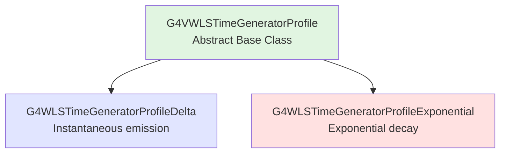

# G4VWLSTimeGeneratorProfile

## Overview

`G4VWLSTimeGeneratorProfile` is an abstract base class that defines the interface for generating emission time delays in wavelength-shifting processes. Concrete implementations provide different time profiles for WLS photon emission, enabling realistic simulation of fluorescence decay times.

::: tip Class Information
**Base Class Header:** `source/processes/optical/include/G4VWLSTimeGeneratorProfile.hh`
**Implementations:**
- `G4WLSTimeGeneratorProfileDelta.hh` - Instantaneous emission
- `G4WLSTimeGeneratorProfileExponential.hh` - Exponential decay
**Type:** Abstract interface for time profile generators
:::

## Purpose

Time generator profiles control when wavelength-shifted photons are emitted after absorption:

- **Delta Profile** - Instantaneous emission (no time delay)
- **Exponential Profile** - Realistic fluorescence decay (exponential distribution)

These profiles are used by both `G4OpWLS` and `G4OpWLS2` processes to add time delays that match the fluorescence lifetimes of real wavelength-shifting materials.

## Class Hierarchy



## Base Class: G4VWLSTimeGeneratorProfile

### Class Interface

#### Constructor

```cpp
G4VWLSTimeGeneratorProfile(const G4String& name);
```

**Parameters:**
- `name` - Profile name for identification

**Location:** Line 59 in G4VWLSTimeGeneratorProfile.hh

#### Destructor

```cpp
virtual ~G4VWLSTimeGeneratorProfile();
```

**Location:** Line 61

#### Pure Virtual Methods

These methods must be implemented by derived classes:

##### GenerateTime (with constant)

```cpp
virtual G4double GenerateTime(const G4double time_constant) = 0;
```

**Parameters:**
- `time_constant` - Decay time constant (e.g., from WLSTIMECONSTANT)

**Returns:** Time delay for photon emission

**Purpose:** Generate emission time using explicit time constant (line 63)

##### GenerateTime (with properties table)

```cpp
virtual G4double GenerateTime(const G4MaterialPropertiesTable*) = 0;
```

**Parameters:**
- Material properties table containing time constant

**Returns:** Time delay for photon emission

**Purpose:** Generate emission time from material properties (line 64)

## Derived Class: G4WLSTimeGeneratorProfileDelta

### Overview

Implements **instantaneous emission** (delta function in time).

::: tip Class Information
**Header:** `source/processes/optical/include/G4WLSTimeGeneratorProfileDelta.hh`
**Source:** `source/processes/optical/src/G4WLSTimeGeneratorProfileDelta.cc`
**Type:** Concrete implementation of G4VWLSTimeGeneratorProfile
:::

### Purpose

Use delta profile when:
- Timing information not critical
- Fast simulation needed
- WLS decay time negligible compared to other times
- Simplifying detector model

### Class Interface

#### Constructor

```cpp
explicit G4WLSTimeGeneratorProfileDelta(const G4String& name);
```

**Parameters:**
- `name` - Profile name (typically "delta")

**Location:** Line 53 in G4WLSTimeGeneratorProfileDelta.hh

#### Destructor

```cpp
virtual ~G4WLSTimeGeneratorProfileDelta();
```

**Location:** Line 55

#### GenerateTime Methods

```cpp
virtual G4double GenerateTime(const G4double time_constant) override;
virtual G4double GenerateTime(const G4MaterialPropertiesTable*) override;
```

**Returns:** Always returns **0.0** (instantaneous emission)

**Location:** Lines 57, 59

**Implementation:**
Both methods return 0.0 regardless of input, representing instantaneous emission.

### Usage Example

```cpp
// Using delta profile for fast simulation
G4OpWLS* wls = new G4OpWLS();
wls->UseTimeProfile("delta");  // Instantaneous emission

// Time constant in material properties is ignored
materialMPT->AddConstProperty("WLSTIMECONSTANT", 2.7*ns);  // Not used with delta
```

## Derived Class: G4WLSTimeGeneratorProfileExponential

### Overview

Implements **exponential decay** emission, matching the fluorescence behavior of real wavelength-shifting materials.

::: tip Class Information
**Header:** `source/processes/optical/include/G4WLSTimeGeneratorProfileExponential.hh`
**Source:** `source/processes/optical/src/G4WLSTimeGeneratorProfileExponential.cc`
**Type:** Concrete implementation of G4VWLSTimeGeneratorProfile
:::

### Purpose

Use exponential profile when:
- Timing resolution is important
- Modeling real WLS materials accurately
- Studying time-dependent phenomena
- Detector has fast timing requirements

### Physics Background

Real fluorescent materials exhibit exponential decay:

**Intensity vs Time:**
```
I(t) = I₀ × exp(-t/τ)
```

Where τ is the decay time constant (fluorescence lifetime).

**Probability Density Function:**
```
P(t) = (1/τ) × exp(-t/τ)
```

**Sampling:**
To generate random times from exponential distribution:
```
t = -τ × ln(ξ)
```
Where ξ is uniform random number in [0,1].

### Class Interface

#### Constructor

```cpp
explicit G4WLSTimeGeneratorProfileExponential(const G4String& name);
```

**Parameters:**
- `name` - Profile name (typically "exponential")

**Location:** Line 54 in G4WLSTimeGeneratorProfileExponential.hh

#### Destructor

```cpp
virtual ~G4WLSTimeGeneratorProfileExponential();
```

**Location:** Line 56

#### GenerateTime Methods

```cpp
virtual G4double GenerateTime(const G4double time_constant) override;
virtual G4double GenerateTime(const G4MaterialPropertiesTable*) override;
```

**Returns:** Random time sampled from exponential distribution

**Location:** Lines 58, 60

**Implementation:**
```cpp
time = -time_constant * std::log(G4UniformRand());
```

### Usage Example

```cpp
// Using exponential profile for realistic timing
G4OpWLS* wls = new G4OpWLS();
wls->UseTimeProfile("exponential");  // Exponential decay

// Time constant from material properties
materialMPT->AddConstProperty("WLSTIMECONSTANT", 2.7*ns);  // Used for sampling
```

## Complete Usage Examples

### Example 1: Comparing Time Profiles

```cpp
// Setup 1: Instantaneous emission (fast simulation)
void SetupFastWLS()
{
  G4OpWLS* wls = new G4OpWLS();
  wls->UseTimeProfile("delta");

  // Time constant defined but not used
  G4MaterialPropertiesTable* mpt = new G4MaterialPropertiesTable();
  mpt->AddConstProperty("WLSTIMECONSTANT", 5.0*ns);  // Ignored

  // All photons emitted at t = 0
}

// Setup 2: Realistic exponential decay
void SetupRealisticWLS()
{
  G4OpWLS* wls = new G4OpWLS();
  wls->UseTimeProfile("exponential");

  // Time constant used for exponential sampling
  G4MaterialPropertiesTable* mpt = new G4MaterialPropertiesTable();
  mpt->AddConstProperty("WLSTIMECONSTANT", 5.0*ns);  // Mean decay time

  // Photon emission times: t = -5.0*ln(random) ns
  // Mean emission time = 5.0 ns
  // Some photons immediate, some delayed up to ~20-30 ns
}
```

### Example 2: Fast vs Slow WLS Materials

```cpp
// Fast WLS material (short decay time)
G4MaterialPropertiesTable* fastWLSMPT = new G4MaterialPropertiesTable();

std::vector<G4double> energy = {2.0*eV, 2.5*eV, 3.0*eV, 3.5*eV};
std::vector<G4double> rindex = {1.58, 1.58, 1.58, 1.58};
fastWLSMPT->AddProperty("RINDEX", energy, rindex);

std::vector<G4double> wlsAbs = {10*m, 5*m, 0.5*mm, 0.1*mm};
fastWLSMPT->AddProperty("WLSABSLENGTH", energy, wlsAbs);

std::vector<G4double> wlsEmit = {0.0, 0.3, 1.0, 0.2};
fastWLSMPT->AddProperty("WLSCOMPONENT", energy, wlsEmit);

// Fast decay: 1.4 ns (typical for POPOP)
fastWLSMPT->AddConstProperty("WLSTIMECONSTANT", 1.4*ns);

fastWLSMaterial->SetMaterialPropertiesTable(fastWLSMPT);

// Slow WLS material (long decay time)
G4MaterialPropertiesTable* slowWLSMPT = new G4MaterialPropertiesTable();
// ... same optical properties ...

// Slow decay: 12 ns (typical for some green WLS)
slowWLSMPT->AddConstProperty("WLSTIMECONSTANT", 12.0*ns);

slowWLSMaterial->SetMaterialPropertiesTable(slowWLSMPT);

// Configure WLS process to use exponential profile
G4OpWLS* wls = new G4OpWLS();
wls->UseTimeProfile("exponential");
```

### Example 3: Analyzing Emission Times

```cpp
// In UserSteppingAction - record WLS emission times
void MySteppingAction::UserSteppingAction(const G4Step* step)
{
  const G4VProcess* process =
      step->GetPostStepPoint()->GetProcessDefinedStep();

  if (process && process->GetProcessName() == "OpWLS")
  {
    // Get absorption and emission times
    G4double absorptionTime = step->GetPreStepPoint()->GetGlobalTime();
    G4double emissionTime = step->GetPostStepPoint()->GetGlobalTime();
    G4double delay = emissionTime - absorptionTime;

    // Record delay distribution
    analysisManager->FillH1(1, delay/ns);  // Should show exponential

    // Also record position
    G4ThreeVector pos = step->GetPostStepPoint()->GetPosition();
    analysisManager->FillH3(2, pos.x(), pos.y(), pos.z());

    // Count events
    fWLSEventCount++;
    fTotalDelay += delay;
  }
}

// At end of run, verify mean delay matches time constant
void MyRunAction::EndOfRunAction(const G4Run*)
{
  G4double meanDelay = fTotalDelay / fWLSEventCount;
  G4cout << "Mean WLS delay: " << meanDelay/ns << " ns" << G4endl;
  G4cout << "Expected (WLSTIMECONSTANT): "
         << material->GetMaterialPropertiesTable()
              ->GetConstProperty("WLSTIMECONSTANT")/ns
         << " ns" << G4endl;
  // Should match within statistics
}
```

### Example 4: Time-Resolved Measurements

```cpp
// Simulating fast timing detector with WLS

// Material with moderate decay time
G4MaterialPropertiesTable* mpt = new G4MaterialPropertiesTable();
// ... optical properties ...
mpt->AddConstProperty("WLSTIMECONSTANT", 5.0*ns);

// Use exponential profile for timing study
G4OpWLS* wls = new G4OpWLS();
wls->UseTimeProfile("exponential");

// In analysis, create time-resolved spectrum
void AnalyzeTimeResolved()
{
  // Bin photons by arrival time at detector
  const G4int nTimeBins = 50;
  const G4double timeWindow = 50*ns;

  for (auto& hit : photonHits)
  {
    G4double arrivalTime = hit.time;
    G4int timeBin = (G4int)(arrivalTime / timeWindow * nTimeBins);

    if (timeBin < nTimeBins)
    {
      timeResolvedSpectrum[timeBin]->Fill(hit.wavelength);
    }
  }

  // Early time bins: prompt photons + fast WLS
  // Late time bins: slow WLS tail only
  // Shape reveals WLS decay time and transport time
}
```

### Example 5: Optimizing Detector Timing

```cpp
// Compare different WLS materials for timing resolution

struct WLSMaterial
{
  G4String name;
  G4double decayTime;
  G4double lightYield;  // Relative
};

std::vector<WLSMaterial> candidates = {
  {"FastWLS", 1.4*ns, 0.8},    // Fast but lower yield
  {"MediumWLS", 5.0*ns, 1.0},  // Balanced
  {"SlowWLS", 12.0*ns, 1.2}    // High yield but slow
};

// For each material, simulate and measure timing resolution
for (auto& wls : candidates)
{
  // Set up material
  G4MaterialPropertiesTable* mpt = CreateWLSProperties(wls);
  mpt->AddConstProperty("WLSTIMECONSTANT", wls.decayTime);

  // Simulate events
  RunSimulation(1000);

  // Analyze timing resolution
  G4double sigma = CalculateTimeResolution();

  G4cout << wls.name << ": "
         << "Decay = " << wls.decayTime/ns << " ns, "
         << "Yield = " << wls.lightYield << ", "
         << "Resolution = " << sigma/ns << " ns"
         << G4endl;
}

// Output might show:
// FastWLS: Decay = 1.4 ns, Yield = 0.8, Resolution = 0.8 ns
// MediumWLS: Decay = 5.0 ns, Yield = 1.0, Resolution = 2.1 ns
// SlowWLS: Decay = 12.0 ns, Yield = 1.2, Resolution = 4.5 ns

// Choose based on resolution requirements vs light yield
```

### Example 6: Multi-Component Decay

```cpp
// Some WLS materials have multi-exponential decay
// This shows how to approximate with single exponential

// Real material: 40% fast (2 ns) + 60% slow (8 ns)
// Effective decay time:
// τ_eff = f_fast × τ_fast + f_slow × τ_slow
//       = 0.4 × 2 ns + 0.6 × 8 ns = 5.6 ns

G4MaterialPropertiesTable* mpt = new G4MaterialPropertiesTable();
// ... optical properties ...

// Use effective decay time
mpt->AddConstProperty("WLSTIMECONSTANT", 5.6*ns);

G4OpWLS* wls = new G4OpWLS();
wls->UseTimeProfile("exponential");

// Note: This is approximation. For true multi-exponential,
// would need custom time generator profile class
```

## Selection Guidelines

### When to Use Delta Profile

**Advantages:**
- Fastest simulation (no time sampling)
- Simple, no parameters needed
- Good for geometry/optics studies

**Use when:**
- Timing not important
- WLS decay << other time scales
- Optimizing light collection efficiency
- Debugging optical geometry

### When to Use Exponential Profile

**Advantages:**
- Physically realistic
- Matches real materials
- Essential for timing studies

**Use when:**
- Timing resolution matters
- Modeling real detector
- Studying time-dependent effects
- Comparing with data

**Required:**
- Define WLSTIMECONSTANT in material properties
- Expect longer run times (time sampling overhead)

## Performance Impact

### Computational Cost

| Profile | Relative Speed | Use Case |
|---------|---------------|----------|
| Delta | 1.0× (fastest) | Fast simulation, geometry studies |
| Exponential | 0.95-0.98× | Realistic simulation, timing studies |

**Note:** Exponential profile adds minimal overhead (just one log() call per WLS event)

## Typical Decay Times

### Common WLS Materials

| Material | Decay Time | Profile Choice |
|----------|-----------|----------------|
| POPOP | 1.0-1.4 ns | Exponential (fast) |
| Y-11 (Kuraray) | 7-8 ns | Exponential (medium) |
| BCF-92 | 2.7 ns | Exponential (fast) |
| Green WLS | 8-12 ns | Exponential (slow) |
| Tetraphenyl Butadiene (TPB) | ~3 ns | Exponential (fast) |

## Implementation Details

### Memory Management

- Time generator profiles created by WLS process
- Owned by WLS/WLS2 process (deleted in destructor)
- No user memory management needed

### Thread Safety

- Each thread has separate process instance
- Each instance has own time generator
- Thread-safe random number generation

## Validation

Time profiles validated by:
- Checking mean delay = time constant (exponential)
- Comparing simulated time distributions with analytical exponential
- Measurements from real WLS materials

## References

### Source Files
- **Base Class:** `source/processes/optical/include/G4VWLSTimeGeneratorProfile.hh` - Lines 1-75
- **Delta:** `source/processes/optical/include/G4WLSTimeGeneratorProfileDelta.hh` - Lines 1-72
- **Exponential:** `source/processes/optical/include/G4WLSTimeGeneratorProfileExponential.hh` - Lines 1-73

### Source Implementations
- `source/processes/optical/src/G4VWLSTimeGeneratorProfile.cc`
- `source/processes/optical/src/G4WLSTimeGeneratorProfileDelta.cc`
- `source/processes/optical/src/G4WLSTimeGeneratorProfileExponential.cc`

### Original Implementation
- **Created:** 2006-05-07
- **Authors:** Pedro Rodrigues, Andreia Trindade

### Related Documentation
- [G4OpWLS](./g4opwls.md) - Primary wavelength shifting
- [G4OpWLS2](./g4opwls2.md) - Secondary wavelength shifting
- [G4MaterialPropertiesTable](../../materials/api/g4materialpropertiestable.md)

[Back to Optical Processes Overview](../index.md)
