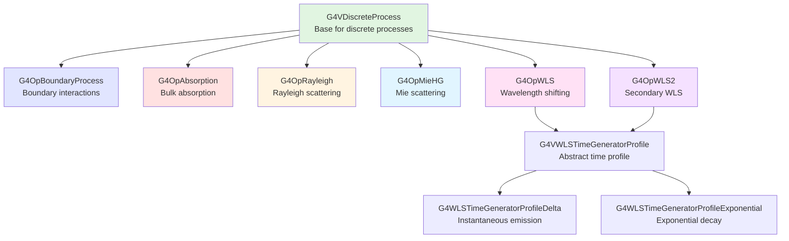

# Optical Processes Sub-Module

## Overview

The Optical Processes sub-module provides a comprehensive framework for simulating optical photon transport in Geant4. This module implements the physical processes that govern how optical photons interact with materials and surfaces, making it essential for simulating scintillation detectors, Cherenkov detectors, photomultiplier tubes (PMTs), wavelength-shifting fibers, and other optical systems.

::: tip Module Location
**Source:** `source/processes/optical/`
**Headers:** `source/processes/optical/include/`
**Size:** 10 header files, 9 source files
:::

## Purpose and Scope

The Optical Processes module enables realistic simulation of:

- **Optical Photon Boundaries**: Reflection, refraction, and total internal reflection at material interfaces
- **Bulk Absorption**: Energy-dependent absorption of optical photons in materials
- **Scattering**: Rayleigh and Mie scattering for wavelength-dependent photon deflection
- **Wavelength Shifting**: Primary and secondary wavelength shifting in scintillators and WLS fibers
- **Surface Properties**: Complex surface models including polished, ground, and LUT-based reflections
- **Detector Simulation**: PMT quantum efficiency, optical coupling, and photon detection

This module is crucial for:
- Scintillation detector optimization
- Cherenkov detector design
- Light guide and fiber optic simulations
- PMT and SiPM response modeling
- Optical coating and filter design

## Physics Background

### Optical Photons in Geant4

Optical photons in Geant4 are treated as distinct particles (`G4OpticalPhoton`) separate from gamma rays. They:
- Have wavelengths typically in the range 200-1000 nm (visible to near-UV/IR)
- Are generated by scintillation and Cherenkov processes
- Interact only through optical processes (not electromagnetic processes)
- Require material properties tables for accurate simulation

### Material Properties Tables

Optical simulations require wavelength-dependent material properties defined through `G4MaterialPropertiesTable`:

**Bulk Properties:**
- `RINDEX` - Refractive index as function of photon energy
- `ABSLENGTH` - Absorption length for bulk absorption
- `RAYLEIGH` - Rayleigh scattering length
- `MIEHG` - Mie scattering parameters (forward/backward, length)
- `WLSABSLENGTH` - WLS absorption length
- `WLSCOMPONENT` - WLS emission spectrum
- `WLSTIMECONSTANT` - WLS decay time
- `WLS2ABSLENGTH` - Secondary WLS absorption length
- `WLS2COMPONENT` - Secondary WLS emission spectrum
- `WLS2TIMECONSTANT` - Secondary WLS decay time

**Surface Properties:**
- `REFLECTIVITY` - Surface reflectivity vs wavelength
- `EFFICIENCY` - Detection efficiency (for sensitive detectors)
- `TRANSMITTANCE` - Surface transmittance
- `SPECULARLOBECONSTANT` - Specular lobe reflection probability
- `SPECULARSPIKECONSTANT` - Specular spike reflection probability
- `BACKSCATTERCONSTANT` - Backscatter reflection probability
- `RINDEX` - Surface refractive index (for coatings)

## Architecture

### Process Class Hierarchy



### Process Subtypes

Optical processes are identified by their subtypes defined in `G4OpProcessSubType` (lines 43-51 in G4OpProcessSubType.hh):

```cpp
enum G4OpProcessSubType
{
  fOpAbsorption = 31,
  fOpBoundary   = 32,
  fOpRayleigh   = 33,
  fOpWLS        = 34,
  fOpMieHG      = 35,
  fOpWLS2       = 36,
};
```

## Core Classes

### 1. G4OpBoundaryProcess

**Purpose:** Simulates reflection, refraction, and transmission at optical boundaries

**Key Features:**
- Fresnel reflection and refraction
- Total internal reflection (TIR)
- Multiple surface models: glisur, unified, LUT, DAVIS LUT
- Dichroic filter support
- Thin coating simulation
- Complex refractive index for metals

**Status Values:** 37 different boundary interaction outcomes (lines 72-117 in G4OpBoundaryProcess.hh)

**Reference:** [API Documentation](./api/g4opboundaryprocess.md)

### 2. G4OpAbsorption

**Purpose:** Bulk absorption of optical photons in materials

**Key Features:**
- Wavelength-dependent absorption length
- Uses `ABSLENGTH` material property
- Simple discrete process

**Reference:** [API Documentation](./api/g4opabsorption.md)

### 3. G4OpRayleigh

**Purpose:** Rayleigh scattering of optical photons

**Key Features:**
- Wavelength-dependent scattering (λ^-4^ dependence)
- Automatic calculation from material properties
- Uses `RAYLEIGH` material property or calculates from isothermal compressibility

**Reference:** [API Documentation](./api/g4oprayleigh.md)

### 4. G4OpMieHG

**Purpose:** Mie scattering using Henyey-Greenstein phase function

**Key Features:**
- Forward and backward scattering angles
- Wavelength-dependent scattering
- Uses `MIEHG_FORWARD`, `MIEHG_BACKWARD`, `MIEHG_FORWARD_RATIO` properties

**Reference:** [API Documentation](./api/g4opmiehg.md)

### 5. G4OpWLS & G4OpWLS2

**Purpose:** Wavelength shifting for primary and secondary absorption/re-emission

**Key Features:**
- Absorption and re-emission at different wavelengths
- Time profile support (delta or exponential)
- Essential for WLS fiber and scintillator simulations

**Reference:** [G4OpWLS API](./api/g4opwls.md) | [G4OpWLS2 API](./api/g4opwls2.md)

### 6. WLS Time Generators

**Purpose:** Control emission time profiles for wavelength-shifted photons

**Classes:**
- `G4VWLSTimeGeneratorProfile` - Abstract base class
- `G4WLSTimeGeneratorProfileDelta` - Instantaneous emission
- `G4WLSTimeGeneratorProfileExponential` - Exponential decay

**Reference:** [API Documentation](./api/g4wlstimegeneratorprofile.md)

## Surface Models

### Unified Model

The unified model (default for most surfaces) supports four reflection types:

1. **Specular Spike** - Mirror-like reflection off microfacet
2. **Specular Lobe** - Reflection about average surface normal
3. **Lambertian** - Diffuse reflection (cosine distribution)
4. **Backscatter** - Direct backscattering

Probabilities are controlled by surface properties:
- `SPECULARSPIKECONSTANT` (Pss)
- `SPECULARLOBECONSTANT` (Psl)
- `BACKSCATTERCONSTANT` (Pbs)
- Lambertian probability = 1 - Pss - Psl - Pbs

### Surface Finishes

Available surface finishes (from G4OpticalSurface):

**Dielectric-Dielectric:**
- `polished` - Smooth surface, specular reflection
- `ground` - Rough surface, mixed reflection types
- `polishedfrontpainted` - Painted polished surface
- `groundfrontpainted` - Painted ground surface

**Dielectric-Metal:**
- `polishedlumirrorair` - Polished Lumirror reflector
- `polishedtyvekair` - Tyvek reflector
- `etchedtyvekair` - Etched Tyvek
- Many others (see lines 89-112 in G4OpBoundaryProcess.hh for complete list)

### LUT Models

**LUT Davis Model** - Uses measured reflectance data tables:
- Based on measurements from LBNL/UC Davis
- Provides realistic surface reflections
- Requires external LUT data files

**Legacy LUT Model** - Earlier measured reflection tables

## Usage Examples

### Example 1: Defining Material Optical Properties

```cpp
// Create material properties table
G4MaterialPropertiesTable* mpt = new G4MaterialPropertiesTable();

// Define refractive index
std::vector<G4double> energy = {2.0*eV, 3.0*eV, 4.0*eV};
std::vector<G4double> rindex = {1.50, 1.52, 1.54};
mpt->AddProperty("RINDEX", energy, rindex);

// Define absorption length
std::vector<G4double> absorption = {1.0*m, 0.8*m, 0.6*m};
mpt->AddProperty("ABSLENGTH", energy, absorption);

// Define Rayleigh scattering length
std::vector<G4double> rayleigh = {50*cm, 45*cm, 40*cm};
mpt->AddProperty("RAYLEIGH", energy, rayleigh);

// Attach to material
material->SetMaterialPropertiesTable(mpt);
```

### Example 2: Creating an Optical Surface

```cpp
// Create optical surface (dielectric-dielectric boundary)
G4OpticalSurface* opSurface = new G4OpticalSurface("OpticalSurface");
opSurface->SetType(dielectric_dielectric);
opSurface->SetModel(unified);
opSurface->SetFinish(polished);

// Define surface properties
G4MaterialPropertiesTable* surfaceMPT = new G4MaterialPropertiesTable();

std::vector<G4double> energy = {2.0*eV, 3.0*eV, 4.0*eV};
std::vector<G4double> reflectivity = {0.95, 0.95, 0.90};
std::vector<G4double> efficiency = {0.0, 0.0, 0.0};  // Not a detector

surfaceMPT->AddProperty("REFLECTIVITY", energy, reflectivity);
surfaceMPT->AddProperty("EFFICIENCY", energy, efficiency);
opSurface->SetMaterialPropertiesTable(surfaceMPT);

// Apply to logical border surface
new G4LogicalBorderSurface("BorderSurface",
                           physicalVolume1,
                           physicalVolume2,
                           opSurface);
```

### Example 3: PMT Photocathode with Quantum Efficiency

```cpp
// Create photocathode surface
G4OpticalSurface* photocathodeSurface =
    new G4OpticalSurface("PhotocathodeSurface");
photocathodeSurface->SetType(dielectric_metal);
photocathodeSurface->SetModel(unified);
photocathodeSurface->SetFinish(polished);

// Define quantum efficiency as detection efficiency
G4MaterialPropertiesTable* photocathodeMPT = new G4MaterialPropertiesTable();

std::vector<G4double> energy = {2.0*eV, 2.5*eV, 3.0*eV, 3.5*eV, 4.0*eV};
std::vector<G4double> efficiency = {0.05, 0.15, 0.25, 0.20, 0.10}; // QE curve

photocathodeMPT->AddProperty("EFFICIENCY", energy, efficiency);
photocathodeSurface->SetMaterialPropertiesTable(photocathodeMPT);

// Apply to photocathode surface
new G4LogicalSkinSurface("PhotocathodeSkinSurface",
                         photocathodeLogical,
                         photocathodeSurface);
```

### Example 4: Wavelength-Shifting Fiber

```cpp
// WLS fiber core material properties
G4MaterialPropertiesTable* fiberMPT = new G4MaterialPropertiesTable();

// Core refractive index
std::vector<G4double> energy = {2.0*eV, 3.0*eV, 4.0*eV};
std::vector<G4double> rindex = {1.60, 1.60, 1.60};
fiberMPT->AddProperty("RINDEX", energy, rindex);

// WLS absorption length (short for efficient absorption)
std::vector<G4double> wls_abs = {0.1*mm, 0.1*mm, 10.0*m};  // Absorbs blue, not red
fiberMPT->AddProperty("WLSABSLENGTH", energy, wls_abs);

// WLS emission spectrum (shifted to longer wavelength)
std::vector<G4double> wls_energy = {1.8*eV, 2.0*eV, 2.2*eV, 2.4*eV};
std::vector<G4double> wls_emit = {0.0, 0.5, 1.0, 0.5};  // Peak at green
fiberMPT->AddProperty("WLSCOMPONENT", wls_energy, wls_emit);

// WLS decay time
fiberMPT->AddConstProperty("WLSTIMECONSTANT", 2.7*ns);

fiberCoreMaterial->SetMaterialPropertiesTable(fiberMPT);
```

### Example 5: Scintillator with WLS Coating

```cpp
// Scintillator material
G4MaterialPropertiesTable* scintMPT = new G4MaterialPropertiesTable();

std::vector<G4double> energy = {2.0*eV, 2.5*eV, 3.0*eV, 3.5*eV};
std::vector<G4double> rindex = {1.58, 1.58, 1.58, 1.58};
scintMPT->AddProperty("RINDEX", energy, rindex);

// Scintillation properties (handled by scintillation process)
std::vector<G4double> scint_emit = {0.1, 0.8, 1.0, 0.2};
scintMPT->AddProperty("SCINTILLATIONCOMPONENT1", energy, scint_emit);
scintMPT->AddConstProperty("SCINTILLATIONYIELD", 10000./MeV);

scintillatorMaterial->SetMaterialPropertiesTable(scintMPT);

// WLS coating on scintillator surface
G4OpticalSurface* wlsCoating = new G4OpticalSurface("WLSCoating");
wlsCoating->SetType(dielectric_dielectric);
wlsCoating->SetModel(unified);
wlsCoating->SetFinish(polishedfrontpainted);

G4MaterialPropertiesTable* coatingMPT = new G4MaterialPropertiesTable();

// Coating absorbs UV scintillation light
std::vector<G4double> coating_energy = {2.5*eV, 3.0*eV, 3.5*eV};
std::vector<G4double> wls_abs = {10*m, 0.01*mm, 0.01*mm};  // Strong UV absorption
coatingMPT->AddProperty("WLSABSLENGTH", coating_energy, wls_abs);

// Re-emits at longer wavelength
std::vector<G4double> wls_emit_energy = {2.0*eV, 2.3*eV, 2.6*eV};
std::vector<G4double> wls_emit = {0.2, 1.0, 0.3};
coatingMPT->AddProperty("WLSCOMPONENT", wls_emit_energy, wls_emit);
coatingMPT->AddConstProperty("WLSTIMECONSTANT", 12*ns);

wlsCoating->SetMaterialPropertiesTable(coatingMPT);

new G4LogicalSkinSurface("ScintillatorWLSCoating",
                         scintillatorLogical,
                         wlsCoating);
```

### Example 6: Total Internal Reflection Light Guide

```cpp
// Light guide material (acrylic)
G4MaterialPropertiesTable* acrylicMPT = new G4MaterialPropertiesTable();

std::vector<G4double> energy = {2.0*eV, 3.0*eV, 4.0*eV};
std::vector<G4double> rindex = {1.49, 1.49, 1.50};
acrylicMPT->AddProperty("RINDEX", energy, rindex);

// Very long absorption length (transparent)
std::vector<G4double> absorption = {10.0*m, 10.0*m, 5.0*m};
acrylicMPT->AddProperty("ABSLENGTH", energy, absorption);

acrylicMaterial->SetMaterialPropertiesTable(acrylicMPT);

// Reflective wrapping (ESR film)
G4OpticalSurface* esrSurface = new G4OpticalSurface("ESRSurface");
esrSurface->SetType(dielectric_metal);
esrSurface->SetModel(unified);
esrSurface->SetFinish(polishedlumirrorair);

G4MaterialPropertiesTable* esrMPT = new G4MaterialPropertiesTable();

std::vector<G4double> esr_reflectivity = {0.98, 0.98, 0.97};
esrMPT->AddProperty("REFLECTIVITY", energy, esr_reflectivity);

esrSurface->SetMaterialPropertiesTable(esrMPT);

// Apply to light guide surfaces
new G4LogicalSkinSurface("LightGuideESRWrapping",
                         lightGuideLogical,
                         esrSurface);
```

## Detector Applications

### Scintillation Detectors

Optical processes are essential for:
- **Crystal calorimeters** - Light collection efficiency
- **Plastic scintillators** - Light guide and fiber optimization
- **Liquid scintillators** - Rayleigh scattering, absorption
- **Time-of-flight detectors** - Optical photon timing

### Cherenkov Detectors

Key processes for Cherenkov detectors:
- **Water Cherenkov** - Rayleigh scattering, absorption, PMT QE
- **Gas Cherenkov** - Reflection from mirrors
- **RICH detectors** - Complex optics, photon focusing

### Photon Detectors

Modeling PMTs and SiPMs:
- **Quantum efficiency** - Using EFFICIENCY property
- **Photocathode** - Dielectric-metal surface
- **Collection efficiency** - Entrance window transmission
- **Crosstalk** - Optical photon transport between pixels

## Process Ordering

Optical processes should be registered for `G4OpticalPhoton` in the physics list:

```cpp
void MyPhysicsList::ConstructOp()
{
  G4ProcessManager* pManager =
      G4OpticalPhoton::OpticalPhoton()->GetProcessManager();

  // Processes are called in the order they are added
  pManager->AddDiscreteProcess(new G4OpAbsorption());
  pManager->AddDiscreteProcess(new G4OpRayleigh());
  pManager->AddDiscreteProcess(new G4OpMieHG());
  pManager->AddDiscreteProcess(new G4OpBoundaryProcess());
  pManager->AddDiscreteProcess(new G4OpWLS());
  pManager->AddDiscreteProcess(new G4OpWLS2());
}
```

**Note:** `G4OpBoundaryProcess` should typically be registered last, as it only acts at boundaries and shouldn't interfere with bulk processes.

## Performance Considerations

### Optimization Tips

1. **Reduce optical photon production:**
   - Set scintillation yield carefully
   - Use yield factors < 1.0 for fast simulations

2. **Limit tracking:**
   - Set maximum step size in optical regions
   - Use absorption to kill photons that won't reach detectors

3. **Simplify surfaces:**
   - Use simple models where appropriate
   - LUT models are more accurate but slower

4. **Parallel processing:**
   - Optical photon tracking is inherently parallelizable
   - Use multi-threading for large photon numbers

### Common Issues

1. **Missing RINDEX:** All materials with optical photons must have RINDEX defined
2. **Energy range mismatch:** Ensure material properties cover full photon energy range
3. **Surface confusion:** Distinguish LogicalBorderSurface (between volumes) from LogicalSkinSurface (surrounding volume)
4. **Detection counting:** Photons with status `Detection` have deposited energy; use in sensitive detector

## References

### Source Files
- **Headers:** `/home/user/geant4/source/processes/optical/include/*.hh`
- **Implementation:** `/home/user/geant4/source/processes/optical/src/*.cc`

### Key Publications
- GEANT4 Optical Photon Processes, P. Gumplinger et al.
- Validation studies in various detector papers

### Related Documentation
- [Processes Management Module](../management/index.md)
- [Materials and Material Properties](../../materials/index.md)
- [Geometry and Surfaces](../../geometry/index.md)

## API Documentation

- [G4OpBoundaryProcess](./api/g4opboundaryprocess.md) - Boundary reflection and refraction
- [G4OpAbsorption](./api/g4opabsorption.md) - Bulk absorption
- [G4OpRayleigh](./api/g4oprayleigh.md) - Rayleigh scattering
- [G4OpMieHG](./api/g4opmiehg.md) - Mie scattering
- [G4OpWLS](./api/g4opwls.md) - Primary wavelength shifting
- [G4OpWLS2](./api/g4opwls2.md) - Secondary wavelength shifting
- [G4VWLSTimeGeneratorProfile](./api/g4wlstimegeneratorprofile.md) - WLS time profiles
