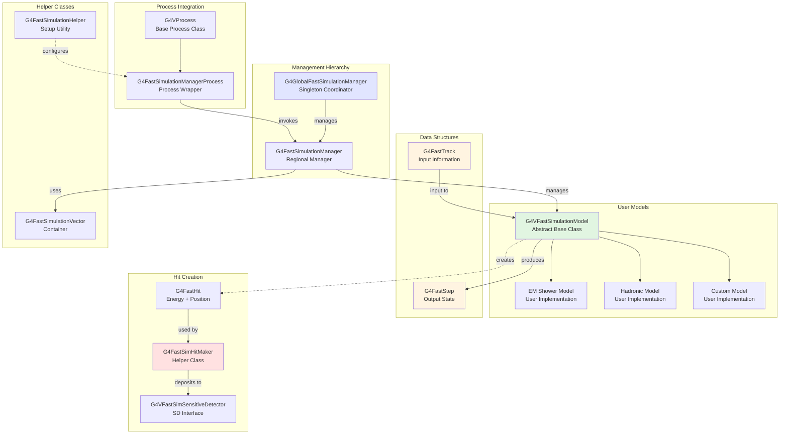
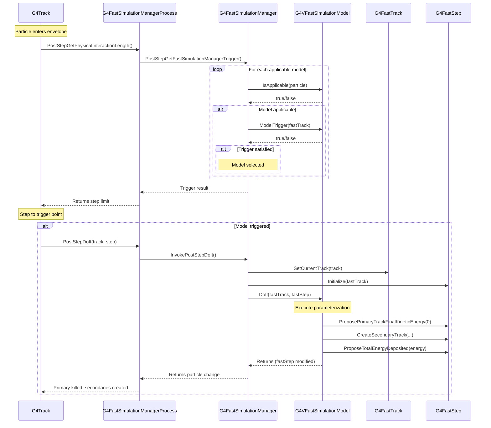

# Processes Parameterisation (Fast Simulation) Sub-Module

## Overview

The Parameterisation sub-module, also known as Fast Simulation, provides a sophisticated framework for replacing detailed particle tracking with parameterized models in specific detector regions. This is crucial for significantly accelerating simulations of electromagnetic and hadronic showers while maintaining acceptable physics accuracy. The module is particularly valuable for calorimeter simulations where detailed tracking of thousands of secondary particles can be computationally prohibitive.

::: tip Module Location
**Source:** `source/processes/parameterisation/`
**Headers:** `source/processes/parameterisation/include/`
**Size:** 12 header files, 9 source files
:::

## Purpose

The Fast Simulation framework serves several critical functions:

- **Shower Parameterization**: Replace detailed tracking with parameterized models for EM and hadronic showers
- **Performance Optimization**: Achieve 10-1000x speedup in calorimeter simulations
- **Regional Management**: Define envelope regions where fast simulation models are active
- **Flexible Triggering**: Control when parameterization activates based on particle type, energy, position
- **Hit Creation**: Simplified interface for creating detector hits from parameterized showers
- **Hybrid Simulation**: Seamlessly mix detailed tracking and fast simulation
- **Custom Physics**: Implement user-defined detector responses and parameterizations

::: warning Performance Trade-off
Fast simulation trades some physics accuracy for computational speed. Users must validate that parameterized models provide sufficient accuracy for their physics goals. Typical speedups range from 10x (simple EM showers) to 1000x (complex hadronic cascades).
:::

---

## Architecture

### Core Components



### Fast Simulation Invocation Flow



---

## Key Concepts

### Envelope Regions

Fast simulation models operate within **envelope regions** - specific logical volumes designated as parameterization zones:

**Definition**: An envelope is a `G4Region` where fast simulation models are active. When a particle enters the envelope, the fast simulation manager checks if any models should trigger.

**Implementation**: Lines 54, 173-176 in `source/processes/parameterisation/include/G4FastTrack.hh`

```cpp
// G4Envelope is typedef for G4Region
using G4Envelope = G4Region;

// Get the envelope (region) pointer
G4Envelope* GetEnvelope() const;
```

**Creating an Envelope**:

```cpp
// Define a region for your calorimeter
G4Region* caloRegion = new G4Region("CalorimeterRegion");
G4LogicalVolume* caloLV = // your calorimeter logical volume
caloRegion->AddRootLogicalVolume(caloLV);

// Create a fast simulation manager for this region
G4FastSimulationManager* fastSimManager =
    new G4FastSimulationManager(caloRegion);

// Add your model to the manager
MyEMShowerModel* emModel = new MyEMShowerModel("EMShower", caloRegion);
```

::: tip Region Uniqueness
If you know a region contains only one logical volume instance, set `IsUnique=true` in the constructor to avoid coordinate transformation recalculations. This provides a small performance benefit.

**Lines 84-86** in `source/processes/parameterisation/include/G4FastTrack.hh`
:::

### Model Lifecycle: IsApplicable → ModelTrigger → DoIt

Every fast simulation model must implement three pure virtual methods that define when and how parameterization occurs:

#### 1. IsApplicable(const G4ParticleDefinition&)

**Purpose**: Determines which particle types this model can handle.

**When Called**: Once when a new particle type enters the envelope for the first time.

**Lines 80-84** in `source/processes/parameterisation/include/G4VFastSimulationModel.hh`

```cpp
// You have to return "true" when your model is applicable
// to the G4ParticleDefinition passed to this method.
virtual G4bool IsApplicable(const G4ParticleDefinition&) = 0;
```

**Example Implementation**:

```cpp
G4bool MyEMShowerModel::IsApplicable(const G4ParticleDefinition& particle)
{
    // This model handles electrons, positrons, and photons
    return (&particle == G4Electron::Definition() ||
            &particle == G4Positron::Definition() ||
            &particle == G4Gamma::Definition());
}
```

#### 2. ModelTrigger(const G4FastTrack&)

**Purpose**: Determines if the current particle state satisfies conditions for parameterization.

**When Called**: Every step for applicable particles inside the envelope.

**Lines 86-94** in `source/processes/parameterisation/include/G4VFastSimulationModel.hh`

```cpp
// You have to return "true" when the dynamics conditions to trigger
// your parameterisation are fulfiled.
virtual G4bool ModelTrigger(const G4FastTrack&) = 0;
```

**Example Implementation**:

```cpp
G4bool MyEMShowerModel::ModelTrigger(const G4FastTrack& fastTrack)
{
    // Trigger for particles with E > 1 GeV entering the calorimeter
    G4double energy = fastTrack.GetPrimaryTrack()->GetKineticEnergy();

    // Check we're not exiting the envelope
    if (fastTrack.OnTheBoundaryButExiting()) return false;

    // Trigger if energy exceeds threshold
    return (energy > 1.0*CLHEP::GeV);
}
```

**Available Information**: The `G4FastTrack` provides:
- Current track information (energy, momentum, position, time)
- Position/momentum in envelope local coordinates
- Distance to envelope boundaries via `G4VSolid` methods
- Affine transformations between global and local coordinates

**Lines 104-144** in `source/processes/parameterisation/include/G4FastTrack.hh`

#### 3. DoIt(const G4FastTrack&, G4FastStep&)

**Purpose**: Execute the parameterization and define the final state.

**When Called**: When `ModelTrigger` returns true.

**Lines 96-101** in `source/processes/parameterisation/include/G4VFastSimulationModel.hh`

```cpp
// Your parameterisation properly said. The G4FastTrack reference
// provides input informations. The final state has to be returned
// through the G4FastStep reference.
virtual void DoIt(const G4FastTrack&, G4FastStep&) = 0;
```

**Example Implementation**:

```cpp
void MyEMShowerModel::DoIt(const G4FastTrack& fastTrack,
                            G4FastStep& fastStep)
{
    // Kill the primary particle
    fastStep.KillPrimaryTrack();

    // Set energy deposited in this step
    G4double energy = fastTrack.GetPrimaryTrack()->GetKineticEnergy();
    fastStep.ProposeTotalEnergyDeposited(energy);

    // Create parameterized shower hits
    G4FastSimHitMaker hitMaker;
    for (auto& deposit : GenerateShowerProfile(energy)) {
        G4FastHit hit(deposit.position, deposit.energy);
        hitMaker.make(hit, fastTrack);
    }
}
```

### Coordinate Systems: Global vs Local

Fast simulation supports two coordinate systems to simplify model implementation:

**Global Coordinates**: World coordinate system
**Local Coordinates**: Envelope (region) coordinate system

**Lines 109-134** in `source/processes/parameterisation/include/G4FastTrack.hh`

```cpp
// Returns the particle position in envelope coordinates
G4ThreeVector GetPrimaryTrackLocalPosition() const;

// Returns the particle momentum in envelope coordinates
G4ThreeVector GetPrimaryTrackLocalMomentum() const;

// Returns the particle direction in envelope coordinates
G4ThreeVector GetPrimaryTrackLocalDirection() const;
```

**Coordinate Transformations**: Lines 140-144 in `source/processes/parameterisation/include/G4FastTrack.hh`

```cpp
// Returns the envelope Global -> Local G4AffineTransform
const G4AffineTransform* GetAffineTransformation() const;

// Returns the envelope Local -> Global G4AffineTransform
const G4AffineTransform* GetInverseAffineTransformation() const;
```

**G4FastStep Coordinate Control**: By default, all position/momentum changes are in **local coordinates**. You can specify global coordinates:

**Lines 110, 134-135** in `source/processes/parameterisation/include/G4FastStep.hh`

```cpp
// localCoordinates = true (default) uses envelope coordinates
// localCoordinates = false uses global coordinates
void ProposePrimaryTrackFinalPosition(
    const G4ThreeVector& position,
    G4bool localCoordinates = true
);

void ProposePrimaryTrackFinalMomentumDirection(
    const G4ThreeVector& direction,
    G4bool localCoordinates = true
);
```

::: tip Why Local Coordinates?
Local coordinates simplify model implementation when:
- Shower shapes are defined relative to the detector geometry
- Multiple instances of the same detector are placed in different orientations
- You need to check distances to envelope boundaries using `G4VSolid` methods
:::

### Primary Track Final State

The `G4FastStep` class provides methods to define the final state of the primary particle:

**Kill Primary Track**: Lines 103, 503-515 in `source/processes/parameterisation/include/G4FastStep.hh`

```cpp
// Set the kinetic energy to zero and signal "fStopAndKill"
void KillPrimaryTrack();
```

**Modify Primary Energy**: Lines 143, 517-524 in `source/processes/parameterisation/include/G4FastStep.hh`

```cpp
// Set the primary track final kinetic energy
void ProposePrimaryTrackFinalKineticEnergy(G4double energy);
```

**Modify Primary Direction**: Lines 134-135 in `source/processes/parameterisation/include/G4FastStep.hh`

```cpp
// Set the primary track final momentum direction (normalized)
void ProposePrimaryTrackFinalMomentumDirection(
    const G4ThreeVector& direction,
    G4bool localCoordinates = true
);
```

**Combined Energy and Direction**: Lines 150-151 in `source/processes/parameterisation/include/G4FastStep.hh`

```cpp
// Set both kinetic energy and direction
void ProposePrimaryTrackFinalKineticEnergyAndDirection(
    G4double energy,
    const G4ThreeVector& direction,
    G4bool localCoordinates = true
);
```

**Modify Position and Time**: Lines 110, 117, 124 in `source/processes/parameterisation/include/G4FastStep.hh`

```cpp
void ProposePrimaryTrackFinalPosition(const G4ThreeVector& position,
                                       G4bool localCoordinates = true);

void ProposePrimaryTrackFinalTime(G4double time);

void ProposePrimaryTrackFinalProperTime(G4double properTime);
```

**Set Path Length**: Lines 167 in `source/processes/parameterisation/include/G4FastStep.hh`

```cpp
// Set the true path length during the step
void ProposePrimaryTrackPathLength(G4double length);
```

### Secondary Particle Creation

Fast simulation models can create secondary particles to represent shower particles:

**Two-Step Process**: Lines 186-225 in `source/processes/parameterisation/include/G4FastStep.hh`

```cpp
// Step 1: Declare the total number of secondaries
void SetNumberOfSecondaryTracks(G4int nSecondaries);

// Step 2: Create each secondary
G4Track* CreateSecondaryTrack(
    const G4DynamicParticle& particle,
    G4ThreeVector polarization,
    G4ThreeVector position,
    G4double time,
    G4bool localCoordinates = true
);

// Alternative without explicit polarization
G4Track* CreateSecondaryTrack(
    const G4DynamicParticle& particle,
    G4ThreeVector position,
    G4double time,
    G4bool localCoordinates = true
);

// Query number of secondaries created
G4int GetNumberOfSecondaryTracks();

// Access individual secondaries
G4Track* GetSecondaryTrack(G4int index);
```

**Example**:

```cpp
void MyModel::DoIt(const G4FastTrack& fastTrack, G4FastStep& fastStep)
{
    // Kill primary
    fastStep.KillPrimaryTrack();

    // Create 3 secondary photons
    fastStep.SetNumberOfSecondaryTracks(3);

    for (int i = 0; i < 3; ++i) {
        G4double energy = 100*MeV;
        G4ThreeVector direction = // random direction
        G4ThreeVector position = // shower position

        G4DynamicParticle photon(G4Gamma::Definition(),
                                  direction, energy);

        fastStep.CreateSecondaryTrack(photon, position,
                                       fastTrack.GetPrimaryTrack()->GetGlobalTime(),
                                       true); // local coordinates
    }
}
```

### Energy Deposition

Record total energy deposited in the envelope:

**Lines 242, 249-250** in `source/processes/parameterisation/include/G4FastStep.hh`

```cpp
// Set the total energy deposited
void ProposeTotalEnergyDeposited(G4double energy);

// Get the total energy deposited
G4double GetTotalEnergyDeposited() const;
```

**Energy Balance**:
```
E_deposited = E_primary - Σ(E_secondaries)
```

This energy deposition is used for:
- Trajectory visualization
- Energy conservation checks
- Simplified scoring when detailed hits aren't needed

### Hit Creation with G4FastHit

For detailed energy deposition, use the hit creation framework:

**G4FastHit Structure**: Lines 47-70 in `source/processes/parameterisation/include/G4FastHit.hh`

```cpp
class G4FastHit
{
public:
    G4FastHit(const G4ThreeVector& position, G4double energy);

    void SetEnergy(const G4double& energy);
    G4double GetEnergy() const;

    void SetPosition(const G4ThreeVector& position);
    G4ThreeVector GetPosition() const;
};
```

**G4FastSimHitMaker Helper**: Lines 50-82 in `source/processes/parameterisation/include/G4FastSimHitMaker.hh`

```cpp
class G4FastSimHitMaker
{
public:
    G4FastSimHitMaker();

    // Deposit energy at given position
    void make(const G4FastHit& hit, const G4FastTrack& track);

    // Specify parallel world for SD lookup (optional)
    void SetNameOfWorldWithSD(const G4String& name);

    // Associate with process (optional)
    void SetProcess(G4VProcess* proc);
};
```

**Example - Creating Shower Hits**:

```cpp
void MyEMShowerModel::DoIt(const G4FastTrack& fastTrack,
                            G4FastStep& fastStep)
{
    G4double totalEnergy = fastTrack.GetPrimaryTrack()->GetKineticEnergy();

    // Kill primary
    fastStep.KillPrimaryTrack();
    fastStep.ProposeTotalEnergyDeposited(totalEnergy);

    // Create hit maker
    G4FastSimHitMaker hitMaker;

    // Generate longitudinal shower profile (simplified)
    G4int nSpots = 20;
    G4double X0 = 1.4*cm; // radiation length

    for (int i = 0; i < nSpots; ++i) {
        // Depth in radiation lengths
        G4double t = i * 0.5;

        // Gamma distribution shower shape
        G4double energy = totalEnergy * ShowerShape(t);

        // Position along particle direction
        G4ThreeVector localPos = fastTrack.GetPrimaryTrackLocalPosition() +
                                  t * X0 * fastTrack.GetPrimaryTrackLocalDirection();

        // Create and deposit hit
        G4FastHit hit(localPos, energy);
        hitMaker.make(hit, fastTrack);
    }
}
```

### Sensitive Detector Interface

Sensitive detectors used with fast simulation must inherit from both base classes:

**Lines 54-118** in `source/processes/parameterisation/include/G4VFastSimSensitiveDetector.hh`

```cpp
class MySensitiveDetector : public G4VSensitiveDetector,
                             public G4VFastSimSensitiveDetector
{
public:
    MySensitiveDetector(const G4String& name)
        : G4VSensitiveDetector(name) {}

    // For detailed simulation
    G4bool ProcessHits(G4Step* step, G4TouchableHistory* history) override
    {
        // Handle G4Step-based hits
    }

    // For fast simulation - MUST implement
    G4bool ProcessHits(const G4FastHit* hit,
                       const G4FastTrack* track,
                       G4TouchableHistory* history) override
    {
        // Handle G4FastHit-based hits
        G4double energy = hit->GetEnergy();
        G4ThreeVector position = hit->GetPosition();

        // Add to your hit collection
        MyHit* newHit = new MyHit();
        newHit->SetEnergy(energy);
        newHit->SetPosition(position);
        hitsCollection->insert(newHit);

        return true;
    }
};
```

::: tip Dual Interface
The dual inheritance allows the same detector to handle:
- **Detailed simulation**: via `ProcessHits(G4Step*, ...)` from `G4VSensitiveDetector`
- **Fast simulation**: via `ProcessHits(const G4FastHit*, ...)` from `G4VFastSimSensitiveDetector`

This enables hybrid simulations where some regions use fast simulation and others use detailed tracking.
:::

---

## Complete Implementation Example

### Electromagnetic Shower Parameterization

Here's a complete example implementing a simple EM shower model for a homogeneous calorimeter:

```cpp
// ============================================================
// MyEMShowerModel.hh
// ============================================================
#include "G4VFastSimulationModel.hh"
#include "G4FastSimHitMaker.hh"

class MyEMShowerModel : public G4VFastSimulationModel
{
public:
    MyEMShowerModel(const G4String& name, G4Envelope* envelope);
    ~MyEMShowerModel() override = default;

    G4bool IsApplicable(const G4ParticleDefinition& particle) override;
    G4bool ModelTrigger(const G4FastTrack& fastTrack) override;
    void DoIt(const G4FastTrack& fastTrack, G4FastStep& fastStep) override;

private:
    // Generate longitudinal shower profile
    std::vector<G4FastHit> GenerateShower(G4double energy,
                                           const G4ThreeVector& position,
                                           const G4ThreeVector& direction);

    G4double fEnergyThreshold;  // Minimum energy for parameterization
    G4double fRadiationLength;  // Material radiation length
};

// ============================================================
// MyEMShowerModel.cc
// ============================================================
#include "MyEMShowerModel.hh"
#include "G4Electron.hh"
#include "G4Positron.hh"
#include "G4Gamma.hh"
#include "G4FastHit.hh"
#include "Randomize.hh"

MyEMShowerModel::MyEMShowerModel(const G4String& name,
                                  G4Envelope* envelope)
    : G4VFastSimulationModel(name, envelope),
      fEnergyThreshold(1.0*CLHEP::GeV),
      fRadiationLength(1.4*CLHEP::cm)  // e.g., for PbWO4
{
}

G4bool MyEMShowerModel::IsApplicable(const G4ParticleDefinition& particle)
{
    // Handle electrons, positrons, and photons
    return (&particle == G4Electron::Definition() ||
            &particle == G4Positron::Definition() ||
            &particle == G4Gamma::Definition());
}

G4bool MyEMShowerModel::ModelTrigger(const G4FastTrack& fastTrack)
{
    // Don't trigger if exiting the envelope
    if (fastTrack.OnTheBoundaryButExiting()) return false;

    // Trigger if energy exceeds threshold
    G4double energy = fastTrack.GetPrimaryTrack()->GetKineticEnergy();
    return (energy > fEnergyThreshold);
}

void MyEMShowerModel::DoIt(const G4FastTrack& fastTrack,
                            G4FastStep& fastStep)
{
    // Get primary particle information
    const G4Track* primaryTrack = fastTrack.GetPrimaryTrack();
    G4double energy = primaryTrack->GetKineticEnergy();

    G4ThreeVector localPosition = fastTrack.GetPrimaryTrackLocalPosition();
    G4ThreeVector localDirection = fastTrack.GetPrimaryTrackLocalDirection();

    // Kill the primary track
    fastStep.KillPrimaryTrack();
    fastStep.ProposeTotalEnergyDeposited(energy);

    // Generate parameterized shower
    auto hits = GenerateShower(energy, localPosition, localDirection);

    // Deposit hits using hit maker
    G4FastSimHitMaker hitMaker;
    for (const auto& hit : hits) {
        hitMaker.make(hit, fastTrack);
    }
}

std::vector<G4FastHit>
MyEMShowerModel::GenerateShower(G4double energy,
                                 const G4ThreeVector& position,
                                 const G4ThreeVector& direction)
{
    std::vector<G4FastHit> hits;

    // Shower parameterization based on:
    // Longo & Sestili, Nucl. Instr. Meth. 128 (1975) 283

    G4double criticalEnergy = 10*CLHEP::MeV;  // Material dependent
    G4double y = energy / criticalEnergy;

    // Shower maximum position (in radiation lengths)
    G4double tmax = std::log(y) + 0.5;

    // Number of energy deposition spots
    G4int nSpots = static_cast<G4int>(20 + 2*std::sqrt(energy/CLHEP::GeV));

    // Generate longitudinal profile
    for (int i = 0; i < nSpots; ++i) {
        // Depth in radiation lengths
        G4double t = i * (3.0 * tmax) / nSpots;

        // Gamma distribution: E(t) ∝ b^a * t^(a-1) * exp(-bt) / Γ(a)
        G4double a = tmax;  // Shape parameter
        G4double b = 0.5;   // Rate parameter

        // Simplified shower shape
        G4double shape = std::pow(b*t, a-1) * std::exp(-b*t);
        G4double spotEnergy = energy * shape * (3.0*tmax/nSpots);

        // Longitudinal position
        G4double depth = t * fRadiationLength;
        G4ThreeVector spotPosition = position + depth * direction;

        // Add transverse spread (Moliere radius ~ 21 MeV/Ec * X0)
        G4double moliereRadius = 21*CLHEP::MeV / criticalEnergy * fRadiationLength;
        G4double radialSpread = moliereRadius * std::sqrt(G4UniformRand());
        G4double phi = 2 * CLHEP::pi * G4UniformRand();

        // Create perpendicular directions for transverse spread
        G4ThreeVector perp1 = direction.orthogonal().unit();
        G4ThreeVector perp2 = direction.cross(perp1).unit();

        spotPosition += radialSpread * (std::cos(phi)*perp1 + std::sin(phi)*perp2);

        // Create hit
        hits.emplace_back(spotPosition, spotEnergy);
    }

    return hits;
}
```

### Detector Construction Setup

```cpp
// In your detector construction class
void MyDetectorConstruction::ConstructSDandField()
{
    // Create region for fast simulation
    G4Region* caloRegion = new G4Region("CalorimeterRegion");
    fCalorimeterLV->SetRegion(caloRegion);
    caloRegion->AddRootLogicalVolume(fCalorimeterLV);

    // Create and attach fast simulation model
    // The constructor automatically creates the G4FastSimulationManager
    // and registers the model
    MyEMShowerModel* fastSimModel =
        new MyEMShowerModel("EMShowerModel", caloRegion);

    // Create sensitive detector with fast sim support
    MySensitiveDetector* caloSD =
        new MySensitiveDetector("CalorimeterSD");
    G4SDManager::GetSDMpointer()->AddNewDetector(caloSD);
    fCalorimeterLV->SetSensitiveDetector(caloSD);
}
```

### Physics List Integration

```cpp
// In your physics list class
void MyPhysicsList::ConstructProcess()
{
    // Construct standard EM physics
    G4EmStandardPhysics::ConstructProcess();

    // Add fast simulation process to all particles
    G4FastSimulationHelper::ActivateFastSimulation(
        G4Electron::Definition()->GetProcessManager()
    );
    G4FastSimulationHelper::ActivateFastSimulation(
        G4Positron::Definition()->GetProcessManager()
    );
    G4FastSimulationHelper::ActivateFastSimulation(
        G4Gamma::Definition()->GetProcessManager()
    );

    // For parallel geometry (if using ghost volumes)
    // G4FastSimulationHelper::ActivateFastSimulation(
    //     processManager, "ParallelWorldName"
    // );
}
```

---

## Performance Considerations

### Expected Speedups

Typical performance improvements from fast simulation:

| **Scenario** | **Speedup** | **Notes** |
|--------------|-------------|-----------|
| EM shower in homogeneous calorimeter | 100-500x | High energy (>1 GeV) showers |
| EM shower in sampling calorimeter | 50-200x | Depends on layer structure |
| Hadronic shower | 100-1000x | Very complex cascades |
| Low energy EM (<100 MeV) | 10-50x | Fewer secondaries |
| Mixed detailed/fast | 5-100x | Depends on fraction parameterized |

**Lines 125-126** in `source/processes/parameterisation/include/G4VFastSimulationModel.hh`

::: warning Validation Required
These speedups assume the parameterization provides acceptable accuracy. Always validate:
- Energy resolution matches detailed simulation within requirements
- Shower shapes are sufficiently accurate
- Hit positions and multiplicities are reasonable
- Edge effects at envelope boundaries are handled correctly
:::

### Trigger Condition Optimization

Optimize the `ModelTrigger` method for performance:

```cpp
G4bool MyModel::ModelTrigger(const G4FastTrack& fastTrack)
{
    // FAST: Check boundary first (cheapest test)
    if (fastTrack.OnTheBoundaryButExiting()) return false;

    // FAST: Energy threshold (simple comparison)
    G4double energy = fastTrack.GetPrimaryTrack()->GetKineticEnergy();
    if (energy < fMinEnergy) return false;

    // MODERATE: Check particle type if not done in IsApplicable
    // (Usually not needed since IsApplicable handles this)

    // EXPENSIVE: Geometry queries (only if necessary)
    // Check distance to boundaries only when needed
    G4VSolid* solid = fastTrack.GetEnvelopeSolid();
    G4double distOut = solid->DistanceToOut(
        fastTrack.GetPrimaryTrackLocalPosition(),
        fastTrack.GetPrimaryTrackLocalDirection()
    );

    // Trigger only if we have enough material
    return (distOut > 5.0*fRadiationLength);
}
```

**Performance Tips**:
- Put cheapest tests first (early exit)
- Cache expensive calculations
- Avoid geometry queries when possible
- Use energy thresholds appropriate for your physics

### Memory Management

**Lines 125-126** in `source/processes/parameterisation/include/G4VFastSimulationModel.hh`

```cpp
// Called at end of event - clean up buffered data
virtual void Flush() {}
```

Implement `Flush()` if your model buffers hits or data:

```cpp
void MyModel::Flush()
{
    // Clear any cached shower templates
    fShowerCache.clear();

    // Reset any buffered hits
    fBufferedHits.clear();
}
```

---

## Advanced Features

### AtRest Fast Simulation

In addition to the standard in-flight parameterization, models can trigger when particles stop:

**Lines 104-123** in `source/processes/parameterisation/include/G4VFastSimulationModel.hh`

```cpp
// Trigger condition for at-rest parameterization
virtual G4bool AtRestModelTrigger(const G4FastTrack& fastTrack)
{
    return false;  // Default: no at-rest parameterization
}

// At-rest parameterization implementation
virtual void AtRestDoIt(const G4FastTrack& fastTrack,
                         G4FastStep& fastStep)
{
    // Default: does nothing
}
```

**Example Use Case**: Parameterize nuclear capture of stopped particles

```cpp
G4bool MyNuclearCaptureModel::AtRestModelTrigger(const G4FastTrack& fastTrack)
{
    // Trigger for stopped negative particles
    const G4Track* track = fastTrack.GetPrimaryTrack();
    return (track->GetKineticEnergy() < 1*eV &&
            track->GetDynamicParticle()->GetCharge() < 0);
}

void MyNuclearCaptureModel::AtRestDoIt(const G4FastTrack& fastTrack,
                                        G4FastStep& fastStep)
{
    // Parameterize nuclear capture
    fastStep.KillPrimaryTrack();

    // Create capture gamma cascade
    // ...
}
```

### Parallel Geometry Support

Fast simulation can operate in parallel (ghost) geometries independent of the mass geometry:

**Lines 78-88** in `source/processes/parameterisation/include/G4FastSimulationManagerProcess.hh`

```cpp
// Constructor for parameterization in parallel geometry
G4FastSimulationManagerProcess(const G4String& processName,
                                const G4String& worldVolumeName,
                                G4ProcessType theType = fParameterisation);

G4FastSimulationManagerProcess(const G4String& processName,
                                G4VPhysicalVolume* worldVolume,
                                G4ProcessType theType = fParameterisation);
```

**Use Case**: Define simplified calorimeter geometry for fast simulation without affecting detailed tracking geometry.

**Setup**:

```cpp
// In physics list
G4FastSimulationHelper::ActivateFastSimulation(
    electron->GetProcessManager(),
    "FastSimWorld"  // Parallel world name
);
```

### Model Activation Control

Dynamically enable/disable models during runtime:

**Lines 109-113** in `source/processes/parameterisation/include/G4FastSimulationManager.hh`

```cpp
// Activate a model by name
G4bool ActivateFastSimulationModel(const G4String& modelName);

// Inactivate a model by name
G4bool InActivateFastSimulationModel(const G4String& modelName);
```

**Global Control**: Lines 138-139 in `source/processes/parameterisation/include/G4GlobalFastSimulationManager.hh`

```cpp
void ActivateFastSimulationModel(const G4String& modelName);
void InActivateFastSimulationModel(const G4String& modelName);
```

**Example - Runtime Control**:

```cpp
// In your user interface commands
G4GlobalFastSimulationManager* globalFSM =
    G4GlobalFastSimulationManager::GetGlobalFastSimulationManager();

// Disable EM parameterization for validation runs
globalFSM->InActivateFastSimulationModel("EMShowerModel");

// Re-enable for production runs
globalFSM->ActivateFastSimulationModel("EMShowerModel");
```

### Forcing Stepping Hit Invocation

By default, sensitive detector `ProcessHits` is not called when fast simulation is invoked. You can override this:

**Lines 252-264** in `source/processes/parameterisation/include/G4FastStep.hh`

```cpp
// Force the G4SteppingManager to invoke the sensitive detector
void ForceSteppingHitInvocation();
```

**Use Case**: When your model creates a meaningful `G4Step` but still wants SD processing

```cpp
void MyModel::DoIt(const G4FastTrack& fastTrack, G4FastStep& fastStep)
{
    // Modify primary but don't kill it
    fastStep.ProposePrimaryTrackFinalKineticEnergy(newEnergy);
    fastStep.ProposePrimaryTrackFinalPosition(newPosition);

    // Set energy deposition
    fastStep.ProposeTotalEnergyDeposited(energyLoss);

    // Request SD hit processing for this step
    fastStep.ForceSteppingHitInvocation();
}
```

### Global Manager Utilities

Query and display the fast simulation configuration:

**Lines 131-136** in `source/processes/parameterisation/include/G4GlobalFastSimulationManager.hh`

```cpp
// Show the complete fast simulation setup
void ShowSetup();

// List all envelopes and models
void ListEnvelopes(const G4String& name = "all",
                   listType type = NAMES_ONLY);

// List envelopes for a specific particle
void ListEnvelopes(const G4ParticleDefinition* particle);
```

**Example Usage**:

```cpp
// After geometry construction
G4GlobalFastSimulationManager* globalFSM =
    G4GlobalFastSimulationManager::GetGlobalFastSimulationManager();

// Display all fast simulation regions and models
globalFSM->ShowSetup();

// List models applicable to electrons
globalFSM->ListEnvelopes(G4Electron::Definition());
```

### Flush All Models

Clean up all models at end of run:

**Lines 141** in `source/processes/parameterisation/include/G4GlobalFastSimulationManager.hh`

```cpp
// Call Flush() on all registered models
void Flush();
```

---

## Common Use Cases

### 1. Electromagnetic Shower in Homogeneous Calorimeter

**Physics Goal**: Parameterize high-energy EM showers to reduce simulation time

**Model Strategy**:
- Trigger for E > 1 GeV electrons, positrons, photons
- Use Grindhammer parameterization for longitudinal profile
- Add Moliere radius for transverse spread
- Create ~20-50 hits per shower

**Expected Speedup**: 100-500x

**Reference Example**: See complete example above

### 2. Hadronic Shower in Sampling Calorimeter

**Physics Goal**: Parameterize hadronic showers while preserving energy response

**Model Strategy**:
- Trigger for hadrons with E > 5 GeV
- Use GFLASH or similar parameterization
- Account for:
  - Electromagnetic fraction (π⁰ → γγ)
  - Nuclear binding energy losses
  - Neutron component
- Create hits in active layers only

**Expected Speedup**: 100-1000x

### 3. Hybrid Simulation

**Physics Goal**: Use detailed simulation for tracker, fast simulation for calorimeters

**Model Strategy**:
- Define envelope only for calorimeter region
- Use energy threshold to parameterize high-E showers only
- Low-energy particles tracked in detail
- Preserve correlations between tracker and calorimeter

**Expected Speedup**: 10-100x (detector dependent)

**Implementation**:

```cpp
G4bool HybridModel::ModelTrigger(const G4FastTrack& fastTrack)
{
    // Only parameterize in calorimeter region
    G4String volumeName = fastTrack.GetEnvelopePhysicalVolume()->GetName();
    if (volumeName != "Calorimeter") return false;

    // Only for high energy
    G4double energy = fastTrack.GetPrimaryTrack()->GetKineticEnergy();
    return (energy > 5.0*CLHEP::GeV);
}
```

### 4. Custom Detector Response

**Physics Goal**: Implement non-standard physics effects (e.g., Cherenkov, scintillation simulation)

**Model Strategy**:
- Use fast simulation to generate optical photons
- Parameterize light yield, attenuation, collection
- Create photon hits at photodetector locations
- Much faster than tracking individual photons

**Example**:

```cpp
void CherenkovModel::DoIt(const G4FastTrack& fastTrack,
                           G4FastStep& fastStep)
{
    // Calculate Cherenkov yield
    G4double beta = fastTrack.GetPrimaryTrack()->GetVelocity() / c_light;
    G4int nPhotons = CalculateCherenkovYield(beta);

    // Don't kill primary - modify it
    G4double energyLoss = CalculateIonizationLoss();
    fastStep.ProposePrimaryTrackFinalKineticEnergy(
        fastTrack.GetPrimaryTrack()->GetKineticEnergy() - energyLoss
    );

    // Create optical photons at PMT positions (parameterized)
    G4FastSimHitMaker hitMaker;
    for (const auto& pmtPos : fPMTPositions) {
        G4double detectedPhotons = nPhotons * CollectionEfficiency(pmtPos);
        G4FastHit hit(pmtPos, detectedPhotons * fPhotonEnergy);
        hitMaker.make(hit, fastTrack);
    }
}
```

---

## Debugging and Validation

### Enabling Verbose Output

Monitor fast simulation invocation:

```cpp
// In your model constructor
G4cout << "Fast simulation model '" << GetName()
       << "' constructed for envelope: "
       << envelope->GetName() << G4endl;

// In ModelTrigger
if (verboseLevel > 1) {
    G4cout << "ModelTrigger called: E = "
           << energy/GeV << " GeV" << G4endl;
}

// In DoIt
if (verboseLevel > 0) {
    G4cout << "Parameterization executed: created "
           << nHits << " hits, deposited "
           << totalEnergy/GeV << " GeV" << G4endl;
}
```

### Validation Strategy

1. **Energy Conservation**: Compare total energy deposited
   ```cpp
   // In DoIt
   G4double energyIn = fastTrack.GetPrimaryTrack()->GetKineticEnergy();
   G4double energyOut = 0;
   for (const auto& hit : hits) energyOut += hit.GetEnergy();

   if (std::abs(energyIn - energyOut) > 0.01*energyIn) {
       G4cerr << "WARNING: Energy not conserved!" << G4endl;
   }
   ```

2. **Shower Shapes**: Compare longitudinal and transverse profiles
   - Plot energy vs depth
   - Compare shower width vs energy
   - Validate shower maximum position

3. **Energy Resolution**: Compare calorimeter response
   ```
   σ(E)/E = a/√E ⊕ b ⊕ c/E
   ```
   Parameters should match detailed simulation within requirements

4. **Efficiency**: Count how often parameterization triggers
   ```cpp
   static G4int nTriggerCalls = 0;
   static G4int nTriggered = 0;

   G4bool MyModel::ModelTrigger(const G4FastTrack& fastTrack)
   {
       nTriggerCalls++;
       G4bool trigger = /* your logic */;
       if (trigger) nTriggered++;

       if (nTriggerCalls % 10000 == 0) {
           G4cout << "Trigger efficiency: "
                  << 100.0*nTriggered/nTriggerCalls << "%" << G4endl;
       }
       return trigger;
   }
   ```

### Common Issues

**Issue**: Model never triggers
- **Check**: `IsApplicable` returns true for your particles
- **Check**: Energy threshold not too high
- **Check**: Envelope region properly defined
- **Check**: Process registered in physics list

**Issue**: Crashes in hit creation
- **Check**: Sensitive detector inherits from `G4VFastSimSensitiveDetector`
- **Check**: Hit positions are valid (not NaN or outside detector)
- **Check**: Energy values are positive

**Issue**: Energy not conserved
- **Check**: Sum of hit energies matches input energy
- **Check**: `ProposeTotalEnergyDeposited` called correctly
- **Check**: No energy lost to particles escaping envelope

**Issue**: Performance not improved
- **Check**: Model actually triggering (add counters)
- **Check**: Energy threshold appropriate
- **Check**: Envelope covers relevant detector volume
- **Check**: Not creating too many secondaries

---

## API Documentation

Detailed class-by-class documentation:

- [G4VFastSimulationModel](api/G4VFastSimulationModel.md) - Base class for fast simulation models
- [G4FastSimulationManager](api/G4FastSimulationManager.md) - Regional model manager
- [G4GlobalFastSimulationManager](api/G4GlobalFastSimulationManager.md) - Global singleton coordinator
- [G4FastSimulationManagerProcess](api/G4FastSimulationManagerProcess.md) - Process wrapper
- [G4FastTrack](api/G4FastTrack.md) - Input data structure
- [G4FastStep](api/G4FastStep.md) - Output final state
- [G4FastSimHitMaker](api/G4FastSimHitMaker.md) - Hit creation helper
- [G4FastHit](api/G4FastHit.md) - Minimal hit structure
- [G4VFastSimSensitiveDetector](api/G4VFastSimSensitiveDetector.md) - Sensitive detector interface
- [G4FastSimulationHelper](api/G4FastSimulationHelper.md) - Setup utility
- [G4FastSimulationVector](api/G4FastSimulationVector.md) - Specialized container

---

## Related Documentation

- [Processes Management](../management/index.md) - Process framework and lifecycle
- [Electromagnetic Physics](../electromagnetic/index.md) - EM shower physics
- [Hadronic Physics](../hadronic/index.md) - Hadronic shower physics
- [Biasing](../biasing/index.md) - Variance reduction techniques
- [Event Module](../../event/index.md) - Hit and track data structures

---

## References

### Fast Simulation Examples

**Par03**: Extended parameterisation example demonstrating:
- EM shower parameterization with GFLASH
- Integration with sensitive detectors
- Fast simulation hit maker usage
- Performance comparisons

**Location**: `examples/extended/parameterisations/Par03/`

### Shower Parameterization Physics

1. **EM Showers**:
   - Grindhammer & Rudowicz, NIM A 290 (1990) 469
   - Longo & Sestili, NIM 128 (1975) 283

2. **Hadronic Showers**:
   - GFLASH parameterization
   - Grindhammer et al., NIM A 290 (1990) 469

3. **Moliere Radius**:
   - Tsai, Rev. Mod. Phys. 46 (1974) 815

### Historical Development

- **1997**: First implementation by Verderi & Mora de Freitas
- **2006**: Migration to parallel geometry scheme
- **2016**: Addition of G4FastSimulationHelper utility
- **Recent**: Enhanced hit creation framework with G4FastHit

**Lines 36-38** in `source/processes/parameterisation/include/G4VFastSimulationModel.hh`

---

## Summary

The Parameterisation (Fast Simulation) sub-module provides a powerful framework for accelerating Geant4 simulations by replacing detailed particle tracking with parameterized models. Key points:

- **Architecture**: Three-tier system (global manager → regional managers → models)
- **User Interface**: Implement three methods: `IsApplicable`, `ModelTrigger`, `DoIt`
- **Flexibility**: Support for custom physics, hit creation, coordinate systems
- **Performance**: Typical speedups of 10-1000x for shower simulations
- **Integration**: Seamless mixing with detailed simulation

The framework is particularly effective for:
- Electromagnetic showers in calorimeters
- Hadronic cascades
- High-energy physics detector simulations
- Any scenario with complex secondary particle cascades

Success requires careful validation to ensure parameterizations maintain sufficient physics accuracy for your application.
