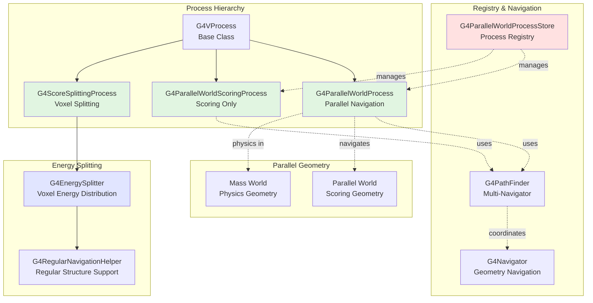
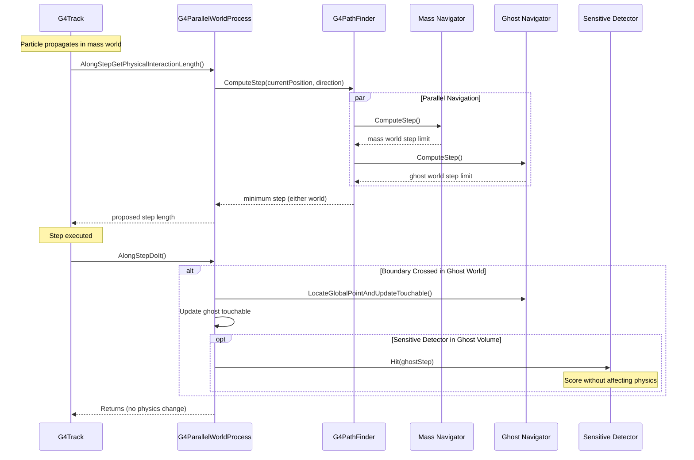
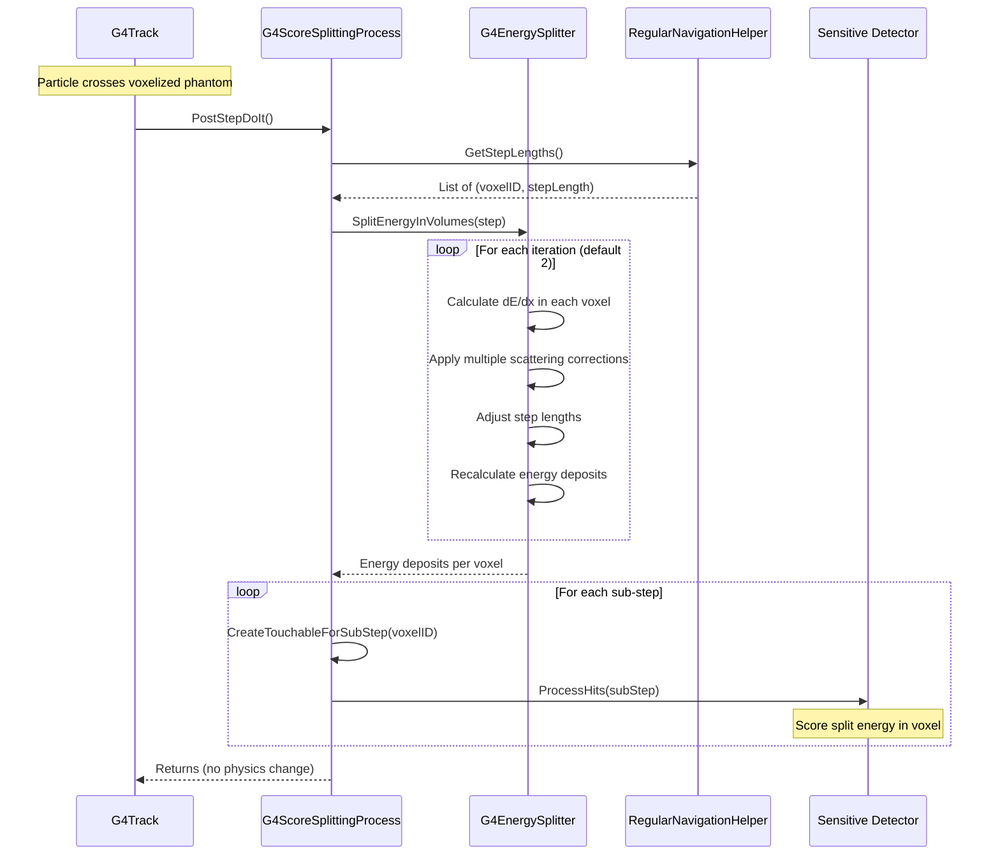

# Processes Scoring Sub-Module

## Overview

The Scoring sub-module provides sophisticated mechanisms for collecting simulation data without interfering with physics processes. It implements **parallel world geometries** that allow particles to be tracked through scoring volumes while maintaining their physics interactions in the primary (mass) world. This enables non-invasive scoring, importance biasing, and variance reduction techniques essential for efficient radiation transport simulations.

::: tip Module Location
**Source:** `source/processes/scoring/`
**Headers:** `source/processes/scoring/include/`
**Size:** 4 main classes, 1 utility class
:::

## Purpose

The Scoring sub-module enables advanced simulation capabilities:

- **Non-Invasive Scoring**: Score particle interactions without affecting physics
- **Parallel World Navigation**: Simultaneous tracking through multiple geometries
- **Importance Biasing**: Implement variance reduction via parallel geometries
- **Score Splitting**: Split energy deposition across voxelized geometries
- **Material Switching**: Override materials for specific processes
- **Flexible Scoring Meshes**: Define scoring regions independent of detector geometry

---

## Architecture

### Core Components



### Parallel World Navigation Flow



### Score Splitting Flow



---

## Key Concepts

### Parallel World Concept

Parallel worlds (also called "ghost worlds" or "layered mass geometries") are independent geometry hierarchies that coexist with the primary mass world:

#### **Mass World vs Parallel World**

| Aspect | Mass World | Parallel World |
|--------|-----------|----------------|
| **Purpose** | Physics interactions | Scoring/biasing |
| **Materials** | Physical materials | Can override or be massless |
| **Physics** | All processes active | Optional material switching |
| **Navigation** | Primary navigator | Additional navigators |
| **Sensitive Detectors** | Standard SD calls | Independent SD calls |
| **Geometry** | Detector construction | Arbitrary mesh/volumes |

#### **Why Use Parallel Worlds?**

**Traditional Approach Problems:**
```cpp
// Problem: Must modify detector geometry to add scoring volumes
// - Complicates detector description
// - May affect navigation/physics
// - Hard to maintain separate concerns
DetectorConstruction::Construct() {
    logicWorld = ...;
    logicDetector = ...;
    logicScoringMesh = ...;  // Scoring mixed with detector!
}
```

**Parallel World Solution:**
```cpp
// Solution: Separate scoring geometry
// - Independent from detector
// - No physics interference
// - Easy to add/remove scoring volumes
// - Can overlap detector volumes without conflict
ParallelWorldConstruction::Construct() {
    // Define scoring mesh independently
    logicScoringWorld = ...;
    logicScoringMesh = ...;  // Clean separation!
}
```

#### **Multiple Navigators**

Geant4 uses `G4PathFinder` to coordinate navigation through multiple worlds simultaneously:

- **Master Navigator**: Tracks in mass world (physics geometry)
- **Ghost Navigators**: One per parallel world (scoring/biasing geometries)
- **Synchronized Stepping**: Step limited by nearest boundary in ANY world
- **Independent Touchables**: Each world maintains its own location history

**Implementation**: Lines 133-146 in `source/processes/scoring/include/G4ParallelWorldProcess.hh`

```cpp
G4TransportationManager* fTransportationManager;
G4PathFinder* fPathFinder;  // Multi-world navigation coordinator

G4String fGhostWorldName;
G4VPhysicalVolume* fGhostWorld;
G4Navigator* fGhostNavigator;  // Dedicated navigator for this parallel world
G4int fNavigatorID;            // Index in PathFinder's navigator array
```

---

### Non-Invasive Scoring

The key innovation of parallel world scoring is that **scoring does not affect physics**:

#### **How It Works**

1. **Parallel Navigation**: Particle tracked simultaneously in both worlds
2. **Ghost Steps**: Process creates "ghost step" with parallel world touchable
3. **Sensitive Detector Calls**: SD invoked with ghost step, not mass step
4. **No Physics Changes**: Process returns `G4VParticleChange` with no modifications
5. **Score Collection**: Hits accumulated independently of physics processes

**Implementation**: Lines 88-90 in `source/processes/scoring/include/G4ParallelWorldScoringProcess.hh`

```cpp
// Returns dummy particle change - no physics impact
G4VParticleChange* AlongStepDoIt(const G4Track&, const G4Step&) override;
```

The process calls sensitive detectors (lines 104-108 in source) but never modifies:
- Track energy, momentum, or position
- Secondary particle production
- Process cross-sections or mean free paths

#### **Ghost Step Construction**

**File:** Lines 104-128 in `source/processes/scoring/include/G4ParallelWorldScoringProcess.hh`

```cpp
G4Step* fGhostStep;                    // Parallel step
G4StepPoint* fGhostPreStepPoint;       // Entry point in parallel volume
G4StepPoint* fGhostPostStepPoint;      // Exit point in parallel volume

G4TouchableHandle fOldGhostTouchable;  // Previous parallel location
G4TouchableHandle fNewGhostTouchable;  // Current parallel location
```

The ghost step mirrors the true step but with parallel world geometry information, allowing sensitive detectors to score using parallel world volume hierarchy and positions.

---

### Material Switching

`G4ParallelWorldProcess` (not `G4ParallelWorldScoringProcess`) can override materials from the mass world:

#### **Layered Material Mode**

When enabled, materials defined in parallel world override mass world materials for process calculations:

**File:** `source/processes/scoring/include/G4ParallelWorldProcess.hh`
- **Enable**: Line 104 `SetLayeredMaterialFlag(true)`
- **Check**: Line 105 `GetLayeredMaterialFlag()`
- **Implementation**: Lines 121 `SwitchMaterial()` method

#### **Use Cases**

1. **Importance Biasing**: Define regions with different importance
2. **Variance Reduction**: Adjust materials to enhance statistics
3. **Geometry Simplification**: Use simplified materials for certain processes
4. **Multi-Purpose Geometry**: Same mass geometry, multiple material configurations

**Warning**: Material switching DOES affect physics (unlike pure scoring). Use `G4ParallelWorldScoringProcess` for non-invasive scoring.

---

### Score Splitting in Voxelized Geometries

`G4ScoreSplittingProcess` splits particle steps across regular voxelized structures (phantoms):

#### **The Voxel Problem**

In CT-based phantoms with millions of voxels, a particle step may cross multiple voxels:

**Without Splitting:**
```
Particle step: 5mm
Crosses voxels: 1, 2, 3, 4, 5
Energy deposited: 100 keV
Scoring: Entire 100 keV in voxel 3 (mid-step point) ❌
```

**With Splitting:**
```
Particle step: 5mm
Split into sub-steps:
  - Voxel 1: 0.8mm → 16 keV
  - Voxel 2: 1.2mm → 24 keV
  - Voxel 3: 1.5mm → 30 keV
  - Voxel 4: 1.0mm → 20 keV
  - Voxel 5: 0.5mm → 10 keV
Scoring: Accurate dose distribution ✓
```

#### **Energy Splitting Algorithm**

**File:** `source/processes/scoring/include/private/G4EnergySplitter.hh`

The algorithm accounts for:

1. **Step Length Distribution** (lines 62-66)
   - Uses `G4RegularNavigationHelper` to get sub-step lengths
   - Accounts for geometric boundaries between voxels

2. **Energy Loss Variation** (lines 63-64)
   - Different materials in each voxel → different dE/dx
   - Particle loses energy along path → decreasing kinetic energy

3. **Multiple Scattering Corrections** (lines 57-58)
   - Charged particles deflected in each voxel
   - Affects effective path length

4. **Iterative Refinement** (lines 68)
   - Default 2 iterations for convergence
   - Corrects for energy-dependent dE/dx

**Implementation**: Lines 56-286 in `source/processes/scoring/src/G4EnergySplitter.cc`

Key steps:
```cpp
G4int SplitEnergyInVolumes(const G4Step* aStep) {
    // 1. Get voxel crossings (lines 95-96)
    std::vector<std::pair<G4int,G4double>> rnsl =
        G4RegularNavigationHelper::Instance()->GetStepLengths();

    // 2. Initial estimate (lines 125-136)
    for (voxels) {
        edepStep = edep * stepLength / totalLength;  // Proportional split
    }

    // 3. Iterate for accuracy (lines 166-282)
    for (iteration = 1; iteration <= theNIterations; ++iteration) {
        // 3a. Calculate dE/dx in each voxel (lines 180-197)
        // 3b. Apply multiple scattering corrections (lines 207)
        // 3c. Renormalize to conserve total energy (lines 259)
    }
}
```

---

## Key Classes

### Core Processes

#### [G4ParallelWorldProcess](./api/g4parallelworldprocess.md)
**Parallel world navigation with material switching capability**

The most feature-rich parallel world process, supporting both scoring and material override.

**Key Features:**
- Navigates through parallel geometry
- Limits steps at parallel world boundaries
- Invokes sensitive detectors in parallel world
- **Can override materials** (layered material mode)
- Supports importance biasing

**Key Methods:**
```cpp
// Setup (lines 68-69)
void SetParallelWorld(G4String parallelWorldName);
void SetParallelWorld(G4VPhysicalVolume* parallelWorld);

// Material switching (lines 104-105)
void SetLayeredMaterialFlag(G4bool flg = true);
G4bool GetLayeredMaterialFlag() const;

// Process interface (lines 81-98)
G4double AlongStepGetPhysicalInteractionLength(...);
G4VParticleChange* AlongStepDoIt(...);
G4double PostStepGetPhysicalInteractionLength(...);
G4VParticleChange* PostStepDoIt(...);
```

**Usage Scenarios:**
- Importance biasing with geometry-based splitting
- Material override for variance reduction
- Scoring with physics modifications

**Process Type:** `fParallel` (line 61)

**File:** `source/processes/scoring/include/G4ParallelWorldProcess.hh`

---

#### [G4ParallelWorldScoringProcess](./api/g4parallelworldscoringprocess.md)
**Pure scoring process without material switching**

Simplified version for non-invasive scoring only.

**Key Features:**
- Navigates through parallel geometry
- Invokes sensitive detectors in parallel world
- **Never affects physics** (no material switching)
- Lighter weight than `G4ParallelWorldProcess`

**Key Methods:**
```cpp
// Setup (lines 64-65)
void SetParallelWorld(G4String parallelWorldName);
void SetParallelWorld(G4VPhysicalVolume* parallelWorld);

// Process interface (lines 86-98)
G4double AlongStepGetPhysicalInteractionLength(...);
G4VParticleChange* AlongStepDoIt(...);
G4double PostStepGetPhysicalInteractionLength(...);
G4VParticleChange* PostStepDoIt(...);
```

**Difference from G4ParallelWorldProcess:**
- No `SetLayeredMaterialFlag()` method
- Process type is `fParameterisation` not `fParallel` (line 57)
- Cannot override materials
- Use this for pure scoring meshes

**File:** `source/processes/scoring/include/G4ParallelWorldScoringProcess.hh`

---

#### [G4ScoreSplittingProcess](./api/g4scoresplittingprocess.md)
**Splits particle steps across voxelized phantoms**

Specialized for accurate scoring in regular voxelized structures (CT phantoms, dosimetry).

**Key Features:**
- Works in **mass world** (not parallel world)
- Splits single step into sub-steps per voxel
- Distributes energy accounting for dE/dx variation
- Applies multiple scattering corrections
- Creates sub-step for each voxel crossing
- Invokes sensitive detectors for each sub-step

**Key Methods:**
```cpp
// Process interface (lines 80-92)
G4double AlongStepGetPhysicalInteractionLength(...);
G4VParticleChange* AlongStepDoIt(...);
G4double PostStepGetPhysicalInteractionLength(...);
G4VParticleChange* PostStepDoIt(...);

// Internal (lines 98)
void CreateTouchableForSubStep(G4int newVoxelNum, G4ThreeVector newPosition);
```

**Internal Components:**
```cpp
// Energy splitting engine (line 121)
G4EnergySplitter* fpEnergySplitter;

// Sub-step construction (lines 104-106)
G4Step* fSplitStep;
G4StepPoint* fSplitPreStepPoint;
G4StepPoint* fSplitPostStepPoint;

// Touchable management (lines 114-119)
G4TouchableHandle fOldTouchableH;      // Current sub-step
G4TouchableHandle fNewTouchableH;      // Next sub-step
G4TouchableHandle fInitialTouchableH;  // Full step start
G4TouchableHandle fFinalTouchableH;    // Full step end
```

**Requirements:**
- Geometry must use `G4PhantomParameterisation`
- Regular structure (constant voxel stepping)
- Works with `G4RegularNavigation`

**Process Type:** `fParameterisation` (line 59)

**File:** `source/processes/scoring/include/G4ScoreSplittingProcess.hh`

---

### Registry and Utilities

#### [G4ParallelWorldProcessStore](./api/g4parallelworldprocessstore.md)
**Singleton registry for parallel world processes**

Manages the relationship between processes and parallel world names across threads.

**Key Features:**
- **Singleton per thread** (line 68)
- Maps processes to parallel world names
- Ensures unique process-world associations
- Manages process lifecycle

**Key Methods:**
```cpp
// Singleton access (lines 52-53)
static G4ParallelWorldProcessStore* GetInstance();
static G4ParallelWorldProcessStore* GetInstanceIfExist();

// Process registration (lines 55-57)
void SetParallelWorld(G4ParallelWorldProcess* proc,
                      const G4String& parallelWorldName);
void UpdateWorlds();  // Apply world names to processes

// Process lookup (line 57)
G4ParallelWorldProcess* GetProcess(const G4String& parallelWorldName);

// Cleanup (line 58)
void Clear();
```

**Implementation Details:**
- Inherits from `std::map<G4ParallelWorldProcess*, G4String>` (line 48)
- Thread-local singleton (line 68)
- Validates process-world consistency (lines 59-80 in .cc)

**Usage:** Typically used internally by `G4ParallelWorldPhysics` or detector construction.

**File:** `source/processes/scoring/include/G4ParallelWorldProcessStore.hh`

---

#### G4EnergySplitter
**Energy distribution calculator for voxel splitting** (Private utility class)

**Key Features:**
- Calculates energy deposition per voxel
- Accounts for material variations
- Handles energy-dependent dE/dx
- Applies multiple scattering corrections
- Configurable iteration count

**Key Methods:**
```cpp
// Energy splitting (line 57)
G4int SplitEnergyInVolumes(const G4Step* aStep);

// Voxel information retrieval (lines 59-66)
void GetLastVoxelID(G4int& voxelID);
void GetFirstVoxelID(G4int& voxelID);
void GetVoxelID(G4int stepNo, G4int& voxelID);
void GetVoxelIDAndLength(G4int stepNo, G4int& voxelID, G4double& stepLength);
void GetLengthAndEnergyDeposited(G4int stepNo, G4int& voxelID,
                                 G4double& stepLength, G4double& energyLoss);
void GetLengthAndInitialEnergy(G4double& preStepEnergy, G4int stepNo,
                               G4int& voxelID, G4double& stepLength,
                               G4double& initialEnergy);

// Configuration (line 68)
void SetNIterations(G4int niter);  // Default: 2

// Material access (line 70)
G4Material* GetVoxelMaterial(G4int stepNo);
```

**Algorithm:** (lines 56-286 in `source/processes/scoring/src/G4EnergySplitter.cc`)

1. **Zeroth Order** (theNIterations = 0): Simple proportional split by step length
2. **First Iteration**: Calculate dE/dx in each voxel, distribute energy
3. **Subsequent Iterations**: Refine using corrected step lengths and energies

**Performance:** More iterations → better accuracy, but slower. Default 2 is good balance.

**File:** `source/processes/scoring/include/private/G4EnergySplitter.hh`

---

## Usage Examples

### Example 1: Basic Parallel World Scoring

Create a scoring mesh independent of detector geometry:

```cpp
// In your parallel world construction
#include "G4LogicalVolume.hh"
#include "G4PVPlacement.hh"
#include "G4Box.hh"
#include "G4SDManager.hh"

G4VPhysicalVolume* ParallelWorldConstruction::Construct() {
    // Create parallel world container
    G4Box* worldBox = new G4Box("ParallelWorld", 1*m, 1*m, 1*m);
    G4LogicalVolume* worldLog = new G4LogicalVolume(worldBox, nullptr,
                                                    "ParallelWorldLogical");
    G4VPhysicalVolume* worldPhys = new G4PVPlacement(nullptr, G4ThreeVector(),
                                                     worldLog, "ParallelWorld",
                                                     nullptr, false, 0);

    // Create scoring mesh (10x10x10 cm³)
    G4Box* scoreBox = new G4Box("ScoringMesh", 5*cm, 5*cm, 5*cm);
    G4LogicalVolume* scoreLog = new G4LogicalVolume(scoreBox, nullptr,
                                                    "ScoringMeshLogical");
    new G4PVPlacement(nullptr, G4ThreeVector(), scoreLog, "ScoringMesh",
                      worldLog, false, 0);

    // Attach sensitive detector
    G4SDManager* SDman = G4SDManager::GetSDMpointer();
    MySensitiveDetector* sd = new MySensitiveDetector("MyScoringSD");
    SDman->AddNewDetector(sd);
    scoreLog->SetSensitiveDetector(sd);

    return worldPhys;
}

// In your physics list
#include "G4ParallelWorldScoringProcess.hh"
#include "G4ParticleDefinition.hh"
#include "G4ProcessManager.hh"

void MyPhysicsList::ConstructParallel() {
    // Create the process
    G4ParallelWorldScoringProcess* parallelWorldProcess =
        new G4ParallelWorldScoringProcess("ParallelWorldScoring");
    parallelWorldProcess->SetParallelWorld("ParallelWorld");  // Name from construction

    // Add to ALL particles
    auto particleIterator = GetParticleIterator();
    particleIterator->reset();

    while((*particleIterator)()) {
        G4ParticleDefinition* particle = particleIterator->value();
        G4ProcessManager* pmanager = particle->GetProcessManager();

        // Add as AlongStep and PostStep process
        pmanager->AddProcess(parallelWorldProcess);
        pmanager->SetProcessOrdering(parallelWorldProcess, idxAlongStep, 1);
        pmanager->SetProcessOrdering(parallelWorldProcess, idxPostStep, 1);
    }
}
```

**Result:** Particles score in the parallel world mesh without affecting their physics in the mass world.

---

### Example 2: Multiple Parallel Worlds

Use multiple independent scoring geometries:

```cpp
// Create two parallel worlds with different purposes
void MyPhysicsList::ConstructParallel() {
    // Scoring mesh for dose
    G4ParallelWorldScoringProcess* doseScoring =
        new G4ParallelWorldScoringProcess("DoseScoring");
    doseScoring->SetParallelWorld("DoseWorld");

    // Scoring mesh for flux
    G4ParallelWorldScoringProcess* fluxScoring =
        new G4ParallelWorldScoringProcess("FluxScoring");
    fluxScoring->SetParallelWorld("FluxWorld");

    // Add both to particles
    auto particleIterator = GetParticleIterator();
    particleIterator->reset();

    while((*particleIterator)()) {
        G4ParticleDefinition* particle = particleIterator->value();
        G4ProcessManager* pmanager = particle->GetProcessManager();

        // Order matters: lower indices execute first
        pmanager->AddProcess(doseScoring);
        pmanager->SetProcessOrdering(doseScoring, idxAlongStep, 1);
        pmanager->SetProcessOrdering(doseScoring, idxPostStep, 1);

        pmanager->AddProcess(fluxScoring);
        pmanager->SetProcessOrdering(fluxScoring, idxAlongStep, 2);
        pmanager->SetProcessOrdering(fluxScoring, idxPostStep, 2);
    }
}
```

**Result:** Each parallel world maintains independent navigation and scoring.

---

### Example 3: Importance Biasing with Material Switching

Use parallel world to define importance regions:

```cpp
// Create parallel world with importance regions
G4VPhysicalVolume* BiasParallelWorld::Construct() {
    G4Box* worldBox = new G4Box("BiasWorld", 2*m, 2*m, 2*m);
    G4LogicalVolume* worldLog = new G4LogicalVolume(worldBox, nullptr,
                                                    "BiasWorldLogical");
    G4VPhysicalVolume* worldPhys = new G4PVPlacement(nullptr, G4ThreeVector(),
                                                     worldLog, "BiasWorld",
                                                     nullptr, false, 0);

    // Create importance regions (layers)
    // Inner region: high importance (close to detector)
    G4Box* innerBox = new G4Box("InnerRegion", 20*cm, 20*cm, 20*cm);
    G4Material* highImpMat = ...; // Lower density for splitting
    G4LogicalVolume* innerLog = new G4LogicalVolume(innerBox, highImpMat,
                                                    "InnerLogical");
    new G4PVPlacement(nullptr, G4ThreeVector(), innerLog, "InnerPhys",
                      worldLog, false, 0);

    // Outer region: lower importance
    G4Box* outerBox = new G4Box("OuterRegion", 1*m, 1*m, 1*m);
    G4Material* lowImpMat = ...; // Higher density for killing
    G4LogicalVolume* outerLog = new G4LogicalVolume(outerBox, lowImpMat,
                                                    "OuterLogical");
    new G4PVPlacement(nullptr, G4ThreeVector(), outerLog, "OuterPhys",
                      worldLog, false, 0);

    return worldPhys;
}

// In physics list: use G4ParallelWorldProcess with material switching
void MyPhysicsList::ConstructParallel() {
    G4ParallelWorldProcess* biasProcess =
        new G4ParallelWorldProcess("ImportanceBiasing");
    biasProcess->SetParallelWorld("BiasWorld");
    biasProcess->SetLayeredMaterialFlag(true);  // Enable material switching!

    // Add to particles
    auto particleIterator = GetParticleIterator();
    particleIterator->reset();

    while((*particleIterator)()) {
        G4ParticleDefinition* particle = particleIterator->value();
        if (particle->GetParticleName() == "neutron") {  // Example: bias neutrons
            G4ProcessManager* pmanager = particle->GetProcessManager();
            pmanager->AddProcess(biasProcess);
            pmanager->SetProcessOrdering(biasProcess, idxAlongStep, 1);
            pmanager->SetProcessOrdering(biasProcess, idxPostStep, 1);
        }
    }
}
```

**Result:** Physics processes use materials from parallel world in biasing regions.

---

### Example 4: Voxel Phantom Scoring with Splitting

Accurate scoring in CT-based phantom:

```cpp
// Create voxelized phantom using parameterisation
#include "G4PhantomParameterisation.hh"
#include "G4PVParameterised.hh"

void DetectorConstruction::ConstructPhantom() {
    // Container for voxelized phantom
    G4Box* containerBox = new G4Box("Container",
                                    20*cm, 20*cm, 20*cm);
    G4LogicalVolume* containerLog = new G4LogicalVolume(containerBox,
                                                        air, "ContainerLog");

    // Voxel solid (individual voxel, replicated via parameterisation)
    G4Box* voxelBox = new G4Box("Voxel", 1*mm, 1*mm, 1*mm);
    G4LogicalVolume* voxelLog = new G4LogicalVolume(voxelBox, water, "VoxelLog");

    // Parameterisation with CT data
    G4PhantomParameterisation* param =
        new G4PhantomParameterisation();
    param->SetVoxelDimensions(1*mm, 1*mm, 1*mm);
    param->SetNoVoxels(400, 400, 400);  // 400³ voxels = 64M voxels
    param->BuildContainerSolid(containerBox);

    // Read CT data and assign materials
    param->ReadColourData();  // Optional: for visualization
    ReadCTData(param);  // Your method to assign materials per voxel

    // Create parameterised volume
    new G4PVParameterised("PhantomPhys", voxelLog, containerLog,
                         kUndefined, param->GetNoVoxels(), param);

    // Attach sensitive detector to voxel logical volume
    G4SDManager* SDman = G4SDManager::GetSDMpointer();
    DoseSD* doseSD = new DoseSD("DoseDetector", param->GetNoVoxels());
    SDman->AddNewDetector(doseSD);
    voxelLog->SetSensitiveDetector(doseSD);
}

// In physics list: add score splitting process
void MyPhysicsList::ConstructParallel() {
    G4ScoreSplittingProcess* splitProcess =
        new G4ScoreSplittingProcess("PhantomScoreSplitting");

    // Add to charged particles only (splitting handles dE/dx)
    auto particleIterator = GetParticleIterator();
    particleIterator->reset();

    while((*particleIterator)()) {
        G4ParticleDefinition* particle = particleIterator->value();

        if (particle->GetPDGCharge() != 0) {  // Charged particles only
            G4ProcessManager* pmanager = particle->GetProcessManager();

            // Add as PostStep process (splitting happens after step)
            pmanager->AddProcess(splitProcess);
            pmanager->SetProcessOrdering(splitProcess, idxPostStep);
        }
    }
}

// Sensitive detector receives sub-steps
G4bool DoseSD::ProcessHits(G4Step* step, G4TouchableHistory* touchable) {
    // Get voxel ID from replica number
    G4int voxelID = touchable->GetReplicaNumber();

    // Energy deposited in THIS voxel (already split!)
    G4double edep = step->GetTotalEnergyDeposit();

    // Accumulate dose
    fDoseMap[voxelID] += edep;

    return true;
}
```

**Result:** Each voxel receives accurate energy deposition, accounting for material variations and particle energy loss.

---

### Example 5: Using G4ParallelWorldPhysics Helper

Simplified setup using built-in physics constructor:

```cpp
#include "G4ParallelWorldPhysics.hh"

// In your physics list constructor
MyPhysicsList::MyPhysicsList() {
    // ... other physics constructors ...

    // Add parallel world support for scoring
    RegisterPhysics(new G4ParallelWorldPhysics("ParallelWorld"));

    // For multiple parallel worlds
    RegisterPhysics(new G4ParallelWorldPhysics("ScoringWorld", true));  // true = layered materials
    RegisterPhysics(new G4ParallelWorldPhysics("BiasWorld", true));
}
```

`G4ParallelWorldPhysics` automatically:
- Creates appropriate process (scoring or full)
- Registers process with all particles
- Sets correct process ordering
- Handles multi-threading setup

**Equivalent to manual setup** in Examples 1-3, but more concise.

---

## Performance Implications

### Computational Overhead

Parallel world navigation adds overhead to simulation:

#### **Navigation Cost**

| Configuration | Relative Speed | Notes |
|---------------|----------------|-------|
| No parallel worlds | 1.0× (baseline) | Single navigator |
| 1 parallel world | 0.7-0.9× | ~10-30% slower |
| 2 parallel worlds | 0.6-0.8× | ~20-40% slower |
| 3+ parallel worlds | 0.5-0.7× | ~30-50% slower |

**Factors affecting performance:**
- **Geometry complexity**: More volumes = slower navigation
- **Boundary density**: Frequent crossings = more overhead
- **Step limitation**: Parallel boundaries limiting steps = more steps total

#### **Optimization Strategies**

**1. Minimize Parallel Worlds**
```cpp
// Bad: Multiple parallel worlds for similar purposes
RegisterPhysics(new G4ParallelWorldPhysics("DoseWorld"));
RegisterPhysics(new G4ParallelWorldPhysics("FluxWorld"));
RegisterPhysics(new G4ParallelWorldPhysics("SpectrumWorld"));

// Good: Combine into single world, different volumes/SDs
RegisterPhysics(new G4ParallelWorldPhysics("ScoringWorld"));
// Use different logical volumes with different sensitive detectors
```

**2. Simplify Parallel Geometry**
```cpp
// Bad: Copy entire detector hierarchy to parallel world
// (thousands of volumes, slow navigation)

// Good: Use simple scoring mesh
G4Box* scoringMesh = new G4Box("Mesh", 10*cm, 10*cm, 10*cm);
// Much faster navigation
```

**3. Limit Parallel Processes to Relevant Particles**
```cpp
// Bad: Add to ALL particles including optical photons, ions
if (true) {  // All particles
    pmanager->AddProcess(parallelProcess);
}

// Good: Only particles that need scoring
if (particle->GetParticleName() == "gamma" ||
    particle->GetParticleName() == "e-" ||
    particle->GetParticleName() == "e+") {
    pmanager->AddProcess(parallelProcess);
}
```

**4. Use Appropriate Process Type**
```cpp
// If only scoring (no material switching):
G4ParallelWorldScoringProcess* proc =
    new G4ParallelWorldScoringProcess("Scoring");
// Lighter weight than G4ParallelWorldProcess

// Only use full process if needed:
G4ParallelWorldProcess* proc = new G4ParallelWorldProcess("Biasing");
proc->SetLayeredMaterialFlag(true);  // When material switching required
```

---

### Memory Usage

#### **Score Splitting in Large Phantoms**

For CT phantoms with millions of voxels:

**Memory considerations:**
- `G4EnergySplitter` stores energy per voxel per step
- Large phantoms (400³ = 64M voxels) with long steps (100+ voxels crossed)
- Memory per step: ~100 voxels × 8 bytes = 800 bytes

**Optimization:**
```cpp
// Configure iterations (fewer = less memory, less accurate)
G4EnergySplitter* splitter = new G4EnergySplitter();
splitter->SetNIterations(1);  // Default is 2
// Trade-off: 1 iteration ~5% error, 2 iterations ~1% error
```

**Phantom design:**
- Use realistic voxel sizes (1-2 mm typical)
- Avoid unnecessarily fine voxelization
- Consider limiting region of interest

---

### Multi-Threading Behavior

#### **Thread-Local State**

All scoring processes are thread-local:

**File:** `source/processes/scoring/include/G4ParallelWorldProcess.hh`
- Static thread-local variables: Lines 155-157
- Each worker thread has independent processes
- `G4ParallelWorldProcessStore` is thread-local: Line 68 in store header

**Implications:**
```cpp
// Master thread: Initialize
G4RunManager::Initialize();  // Processes created on master

// Worker threads: Separate process instances
G4MTRunManager with N threads → N independent process sets
// Each thread navigates independently
// No synchronization needed during tracking
```

#### **Sensitive Detector Thread Safety**

**Important:** Your sensitive detector MUST be thread-safe:

```cpp
// Bad: Not thread-safe (shared data, no mutex)
class MyScoringSD : public G4VSensitiveDetector {
    std::map<G4int, G4double> fDoseMap;  // Shared across threads! ❌
public:
    G4bool ProcessHits(G4Step* step, G4TouchableHistory*) {
        G4int id = step->GetPreStepPoint()->GetCopyNo();
        fDoseMap[id] += step->GetTotalEnergyDeposit();  // Race condition!
    }
};

// Good: Thread-local scoring
class MyScoringSD : public G4VSensitiveDetector {
    std::map<G4int, G4double> fDoseMap;  // Thread-local
public:
    G4bool ProcessHits(G4Step* step, G4TouchableHistory*) {
        G4int id = step->GetPreStepPoint()->GetCopyNo();
        fDoseMap[id] += step->GetTotalEnergyDeposit();  // Safe!
    }

    // Merge results at end of run
    void Merge(const MyScoringSD* other) {
        for (auto& [id, dose] : other->fDoseMap) {
            fDoseMap[id] += dose;
        }
    }
};
```

Use Geant4's built-in scoring (`G4MultiFunctionalDetector`, `G4THitsMap`) for automatic thread safety.

---

## Advanced Topics

### Hyper-Step Mechanism

`G4ParallelWorldProcess` provides a "hyper-step" for accessing parallel world information:

**File:** Lines 115-116 in `source/processes/scoring/include/G4ParallelWorldProcess.hh`

```cpp
static const G4Step* GetHyperStep();
static G4int GetHypNavigatorID();
```

**Usage:** Other processes can query parallel world location during their execution:

```cpp
// In another process's DoIt method
const G4Step* hyperStep = G4ParallelWorldProcess::GetHyperStep();
if (hyperStep) {
    // Access parallel world touchable
    const G4VTouchable* parallelTouch =
        hyperStep->GetPreStepPoint()->GetTouchable();

    // Use parallel world geometry info for decision
    G4String parallelVolume = parallelTouch->GetVolume()->GetName();
    if (parallelVolume == "HighImportanceRegion") {
        // Apply importance biasing
    }
}
```

**Implementation:** Thread-local static step (line 155) updated during `AlongStepDoIt()`.

---

### Regular Navigation Integration

Score splitting relies on `G4RegularNavigation`:

**Requirements:**
1. Geometry uses `G4PhantomParameterisation`
2. Voxels arranged in regular 3D grid
3. Parameterised volume has `kUndefined` axis (3D parameterisation)

**How It Works:**

`G4RegularNavigation` optimizes stepping through voxel arrays:
- Direct calculation of voxel boundaries (no tree search)
- Tracks voxel crossings during step
- Stores list in `G4RegularNavigationHelper`

**File:** Lines 95-96 in `source/processes/scoring/src/G4EnergySplitter.cc`

```cpp
std::vector<std::pair<G4int, G4double>> rnsl =
    G4RegularNavigationHelper::Instance()->GetStepLengths();
// Returns: [(voxelID₁, length₁), (voxelID₂, length₂), ...]
```

`G4ScoreSplittingProcess` retrieves this information and creates sub-steps.

---

### Combining Parallel Worlds and Score Splitting

You can use both techniques together:

```cpp
// Parallel world with coarse scoring mesh
G4ParallelWorldScoringProcess* parallelScore =
    new G4ParallelWorldScoringProcess("CoarseMesh");
parallelScore->SetParallelWorld("CoarseScoringWorld");

// Score splitting in voxelized phantom (mass world)
G4ScoreSplittingProcess* voxelSplit =
    new G4ScoreSplittingProcess("VoxelSplitting");

// Add both to charged particles
G4ProcessManager* pmanager = particle->GetProcessManager();
pmanager->AddProcess(parallelScore);
pmanager->SetProcessOrdering(parallelScore, idxAlongStep, 1);
pmanager->SetProcessOrdering(parallelScore, idxPostStep, 1);

pmanager->AddProcess(voxelSplit);
pmanager->SetProcessOrdering(voxelSplit, idxPostStep, 2);  // After parallel
```

**Use case:**
- Coarse mesh in parallel world for region-based analysis
- Fine voxel splitting in phantom for detailed dose distribution
- Both active simultaneously, independent scoring

---

## Common Pitfalls

### 1. Forgetting to Register Parallel World

**Error:**
```
G4Exception: ParallelWorldProcess cannot find world volume 'ScoringWorld'
```

**Cause:** Parallel world name doesn't match detector construction.

**Fix:**
```cpp
// In main()
G4VUserDetectorConstruction* detector = new MyDetectorConstruction();
runManager->SetUserInitialization(detector);

// Register parallel world (BEFORE Initialize!)
detector->RegisterParallelWorld(
    new ParallelWorldConstruction("ScoringWorld")  // Name must match!
);

runManager->Initialize();

// In physics list
parallelProcess->SetParallelWorld("ScoringWorld");  // Same name
```

---

### 2. Wrong Process Type

**Problem:** Using `G4ParallelWorldProcess` when `G4ParallelWorldScoringProcess` intended.

**Impact:**
- Material switching enabled unintentionally
- Physics affected when only scoring desired
- Results different from expectation

**Solution:**
```cpp
// For pure scoring (no physics impact):
new G4ParallelWorldScoringProcess("Scoring");  ✓

// Only if material switching needed:
G4ParallelWorldProcess* proc = new G4ParallelWorldProcess("Biasing");
proc->SetLayeredMaterialFlag(true);  ✓
```

---

### 3. Score Splitting Without Regular Navigation

**Error:**
```
G4Exception: G4EnergySplitter called for non-phantom volume
```

**Cause:** Using `G4ScoreSplittingProcess` with non-parameterised geometry.

**Fix:** Ensure phantom uses `G4PhantomParameterisation`:
```cpp
G4PhantomParameterisation* param = new G4PhantomParameterisation();
param->SetVoxelDimensions(1*mm, 1*mm, 1*mm);
param->SetNoVoxels(nx, ny, nz);

// Must use PVParameterised, not PVReplica or PVPlacement
new G4PVParameterised("Phantom", voxelLog, containerLog,
                     kUndefined, param->GetNoVoxels(), param);
```

---

### 4. Inefficient Process Ordering

**Problem:** Parallel world processes at wrong ordering index.

**Impact:** Sensitive detectors called multiple times or at wrong point.

**Best practices:**
```cpp
// Put parallel world processes EARLY in ordering
pmanager->SetProcessOrdering(parallelProcess, idxAlongStep, 1);  // First
pmanager->SetProcessOrdering(parallelProcess, idxPostStep, 1);   // First

// Put score splitting LATE (after physics completed)
pmanager->SetProcessOrdering(splitProcess, idxPostStep);  // Last (default)
```

---

### 5. Thread Safety in Sensitive Detectors

**Problem:** Sharing state across threads without synchronization.

**Solution:** Use Geant4's scoring infrastructure:
```cpp
#include "G4MultiFunctionalDetector.hh"
#include "G4SDManager.hh"
#include "G4PSEnergyDeposit.hh"

// In detector construction
G4MultiFunctionalDetector* mfd = new G4MultiFunctionalDetector("Scorer");
G4SDManager::GetSDMpointer()->AddNewDetector(mfd);

// Add primitive scorers (thread-safe)
mfd->RegisterPrimitive(new G4PSEnergyDeposit("Edep"));

logicVolume->SetSensitiveDetector(mfd);
```

Geant4 automatically handles thread-local accumulation and merging.

---

## Summary

The Scoring sub-module provides powerful, non-invasive techniques for data collection:

**Key Capabilities:**
- **Parallel worlds** enable scoring without affecting physics
- **Material switching** supports importance biasing and variance reduction
- **Score splitting** ensures accurate voxel-level dose in phantoms
- **Process registry** manages complex multi-world configurations

**Best Practices:**
- Use `G4ParallelWorldScoringProcess` for pure scoring
- Use `G4ParallelWorldProcess` with `SetLayeredMaterialFlag()` for biasing
- Use `G4ScoreSplittingProcess` for voxelized phantoms
- Keep parallel geometries simple for performance
- Ensure thread safety in custom sensitive detectors

**Performance:**
- Parallel worlds: 10-30% overhead per world
- Score splitting: Minimal overhead (< 5%)
- Optimize by limiting parallel processes to relevant particles

The scoring module is essential for advanced applications including:
- Medical physics (CT-based dosimetry)
- Radiation protection (dose assessment)
- Detector development (flux and spectrum analysis)
- Variance reduction (importance biasing, splitting/roulette)

---

## See Also

- [Processes Management Sub-Module](../management/index.md) - Base process infrastructure
- [Geometry Module](../../geometry/index.md) - Geometry navigation and construction
- [Digits+Hits Module](../../digits_hits/index.md) - Sensitive detectors and scoring

**External Resources:**
- Geant4 User's Guide: Scoring and Filtering
- Geant4 User's Guide: Biasing and Variance Reduction Techniques
- Application Developer's Guide: Creating Parallel Worlds
