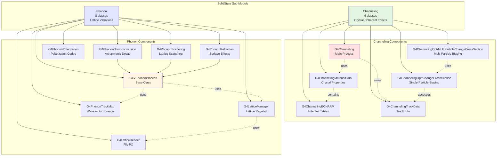
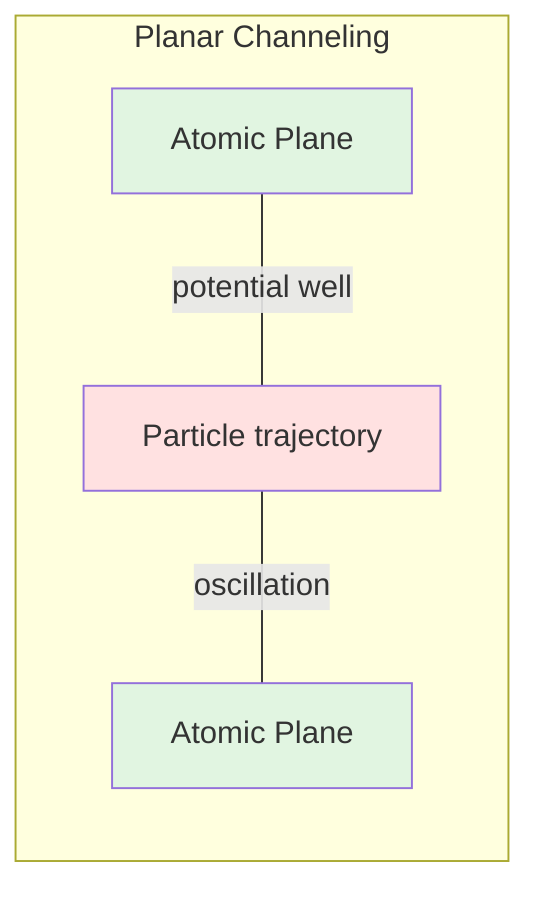

# Processes SolidState Sub-Module

## Overview

The SolidState sub-module provides specialized physics processes for simulating coherent phenomena in crystalline materials, including particle channeling in oriented crystals and phonon propagation in low-temperature solids. This sub-module enables simulation of advanced solid-state physics effects that are critical for applications in accelerator physics, radiation damage studies, and cryogenic detector development.

::: tip Module Location
**Source:** `source/processes/solidstate/`
**Headers:** `source/processes/solidstate/*/include/`
**Size:** 14 header files across 2 sub-modules (channeling and phonon)
:::

## Purpose

The SolidState sub-module serves two specialized physics domains:

### Channeling Physics

- **Crystal Channeling**: Simulation of charged particle motion in crystalline potential wells
- **Bent Crystal Applications**: Beam steering and extraction using curved crystals
- **Channeling Radiation**: Electromagnetic radiation from channeled particles
- **Dechanneling Processes**: Particle escape from channeling states
- **Volume Reflection**: Beam deflection at crystal surfaces
- **Biasing Support**: Cross-section modification for channeling interactions

### Phonon Physics

- **Lattice Vibrations**: Propagation of quantized lattice vibrations (phonons)
- **Anharmonic Decay**: Phonon downconversion processes
- **Phonon Scattering**: Interaction with lattice defects and boundaries
- **Surface Reflection**: Phonon reflection at crystal boundaries
- **Cryogenic Detectors**: Low-temperature detector simulation support

---

## Architecture

### Module Organization

The SolidState sub-module is organized into two distinct sub-modules:



---

## Channeling Physics

### Physical Background

**Particle channeling** is a coherent phenomenon that occurs when charged particles enter a crystal at small angles relative to major crystallographic planes or axes. The regular arrangement of atomic nuclei creates a periodic potential that can trap and guide particles.

#### Classical vs Quantum Description

**Classical Picture** (Valid for E >> critical energy):
- Particles oscillate in the transverse potential between atomic planes
- Continuous potential averages over individual atomic interactions
- Critical angle: θ_c ≈ √(2U/E) where U is potential depth, E is particle energy

**Quantum Picture** (Low energies):
- Particle wavefunction distributed across crystal channels
- Quantized transverse energy levels
- Coherent interaction with periodic crystal structure

### Types of Channeling

#### Planar Channeling

Particles confined between parallel crystallographic planes:



**Characteristics**:
- 1D confinement perpendicular to planes
- Wider angular acceptance than axial channeling
- Used for beam deflection applications
- Critical angle: θ_c ≈ 5-10 mrad for GeV protons in Si

**Location**: Implemented in `G4Channeling::GetCriticalAngle()` (Lines 84-86 in `source/processes/solidstate/channeling/include/G4Channeling.hh`)

#### Axial Channeling

Particles confined around crystallographic axes:

**Characteristics**:
- 2D confinement in plane perpendicular to axis
- Smaller angular acceptance
- Stronger confinement
- Higher critical energy

### Bent Crystal Applications

Crystals can be mechanically bent to create curved channels, enabling beam steering:

**Applications**:
1. **Beam Extraction**: Deflecting halo particles from accelerator beams
2. **Beam Collimation**: Crystal-assisted collimation systems (LHC, Tevatron)
3. **Beam Splitting**: Non-destructive beam division
4. **Radiation Sources**: Channeling radiation from bent crystals

**Implementation**: `G4ChannelingMaterialData::IsBent()` and `GetBR()` (Lines 81-90 in `source/processes/solidstate/channeling/include/G4ChannelingMaterialData.hh`)

```cpp
virtual G4bool IsBent() {
    return bIsBent;
}

virtual G4ThreeVector GetBR(G4ThreeVector& v3) {
    return G4ThreeVector(fVectorR->Value(v3.z()),0.,0.);
}
```

### Channeling Radiation

Particles oscillating in crystal channels emit electromagnetic radiation:

**Characteristics**:
- Frequency: ω ≈ 2πγv/L_osc where L_osc is oscillation period
- Highly directional emission
- Quasi-monochromatic spectrum
- Used for X-ray and gamma-ray sources

**Oscillation Period Calculation**: Lines 87-90 in `source/processes/solidstate/channeling/include/G4Channeling.hh`

```cpp
G4double GetOscillationPeriod(const G4Track& aTrack){
    return (CLHEP::pi * GetMatData(aTrack)->GetPot()->GetIntSp(0)
            / GetCriticalAngle(aTrack));
}
```

### Dechanneling

Process by which channeled particles escape from the potential well:

**Mechanisms**:
1. **Multiple Scattering**: Accumulation of small-angle scattering
2. **Nuclear Encounters**: Close collisions with nuclei
3. **Inelastic Interactions**: Energy loss processes
4. **Surface Scattering**: Defects and surface roughness

**Dechanneling Length**: Characteristic length scale for particle loss from channeling state

### ECHARM Tables

The **ECHARM** (Evaluated CHanneling RAdiation Model) format stores pre-calculated crystal potentials and field distributions:

**Data Components** (Lines 59-78 in `source/processes/solidstate/channeling/include/G4ChannelingMaterialData.hh`):
- **Potential**: Electrostatic potential distribution U(x,y)
- **Electric Fields**: E_x(x,y) and E_y(x,y) components
- **Nuclei Density**: Nuclear density distribution ρ_n(x,y)
- **Electron Density**: Electron density distribution ρ_e(x,y)

```cpp
G4ChannelingECHARM* GetPot() {return fPotential;};
G4ChannelingECHARM* GetEFX() {return fElectricFieldX;};
G4ChannelingECHARM* GetEFY() {return fElectricFieldY;};
G4ChannelingECHARM* GetNuD() {return fNucleiDensity;};
G4ChannelingECHARM* GetElD() {return fElectronDensity;};
```

### Channeling Biasing

The module provides sophisticated biasing operators to enhance channeling simulation efficiency:

**Density Ratio Types** (Lines 52-58 in `source/processes/solidstate/channeling/include/G4ChannelingOptrChangeCrossSection.hh`):

```cpp
enum G4ChannelingDensityRatio{
    fDensityRatioNotDefined = -1,
    fDensityRatioNone = 0,
    fDensityRatioNuDElD = 1,  // Nuclear + Electron density
    fDensityRatioNuD = 2,      // Nuclear density only
    fDensityRatioElD = 3       // Electron density only
};
```

**Purpose**: Modify interaction cross-sections based on local crystal density variations to account for channeling effects on particle interactions.

---

## Phonon Physics

### Physical Background

**Phonons** are quantized lattice vibrations in crystalline materials. At cryogenic temperatures, phonon propagation becomes the dominant energy transport mechanism and is critical for understanding detector response and thermal properties.

### Phonon Types

Crystals support three phonon polarizations:

#### Longitudinal (L) Phonons

**Characteristics**:
- Displacement parallel to propagation direction
- Compression waves
- Higher velocity than transverse modes
- Acoustic phonons only

**Code**: `G4PhononPolarization::Long = 0` (Line 39 in `source/processes/solidstate/phonon/include/G4PhononPolarization.hh`)

#### Transverse Slow (TS) Phonons

**Characteristics**:
- Displacement perpendicular to propagation
- Shear waves
- Lower velocity
- Can be acoustic or optical

**Code**: `G4PhononPolarization::TransSlow = 1`

#### Transverse Fast (TF) Phonons

**Characteristics**:
- Displacement perpendicular to propagation
- Second transverse branch
- Intermediate velocity
- Can be acoustic or optical

**Code**: `G4PhononPolarization::TransFast = 2`

### Lattice Management

The lattice system manages crystal properties and phonon dispersion relations:

**G4LatticeManager** (Lines 47-103 in `source/processes/solidstate/phonon/include/G4LatticeManager.hh`):
- **Singleton Pattern**: Global thread-local storage (TLS) for lattice data
- **Material Association**: Links lattice properties to G4Material instances
- **Volume Association**: Links lattice orientations to physical volumes
- **Dispersion Relations**: Provides ω(k) mapping for all polarizations

**G4LatticeReader** (Lines 42-76 in `source/processes/solidstate/phonon/include/G4LatticeReader.hh`):
- Reads configuration files from `$G4LATTICEDATA` directory
- Parses velocity maps and direction vectors
- Supports material-specific subdirectories

### Phonon Processes

#### Downconversion (Anharmonic Decay)

Phonons can decay into lower-energy phonons via anharmonic lattice interactions:

**Decay Channels**:
1. **L → L' + T'**: Longitudinal splits into L + T
2. **L → T' + T''**: Longitudinal splits into two transverse
3. **T → T' + T''**: Transverse splits into two transverse

**Implementation**: `G4PhononDownconversion` (Lines 35-64 in `source/processes/solidstate/phonon/include/G4PhononDownconversion.hh`)

**Key Methods**:
- `GetLTDecayProb()`: L→L+T decay probability (Line 49)
- `GetTTDecayProb()`: T→T+T decay probability (Line 50)
- `MakeLTSecondaries()`: Create L+T daughter phonons (Line 56)
- `MakeTTSecondaries()`: Create T+T daughter phonons (Line 55)

**Physical Constants** (Lines 59-59):
```cpp
G4double fBeta, fGamma, fLambda, fMu;  // Anharmonic coupling parameters
```

#### Scattering

Phonons scatter from:
- **Lattice imperfections**: Point defects, dislocations
- **Grain boundaries**: Polycrystalline materials
- **Isotopic disorder**: Random isotope distribution
- **Anharmonic effects**: Phonon-phonon scattering

**Implementation**: `G4PhononScattering` (Lines 35-50 in `source/processes/solidstate/phonon/include/G4PhononScattering.hh`)

**Scattering Process**:
- Current phonon is killed
- New phonon created with different k-vector
- Energy and momentum not perfectly conserved (thermal bath)

#### Reflection

Phonons reflect at crystal surfaces and interfaces:

**Implementation**: `G4PhononReflection` (Lines 36-53 in `source/processes/solidstate/phonon/include/G4PhononReflection.hh`)

**Current Behavior**: Placeholder process that absorbs phonons at boundaries or converts them to detector hits.

**Tolerance Parameter** (Line 47):
```cpp
G4double kCarTolerance;  // Geometrical tolerance for surface detection
```

### Phonon Track Data

Phonons require wavevector k information beyond standard G4Track data:

**G4PhononTrackMap** (Lines 40-73 in `source/processes/solidstate/phonon/include/G4PhononTrackMap.hh`):
- **Thread-Local Singleton**: Separate map for each worker thread
- **Track Association**: Maps G4Track pointer to G4ThreeVector wavevector
- **Temporary Solution**: Will be replaced when k-vector added to G4Track

**Key Methods**:
- `SetK(track, K)`: Store wavevector for track (Line 50)
- `GetK(track)`: Retrieve wavevector for track (Line 54)
- `Find(track)`: Check if track is registered (Line 58)
- `RemoveTrack(track)`: Clean up at end of tracking (Line 62)

---

## Example Usage

### Setting Up Channeling Simulation

#### 1. Create Extended Material with Channeling Data

```cpp
// Create base material
G4Material* Silicon = G4NistManager::Instance()->FindOrBuildMaterial("G4_Si");

// Create extended material
G4ExtendedMaterial* SiliconCrystal = new G4ExtendedMaterial("SiliconCrystal", Silicon);

// Create and attach channeling material data
G4ChannelingMaterialData* channelingData =
    new G4ChannelingMaterialData("channeling");

// Load ECHARM tables for Si (110) plane
channelingData->SetFilename("Si110");  // Reads from data directory

// Register with extended material
SiliconCrystal->RegisterExtension(channelingData);
```

**Reference**: `G4ChannelingMaterialData` constructor (Line 44 in `source/processes/solidstate/channeling/include/G4ChannelingMaterialData.hh`)

#### 2. Create Crystal Logical Volume

```cpp
// Create logical volume with crystal material
G4LogicalCrystalVolume* crystalLogical =
    new G4LogicalCrystalVolume(crystalSolid, SiliconCrystal, "CrystalLV");

// Set crystal orientation (rotation matrix)
G4RotationMatrix* crystalRotation = new G4RotationMatrix();
crystalRotation->rotateY(2.0*mrad);  // 2 mrad alignment angle

// Place crystal in world
new G4PVPlacement(crystalRotation, G4ThreeVector(0,0,10*cm),
                  crystalLogical, "CrystalPV", worldLogical, false, 0);
```

#### 3. Register Channeling Process

```cpp
// In PhysicsList::ConstructProcess()
G4Channeling* channelingProcess = new G4Channeling();

// Set integration parameters
channelingProcess->SetTimeStepMin(0.1*picosecond);
channelingProcess->SetTransverseVariationMax(0.01*angstrom);

// Add to charged particle processes
auto particleIterator = GetParticleIterator();
particleIterator->reset();

while((*particleIterator)()) {
    G4ParticleDefinition* particle = particleIterator->value();
    G4ProcessManager* pmanager = particle->GetProcessManager();

    if(particle->GetPDGCharge() != 0.0) {
        pmanager->AddDiscreteProcess(channelingProcess);
    }
}
```

**Reference**: `G4Channeling::IsApplicable()` (Lines 48-50 in `source/processes/solidstate/channeling/include/G4Channeling.hh`)

#### 4. Configure Bent Crystal (Optional)

```cpp
// Set constant bending radius
channelingData->SetBR(40.0*m);  // 40 meter radius

// Or load position-dependent bending
channelingData->SetBR("data/bending_profile.txt");
```

**Reference**: `G4ChannelingMaterialData::SetBR()` (Lines 88-89 in `source/processes/solidstate/channeling/include/G4ChannelingMaterialData.hh`)

#### 5. Add Biasing (Optional)

```cpp
// Create multi-particle biasing operator
G4ChannelingOptrMultiParticleChangeCrossSection* biasing =
    new G4ChannelingOptrMultiParticleChangeCrossSection();

// Add particle types to bias
biasing->AddParticle("proton");
biasing->AddParticle("pi+");
biasing->AddParticle("pi-");

// Or bias all charged particles
biasing->AddChargedParticles();

// Attach to crystal logical volume
G4BiasingHelper::AttachVolume(crystalLogical, biasing);
```

**Reference**: `G4ChannelingOptrMultiParticleChangeCrossSection` (Lines 50-112 in `source/processes/solidstate/channeling/include/G4ChannelingOptrMultiParticleChangeCrossSection.hh`)

### Setting Up Phonon Simulation

#### 1. Load Lattice Configuration

```cpp
// Get lattice manager
G4LatticeManager* latManager = G4LatticeManager::GetLatticeManager();

// Create material
G4Material* Germanium = G4NistManager::Instance()->FindOrBuildMaterial("G4_Ge");

// Load lattice from $G4LATTICEDATA/Ge/ directory
G4LatticeLogical* germaniumLattice = latManager->LoadLattice(Germanium, "Ge");

// Associate with physical volume
G4VPhysicalVolume* detectorPV = ...;  // Your detector volume
latManager->RegisterLattice(detectorPV, germaniumLattice);
```

**Reference**: `G4LatticeManager::LoadLattice()` (Lines 66-71 in `source/processes/solidstate/phonon/include/G4LatticeManager.hh`)

#### 2. Register Phonon Processes

```cpp
// In PhysicsList, get phonon particle definitions
G4ParticleDefinition* phononL = G4PhononLong::Definition();
G4ParticleDefinition* phononTS = G4PhononTransSlow::Definition();
G4ParticleDefinition* phononTF = G4PhononTransFast::Definition();

// Create phonon processes
G4PhononDownconversion* downconversion = new G4PhononDownconversion();
G4PhononScattering* scattering = new G4PhononScattering();
G4PhononReflection* reflection = new G4PhononReflection();

// Add to each phonon type
for(auto phonon : {phononL, phononTS, phononTF}) {
    G4ProcessManager* pmanager = phonon->GetProcessManager();

    pmanager->AddDiscreteProcess(downconversion);
    pmanager->AddDiscreteProcess(scattering);
    pmanager->AddDiscreteProcess(reflection);
}
```

**Reference**: `G4VPhononProcess::IsApplicable()` (Line 46 in `source/processes/solidstate/phonon/include/G4VPhononProcess.hh`)

#### 3. Create Phonons in Detector

```cpp
// In sensitive detector or particle generation
G4ThreeVector position = ...;
G4ThreeVector kVector = ...; // Phonon wavevector
G4double energy = ...; // Phonon energy

// Select polarization based on density of states
G4int polarization = G4PhononPolarization::Long;

// Get lattice at position
G4LatticePhysical* lattice =
    G4LatticeManager::GetLatticeManager()->GetLattice(currentVolume);

// Calculate phonon velocity from dispersion
G4ThreeVector velocity = lattice->MapKtoVDir(polarization, kVector);

// Create phonon track
G4ParticleDefinition* phononDef = G4PhononPolarization::Get(polarization);
G4DynamicParticle* phonon = new G4DynamicParticle(phononDef, velocity, energy);

G4Track* phononTrack = new G4Track(phonon, currentTime, position);

// Register wavevector
G4PhononTrackMap::GetPhononTrackMap()->SetK(phononTrack, kVector);

// Add to secondary list
fpParticleChange->AddSecondary(phononTrack);
```

**Reference**: `G4PhononTrackMap::SetK()` (Lines 50-51 in `source/processes/solidstate/phonon/include/G4PhononTrackMap.hh`)

---

## Key Physics Concepts

### Critical Angle (Channeling)

The maximum angle at which a particle can enter a crystal and remain channeled:

**Formula**:
```
θ_c = √(2U₀/E)
```

where:
- U₀ = Potential well depth (typically 10-30 eV)
- E = Particle energy

**Implementation**: Lines 84-86 in `source/processes/solidstate/channeling/include/G4Channeling.hh`

```cpp
G4double GetCriticalAngle(const G4Track& aTrack){
    return std::sqrt(2.0*GetMatData(aTrack)->GetPot()->GetMaxMin()
                     /GetPre(aTrack)->GetTotalEnergy());
}
```

**Typical Values**:
- 400 GeV protons in Si: θ_c ≈ 5 μrad
- 1 GeV protons in Si: θ_c ≈ 10 μrad
- Scales as θ_c ∝ E^(-1/2)

### Continuum Potential

The averaged potential experienced by channeled particles:

**Lindhard Potential**:
```
U(x) = U₀ exp(-x²/a²)
```

where:
- a = Thomas-Fermi screening radius ≈ 0.2 Å
- x = Distance from atomic plane/axis

**Stored in ECHARM Tables**: The actual potential is pre-calculated from realistic atomic charge distributions and stored in 1D (planar) or 2D (axial) grids.

### Phonon Dispersion Relations

The relationship between phonon frequency ω and wavevector k:

**Debye Model** (Low k):
```
ω = v_s |k|
```

where v_s is the sound velocity.

**Full Dispersion**: Stored in velocity map files read by G4LatticeReader, providing ω(k) for all three polarizations across the full Brillouin zone.

**Velocity Calculation**: Lines 77-80 in `source/processes/solidstate/phonon/include/G4LatticeManager.hh`

```cpp
G4double MapKtoV(G4VPhysicalVolume*, G4int polarization,
                 const G4ThreeVector& k) const;

G4ThreeVector MapKtoVDir(G4VPhysicalVolume*, G4int polarization,
                         const G4ThreeVector& k) const;
```

### Anharmonic Coupling

Phonon interactions arise from anharmonic terms in the lattice potential:

**Hamiltonian**:
```
H = H₀ + H₃ + H₄ + ...
```

where:
- H₀ = Harmonic (quadratic) terms → Non-interacting phonons
- H₃ = Cubic anharmonic terms → 3-phonon processes (downconversion)
- H₄ = Quartic terms → 4-phonon processes

**Coupling Constants**: Lines 59-59 in `source/processes/solidstate/phonon/include/G4PhononDownconversion.hh`

```cpp
G4double fBeta, fGamma, fLambda, fMu;  // Material-dependent parameters
```

These determine the relative probabilities of different decay channels.

---

## Performance Considerations

### Channeling

**Integration Time Steps**:
- Smaller steps: More accurate trajectory integration
- Larger steps: Faster simulation
- Set via `SetTimeStepMin()` (Line 118 in `G4Channeling.hh`)

**Transverse Position Updates**:
- Controls accuracy of channeling trajectory
- Set via `SetTransverseVariationMax()` (Line 115)
- Typical value: 0.01-0.1 Angstrom

**Biasing**:
- Essential for rare channeling events
- Reduces simulation time by orders of magnitude
- Must carefully track bias weights

### Phonons

**Velocity Map Resolution**:
- Higher resolution: More accurate dispersion
- Lower resolution: Less memory, faster lookup
- Typical: 100×100 grid in k-space

**Process Cross-Sections**:
- Scattering dominates at high temperatures
- Downconversion important at intermediate energies
- Reflection only at boundaries

---

## Related Examples

### Channeling Examples

**Location**: `examples/extended/exoticphysics/channeling/`

- **ch0**: Basic bent crystal channeling (400 GeV protons)
- **ch1**: Channeling radiation with G4ChannelingFastSimModel
- **ch2**: Full channeling + radiation parameter study
- **ch3**: Coherent pair production in oriented crystals

### Phonon Examples

While no dedicated phonon example exists in the main Geant4 distribution, phonon physics is demonstrated in:

- **CaTS** (Cryogenic Teststand Simulation): External project for cryogenic detector simulation
- Low-temperature detector applications
- Superconducting detector simulations

---

## API Documentation

Detailed API documentation for individual classes:

### Channeling Classes

- [G4Channeling](api/g4channeling.md) - Main channeling process
- [G4ChannelingECHARM](api/g4channelingecharm.md) - Potential and field tables
- [G4ChannelingMaterialData](api/g4channelingmaterialdata.md) - Crystal properties
- [G4ChannelingTrackData](api/g4channelingtrackdata.md) - Auxiliary track information
- [G4ChannelingOptrChangeCrossSection](api/g4channelingoptrchangecrosssection.md) - Single-particle biasing
- [G4ChannelingOptrMultiParticleChangeCrossSection](api/g4channelingoptrmultiparticlechangecrosssection.md) - Multi-particle biasing

### Phonon Classes

- [G4VPhononProcess](api/g4vphononprocess.md) - Base class for phonon processes
- [G4PhononDownconversion](api/g4phonondownconversion.md) - Anharmonic decay
- [G4PhononScattering](api/g4phononscattering.md) - Lattice scattering
- [G4PhononReflection](api/g4phononreflection.md) - Surface reflection
- [G4LatticeManager](api/g4latticemanager.md) - Lattice registry
- [G4LatticeReader](api/g4latticereader.md) - Configuration file reader
- [G4PhononTrackMap](api/g4phonontracmap.md) - Wavevector storage
- [G4PhononPolarization](api/g4phononpolarization.md) - Polarization utilities

---

## References

### Channeling Physics

1. **Lindhard, J.** (1965). "Influence of Crystal Lattice on Motion of Energetic Charged Particles." *Mat. Fys. Medd. Dan. Vid. Selsk.* 34, no. 14.

2. **Biryukov, V.M., Chesnokov, Y.A., Kotov, V.I.** (1997). "Crystal Channeling and its Application at High-Energy Accelerators." Springer.

3. **Scandale, W. et al.** (2008). "First Results on the SPS Beam Collimation with Bent Crystals." *Phys. Lett. B* 692, 78-82.

4. **Bagli, E. et al.** (2014). "Electromagnetic Dissociation of Pb Ions at LHC." *Eur. Phys. J. Plus* 129, 40.

### Phonon Physics

1. **Ashcroft, N.W. and Mermin, N.D.** (1976). "Solid State Physics." Holt, Rinehart and Winston.

2. **Kittel, C.** (2004). "Introduction to Solid State Physics." 8th Edition, Wiley.

3. **Zelevinsky, V. et al.** (2006). "Phonon-induced deexcitation in atomic nuclei." *Phys. Rev. C* 74, 034301.

### Geant4 Implementation

4. **Bagli, E.** (2017). "Simulation of Coherent Radiation in Oriented Crystals with Geant4." *EPJ Web of Conferences* 137, 06001.

5. **Agnello, M. et al.** (2018). "Simulation of ultra-cold neutron anomalous losses in Geant4." *Nucl. Instrum. Meth. A* 889, 56-62.

---

## Development History

**Channeling**: Created April 2017 by E. Bagli (INFN)
**Phonon**: Developed by M. Kelsey (SLAC) for cryogenic detector applications

See `source/processes/solidstate/channeling/History` and `source/processes/solidstate/phonon/History` for detailed version history.
