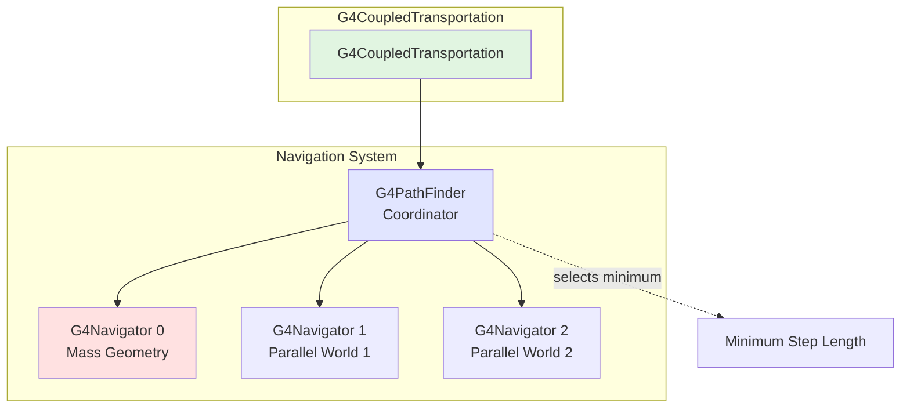
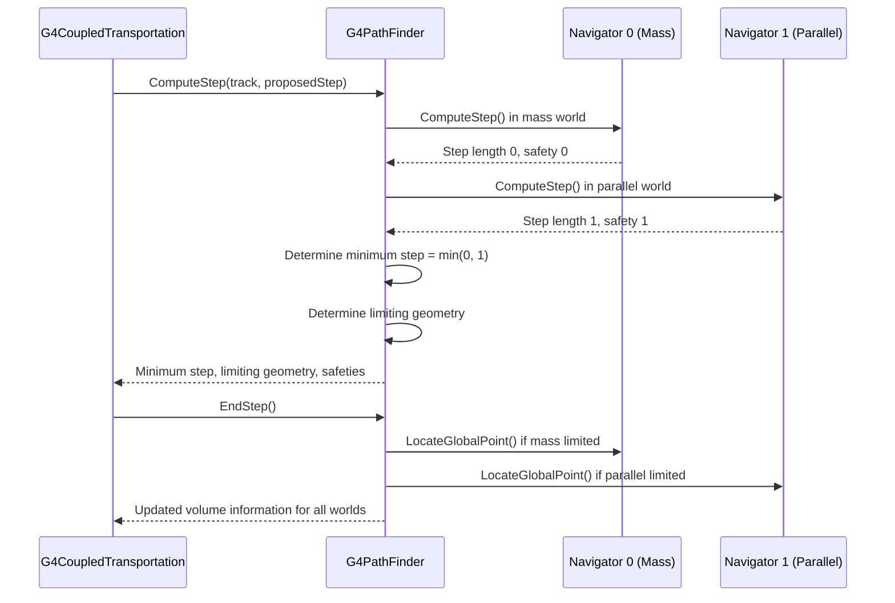
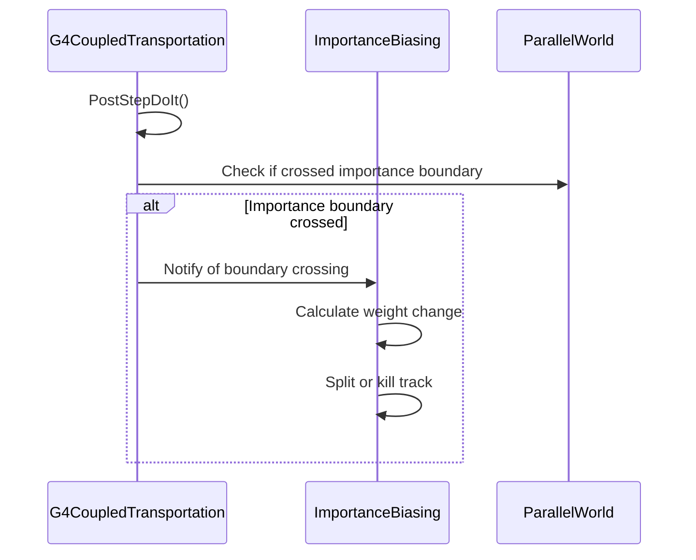

# G4CoupledTransportation

## Overview

`G4CoupledTransportation` extends `G4Transportation` to handle particle propagation in multiple parallel geometries simultaneously. It is automatically used when parallel worlds are registered for importance biasing, scoring, or fast simulation. The class coordinates navigation across all geometries and determines which geometry limits each step.

**Class Type:** Concrete Process (extends G4Transportation)
**Base Class:** `G4Transportation`
**Process Type:** `fTransportation`
**Headers:** `source/processes/transportation/include/G4CoupledTransportation.hh`

---

## Purpose

G4CoupledTransportation provides:

- **Multi-Geometry Navigation:** Simultaneous navigation in mass + parallel geometries
- **Coordinated Boundary Detection:** Finds first boundary in any geometry
- **Geometry-Specific Flags:** Separate tracking for mass vs. parallel boundaries
- **Importance Biasing Support:** Required for variance reduction with parallel worlds
- **Scoring Support:** Enables detector readout in parallel geometry
- **Fast Simulation Support:** Parameterized regions in parallel geometry

---

## Class Definition

```cpp
class G4CoupledTransportation : public G4Transportation
{
public:
    G4CoupledTransportation(G4int verbosityLevel = 0);
    ~G4CoupledTransportation();

    // AlongStep interface (overrides base class)
    G4double AlongStepGetPhysicalInteractionLength(
        const G4Track& track,
        G4double  previousStepSize,
        G4double  currentMinimumStep,
        G4double& currentSafety,
        G4GPILSelection* selection);

    // PostStep interface (overrides base class)
    G4VParticleChange* PostStepDoIt(
        const G4Track& track,
        const G4Step&  stepData);

    // Configuration
    static void SetSignifyStepsInAnyVolume(G4bool anyVol);
    static G4bool GetSignifyStepsInAnyVolume();

    // Geometry-specific step queries
    G4bool IsFirstStepInAnyVolume() const;
    G4bool IsLastStepInAnyVolume() const;
    G4bool IsFirstStepInMassVolume() const;
    G4bool IsLastStepInMassVolume() const;

    // Lifecycle
    void StartTracking(G4Track* aTrack);
    void EndTracking();

private:
    G4PathFinder* fPathFinder;
    G4double fPreviousMassSafety;
    G4double fPreviousFullSafety;
    G4bool fMassGeometryLimitedStep;
    G4bool fFirstStepInMassVolume;

    static G4bool fSignifyStepInAnyVolume;
};
```

**File Reference:** `source/processes/transportation/include/G4CoupledTransportation.hh` (lines 56-135)

---

## Key Concepts

### Parallel Geometries

Geant4 supports multiple parallel geometries existing simultaneously:

**Mass Geometry (World 0):**
- Primary geometry where physics occurs
- Contains detector materials and volumes
- Defines where physics interactions happen

**Parallel Geometries (World 1, 2, ...):**
- Overlay geometries for special purposes
- Examples:
  - Importance biasing regions
  - Scoring meshes or readout geometry
  - Fast simulation envelopes
- No material properties (transparent to physics)

### Multi-Navigator Coordination



---

## Key Methods

### Navigation Methods

#### AlongStepGetPhysicalInteractionLength()
```cpp
G4double AlongStepGetPhysicalInteractionLength(
    const G4Track& track,
    G4double  previousStepSize,
    G4double  currentMinimumStep,
    G4double& currentSafety,
    G4GPILSelection* selection);
```

**Purpose:** Compute step length considering all parallel geometries.

**Algorithm:**
1. Calls `G4PathFinder::ComputeStep()` instead of single `G4Navigator`
2. PathFinder queries all registered navigators
3. Determines which geometry has nearest boundary
4. Computes safety as minimum across all geometries
5. If charged particle in field, integrates through field
6. Returns minimum of all geometric and field limits

**Key Differences from G4Transportation:**
- Uses `G4PathFinder` for multi-geometry coordination
- Tracks separate safety values for mass vs. full geometry
- Records which geometry limited the step

**Returns:** Minimum step length across all geometries

**File:** `G4CoupledTransportation.hh` (lines 64-70)

---

#### PostStepDoIt()
```cpp
G4VParticleChange* PostStepDoIt(
    const G4Track& track,
    const G4Step&  stepData);
```

**Purpose:** Update volume information for all geometries at step end.

**Actions:**
1. **Query PathFinder:** Which geometry limited step?
2. **Mass Geometry Update:**
   - If mass geometry boundary crossed: update mass world volume
   - Update material properties if mass world changed
3. **Parallel Geometry Updates:**
   - Update volume information for each parallel world
   - Notify importance biasing if applicable
   - Update scoring mesh location if applicable
4. **Set Step Flags:**
   - `fFirstStepInVolume` / `fLastStepInVolume` based on configuration
   - `fMassGeometryLimitedStep` indicates if mass world limited step

**Boundary Coordination:**
If multiple geometries have boundaries at same location:
- Mass geometry boundary processed first
- Parallel geometry boundaries processed in order
- Volume information updated for all affected worlds

**Returns:** `G4ParticleChangeForTransport` with multi-geometry updates

**File:** `G4CoupledTransportation.hh` (lines 74-77)

---

### Configuration Methods

#### SetSignifyStepsInAnyVolume() / GetSignifyStepsInAnyVolume()
```cpp
static void SetSignifyStepsInAnyVolume(G4bool anyVol);
static G4bool GetSignifyStepsInAnyVolume();
```

**Purpose:** Control meaning of step flags `fFirstStepInVolume` / `fLastStepInVolume`.

**Modes:**

**`SetSignifyStepsInAnyVolume(true)` - ANY geometry:**
- `fFirstStepInVolume = true` if entering ANY volume in ANY geometry
- `fLastStepInVolume = true` if leaving ANY volume in ANY geometry
- Use case: Need to know about all boundary crossings

**`SetSignifyStepsInAnyVolume(false)` - MASS geometry only:**
- `fFirstStepInVolume = true` only for mass geometry boundaries
- `fLastStepInVolume = true` only for mass geometry boundaries
- Use case: Only care about material changes

**Default:** `true` (any geometry)

**Usage:**
```cpp
// Before initialization
G4CoupledTransportation::SetSignifyStepsInAnyVolume(false);
// Now step flags reflect only mass geometry
```

**File:** `G4CoupledTransportation.hh` (lines 83-89, 132)

---

### Geometry-Specific Step Queries

#### IsFirstStepInAnyVolume() / IsLastStepInAnyVolume()
```cpp
G4bool IsFirstStepInAnyVolume() const;
G4bool IsLastStepInAnyVolume() const;
```

**Purpose:** Query if step crosses ANY geometry boundary.

**Returns:**
- `true` if boundary crossed in mass OR any parallel geometry
- Independent of `fSignifyStepInAnyVolume` flag

**Use Case:**
```cpp
void MySteppingAction::UserSteppingAction(const G4Step* step)
{
    const G4VProcess* process =
        step->GetPostStepPoint()->GetProcessDefinedStep();

    if(const G4CoupledTransportation* coupled =
        dynamic_cast<const G4CoupledTransportation*>(process))
    {
        if(coupled->IsFirstStepInAnyVolume()) {
            // Entered new volume in some geometry
            // Could be mass or parallel world
        }
    }
}
```

**File:** `G4CoupledTransportation.hh` (lines 94-95)

---

#### IsFirstStepInMassVolume() / IsLastStepInMassVolume()
```cpp
G4bool IsFirstStepInMassVolume() const;
G4bool IsLastStepInMassVolume() const;
```

**Purpose:** Query if step crosses MASS geometry boundary specifically.

**Returns:**
- `true` only if boundary crossed in mass (physics) geometry
- `false` for parallel-world-only boundaries

**Use Case:**
```cpp
void MySteppingAction::UserSteppingAction(const G4Step* step)
{
    // Check for material change (mass geometry only)
    if(coupledTransportation->IsLastStepInMassVolume())
    {
        // Material changed - physics processes will be updated
        G4Material* newMaterial =
            step->GetPostStepPoint()->GetMaterial();
    }
}
```

**File:** `G4CoupledTransportation.hh` (lines 96-97)

---

### Lifecycle Methods

#### StartTracking()
```cpp
void StartTracking(G4Track* aTrack);
```

**Purpose:** Initialize multi-geometry navigation for new track.

**Actions:**
- Calls base class `G4Transportation::StartTracking()`
- Initializes `G4PathFinder` for new track
- Resets geometry-specific flags
- Clears cached safety values for all geometries
- Locates track in all geometries

**File:** `G4CoupledTransportation.hh` (line 101)

---

#### EndTracking()
```cpp
void EndTracking();
```

**Purpose:** Clean up after track completes.

**Actions:**
- Notifies `G4PathFinder` that track is complete
- Clears multi-geometry state
- Resets navigator states

**File:** `G4CoupledTransportation.hh` (line 102)

---

## Member Variables

```cpp
G4PathFinder* fPathFinder;              // Line 118
    // Coordinator for all navigators

G4double fPreviousMassSafety;           // Line 121
    // Safety in mass geometry only

G4double fPreviousFullSafety;           // Line 122
    // Safety considering all geometries (minimum)

G4bool fMassGeometryLimitedStep;        // Line 124
    // True if mass world determined step length

G4bool fFirstStepInMassVolume;          // Line 129
    // True for first step in mass geometry volume

static G4bool fSignifyStepInAnyVolume;  // Line 132
    // Controls flag semantics (static configuration)
```

---

## Usage Examples

### Automatic Usage

G4CoupledTransportation is used automatically when parallel worlds exist:

```cpp
// In detector construction
G4VPhysicalVolume* DetectorConstruction::Construct()
{
    // Build mass geometry
    return worldPhysical;
}

void DetectorConstruction::ConstructParallelGeometry()
{
    // Build parallel world (e.g., for scoring)
    G4VPhysicalVolume* parallelWorld = /* ... */;

    // G4CoupledTransportation automatically replaces G4Transportation
}
```

---

### Accessing Step Flags

```cpp
void MySteppingAction::UserSteppingAction(const G4Step* step)
{
    // Get transportation process
    const G4VProcess* process =
        step->GetPostStepPoint()->GetProcessDefinedStep();

    if(const G4CoupledTransportation* coupled =
        dynamic_cast<const G4CoupledTransportation*>(process))
    {
        // Check geometry-specific boundaries
        G4bool anyBoundary = coupled->IsLastStepInAnyVolume();
        G4bool massBoundary = coupled->IsLastStepInMassVolume();

        if(anyBoundary && !massBoundary) {
            G4cout << "Crossed parallel world boundary only" << G4endl;
        }

        if(massBoundary) {
            G4cout << "Crossed mass geometry boundary - material change"
                   << G4endl;
        }
    }
}
```

---

### Configuring Flag Behavior

```cpp
void MyPhysicsList::ConstructProcess()
{
    // Configure before adding transportation
    // Set to false if you only care about mass geometry boundaries
    G4CoupledTransportation::SetSignifyStepsInAnyVolume(false);

    AddTransportation();  // Will use G4CoupledTransportation if parallel worlds exist
}

void MySteppingAction::UserSteppingAction(const G4Step* step)
{
    // Now fFirstStepInVolume only reflects mass geometry
    if(step->IsFirstStepInVolume()) {
        // This is a material boundary
    }

    // But can still query all boundaries explicitly
    if(coupledTransport->IsFirstStepInAnyVolume()) {
        // Boundary in any world
    }
}
```

---

### Accessing Parallel World Volumes

```cpp
void MySteppingAction::UserSteppingAction(const G4Step* step)
{
    // Get pre-step point
    G4StepPoint* preStep = step->GetPreStepPoint();

    // Get touchable (volume hierarchy information)
    const G4TouchableHandle& touchable = preStep->GetTouchable();

    // Volume in mass geometry (world 0)
    G4VPhysicalVolume* massVolume = touchable->GetVolume();
    G4cout << "Mass world: " << massVolume->GetName() << G4endl;

    // Volume in parallel world 1 (if exists)
    G4VPhysicalVolume* parallelVolume = touchable->GetVolume(1);
    if(parallelVolume) {
        G4cout << "Parallel world 1: " << parallelVolume->GetName() << G4endl;
    }

    // Volume in parallel world 2 (if exists)
    parallelVolume = touchable->GetVolume(2);
    if(parallelVolume) {
        G4cout << "Parallel world 2: " << parallelVolume->GetName() << G4endl;
    }
}
```

---

## Integration with Other Components

### With G4PathFinder



---

### With Importance Biasing



---

## Performance Considerations

### Navigation Overhead

Multi-geometry navigation has performance cost:
- Each step queries multiple navigators
- Safety calculation across all geometries (minimum)
- More boundary checks

**Mitigation:**
- Keep parallel geometries simple
- Use coarse meshes for scoring/biasing
- Minimize number of parallel worlds

### Safety Conservative

Safety is minimum across all geometries:
```cpp
safety_full = min(safety_mass, safety_parallel1, safety_parallel2, ...)
```

- More conservative than single geometry
- May result in more frequent safety updates
- Trade-off: correctness vs. performance

---

## Common Use Cases

### Importance Biasing

Parallel world defines importance regions:

```cpp
// Parallel world defines regions with different importances
void DetectorConstruction::ConstructParallelGeometry()
{
    // Create parallel world
    G4VPhysicalVolume* parallelWorld = /* ... */;

    // Define importance scorer
    G4IStore* istore = G4IStore::GetInstance(parallelWorld->GetName());

    // Set importances for volumes
    istore->AddImportanceGeometryCell(1, parallelRegion1);  // Importance = 1
    istore->AddImportanceGeometryCell(10, parallelRegion2); // Importance = 10
}

// G4CoupledTransportation coordinates with importance process
```

---

### Scoring Mesh

Parallel world for detector readout:

```cpp
void DetectorConstruction::ConstructParallelGeometry()
{
    // Create 3D scoring mesh
    G4VPhysicalVolume* scoringWorld = /* construct mesh */;

    // Sensitive detector in parallel world
    G4MultiFunctionalDetector* scorer =
        new G4MultiFunctionalDetector("scorer");
    scorer->RegisterPrimitive(new G4PSDoseDeposit("dose"));

    logicalScorer->SetSensitiveDetector(scorer);
}

// G4CoupledTransportation ensures scoring happens even if
// no boundary in mass geometry
```

---

### Fast Simulation

Parallel world defines parameterization envelopes:

```cpp
void DetectorConstruction::ConstructParallelGeometry()
{
    // Create envelope in parallel world
    G4VPhysicalVolume* fastSimWorld = /* ... */;

    // Attach fast simulation model
    G4Region* fastRegion = new G4Region("FastRegion");
    fastRegion->AddRootLogicalVolume(logicalFastVol);

    new MyFastSimulationModel("FastModel", fastRegion);
}

// G4CoupledTransportation ensures fast sim triggered when
// entering parallel world envelope
```

---

## Comparison: G4Transportation vs. G4CoupledTransportation

| Feature | G4Transportation | G4CoupledTransportation |
|---------|------------------|-------------------------|
| **Geometries** | Single (mass) only | Multiple (mass + parallel) |
| **Navigator** | G4Navigator | G4PathFinder (coordinates multiple G4Navigators) |
| **Step Calculation** | Single geometry | Minimum across all geometries |
| **Safety** | Single geometry | Minimum across all geometries |
| **Boundary Flags** | Single meaning | Configurable (any vs. mass) |
| **Performance** | Faster | Slower (multiple navigations) |
| **Use Case** | Standard simulation | Biasing, scoring, fast simulation |
| **Automatic Selection** | No parallel worlds | Parallel worlds registered |

---

## Advanced Topics

### Multiple Parallel Worlds

G4CoupledTransportation handles arbitrary number of parallel worlds:

```cpp
// World 0: Mass geometry
G4VPhysicalVolume* massWorld = /* mass detector */;

// World 1: Scoring mesh
G4VPhysicalVolume* scoringWorld = /* readout geometry */;

// World 2: Importance biasing
G4VPhysicalVolume* biasingWorld = /* importance regions */;

// World 3: Fast simulation
G4VPhysicalVolume* fastSimWorld = /* shower parameterization */;

// G4CoupledTransportation coordinates all four worlds
```

---

### Debugging Multi-Geometry Navigation

```cpp
void MySteppingAction::UserSteppingAction(const G4Step* step)
{
    const G4VProcess* process =
        step->GetPostStepPoint()->GetProcessDefinedStep();

    if(const G4CoupledTransportation* coupled =
        dynamic_cast<const G4CoupledTransportation*>(process))
    {
        // Get PathFinder for detailed info
        G4PathFinder* pathFinder = G4PathFinder::GetInstance();

        // Check which world limited step
        for(int i = 0; i < pathFinder->GetMaxLoopCount(); ++i) {
            G4Navigator* nav = pathFinder->GetNavigator(i);
            G4cout << "World " << i << ": "
                   << nav->GetWorldVolume()->GetName()
                   << G4endl;
        }

        // Get geometry-specific step lengths
        G4cout << "Mass geometry limited: "
               << coupled->IsLastStepInMassVolume() << G4endl;
        G4cout << "Any geometry limited: "
               << coupled->IsLastStepInAnyVolume() << G4endl;
    }
}
```

---

## Thread Safety

**Thread-Local State:**
- Each worker thread has independent G4CoupledTransportation instances
- Each thread has separate G4PathFinder instance
- Navigator states are thread-local

**Shared Read-Only:**
- All geometry definitions (mass and parallel)
- Volume hierarchies
- Material properties

**Static Configuration:**
- `fSignifyStepInAnyVolume` is static (must be set before initialization)
- Thread-safe if configured in master thread

---

## Related Classes

- [**G4Transportation**](./g4transportation.md) - Base class (single geometry)
- [**G4PathFinder**](../../../geometry/navigation/api/g4pathfinder.md) - Multi-geometry coordinator
- [**G4Navigator**](../../../geometry/navigation/api/g4navigator.md) - Single geometry navigation
- [**G4ParallelWorldProcess**](../../biasing/api/g4parallelworldprocess.md) - Parallel geometry support
- [**G4IStore**](../../biasing/api/g4istore.md) - Importance store for biasing

---

## References

### Source Files
- Header: `source/processes/transportation/include/G4CoupledTransportation.hh`
- Implementation: `source/processes/transportation/src/G4CoupledTransportation.cc`

### Documentation
- [Transportation Module Overview](../index.md)
- [Geometry Navigation Module](../../../geometry/navigation/)
- Geant4 Application Developer's Guide, Chapter 4.4 (Parallel Geometries)

---

::: tip See Also
- [G4Transportation](./g4transportation.md) for single-geometry details
- [Biasing Module](../../biasing/) for importance sampling
- [Geometry Module](../../../geometry/) for parallel world construction
:::

---

::: info Last Updated
**Date:** 2025-11-17
**Class Version:** Geant4 11.4.0.beta
**Header:** G4CoupledTransportation.hh (lines 56-135)
:::
