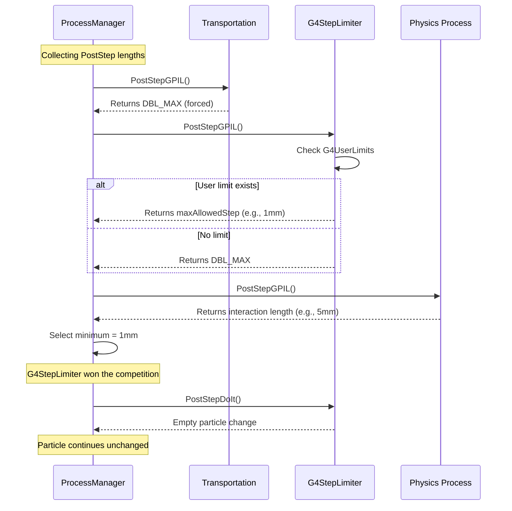

# G4StepLimiter

## Overview

`G4StepLimiter` is a simple utility process that enforces user-defined maximum step sizes. It reads the `MaxAllowedStep` parameter from `G4UserLimits` attached to logical volumes and limits particle steps accordingly. This is useful for controlling spatial resolution, improving accuracy in high-gradient regions, and ensuring adequate sampling in sensitive detectors.

**Class Type:** Utility Process
**Base Class:** `G4VProcess`
**Process Type:** `fGeneral`
**Process Mode:** PostStep discrete
**Headers:** `source/processes/transportation/include/G4StepLimiter.hh`

---

## Purpose

G4StepLimiter provides:

- **Step Size Control:** Enforce maximum step length in specific volumes
- **Spatial Resolution:** Ensure adequate sampling for scoring and analysis
- **Field Accuracy:** Improve trajectory accuracy in high-gradient fields
- **Detector Sensitivity:** Guarantee hits in thin layers or small volumes
- **Volume-Specific Limits:** Different step limits for different regions

---

## Class Definition

```cpp
class G4StepLimiter : public G4VProcess
{
public:
    G4StepLimiter(const G4String& processName = "StepLimiter");
    virtual ~G4StepLimiter();

    // PostStep interface (only active mode)
    virtual G4double PostStepGetPhysicalInteractionLength(
        const G4Track& track,
        G4double   previousStepSize,
        G4ForceCondition* condition);

    virtual G4VParticleChange* PostStepDoIt(
        const G4Track&,
        const G4Step&);

    // Inactive modes (return -1 or nullptr)
    virtual G4double AtRestGetPhysicalInteractionLength(
        const G4Track&, G4ForceCondition*)
        { return -1.0; }

    virtual G4VParticleChange* AtRestDoIt(
        const G4Track&, const G4Step&)
        { return nullptr; }

    virtual G4double AlongStepGetPhysicalInteractionLength(
        const G4Track&, G4double, G4double,
        G4double&, G4GPILSelection*)
        { return -1.0; }

    virtual G4VParticleChange* AlongStepDoIt(
        const G4Track&, const G4Step&)
        { return nullptr; }
};
```

**File Reference:** `source/processes/transportation/include/G4StepLimiter.hh` (lines 44-98)

---

## Key Methods

### PostStepGetPhysicalInteractionLength()
```cpp
virtual G4double PostStepGetPhysicalInteractionLength(
    const G4Track& track,
    G4double   previousStepSize,
    G4ForceCondition* condition);
```

**Purpose:** Returns the maximum allowed step size for the current volume.

**Algorithm:**
1. Gets current logical volume from track
2. Retrieves `G4UserLimits` from logical volume
3. If limits exist, calls `GetMaxAllowedStep(track)`
4. Returns the maximum allowed step length

**Returns:**
- User-defined maximum step if `G4UserLimits` attached to volume
- `DBL_MAX` if no limits defined (no constraint)

**Force Condition:**
- Sets `*condition = NotForced`
- Process proposes step limit but doesn't force interaction

**Example:**
```cpp
// If volume has G4UserLimits with maxStep = 1mm
// PostStepGPIL returns 1mm
// If track would travel 5mm, limited to 1mm by this process
```

**File:** `G4StepLimiter.hh` (lines 52-56)

---

### PostStepDoIt()
```cpp
virtual G4VParticleChange* PostStepDoIt(
    const G4Track&,
    const G4Step&);
```

**Purpose:** Called when step limited by this process (rarely).

**Implementation:**
- Returns empty particle change (no physical interaction)
- Particle continues with unchanged state
- This process only limits step length, doesn't modify particle

**Returns:** `G4VParticleChange` with no modifications

**Note:** Usually not called because other processes (transportation, physics) handle the step. This process only proposes a step limit.

**File:** `G4StepLimiter.hh` (lines 58-62)

---

## How It Works

### Process Execution Model



### Key Points

1. **Proposal Only:** G4StepLimiter only proposes a step length, it doesn't perform physics
2. **Competition:** Competes with other PostStep processes for step limitation
3. **Transparent:** When it "wins", particle continues unchanged after the limited step
4. **Per-Volume:** Each volume can have different limits via G4UserLimits

---

## Usage Examples

### Basic Setup

```cpp
// 1. In DetectorConstruction: Attach limits to logical volume
void MyDetectorConstruction::Construct()
{
    // Create logical volume
    G4LogicalVolume* detectorLV = new G4LogicalVolume(
        detectorSolid, detectorMaterial, "Detector");

    // Create user limits with maximum step
    G4UserLimits* stepLimit = new G4UserLimits();
    stepLimit->SetMaxAllowedStep(0.5*mm);  // Max step = 0.5 mm

    // Attach to logical volume
    detectorLV->SetUserLimits(stepLimit);

    return worldPV;
}

// 2. In PhysicsList: Register G4StepLimiter for all particles
void MyPhysicsList::ConstructProcess()
{
    AddTransportation();

    // Add StepLimiter to all particles
    auto particleIterator = GetParticleIterator();
    particleIterator->reset();
    while((*particleIterator)())
    {
        G4ParticleDefinition* particle = particleIterator->value();
        G4ProcessManager* pManager = particle->GetProcessManager();

        if(pManager) {
            pManager->AddDiscreteProcess(new G4StepLimiter());
        }
    }

    // ... add other physics processes
}
```

---

### Using Physics Constructor (Recommended)

```cpp
#include "G4StepLimiterPhysics.hh"

MyPhysicsList::MyPhysicsList()
{
    // ... register other physics constructors

    // Register step limiter physics
    // This automatically adds G4StepLimiter to all particles
    RegisterPhysics(new G4StepLimiterPhysics());
}
```

---

### Volume-Specific Step Limits

```cpp
void MyDetectorConstruction::Construct()
{
    // Different limits for different regions

    // Thin detector layer - small steps for accuracy
    G4UserLimits* thinLayerLimits = new G4UserLimits();
    thinLayerLimits->SetMaxAllowedStep(0.1*mm);
    thinDetectorLV->SetUserLimits(thinLayerLimits);

    // Thick absorber - larger steps for performance
    G4UserLimits* absorberLimits = new G4UserLimits();
    absorberLimits->SetMaxAllowedStep(5.0*mm);
    absorberLV->SetUserLimits(absorberLimits);

    // Sensitive gas detector - very small steps
    G4UserLimits* gasLimits = new G4UserLimits();
    gasLimits->SetMaxAllowedStep(0.01*mm);
    gasChamberLV->SetUserLimits(gasLimits);

    // Volumes without limits use physics/transportation defaults
}
```

---

### Conditional Step Limits

G4UserLimits can define step limits as function of particle properties:

```cpp
// Custom user limits class
class MyUserLimits : public G4UserLimits
{
public:
    virtual G4double GetMaxAllowedStep(const G4Track& track) override
    {
        // Different limits for different particles
        G4ParticleDefinition* particle = track.GetDefinition();

        if(particle == G4Electron::Definition()) {
            return 0.1*mm;  // Small steps for electrons
        }
        else if(particle == G4Gamma::Definition()) {
            return 10*mm;   // Larger steps for gammas
        }
        else {
            return 1*mm;    // Default for others
        }
    }
};

// In detector construction
detectorLV->SetUserLimits(new MyUserLimits());
```

---

### Step Limit with Field

For regions with magnetic field, limit steps for trajectory accuracy:

```cpp
void MyDetectorConstruction::ConstructSDandField()
{
    // Create strong magnetic field
    G4UniformMagField* magField = new G4UniformMagField(
        G4ThreeVector(0., 0., 3.0*tesla));

    G4FieldManager* fieldMgr = new G4FieldManager(magField);
    fieldMgr->SetDetectorField(magField);
    fieldMgr->CreateChordFinder(magField);

    // Limit step size in field for accuracy
    G4UserLimits* fieldLimits = new G4UserLimits();
    fieldLimits->SetMaxAllowedStep(0.5*mm);  // Small steps in field

    magnetLogical->SetFieldManager(fieldMgr, true);
    magnetLogical->SetUserLimits(fieldLimits);
}
```

---

## Interaction with G4UserLimits

### G4UserLimits Overview

`G4UserLimits` stores multiple user-defined limits:

```cpp
class G4UserLimits
{
public:
    void SetMaxAllowedStep(G4double ustepMax);
    void SetUserMaxTrackLength(G4double utrakMax);
    void SetUserMaxTime(G4double utimeMax);
    void SetUserMinEkine(G4double uekinMin);
    void SetUserMinRange(G4double urangMin);

    virtual G4double GetMaxAllowedStep(const G4Track& track);
    // ... other getters
};
```

**G4StepLimiter uses:** Only `GetMaxAllowedStep()`

**Other limits used by:** `G4UserSpecialCuts` process

---

## Use Cases

### 1. Thin Detectors

Ensure sufficient hits in thin layers:

```cpp
// Silicon strip detector, 300 μm thick
G4UserLimits* stripLimits = new G4UserLimits();
stripLimits->SetMaxAllowedStep(50*um);  // ~6 steps through layer
stripLV->SetUserLimits(stripLimits);
```

---

### 2. High-Gradient Fields

Improve trajectory accuracy:

```cpp
// Quadrupole magnet with strong gradients
G4UserLimits* quadLimits = new G4UserLimits();
quadLimits->SetMaxAllowedStep(0.2*mm);  // Fine sampling
quadrupoleLV->SetUserLimits(quadLimits);
```

---

### 3. Scoring Mesh

Ensure scoring granularity:

```cpp
// Dose scoring grid
G4UserLimits* scoringLimits = new G4UserLimits();
// Step size ~ voxel size / 2
scoringLimits->SetMaxAllowedStep(2.5*mm);  // 5mm voxels
scoringVolumeLV->SetUserLimits(scoringLimits);
```

---

### 4. Optical Processes

Control photon propagation in optics:

```cpp
// Optical fiber or waveguide
G4UserLimits* opticalLimits = new G4UserLimits();
opticalLimits->SetMaxAllowedStep(0.1*mm);  // Fine optical sampling
fiberLV->SetUserLimits(opticalLimits);
```

---

## Performance Considerations

### Step Size Trade-offs

**Small Steps:**
- ✅ Better spatial resolution
- ✅ More accurate trajectories
- ✅ Better scoring statistics
- ❌ Slower simulation
- ❌ More memory usage

**Large Steps:**
- ✅ Faster simulation
- ✅ Less memory usage
- ❌ Poor spatial resolution
- ❌ May miss thin layers
- ❌ Less accurate fields

### Optimization Strategy

```cpp
// Be selective - only limit where needed
void MyDetectorConstruction::Construct()
{
    // NO limit in bulk materials
    bulkLV->SetUserLimits(nullptr);  // Use defaults

    // Small limit only in critical regions
    G4UserLimits* criticalLimits = new G4UserLimits(0.1*mm);
    sensitiveDetectorLV->SetUserLimits(criticalLimits);

    // Medium limit in intermediate regions
    G4UserLimits* mediumLimits = new G4UserLimits(1.0*mm);
    trackerLV->SetUserLimits(mediumLimits);
}
```

### Impact Assessment

```cpp
// Monitor step size distribution
void MySteppingAction::UserSteppingAction(const G4Step* step)
{
    G4double stepLength = step->GetStepLength();

    // Check if StepLimiter constrained step
    const G4VProcess* limitingProcess =
        step->GetPostStepPoint()->GetProcessDefinedStep();

    if(limitingProcess &&
       limitingProcess->GetProcessName() == "StepLimiter")
    {
        G4cout << "Step limited by G4StepLimiter: "
               << stepLength/mm << " mm" << G4endl;
    }
}
```

---

## Best Practices

### 1. Apply Limits Judiciously

```cpp
// ❌ Bad: Limit everywhere
worldLV->SetUserLimits(new G4UserLimits(0.1*mm));  // Affects entire world!

// ✅ Good: Limit only where needed
detectorLV->SetUserLimits(new G4UserLimits(0.1*mm));  // Only detector
```

---

### 2. Match Limit to Geometry Scale

```cpp
// Rule of thumb: maxStep < 0.5 * feature_size

// Thin layer (1 mm thick)
G4UserLimits* thinLimits = new G4UserLimits(0.3*mm);

// Medium volume (10 cm)
G4UserLimits* mediumLimits = new G4UserLimits(5*mm);

// Large volume (1 m)
// No limit - let physics determine step
```

---

### 3. Consider Physics Ranges

```cpp
// Don't make steps smaller than physics range
void SetReasonableStepLimit(G4LogicalVolume* lv,
                           G4Material* material,
                           G4double energy)
{
    // Get electron range in material at given energy
    G4EmCalculator calc;
    G4double range = calc.GetRange(energy,
                                   G4Electron::Definition(),
                                   material);

    // Step limit ~ range / 10
    G4double maxStep = range / 10.0;
    lv->SetUserLimits(new G4UserLimits(maxStep));
}
```

---

### 4. Coordinate with Production Cuts

```cpp
// Production cuts and step limits should be compatible

// If production cut = 1 mm (electron won't be produced below range = 1mm)
region->SetProductionCut(1*mm, "e-");

// Step limit should be similar scale or larger
G4UserLimits* limits = new G4UserLimits(0.5*mm);  // Compatible
// Not: new G4UserLimits(0.01*mm);  // Too small, wasted effort
```

---

## Debugging

### Check Which Process Limited Step

```cpp
void MySteppingAction::UserSteppingAction(const G4Step* step)
{
    // Get process that determined step length
    const G4VProcess* process =
        step->GetPostStepPoint()->GetProcessDefinedStep();

    G4cout << "Step " << step->GetTrack()->GetCurrentStepNumber()
           << " limited by: ";

    if(process) {
        G4cout << process->GetProcessName();
    } else {
        G4cout << "Transportation (AlongStep)";
    }

    G4cout << ", length = " << step->GetStepLength()/mm
           << " mm" << G4endl;
}
```

---

### Verify User Limits Applied

```cpp
void MyDetectorConstruction::Construct()
{
    // ... build geometry

    // Verify limits after construction
    G4LogicalVolume* lv = G4LogicalVolumeStore::GetInstance()
        ->GetVolume("Detector");

    G4UserLimits* limits = lv->GetUserLimits();
    if(limits) {
        G4cout << "Detector max step: "
               << limits->GetMaxAllowedStep(G4Track())/mm
               << " mm" << G4endl;
    } else {
        G4cout << "WARNING: No user limits on Detector!" << G4endl;
    }
}
```

---

## Comparison with Other Limiters

| Process | Limits | Particle | Action |
|---------|--------|----------|--------|
| **G4StepLimiter** | Max step size | All | Limit step length only |
| **G4UserSpecialCuts** | Track length, time, min energy | All | Kill track if exceeded |
| **G4Transportation** | Geometry boundaries | All | Navigation |
| **Production Cuts** | Secondary production threshold | γ, e±, p± | Suppress secondary production |

---

## Related Classes

- [**G4UserLimits**](../../../geometry/volumes/api/g4userlimits.md) - Stores limit values
- [**G4UserSpecialCuts**](./g4userspecialcuts.md) - Enforces track cuts
- [**G4Transportation**](./g4transportation.md) - Geometry-based transport
- [**G4VProcess**](../../management/api/g4vprocess.md) - Process base class

---

## Common Issues

### Issue: Step Limiter Not Working

**Symptoms:** Steps longer than specified limit

**Diagnosis:**
1. Check if `G4StepLimiter` registered in physics list
2. Verify `G4UserLimits` attached to logical volume
3. Check if daughter volumes inherit limits

**Solution:**
```cpp
// Ensure process registered
pManager->AddDiscreteProcess(new G4StepLimiter());

// Verify limit attached
detectorLV->SetUserLimits(limits);

// Check in stepping action
G4UserLimits* ul = step->GetPreStepPoint()->GetPhysicalVolume()
    ->GetLogicalVolume()->GetUserLimits();
if(!ul) G4cout << "No limits!" << G4endl;
```

---

### Issue: Simulation Too Slow

**Symptoms:** Excessive number of steps

**Diagnosis:**
```cpp
// Count steps per event
void MyEventAction::EndOfEventAction(const G4Event* event)
{
    G4int totalSteps = 0;
    for(int i = 0; i < event->GetNumberOfTracks(); ++i) {
        // Count steps
    }
    G4cout << "Total steps: " << totalSteps << G4endl;
}
```

**Solution:**
- Increase step limit where possible
- Remove limits from non-critical volumes
- Check if limits too restrictive

---

## References

### Source Files
- Header: `source/processes/transportation/include/G4StepLimiter.hh`
- Implementation: `source/processes/transportation/src/G4StepLimiter.cc`

### Related Documentation
- [Transportation Module Overview](../index.md)
- [G4UserLimits Documentation](../../../geometry/volumes/api/g4userlimits.md)
- Geant4 Application Developer's Guide, Chapter 5.1.3

---

::: tip See Also
- [G4UserSpecialCuts](./g4userspecialcuts.md) for track termination
- [G4StepLimiterPhysics](../../../physics_lists/constructors/api/g4steplimiterphysics.md) for convenient registration
- [Production Cuts](../../cuts/) for secondary production control
:::

---

::: info Last Updated
**Date:** 2025-11-17
**Class Version:** Geant4 11.4.0.beta
**Header:** G4StepLimiter.hh (lines 44-98)
:::
