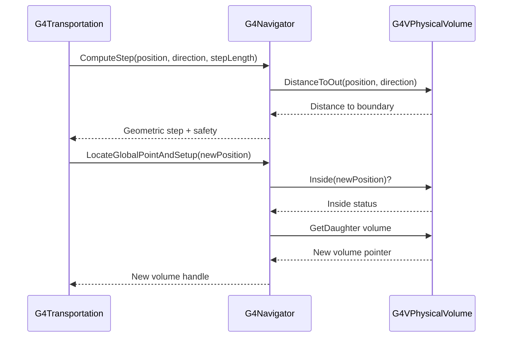
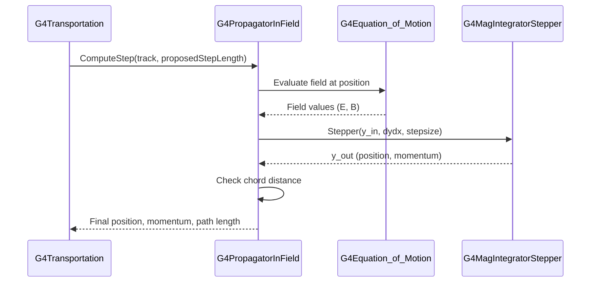

# G4Transportation

## Overview

`G4Transportation` is the fundamental process responsible for propagating particles through the detector geometry. It handles both neutral particle motion in straight lines and charged particle motion in electromagnetic fields, manages geometry boundary crossings, and maintains safety information for performance optimization.

**Class Type:** Concrete Process
**Base Class:** `G4VProcess`
**Process Type:** `fTransportation`
**Headers:** `source/processes/transportation/include/G4Transportation.hh`

---

## Purpose

G4Transportation provides:

- **Geometric Propagation:** Moving particles from point to point through geometry
- **Boundary Detection:** Identifying when particles cross volume boundaries
- **Field Integration:** Computing curved trajectories for charged particles
- **Volume Updates:** Maintaining current volume and material information
- **Safety Management:** Caching distance to nearest boundary for optimization
- **Looper Handling:** Detecting and managing particles stuck in fields

---

## Class Definition

```cpp
class G4Transportation : public G4VProcess
{
public:
    G4Transportation(G4int verbosityLevel = 1,
                    const G4String& aName = "Transportation");
    ~G4Transportation();

    // AlongStep interface
    G4double AlongStepGetPhysicalInteractionLength(
        const G4Track& track,
        G4double  previousStepSize,
        G4double  currentMinimumStep,
        G4double& currentSafety,
        G4GPILSelection* selection);

    G4VParticleChange* AlongStepDoIt(
        const G4Track& track,
        const G4Step& stepData);

    // PostStep interface
    G4VParticleChange* PostStepDoIt(
        const G4Track& track,
        const G4Step& stepData);

    G4double PostStepGetPhysicalInteractionLength(
        const G4Track&,
        G4double previousStepSize,
        G4ForceCondition* pForceCond);

    // Configuration methods
    void SetPropagatorInField(G4PropagatorInField* pFieldPropagator);
    G4PropagatorInField* GetPropagatorInField();

    // Looper threshold configuration
    void SetThresholdWarningEnergy(G4double newEnWarn);
    void SetThresholdImportantEnergy(G4double newEnImp);
    void SetThresholdTrials(G4int newMaxTrials);

    G4double GetThresholdWarningEnergy() const;
    G4double GetThresholdImportantEnergy() const;
    G4int GetThresholdTrials() const;

    void SetHighLooperThresholds();
    void SetLowLooperThresholds();

    // Looper statistics
    G4double GetMaxEnergyKilled() const;
    G4double GetSumEnergyKilled() const;
    void ResetKilledStatistics(G4int report = 1);

    // Optimization
    void EnableShortStepOptimisation(G4bool optimise = true);

    // Static configuration
    static G4bool EnableMagneticMoment(G4bool useMoment = true);
    static G4bool EnableGravity(G4bool useGravity = true);
    static void SetSilenceLooperWarnings(G4bool val);
    static G4bool GetSilenceLooperWarnings();

    // Process lifecycle
    void StartTracking(G4Track* aTrack);
    void ProcessDescription(std::ostream& outFile) const override;
    void PrintStatistics(std::ostream& outStr) const;
};
```

**File Reference:** `source/processes/transportation/include/G4Transportation.hh` (lines 57-241)

---

## Key Methods

### Transportation Execution

#### AlongStepGetPhysicalInteractionLength()
```cpp
G4double AlongStepGetPhysicalInteractionLength(
    const G4Track& track,
    G4double  previousStepSize,
    G4double  currentMinimumStep,
    G4double& currentSafety,
    G4GPILSelection* selection);
```

**Purpose:** Computes the geometric step length for particle transport.

**Algorithm:**
1. Gets current position and direction from track
2. Calls `G4Navigator::ComputeStep()` for geometric limit
3. If charged particle in field, calls `G4PropagatorInField::ComputeStep()`
4. Returns minimum of geometric and field-limited steps
5. Updates `currentSafety` with computed safety value

**Returns:** Proposed step length (distance to boundary or field limit)

**Selection:** Sets to `CandidateForSelection` (always proposes a step)

**File:** `G4Transportation.hh` (lines 66-72)

---

#### AlongStepDoIt()
```cpp
G4VParticleChange* AlongStepDoIt(
    const G4Track& track,
    const G4Step& stepData);
```

**Purpose:** Performs the actual transport along the computed step.

**Actions:**
1. **Neutral Particles (no field):**
   - Updates position: `newPosition = oldPosition + stepLength * direction`
   - Momentum direction unchanged

2. **Charged Particles (with field):**
   - Retrieves integrated trajectory from `G4PropagatorInField`
   - Updates position and momentum direction
   - Updates spin if polarization tracked
   - Checks for looping (repeated zero-progress steps)

3. **Updates G4ParticleChange:**
   - New position via `ProposePosition()`
   - New momentum direction via `ProposeMomentumDirection()`
   - Energy unchanged (transport is conservative)
   - Updates global time

4. **Safety Update:**
   - Computes and caches safety at new position
   - Informs `G4SafetyHelper` of new safety value

**Returns:** `G4ParticleChangeForTransport` with updated track state

**Looper Detection:**
If particle makes no progress in field (same position after step):
- Increments looper trial counter
- If energy < warning threshold: kill silently
- If warning < energy < important: kill with warning
- If energy > important: allow `fThresholdTrials` attempts
- Updates looper statistics

**File:** `G4Transportation.hh` (lines 74-77)

---

#### PostStepDoIt()
```cpp
G4VParticleChange* PostStepDoIt(
    const G4Track& track,
    const G4Step& stepData);
```

**Purpose:** Handles geometry boundary crossing and volume relocation.

**Actions:**
1. **If Geometry Limited Step:**
   - Calls `G4Navigator::LocateGlobalPointAndSetup()` at new position
   - Gets new volume from navigator
   - Updates track's `G4TouchableHandle` with new volume hierarchy
   - Sets material properties for new volume

2. **Updates Step Flags:**
   - `fFirstStepInVolume = true` if entering new volume
   - `fLastStepInVolume = true` if exiting current volume
   - `fGeometryLimitedStep` status

3. **Boundary Status:**
   - Sets `G4StepStatus` to `fGeomBoundary` if crossed boundary
   - Updates step's pre/post step points

**Returns:** `G4ParticleChangeForTransport` with relocation information

**Note:** This method is always called (forced PostStep), but only performs relocation if geometry limited the step.

**File:** `G4Transportation.hh` (lines 79-82)

---

#### PostStepGetPhysicalInteractionLength()
```cpp
G4double PostStepGetPhysicalInteractionLength(
    const G4Track&,
    G4double previousStepSize,
    G4ForceCondition* pForceCond);
```

**Purpose:** Forces PostStepDoIt to be called without limiting step.

**Implementation:**
- Sets `*pForceCond = Forced`
- Returns `DBL_MAX` (does not constrain step)

**Reasoning:** Transportation must always check for boundary crossing, but the step length is determined by AlongStep, not PostStep.

**File:** `G4Transportation.hh` (lines 85-89)

---

### Configuration Methods

#### SetPropagatorInField() / GetPropagatorInField()
```cpp
void SetPropagatorInField(G4PropagatorInField* pFieldPropagator);
G4PropagatorInField* GetPropagatorInField();
```

**Purpose:** Access field propagator for charged particle integration.

**Usage:**
```cpp
G4Transportation* transport = /* ... */;
G4PropagatorInField* prop = transport->GetPropagatorInField();
prop->SetMinimumEpsilonStep(1e-7);  // Adjust integration accuracy
```

**File:** `G4Transportation.hh` (lines 95-97)

---

#### Looper Threshold Configuration

```cpp
void SetThresholdWarningEnergy(G4double newEnWarn);
void SetThresholdImportantEnergy(G4double newEnImp);
void SetThresholdTrials(G4int newMaxTrials);

G4double GetThresholdWarningEnergy() const;
G4double GetThresholdImportantEnergy() const;
G4int GetThresholdTrials() const;
```

**Purpose:** Configure energy thresholds for looping particle handling.

**Parameters:**
- **Warning Energy (default: 1 keV):** Below this, loopers killed silently
- **Important Energy (default: 1 MeV):** Above this, loopers get multiple trials
- **Threshold Trials (default: 10):** Number of attempts for important particles

**Thresholds:**
- `E < E_warning`: Kill immediately, no message
- `E_warning <= E < E_important`: Kill with warning message
- `E >= E_important`: Allow N trials before killing

**File:** `G4Transportation.hh` (lines 99-105, 201-202)

---

#### SetHighLooperThresholds() / SetLowLooperThresholds()
```cpp
void SetHighLooperThresholds();
void SetLowLooperThresholds();
```

**Purpose:** Convenience methods for preset threshold configurations.

**High Thresholds (HEP applications):**
- Warning Energy: 100 MeV
- Important Energy: 250 MeV
- Trials: 10

**Low Thresholds (Medical/low-energy physics):**
- Warning Energy: 1 eV
- Important Energy: 1 keV
- Trials: 25

**Usage:**
```cpp
G4Transportation* transport = /* ... */;
transport->SetLowLooperThresholds();  // For low-energy simulations
```

**File:** `G4Transportation.hh` (lines 111-112)

---

### Statistics and Monitoring

#### Looper Statistics
```cpp
G4double GetMaxEnergyKilled() const;
G4double GetSumEnergyKilled() const;
void ResetKilledStatistics(G4int report = 1);
```

**Purpose:** Monitor energy lost to killed looping particles.

**Tracked Statistics:**
- Maximum energy of any killed particle
- Sum of energies of all killed particles
- Separate statistics for electrons vs. other particles
- Count of killed particles

**Usage:**
```cpp
G4Transportation* transport = /* ... */;
G4double totalKilled = transport->GetSumEnergyKilled();
G4cout << "Energy lost to loopers: " << totalKilled/MeV << " MeV" << G4endl;
transport->ResetKilledStatistics();  // Reset for next event
```

**File:** `G4Transportation.hh` (lines 116-118, 213-226)

---

#### PrintStatistics()
```cpp
void PrintStatistics(std::ostream& outStr) const;
```

**Purpose:** Print detailed transportation statistics.

**Output Includes:**
- Number of loopers killed
- Energy statistics (max, sum, mean)
- Separate electron and non-electron statistics
- Number of saved loopers (survived trials)

**File:** `G4Transportation.hh` (line 151)

---

### Optimization Controls

#### EnableShortStepOptimisation()
```cpp
void EnableShortStepOptimisation(G4bool optimise = true);
```

**Purpose:** Skip navigator call for short steps when no field present.

**Optimization:**
- If step length < safety and no field: skip `Navigator::ComputeStep()`
- Trades slightly conservative safety estimate for performance
- Only applies to neutral particles or regions without fields

**Default:** Enabled

**File:** `G4Transportation.hh` (line 121, 230)

---

### Static Configuration

#### EnableMagneticMoment()
```cpp
static G4bool EnableMagneticMoment(G4bool useMoment = true);
```

**Purpose:** Enable force on particles due to magnetic moment.

**Physics:**
Adds force term: **F** = ∇(**μ** · **B**)

**Usage:**
```cpp
// Before creating transportation processes
G4Transportation::EnableMagneticMoment(true);
```

**Particles Affected:** Primarily neutrons with magnetic moment

**File:** `G4Transportation.hh` (line 124, 237)

---

#### EnableGravity()
```cpp
static G4bool EnableGravity(G4bool useGravity = true);
```

**Purpose:** Enable gravitational force on particles.

**Physics:**
Adds force term: **F** = m**g**

**Usage:**
```cpp
G4Transportation::EnableGravity(true);
```

**Note:** Rarely used; significant only for ultra-cold neutrons or precision measurements.

**File:** `G4Transportation.hh` (line 127, 238)

---

#### SetSilenceLooperWarnings() / GetSilenceLooperWarnings()
```cpp
static void SetSilenceLooperWarnings(G4bool val);
static G4bool GetSilenceLooperWarnings();
```

**Purpose:** Suppress all warnings about looping particles.

**Usage:**
```cpp
// Silence looper warnings (e.g., if intentional in strong fields)
G4Transportation::SetSilenceLooperWarnings(true);
```

**File:** `G4Transportation.hh` (lines 130-132, 239)

---

### Process Lifecycle

#### StartTracking()
```cpp
void StartTracking(G4Track* aTrack);
```

**Purpose:** Reset state for new track.

**Actions:**
- Resets `fNewTrack` flag
- Resets `fFirstStepInVolume` flag
- Clears safety information
- Resets looper trial counter
- Initializes field propagator for new track

**Called By:** `G4TrackingManager` at start of each track

**File:** `G4Transportation.hh` (line 147)

---

## Member Variables

### Navigation Components

```cpp
G4Navigator* fLinearNavigator;              // Line 161
G4PropagatorInField* fFieldPropagator;      // Line 164
G4SafetyHelper* fpSafetyHelper;             // Line 232
G4TransportationLogger* fpLogger;           // Line 233
```

**Purpose:** Core components for geometry and field handling.

---

### State Variables

```cpp
G4ThreeVector fTransportEndPosition;        // Line 167
G4ThreeVector fTransportEndMomentumDir;     // Line 168
G4double      fTransportEndKineticEnergy;   // Line 169
G4ThreeVector fTransportEndSpin;            // Line 170
G4bool        fMomentumChanged;             // Line 171
```

**Purpose:** Store particle state at end of transport step.

---

### Flags

```cpp
G4bool fParticleIsLooping;                  // Line 178
G4bool fNewTrack;                           // Line 179
G4bool fFirstStepInVolume;                  // Line 180
G4bool fLastStepInVolume;                   // Line 181
G4bool fGeometryLimitedStep;                // Line 183
G4bool fFieldExertedForce;                  // Line 186
G4bool fAnyFieldExists;                     // Line 176
```

**Purpose:** Track state for step-by-step decisions.

---

### Looper Configuration

```cpp
G4double fThreshold_Warning_Energy;         // Line 201 (default: 1 keV)
G4double fThreshold_Important_Energy;       // Line 202 (default: 1 MeV)
G4int    fThresholdTrials;                  // Line 203 (default: 10)
G4int    fNoLooperTrials;                   // Line 210 (counter)
```

**Purpose:** Control looping particle behavior.

---

### Statistics

```cpp
G4double fSumEnergyKilled;                  // Line 214
G4double fMaxEnergyKilled;                  // Line 216
unsigned long fNumLoopersKilled;            // Line 218
// Additional statistics for electrons vs. non-electrons
```

**Purpose:** Track energy lost to looper killing.

---

## Usage Examples

### Basic Setup

Transportation is typically registered automatically:

```cpp
// In G4VModularPhysicsList::ConstructProcess()
// Called by AddTransportation()

void MyPhysicsList::ConstructProcess()
{
    AddTransportation();  // Registers G4Transportation for all particles
    // ... add other processes
}
```

---

### Custom Configuration

```cpp
void MyPhysicsList::ConstructProcess()
{
    // Configure global parameters first
    G4TransportationParameters* params =
        G4TransportationParameters::Instance();
    params->SetLowLooperThresholds();
    params->EnableUseOfMagneticMoment(true);

    // Now add transportation
    AddTransportation();

    // Access and configure specific transportation instance
    auto particleIterator = GetParticleIterator();
    particleIterator->reset();
    while((*particleIterator)())
    {
        G4ParticleDefinition* particle = particleIterator->value();
        G4ProcessManager* pManager = particle->GetProcessManager();

        G4VProcess* proc = pManager->GetProcess("Transportation");
        if(G4Transportation* transport =
            dynamic_cast<G4Transportation*>(proc))
        {
            // Per-particle customization
            transport->SetThresholdTrials(100);
            transport->EnableShortStepOptimisation(true);
        }
    }
}
```

---

### Monitoring Loopers

```cpp
void MyEventAction::EndOfEventAction(const G4Event* event)
{
    // Get transportation for electrons
    G4ProcessManager* pManager =
        G4Electron::Definition()->GetProcessManager();
    G4VProcess* proc = pManager->GetProcess("Transportation");

    if(G4Transportation* transport =
        dynamic_cast<G4Transportation*>(proc))
    {
        G4double killed = transport->GetSumEnergyKilled();
        G4double maxKilled = transport->GetMaxEnergyKilled();

        if(killed > 0) {
            G4cout << "Event " << event->GetEventID()
                   << ": Loopers killed with total energy "
                   << killed/MeV << " MeV (max: "
                   << maxKilled/MeV << " MeV)" << G4endl;
        }

        transport->PrintStatistics(G4cout);
        transport->ResetKilledStatistics(0);  // 0 = silent reset
    }
}
```

---

### Field Configuration

```cpp
void DetectorConstruction::ConstructSDandField()
{
    // Create magnetic field
    G4ThreeVector fieldValue(0., 0., 1.5*tesla);
    G4UniformMagField* magField = new G4UniformMagField(fieldValue);

    // Get field manager
    G4FieldManager* fieldMgr =
        G4TransportationManager::GetTransportationManager()
        ->GetFieldManager();

    fieldMgr->SetDetectorField(magField);
    fieldMgr->CreateChordFinder(magField);

    // Access propagator through transportation
    G4ProcessManager* pManager =
        G4Electron::Definition()->GetProcessManager();
    G4VProcess* proc = pManager->GetProcess("Transportation");

    if(G4Transportation* transport =
        dynamic_cast<G4Transportation*>(proc))
    {
        G4PropagatorInField* prop = transport->GetPropagatorInField();
        prop->SetMinimumEpsilonStep(1e-7);
        prop->SetMaximumEpsilonStep(1e-5);
    }
}
```

---

## Integration with Other Components

### With G4Navigator



---

### With G4PropagatorInField

For charged particles in fields:



---

## Thread Safety

**Thread-Local State:**
- Each worker thread has independent transportation instances
- State variables (position, momentum, flags) are thread-local
- Looper statistics are per-thread

**Shared Read-Only:**
- Geometry (volumes, solids, materials)
- Field configuration
- Navigator geometry representation

**Configuration:**
- `G4TransportationParameters` is thread-safe singleton
- Must be configured in master thread before worker initialization

---

## Performance Considerations

### Step Size Impact

- **Large Steps:** Fewer boundary checks, less accurate field integration
- **Small Steps:** More boundary checks, better field accuracy
- **Optimal:** Balance based on field strength and desired accuracy

### Safety Optimization

- Short step optimization reduces navigator calls
- Most effective for neutral particles without fields
- Trade-off: slight safety under-estimation vs. performance

### Looper Performance

Looping particles can dominate CPU time:
- Configure thresholds appropriate for simulation energy range
- Monitor looper statistics
- Consider adjusting field integration parameters if excessive looping

---

## Common Issues and Solutions

### Issue: High Looper Kill Rate

**Symptoms:** Many particles killed, significant energy lost to loopers

**Diagnosis:**
```cpp
transport->PrintStatistics(G4cout);
```

**Solutions:**
1. Lower looper thresholds for low-energy simulation
2. Increase `fThresholdTrials` for important particles
3. Improve field integration accuracy (decrease DeltaChord)
4. Check field configuration (is field too strong?)

---

### Issue: Inaccurate Trajectories in Field

**Symptoms:** Particles don't follow expected curved paths

**Diagnosis:** Check DeltaChord and epsilon parameters

**Solution:**
```cpp
G4PropagatorInField* prop = transport->GetPropagatorInField();
prop->SetMinimumEpsilonStep(1e-8);  // More accurate integration
fieldManager->GetChordFinder()->SetDeltaChord(0.001*mm);  // Tighter chord
```

---

### Issue: Performance Degradation

**Symptoms:** Slow simulation with many transportation steps

**Diagnosis:**
1. Check average step size
2. Monitor boundary crossing frequency
3. Check for geometry overlaps

**Solutions:**
1. Enable short step optimization
2. Simplify geometry if possible
3. Adjust production cuts (increases step size)
4. Fix geometry overlaps

---

## Related Classes

- [**G4Navigator**](../../../geometry/navigation/api/g4navigator.md) - Geometry navigation
- [**G4PropagatorInField**](../../../geometry/magneticfield/api/g4propagatorinfield.md) - Field integration
- [**G4TransportationParameters**](./g4transportationparameters.md) - Global configuration
- [**G4CoupledTransportation**](./g4coupledtransportation.md) - Parallel geometry variant
- [**G4SafetyHelper**](../../../geometry/navigation/api/g4safetyhelper.md) - Safety management

---

## References

### Source Files
- Header: `source/processes/transportation/include/G4Transportation.hh`
- Implementation: `source/processes/transportation/src/G4Transportation.cc`
- Inline: `source/processes/transportation/include/G4Transportation.icc`

### Documentation
- [Transportation Module Overview](../index.md)
- Geant4 Physics Reference Manual, Chapter 2.3
- Geant4 Application Developer's Guide, Chapter 5.2

---

::: tip See Also
- [G4CoupledTransportation](./g4coupledtransportation.md) for parallel geometry support
- [Geometry Module](../../../geometry/) for navigation details
- [Magnetic Field](../../../geometry/magneticfield/) for field configuration
:::

---

::: info Last Updated
**Date:** 2025-11-17
**Class Version:** Geant4 11.4.0.beta
**Header:** G4Transportation.hh (lines 57-241)
:::
