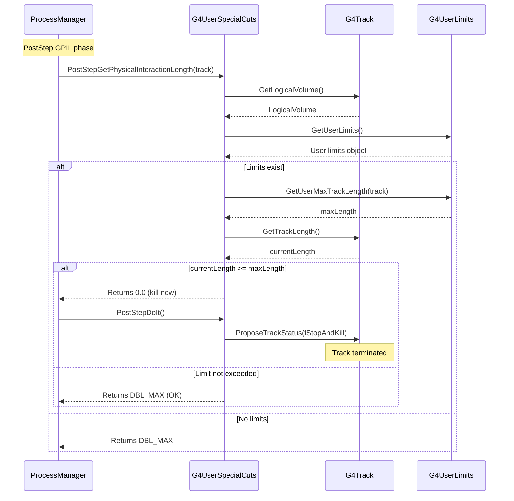

# G4UserSpecialCuts

## Overview

`G4UserSpecialCuts` is a utility process that enforces user-defined track termination criteria. It reads limits from `G4UserLimits` attached to logical volumes and kills tracks that exceed maximum track length, maximum time of flight, or fall below minimum kinetic energy. Unlike `G4StepLimiter` which only constrains step size, `G4UserSpecialCuts` terminates tracks completely.

**Class Type:** Utility Process
**Base Class:** `G4VProcess`
**Process Type:** `fGeneral`
**Process Mode:** PostStep discrete
**Headers:** `source/physics_lists/constructors/limiters/include/G4UserSpecialCuts.hh`

---

## Purpose

G4UserSpecialCuts provides:

- **Track Length Limits:** Kill tracks exceeding maximum path length
- **Time Limits:** Terminate particles after maximum time of flight
- **Energy Thresholds:** Stop tracking below minimum kinetic energy
- **Performance Optimization:** Eliminate unimportant low-energy particles
- **Physics Studies:** Control phase space of simulated particles

---

## Class Definition

```cpp
class G4UserSpecialCuts : public G4VProcess
{
public:
    G4UserSpecialCuts(const G4String& processName = "UserSpecialCut");
    virtual ~G4UserSpecialCuts();

    // PostStep interface (only active mode)
    virtual G4double PostStepGetPhysicalInteractionLength(
        const G4Track& track,
        G4double   previousStepSize,
        G4ForceCondition* condition);

    virtual G4VParticleChange* PostStepDoIt(
        const G4Track&,
        const G4Step&);

    // Inactive modes (return -1 or nullptr)
    virtual G4double AtRestGetPhysicalInteractionLength(
        const G4Track&, G4ForceCondition*)
        { return -1.0; }

    virtual G4VParticleChange* AtRestDoIt(
        const G4Track&, const G4Step&)
        { return nullptr; }

    virtual G4double AlongStepGetPhysicalInteractionLength(
        const G4Track&, G4double, G4double,
        G4double&, G4GPILSelection*)
        { return -1.0; }

    virtual G4VParticleChange* AlongStepDoIt(
        const G4Track&, const G4Step&)
        { return nullptr; }

private:
    G4LossTableManager* theLossTableManager;
};
```

**File Reference:** `source/physics_lists/constructors/limiters/include/G4UserSpecialCuts.hh` (lines 46-102)

---

## Key Methods

### PostStepGetPhysicalInteractionLength()
```cpp
virtual G4double PostStepGetPhysicalInteractionLength(
    const G4Track& track,
    G4double   previousStepSize,
    G4ForceCondition* condition);
```

**Purpose:** Determines if track should be killed based on user limits.

**Algorithm:**
1. Gets current logical volume from track
2. Retrieves `G4UserLimits` from volume
3. Checks three criteria:
   - **Track Length:** `GetUserMaxTrackLength()`
   - **Time of Flight:** `GetUserMaxTime()`
   - **Kinetic Energy:** `GetUserMinEkine()`
4. If any limit exceeded, returns 0 (kill immediately)
5. Otherwise returns `DBL_MAX` (no constraint)

**Checked Limits:**

**1. Maximum Track Length:**
```cpp
G4double maxTrackLength = userLimits->GetUserMaxTrackLength(track);
if(track.GetTrackLength() >= maxTrackLength)
    return 0.0;  // Kill track
```

**2. Maximum Time:**
```cpp
G4double maxTime = userLimits->GetUserMaxTime(track);
if(track.GetGlobalTime() >= maxTime)
    return 0.0;  // Kill track
```

**3. Minimum Kinetic Energy:**
```cpp
G4double minEkine = userLimits->GetUserMinEkine(track);
if(track.GetKineticEnergy() <= minEkine)
    return 0.0;  // Kill track
```

**Returns:**
- `0.0` if any limit violated (kill track immediately)
- `DBL_MAX` if all limits satisfied (no constraint)

**Force Condition:**
- Sets `*condition = NotForced`

**File:** `G4UserSpecialCuts.hh` (lines 54-58)

---

### PostStepDoIt()
```cpp
virtual G4VParticleChange* PostStepDoIt(
    const G4Track&,
    const G4Step&);
```

**Purpose:** Terminates the track.

**Implementation:**
```cpp
G4VParticleChange* PostStepDoIt(const G4Track& track, const G4Step& step)
{
    aParticleChange.Initialize(track);
    aParticleChange.ProposeTrackStatus(fStopAndKill);
    return &aParticleChange;
}
```

**Actions:**
- Sets track status to `fStopAndKill`
- No energy deposition (particle simply stops tracking)
- No secondaries created

**Returns:** `G4VParticleChange` with `fStopAndKill` status

**File:** `G4UserSpecialCuts.hh` (lines 60-63)

---

## How It Works

### Process Execution Flow



---

## Usage Examples

### Basic Setup

```cpp
// 1. In DetectorConstruction: Define limits
void MyDetectorConstruction::Construct()
{
    // Create logical volume
    G4LogicalVolume* detectorLV = new G4LogicalVolume(
        detectorSolid, detectorMaterial, "Detector");

    // Create user limits
    G4UserLimits* limits = new G4UserLimits();

    // Set track length limit
    limits->SetUserMaxTrackLength(1.0*m);     // Kill after 1 m

    // Set time limit
    limits->SetUserMaxTime(10*ns);            // Kill after 10 ns

    // Set minimum energy
    limits->SetUserMinEkine(10*keV);          // Kill below 10 keV

    // Attach to logical volume
    detectorLV->SetUserLimits(limits);

    return worldPV;
}

// 2. In PhysicsList: Register G4UserSpecialCuts
void MyPhysicsList::ConstructProcess()
{
    AddTransportation();

    // Add UserSpecialCuts to all particles
    auto particleIterator = GetParticleIterator();
    particleIterator->reset();
    while((*particleIterator)())
    {
        G4ParticleDefinition* particle = particleIterator->value();
        G4ProcessManager* pManager = particle->GetProcessManager();

        if(pManager) {
            pManager->AddDiscreteProcess(new G4UserSpecialCuts());
        }
    }
}
```

---

### Using Physics Constructor (Recommended)

```cpp
#include "G4StepLimiterPhysics.hh"

MyPhysicsList::MyPhysicsList()
{
    // ... register other physics constructors

    // This adds both G4StepLimiter AND G4UserSpecialCuts
    RegisterPhysics(new G4StepLimiterPhysics());
}
```

---

### Track Length Limit

```cpp
void MyDetectorConstruction::Construct()
{
    // Kill particles after traveling 50 cm
    // Useful for eliminating particles that escape region of interest

    G4UserLimits* trackLimits = new G4UserLimits();
    trackLimits->SetUserMaxTrackLength(50*cm);

    // Apply to world volume (affects all particles)
    worldLV->SetUserLimits(trackLimits);
}
```

**Use Cases:**
- Stop particles escaping detector
- Limit computational cost in shielding studies
- Focus on particles in region of interest

---

### Time of Flight Limit

```cpp
void MyDetectorConstruction::Construct()
{
    // Kill particles after 100 ns
    // Useful for time-window simulations

    G4UserLimits* timeLimits = new G4UserLimits();
    timeLimits->SetUserMaxTime(100*ns);

    worldLV->SetUserLimits(timeLimits);
}
```

**Use Cases:**
- Cosmic ray shielding (remove slow neutrons)
- Prompt radiation only (ignore delayed decays)
- Detector time window simulation
- Neutron time-of-flight detectors

---

### Minimum Energy Threshold

```cpp
void MyDetectorConstruction::Construct()
{
    // Kill particles below 100 keV
    // Saves CPU by not tracking low-energy particles

    G4UserLimits* energyLimits = new G4UserLimits();
    energyLimits->SetUserMinEkine(100*keV);

    worldLV->SetUserLimits(energyLimits);
}
```

**Use Cases:**
- Performance optimization
- Focus on high-energy phenomena
- Remove thermal neutrons in shielding
- Eliminate sub-threshold particles

**⚠️ Caution:** This is different from production cuts:
- Production cuts: prevent secondary creation
- Min energy cut: kill existing particles

---

### Combined Limits

```cpp
void MyDetectorConstruction::Construct()
{
    // Comprehensive limits for performance
    G4UserLimits* combinedLimits = new G4UserLimits();

    // Spatial limit
    combinedLimits->SetUserMaxTrackLength(2*m);

    // Time window
    combinedLimits->SetUserMaxTime(50*ns);

    // Energy threshold
    combinedLimits->SetUserMinEkine(10*keV);

    // Step size (for G4StepLimiter)
    combinedLimits->SetMaxAllowedStep(5*mm);

    worldLV->SetUserLimits(combinedLimits);
}
```

---

### Volume-Specific Limits

```cpp
void MyDetectorConstruction::Construct()
{
    // Different limits for different regions

    // Detector region: Track everything
    detectorLV->SetUserLimits(nullptr);  // No special cuts

    // Shielding region: Remove low-energy particles
    G4UserLimits* shieldLimits = new G4UserLimits();
    shieldLimits->SetUserMinEkine(1*MeV);  // Only high-energy
    shieldingLV->SetUserLimits(shieldLimits);

    // Far region: Kill particles that escape
    G4UserLimits* farLimits = new G4UserLimits();
    farLimits->SetUserMaxTrackLength(10*m);  // Distance limit
    outerVolumeLV->SetUserLimits(farLimits);
}
```

---

### Particle-Specific Limits

```cpp
// Custom user limits class
class ParticleSpecificLimits : public G4UserLimits
{
public:
    virtual G4double GetUserMinEkine(const G4Track& track) override
    {
        G4ParticleDefinition* particle = track.GetDefinition();

        // Different thresholds for different particles
        if(particle == G4Gamma::Definition()) {
            return 10*keV;  // Photons
        }
        else if(particle == G4Electron::Definition()) {
            return 1*keV;   // Electrons
        }
        else if(particle == G4Neutron::Definition()) {
            return 1*eV;    // Neutrons
        }
        else {
            return 100*keV; // Other particles
        }
    }

    virtual G4double GetUserMaxTime(const G4Track& track) override
    {
        G4ParticleDefinition* particle = track.GetDefinition();

        // Longer time for neutrons
        if(particle == G4Neutron::Definition()) {
            return 1*microsecond;
        } else {
            return 100*ns;
        }
    }
};

// In detector construction
worldLV->SetUserLimits(new ParticleSpecificLimits());
```

---

## Interaction with G4UserLimits

### Complete G4UserLimits Interface

```cpp
class G4UserLimits
{
public:
    // Step limiter (used by G4StepLimiter)
    void SetMaxAllowedStep(G4double ustepMax);
    virtual G4double GetMaxAllowedStep(const G4Track& track);

    // Track cuts (used by G4UserSpecialCuts)
    void SetUserMaxTrackLength(G4double utrakMax);
    virtual G4double GetUserMaxTrackLength(const G4Track& track);

    void SetUserMaxTime(G4double utimeMax);
    virtual G4double GetUserMaxTime(const G4Track& track);

    void SetUserMinEkine(G4double uekinMin);
    virtual G4double GetUserMinEkine(const G4Track& track);

    void SetUserMinRange(G4double urangMin);
    virtual G4double GetUserMinRange(const G4Track& track);
};
```

**G4UserSpecialCuts uses:**
- `GetUserMaxTrackLength()` - Maximum path length
- `GetUserMaxTime()` - Maximum time of flight
- `GetUserMinEkine()` - Minimum kinetic energy

**G4StepLimiter uses:**
- `GetMaxAllowedStep()` - Maximum step size

---

## Use Cases

### 1. Cosmic Ray Shielding

Remove slow particles after prompt phase:

```cpp
// Focus on prompt radiation (first microsecond)
G4UserLimits* promptLimits = new G4UserLimits();
promptLimits->SetUserMaxTime(1*microsecond);
worldLV->SetUserLimits(promptLimits);
```

---

### 2. Medical Dosimetry

Track particles only in patient region:

```cpp
// Kill particles escaping patient (50 cm from origin)
G4UserLimits* patientLimits = new G4UserLimits();
patientLimits->SetUserMaxTrackLength(50*cm);
worldLV->SetUserLimits(patientLimits);
```

---

### 3. Accelerator Studies

Focus on beam energy range:

```cpp
// Remove particles below beam threshold
G4UserLimits* beamLimits = new G4UserLimits();
beamLimits->SetUserMinEkine(10*MeV);  // Beam energy scale
targetLV->SetUserLimits(beamLimits);
```

---

### 4. Performance Optimization

Eliminate thermal neutrons in bulk shielding:

```cpp
// Don't track thermal neutrons in concrete shield
G4UserLimits* shieldLimits = new G4UserLimits();
shieldLimits->SetUserMinEkine(0.1*eV);  // Above thermal
concreteLV->SetUserLimits(shieldLimits);
```

---

### 5. Phase Space Studies

Control simulation time window:

```cpp
// Time-of-flight detector with 10 ns window
G4UserLimits* tofLimits = new G4UserLimits();
tofLimits->SetUserMaxTime(10*ns);
detectorLV->SetUserLimits(tofLimits);
```

---

## Monitoring and Debugging

### Track User Limits

```cpp
void MySteppingAction::UserSteppingAction(const G4Step* step)
{
    G4Track* track = step->GetTrack();

    // Check if track killed by UserSpecialCuts
    if(track->GetTrackStatus() == fStopAndKill)
    {
        const G4VProcess* killingProcess =
            step->GetPostStepPoint()->GetProcessDefinedStep();

        if(killingProcess &&
           killingProcess->GetProcessName() == "UserSpecialCut")
        {
            G4cout << "Track killed by UserSpecialCuts" << G4endl;
            G4cout << "  Track length: "
                   << track->GetTrackLength()/cm << " cm" << G4endl;
            G4cout << "  Time: "
                   << track->GetGlobalTime()/ns << " ns" << G4endl;
            G4cout << "  Energy: "
                   << track->GetKineticEnergy()/keV << " keV" << G4endl;
        }
    }
}
```

---

### Count Killed Tracks

```cpp
class MyEventAction : public G4UserEventAction
{
private:
    G4int nKilledByLength = 0;
    G4int nKilledByTime = 0;
    G4int nKilledByEnergy = 0;

public:
    void BeginOfEventAction(const G4Event*) override
    {
        nKilledByLength = 0;
        nKilledByTime = 0;
        nKilledByEnergy = 0;
    }

    void EndOfEventAction(const G4Event*) override
    {
        G4cout << "Tracks killed by limits:" << G4endl;
        G4cout << "  Length: " << nKilledByLength << G4endl;
        G4cout << "  Time: " << nKilledByTime << G4endl;
        G4cout << "  Energy: " << nKilledByEnergy << G4endl;
    }

    void IncrementKilledByLength() { nKilledByLength++; }
    void IncrementKilledByTime() { nKilledByTime++; }
    void IncrementKilledByEnergy() { nKilledByEnergy++; }
};

// In stepping action, determine which limit was violated
void MySteppingAction::UserSteppingAction(const G4Step* step)
{
    if(track->GetTrackStatus() == fStopAndKill &&
       limitingProcess == "UserSpecialCut")
    {
        G4UserLimits* limits = /* get limits */;
        G4double trackLength = track->GetTrackLength();
        G4double time = track->GetGlobalTime();
        G4double energy = track->GetKineticEnergy();

        if(trackLength >= limits->GetUserMaxTrackLength(track)) {
            eventAction->IncrementKilledByLength();
        }
        else if(time >= limits->GetUserMaxTime(track)) {
            eventAction->IncrementKilledByTime();
        }
        else if(energy <= limits->GetUserMinEkine(track)) {
            eventAction->IncrementKilledByEnergy();
        }
    }
}
```

---

## Performance Impact

### CPU Time Savings

Killing unimportant particles can dramatically reduce simulation time:

```cpp
// Example: Neutron shielding with thermal neutron cutoff

// Without limit: thermal neutrons take 1000s of steps
// CPU time: 100 seconds/event

G4UserLimits* limits = new G4UserLimits();
limits->SetUserMinEkine(0.1*eV);  // Kill thermal neutrons
concreteLV->SetUserLimits(limits);

// With limit: thermal neutrons killed immediately
// CPU time: 10 seconds/event
// 10x speedup!
```

---

### Memory Savings

Fewer tracks in memory:

```cpp
// Without time limit: slow neutrons accumulate
// Memory: 10 GB (100,000 tracks in memory)

G4UserLimits* limits = new G4UserLimits();
limits->SetUserMaxTime(100*ns);  // Remove slow tracks

// With time limit: tracks cleaned up promptly
// Memory: 1 GB (10,000 tracks in memory)
```

---

## Best Practices

### 1. Choose Appropriate Limits

```cpp
// ✅ Good: Limits match physics goals
// High-energy physics: focus on prompt particles
limits->SetUserMaxTime(10*ns);

// ❌ Bad: Arbitrary limits may miss important physics
limits->SetUserMinEkine(10*MeV);  // Why 10 MeV?
```

---

### 2. Validate Limits

Test sensitivity to cut values:

```cpp
// Run with different limits and compare results
// Limits: 1 keV, 10 keV, 100 keV
// Check: Does physics change significantly?

for(G4double minE = 1*keV; minE <= 100*keV; minE *= 10) {
    limits->SetUserMinEkine(minE);
    // Run simulation
    // Compare dose, flux, etc.
}
```

---

### 3. Document Limits

```cpp
// ✅ Good: Document why limits chosen
// Kill neutrons below 0.1 eV (thermal)
// Justification: Detector insensitive to thermal neutrons
limits->SetUserMinEkine(0.1*eV);

// ❌ Bad: Undocumented magic numbers
limits->SetUserMinEkine(0.1*eV);  // No explanation
```

---

### 4. Coordinate with Production Cuts

```cpp
// Production cuts and user limits should be consistent

// If production cut = 1 mm (range ~ 100 keV for electrons)
region->SetProductionCut(1*mm, "e-");

// User min energy should be similar or lower
limits->SetUserMinEkine(50*keV);  // ✅ Consistent

// Not:
limits->SetUserMinEkine(1*MeV);   // ❌ Inconsistent - wastes CPU
                                  // tracking particles that won't produce secondaries
```

---

## Common Issues

### Issue: Unexpected Track Termination

**Symptoms:** Tracks killed unexpectedly, missing physics

**Diagnosis:**
```cpp
// Check if UserSpecialCuts too aggressive
void MySteppingAction::UserSteppingAction(const G4Step* step)
{
    if(step->GetTrack()->GetTrackStatus() == fStopAndKill) {
        // Print track info
        // Check which limit triggered
    }
}
```

**Solution:** Relax limits or apply selectively

---

### Issue: No Performance Improvement

**Symptoms:** Adding limits doesn't speed up simulation

**Diagnosis:**
- Limits may not be reached by particles
- Limits applied to wrong volumes
- Wrong particle types targeted

**Solution:**
```cpp
// Monitor how many tracks actually killed
// If few tracks killed, limits not effective
eventAction->PrintKilledStatistics();
```

---

### Issue: Physics Results Change

**Symptoms:** Results differ with/without limits

**Analysis:**
- Expected: Limits remove particles from simulation
- Validate: Are removed particles important to physics?

**Solution:**
- Perform convergence study
- Document which particles removed and why

---

## Comparison Table

| Feature | G4StepLimiter | G4UserSpecialCuts | Production Cuts |
|---------|---------------|-------------------|-----------------|
| **Action** | Limit step size | Kill track | Prevent secondary creation |
| **Criteria** | Max step length | Track length, time, energy | Particle range |
| **Effect** | Smaller steps | Track termination | Fewer secondaries |
| **Performance** | Slower (more steps) | Faster (fewer tracks) | Faster (fewer particles) |
| **Physics** | No change | Removes particles | Modifies cascades |
| **Use Case** | Accuracy | Optimization | Production control |

---

## Related Classes

- [**G4UserLimits**](../../../geometry/volumes/api/g4userlimits.md) - Stores limit values
- [**G4StepLimiter**](./g4steplimiter.md) - Enforces step size limits
- [**G4VProcess**](../../management/api/g4vprocess.md) - Process base class
- [**G4Transportation**](./g4transportation.md) - Particle transport
- [**G4LossTableManager**](../../electromagnetic/utils/api/g4losstablemanager.md) - Energy loss tables

---

## References

### Source Files
- Header: `source/physics_lists/constructors/limiters/include/G4UserSpecialCuts.hh`
- Implementation: `source/physics_lists/constructors/limiters/src/G4UserSpecialCuts.cc`

### Related Documentation
- [Transportation Module Overview](../index.md)
- [G4UserLimits Documentation](../../../geometry/volumes/api/g4userlimits.md)
- Geant4 Application Developer's Guide, Chapter 5.1.3

---

::: tip See Also
- [G4StepLimiter](./g4steplimiter.md) for step size control
- [G4NeutronKiller](./g4neutronkiller.md) for neutron-specific killing
- [Production Cuts](../../cuts/) for secondary production control
:::

---

::: warning Important
G4UserSpecialCuts kills tracks without depositing energy. Use carefully:
- Track statistics will be affected
- Scoring must account for killed particles
- Energy conservation not maintained (by design)
:::

---

::: info Last Updated
**Date:** 2025-11-17
**Class Version:** Geant4 11.4.0.beta
**Header:** G4UserSpecialCuts.hh (lines 46-102)
:::
