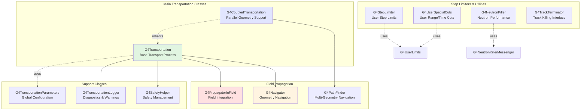
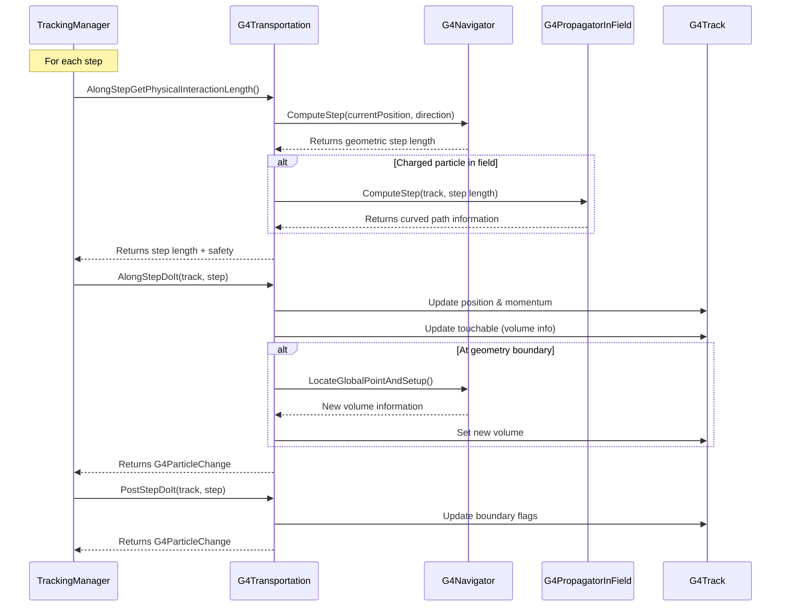

# Transportation Sub-Module

## Overview

The Transportation sub-module is a critical component of the Processes module, responsible for the geometrical propagation of particles through the detector geometry. Unlike physics processes that model interactions with matter, transportation handles the movement of particles through space, including navigation across geometry boundaries, propagation through electromagnetic fields, and updating safety values for optimization.

::: tip Module Location
**Source:** `source/processes/transportation/`
**Headers:** `source/processes/transportation/include/`
**Size:** 10 header files, 8 source files
:::

## Purpose

The Transportation sub-module provides:

- **Geometry Navigation**: Propagating particles through complex detector geometries
- **Boundary Crossing**: Detecting and handling transitions between physical volumes
- **Field Propagation**: Tracking charged particles through electromagnetic fields
- **Safety Calculation**: Computing distance to nearest boundary for optimization
- **Parallel Geometry Support**: Navigation in multiple geometries simultaneously
- **Step Limiting**: User-defined constraints on step size and track length
- **Performance Optimization**: Looper detection, track killing, and step size management

---

## Architecture

### Core Components



### Transportation Execution Flow



---

## Key Concepts

### Geometry Boundary Crossing

Transportation is responsible for detecting when particles cross from one physical volume to another:

**Boundary Detection:**
- The `G4Navigator` computes the distance to the nearest boundary
- Transportation compares this with physics process interaction lengths
- If geometry limits the step, a boundary crossing occurs

**Volume Update:**
- At boundaries, the `G4Navigator` locates the new volume
- The track's `G4TouchableHandle` is updated with new volume information
- Material properties are updated for the new volume
- Physics processes are notified of the material change

**Step Flags:**
- `fGeometryLimitedStep`: True when geometry determined step length
- `fFirstStepInVolume`: True for first step in a new volume
- `fLastStepInVolume`: True for last step before leaving volume

### Field Propagation

For charged particles in electromagnetic fields, transportation handles curved trajectories:

**Equation of Motion:**
The Lorentz force equation governs charged particle motion:
```
F = q(E + v × B)
```

**Field Integration:**
- `G4PropagatorInField` integrates the equation of motion
- Uses Runge-Kutta or other numerical methods
- Handles magnetic fields, electric fields, and gravity (optional)
- Computes chord distance for geometry safety

**Magnetic Moment:**
Particles with magnetic moments experience an additional force:
```
F = ∇(μ · B)
```
Enable with: `G4Transportation::EnableMagneticMoment(true)`

**Field Configuration:**
```cpp
// In detector construction
G4UniformMagField* magField = new G4UniformMagField(
    G4ThreeVector(0., 0., 3.0*tesla));
G4FieldManager* fieldMgr =
    G4TransportationManager::GetTransportationManager()
    ->GetFieldManager();
fieldMgr->SetDetectorField(magField);
fieldMgr->CreateChordFinder(magField);
```

### Safety Mechanism

The "safety" is an optimization that avoids expensive geometry calculations:

**Definition:**
- Safety = maximum distance particle can travel in any direction without hitting a boundary
- Computed as radius of largest sphere centered at current position that fits in current volume

**Usage:**
- For neutral particles (no field), if next step < safety, skip `Navigator::ComputeStep()`
- For charged particles, safety is used for chord distance tolerance
- Safety is updated at each boundary and periodically during long steps

**Safety Helper:**
The `G4SafetyHelper` class manages safety values:
- Caches safety origin and value
- Computes safety on demand
- Shares safety information between processes

### Looping Particles

Particles can "loop" in magnetic fields if they cannot make progress:

**Looper Detection:**
- Occurs when particle repeatedly takes very small steps
- Common for low-energy particles in strong fields
- Can cause severe performance issues

**Looper Thresholds:**
```cpp
// Lines 201-202 in G4Transportation.hh
G4double fThreshold_Warning_Energy = 1.0 * CLHEP::keV;
G4double fThreshold_Important_Energy = 1.0 * CLHEP::MeV;
```

- **Below Warning Energy**: Loopers killed silently
- **Between Warning and Important**: Loopers killed with warning
- **Above Important Energy**: Loopers survive for `fThresholdTrials` attempts

**Configuration:**
```cpp
// Set thresholds for low-energy applications
G4Transportation* transport = /* get transportation process */;
transport->SetLowLooperThresholds();  // E_warn=1 eV, E_imp=1 keV
transport->SetThresholdTrials(100);   // More attempts for important particles

// Or use global parameters
G4TransportationParameters* params =
    G4TransportationParameters::Instance();
params->SetLowLooperThresholds();
```

### Parallel Geometries

`G4CoupledTransportation` extends transportation for parallel geometries:

**Use Cases:**
- **Importance Biasing**: Different geometry for variance reduction
- **Scoring**: Separate geometry for detector readout
- **Fast Simulation**: Parameterized regions in parallel geometry

**Multi-Navigator:**
- Uses `G4PathFinder` instead of single `G4Navigator`
- Coordinates navigation across multiple geometries
- Reports first boundary in any geometry
- Maintains volume information for all geometries

**Step Flags:**
```cpp
// Lines 94-97 in G4CoupledTransportation.hh
G4bool IsFirstStepInAnyVolume() const;     // Any geometry
G4bool IsLastStepInAnyVolume() const;
G4bool IsFirstStepInMassVolume() const;    // Mass geometry only
G4bool IsLastStepInMassVolume() const;
```

---

## Key Classes

### Core Transportation

#### [G4Transportation](./api/g4transportation.md)
**The primary transportation process for all particles**

Handles particle propagation through geometry with field support. Registered as an `AlongStep` and `PostStep` process.

**Key Responsibilities:**
- Compute geometric step length via `G4Navigator`
- Propagate charged particles through fields via `G4PropagatorInField`
- Update particle position, momentum, and volume information
- Manage safety values for optimization
- Detect and handle looping particles

**Key Methods:**
- `AlongStepGetPhysicalInteractionLength()` - Compute step length (lines 66-72)
- `AlongStepDoIt()` - Perform the transport step (lines 74-77)
- `PostStepDoIt()` - Update volume information at boundaries (lines 79-82)
- `SetPropagatorInField()` - Configure field propagator (line 96)

**Usage:** Automatically registered for all particles in physics lists.

**File:** `source/processes/transportation/include/G4Transportation.hh`

---

#### [G4CoupledTransportation](./api/g4coupledtransportation.md)
**Transportation with parallel geometry support**

Extends `G4Transportation` to handle navigation in multiple geometries simultaneously, required for biasing, scoring, and fast simulation with parallel worlds.

**Key Features:**
- Uses `G4PathFinder` for multi-geometry navigation
- Maintains separate boundary flags for mass and parallel geometries
- Coordinates step lengths across all geometries
- Supports importance biasing and scoring

**Key Methods:**
- `AlongStepGetPhysicalInteractionLength()` - Multi-geometry step calculation (lines 64-70)
- `PostStepDoIt()` - Multi-geometry volume updates (lines 74-77)
- `SetSignifyStepsInAnyVolume()` - Control flag semantics (line 83)

**Usage:** Automatically used when parallel geometries are registered.

**File:** `source/processes/transportation/include/G4CoupledTransportation.hh`

---

### Step Limiters

#### [G4StepLimiter](./api/g4steplimiter.md)
**Enforces user-defined maximum step size**

A simple process that limits step size based on `G4UserLimits::GetMaxAllowedStep()` attached to logical volumes.

**Purpose:**
- Limit step size in sensitive regions
- Improve accuracy in high-gradient fields
- Control scoring granularity

**Key Method:**
- `PostStepGetPhysicalInteractionLength()` - Returns user max step (lines 52-56)

**Usage:**
```cpp
// Attach limit to logical volume
logicDetector->SetUserLimits(new G4UserLimits(1.0*mm));

// Register process in physics list
G4ProcessManager* pManager = particle->GetProcessManager();
pManager->AddDiscreteProcess(new G4StepLimiter());
```

**File:** `source/processes/transportation/include/G4StepLimiter.hh`

---

#### [G4UserSpecialCuts](./api/g4userspecialcuts.md)
**Enforces user-defined track cuts (range, time, energy)**

Terminates tracks that exceed user-defined limits for range, time of flight, or fall below kinetic energy threshold.

**Supported Cuts:**
- Maximum track length (range)
- Maximum time of flight
- Minimum kinetic energy

**Key Method:**
- `PostStepGetPhysicalInteractionLength()` - Checks user limits (lines 54-58)

**Usage:**
```cpp
// Create user limits
G4UserLimits* limits = new G4UserLimits();
limits->SetMaxAllowedStep(10*cm);      // Max step
limits->SetUserMaxTrackLength(1*m);    // Max track length
limits->SetUserMaxTime(1*microsecond); // Max time
limits->SetUserMinEkine(100*keV);      // Min kinetic energy

// Attach to logical volume
logicVolume->SetUserLimits(limits);

// Register process
pManager->AddDiscreteProcess(new G4UserSpecialCuts());
```

**File:** `source/physics_lists/constructors/limiters/include/G4UserSpecialCuts.hh`

---

#### [G4NeutronKiller](./api/g4neutronkiller.md)
**Performance optimization: removes unwanted neutrons**

Kills neutron tracks based on kinetic energy or time thresholds to improve simulation performance, particularly useful for shielding studies where low-energy neutrons are unimportant.

**Parameters:**
- **Energy Threshold**: Kill neutrons below this kinetic energy (line 97)
- **Time Threshold**: Kill neutrons older than this time (line 98)

**Key Methods:**
- `SetKinEnergyLimit()` - Set energy threshold (line 81)
- `SetTimeLimit()` - Set time threshold (line 79)
- `PostStepDoIt()` - Kill neutron if conditions met (line 87)

**Usage:**
```cpp
G4NeutronKiller* neutronKiller = new G4NeutronKiller();
neutronKiller->SetKinEnergyLimit(0.01*eV);  // Kill below 0.01 eV
neutronKiller->SetTimeLimit(10*microsecond); // Kill after 10 μs

G4ProcessManager* pManager = G4Neutron::Neutron()->GetProcessManager();
pManager->AddDiscreteProcess(neutronKiller);
```

**UI Commands:**
```
/physics_engine/neutron/energyCut 0.01 eV
/physics_engine/neutron/timeLimit 10 microsecond
```

**File:** `source/processes/transportation/include/G4NeutronKiller.hh`

---

### Support Classes

#### G4TransportationParameters
**Global configuration singleton for transportation parameters**

Manages global settings for all transportation processes, including looper thresholds and magnetic moment usage.

**Key Settings:**
- Looper warning energy threshold (line 119)
- Looper important energy threshold (line 120)
- Number of trials for important loopers (line 121)
- Magnetic moment force enable flag (line 124)
- Silence looper warnings flag (line 128)

**Key Methods:**
- `SetWarningEnergy()` / `SetImportantEnergy()` - Configure thresholds (lines 69-70)
- `SetNumberOfTrials()` - Set trial count (line 66)
- `EnableUseOfMagneticMoment()` - Enable/disable magnetic moment (line 82)
- `SetHighLooperThresholds()` / `SetLowLooperThresholds()` - Preset configurations (lines 85-87)

**Usage:**
```cpp
// Configure before transportation processes are created
G4TransportationParameters* params =
    G4TransportationParameters::Instance();
params->SetLowLooperThresholds();  // For low-energy physics
params->EnableUseOfMagneticMoment(true);
params->SetNumberOfTrials(50);
```

**File:** `source/processes/transportation/include/G4TransportationParameters.hh`

---

#### G4TransportationLogger
**Diagnostic logging and warnings for transportation issues**

Reports looping particles and other transportation problems with detailed diagnostic information.

**Key Responsibilities:**
- Log looping particle warnings
- Report threshold values
- Track statistics on killed/saved loopers

**Key Methods:**
- `ReportLoopingTrack()` - Issue warning about looper (lines 57-61)
- `ReportLooperThresholds()` - Print threshold configuration (line 64)
- `SetThresholds()` - Update threshold values (lines 68-69)

**File:** `source/processes/transportation/include/G4TransportationLogger.hh`

---

#### G4TrackTerminator
**Interface for deferred track termination**

Simple interface used by importance biasing and scoring to request track termination after their processing is complete.

**Purpose:**
- Allows importance biasing to kill tracks after scoring
- Maintains proper ordering in parallel geometry navigation
- Implements deferred kill pattern

**Key Methods:**
- `SetKillTrack()` - Mark track for termination (line 60)
- `GetKillTrack()` - Check if track should be killed (line 61)

**File:** `source/processes/transportation/include/G4TrackTerminator.hh`

---

## Usage Patterns

### Basic Transportation Setup

Transportation is typically configured automatically by the physics list, but understanding the setup is important:

```cpp
// Transportation is registered in G4PhysicsListHelper
// Usually done automatically in modular physics lists

void MyPhysicsList::ConstructProcess()
{
    // Add transportation (done automatically by base class)
    AddTransportation();

    // Then add physics processes...
}
```

### Configuring Field Propagation

For simulations with electromagnetic fields:

```cpp
void DetectorConstruction::ConstructSDandField()
{
    // Create uniform magnetic field
    G4ThreeVector fieldValue = G4ThreeVector(0., 0., 1.5*tesla);
    G4MagneticField* magField = new G4UniformMagField(fieldValue);

    // Get global field manager
    G4FieldManager* fieldMgr =
        G4TransportationManager::GetTransportationManager()
        ->GetFieldManager();

    // Assign field to field manager
    fieldMgr->SetDetectorField(magField);

    // Create chord finder with appropriate step size
    G4ChordFinder* chordFinder = new G4ChordFinder(magField);
    fieldMgr->SetChordFinder(chordFinder);

    // Optional: set integration parameters
    fieldMgr->GetChordFinder()->SetDeltaChord(0.01*mm);

    // Optional: set minimum step in field
    G4PropagatorInField* fieldPropagator =
        G4TransportationManager::GetTransportationManager()
        ->GetPropagatorInField();
    fieldPropagator->SetMinimumEpsilonStep(1e-7);
    fieldPropagator->SetMaximumEpsilonStep(1e-5);
}
```

### Local Field Configuration

For fields in specific volumes:

```cpp
void DetectorConstruction::ConstructSDandField()
{
    // Create local field
    G4UniformMagField* localField = new G4UniformMagField(
        G4ThreeVector(0., 2.*tesla, 0.));

    // Create local field manager
    G4FieldManager* localFieldMgr = new G4FieldManager(localField);
    localFieldMgr->SetDetectorField(localField);
    localFieldMgr->CreateChordFinder(localField);

    // Assign to specific logical volume
    magnetLogical->SetFieldManager(localFieldMgr, true);
    // true = apply to all daughter volumes
}
```

### Applying Step Limits

For controlling step size in sensitive regions:

```cpp
void DetectorConstruction::Construct()
{
    // Create detector logical volume
    G4LogicalVolume* detectorLV = new G4LogicalVolume(
        detectorSolid, detectorMaterial, "Detector");

    // Create user limits
    G4UserLimits* stepLimit = new G4UserLimits();
    stepLimit->SetMaxAllowedStep(0.5*mm);  // Maximum step size

    // Attach to logical volume
    detectorLV->SetUserLimits(stepLimit);

    // In physics list, register G4StepLimiter for all particles
}

void MyPhysicsList::ConstructProcess()
{
    AddTransportation();

    // Add step limiter to all particles
    auto particleIterator = GetParticleIterator();
    particleIterator->reset();
    while((*particleIterator)())
    {
        G4ParticleDefinition* particle = particleIterator->value();
        G4ProcessManager* pManager = particle->GetProcessManager();

        if(pManager) {
            pManager->AddDiscreteProcess(new G4StepLimiter());
        }
    }
}
```

### Applying Track Cuts

For terminating tracks that exceed limits:

```cpp
void DetectorConstruction::Construct()
{
    // Create comprehensive user limits
    G4UserLimits* trackLimits = new G4UserLimits();

    // Set various limits
    trackLimits->SetMaxAllowedStep(10*cm);       // Step size limit
    trackLimits->SetUserMaxTrackLength(5*m);     // Total track length
    trackLimits->SetUserMaxTime(10*ns);          // Time of flight
    trackLimits->SetUserMinEkine(10*keV);        // Minimum kinetic energy

    // Attach to logical volume
    worldLV->SetUserLimits(trackLimits);
}

void MyPhysicsList::ConstructProcess()
{
    AddTransportation();

    // Add G4UserSpecialCuts to enforce limits
    auto particleIterator = GetParticleIterator();
    particleIterator->reset();
    while((*particleIterator)())
    {
        G4ParticleDefinition* particle = particleIterator->value();
        G4ProcessManager* pManager = particle->GetProcessManager();

        if(pManager) {
            pManager->AddDiscreteProcess(new G4UserSpecialCuts());
        }
    }
}
```

### Using Physics List Constructor

The recommended approach uses the step limiter physics constructor:

```cpp
#include "G4StepLimiterPhysics.hh"

// In physics list constructor
RegisterPhysics(new G4StepLimiterPhysics());
// This automatically registers both G4StepLimiter and G4UserSpecialCuts
```

### Optimizing Neutron Performance

For simulations with many low-energy neutrons:

```cpp
void MyPhysicsList::ConstructProcess()
{
    AddTransportation();

    // Create neutron killer
    G4NeutronKiller* neutronKiller = new G4NeutronKiller();
    neutronKiller->SetKinEnergyLimit(1*eV);     // Kill below 1 eV
    neutronKiller->SetTimeLimit(100*microsecond); // Kill after 100 μs

    // Register only for neutrons
    G4ProcessManager* pManager =
        G4Neutron::Neutron()->GetProcessManager();
    pManager->AddDiscreteProcess(neutronKiller);
}
```

### Configuring Looper Behavior

For low-energy simulations or strong fields:

```cpp
void MyPhysicsList::ConstructProcess()
{
    // Configure BEFORE transportation processes are created
    G4TransportationParameters* transParams =
        G4TransportationParameters::Instance();

    // For low-energy applications
    transParams->SetLowLooperThresholds();
    // Warning: 1 eV, Important: 1 keV

    // Allow more attempts for important particles
    transParams->SetNumberOfTrials(100);

    // Enable magnetic moment interactions
    transParams->EnableUseOfMagneticMoment(true);

    // Now add transportation
    AddTransportation();

    // ... add other processes
}

// Alternative: Per-process configuration after creation
void PostInitialization()
{
    // Get transportation process for a specific particle
    G4ProcessManager* pManager =
        G4Electron::Definition()->GetProcessManager();
    G4VProcess* trans = pManager->GetProcess("Transportation");

    if(G4Transportation* transport =
        dynamic_cast<G4Transportation*>(trans))
    {
        transport->SetLowLooperThresholds();
        transport->SetThresholdTrials(100);
    }
}
```

### Accessing Transportation During Run

Get transportation statistics and control:

```cpp
void MyEventAction::EndOfEventAction(const G4Event* event)
{
    // Get transportation process
    G4ProcessManager* pManager =
        G4Electron::Definition()->GetProcessManager();
    G4VProcess* trans = pManager->GetProcess("Transportation");

    if(G4Transportation* transport =
        dynamic_cast<G4Transportation*>(trans))
    {
        // Get looper statistics
        G4double maxEnergyKilled = transport->GetMaxEnergyKilled();
        G4double sumEnergyKilled = transport->GetSumEnergyKilled();

        G4cout << "Transportation Statistics:" << G4endl;
        G4cout << "  Max energy killed: " << maxEnergyKilled/MeV
               << " MeV" << G4endl;
        G4cout << "  Total energy killed: " << sumEnergyKilled/MeV
               << " MeV" << G4endl;

        // Print detailed statistics
        transport->PrintStatistics(G4cout);

        // Reset for next event
        transport->ResetKilledStatistics(0);  // 0 = no report
    }
}
```

---

## Advanced Topics

### Transportation and Multi-Threading

Transportation processes have thread-local state:

**Master Thread:**
- Creates one transportation instance per particle type
- Initializes `G4Navigator` and field configuration
- Sets global parameters via `G4TransportationParameters`

**Worker Threads:**
- Clone transportation processes from master
- Have independent state (current position, safety, etc.)
- Share geometry and field configuration (read-only)

**Thread Safety:**
```cpp
// Safe: G4TransportationParameters is thread-safe singleton
G4TransportationParameters* params =
    G4TransportationParameters::Instance();
params->SetLowLooperThresholds();  // OK in master thread PreInit

// Not safe: Don't modify transportation during running
// All configuration must be done before /run/initialize
```

### Parallel Worlds

When using parallel geometries:

```cpp
// Parallel world is registered in detector construction
void DetectorConstruction::Construct()
{
    // ... construct mass geometry ...
    return worldPhysical;
}

void DetectorConstruction::ConstructParallelGeometry()
{
    // Create parallel geometry for scoring/biasing
    G4LogicalVolume* parallelWorld = /* ... */;

    // Transportation automatically switches to G4CoupledTransportation
}
```

**Accessing Parallel Volume Info:**
```cpp
void MySteppingAction::UserSteppingAction(const G4Step* step)
{
    // Get parallel world volume
    const G4TouchableHandle& touchable =
        step->GetPreStepPoint()->GetTouchable();

    // For parallel world index 1
    const G4VPhysicalVolume* parallelVol =
        touchable->GetVolume(1);  // 0 = mass world, 1+ = parallel worlds
}
```

### Custom Transportation

Rarely needed, but possible to extend:

```cpp
class MyTransportation : public G4Transportation
{
public:
    MyTransportation() : G4Transportation() {}

    virtual G4VParticleChange* AlongStepDoIt(
        const G4Track& track, const G4Step& step) override
    {
        // Call base class
        G4VParticleChange* change =
            G4Transportation::AlongStepDoIt(track, step);

        // Add custom behavior (e.g., custom field effects)
        // ...

        return change;
    }
};
```

---

## Performance Considerations

### Step Size and Safety

- **Safety Distance**: Transportation caches safety to avoid repeated boundary checks
- **Optimization**: For neutral particles without fields, steps smaller than safety skip navigation
- **Trade-off**: Larger steps = fewer boundary checks but less accurate field integration

### Field Integration Accuracy

Key parameters affecting performance vs. accuracy:

```cpp
G4FieldManager* fieldMgr = /* ... */;

// Delta chord: maximum distance between curved trajectory and chord
fieldMgr->GetChordFinder()->SetDeltaChord(0.01*mm);
// Smaller = more accurate but slower

// Epsilon step: relative error in integration
G4PropagatorInField* prop =
    G4TransportationManager::GetTransportationManager()
    ->GetPropagatorInField();
prop->SetMinimumEpsilonStep(1e-7);  // Minimum relative error
prop->SetMaximumEpsilonStep(1e-5);  // Maximum relative error
// Smaller epsilon = more accurate but more integration steps
```

### Looper Performance Impact

Looping particles can dramatically slow simulation:

- **Problem**: Particle takes many tiny steps without progress
- **Detection**: Transportation counts zero-progress steps
- **Solution**: Configure appropriate looper thresholds for your energy range

### Neutron Performance

For neutron-heavy simulations:

- **Problem**: Low-energy neutrons take many small steps
- **Solution**: Use `G4NeutronKiller` to remove unimportant neutrons
- **Trade-off**: Kill neutrons vs. track them for scoring

---

## Debugging and Diagnostics

### Verbosity Levels

```cpp
// Set transportation verbosity
G4Transportation* transport = /* get process */;
transport->SetVerboseLevel(2);
// 0 = silent
// 1 = warnings
// 2 = step-by-step info
// 3 = detailed diagnostics
```

### Common Issues

**Issue: "Track stuck or not moving"**
- Cause: Particle looping in field
- Solution: Adjust looper thresholds or field parameters
- Debug: Enable transportation verbosity

**Issue: "Accuracy loss of track in magnetic field"**
- Cause: Field integration step too large
- Solution: Decrease `DeltaChord` or epsilon parameters
- Debug: Check field strength and particle momentum

**Issue: "Particle appears in wrong volume"**
- Cause: Geometry navigation error
- Solution: Check geometry for overlaps, verify field setup
- Debug: Use `/geometry/test/run` to check geometry

**Issue: "Slow performance with many neutrons"**
- Cause: Low-energy neutrons taking many steps
- Solution: Use `G4NeutronKiller` with appropriate thresholds
- Debug: Check neutron energy spectrum and step count

---

## Related Modules

### Direct Dependencies

- [**Geometry Module**](../../geometry/) - Volume navigation and boundary detection
  - `G4Navigator` - Geometry navigation
  - `G4VPhysicalVolume` - Physical volume representation
  - `G4TouchableHandle` - Volume hierarchy information

- [**Geometry/Magneticfield**](../../geometry/magneticfield/) - Field propagation
  - `G4PropagatorInField` - Field equation integration
  - `G4FieldManager` - Field configuration
  - `G4MagneticField` / `G4ElectricField` - Field implementations
  - `G4ChordFinder` - Chord distance calculation

- [**Track Module**](../../track/) - Track and step data structures
  - `G4Track` - Particle state
  - `G4Step` - Step information
  - `G4StepPoint` - Pre/post step data

- [**Processes/Management**](../management/) - Process framework
  - `G4VProcess` - Process base class
  - `G4ProcessManager` - Process registration

### Related Sub-Modules

- [**Processes/Cuts**](../cuts/) - Production threshold management
- [**Processes/Biasing**](../biasing/) - Uses parallel geometries
- [**Processes/Scoring**](../scoring/) - Uses parallel geometries

---

## Best Practices

### Configuration

1. **Configure Before Initialization:**
   ```cpp
   // Set transportation parameters before /run/initialize
   G4TransportationParameters::Instance()->SetLowLooperThresholds();
   ```

2. **Choose Appropriate Looper Thresholds:**
   - HEP experiments: Use default or high thresholds
   - Medical physics: Use low thresholds
   - Custom: Set based on minimum interesting energy

3. **Field Integration Accuracy:**
   - Start with default parameters
   - If trajectories look wrong, decrease `DeltaChord`
   - Balance accuracy vs. performance based on requirements

### Step Limiting

1. **Use Step Limiters Judiciously:**
   - Only apply in regions where needed
   - Don't over-constrain (severe performance impact)
   - Prefer physics-based cuts when possible

2. **Combine Multiple Limits:**
   ```cpp
   G4UserLimits* limits = new G4UserLimits();
   limits->SetMaxAllowedStep(1*mm);      // Spatial accuracy
   limits->SetUserMaxTime(10*ns);        // Time window
   limits->SetUserMinEkine(100*keV);     // Energy threshold
   ```

### Performance Optimization

1. **Neutron Killing:**
   - Essential for shielding studies
   - Set thresholds based on application
   - Monitor killed neutron statistics

2. **Safety Optimization:**
   - Ensure geometry has no overlaps (validates safety)
   - Use simple shapes where possible (faster safety calculation)

3. **Field Optimization:**
   - Use uniform fields when possible (faster than custom fields)
   - Cache field values if using lookup tables
   - Consider field gradients when setting integration parameters

---

## References

### Key Papers

1. **Transportation and Navigation:**
   - GEANT4 Collaboration, "Geometry and Tracking in GEANT4," 2003

2. **Field Propagation:**
   - J. Apostolakis, "Integration of Charged Particle Tracks in Fields," IEEE TNS, 2005

### Geant4 Documentation

- Application Developer's Guide: Chapter 2.6 (Transportation)
- Physics Reference Manual: Chapter 2.3 (Particle Transportation)

---

## API Documentation

- [G4Transportation](./api/g4transportation.md) - Main transportation process
- [G4CoupledTransportation](./api/g4coupledtransportation.md) - Parallel geometry support
- [G4StepLimiter](./api/g4steplimiter.md) - Step size limiting
- [G4UserSpecialCuts](./api/g4userspecialcuts.md) - Track cuts
- [G4NeutronKiller](./api/g4neutronkiller.md) - Neutron performance optimization

---

::: tip Next Steps
- Review [G4Transportation API](./api/g4transportation.md) for detailed method documentation
- Explore [Geometry Module](../../geometry/) for navigation details
- See [Magnetic Field Module](../../geometry/magneticfield/) for field configuration
- Study [Track Module](../../track/) for understanding track data structures
:::

---

::: info Last Updated
**Date:** 2025-11-17
**Module Version:** Geant4 11.4.0.beta
**Status:** Comprehensive documentation complete
:::
