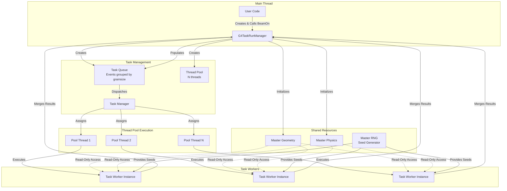
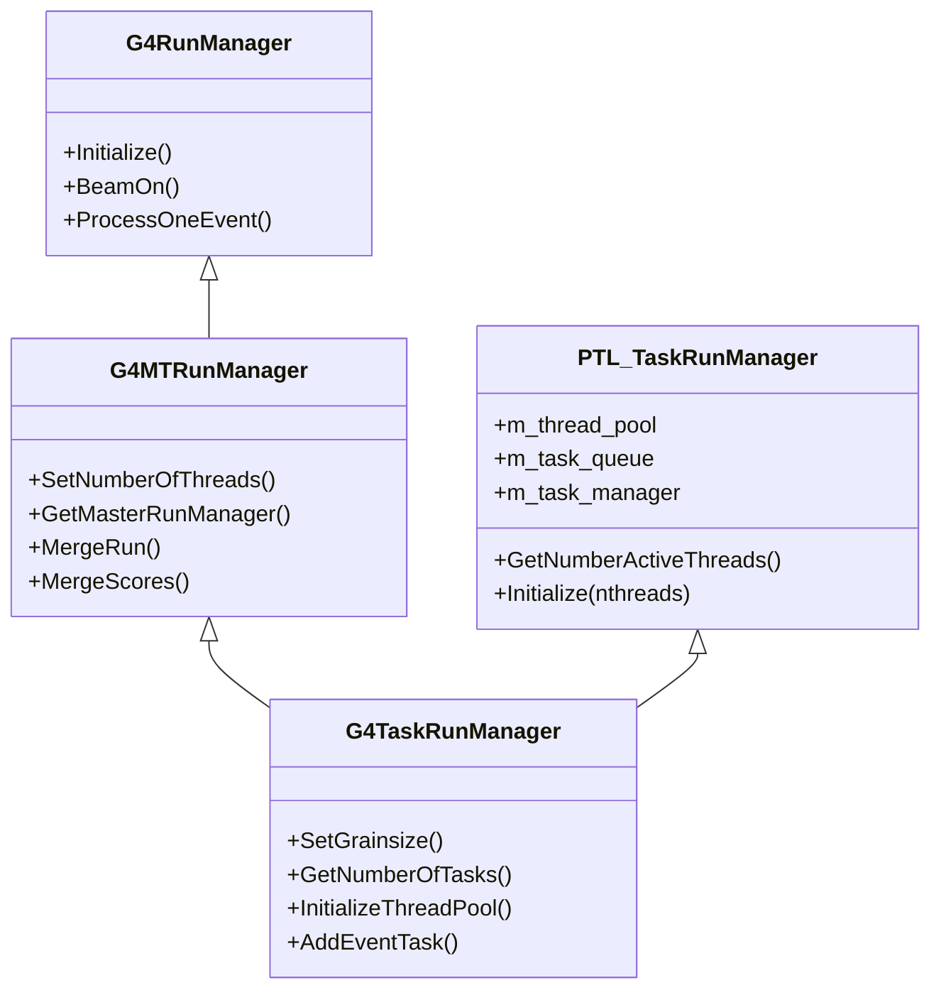

# G4TaskRunManager

**File**: `source/run/include/G4TaskRunManager.hh`

## Overview

G4TaskRunManager is the master run manager for task-based parallel Geant4 simulations. It extends G4MTRunManager by integrating with PTL (Parallel Tasking Library) or Intel TBB (Threading Building Blocks) to provide dynamic task scheduling instead of static thread-based event distribution. This enables superior load balancing through work-stealing algorithms, making it ideal for simulations with variable event processing times. Users instantiate this class instead of G4MTRunManager when task-based parallelism is desired.

## Class Description

G4TaskRunManager orchestrates task-based parallel simulations through:

- **Task Queue Management**: Events distributed as tasks to a shared queue
- **Thread Pool Backend**: Uses TBB or PTL for efficient thread management
- **Dynamic Scheduling**: Tasks assigned dynamically to available threads (work-stealing)
- **Grainsize Control**: User-configurable events per task for tuning performance
- **Automatic Load Balancing**: Short and long events balanced automatically
- **Master-Task Architecture**: Master coordinates; tasks execute on thread pool
- **Result Aggregation**: Merges results from all task workers
- **Dual Inheritance**: Extends both G4MTRunManager and PTL::TaskRunManager

### Key Architectural Differences from G4MTRunManager

| Aspect | G4MTRunManager (Thread-Based) | G4TaskRunManager (Task-Based) |
|--------|------------------------------|-------------------------------|
| Parallelism Model | One thread per worker | Thread pool + task queue |
| Event Distribution | Static assignment to threads | Dynamic scheduling from queue |
| Load Balancing | Limited (pre-distributed) | Automatic (work-stealing) |
| Thread Creation | N worker threads created upfront | Thread pool created once |
| Worker Lifetime | Exists for entire run | Task workers created per task |
| Best For | Uniform event times | Variable event times |
| Backend | Native threading | TBB or PTL |
| Overhead | Lower | Slightly higher (task management) |

## Important Notes

- **User-Facing Class**: Users instantiate this instead of G4MTRunManager for task-based parallelism
- **TBB/PTL Required**: Needs Intel TBB or PTL library support
- **Grainsize Tuning**: Performance depends on choosing appropriate events per task
- **Same User Code**: User actions and Run::Merge() identical to thread-based
- **Better Load Balancing**: Optimal for simulations with variable event complexity
- **Thread Pool**: Underlying threads managed automatically by TBB/PTL
- **SetNumberOfThreads()**: Sets thread pool size, not individual worker threads

## Architecture Diagram



## Inheritance Hierarchy



## Type Aliases and Enumerations

### InitializeSeedsCallback

```cpp
using InitializeSeedsCallback = std::function<G4bool(G4int, G4int&, G4int&)>;
```

**Location**: G4TaskRunManager.hh:70

**Purpose**: Callback function type for custom seed initialization.

**Signature**:
- `G4int`: Event number
- `G4int&`: Seed value 1 (output)
- `G4int&`: Seed value 2 (output)
- Returns: `G4bool` - true if seeds set successfully

### RunTaskGroup

```cpp
using RunTaskGroup = G4TaskGroup<void>;
```

**Location**: G4TaskRunManager.hh:71

**Purpose**: Task group type for managing run-level tasks.

## Static Accessor Methods

### GetMasterRunManager

```cpp
static G4TaskRunManager* GetMasterRunManager()
{
    auto* _rm = G4MTRunManager::GetMasterRunManager();
    return dynamic_cast<G4TaskRunManager*>(_rm);
}
```

Returns the singleton task run manager instance.

**Returns**: Pointer to G4TaskRunManager master instance

**Location**: G4TaskRunManager.hh:76-80

**Thread Context**: Any thread (master or worker)

**Details**:
- Accesses the master run manager
- Safe to call from any thread
- Returns nullptr if not G4TaskRunManager

**Usage Notes**:
```cpp
// Access master from any context
G4TaskRunManager* taskRM = G4TaskRunManager::GetMasterRunManager();
if (taskRM) {
    G4int nTasks = taskRM->GetNumberOfTasks();
    G4cout << "Total tasks: " << nTasks << G4endl;
}
```

### GetMTMasterRunManagerKernel

```cpp
static G4TaskRunManagerKernel* GetMTMasterRunManagerKernel();
```

Returns the task run manager kernel.

**Returns**: Pointer to G4TaskRunManagerKernel

**Location**: G4TaskRunManager.hh:84

**Details**:
- Task-specific kernel implementation
- Manages task-based geometry and physics initialization

### GetMasterThreadId

```cpp
static G4ThreadId GetMasterThreadId();
```

Returns the thread ID of the master thread.

**Returns**: G4ThreadId of master thread

**Location**: G4TaskRunManager.hh:106

**Details**:
- Used to identify master thread from worker context
- Thread-safe static method

## Constructors & Destructor

### Constructor (TBB Flag)

```cpp
G4TaskRunManager(G4bool useTBB = G4GetEnv<G4bool>("G4USE_TBB", false));
```

Constructs task run manager with TBB option.

**Parameters**:
- `useTBB`: If true, use Intel TBB backend; if false, use PTL (default from environment variable)

**Location**: G4TaskRunManager.hh:90

**Details**:
- Initializes both G4MTRunManager and PTL::TaskRunManager
- Sets up thread pool infrastructure
- Default TBB usage from G4USE_TBB environment variable
- Creates task management structures

**Usage Notes**:
```cpp
// Use TBB backend
G4TaskRunManager* runManager = new G4TaskRunManager(true);

// Use PTL backend (default)
G4TaskRunManager* runManager = new G4TaskRunManager(false);

// Use environment variable setting
G4TaskRunManager* runManager = new G4TaskRunManager();
```

### Constructor (Custom Task Queue)

```cpp
G4TaskRunManager(G4VUserTaskQueue* taskQueue,
                 G4bool useTBB = G4GetEnv<G4bool>("G4USE_TBB", false),
                 G4int evtGrainsize = 0);
```

Constructs task run manager with custom task queue.

**Parameters**:
- `taskQueue`: Custom user-provided task queue implementation
- `useTBB`: Use TBB backend (default from environment)
- `evtGrainsize`: Events per task (0 = automatic)

**Location**: G4TaskRunManager.hh:91-92

**Details**:
- Allows advanced users to provide custom task scheduling
- Custom queue must derive from G4VUserTaskQueue
- Grainsize can be set at construction or later via SetGrainsize()

**Advanced Usage**:
```cpp
// Custom task queue for specialized scheduling
class MyTaskQueue : public G4VUserTaskQueue {
  public:
    // Custom scheduling logic
};

MyTaskQueue* queue = new MyTaskQueue();
G4TaskRunManager* runManager = new G4TaskRunManager(queue, false, 100);
```

### Destructor

```cpp
~G4TaskRunManager() override;
```

Destroys the task run manager.

**Location**: G4TaskRunManager.hh:93

**Details**:
- Terminates thread pool
- Cleans up task queue
- Deletes task workers
- Releases all managed resources

## Thread Pool Configuration

### SetNumberOfThreads

```cpp
void SetNumberOfThreads(G4int n) override;
```

Sets the thread pool size.

**Parameters**:
- `n`: Number of threads in the pool

**Location**: G4TaskRunManager.hh:100

**Overrides**: G4MTRunManager::SetNumberOfThreads()

**Precondition**: Must be called BEFORE Initialize()

**Details**:
- Configures thread pool size (NOT number of worker threads)
- Threads shared across all tasks
- Optimal typically equals CPU core count
- Cannot be changed after initialization

**Usage Notes**:
```cpp
G4TaskRunManager* runManager = new G4TaskRunManager();

// Set thread pool size (must be before Initialize)
runManager->SetNumberOfThreads(8);

// After Initialize(), this has no effect
runManager->Initialize();
```

### GetNumberOfThreads

```cpp
G4int GetNumberOfThreads() const override;
```

Returns the thread pool size.

**Returns**: Number of threads in pool

**Location**: G4TaskRunManager.hh:101

**Overrides**: G4MTRunManager::GetNumberOfThreads()

### GetNumberActiveThreads

```cpp
size_t GetNumberActiveThreads() const override
{
    return PTL::TaskRunManager::GetNumberActiveThreads();
}
```

Returns the number of currently active threads.

**Returns**: Number of active threads in pool

**Location**: G4TaskRunManager.hh:102-105

**Details**:
- May be less than total thread pool size if tasks sparse
- Reflects actual thread utilization
- Useful for monitoring efficiency

## Task Configuration

### SetGrainsize

```cpp
void SetGrainsize(G4int n) { eventGrainsize = n; }
```

Sets the number of events processed per task.

**Parameters**:
- `n`: Events per task (grainsize)

**Location**: G4TaskRunManager.hh:95

**Details**:
- Controls task granularity
- Larger grainsize = fewer tasks, less overhead, worse load balance
- Smaller grainsize = more tasks, more overhead, better load balance
- Optimal depends on event processing time variability

**Grainsize Guidelines**:
- **Uniform events**: Use larger grainsize (100-1000)
- **Variable events**: Use smaller grainsize (10-100)
- **Very fast events**: Use larger grainsize to reduce overhead
- **Very slow events**: Use smaller grainsize for better load balancing

**Usage Notes**:
```cpp
G4TaskRunManager* runManager = new G4TaskRunManager();

// Fine-grained for variable event times
runManager->SetGrainsize(50);

// Coarse-grained for uniform events
runManager->SetGrainsize(500);

// After BeamOn(), grainsize affects task count:
// BeamOn(10000) with grainsize=100 → 100 tasks
// BeamOn(10000) with grainsize=500 → 20 tasks
```

### GetGrainsize

```cpp
G4int GetGrainsize() const { return eventGrainsize; }
```

Returns the configured grainsize.

**Returns**: Events per task

**Location**: G4TaskRunManager.hh:96

### GetNumberOfTasks

```cpp
inline G4int GetNumberOfTasks() const { return numberOfTasks; }
```

Returns the number of tasks created for the current run.

**Returns**: Total number of tasks

**Location**: G4TaskRunManager.hh:97

**Details**:
- Calculated as: numberOfEvents / grainsize (rounded up)
- Available after InitializeEventLoop() called
- Reflects actual task count for current BeamOn()

**Usage Notes**:
```cpp
runManager->SetGrainsize(100);
runManager->BeamOn(1000);

// After BeamOn starts:
G4int tasks = runManager->GetNumberOfTasks();  // Returns 10
```

### GetNumberOfEventsPerTask

```cpp
inline G4int GetNumberOfEventsPerTask() const { return numberOfEventsPerTask; }
```

Returns the average events per task.

**Returns**: Events per task (may differ from grainsize for last task)

**Location**: G4TaskRunManager.hh:98

**Details**:
- Usually equals grainsize
- Last task may have fewer events
- Average across all tasks

## Initialization Methods

### Initialize (Geant4 Initialization)

```cpp
void Initialize() override;
```

Initializes geometry, physics, and thread pool.

**Location**: G4TaskRunManager.hh:109

**Overrides**: G4MTRunManager::Initialize()

**Details**:
- Initializes master geometry and physics
- Creates thread pool
- Prepares task management infrastructure
- Must be called before BeamOn()

**Sequence**:
1. Initialize geometry in master
2. Initialize physics in master
3. Create thread pool via InitializeThreadPool()
4. Prepare task queue and manager
5. Ready for event processing

### InitializeEventLoop

```cpp
void InitializeEventLoop(G4int n_event, const char* macroFile = nullptr,
                         G4int n_select = -1) override;
```

Initializes event loop for task-based processing.

**Parameters**:
- `n_event`: Total number of events to process
- `macroFile`: Optional macro file for event commands
- `n_select`: Selective macro execution parameter

**Location**: G4TaskRunManager.hh:110-111

**Overrides**: G4MTRunManager::InitializeEventLoop()

**Details**:
- Computes number of tasks based on grainsize
- Prepares task queue with event batches
- Sets up RNG seed distribution
- Called internally by BeamOn()

### InitializeThreadPool

```cpp
void InitializeThreadPool() override;
```

Initializes the thread pool.

**Location**: G4TaskRunManager.hh:112

**Overrides**: G4MTRunManager::InitializeThreadPool()

**Details**:
- Creates PTL or TBB thread pool
- Starts worker threads
- Prepares task scheduling infrastructure
- Called from Initialize()

**Thread Pool Features**:
- Threads created once, reused for all runs
- Work-stealing scheduler for load balancing
- Thread-safe task queue access
- Automatic thread lifecycle management

### ThreadPoolIsInitialized

```cpp
G4bool ThreadPoolIsInitialized() const { return poolInitialized; }
```

Checks if thread pool is initialized.

**Returns**: true if pool ready

**Location**: G4TaskRunManager.hh:113

### Initialize (PTL Initialization)

```cpp
void Initialize(uint64_t nthreads) override { PTL::TaskRunManager::Initialize(nthreads); }
```

PTL-specific thread pool initialization.

**Parameters**:
- `nthreads`: Number of threads for PTL pool

**Location**: G4TaskRunManager.hh:115

**Details**:
- Delegates to PTL::TaskRunManager
- Used internally for PTL backend

## Event Processing Methods

### TerminateOneEvent

```cpp
void TerminateOneEvent() override;
```

Terminates a single event (no-op for task-based).

**Location**: G4TaskRunManager.hh:117

**Overrides**: G4MTRunManager::TerminateOneEvent()

**Details**:
- Task workers handle event termination
- Master does not process events directly

### ProcessOneEvent

```cpp
void ProcessOneEvent(G4int i_event) override;
```

Processes one event (no-op for task-based master).

**Parameters**:
- `i_event`: Event ID

**Location**: G4TaskRunManager.hh:118

**Overrides**: G4MTRunManager::ProcessOneEvent()

**Details**:
- Task workers process events, not master
- Master only coordinates task dispatch

### ConstructScoringWorlds

```cpp
void ConstructScoringWorlds() override;
```

Constructs scoring worlds (handled by workers).

**Location**: G4TaskRunManager.hh:119

**Overrides**: G4MTRunManager::ConstructScoringWorlds()

### RunTermination

```cpp
void RunTermination() override;
```

Terminates the run after all tasks complete.

**Location**: G4TaskRunManager.hh:120

**Overrides**: G4MTRunManager::RunTermination()

**Details**:
- Waits for all tasks to complete
- Merges all worker results
- Calls master's EndOfRunAction()
- Cleans up run resources

## Task Worker Communication

### SetUpAnEvent

```cpp
G4bool SetUpAnEvent(G4Event*, G4long& s1, G4long& s2, G4long& s3,
                    G4bool reseedRequired = true) override;
```

Sets up an event for task worker processing.

**Parameters**:
- `G4Event*`: Event object to configure
- `s1, s2, s3`: RNG seed values (output)
- `reseedRequired`: Whether to reseed RNG

**Returns**: true if event setup successful, false if no more events

**Location**: G4TaskRunManager.hh:129-130

**Overrides**: G4MTRunManager::SetUpAnEvent()

**Thread Context**: Called by task workers

**Details**:
- Task workers call this to get next event to process
- Master provides RNG seeds
- Returns false when all events assigned
- Thread-safe (protected by internal mutex)

### SetUpNEvents

```cpp
G4int SetUpNEvents(G4Event*, G4SeedsQueue* seedsQueue,
                   G4bool reseedRequired = true) override;
```

Sets up a batch of events (grainsize events per batch).

**Parameters**:
- `G4Event*`: First event in batch
- `seedsQueue`: Queue of seeds for all events in batch
- `reseedRequired`: Whether reseeding required

**Returns**: Number of events in this batch (0 if none remain)

**Location**: G4TaskRunManager.hh:138

**Overrides**: G4MTRunManager::SetUpNEvents()

**Thread Context**: Called by task workers

**Details**:
- Batch size determined by eventModulo or grainsize
- More efficient than per-event seeding
- All events in batch share base seed

## Result Merging

### MergeScores

```cpp
void MergeScores(const G4ScoringManager* localScoringManager) override;
```

Merges scoring results from a task worker.

**Parameters**:
- `localScoringManager`: Worker's scoring manager with accumulated scores

**Location**: G4TaskRunManager.hh:141

**Overrides**: G4MTRunManager::MergeScores()

**Thread Context**: Master thread (called by workers)

**Details**:
- Thread-safe merging (protected by mutex)
- Accumulates scores from all task workers
- Called automatically during worker termination

### MergeRun

```cpp
void MergeRun(const G4Run* localRun) override;
```

Merges run results from a task worker.

**Parameters**:
- `localRun`: Worker's G4Run object with accumulated results

**Location**: G4TaskRunManager.hh:142

**Overrides**: G4MTRunManager::MergeRun()

**Thread Context**: Master thread (called by workers)

**Details**:
- Calls master G4Run::Merge() method
- User's custom G4Run must implement Merge()
- Thread-safe (protected by mutex)
- Critical for collecting all results

**User Requirement**:
```cpp
class MyRun : public G4Run {
  public:
    void Merge(const G4Run* aRun) override {
        const MyRun* localRun = static_cast<const MyRun*>(aRun);
        // Merge local results into this master run
        myData += localRun->myData;
        G4Run::Merge(aRun);
    }
};
```

## UI Command Management

### RequestWorkersProcessCommandsStack

```cpp
void RequestWorkersProcessCommandsStack() override;
```

Requests all workers to process UI commands.

**Location**: G4TaskRunManager.hh:146

**Overrides**: G4MTRunManager::RequestWorkersProcessCommandsStack()

**Details**:
- Broadcasts UI commands to all task workers
- Blocks until all workers acknowledge
- Ensures command execution across all workers

### ThisWorkerProcessCommandsStackDone

```cpp
void ThisWorkerProcessCommandsStackDone() override;
```

Called by worker to signal command processing complete.

**Location**: G4TaskRunManager.hh:156

**Overrides**: G4MTRunManager::ThisWorkerProcessCommandsStackDone()

**Thread Context**: Task worker

**Details**:
- Synchronization point for UI command execution
- Worker signals completion to master

## Worker Synchronization (No-ops for Task-Based)

### WaitForReadyWorkers

```cpp
void WaitForReadyWorkers() override {}
```

Wait for workers ready (no-op for task-based).

**Location**: G4TaskRunManager.hh:158

**Details**: Task workers don't need explicit ready synchronization.

### WaitForEndEventLoopWorkers

```cpp
void WaitForEndEventLoopWorkers() override;
```

Wait for event loop completion from all workers.

**Location**: G4TaskRunManager.hh:159

**Details**: Waits for all tasks in task queue to complete.

### ThisWorkerReady

```cpp
void ThisWorkerReady() override {}
```

Worker ready signal (no-op for task-based).

**Location**: G4TaskRunManager.hh:160

### ThisWorkerEndEventLoop

```cpp
void ThisWorkerEndEventLoop() override {}
```

Worker event loop end (no-op for task-based).

**Location**: G4TaskRunManager.hh:161

### ThisWorkerWaitForNextAction

```cpp
WorkerActionRequest ThisWorkerWaitForNextAction() override
{
    return WorkerActionRequest::UNDEFINED;
}
```

Worker waits for next action (no-op for task-based).

**Location**: G4TaskRunManager.hh:163-166

**Details**: Task workers use task queue instead of action requests.

## Advanced Configuration

### SetInitializeSeedsCallback

```cpp
inline void SetInitializeSeedsCallback(InitializeSeedsCallback f)
{
    initSeedsCallback = f;
}
```

Sets custom callback for seed initialization.

**Parameters**:
- `f`: Callback function for generating seeds

**Location**: G4TaskRunManager.hh:168

**Callback Signature**:
```cpp
bool callback(G4int eventID, G4int& seed1, G4int& seed2)
```

**Usage Notes**:
```cpp
// Custom seed generation
runManager->SetInitializeSeedsCallback(
    [](G4int evtID, G4int& s1, G4int& s2) -> G4bool {
        s1 = evtID * 2;
        s2 = evtID * 2 + 1;
        return true;  // Seeds set successfully
    }
);
```

## Run Control

### AbortRun

```cpp
void AbortRun(G4bool softAbort = false) override;
```

Aborts the current run.

**Parameters**:
- `softAbort`: If true, finish current tasks before aborting

**Location**: G4TaskRunManager.hh:170

**Overrides**: G4MTRunManager::AbortRun()

**Details**:
- Signals all tasks to abort
- If softAbort=false: immediate termination
- If softAbort=true: complete current tasks, then stop

### AbortEvent

```cpp
void AbortEvent() override;
```

Aborts current event processing.

**Location**: G4TaskRunManager.hh:171

**Overrides**: G4MTRunManager::AbortEvent()

**Details**:
- Aborts event in all active tasks
- May not abort specific single event (affects all workers)

## Protected Methods

### ComputeNumberOfTasks

```cpp
virtual void ComputeNumberOfTasks();
```

Computes number of tasks based on events and grainsize.

**Location**: G4TaskRunManager.hh:174

**Access**: Protected

**Details**:
- Called during InitializeEventLoop()
- Formula: numberOfTasks = ceil(numberOfEvents / grainsize)
- Sets numberOfTasks and numberOfEventsPerTask members

### InitializeSeeds

```cpp
G4bool InitializeSeeds(G4int /*nevts*/) override { return false; }
```

Hook for custom seed initialization.

**Parameters**:
- `nevts`: Number of events

**Returns**: true if seeds initialized, false for default

**Location**: G4TaskRunManager.hh:179

**Access**: Protected

**Details**:
- Override to provide custom seed generation
- Default returns false (use automatic seeding)

### RefillSeeds

```cpp
void RefillSeeds() override;
```

Refills seed queue when depleted.

**Location**: G4TaskRunManager.hh:182

**Access**: Protected

**Overrides**: G4MTRunManager::RefillSeeds()

### StoreRNGStatus

```cpp
void StoreRNGStatus(const G4String& filenamePrefix) override;
```

Stores RNG status to file.

**Parameters**:
- `filenamePrefix`: Prefix for status filename

**Location**: G4TaskRunManager.hh:183

**Access**: Protected

**Overrides**: G4MTRunManager::StoreRNGStatus()

### CreateAndStartWorkers

```cpp
void CreateAndStartWorkers() override;
```

Creates and starts task workers.

**Location**: G4TaskRunManager.hh:186

**Access**: Protected

**Overrides**: G4MTRunManager::CreateAndStartWorkers()

**Details**:
- Creates thread pool
- Initializes task queue
- Prepares task workers (on-demand creation)

### TerminateWorkers

```cpp
void TerminateWorkers() override;
```

Terminates all workers and thread pool.

**Location**: G4TaskRunManager.hh:188

**Access**: Protected

**Overrides**: G4MTRunManager::TerminateWorkers()

### NewActionRequest

```cpp
void NewActionRequest(WorkerActionRequest) override {}
```

Sets new action request (no-op for task-based).

**Location**: G4TaskRunManager.hh:189

**Access**: Protected

### AddEventTask

```cpp
virtual void AddEventTask(G4int);
```

Adds an event processing task to the queue.

**Parameters**:
- `G4int`: Event ID

**Location**: G4TaskRunManager.hh:190

**Access**: Protected

**Details**:
- Enqueues event for processing
- Task will be picked up by available thread
- Work-stealing ensures load balancing

## Protected Member Variables

### Task Management

```cpp
protected:
    RunTaskGroup* workTaskGroup = nullptr;  // Task group for run-level tasks
```

**Location**: G4TaskRunManager.hh:194

### PTL/TBB Integration (Aliases)

```cpp
protected:
    // Aliases to inherited PTL::TaskRunManager members
    G4bool& poolInitialized;           // Thread pool initialization flag
    G4ThreadPool*& threadPool;         // Thread pool instance
    G4VUserTaskQueue*& taskQueue;      // Task queue instance
    G4TaskManager*& taskManager;       // Task manager instance
```

**Location**: G4TaskRunManager.hh:197-200

**Details**:
- Reference aliases to PTL::TaskRunManager members
- Direct access to underlying task infrastructure
- Used internally for task management

### Seed Callback

```cpp
protected:
    InitializeSeedsCallback initSeedsCallback = [](G4int, G4int&, G4int&) {
        return false;
    };
```

**Location**: G4TaskRunManager.hh:202-204

**Details**:
- Default callback returns false (use automatic seeding)
- Can be overridden via SetInitializeSeedsCallback()

### Configuration Variables

```cpp
protected:
    G4bool workersStarted = false;         // Workers started flag
    G4int eventGrainsize = 0;              // Events per task
    G4int numberOfEventsPerTask = -1;      // Computed events per task
    G4int numberOfTasks = -1;              // Computed number of tasks
    CLHEP::HepRandomEngine* masterRNGEngine = nullptr;  // Master RNG
    G4TaskRunManagerKernel* MTkernel = nullptr;  // Task kernel
```

**Location**: G4TaskRunManager.hh:208-214

## Usage Pattern: Complete Task-Based Simulation

```cpp
#include "G4TaskRunManager.hh"
#include "MyDetectorConstruction.hh"
#include "MyPhysicsList.hh"
#include "MyActionInitialization.hh"

int main(int argc, char** argv) {
    // Create task run manager with TBB backend
    G4TaskRunManager* runManager = new G4TaskRunManager(/*useTBB=*/true);

    // Configure thread pool BEFORE initialization
    G4int nThreads = 8;  // Thread pool size
    if (argc > 1) nThreads = std::atoi(argv[1]);
    runManager->SetNumberOfThreads(nThreads);

    // Configure grainsize (events per task)
    G4int grainsize = 100;  // Tune based on event complexity
    if (argc > 2) grainsize = std::atoi(argv[2]);
    runManager->SetGrainsize(grainsize);

    // Register mandatory user initialization
    runManager->SetUserInitialization(new MyDetectorConstruction());
    runManager->SetUserInitialization(new MyPhysicsList());

    // Register user actions (creates thread-local instances)
    runManager->SetUserInitialization(new MyActionInitialization());

    // Initialize (creates thread pool and prepares task infrastructure)
    runManager->Initialize();

    // Optional: Custom seed callback
    runManager->SetInitializeSeedsCallback(
        [](G4int evtID, G4int& s1, G4int& s2) -> G4bool {
            s1 = evtID * 12345;
            s2 = evtID * 67890;
            return true;
        }
    );

    // Run simulation
    // Events distributed as tasks (10000/100 = 100 tasks)
    G4int nofEvents = 10000;
    runManager->BeamOn(nofEvents);

    // Query task statistics
    G4cout << "Number of tasks: " << runManager->GetNumberOfTasks() << G4endl;
    G4cout << "Events per task: " << runManager->GetNumberOfEventsPerTask() << G4endl;

    // Clean up
    delete runManager;

    return 0;
}
```

## Grainsize Tuning Examples

### Example 1: Uniform Fast Events

```cpp
// 10,000 uniform events, each ~1ms
G4TaskRunManager* runManager = new G4TaskRunManager();
runManager->SetNumberOfThreads(8);
runManager->SetGrainsize(500);  // Larger grainsize = less overhead

runManager->BeamOn(10000);
// Result: 20 tasks, each 500 events
// Lower task management overhead
```

### Example 2: Variable Event Times

```cpp
// 10,000 events, times vary 1ms to 100ms
G4TaskRunManager* runManager = new G4TaskRunManager();
runManager->SetNumberOfThreads(8);
runManager->SetGrainsize(50);  // Smaller grainsize = better load balance

runManager->BeamOn(10000);
// Result: 200 tasks, each 50 events
// Work-stealing balances fast and slow events
```

### Example 3: Very Slow Events

```cpp
// 1,000 events, each ~10s
G4TaskRunManager* runManager = new G4TaskRunManager();
runManager->SetNumberOfThreads(8);
runManager->SetGrainsize(10);  // Small grainsize for fine-grained balance

runManager->BeamOn(1000);
// Result: 100 tasks, each 10 events
// Ensures no thread idle while others process slow events
```

## Performance Comparison

### Thread-Based vs Task-Based Performance

**Scenario**: 10,000 events with variable processing times (1ms to 100ms)

**Thread-Based (G4MTRunManager)**:
```
Thread 1: [1ms] [5ms] [100ms] [2ms] ... [Total: 350s] ← Unlucky, got slow events
Thread 2: [2ms] [3ms] [1ms] [4ms] ... [Total: 180s] ← Lucky, got fast events
Thread 3: [50ms] [2ms] [80ms] ... [Total: 280s]
Thread 4: [1ms] [1ms] [1ms] ... [Total: 120s]
...
Thread 8: [20ms] [30ms] [5ms] ... [Total: 250s]

Total wall time: 350s (limited by slowest thread)
Efficiency: ~70% (some threads idle while thread 1 finishes)
```

**Task-Based (G4TaskRunManager)**:
```
Task Queue: [Task 1] [Task 2] ... [Task 100]
Thread Pool (8 threads): All busy processing tasks

Thread 1: [Task 1] [Task 9] [Task 17] ... → 200s
Thread 2: [Task 2] [Task 10] [Task 18] ... → 210s
Thread 3: [Task 3] [Task 11] [Task 19] ... → 205s
Thread 4: [Task 4] [Task 12] [Task 20] ... → 195s
...
Thread 8: [Task 8] [Task 16] [Task 24] ... → 200s

Total wall time: 210s (much better load balancing)
Efficiency: ~95% (threads rarely idle, work-stealing)
```

**Speedup**: Task-based is ~40% faster for this variable workload!

## Thread Safety Notes

### Master Thread Only

- G4TaskRunManager construction
- SetNumberOfThreads()
- SetGrainsize()
- Initialize()
- BeamOn()
- GetNumberOfTasks()
- Result merging (MergeRun, MergeScores)

### Task Worker Context

- SetUpAnEvent() / SetUpNEvents()
- Event processing
- User action callbacks
- Local result accumulation

### Thread-Safe Operations

- Task queue access (protected by TBB/PTL)
- Result merging (protected by internal mutex)
- RNG seed distribution (synchronized)
- Geometry access (read-only)
- Physics access (read-only)

## Best Practices

### 1. Choose Appropriate Grainsize

```cpp
// Start with 100 and adjust based on:
// - Event complexity
// - Variability in event times
// - Total number of events

runManager->SetGrainsize(100);  // Reasonable default

// For uniform events: increase
runManager->SetGrainsize(500);

// For variable events: decrease
runManager->SetGrainsize(50);
```

### 2. Monitor Task Efficiency

```cpp
// After BeamOn(), check task distribution
G4int totalEvents = 10000;
G4int grainsize = runManager->GetGrainsize();
G4int actualTasks = runManager->GetNumberOfTasks();
G4int eventsPerTask = runManager->GetNumberOfEventsPerTask();

G4cout << "Configuration:" << G4endl;
G4cout << "  Total events: " << totalEvents << G4endl;
G4cout << "  Grainsize: " << grainsize << G4endl;
G4cout << "  Tasks created: " << actualTasks << G4endl;
G4cout << "  Events/task: " << eventsPerTask << G4endl;

// Ideal: actualTasks >> nThreads (for good load balancing)
// Too few tasks: increase events or decrease grainsize
// Too many tasks: overhead may dominate
```

### 3. Implement Proper Run Merging

```cpp
// CRITICAL: User must implement G4Run::Merge()
class MyRun : public G4Run {
  private:
    std::map<G4String, G4double> energyDeposits;
    std::atomic<G4int> eventCount{0};  // Thread-safe counter

  public:
    void RecordEvent(const G4Event* event) override {
        // Called on worker thread
        // ...accumulate data...
        ++eventCount;
    }

    void Merge(const G4Run* aRun) override {
        // Called on MASTER thread - merge worker results
        const MyRun* localRun = static_cast<const MyRun*>(aRun);

        // Merge maps
        for (const auto& [key, value] : localRun->energyDeposits) {
            energyDeposits[key] += value;
        }

        // Merge counters
        eventCount += localRun->eventCount.load();

        // Call base class
        G4Run::Merge(aRun);
    }
};
```

## Troubleshooting

### Poor Performance

**Symptom**: Task-based slower than thread-based

**Possible Causes**:
1. **Grainsize too small**: Excessive task management overhead
   - **Solution**: Increase grainsize
2. **Uniform event times**: Task overhead not justified
   - **Solution**: Use G4MTRunManager instead
3. **TBB not available**: Falling back to less efficient backend
   - **Solution**: Build with TBB support

### Unbalanced Load

**Symptom**: Some threads finish much earlier than others

**Possible Causes**:
1. **Grainsize too large**: Not enough tasks for work-stealing
   - **Solution**: Decrease grainsize
2. **Static event distribution**: Not using task-based properly
   - **Solution**: Verify G4TaskRunManager being used

### Memory Issues

**Symptom**: Excessive memory usage

**Possible Causes**:
1. **Too many simultaneous tasks**: Memory per task worker
   - **Solution**: Decrease thread pool size or increase grainsize
2. **Not cleaning up events**: Memory leak in user code
   - **Solution**: Check event deletion in user actions

## Related Classes

- **G4WorkerTaskRunManager** - Task-based worker instance
- **G4MTRunManager** - Thread-based master (base class)
- **G4WorkerRunManager** - Thread-based worker (base class)
- **PTL::TaskRunManager** - PTL backend (base class)
- **G4TaskRunManagerKernel** - Task-based kernel
- **G4ThreadPool** - Thread pool management
- **G4TaskGroup** - Task grouping
- **G4TaskManager** - Task scheduling
- **G4VUserTaskQueue** - Custom task queue interface

## See Also

- [G4WorkerTaskRunManager](./g4workertaskrunmanager.md) - Task-based worker
- [G4MTRunManager](./g4mtrunmanager.md) - Thread-based master
- [G4WorkerRunManager](./g4workerrunmanager.md) - Thread-based worker
- [G4RunManager](./g4runmanager.md) - Sequential base class
- [G4Run](./g4run.md) - Run data container (requires Merge())
- [G4VUserActionInitialization](./g4vuseractioninitialization.md) - Action initialization
