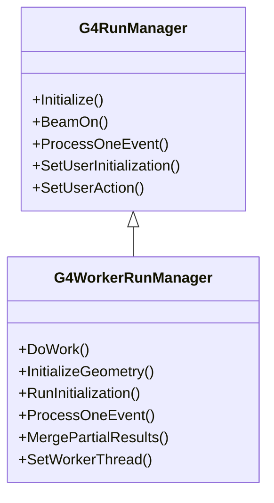

# G4WorkerRunManager

**File**: `source/run/include/G4WorkerRunManager.hh`

## Overview

G4WorkerRunManager is the worker thread variant of G4RunManager for multi-threaded Geant4 simulations. Each worker thread in a multi-threaded application has its own instance of this class, which manages event processing on that specific thread. This class extends G4RunManager by re-implementing key methods to support worker-specific behavior, including inheriting geometry and physics from the master thread, processing events independently, and merging results back to the master.

**Important**: Users should NEVER directly instantiate this class. Instances are automatically created and managed by G4MTRunManager for each worker thread.

## Class Description

G4WorkerRunManager provides worker thread functionality through:

- **Geometry Inheritance**: Receives pre-initialized geometry from master thread (no re-construction)
- **Physics Inheritance**: Receives pre-built physics tables from master thread
- **Independent Event Processing**: Processes events assigned by master thread independently
- **Local Action Instances**: Maintains thread-local copies of all user action classes
- **Result Merging**: Accumulates results and merges them to master at run end
- **RNG Management**: Manages per-worker random number generation with seeds from master
- **Synchronization**: Coordinates with master thread at critical simulation phases

### Worker vs Master Thread Differences

| Aspect | Master (G4MTRunManager) | Worker (G4WorkerRunManager) |
|--------|------------------------|----------------------------|
| Geometry | Full construction and initialization | Inherited, read-only access |
| Physics | Full table building | Inherited tables, read-only |
| Events | Does NOT process events | Processes events independently |
| User Actions | Master instances | Thread-local clones |
| RNG Seeds | Generates and distributes | Receives from master |
| Scoring | Collects from workers | Accumulates locally |
| Run Object | Merges from all workers | Creates local, merged to master |

## Important Notes

- **Automatic Management**: G4MTRunManager creates one G4WorkerRunManager per worker thread
- **No User Construction**: Users must NOT instantiate this class directly
- **Thread-Local Storage**: Each worker has completely independent action instances
- **Read-Only Geometry**: Workers cannot modify geometry structure
- **Seed Coordination**: RNG seeds come from master for reproducibility
- **Result Merging**: Custom G4Run::Merge() required for user-defined run data
- **Synchronization Points**: Workers synchronize with master at run start/end

## Architecture Diagram

```mermaid
graph TB
    subgraph "Master Thread"
        MTRunMgr[G4MTRunManager]
        MasterGeom[Master Geometry]
        MasterPhysics[Master Physics]
        MasterRNG[Master RNG]
    end

    subgraph "Worker Thread 1"
        Worker1[G4WorkerRunManager]
        Actions1[Thread-Local Actions]
        Events1[Event Processing]
    end

    subgraph "Worker Thread 2"
        Worker2[G4WorkerRunManager]
        Actions2[Thread-Local Actions]
        Events2[Event Processing]
    end

    subgraph "Worker Thread N"
        WorkerN[G4WorkerRunManager]
        ActionsN[Thread-Local Actions]
        EventsN[Event Processing]
    end

    MTRunMgr -->|Creates| Worker1
    MTRunMgr -->|Creates| Worker2
    MTRunMgr -->|Creates| WorkerN

    MasterGeom -.->|Inherits| Worker1
    MasterGeom -.->|Inherits| Worker2
    MasterGeom -.->|Inherits| WorkerN

    MasterPhysics -.->|Inherits| Worker1
    MasterPhysics -.->|Inherits| Worker2
    MasterPhysics -.->|Inherits| WorkerN

    MasterRNG -->|Seeds| Worker1
    MasterRNG -->|Seeds| Worker2
    MasterRNG -->|Seeds| WorkerN

    Worker1 -->|Merges Results| MTRunMgr
    Worker2 -->|Merges Results| MTRunMgr
    WorkerN -->|Merges Results| MTRunMgr
```



## Inheritance Hierarchy



## Static Accessor Methods

### GetWorkerRunManager

```cpp
static G4WorkerRunManager* GetWorkerRunManager();
```

Returns the worker run manager instance for the calling thread.

**Returns**: Pointer to the G4WorkerRunManager for this worker thread

**Location**: G4WorkerRunManager.hh:51

**Thread Context**: Worker thread only

**Details**:
- Returns the thread-local singleton for this worker
- Should only be called from worker thread context
- Returns nullptr if called from master thread or non-worker context

**Usage Notes**:
```cpp
// In worker thread context (e.g., user action)
G4WorkerRunManager* workerRM = G4WorkerRunManager::GetWorkerRunManager();
if (workerRM) {
    // Access worker-specific functionality
    workerRM->MergePartialResults();
}
```

### GetWorkerRunManagerKernel

```cpp
static G4WorkerRunManagerKernel* GetWorkerRunManagerKernel();
```

Returns the worker-specific run manager kernel.

**Returns**: Pointer to the G4WorkerRunManagerKernel for this worker thread

**Location**: G4WorkerRunManager.hh:52

**Thread Context**: Worker thread only

**Details**:
- Provides access to worker's kernel instance
- Kernel manages worker-specific geometry and physics state
- Used internally for worker initialization

## Constructors & Destructor

### Constructor

```cpp
G4WorkerRunManager();
```

Constructs a worker run manager for a worker thread.

**Location**: G4WorkerRunManager.hh:54

**Thread Context**: Worker thread only (created by G4MTRunManager)

**Details**:
- Called automatically by G4MTRunManager during worker thread initialization
- Initializes worker-specific kernel (G4WorkerRunManagerKernel)
- Sets up thread-local storage for actions and state
- Does NOT construct geometry or physics (inherited from master)

**Preconditions**:
- Master thread must have completed initialization
- Called within worker thread context

**Important**: Users must NEVER call this constructor directly.

### Destructor

```cpp
~G4WorkerRunManager() override;
```

Destroys the worker run manager.

**Location**: G4WorkerRunManager.hh:55

**Details**:
- Cleans up worker-specific resources
- Deletes thread-local action instances
- Called automatically when worker thread terminates
- Does NOT delete shared geometry/physics (owned by master)

## Initialization Methods

### InitializeGeometry

```cpp
void InitializeGeometry() override;
```

Initializes geometry for worker thread (inherits from master).

**Location**: G4WorkerRunManager.hh:57

**Overrides**: G4RunManager::InitializeGeometry()

**Details**:
- Does NOT construct geometry (master already did)
- Inherits geometry structure from master thread
- Sets up worker-local navigation state
- Geometry is read-only for workers

**Sequence**:
1. Access master's world volume
2. Set up worker-local navigator
3. Initialize parallel worlds if defined
4. Prepare for event processing

**Thread Safety**: Worker-local geometry state; navigation is thread-safe

### RunInitialization

```cpp
void RunInitialization() override;
```

Initializes a run on the worker thread.

**Location**: G4WorkerRunManager.hh:58

**Overrides**: G4RunManager::RunInitialization()

**Details**:
- Creates worker-local G4Run object
- Invokes worker's G4UserRunAction::BeginOfRunAction()
- Prepares scoring mechanisms
- Resets event counters for this worker

**Sequence**:
1. Create local G4Run instance
2. Call user's BeginOfRunAction()
3. Initialize scoring worlds
4. Prepare for event loop

## Event Loop Methods

### DoEventLoop

```cpp
void DoEventLoop(G4int n_event, const char* macroFile = nullptr,
                 G4int n_select = -1) override;
```

Executes the event loop on the worker thread.

**Parameters**:
- `n_event`: Number of events this worker should process
- `macroFile`: Optional macro file for event-specific commands
- `n_select`: Selective macro execution parameter

**Location**: G4WorkerRunManager.hh:59

**Overrides**: G4RunManager::DoEventLoop()

**Thread Context**: Worker thread only

**Details**:
- Processes events assigned by master thread
- Each worker processes a subset of total events
- Events are processed independently on each worker
- Handles RNG seeding for each event
- Executes macro file if specified

**Sequence**:
1. Request event from master (via SetUpAnEvent)
2. Process event via ProcessOneEvent()
3. Accumulate results in local run
4. Repeat until no more events
5. Merge results to master

### ProcessOneEvent

```cpp
void ProcessOneEvent(G4int i_event) override;
```

Processes a single event on the worker thread.

**Parameters**:
- `i_event`: Event ID (globally unique across all workers)

**Location**: G4WorkerRunManager.hh:60

**Overrides**: G4RunManager::ProcessOneEvent()

**Thread Context**: Worker thread only

**Details**:
- Processes one complete event from primary generation through tracking
- Uses thread-local action instances
- Accumulates results in worker-local run and scoring
- Independent from other workers

**Sequence**:
1. Generate event via GenerateEvent()
2. Process event (tracking all particles)
3. Invoke user event actions
4. Update local run statistics
5. Clean up event object

### GenerateEvent

```cpp
G4Event* GenerateEvent(G4int i_event) override;
```

Generates a new event with primary particles.

**Parameters**:
- `i_event`: Event ID

**Returns**: Pointer to newly created G4Event

**Location**: G4WorkerRunManager.hh:61

**Overrides**: G4RunManager::GenerateEvent()

**Thread Context**: Worker thread only

**Details**:
- Creates new G4Event object
- Sets event ID
- Invokes user's primary generator action (thread-local instance)
- Uses worker's RNG (seeded by master)

**Sequence**:
1. Create G4Event with event ID
2. Set RNG seeds from master
3. Call user's GeneratePrimaries()
4. Return event for processing

### RunTermination

```cpp
void RunTermination() override;
```

Terminates the run on worker thread.

**Location**: G4WorkerRunManager.hh:63

**Overrides**: G4RunManager::RunTermination()

**Thread Context**: Worker thread only

**Details**:
- Invokes worker's G4UserRunAction::EndOfRunAction()
- Merges worker results to master via MergePartialResults()
- Cleans up worker-local run object
- Synchronizes with master thread

**Sequence**:
1. Call user's EndOfRunAction()
2. Merge partial results to master
3. Delete local run object
4. Wait at synchronization barrier

### TerminateEventLoop

```cpp
void TerminateEventLoop() override;
```

Terminates the event loop on worker thread.

**Location**: G4WorkerRunManager.hh:64

**Overrides**: G4RunManager::TerminateEventLoop()

**Details**:
- Finalizes event processing for this worker
- Prepares for run termination
- Called after all events assigned to this worker are processed

## Worker Control Methods

### DoWork

```cpp
virtual void DoWork();
```

Main worker thread function - loops processing commands until termination.

**Location**: G4WorkerRunManager.hh:68

**Thread Context**: Worker thread only (called by thread function)

**Details**:
- Primary entry point for worker thread execution
- Implements worker's main loop
- Waits for commands from master
- Processes BeamOn() requests
- Continues until master signals termination

**Typical Sequence**:
1. Initialize worker
2. Signal ready to master
3. Wait for next action request
4. Execute action (BeamOn, ProcessUI, etc.)
5. Repeat until ENDWORKER signal
6. Clean up and terminate

**Usage Notes**:
```cpp
// Called internally by worker thread function
// Users do not call this directly

// Pseudo-code of worker thread function:
void WorkerThreadFunction(void* arg) {
    G4WorkerRunManager* workerRM = new G4WorkerRunManager();
    workerRM->DoWork();  // Runs until master signals termination
    delete workerRM;
}
```

### SetWorkerThread

```cpp
inline void SetWorkerThread(G4WorkerThread* wc) { workerContext = wc; }
```

Associates the worker context with this run manager.

**Parameters**:
- `wc`: Pointer to G4WorkerThread context

**Location**: G4WorkerRunManager.hh:71

**Thread Context**: Worker thread only

**Details**:
- Called during worker thread initialization
- Stores worker thread context for communication with master
- Provides access to thread ID and other worker-specific data

**Usage**: Internal framework use only.

## User Initialization Methods

All SetUserInitialization() methods are overridden to handle worker-specific behavior:

### SetUserInitialization (G4VUserPhysicsList)

```cpp
void SetUserInitialization(G4VUserPhysicsList* userInit) override;
```

Registers physics list for worker thread.

**Parameters**:
- `userInit`: Physics list instance (typically inherited from master)

**Location**: G4WorkerRunManager.hh:73

**Details**:
- Worker receives pre-built physics tables from master
- Does NOT rebuild physics tables (uses master's)
- Thread-local physics list instance created

### SetUserInitialization (G4VUserDetectorConstruction)

```cpp
void SetUserInitialization(G4VUserDetectorConstruction* userInit) override;
```

Registers detector construction for worker thread.

**Parameters**:
- `userInit`: Detector construction instance

**Location**: G4WorkerRunManager.hh:74

**Details**:
- Worker inherits geometry from master
- Does NOT invoke Construct() method
- Thread-local instance for potential parallel world construction

### SetUserInitialization (G4VUserActionInitialization)

```cpp
void SetUserInitialization(G4VUserActionInitialization* userInit) override;
```

Registers action initialization for worker thread.

**Parameters**:
- `userInit`: Action initialization instance

**Location**: G4WorkerRunManager.hh:75

**Details**:
- Calls BuildForWorker() to create thread-local actions
- Each worker gets independent action instances
- Actions are NOT shared between workers

### SetUserInitialization (G4UserWorkerInitialization)

```cpp
void SetUserInitialization(G4UserWorkerInitialization* userInit) override;
```

Registers worker-specific initialization.

**Parameters**:
- `userInit`: Worker initialization instance

**Location**: G4WorkerRunManager.hh:76

**Details**:
- Called during worker startup
- Allows custom per-worker setup (e.g., output files)
- WorkerStart() and WorkerStop() methods invoked

### SetUserInitialization (G4UserWorkerThreadInitialization)

```cpp
void SetUserInitialization(G4UserWorkerThreadInitialization* userInit) override;
```

Registers advanced worker thread initialization.

**Parameters**:
- `userInit`: Advanced worker initialization instance

**Location**: G4WorkerRunManager.hh:77

**Details**:
- Provides additional worker thread setup hooks
- More fine-grained control than G4UserWorkerInitialization

## User Action Methods

All SetUserAction() methods create thread-local instances:

### SetUserAction (G4UserRunAction)

```cpp
void SetUserAction(G4UserRunAction* userAction) override;
```

Registers run action for worker thread.

**Location**: G4WorkerRunManager.hh:78

### SetUserAction (G4VUserPrimaryGeneratorAction)

```cpp
void SetUserAction(G4VUserPrimaryGeneratorAction* userAction) override;
```

Registers primary generator action for worker thread.

**Location**: G4WorkerRunManager.hh:79

### SetUserAction (G4UserEventAction)

```cpp
void SetUserAction(G4UserEventAction* userAction) override;
```

Registers event action for worker thread.

**Location**: G4WorkerRunManager.hh:80

### SetUserAction (G4UserStackingAction)

```cpp
void SetUserAction(G4UserStackingAction* userAction) override;
```

Registers stacking action for worker thread.

**Location**: G4WorkerRunManager.hh:81

### SetUserAction (G4UserTrackingAction)

```cpp
void SetUserAction(G4UserTrackingAction* userAction) override;
```

Registers tracking action for worker thread.

**Location**: G4WorkerRunManager.hh:82

### SetUserAction (G4UserSteppingAction)

```cpp
void SetUserAction(G4UserSteppingAction* userAction) override;
```

Registers stepping action for worker thread.

**Location**: G4WorkerRunManager.hh:83

**Note**: All user actions are thread-local; each worker has independent instances.

## Random Number Management

### RestoreRndmEachEvent

```cpp
void RestoreRndmEachEvent(G4bool flag) override { readStatusFromFile = flag; }
```

Controls whether RNG status is restored from file for each event.

**Parameters**:
- `flag`: true to restore RNG from file per event

**Location**: G4WorkerRunManager.hh:85

**Details**:
- Sets readStatusFromFile member variable
- Enables event-level RNG reproducibility
- Used for debugging specific events

## Protected Methods

### ConstructScoringWorlds

```cpp
void ConstructScoringWorlds() override;
```

Constructs scoring worlds on worker thread.

**Location**: G4WorkerRunManager.hh:88

**Access**: Protected

**Details**:
- Creates worker-local scoring geometries
- Inherits scoring mesh definitions from master
- Each worker accumulates scores independently

### StoreRNGStatus

```cpp
void StoreRNGStatus(const G4String& filenamePrefix) override;
```

Stores RNG status to file.

**Parameters**:
- `filenamePrefix`: Filename prefix for status file

**Location**: G4WorkerRunManager.hh:89

**Access**: Protected

**Details**:
- Worker-specific RNG status storage
- Useful for event reproducibility
- Each worker writes separate file

### rndmSaveThisRun

```cpp
void rndmSaveThisRun() override;
```

Saves RNG status at beginning of run.

**Location**: G4WorkerRunManager.hh:90

**Access**: Protected

### rndmSaveThisEvent

```cpp
void rndmSaveThisEvent() override;
```

Saves RNG status at beginning of event.

**Location**: G4WorkerRunManager.hh:91

**Access**: Protected

### MergePartialResults

```cpp
virtual void MergePartialResults(G4bool mergeEvents = true);
```

Merges worker's results into master's global run.

**Parameters**:
- `mergeEvents`: If true, merge event-level data (default: true)

**Location**: G4WorkerRunManager.hh:95

**Access**: Protected

**Thread Context**: Worker thread (called during RunTermination)

**Details**:
- Critical for collecting results from all workers
- Calls master's MergeRun() with local run
- Calls master's MergeScores() with local scoring manager
- Thread-safe merging via master's locking mechanisms

**Important**: User's custom G4Run class must implement Merge() method:
```cpp
class MyRun : public G4Run {
  public:
    void Merge(const G4Run* aRun) override {
        const MyRun* localRun = static_cast<const MyRun*>(aRun);
        // Merge localRun data into this master run
        totalEnergy += localRun->totalEnergy;
        eventCount += localRun->eventCount;
        // ... merge other custom data ...
        G4Run::Merge(aRun);  // Call base class
    }
};
```

### SetupDefaultRNGEngine

```cpp
virtual void SetupDefaultRNGEngine();
```

Sets up default random number generator engine for worker.

**Location**: G4WorkerRunManager.hh:112

**Access**: Protected

**Details**:
- Initializes worker's RNG engine
- Seeds come from master thread
- Ensures independent random sequences per worker

## Protected Member Variables

```cpp
protected:
    G4WorkerThread* workerContext = nullptr;  // Worker thread context
#ifdef G4MULTITHREADED
    G4bool visIsSetUp = false;                // Visualization setup flag
#endif
    G4bool eventLoopOnGoing = false;          // Event loop active flag
    G4bool runIsSeeded = false;               // Run seeding status
    G4int nevModulo = -1;                     // Event modulo for seed reuse
    G4int currEvID = -1;                      // Current event ID
    G4int luxury = -1;                        // RNG luxury level
    G4SeedsQueue seedsQueue;                  // Queue of RNG seeds
    G4bool readStatusFromFile = false;        // Read RNG from file flag
```

**Location**: G4WorkerRunManager.hh:98-109

**Details**: Internal state management for worker thread operations.

## Usage Pattern

### Typical Worker Lifecycle

```cpp
// AUTOMATIC - Users do NOT write this code
// This is handled internally by G4MTRunManager

// 1. Master creates workers
void G4MTRunManager::CreateAndStartWorkers() {
    for (int i = 0; i < nworkers; ++i) {
        // Spawn worker thread
        G4Thread* thread = G4THREADCREATE(WorkerThreadFunc, nullptr);
        threads.push_back(thread);
    }
}

// 2. Worker thread function
void* WorkerThreadFunc(void*) {
    // Create worker run manager
    G4WorkerRunManager* workerRM = new G4WorkerRunManager();

    // Set worker context
    workerRM->SetWorkerThread(workerContext);

    // Initialize worker
    workerRM->InitializeGeometry();

    // Main worker loop
    workerRM->DoWork();

    // Clean up
    delete workerRM;
    return nullptr;
}

// 3. Worker processes events
void G4WorkerRunManager::DoWork() {
    while (true) {
        // Wait for action from master
        WorkerActionRequest action = WaitForNextAction();

        switch (action) {
            case NEXTITERATION:
                // Process a run
                RunInitialization();
                DoEventLoop(n_event);
                RunTermination();
                break;

            case PROCESSUI:
                // Process UI commands
                ProcessUICommands();
                break;

            case ENDWORKER:
                // Terminate worker
                return;
        }
    }
}
```

### User Code (Custom Run with Merge)

```cpp
// User must implement custom G4Run::Merge() for result collection
class MyRun : public G4Run {
  private:
    G4double totalEnergyDeposit = 0.0;
    G4int particleCount = 0;
    std::map<G4String, G4int> volumeHits;

  public:
    void RecordEvent(const G4Event* event) override {
        // Accumulate data during event processing
        // ... (called on worker thread)
    }

    void Merge(const G4Run* aRun) override {
        // Merge worker run into master run
        // This is called on MASTER thread
        const MyRun* localRun = static_cast<const MyRun*>(aRun);

        // Merge custom data
        totalEnergyDeposit += localRun->totalEnergyDeposit;
        particleCount += localRun->particleCount;

        // Merge maps
        for (const auto& pair : localRun->volumeHits) {
            volumeHits[pair.first] += pair.second;
        }

        // Call base class
        G4Run::Merge(aRun);
    }
};

// Action initialization creates custom run
class MyActionInitialization : public G4VUserActionInitialization {
  public:
    void BuildForWorker() const override {
        // Create worker-local actions
        SetUserAction(new MyRunAction);
        SetUserAction(new MyEventAction);
        SetUserAction(new MyPrimaryGeneratorAction);
    }
};

class MyRunAction : public G4UserRunAction {
  public:
    G4Run* GenerateRun() override {
        // Create custom run object
        return new MyRun;
    }

    void BeginOfRunAction(const G4Run* run) override {
        // Called on each worker at run start
    }

    void EndOfRunAction(const G4Run* run) override {
        // Called on each worker at run end
        // Results will be merged to master automatically
    }
};
```

## Thread Safety Notes

### Worker Thread Only

These methods should ONLY be called from worker thread context:
- GetWorkerRunManager()
- GetWorkerRunManagerKernel()
- DoWork()
- ProcessOneEvent()
- GenerateEvent()
- RunInitialization()
- RunTermination()
- All SetUserAction() and SetUserInitialization() calls

### Thread-Safe Operations

- Each worker has completely independent state
- No shared mutable data between workers (except during merge)
- Geometry is read-only for all workers
- Physics tables are read-only for all workers
- RNG is independent per worker
- Merging is synchronized by master

### Critical Sections

- MergePartialResults() - synchronized by master's mutex
- Access to master's run object - protected by master
- Scoring merge operations - synchronized

## Performance Considerations

### Memory Usage

- Each worker maintains independent action instances
- RNG state per worker
- Navigation state per worker
- Scoring accumulation per worker
- Memory scales with number of workers

### Load Balancing

- Events distributed dynamically by master
- Workers request events as they complete processing
- Automatic load balancing across workers
- No static event partitioning

### Scalability

- Near-linear speedup for CPU-bound simulations
- Limited by:
  - Master thread overhead (seed generation, merging)
  - Synchronization barriers
  - I/O contention
  - Memory bandwidth

## Related Classes

- **G4MTRunManager** - Master run manager that creates workers
- **G4RunManager** - Base class (sequential variant)
- **G4WorkerRunManagerKernel** - Worker-specific kernel
- **G4WorkerThread** - Worker thread context
- **G4Run** - Run data container (must implement Merge())
- **G4VUserActionInitialization** - Creates worker-local actions
- **G4UserWorkerInitialization** - Worker setup/teardown hooks

## See Also

- [G4MTRunManager](./g4mtrunmanager.md) - Master thread manager
- [G4RunManager](./g4runmanager.md) - Sequential base class
- [G4WorkerTaskRunManager](./g4workertaskrunmanager.md) - Task-based worker variant
- [G4TaskRunManager](./g4taskrunmanager.md) - Task-based master manager
- [G4Run](./g4run.md) - Run data container
- [G4VUserActionInitialization](./g4vuseractioninitialization.md) - Action initialization
- [G4UserWorkerInitialization](./g4userworkerinitialization.md) - Worker initialization
