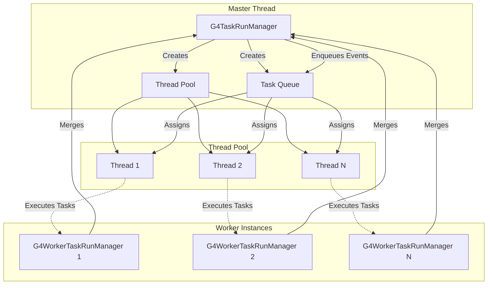
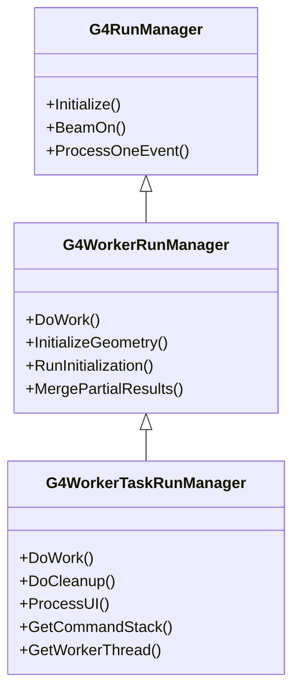

# G4WorkerTaskRunManager

**File**: `source/run/include/G4WorkerTaskRunManager.h`

## Overview

G4WorkerTaskRunManager is the task-based worker variant of G4WorkerRunManager for task-parallel Geant4 simulations. Unlike traditional thread-based parallelism where each worker thread processes events sequentially, task-based parallelism uses a thread pool and task queue to dynamically schedule event processing. This class extends G4WorkerRunManager to support Intel TBB (Threading Building Blocks) or PTL (Parallel Tasking Library) backends, enabling better load balancing and more efficient CPU utilization.

**Important**: Users should NEVER directly instantiate this class. Instances are automatically created and managed by G4TaskRunManager for task-based parallel execution.

## Class Description

G4WorkerTaskRunManager provides task-based worker functionality through:

- **Task-Based Execution**: Events processed as independent tasks in a thread pool
- **Dynamic Scheduling**: Tasks scheduled dynamically rather than statically assigned to threads
- **Improved Load Balancing**: Short and long events balanced automatically across threads
- **Thread Pool Backend**: Uses TBB or PTL for efficient task management
- **Command Stack Processing**: Enhanced UI command handling for task-based execution
- **Geometry/Physics Inheritance**: Inherits from master like thread-based workers

### Task-Based vs Thread-Based Parallelism

| Aspect | Thread-Based (G4WorkerRunManager) | Task-Based (G4WorkerTaskRunManager) |
|--------|-----------------------------------|-------------------------------------|
| Execution Model | One worker thread = one event at a time | Thread pool + task queue |
| Event Assignment | Static distribution to threads | Dynamic task scheduling |
| Load Balancing | Limited (depends on event distribution) | Automatic (work-stealing) |
| Thread Efficiency | Thread may idle if events vary in duration | Threads always busy with available tasks |
| Scalability | Good for uniform event durations | Better for non-uniform workloads |
| Backend | Native threads | TBB or PTL |
| Overhead | Lower (simpler model) | Slightly higher (task management) |

## Important Notes

- **Automatic Management**: G4TaskRunManager creates G4WorkerTaskRunManager instances
- **No User Construction**: Users must NOT instantiate this class directly
- **Task Queue**: Events processed as tasks from a shared queue
- **Thread Pool**: Underlying threads managed by TBB or PTL
- **Better for Variable Events**: Optimal when event processing times vary significantly
- **UI Command Stack**: Maintains processed command history
- **Same Merging**: Results merged to master like thread-based workers

## Architecture Diagram



## Inheritance Hierarchy



## Type Aliases

### G4StrVector

```cpp
using G4StrVector = std::vector<G4String>;
```

**Location**: G4WorkerTaskRunManager.h:51

**Purpose**: Type alias for vector of strings, used for command stack storage.

## Static Accessor Methods

### GetWorkerRunManager

```cpp
static G4WorkerTaskRunManager* GetWorkerRunManager();
```

Returns the task-based worker run manager instance for the calling thread.

**Returns**: Pointer to the G4WorkerTaskRunManager for this worker

**Location**: G4WorkerTaskRunManager.h:54

**Thread Context**: Worker thread only

**Details**:
- Returns the thread-local task worker instance
- Should only be called from worker thread context
- Returns nullptr if called from master or non-worker context

**Usage Notes**:
```cpp
// In worker thread context (e.g., user action)
G4WorkerTaskRunManager* workerRM = G4WorkerTaskRunManager::GetWorkerRunManager();
if (workerRM) {
    // Access task worker functionality
    auto commands = workerRM->GetCommandStack();
}
```

### GetWorkerRunManagerKernel

```cpp
static G4WorkerTaskRunManagerKernel* GetWorkerRunManagerKernel();
```

Returns the task-based worker kernel.

**Returns**: Pointer to the G4WorkerTaskRunManagerKernel for this worker

**Location**: G4WorkerTaskRunManager.h:55

**Thread Context**: Worker thread only

**Details**:
- Provides access to worker's task-specific kernel
- Kernel manages task worker geometry and physics state

## Constructors & Destructor

### Constructor

```cpp
G4WorkerTaskRunManager() = default;
```

Constructs a task-based worker run manager.

**Location**: G4WorkerTaskRunManager.h:56

**Thread Context**: Worker thread only (created by G4TaskRunManager)

**Details**:
- Default constructor (compiler-generated)
- Called automatically by G4TaskRunManager during task worker initialization
- Inherits initialization from G4WorkerRunManager
- Sets up task-specific execution model

**Preconditions**:
- Master thread (G4TaskRunManager) must be initialized
- Thread pool must be created

**Important**: Users must NEVER call this constructor directly.

### Destructor

```cpp
~G4WorkerTaskRunManager() = default;
```

Destroys the task-based worker run manager.

**Details**:
- Default destructor (compiler-generated)
- Inherits cleanup from G4WorkerRunManager base class
- Called when task worker terminates

## Overridden Event Loop Methods

### RunInitialization

```cpp
void RunInitialization() override;
```

Initializes a run on the task-based worker.

**Location**: G4WorkerTaskRunManager.h:59

**Overrides**: G4WorkerRunManager::RunInitialization()

**Thread Context**: Worker thread

**Details**:
- Task-specific run initialization
- Creates worker-local G4Run object
- Invokes user's BeginOfRunAction()
- Prepares for task-based event processing

**Differences from Thread-Based**:
- May be called multiple times in different threads from pool
- Thread pool threads may execute different task workers

### DoEventLoop

```cpp
void DoEventLoop(G4int n_event, const char* macroFile = nullptr,
                 G4int n_select = -1) override;
```

Executes the task-based event loop.

**Parameters**:
- `n_event`: Number of events to process in this batch
- `macroFile`: Optional macro file for event-specific commands
- `n_select`: Selective macro execution parameter

**Location**: G4WorkerTaskRunManager.h:60

**Overrides**: G4WorkerRunManager::DoEventLoop()

**Thread Context**: Worker thread from pool

**Details**:
- Task-based event loop execution
- Events processed as tasks from queue
- Dynamic scheduling by TBB/PTL
- Multiple tasks may execute concurrently on different threads

### ProcessOneEvent

```cpp
void ProcessOneEvent(G4int i_event) override;
```

Processes a single event as a task.

**Parameters**:
- `i_event`: Event ID (globally unique)

**Location**: G4WorkerTaskRunManager.h:61

**Overrides**: G4WorkerRunManager::ProcessOneEvent()

**Thread Context**: Worker thread from pool

**Details**:
- Processes one event within task context
- May be called on any thread from the pool
- Uses thread-local storage for actions
- Task-safe event processing

### GenerateEvent

```cpp
G4Event* GenerateEvent(G4int i_event) override;
```

Generates a new event for task-based processing.

**Parameters**:
- `i_event`: Event ID

**Returns**: Pointer to newly created G4Event

**Location**: G4WorkerTaskRunManager.h:62

**Overrides**: G4WorkerRunManager::GenerateEvent()

**Thread Context**: Worker thread from pool

**Details**:
- Creates G4Event within task
- Sets event ID
- Invokes primary generator (thread-local)
- RNG seeded appropriately for task

### RunTermination

```cpp
void RunTermination() override;
```

Terminates the run on task-based worker.

**Location**: G4WorkerTaskRunManager.h:63

**Overrides**: G4WorkerRunManager::RunTermination()

**Thread Context**: Worker thread

**Details**:
- Task-specific run termination
- Invokes user's EndOfRunAction()
- Merges results to master
- Cleans up worker-local run

### TerminateEventLoop

```cpp
void TerminateEventLoop() override;
```

Terminates the task-based event loop.

**Location**: G4WorkerTaskRunManager.h:64

**Overrides**: G4WorkerRunManager::TerminateEventLoop()

**Thread Context**: Worker thread

**Details**:
- Finalizes task-based event processing
- Called after all tasks complete
- Prepares for run termination

## Task-Specific Methods

### DoWork

```cpp
void DoWork() override;
```

Main task worker function - executes tasks from queue.

**Location**: G4WorkerTaskRunManager.h:65

**Overrides**: G4WorkerRunManager::DoWork()

**Thread Context**: Worker thread from pool

**Details**:
- Task-based work execution model
- Fetches and processes tasks from queue
- Continues until queue empty or termination signal
- May execute on different threads over time (thread pool)

**Task Execution Flow**:
1. Wait for task from queue
2. Execute task (process events)
3. Complete task
4. Request next task
5. Repeat until termination

**Differences from Thread-Based DoWork()**:
- Thread-based: One dedicated thread per worker
- Task-based: Worker executed on any available thread from pool

### DoCleanup

```cpp
virtual void DoCleanup();
```

Performs cleanup operations for task worker.

**Location**: G4WorkerTaskRunManager.h:68

**Thread Context**: Worker thread

**Details**:
- Cleans up task-specific resources
- Called during worker termination
- Releases task-related data structures
- Ensures proper resource deallocation

**Usage**: Called automatically during shutdown.

### ProcessUI

```cpp
virtual void ProcessUI();
```

Processes UI commands in task-based context.

**Location**: G4WorkerTaskRunManager.h:69

**Thread Context**: Worker thread

**Details**:
- Handles UI command processing for task workers
- Maintains command stack for replay/debugging
- Ensures commands executed in correct task context
- Synchronizes with master for command distribution

### GetWorkerThread

```cpp
G4WorkerThread* GetWorkerThread() const { return workerContext; }
```

Returns the worker thread context.

**Returns**: Pointer to G4WorkerThread context

**Location**: G4WorkerTaskRunManager.h:70

**Details**:
- Provides access to worker thread information
- Thread context may change as tasks move between pool threads
- Useful for debugging and logging

### GetCommandStack

```cpp
G4StrVector GetCommandStack() const { return processedCommandStack; }
```

Returns the stack of processed UI commands.

**Returns**: Vector of processed UI command strings

**Location**: G4WorkerTaskRunManager.h:71

**Details**:
- Retrieves history of UI commands processed by this worker
- Useful for debugging and reproducibility
- Commands accumulated during worker lifetime

**Usage Notes**:
```cpp
// Query processed commands
auto commands = workerRM->GetCommandStack();
for (const auto& cmd : commands) {
    G4cout << "Processed: " << cmd << G4endl;
}
```

### RestoreRndmEachEvent

```cpp
void RestoreRndmEachEvent(G4bool flag) override { readStatusFromFile = flag; }
```

Controls RNG restoration from file for each event.

**Parameters**:
- `flag`: true to restore RNG from file per event

**Location**: G4WorkerTaskRunManager.h:66

**Overrides**: G4WorkerRunManager::RestoreRndmEachEvent()

**Details**:
- Sets readStatusFromFile inherited member
- Enables event-level RNG reproducibility in task context
- Same behavior as thread-based worker

## Protected Methods

### StoreRNGStatus

```cpp
void StoreRNGStatus(const G4String& filenamePrefix) override;
```

Stores RNG status to file in task context.

**Parameters**:
- `filenamePrefix`: Filename prefix for status file

**Location**: G4WorkerTaskRunManager.h:74

**Access**: Protected

**Overrides**: G4WorkerRunManager::StoreRNGStatus()

**Details**:
- Task-specific RNG status storage
- Accounts for thread pool execution model
- Each task worker may write separate status files

### SetupDefaultRNGEngine

```cpp
void SetupDefaultRNGEngine() override;
```

Sets up default RNG engine for task worker.

**Location**: G4WorkerTaskRunManager.h:77

**Access**: Protected

**Overrides**: G4WorkerRunManager::SetupDefaultRNGEngine()

**Details**:
- Initializes RNG for task-based execution
- Seeds managed by G4TaskRunManager
- Thread-safe RNG setup for task workers

## Protected Member Variables

```cpp
protected:
    G4StrVector processedCommandStack;  // Stack of processed UI commands
```

**Location**: G4WorkerTaskRunManager.h:80

**Details**:
- Stores history of UI commands processed
- Used for command replay and debugging
- Accumulated throughout worker lifetime

**Inherited Members**: Also inherits all protected members from G4WorkerRunManager:
- `workerContext` - Worker thread context
- `eventLoopOnGoing` - Event loop status flag
- `runIsSeeded` - Run seeding status
- `nevModulo` - Event modulo for seed reuse
- `currEvID` - Current event ID
- `seedsQueue` - Queue of RNG seeds
- `readStatusFromFile` - RNG file restoration flag

## Usage Pattern

### Typical Task Worker Lifecycle

```cpp
// AUTOMATIC - Users do NOT write this code
// This is handled internally by G4TaskRunManager

// 1. Master creates task manager with thread pool
G4TaskRunManager* taskRM = new G4TaskRunManager(/*useTBB=*/true);
taskRM->SetNumberOfThreads(4);  // Thread pool size
taskRM->SetGrainsize(100);      // Events per task

// 2. Master initializes and creates workers
taskRM->Initialize();  // Creates thread pool and task workers

// 3. Master enqueues event tasks
taskRM->BeamOn(10000);  // Enqueues 10000/100 = 100 tasks

// 4. Thread pool executes tasks
// Any thread from pool can execute any task worker
void TaskExecutionFunction() {
    // Get or create task worker for this thread
    G4WorkerTaskRunManager* taskWorker = GetThreadLocalTaskWorker();

    // Initialize if needed
    if (!taskWorker->IsInitialized()) {
        taskWorker->InitializeGeometry();
        taskWorker->RunInitialization();
    }

    // Process events in this task
    taskWorker->DoWork();

    // Task complete
}

// 5. Results merged when all tasks complete
// Each task worker merges its results to master
```

### User Code (Same as Thread-Based)

```cpp
// User code is IDENTICAL to thread-based parallelism
// G4Run::Merge() implementation is the same

class MyRun : public G4Run {
  private:
    G4double totalEnergy = 0.0;
    G4int hitCount = 0;

  public:
    void AddEnergy(G4double e) { totalEnergy += e; }
    void IncrementHits() { ++hitCount; }

    void Merge(const G4Run* aRun) override {
        const MyRun* localRun = static_cast<const MyRun*>(aRun);

        // Merge data (called on master thread)
        totalEnergy += localRun->totalEnergy;
        hitCount += localRun->hitCount;

        G4Run::Merge(aRun);
    }
};

// Actions are thread-local (same as thread-based)
class MyActionInitialization : public G4VUserActionInitialization {
  public:
    void BuildForWorker() const override {
        SetUserAction(new MyRunAction);
        SetUserAction(new MyEventAction);
        SetUserAction(new MyPrimaryGeneratorAction);
    }
};
```

## Task-Based Parallelism Advantages

### Dynamic Load Balancing

**Problem with Thread-Based**:
```
Thread 1: [Event 1: 10s] [Event 5: 1s] [Done - idle 9s]
Thread 2: [Event 2: 5s]  [Event 6: 5s] [Done]
Thread 3: [Event 3: 2s]  [Event 7: 2s] [Done - idle 6s]
Thread 4: [Event 4: 8s]  [Event 8: 2s] [Done]
Total time: 20s (with significant idle time)
```

**Solution with Task-Based**:
```
Thread 1: [Task 1 (3 events): 10s] [Task 5: 2s]
Thread 2: [Task 2 (3 events): 9s]  [Task 6: 3s]
Thread 3: [Task 3 (3 events): 8s]  [Task 7: 4s]
Thread 4: [Task 4 (3 events): 11s] [Done]
Total time: 15s (better utilization)
```

### Work Stealing

- Threads can "steal" tasks from other threads' queues
- Busy threads automatically help idle threads
- Better CPU utilization

### Adaptive Grainsize

```cpp
// Fine-grained tasks for variable event times
taskRM->SetGrainsize(10);  // 10 events per task

// Coarse-grained for uniform events (less overhead)
taskRM->SetGrainsize(1000);  // 1000 events per task
```

## Performance Considerations

### When to Use Task-Based

**Best for**:
- Highly variable event processing times
- Complex geometries with variable tracking
- Mixed event types (fast + slow)
- Need for optimal load balancing

**Thread-Based May Be Better for**:
- Uniform event processing times
- Minimal task management overhead desired
- Simpler debugging (one thread = one worker)
- No TBB dependency desired

### Grainsize Selection

- **Too small** (e.g., 1): High task management overhead
- **Too large** (e.g., 10000): Poor load balancing
- **Optimal** (e.g., 50-500): Balance overhead vs. load balancing

```cpp
// Experiment with grainsize for your workload
taskRM->SetGrainsize(100);  // Start with 100

// Monitor task efficiency
G4cout << "Number of tasks: " << taskRM->GetNumberOfTasks() << G4endl;
G4cout << "Events per task: " << taskRM->GetNumberOfEventsPerTask() << G4endl;
```

### Memory Considerations

- Thread pool threads reused across tasks
- Less memory than creating many worker threads
- Task workers may be created/destroyed dynamically
- Shared thread pool = lower memory footprint

## Thread Safety Notes

### Task Worker Context

- Task workers may execute on different threads from pool
- Thread-local storage used for actions
- RNG state managed per task worker
- Navigation state thread-safe

### Synchronization

- Task queue access synchronized automatically (TBB/PTL)
- Result merging synchronized by master
- No user synchronization needed

### Critical Sections

- Same as thread-based workers:
  - MergePartialResults() protected by master
  - Scoring merge protected
  - Run merge protected

## Comparison: Thread-Based vs Task-Based

| Feature | G4WorkerRunManager | G4WorkerTaskRunManager |
|---------|-------------------|------------------------|
| Backend | Native threads | TBB or PTL |
| Event Assignment | Static per thread | Dynamic from queue |
| Thread Lifecycle | Created at start, destroyed at end | Thread pool persists |
| Load Balancing | Limited | Excellent (work-stealing) |
| Overhead | Lower | Slightly higher |
| Best For | Uniform events | Variable events |
| Dependencies | None | TBB or PTL |
| Debugging | Easier (1:1 thread:worker) | More complex |
| Scalability | Good | Better |

## Related Classes

- **G4TaskRunManager** - Master manager for task-based parallelism
- **G4WorkerRunManager** - Base class (thread-based worker)
- **G4MTRunManager** - Thread-based master manager
- **G4WorkerTaskRunManagerKernel** - Task worker kernel
- **G4TaskGroup** - Task grouping and synchronization
- **G4ThreadPool** - Thread pool management
- **PTL::TaskRunManager** - PTL backend integration

## See Also

- [G4TaskRunManager](./g4taskrunmanager.md) - Task-based master manager
- [G4WorkerRunManager](./g4workerrunmanager.md) - Thread-based worker base class
- [G4MTRunManager](./g4mtrunmanager.md) - Thread-based master manager
- [G4RunManager](./g4runmanager.md) - Sequential base class
- [G4Run](./g4run.md) - Run data container (requires Merge())
- [G4VUserActionInitialization](./g4vuseractioninitialization.md) - Action initialization
