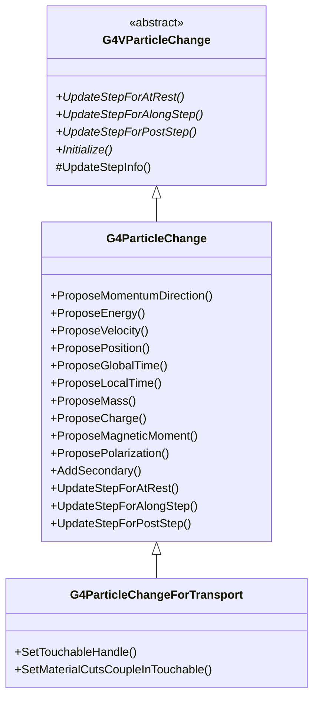
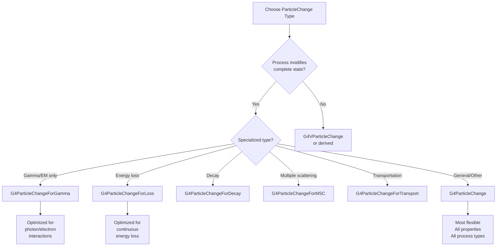

# G4ParticleChange

**File**: `source/track/include/G4ParticleChange.hh`

## Overview

G4ParticleChange is the general-purpose concrete implementation of G4VParticleChange for representing particle state changes in Geant4. It encapsulates the complete final state of a particle after a physics process, including momentum, energy, position, time, polarization, mass, charge, and secondary particles. All values are stored in the global reference system, meaning all necessary Lorentz transformations must be completed before storing data in this class.

**Important Note**: Despite the name "ParticleChange", this class stores and returns the "FINAL" values of physical quantities (not changes/deltas), except for AlongStep processes which compute differences from the initial state.

## Class Description

G4ParticleChange provides comprehensive state management for physics processes. It extends G4VParticleChange with full particle state tracking:

- **Complete Final State**: Position, momentum direction, kinetic energy, velocity
- **Timing Information**: Global time, local time, proper time
- **Particle Properties**: Mass, charge, magnetic moment, polarization
- **Secondary Generation**: Multiple methods for adding secondaries with different attributes
- **Flexible Updates**: Different update methods for AtRest, AlongStep, and PostStep processes

This is the most commonly used particle change class, suitable for general discrete processes and interactions that modify the complete particle state.

## Inheritance Hierarchy



**Key Relationships**:
- Inherits from [G4VParticleChange](./g4vparticlechange.md) - Base class providing core infrastructure
- Extended by [G4ParticleChangeForTransport](./g4particlechangefortransport.md) - Adds geometry/touchable handling

## Constructor & Destructor

### Constructor

```cpp
G4ParticleChange();
```

Creates a G4ParticleChange object with default initialization.

**Location**: `G4ParticleChange.hh:59-60`

**Initialization**:
- Inherits initialization from G4VParticleChange (status=fAlive, no secondaries, etc.)
- All vectors initialized to zero
- Energy and time values set to zero
- Velocity change flag set to false

### Destructor

```cpp
~G4ParticleChange() override = default;
```

Default virtual destructor.

**Location**: `G4ParticleChange.hh:62`

### Deleted Copy Operations

```cpp
G4ParticleChange(const G4ParticleChange& right) = delete;
G4ParticleChange& operator=(const G4ParticleChange& right) = delete;
```

Copy construction and assignment are explicitly disabled to prevent unintended copies.

**Location**: `G4ParticleChange.hh:65-66`

## Update Step Methods

These methods update the G4Step with the final state information for different process types.

### UpdateStepForAlongStep

```cpp
G4Step* UpdateStepForAlongStep(G4Step* Step) override;
```

Updates the step for AlongStep processes (continuous processes like energy loss and multiple scattering).

**Parameters**:
- `Step`: Pointer to the current step

**Returns**: Pointer to the updated G4Step

**Location**: `G4ParticleChange.hh:72`

**Behavior**:
- Calculates the **differences (delta)** between final and initial states
- Accumulates these changes in the PostStepPoint
- Uses normalized momentum vectors from GetMomentumDirection()
- Accounts for changes relative to PreStepPoint values

**Usage**: Called by stepping manager after an AlongStepDoIt() method completes.

### UpdateStepForAtRest

```cpp
G4Step* UpdateStepForAtRest(G4Step* Step) override;
```

Updates the step for AtRest processes (e.g., particle decay at rest).

**Parameters**:
- `Step`: Pointer to the current step

**Returns**: Pointer to the updated G4Step

**Location**: `G4ParticleChange.hh:83`

**Behavior**:
- Sets final state values directly in PostStepPoint
- Based on current track information (PreStepPoint)
- No delta calculations needed

**Usage**: Called by stepping manager after an AtRestDoIt() method completes.

### UpdateStepForPostStep

```cpp
G4Step* UpdateStepForPostStep(G4Step* Step) override;
```

Updates the step for PostStep processes (discrete interactions like scattering, absorption).

**Parameters**:
- `Step`: Pointer to the current step

**Returns**: Pointer to the updated G4Step

**Location**: `G4ParticleChange.hh:84`

**Behavior**:
- Sets final state values directly in PostStepPoint
- Based on current track information (PreStepPoint)
- Complete state replacement for discrete interactions

**Usage**: Called by stepping manager after a PostStepDoIt() method completes.

### Initialize

```cpp
void Initialize(const G4Track& track) override;
```

Initializes all properties from the current track state.

**Parameters**:
- `track`: Reference to the current track

**Location**: `G4ParticleChange.hh:88`

**Usage**: **Must be called** at the beginning of every DoIt() method to refresh the particle change object with current track state. Ensures the object starts with correct initial values.

## Momentum and Direction Methods

### GetMomentumDirection

```cpp
inline const G4ThreeVector* GetMomentumDirection() const;
```

Returns the final momentum direction vector (normalized).

**Returns**: Pointer to the momentum direction vector

**Location**: `G4ParticleChange.hh:96`

**Note**: Returns a **pointer** to the internal vector. The vector is normalized.

### ProposeMomentumDirection (components)

```cpp
inline void ProposeMomentumDirection(G4double Px, G4double Py, G4double Pz);
```

Sets the final momentum direction from components.

**Parameters**:
- `Px`: X-component of momentum direction
- `Py`: Y-component of momentum direction
- `Pz`: Z-component of momentum direction

**Location**: `G4ParticleChange.hh:97`

**Note**: Components should form a normalized vector (unit vector).

### ProposeMomentumDirection (vector)

```cpp
inline void ProposeMomentumDirection(const G4ThreeVector& Pfinal);
```

Sets the final momentum direction from a vector.

**Parameters**:
- `Pfinal`: Final momentum direction vector (should be normalized)

**Location**: `G4ParticleChange.hh:98`

**Usage Example**:
```cpp
G4ThreeVector newDirection(0.0, 0.707, 0.707);  // 45° in y-z plane
aParticleChange.ProposeMomentumDirection(newDirection);
```

## Energy Methods

### GetEnergy

```cpp
inline G4double GetEnergy() const;
```

Returns the final kinetic energy.

**Returns**: Final kinetic energy of the particle

**Location**: `G4ParticleChange.hh:107`

### ProposeEnergy

```cpp
inline void ProposeEnergy(G4double finalEnergy);
```

Sets the final kinetic energy.

**Parameters**:
- `finalEnergy`: Final kinetic energy value

**Location**: `G4ParticleChange.hh:108`

**Usage Example**:
```cpp
G4double initialEnergy = track.GetKineticEnergy();
G4double energyLoss = 5.0*MeV;
aParticleChange.ProposeEnergy(initialEnergy - energyLoss);
```

## Velocity Methods

### GetVelocity

```cpp
inline G4double GetVelocity() const;
```

Returns the final velocity.

**Returns**: Final velocity of the particle

**Location**: `G4ParticleChange.hh:111`

**Note**: Velocity is typically calculated from energy and mass. Only needed for special cases.

### ProposeVelocity

```cpp
inline void ProposeVelocity(G4double finalVelocity);
```

Sets the final velocity explicitly.

**Parameters**:
- `finalVelocity`: Final velocity value

**Location**: `G4ParticleChange.hh:112`

**Warning**: Use with caution. Normally velocity is computed from energy and mass. Only use this when you need to explicitly override the calculated velocity.

## Time Methods

### ProposeGlobalTime

```cpp
inline void ProposeGlobalTime(G4double t);
```

Sets the final global time.

**Parameters**:
- `t`: Final global time value

**Location**: `G4ParticleChange.hh:124`

**Warning**: **DO NOT** invoke both ProposeGlobalTime() and ProposeLocalTime() in the same step. Each method affects both local and global time differently.

### ProposeLocalTime

```cpp
inline void ProposeLocalTime(G4double t);
```

Sets the final local time.

**Parameters**:
- `t`: Final local time value

**Location**: `G4ParticleChange.hh:125`

**Warning**: **DO NOT** invoke both ProposeGlobalTime() and ProposeLocalTime() in the same step.

### GetGlobalTime

```cpp
inline G4double GetGlobalTime(G4double timeDelay = 0.0) const;
```

Converts time delay to global time or returns final global time.

**Parameters**:
- `timeDelay`: Additional time delay to add (default: 0.0)

**Returns**: Final global time plus time delay

**Location**: `G4ParticleChange.hh:130`

**Usage**:
```cpp
// Get final global time
G4double finalTime = aParticleChange.GetGlobalTime();

// Get time with delay
G4double delayedTime = aParticleChange.GetGlobalTime(10.0*ns);
```

### GetLocalTime

```cpp
inline G4double GetLocalTime(G4double timeDelay = 0.0) const;
```

Converts time delay to local time or returns final local time.

**Parameters**:
- `timeDelay`: Additional time delay to add (default: 0.0)

**Returns**: Final local time plus time delay

**Location**: `G4ParticleChange.hh:131`

### GetProperTime

```cpp
inline G4double GetProperTime() const;
```

Returns the final proper time.

**Returns**: Final proper time value

**Location**: `G4ParticleChange.hh:115`

### ProposeProperTime

```cpp
inline void ProposeProperTime(G4double finalProperTime);
```

Sets the final proper time.

**Parameters**:
- `finalProperTime`: Final proper time value

**Location**: `G4ParticleChange.hh:116`

## Position Methods

### GetPosition

```cpp
inline const G4ThreeVector* GetPosition() const;
```

Returns the final position vector.

**Returns**: Pointer to the final position vector

**Location**: `G4ParticleChange.hh:119`

### ProposePosition (components)

```cpp
inline void ProposePosition(G4double x, G4double y, G4double z);
```

Sets the final position from components.

**Parameters**:
- `x`: X-coordinate of final position
- `y`: Y-coordinate of final position
- `z`: Z-coordinate of final position

**Location**: `G4ParticleChange.hh:120`

### ProposePosition (vector)

```cpp
inline void ProposePosition(const G4ThreeVector& finalPosition);
```

Sets the final position from a vector.

**Parameters**:
- `finalPosition`: Final position vector

**Location**: `G4ParticleChange.hh:121`

### GetGlobalPosition

```cpp
inline G4ThreeVector GetGlobalPosition(const G4ThreeVector& displacement) const;
```

Converts a displacement to a global position.

**Parameters**:
- `displacement`: Displacement vector from current position

**Returns**: Global position after applying displacement

**Location**: `G4ParticleChange.hh:147-148`

**Usage**: Helper method to compute final position from a displacement vector.

## Polarization Methods

### GetPolarization

```cpp
inline const G4ThreeVector* GetPolarization() const;
```

Returns the final polarization vector.

**Returns**: Pointer to the final polarization vector

**Location**: `G4ParticleChange.hh:102`

### ProposePolarization (components)

```cpp
inline void ProposePolarization(G4double Px, G4double Py, G4double Pz);
```

Sets the final polarization from components.

**Parameters**:
- `Px`: X-component of polarization
- `Py`: Y-component of polarization
- `Pz`: Z-component of polarization

**Location**: `G4ParticleChange.hh:103`

### ProposePolarization (vector)

```cpp
inline void ProposePolarization(const G4ThreeVector& finalPolarization);
```

Sets the final polarization from a vector.

**Parameters**:
- `finalPolarization`: Final polarization vector

**Location**: `G4ParticleChange.hh:104`

## Particle Property Methods

### GetMass

```cpp
inline G4double GetMass() const;
```

Returns the final dynamical mass.

**Returns**: Final mass in G4DynamicParticle

**Location**: `G4ParticleChange.hh:135`

**Note**: Used for particles with varying mass (e.g., resonances).

### ProposeMass

```cpp
inline void ProposeMass(G4double finalMass);
```

Sets the final dynamical mass.

**Parameters**:
- `finalMass`: Final mass value

**Location**: `G4ParticleChange.hh:136`

### GetCharge

```cpp
inline G4double GetCharge() const;
```

Returns the final dynamical charge.

**Returns**: Final charge in G4DynamicParticle

**Location**: `G4ParticleChange.hh:139`

**Note**: Used for particles with varying charge states.

### ProposeCharge

```cpp
inline void ProposeCharge(G4double finalCharge);
```

Sets the final dynamical charge.

**Parameters**:
- `finalCharge`: Final charge value

**Location**: `G4ParticleChange.hh:140`

### GetMagneticMoment

```cpp
inline G4double GetMagneticMoment() const;
```

Returns the final magnetic moment.

**Returns**: Final magnetic moment in G4DynamicParticle

**Location**: `G4ParticleChange.hh:143`

### ProposeMagneticMoment

```cpp
inline void ProposeMagneticMoment(G4double finalMagneticMoment);
```

Sets the final magnetic moment.

**Parameters**:
- `finalMagneticMoment`: Final magnetic moment value

**Location**: `G4ParticleChange.hh:144`

## Utility Methods

### CalcMomentum

```cpp
inline G4ThreeVector CalcMomentum(G4double energy,
                                  G4ThreeVector direction,
                                  G4double mass) const;
```

Calculates momentum vector from energy, direction, and mass.

**Parameters**:
- `energy`: Kinetic energy
- `direction`: Momentum direction (normalized)
- `mass`: Particle mass

**Returns**: Momentum vector (energy * direction for relativistic calculation)

**Location**: `G4ParticleChange.hh:151-152`

**Usage**: Helper method for computing momentum from kinematic quantities.

## Secondary Particle Methods

G4ParticleChange provides four overloaded AddSecondary() methods for different use cases.

### AddSecondary (G4Track)

```cpp
void AddSecondary(G4Track* aSecondary);
```

Adds a fully constructed secondary track.

**Parameters**:
- `aSecondary`: Pointer to the secondary track to add

**Location**: `G4ParticleChange.hh:157`

**Usage**: Use when you have already created a complete G4Track with all properties set (position, time, etc.).

### AddSecondary (G4DynamicParticle, default position/time)

```cpp
void AddSecondary(G4DynamicParticle* aSecondary,
                  G4bool IsGoodForTracking = false);
```

Adds a secondary particle at the parent's position and time.

**Parameters**:
- `aSecondary`: Pointer to the dynamic particle to add
- `IsGoodForTracking`: Whether secondary should be tracked carefully (default: false)

**Location**: `G4ParticleChange.hh:160-161`

**Behavior**:
- Position set to `thePositionChange` (parent's final position)
- Time set to `theTimeChange` (parent's final time)

**Usage**: Most common method when secondaries are created at the interaction point.

### AddSecondary (G4DynamicParticle with position)

```cpp
void AddSecondary(G4DynamicParticle* aSecondary,
                  G4ThreeVector position,
                  G4bool IsGoodForTracking = false);
```

Adds a secondary particle at a specific position.

**Parameters**:
- `aSecondary`: Pointer to the dynamic particle to add
- `position`: Position where secondary is created
- `IsGoodForTracking`: Whether secondary should be tracked carefully (default: false)

**Location**: `G4ParticleChange.hh:165-166`

**Behavior**:
- Position set to specified `position`
- Global time set to `theTimeChange` (parent's final time)

**Usage**: Use when secondary is created at a different position than the interaction point.

### AddSecondary (G4DynamicParticle with time)

```cpp
void AddSecondary(G4DynamicParticle* aSecondary,
                  G4double time,
                  G4bool IsGoodForTracking = false);
```

Adds a secondary particle at a specific time.

**Parameters**:
- `aSecondary`: Pointer to the dynamic particle to add
- `time`: Global time when secondary is created
- `IsGoodForTracking`: Whether secondary should be tracked carefully (default: false)

**Location**: `G4ParticleChange.hh:170-171`

**Behavior**:
- Position set to `thePositionChange` (parent's final position)
- Global time set to specified `time`

**Usage**: Use when secondary is created at a different time (e.g., delayed emission).

## Debug Methods

### DumpInfo

```cpp
void DumpInfo() const override;
```

Prints detailed information about the particle change state.

**Location**: `G4ParticleChange.hh:177`

**Output Includes**:
- Track status
- Energy, position, momentum
- Time information
- Particle properties (mass, charge)
- Local energy deposit
- Number of secondaries

## Protected Methods

### UpdateStepInfo

```cpp
G4Step* UpdateStepInfo(G4Step* Step);
```

Updates G4Step-specific attributes (stepping control, local energy deposit, true step length).

**Parameters**:
- `Step`: Pointer to the step to update

**Returns**: Pointer to the updated step

**Location**: `G4ParticleChange.hh:181`

**Usage**: Called internally by UpdateStepForAtRest(), UpdateStepForAlongStep(), and UpdateStepForPostStep().

## Protected Data Members

### theMomentumDirectionChange

```cpp
G4ThreeVector theMomentumDirectionChange;
```

Final momentum direction after the process.

**Location**: `G4ParticleChange.hh:185`

**Note**: Stores normalized direction vector. The application of this change is handled by the tracking system, not by this class.

### thePolarizationChange

```cpp
G4ThreeVector thePolarizationChange;
```

Final polarization of the track.

**Location**: `G4ParticleChange.hh:192`

### theEnergyChange

```cpp
G4double theEnergyChange = 0.0;
```

Final kinetic energy of the current track.

**Location**: `G4ParticleChange.hh:195`

### theVelocityChange

```cpp
G4double theVelocityChange = 0.0;
G4bool isVelocityChanged = false;
```

Final velocity and flag indicating if velocity was explicitly set.

**Location**: `G4ParticleChange.hh:198-199`

**Note**: The flag tracks whether ProposeVelocity() was called.

### thePositionChange

```cpp
G4ThreeVector thePositionChange;
```

Final position of the track.

**Location**: `G4ParticleChange.hh:202`

### Time Data Members

```cpp
G4double theGlobalTime0 = 0.0;    // Initial global time
G4double theLocalTime0 = 0.0;     // Initial local time
G4double theTimeChange = 0.0;     // Change in local time
```

Time information for tracking temporal evolution.

**Location**: `G4ParticleChange.hh:205-210`

### theProperTimeChange

```cpp
G4double theProperTimeChange = 0.0;
```

Final proper time of the track.

**Location**: `G4ParticleChange.hh:213`

### Particle Property Data Members

```cpp
G4double theMassChange = 0.0;            // Final mass
G4double theChargeChange = 0.0;          // Final charge
G4double theMagneticMomentChange = 0.0;  // Final magnetic moment
```

Dynamic particle properties that can change during interactions.

**Location**: `G4ParticleChange.hh:216-222`

## Usage Examples

### Basic Discrete Process (PostStep)

```cpp
// Example: Compton scattering process
G4VParticleChange* MyComptonProcess::PostStepDoIt(
    const G4Track& track, const G4Step& step)
{
    // Always initialize first
    aParticleChange.Initialize(track);

    // Get initial state
    G4double incidentEnergy = track.GetKineticEnergy();
    G4ThreeVector incidentDirection = track.GetMomentumDirection();

    // Compute scattering
    G4double scatteredEnergy = ComputeScatteredEnergy(incidentEnergy);
    G4ThreeVector scatteredDirection = ComputeScatteredDirection();

    // Set final state of scattered photon
    aParticleChange.ProposeEnergy(scatteredEnergy);
    aParticleChange.ProposeMomentumDirection(scatteredDirection);
    aParticleChange.ProposeTrackStatus(fAlive);

    // Create recoil electron
    G4double electronEnergy = incidentEnergy - scatteredEnergy;
    G4ThreeVector electronDirection = ComputeElectronDirection();

    G4DynamicParticle* electron = new G4DynamicParticle(
        G4Electron::Definition(), electronDirection, electronEnergy);

    aParticleChange.SetNumberOfSecondaries(1);
    aParticleChange.AddSecondary(electron);

    return &aParticleChange;
}
```

### Continuous Process (AlongStep)

```cpp
// Example: Continuous energy loss process
G4VParticleChange* MyIonizationProcess::AlongStepDoIt(
    const G4Track& track, const G4Step& step)
{
    aParticleChange.Initialize(track);

    // Calculate energy loss along step
    G4double stepLength = step.GetStepLength();
    G4double initialEnergy = track.GetKineticEnergy();
    G4double dEdx = ComputedEdx(initialEnergy);
    G4double energyLoss = dEdx * stepLength;

    // Propose final energy
    G4double finalEnergy = initialEnergy - energyLoss;
    aParticleChange.ProposeEnergy(finalEnergy);

    // Energy below threshold goes to local deposit
    G4double belowThresholdEnergy = 2.0*keV;
    aParticleChange.ProposeLocalEnergyDeposit(belowThresholdEnergy);

    // Create delta rays above threshold
    if (deltaRayEnergy > productionCut) {
        aParticleChange.SetNumberOfSecondaries(1);
        G4DynamicParticle* deltaRay = CreateDeltaRay(deltaRayEnergy);
        aParticleChange.AddSecondary(deltaRay);
    }

    return &aParticleChange;
}
```

### Process with Particle Absorption (AtRest)

```cpp
// Example: Particle capture at rest
G4VParticleChange* MyCaptureProcess::AtRestDoIt(
    const G4Track& track, const G4Step& step)
{
    aParticleChange.Initialize(track);

    // Kill the captured particle
    aParticleChange.ProposeTrackStatus(fStopAndKill);

    // Create gamma-ray secondaries
    std::vector<G4double> gammaEnergies = ComputeCaptureGammas();
    aParticleChange.SetNumberOfSecondaries(gammaEnergies.size());

    for (G4double energy : gammaEnergies) {
        G4ThreeVector direction = GetRandomDirection();
        G4DynamicParticle* gamma = new G4DynamicParticle(
            G4Gamma::Definition(), direction, energy);

        // Secondaries created at same position and time as parent
        aParticleChange.AddSecondary(gamma);
    }

    // Rest mass energy goes to local deposit (nucleus excitation)
    G4double bindingEnergy = ComputeBindingEnergy();
    aParticleChange.ProposeLocalEnergyDeposit(bindingEnergy);

    return &aParticleChange;
}
```

### Complex Process with Secondary Position/Time

```cpp
// Example: Decay in flight with displaced secondaries
G4VParticleChange* MyDecayProcess::PostStepDoIt(
    const G4Track& track, const G4Step& step)
{
    aParticleChange.Initialize(track);

    // Parent particle decays
    aParticleChange.ProposeTrackStatus(fStopAndKill);

    // Compute decay products
    std::vector<DecayProduct> products = ComputeDecayProducts(track);
    aParticleChange.SetNumberOfSecondaries(products.size());

    for (const auto& product : products) {
        G4DynamicParticle* secondary = new G4DynamicParticle(
            product.definition, product.direction, product.energy);

        // If decay happens at end of step (different position)
        if (decayAtEndOfStep) {
            G4ThreeVector decayPosition = track.GetPosition() + displacement;
            aParticleChange.AddSecondary(secondary, decayPosition);
        }
        // If decay is delayed
        else if (hasDelay) {
            G4double decayTime = track.GetGlobalTime() + lifetime;
            aParticleChange.AddSecondary(secondary, decayTime);
        }
        // Default: same position and time
        else {
            aParticleChange.AddSecondary(secondary);
        }
    }

    return &aParticleChange;
}
```

### Process with Charge State Change

```cpp
// Example: Ionization changing particle charge
G4VParticleChange* MyIonizationProcess::PostStepDoIt(
    const G4Track& track, const G4Step& step)
{
    aParticleChange.Initialize(track);

    G4double currentCharge = track.GetDynamicParticle()->GetCharge();
    G4double newCharge = currentCharge + 1.0*eplus;  // Ion loses electron

    // Update charge state
    aParticleChange.ProposeCharge(newCharge);
    aParticleChange.ProposeEnergy(track.GetKineticEnergy());
    aParticleChange.ProposeTrackStatus(fAlive);

    // Add ionized electron
    G4double electronEnergy = ComputeElectronEnergy();
    G4DynamicParticle* electron = new G4DynamicParticle(
        G4Electron::Definition(), electronDirection, electronEnergy);

    aParticleChange.SetNumberOfSecondaries(1);
    aParticleChange.AddSecondary(electron);

    return &aParticleChange;
}
```

### Complete Energy Conservation Example

```cpp
// Example showing proper energy accounting
G4VParticleChange* MyProcess::PostStepDoIt(
    const G4Track& track, const G4Step& step)
{
    aParticleChange.Initialize(track);

    G4double initialEnergy = track.GetKineticEnergy();
    G4double restMassEnergy = track.GetDynamicParticle()->GetMass();

    // Calculate final states
    G4double primaryFinalEnergy = 0.0;  // Primary stopped
    G4double secondary1Energy = 8.0*MeV;
    G4double secondary2Energy = 4.0*MeV;
    G4double bindingEnergy = 2.0*MeV;    // Energy to nucleus

    // Energy conservation check:
    // initialEnergy + restMassEnergy = primaryFinalEnergy +
    //                                   secondary1Energy + secondary2Energy +
    //                                   bindingEnergy + localDeposit

    G4double localDeposit = initialEnergy + restMassEnergy
                          - primaryFinalEnergy
                          - secondary1Energy
                          - secondary2Energy
                          - bindingEnergy;

    // Set final state
    aParticleChange.ProposeTrackStatus(fStopAndKill);
    aParticleChange.ProposeEnergy(primaryFinalEnergy);
    aParticleChange.ProposeLocalEnergyDeposit(localDeposit);

    // Add secondaries
    aParticleChange.SetNumberOfSecondaries(2);
    // ... create and add secondaries ...

    return &aParticleChange;
}
```

## Process Type Decision Diagram



## Related Classes

### Base Class
- [G4VParticleChange](./g4vparticlechange.md) - Abstract base class providing core infrastructure

### Specialized Derived Classes
- [G4ParticleChangeForGamma](./g4particlechangeforgamma.md) - Optimized for gamma/EM processes
- [G4ParticleChangeForLoss](./g4particlechangeforloss.md) - For energy loss processes
- [G4ParticleChangeForDecay](./g4particlechangefordecay.md) - For decay processes
- [G4ParticleChangeForMSC](./g4particlechangeformsc.md) - For multiple scattering
- [G4ParticleChangeForTransport](./g4particlechangefortransport.md) - For transportation

### Tracking Classes
- [G4Track](./g4track.md) - Particle track representation
- [G4Step](./g4step.md) - Step information
- [G4StepPoint](./g4steppoint.md) - Pre/post step point information
- [G4DynamicParticle](./g4dynamicparticle.md) - Dynamic particle properties

### Process Classes
- [G4VProcess](./g4vprocess.md) - Base class for physics processes
- [G4VDiscreteProcess](./g4vdiscreteprocess.md) - Discrete process base
- [G4VContinuousProcess](./g4vcontinuousprocess.md) - Continuous process base
- [G4VContinuousDiscreteProcess](./g4vcontinuousdiscreteprocess.md) - Mixed process base

## Thread Safety

G4ParticleChange objects are **not thread-safe** and must **not be shared** between threads.

**Thread-Safe Pattern**:
```cpp
class MyProcess : public G4VDiscreteProcess
{
public:
    MyProcess() : G4VDiscreteProcess("MyProcess")
    {
        // Each thread creates its own instance
        pParticleChange = new G4ParticleChange();
    }

    ~MyProcess()
    {
        delete pParticleChange;
    }

private:
    G4ParticleChange* pParticleChange;  // Thread-local
};
```

**Key Points**:
- Each worker thread in multi-threaded mode has its own process instance
- Each process instance has its own G4ParticleChange object
- No synchronization needed since objects are thread-local
- Secondary tracks are handed off to thread-local tracking manager

## Implementation Notes

### AlongStep vs PostStep Behavior

**PostStep and AtRest**:
- Store **absolute final values**
- Example: If particle energy changes from 10 MeV to 7 MeV, store 7 MeV

**AlongStep**:
- Compute and accumulate **differences (deltas)**
- Example: If particle energy changes from 10 MeV to 7 MeV, the delta is -3 MeV
- Multiple AlongStep processes accumulate their deltas additively

### Momentum Direction

The momentum direction is always stored as a **normalized unit vector**. The magnitude of momentum is determined by the kinetic energy and mass using relativistic equations.

### Time Handling

- **Global Time**: Absolute time since event start
- **Local Time**: Time since track creation
- **Proper Time**: Time in particle's rest frame

**Relationship**: When proposing time changes, you must choose either global or local time method, as each affects both time quantities differently.

### Energy Conservation

Processes must ensure energy conservation:

**Total Energy Balance**:
```
Initial KE + Initial Rest Mass = Final KE + Final Rest Mass
                                + Sum(Secondary KE + Rest Mass)
                                + Local Energy Deposit
```

When debug mode is active, the CheckIt() method validates this balance.

## Performance Considerations

1. **Initialization**: Always call Initialize() at the start of DoIt() methods to refresh state
2. **Secondary Allocation**: Call SetNumberOfSecondaries() before adding secondaries to pre-allocate vector space
3. **Inline Methods**: Most getters/setters are inline for performance
4. **Memory Management**: Secondaries are transferred to tracking system; no need to delete them

## Common Pitfalls

### 1. Forgetting to Initialize

```cpp
// WRONG - missing initialization
G4VParticleChange* MyProcess::PostStepDoIt(...)
{
    aParticleChange.ProposeEnergy(newEnergy);  // Uses stale values!
    return &aParticleChange;
}

// CORRECT
G4VParticleChange* MyProcess::PostStepDoIt(...)
{
    aParticleChange.Initialize(track);  // Refresh from current track
    aParticleChange.ProposeEnergy(newEnergy);
    return &aParticleChange;
}
```

### 2. Using Both Time Methods

```cpp
// WRONG - sets both time types
aParticleChange.ProposeGlobalTime(t1);
aParticleChange.ProposeLocalTime(t2);  // Conflict!

// CORRECT - use only one
aParticleChange.ProposeGlobalTime(t1);
```

### 3. Not Pre-allocating Secondaries

```cpp
// INEFFICIENT - vector resizes for each add
aParticleChange.AddSecondary(sec1);
aParticleChange.AddSecondary(sec2);

// EFFICIENT - pre-allocate space
aParticleChange.SetNumberOfSecondaries(2);
aParticleChange.AddSecondary(sec1);
aParticleChange.AddSecondary(sec2);
```

### 4. Energy Non-Conservation

```cpp
// WRONG - energy not conserved
G4double initialEnergy = track.GetKineticEnergy();
aParticleChange.ProposeEnergy(0.0);  // Particle stopped
// Missing: where did the energy go?

// CORRECT - account for all energy
G4double initialEnergy = track.GetKineticEnergy();
G4double secondaryEnergy = 5.0*MeV;
G4double localDeposit = initialEnergy - secondaryEnergy;
aParticleChange.ProposeEnergy(0.0);
aParticleChange.ProposeLocalEnergyDeposit(localDeposit);
aParticleChange.SetNumberOfSecondaries(1);
// ... add secondary ...
```

## Validation and Debugging

### Enable Debug Mode

```cpp
// In process constructor or StartTracking
aParticleChange.SetDebugFlag();
aParticleChange.SetVerboseLevel(2);
```

### Manual Validation

```cpp
// After setting up particle change
if (!aParticleChange.CheckIt(track)) {
    G4cerr << "Validation failed!" << G4endl;
    aParticleChange.DumpInfo();
}
```

### Debug Output

When verboseLevel > 0 and debugFlag is set:
- Energy-momentum conservation checked
- Secondary particles validated
- Warnings issued for suspicious values
- Exceptions thrown for serious violations

## Version History

- **March 23, 1998**: Original implementation by Hisaya Kurashige
- Subsequent updates added:
  - Mass, charge, and magnetic moment support
  - Multiple AddSecondary() overloads
  - Enhanced velocity handling
  - Proper time support
  - Improved debug capabilities

## See Also

### Documentation
- [Track Module Overview](../track-overview.md)
- [Stepping and Tracking Guide](../stepping-and-tracking.md)
- [Physics Processes Guide](../../processes/physics-guide.md)

### Source Files
- Header: `source/track/include/G4ParticleChange.hh`
- Inline: `source/track/include/G4ParticleChange.icc`
- Implementation: `source/track/src/G4ParticleChange.cc`
