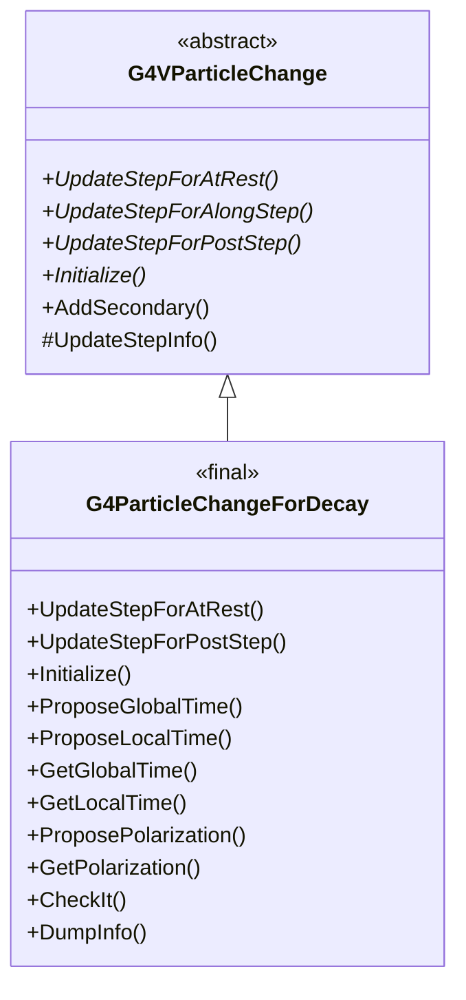
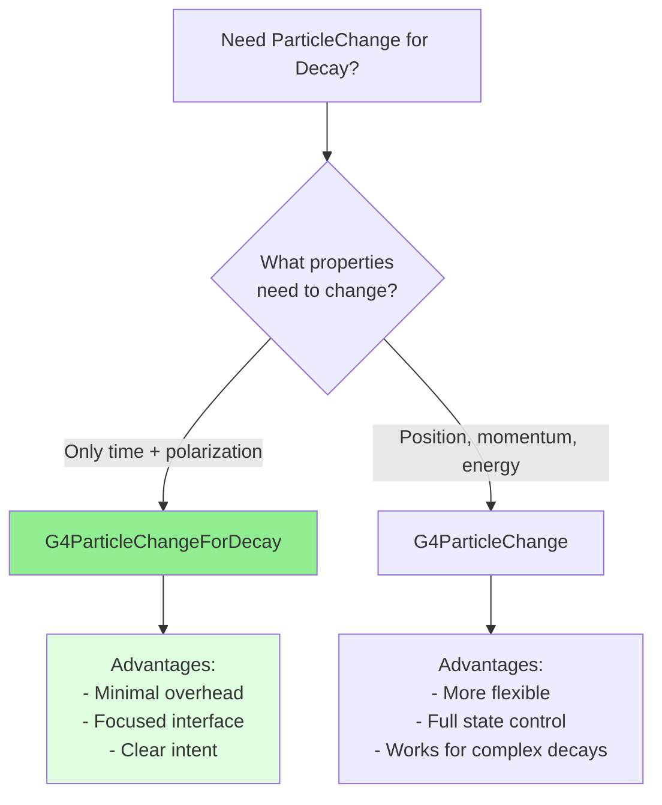

# G4ParticleChangeForDecay

**File**: `source/track/include/G4ParticleChangeForDecay.hh`

## Overview

G4ParticleChangeForDecay is a specialized concrete implementation of G4VParticleChange designed specifically for particle decay processes. It provides a minimal, optimized interface for decay interactions, focusing on time evolution and polarization while leveraging the base class for secondary particle management. This class is marked as `final`, meaning it cannot be further derived.

## Class Description

G4ParticleChangeForDecay is optimized for decay processes (both at-rest and post-step decay in flight). Unlike the general G4ParticleChange class, it:

- **Focuses on Essential Properties**: Only manages time and polarization changes
- **No AlongStep Support**: Only implements UpdateStepForAtRest() and UpdateStepForPostStep()
- **Minimal Overhead**: Reduced memory footprint compared to full G4ParticleChange
- **Decay-Specific**: Designed for particle decay where parent is typically stopped or transformed

**Typical Use Cases**:
- Radioactive decay at rest
- Particle decay in flight (e.g., muon → electron + neutrinos)
- Nuclear de-excitation
- Unstable particle transformations

## Inheritance Hierarchy



**Key Points**:
- Inherits from [G4VParticleChange](./g4vparticlechange.md)
- Marked as `final` - cannot be further derived
- Does not implement UpdateStepForAlongStep() (decay is not a continuous process)

## Constructor & Destructor

### Constructor

```cpp
G4ParticleChangeForDecay();
```

Creates a G4ParticleChangeForDecay object with default initialization.

**Location**: `G4ParticleChangeForDecay.hh:51`

**Initialization**:
- Inherits base class initialization (status, secondaries, energy deposit, etc.)
- Time variables initialized to zero
- Polarization vector initialized to zero

### Destructor

```cpp
~G4ParticleChangeForDecay() override = default;
```

Default virtual destructor.

**Location**: `G4ParticleChangeForDecay.hh:53`

### Deleted Copy Operations

```cpp
G4ParticleChangeForDecay(const G4ParticleChangeForDecay& right) = delete;
G4ParticleChangeForDecay& operator=(const G4ParticleChangeForDecay& right) = delete;
```

Copy construction and assignment are explicitly disabled.

**Location**: `G4ParticleChangeForDecay.hh:55-56`

## Update Step Methods

### UpdateStepForAtRest

```cpp
G4Step* UpdateStepForAtRest(G4Step* Step) final;
```

Updates the G4Step for at-rest decay processes.

**Parameters**:
- `Step`: Pointer to the current step

**Returns**: Pointer to the updated G4Step

**Location**: `G4ParticleChangeForDecay.hh:63`

**Usage**: Called by stepping manager after AtRestDoIt() for processes like radioactive decay at rest.

**Note**: Marked as `final` - cannot be overridden in derived classes (though this class itself is final).

### UpdateStepForPostStep

```cpp
G4Step* UpdateStepForPostStep(G4Step* Step) final;
```

Updates the G4Step for post-step decay processes.

**Parameters**:
- `Step`: Pointer to the current step

**Returns**: Pointer to the updated G4Step

**Location**: `G4ParticleChangeForDecay.hh:64`

**Usage**: Called by stepping manager after PostStepDoIt() for processes like decay in flight.

**Note**: Marked as `final` - cannot be overridden.

### UpdateStepForAlongStep

**Not Implemented**: Decay processes do not use AlongStep. The base class version is not overridden, and calling it would result in an error.

**Rationale**: Decay is a discrete process, not a continuous one. It occurs at specific points in space-time, not continuously along a step.

## Initialization Method

### Initialize

```cpp
void Initialize(const G4Track& track) final;
```

Initializes all properties from the current track state.

**Parameters**:
- `track`: Reference to the current track

**Location**: `G4ParticleChangeForDecay.hh:66`

**Usage**: Must be called at the beginning of every DoIt() method. Initializes time and polarization from the track's current state.

**Marked as**: `final` - cannot be overridden.

## Time Methods

### ProposeGlobalTime

```cpp
void ProposeGlobalTime(G4double t);
```

Sets the final global time.

**Parameters**:
- `t`: Final global time value

**Location**: `G4ParticleChangeForDecay.hh:69`

**Implementation**: `G4ParticleChangeForDecay.hh:110-113` (inline)

**Formula**:
```cpp
theTimeChange = (t - theGlobalTime0) + theLocalTime0;
```

**Warning**: **DO NOT** invoke both ProposeGlobalTime() and ProposeLocalTime() in the same step. Each method affects both local and global time.

**Usage Example**:
```cpp
// Decay happens at current time (typical case)
aParticleChange.ProposeGlobalTime(track.GetGlobalTime());

// Delayed decay (e.g., after lifetime)
G4double decayTime = track.GetGlobalTime() + lifetime;
aParticleChange.ProposeGlobalTime(decayTime);
```

### GetGlobalTime

```cpp
G4double GetGlobalTime(G4double timeDelay = 0.0) const;
```

Converts time delay to global time or returns final global time.

**Parameters**:
- `timeDelay`: Additional time delay to add (default: 0.0)

**Returns**: Final global time plus time delay

**Location**: `G4ParticleChangeForDecay.hh:75`

**Implementation**: `G4ParticleChangeForDecay.hh:116-120` (inline)

**Formula**:
```cpp
return theGlobalTime0 + (theTimeChange - theLocalTime0) + timeDelay;
```

**Usage**:
```cpp
// Get final global time
G4double finalTime = aParticleChange.GetGlobalTime();

// Get time with additional delay
G4double delayedTime = aParticleChange.GetGlobalTime(10.0*ns);
```

### ProposeLocalTime

```cpp
void ProposeLocalTime(G4double t);
```

Sets the final local time.

**Parameters**:
- `t`: Final local time value

**Location**: `G4ParticleChangeForDecay.hh:70`

**Implementation**: `G4ParticleChangeForDecay.hh:123-126` (inline)

**Formula**:
```cpp
theTimeChange = t;
```

**Warning**: **DO NOT** invoke both ProposeGlobalTime() and ProposeLocalTime() in the same step.

### GetLocalTime

```cpp
G4double GetLocalTime(G4double timeDelay = 0.0) const;
```

Converts time delay to local time or returns final local time.

**Parameters**:
- `timeDelay`: Additional time delay to add (default: 0.0)

**Returns**: Final local time plus time delay

**Location**: `G4ParticleChangeForDecay.hh:76`

**Implementation**: `G4ParticleChangeForDecay.hh:129-133` (inline)

**Formula**:
```cpp
return theTimeChange + timeDelay;
```

## Polarization Methods

### GetPolarization

```cpp
const G4ThreeVector* GetPolarization() const;
```

Returns the final polarization vector.

**Returns**: Pointer to the final polarization vector

**Location**: `G4ParticleChangeForDecay.hh:80`

**Implementation**: `G4ParticleChangeForDecay.hh:136-139` (inline)

**Usage**: Important for polarized beam experiments and spin-dependent decay processes.

### ProposePolarization (vector)

```cpp
void ProposePolarization(const G4ThreeVector& finalPolarization);
```

Sets the final polarization from a vector.

**Parameters**:
- `finalPolarization`: Final polarization vector

**Location**: `G4ParticleChangeForDecay.hh:82`

**Implementation**: `G4ParticleChangeForDecay.hh:142-146` (inline)

**Usage Example**:
```cpp
G4ThreeVector newPolarization(0.0, 0.0, 1.0);  // Spin up
aParticleChange.ProposePolarization(newPolarization);
```

### ProposePolarization (components)

```cpp
void ProposePolarization(G4double Px, G4double Py, G4double Pz);
```

Sets the final polarization from components.

**Parameters**:
- `Px`: X-component of polarization
- `Py`: Y-component of polarization
- `Pz`: Z-component of polarization

**Location**: `G4ParticleChangeForDecay.hh:81`

**Implementation**: `G4ParticleChangeForDecay.hh:149-156` (inline)

**Usage Example**:
```cpp
aParticleChange.ProposePolarization(0.0, 0.707, 0.707);
```

## Debug and Validation Methods

### DumpInfo

```cpp
void DumpInfo() const final;
```

Prints detailed information about the particle change state.

**Location**: `G4ParticleChangeForDecay.hh:87`

**Output Includes**:
- Track status
- Time information (global, local)
- Polarization
- Number of secondaries
- Local energy deposit

**Marked as**: `final` - cannot be overridden.

### CheckIt

```cpp
G4bool CheckIt(const G4Track& track) final;
```

Performs validation checks on the particle change.

**Parameters**:
- `track`: Reference to the current track

**Returns**: True if validation passes, false otherwise

**Location**: `G4ParticleChangeForDecay.hh:89`

**Validation Checks**:
- Energy-momentum conservation
- Secondary particle properties
- Time consistency
- Physical validity of final state

**Marked as**: `final` - cannot be overridden.

**Usage**: Automatically called when debug flag is set. Can also be called manually for validation.

## Private Data Members

### theGlobalTime0

```cpp
G4double theGlobalTime0 = 0.0;
```

The global time at initialization (from track).

**Location**: `G4ParticleChangeForDecay.hh:93`

### theLocalTime0

```cpp
G4double theLocalTime0 = 0.0;
```

The local time at initialization (from track).

**Location**: `G4ParticleChangeForDecay.hh:95`

### theTimeChange

```cpp
G4double theTimeChange = 0.0;
```

The change in local time of the particle.

**Location**: `G4ParticleChangeForDecay.hh:98`

**Note**: This stores the proposed local time change, used to compute both local and global time.

### thePolarizationChange

```cpp
G4ThreeVector thePolarizationChange;
```

The final polarization of the track.

**Location**: `G4ParticleChangeForDecay.hh:101`

## Usage Examples

### Simple At-Rest Decay

```cpp
// Example: Radioactive decay at rest
G4VParticleChange* MyDecayAtRest::AtRestDoIt(
    const G4Track& track, const G4Step& step)
{
    // Always initialize first
    aParticleChange.Initialize(track);

    // Parent nucleus is destroyed
    aParticleChange.ProposeTrackStatus(fStopAndKill);

    // Time stays the same (decay happens at current time)
    aParticleChange.ProposeGlobalTime(track.GetGlobalTime());

    // Compute decay products (e.g., alpha + daughter nucleus)
    std::vector<G4DynamicParticle*> products = ComputeDecayProducts();

    aParticleChange.SetNumberOfSecondaries(products.size());

    for (auto* product : products) {
        // All secondaries created at same position and time
        aParticleChange.AddSecondary(product);
    }

    // Q-value of decay (if any energy not in secondaries)
    G4double excitationEnergy = ComputeExcitationEnergy();
    aParticleChange.ProposeLocalEnergyDeposit(excitationEnergy);

    return &aParticleChange;
}
```

### Decay in Flight (PostStep)

```cpp
// Example: Muon decay in flight
G4VParticleChange* MyMuonDecay::PostStepDoIt(
    const G4Track& track, const G4Step& step)
{
    aParticleChange.Initialize(track);

    // Muon is destroyed
    aParticleChange.ProposeTrackStatus(fStopAndKill);

    // Decay happens at end of step
    G4double decayTime = track.GetGlobalTime() + step.GetDeltaTime();
    aParticleChange.ProposeGlobalTime(decayTime);

    // Preserve polarization for polarized muon decay
    G4ThreeVector muonPolarization = track.GetPolarization();
    aParticleChange.ProposePolarization(muonPolarization);

    // Muon → e + νe + νμ
    // Create decay products with correct kinematics
    G4DynamicParticle* electron = CreateElectron();
    G4DynamicParticle* nuE = CreateElectronNeutrino();
    G4DynamicParticle* nuMu = CreateMuonNeutrino();

    aParticleChange.SetNumberOfSecondaries(3);
    aParticleChange.AddSecondary(electron);
    aParticleChange.AddSecondary(nuE);
    aParticleChange.AddSecondary(nuMu);

    return &aParticleChange;
}
```

### Polarized Decay

```cpp
// Example: Decay with polarization transfer
G4VParticleChange* MyPolarizedDecay::AtRestDoIt(
    const G4Track& track, const G4Step& step)
{
    aParticleChange.Initialize(track);
    aParticleChange.ProposeTrackStatus(fStopAndKill);

    // Get parent polarization
    G4ThreeVector parentPol = track.GetPolarization();

    // Compute decay products with spin correlations
    DecayResult result = ComputePolarizedDecay(parentPol);

    // Set final polarization (could be different from initial)
    aParticleChange.ProposePolarization(result.finalPolarization);

    aParticleChange.SetNumberOfSecondaries(result.products.size());

    for (const auto& product : result.products) {
        // Each product may have its own polarization
        G4DynamicParticle* secondary = new G4DynamicParticle(
            product.definition, product.momentum);
        secondary->SetPolarization(product.polarization);

        aParticleChange.AddSecondary(secondary);
    }

    aParticleChange.ProposeGlobalTime(track.GetGlobalTime());

    return &aParticleChange;
}
```

### Delayed Decay

```cpp
// Example: Decay with explicit time delay
G4VParticleChange* MyDelayedDecay::PostStepDoIt(
    const G4Track& track, const G4Step& step)
{
    aParticleChange.Initialize(track);
    aParticleChange.ProposeTrackStatus(fStopAndKill);

    // Particle has a lifetime τ
    G4double lifetime = GetParticleLifetime();
    G4double randomTime = -lifetime * std::log(G4UniformRand());

    // Decay happens after random time
    G4double decayTime = track.GetGlobalTime() + randomTime;
    aParticleChange.ProposeGlobalTime(decayTime);

    // Create decay products
    std::vector<G4DynamicParticle*> products = GenerateDecayProducts();

    aParticleChange.SetNumberOfSecondaries(products.size());

    for (auto* product : products) {
        // Secondaries inherit the decay time
        aParticleChange.AddSecondary(product);
    }

    return &aParticleChange;
}
```

### Energy Conservation in Decay

```cpp
// Example: Ensuring energy conservation in decay
G4VParticleChange* MyDecay::AtRestDoIt(
    const G4Track& track, const G4Step& step)
{
    aParticleChange.Initialize(track);
    aParticleChange.ProposeTrackStatus(fStopAndKill);

    // Initial energy (rest mass + kinetic)
    G4double parentMass = track.GetDynamicParticle()->GetMass();
    G4double parentKE = track.GetKineticEnergy();
    G4double totalInitialEnergy = parentMass + parentKE;

    // Compute decay kinematics
    DecayKinematics decay = ComputeDecay(totalInitialEnergy);

    // Sum of product energies
    G4double totalFinalEnergy = 0.0;
    for (const auto& product : decay.products) {
        totalFinalEnergy += product.GetTotalEnergy();
    }

    // Energy conservation: any missing energy is Q-value or binding energy
    G4double localDeposit = totalInitialEnergy - totalFinalEnergy;

    // Should be small or zero (within numerical precision)
    if (std::abs(localDeposit) > 1.0*eV) {
        aParticleChange.ProposeLocalEnergyDeposit(localDeposit);
    }

    // Add secondaries
    aParticleChange.SetNumberOfSecondaries(decay.products.size());
    for (auto* product : decay.products) {
        aParticleChange.AddSecondary(product);
    }

    aParticleChange.ProposeGlobalTime(track.GetGlobalTime());

    return &aParticleChange;
}
```

## Comparison with Other ParticleChange Classes



**When to Use G4ParticleChangeForDecay**:
- Standard particle decay processes
- Radioactive decay
- Processes where only time and polarization matter
- Want minimal memory footprint

**When to Use G4ParticleChange Instead**:
- Need to modify position or momentum
- Complex decay with special kinematics requirements
- Need full control over all particle properties

## Related Classes

### Base Class
- [G4VParticleChange](./g4vparticlechange.md) - Abstract base class providing core infrastructure

### Alternative Concrete Classes
- [G4ParticleChange](./g4particlechange.md) - General-purpose, full-featured particle change
- [G4ParticleChangeForGamma](./g4particlechangeforgamma.md) - Optimized for gamma/EM processes
- [G4ParticleChangeForLoss](./g4particlechangeforloss.md) - For continuous energy loss
- [G4ParticleChangeForMSC](./g4particlechangeformsc.md) - For multiple scattering
- [G4ParticleChangeForTransport](./g4particlechangefortransport.md) - For transportation

### Tracking Classes
- [G4Track](./g4track.md) - Particle track representation
- [G4Step](./g4step.md) - Step information
- [G4DynamicParticle](./g4dynamicparticle.md) - Dynamic particle properties

### Decay Process Classes
- G4Decay - Base class for decay processes
- G4DecayWithSpin - Decay with spin tracking
- G4RadioactiveDecay - Radioactive decay process
- G4UnknownDecay - Generic decay process

## Thread Safety

G4ParticleChangeForDecay objects are **not thread-safe** and must **not be shared** between threads.

**Thread-Safe Pattern**:
```cpp
class MyDecayProcess : public G4VRestDiscreteProcess
{
public:
    MyDecayProcess() : G4VRestDiscreteProcess("MyDecay")
    {
        // Each thread creates its own instance
        fParticleChange = new G4ParticleChangeForDecay();
    }

    ~MyDecayProcess()
    {
        delete fParticleChange;
    }

private:
    G4ParticleChangeForDecay* fParticleChange;  // Thread-local
};
```

**Key Points**:
- Each worker thread has its own process instance
- Each process instance has its own G4ParticleChangeForDecay object
- No synchronization needed - objects are thread-local

## Implementation Notes

### Time Handling

The class maintains three time-related members:
- `theGlobalTime0`: Snapshot of global time at Initialize()
- `theLocalTime0`: Snapshot of local time at Initialize()
- `theTimeChange`: Proposed change in local time

**ProposeGlobalTime()** sets theTimeChange such that:
```cpp
globalTime = theGlobalTime0 + (theTimeChange - theLocalTime0)
```

**ProposeLocalTime()** directly sets:
```cpp
localTime = theTimeChange
```

### Polarization

Polarization is stored as a 3-vector representing the spin direction. For decay processes:
- Can track parent polarization
- Transfer to daughter particles
- Important for spin-dependent decay angular distributions

### Why Final?

The class is marked `final` to:
1. Enable compiler optimizations (devirtualization)
2. Indicate this is a complete, specialized implementation
3. Prevent fragmentation of the decay interface
4. Signal that further specialization should extend G4VParticleChange directly

## Performance Considerations

1. **Memory Footprint**: Much smaller than G4ParticleChange (only time + polarization vs full state)
2. **Inline Methods**: All getters/setters are inline for zero-overhead access
3. **Focused Interface**: Only implements what decay processes need
4. **No Virtual Call Overhead**: Final methods enable devirtualization

## Common Pitfalls

### 1. Using Both Time Methods

```cpp
// WRONG - conflict between time proposals
aParticleChange.ProposeGlobalTime(t1);
aParticleChange.ProposeLocalTime(t2);  // Overwrites previous!

// CORRECT - use only one
aParticleChange.ProposeGlobalTime(t1);
```

### 2. Forgetting to Kill Parent

```cpp
// WRONG - parent continues tracking after decay
aParticleChange.Initialize(track);
aParticleChange.SetNumberOfSecondaries(2);
// ... add secondaries ...
// Missing: ProposeTrackStatus(fStopAndKill)

// CORRECT
aParticleChange.Initialize(track);
aParticleChange.ProposeTrackStatus(fStopAndKill);  // Parent decayed!
aParticleChange.SetNumberOfSecondaries(2);
```

### 3. Trying to Use for AlongStep

```cpp
// WRONG - this class doesn't support AlongStep
G4VParticleChange* MyDecay::AlongStepDoIt(...)
{
    return &fParticleChangeForDecay;  // No UpdateStepForAlongStep!
}

// CORRECT - decay is discrete, use PostStep or AtRest
G4VParticleChange* MyDecay::PostStepDoIt(...)
{
    return &fParticleChangeForDecay;
}
```

## Validation and Debugging

### Enable Debug Mode

```cpp
// In process constructor
fParticleChangeForDecay->SetDebugFlag();
fParticleChangeForDecay->SetVerboseLevel(2);
```

### Validation Example

```cpp
// After setting up decay
if (!fParticleChangeForDecay->CheckIt(track)) {
    G4cerr << "Decay validation failed!" << G4endl;
    fParticleChangeForDecay->DumpInfo();
}
```

### Debug Checks

When debug mode is active:
- Energy conservation verified
- Secondary particles validated
- Time consistency checked
- Proper parent track status verified

## Version History

- **March 23, 1998**: Original implementation by Hisaya Kurashige
- Subsequent updates:
  - Added inline implementations for performance
  - Enhanced time handling
  - Marked as final for optimization

## See Also

### Documentation
- [Track Module Overview](../track-overview.md)
- [Decay Process Guide](../../processes/decay-guide.md)
- [Time and Proper Time in Geant4](../time-handling.md)

### Source Files
- Header: `source/track/include/G4ParticleChangeForDecay.hh`
- Implementation: `source/track/src/G4ParticleChangeForDecay.cc`
