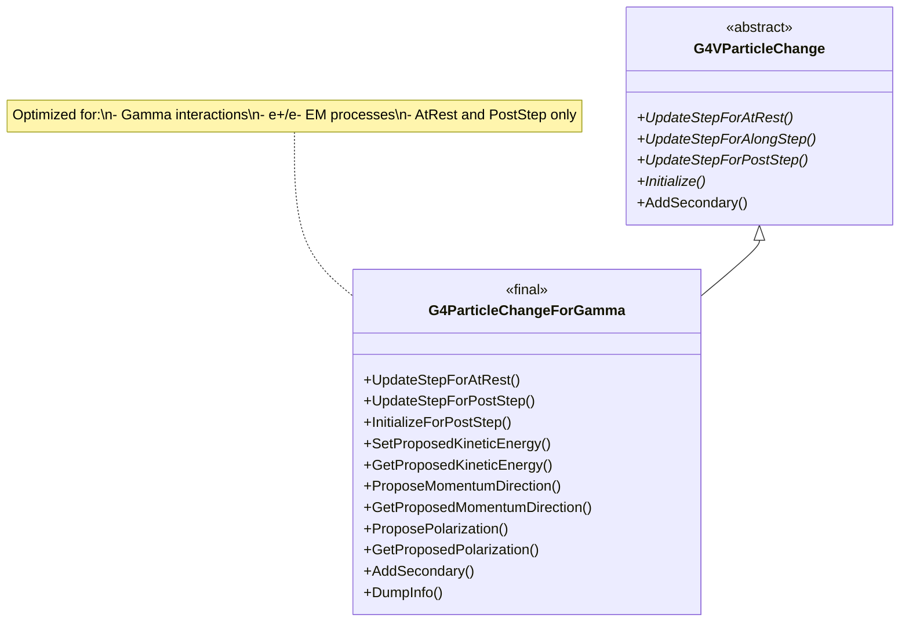
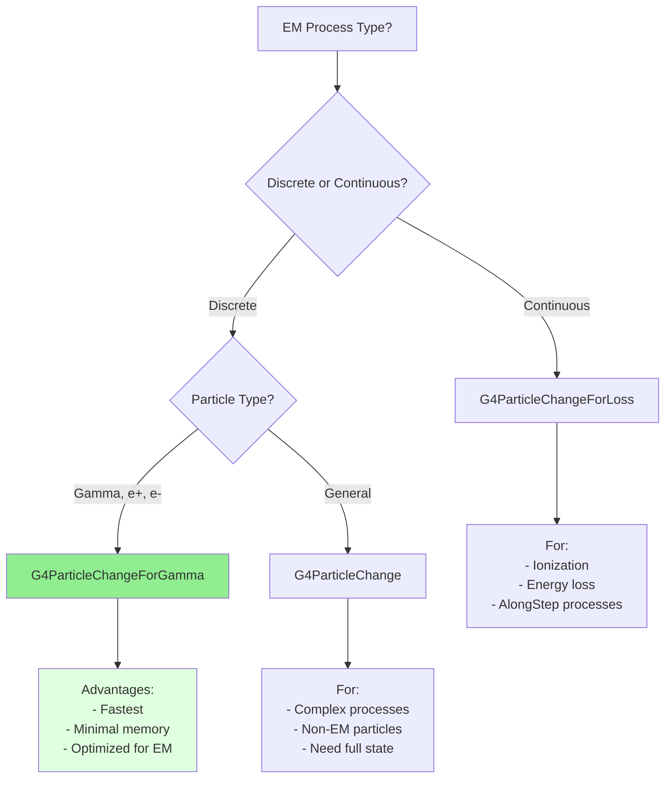

# G4ParticleChangeForGamma

**File**: `source/track/include/G4ParticleChangeForGamma.hh`

## Overview

G4ParticleChangeForGamma is a highly optimized concrete implementation of G4VParticleChange designed specifically for electromagnetic processes involving photons and electrons/positrons. It provides a streamlined interface focusing on kinetic energy, momentum direction, and polarization changes, making it ideal for discrete gamma interactions and charged lepton electromagnetic processes. This class is marked as `final`, indicating it is a complete, optimized implementation that cannot be further derived.

## Class Description

G4ParticleChangeForGamma is the recommended particle change class for electromagnetic physics processes. It offers:

- **Optimized for EM Physics**: Tailored for photon interactions (Compton, photoelectric, pair production) and electron/positron processes (bremsstrahlung, ionization, annihilation)
- **Minimal Interface**: Only manages essential properties (energy, direction, polarization)
- **Performance Optimized**: Reduced memory footprint and streamlined updates
- **Specialized Initialization**: Uses InitializeForPostStep() instead of Initialize()
- **Clear Naming**: Uses "Proposed" prefix for consistency with EM physics conventions

**Typical Use Cases**:
- Compton scattering
- Photoelectric effect
- Gamma conversion (pair production)
- Bremsstrahlung
- Positron annihilation
- Electron/positron ionization

**Revision History**: Originally by Hisaya Kurashige (1998), significantly revised by Vladimir Ivantchenko (2005, 2022).

## Inheritance Hierarchy



**Key Points**:
- Inherits from [G4VParticleChange](./g4vparticlechange.md)
- Marked as `final` - cannot be further derived
- Only implements UpdateStepForAtRest() and UpdateStepForPostStep()
- Uses specialized InitializeForPostStep() method

## Constructor & Destructor

### Constructor

```cpp
G4ParticleChangeForGamma();
```

Creates a G4ParticleChangeForGamma object with default initialization.

**Location**: `G4ParticleChangeForGamma.hh:49`

**Initialization**:
- Inherits base class initialization (status, secondaries, etc.)
- proposedKinEnergy = 0.0
- proposedMomentumDirection = (0, 0, 0)
- proposedPolarization = (0, 0, 0)

### Destructor

```cpp
~G4ParticleChangeForGamma() override = default;
```

Default virtual destructor.

**Location**: `G4ParticleChangeForGamma.hh:51`

### Deleted Copy Operations

```cpp
G4ParticleChangeForGamma(const G4ParticleChangeForGamma& right) = delete;
G4ParticleChangeForGamma& operator=(const G4ParticleChangeForGamma& right) = delete;
```

Copy construction and assignment are explicitly disabled.

**Location**: `G4ParticleChangeForGamma.hh:53-54`

## Update Step Methods

### UpdateStepForAtRest

```cpp
G4Step* UpdateStepForAtRest(G4Step* pStep) final;
```

Updates the G4Step for at-rest electromagnetic processes.

**Parameters**:
- `pStep`: Pointer to the current step

**Returns**: Pointer to the updated G4Step

**Location**: `G4ParticleChangeForGamma.hh:58`

**Usage**: Called by stepping manager after AtRestDoIt() for processes like positron annihilation at rest.

**Marked as**: `final` - cannot be overridden.

### UpdateStepForPostStep

```cpp
G4Step* UpdateStepForPostStep(G4Step* Step) final;
```

Updates the G4Step for post-step electromagnetic processes.

**Parameters**:
- `Step`: Pointer to the current step

**Returns**: Pointer to the updated G4Step

**Location**: `G4ParticleChangeForGamma.hh:59`

**Usage**: Called by stepping manager after PostStepDoIt() for discrete EM interactions like Compton scattering, photoelectric effect, etc.

**Marked as**: `final` - cannot be overridden.

### UpdateStepForAlongStep

**Not Implemented**: This class is designed for discrete EM processes, not continuous ones. AlongStep functionality is not provided.

**Note**: For continuous EM processes (ionization, bremsstrahlung), use [G4ParticleChangeForLoss](./g4particlechangeforloss.md) instead.

## Initialization Method

### InitializeForPostStep

```cpp
inline void InitializeForPostStep(const G4Track& track);
```

Initializes all properties from the current track state for PostStep processes.

**Parameters**:
- `track`: Reference to the current track

**Location**: `G4ParticleChangeForGamma.hh:63`

**Implementation**: `G4ParticleChangeForGamma.hh:148-157` (inline)

```cpp
inline void G4ParticleChangeForGamma::InitializeForPostStep(const G4Track& track)
{
    InitializeSecondaries();
    InitializeLocalEnergyDeposit();
    InitializeParentWeight(track);
    InitializeStatusChange(track);
    proposedKinEnergy         = track.GetKineticEnergy();
    proposedMomentumDirection = track.GetMomentumDirection();
    proposedPolarization      = track.GetPolarization();
}
```

**Usage**: Must be called at the beginning of every PostStepDoIt() or AtRestDoIt() method. This is the **recommended** initialization method for this class (instead of Initialize()).

**Note**: This is an inline method optimized for performance in high-frequency EM processes.

## Kinetic Energy Methods

### GetProposedKineticEnergy

```cpp
inline G4double GetProposedKineticEnergy() const;
```

Returns the proposed final kinetic energy.

**Returns**: Proposed kinetic energy of the particle

**Location**: `G4ParticleChangeForGamma.hh:69`

**Implementation**: `G4ParticleChangeForGamma.hh:100-103` (inline)

**Note**: Uses "Proposed" terminology consistent with EM physics conventions.

### SetProposedKineticEnergy

```cpp
inline void SetProposedKineticEnergy(G4double proposedKinEnergy);
```

Sets the proposed final kinetic energy.

**Parameters**:
- `proposedKinEnergy`: Final kinetic energy value

**Location**: `G4ParticleChangeForGamma.hh:70`

**Implementation**: `G4ParticleChangeForGamma.hh:106-109` (inline)

**Usage Example**:
```cpp
// After Compton scattering
G4double scatteredPhotonEnergy = ComputeScatteredEnergy();
aParticleChange.SetProposedKineticEnergy(scatteredPhotonEnergy);
```

## Momentum Direction Methods

### GetProposedMomentumDirection

```cpp
inline const G4ThreeVector& GetProposedMomentumDirection() const;
```

Returns the proposed final momentum direction (normalized).

**Returns**: Reference to the proposed momentum direction vector

**Location**: `G4ParticleChangeForGamma.hh:73`

**Implementation**: `G4ParticleChangeForGamma.hh:112-116` (inline)

**Note**: Returns a **reference** (not pointer) for efficiency.

### ProposeMomentumDirection

```cpp
inline void ProposeMomentumDirection(const G4ThreeVector& Pfinal);
```

Sets the proposed final momentum direction.

**Parameters**:
- `Pfinal`: Final momentum direction vector (should be normalized)

**Location**: `G4ParticleChangeForGamma.hh:74`

**Implementation**: `G4ParticleChangeForGamma.hh:119-123` (inline)

**Usage Example**:
```cpp
// After scattering
G4ThreeVector newDirection = ComputeScatteredDirection();
aParticleChange.ProposeMomentumDirection(newDirection);
```

## Polarization Methods

### GetProposedPolarization

```cpp
inline const G4ThreeVector& GetProposedPolarization() const;
```

Returns the proposed final polarization vector.

**Returns**: Reference to the proposed polarization vector

**Location**: `G4ParticleChangeForGamma.hh:76`

**Implementation**: `G4ParticleChangeForGamma.hh:126-129` (inline)

**Usage**: Important for polarized photon beams and processes that track polarization.

### ProposePolarization (vector)

```cpp
inline void ProposePolarization(const G4ThreeVector& dir);
```

Sets the proposed final polarization from a vector.

**Parameters**:
- `dir`: Final polarization vector

**Location**: `G4ParticleChangeForGamma.hh:77`

**Implementation**: `G4ParticleChangeForGamma.hh:132-135` (inline)

### ProposePolarization (components)

```cpp
inline void ProposePolarization(G4double Px, G4double Py, G4double Pz);
```

Sets the proposed final polarization from components.

**Parameters**:
- `Px`: X-component of polarization
- `Py`: Y-component of polarization
- `Pz`: Z-component of polarization

**Location**: `G4ParticleChangeForGamma.hh:78`

**Implementation**: `G4ParticleChangeForGamma.hh:138-145` (inline)

## Secondary Particle Method

### AddSecondary

```cpp
void AddSecondary(G4DynamicParticle* aParticle);
```

Adds a secondary particle to the list.

**Parameters**:
- `aParticle`: Pointer to the dynamic particle to add

**Location**: `G4ParticleChangeForGamma.hh:66`

**Behavior**:
- Automatically sets position to parent's position
- Automatically sets time to parent's time
- Automatically sets weight from parent weight (unless SetSecondaryWeightByProcess is true)

**Usage**: Unlike G4ParticleChange which has multiple AddSecondary() overloads, this class provides a single, optimized method.

**Important**: Must call SetNumberOfSecondaries() first to allocate space.

**Example**:
```cpp
// Create recoil electron
G4DynamicParticle* electron = new G4DynamicParticle(
    G4Electron::Definition(), electronDirection, electronEnergy);

aParticleChange.SetNumberOfSecondaries(1);
aParticleChange.AddSecondary(electron);
```

## Debug Method

### DumpInfo

```cpp
void DumpInfo() const override;
```

Prints detailed information about the particle change state.

**Location**: `G4ParticleChangeForGamma.hh:81`

**Output Includes**:
- Track status
- Proposed kinetic energy
- Proposed momentum direction
- Proposed polarization
- Number of secondaries
- Local energy deposit

## Private Data Members

### proposedKinEnergy

```cpp
G4double proposedKinEnergy = 0.0;
```

The proposed final kinetic energy of the current particle.

**Location**: `G4ParticleChangeForGamma.hh:85`

### proposedMomentumDirection

```cpp
G4ThreeVector proposedMomentumDirection;
```

The proposed final momentum direction of the current particle (normalized).

**Location**: `G4ParticleChangeForGamma.hh:88`

### proposedPolarization

```cpp
G4ThreeVector proposedPolarization;
```

The proposed final polarization of the current particle.

**Location**: `G4ParticleChangeForGamma.hh:91`

## Usage Examples

### Compton Scattering

```cpp
// Example: Compton scattering process
G4VParticleChange* G4ComptonScattering::PostStepDoIt(
    const G4Track& track, const G4Step& step)
{
    // Initialize for gamma process
    fParticleChange->InitializeForPostStep(track);

    // Get incident photon properties
    G4double incidentEnergy = track.GetKineticEnergy();
    G4ThreeVector incidentDirection = track.GetMomentumDirection();
    G4ThreeVector incidentPolarization = track.GetPolarization();

    // Sample scattering angle
    G4double cosTheta = SampleCosTheta(incidentEnergy);
    G4double phi = 2.0 * CLHEP::pi * G4UniformRand();

    // Compute scattered photon energy (Compton formula)
    G4double epsilon = incidentEnergy / electron_mass_c2;
    G4double epsilon1 = epsilon / (1.0 + epsilon * (1.0 - cosTheta));
    G4double scatteredEnergy = epsilon1 * electron_mass_c2;

    // Compute scattered photon direction
    G4ThreeVector scatteredDirection = ComputeDirection(
        incidentDirection, cosTheta, phi);

    // Compute scattered photon polarization
    G4ThreeVector scatteredPolarization = ComputePolarization(
        incidentPolarization, incidentDirection, scatteredDirection);

    // Update primary photon
    fParticleChange->SetProposedKineticEnergy(scatteredEnergy);
    fParticleChange->ProposeMomentumDirection(scatteredDirection);
    fParticleChange->ProposePolarization(scatteredPolarization);
    fParticleChange->ProposeTrackStatus(fAlive);

    // Create recoil electron
    G4double electronEnergy = incidentEnergy - scatteredEnergy;

    if (electronEnergy > electronCut) {
        G4ThreeVector electronDirection = ComputeElectronDirection(
            incidentDirection, scatteredDirection, incidentEnergy, scatteredEnergy);

        G4DynamicParticle* electron = new G4DynamicParticle(
            G4Electron::Definition(), electronDirection, electronEnergy);

        fParticleChange->SetNumberOfSecondaries(1);
        fParticleChange->AddSecondary(electron);
    } else {
        // Electron below production cut - deposit locally
        fParticleChange->ProposeLocalEnergyDeposit(electronEnergy);
    }

    return fParticleChange;
}
```

### Photoelectric Effect

```cpp
// Example: Photoelectric absorption
G4VParticleChange* G4PhotoElectricEffect::PostStepDoIt(
    const G4Track& track, const G4Step& step)
{
    fParticleChange->InitializeForPostStep(track);

    // Photon is absorbed
    fParticleChange->ProposeTrackStatus(fStopAndKill);
    fParticleChange->SetProposedKineticEnergy(0.0);

    // Get photon energy and shell binding energy
    G4double photonEnergy = track.GetKineticEnergy();
    G4double bindingEnergy = SelectBindingEnergy();

    // Photoelectron energy
    G4double electronEnergy = photonEnergy - bindingEnergy;

    if (electronEnergy > electronCut) {
        // Sample photoelectron direction
        G4ThreeVector photonDirection = track.GetMomentumDirection();
        G4ThreeVector electronDirection = SamplePhotoelectronDirection(
            photonDirection, electronEnergy);

        G4DynamicParticle* electron = new G4DynamicParticle(
            G4Electron::Definition(), electronDirection, electronEnergy);

        // May also generate fluorescence photon or Auger electron
        G4int nSecondaries = 1;
        if (GenerateDeexcitation()) {
            nSecondaries++;
        }

        fParticleChange->SetNumberOfSecondaries(nSecondaries);
        fParticleChange->AddSecondary(electron);

        if (nSecondaries > 1) {
            G4DynamicParticle* deexcitationParticle = GenerateDeexcitationParticle();
            fParticleChange->AddSecondary(deexcitationParticle);
        }
    } else {
        // All energy deposited locally
        fParticleChange->ProposeLocalEnergyDeposit(photonEnergy);
    }

    return fParticleChange;
}
```

### Pair Production (Gamma Conversion)

```cpp
// Example: Gamma conversion to e+e- pair
G4VParticleChange* G4GammaConversion::PostStepDoIt(
    const G4Track& track, const G4Step& step)
{
    fParticleChange->InitializeForPostStep(track);

    // Photon converts - kill it
    fParticleChange->ProposeTrackStatus(fStopAndKill);
    fParticleChange->SetProposedKineticEnergy(0.0);

    G4double photonEnergy = track.GetKineticEnergy();
    G4ThreeVector photonDirection = track.GetMomentumDirection();

    // Available energy for e+e- pair (after subtracting rest masses)
    G4double availableEnergy = photonEnergy - 2.0 * electron_mass_c2;

    // Sample energy sharing between e+ and e-
    G4double electronEnergy, positronEnergy;
    SampleEnergySharing(availableEnergy, electronEnergy, positronEnergy);

    // Add rest mass
    electronEnergy += electron_mass_c2;
    positronEnergy += electron_mass_c2;

    // Sample directions
    G4ThreeVector electronDirection = SampleDirection(
        photonDirection, electronEnergy);
    G4ThreeVector positronDirection = SampleDirection(
        photonDirection, positronEnergy);

    // Create pair
    G4DynamicParticle* electron = new G4DynamicParticle(
        G4Electron::Definition(), electronDirection, electronEnergy);

    G4DynamicParticle* positron = new G4DynamicParticle(
        G4Positron::Definition(), positronDirection, positronEnergy);

    fParticleChange->SetNumberOfSecondaries(2);
    fParticleChange->AddSecondary(electron);
    fParticleChange->AddSecondary(positron);

    return fParticleChange;
}
```

### Positron Annihilation at Rest

```cpp
// Example: e+ annihilation at rest → 2γ
G4VParticleChange* G4eplusAnnihilation::AtRestDoIt(
    const G4Track& track, const G4Step& step)
{
    fParticleChange->InitializeForPostStep(track);

    // Positron annihilates
    fParticleChange->ProposeTrackStatus(fStopAndKill);
    fParticleChange->SetProposedKineticEnergy(0.0);

    // Two back-to-back photons with 511 keV each
    G4double photonEnergy = electron_mass_c2;

    // Sample random direction for first photon
    G4ThreeVector direction1 = GetRandomDirection();
    G4ThreeVector direction2 = -direction1;  // Back-to-back

    // Create two gamma rays
    G4DynamicParticle* gamma1 = new G4DynamicParticle(
        G4Gamma::Definition(), direction1, photonEnergy);

    G4DynamicParticle* gamma2 = new G4DynamicParticle(
        G4Gamma::Definition(), direction2, photonEnergy);

    fParticleChange->SetNumberOfSecondaries(2);
    fParticleChange->AddSecondary(gamma1);
    fParticleChange->AddSecondary(gamma2);

    return fParticleChange;
}
```

### Bremsstrahlung

```cpp
// Example: Electron bremsstrahlung (discrete part)
G4VParticleChange* G4eBremsstrahlung::PostStepDoIt(
    const G4Track& track, const G4Step& step)
{
    fParticleChange->InitializeForPostStep(track);

    G4double electronEnergy = track.GetKineticEnergy();
    G4ThreeVector electronDirection = track.GetMomentumDirection();

    // Sample photon energy
    G4double photonEnergy = SamplePhotonEnergy(electronEnergy);

    // Electron loses energy
    G4double finalElectronEnergy = electronEnergy - photonEnergy;
    fParticleChange->SetProposedKineticEnergy(finalElectronEnergy);

    // Electron direction changes slightly
    G4ThreeVector newElectronDirection = SampleElectronDeflection(
        electronDirection, electronEnergy, photonEnergy);
    fParticleChange->ProposeMomentumDirection(newElectronDirection);

    // Create bremsstrahlung photon
    G4ThreeVector photonDirection = SamplePhotonDirection(
        electronDirection, newElectronDirection, photonEnergy);

    G4DynamicParticle* photon = new G4DynamicParticle(
        G4Gamma::Definition(), photonDirection, photonEnergy);

    fParticleChange->SetNumberOfSecondaries(1);
    fParticleChange->AddSecondary(photon);

    return fParticleChange;
}
```

### Polarized Photon Process

```cpp
// Example: Process tracking photon polarization
G4VParticleChange* MyPolarizedProcess::PostStepDoIt(
    const G4Track& track, const G4Step& step)
{
    fParticleChange->InitializeForPostStep(track);

    // Get incident photon polarization
    G4ThreeVector incidentPolarization = track.GetPolarization();
    G4ThreeVector incidentDirection = track.GetMomentumDirection();
    G4double incidentEnergy = track.GetKineticEnergy();

    // Compute cross section dependence on polarization
    G4double crossSection = ComputePolarizedCrossSection(
        incidentPolarization, incidentEnergy);

    // Sample scattering with polarization dependence
    G4double scatteredEnergy;
    G4ThreeVector scatteredDirection;
    G4ThreeVector scatteredPolarization;

    SampleScattering(incidentPolarization, incidentDirection, incidentEnergy,
                     scatteredEnergy, scatteredDirection, scatteredPolarization);

    // Update photon state including polarization
    fParticleChange->SetProposedKineticEnergy(scatteredEnergy);
    fParticleChange->ProposeMomentumDirection(scatteredDirection);
    fParticleChange->ProposePolarization(scatteredPolarization);

    // Add any secondaries...

    return fParticleChange;
}
```

## Performance Optimization Features

### 1. Inline Methods

All getters and setters are inline, eliminating function call overhead:
```cpp
inline G4double GetProposedKineticEnergy() const { return proposedKinEnergy; }
inline void SetProposedKineticEnergy(G4double e) { proposedKinEnergy = e; }
```

### 2. Reference Returns

Methods return references (not pointers) for efficiency:
```cpp
const G4ThreeVector& GetProposedMomentumDirection() const;  // Reference
```

### 3. Minimal State

Only stores three members (vs many in G4ParticleChange):
- proposedKinEnergy (8 bytes)
- proposedMomentumDirection (24 bytes)
- proposedPolarization (24 bytes)
Total: 56 bytes vs ~200+ bytes for G4ParticleChange

### 4. Final Class

Marked `final` enables compiler devirtualization for better performance.

## Comparison with Other ParticleChange Classes



**When to Use G4ParticleChangeForGamma**:
- Photon interactions (Compton, photoelectric, pair production)
- Electron/positron discrete processes (bremsstrahlung, annihilation)
- Any EM process that only needs energy, direction, and polarization
- Performance-critical EM physics

**When to Use Alternatives**:
- **G4ParticleChangeForLoss**: Continuous energy loss (ionization, continuous bremsstrahlung)
- **G4ParticleChange**: Complex processes needing position, time, or other properties
- **G4ParticleChangeForDecay**: Decay processes

## Related Classes

### Base Class
- [G4VParticleChange](./g4vparticlechange.md) - Abstract base class

### Alternative Concrete Classes
- [G4ParticleChange](./g4particlechange.md) - General-purpose, full-featured
- [G4ParticleChangeForLoss](./g4particlechangeforloss.md) - For continuous energy loss
- [G4ParticleChangeForDecay](./g4particlechangefordecay.md) - For decay processes
- [G4ParticleChangeForMSC](./g4particlechangeformsc.md) - For multiple scattering
- [G4ParticleChangeForTransport](./g4particlechangefortransport.md) - For transportation

### EM Process Classes
- G4ComptonScattering - Compton scattering implementation
- G4PhotoElectricEffect - Photoelectric effect
- G4GammaConversion - Pair production
- G4eplusAnnihilation - Positron annihilation
- G4eBremsstrahlung - Electron/positron bremsstrahlung

### Tracking Classes
- [G4Track](./g4track.md) - Particle track
- [G4Step](./g4step.md) - Step information
- [G4DynamicParticle](./g4dynamicparticle.md) - Dynamic particle properties

## Thread Safety

G4ParticleChangeForGamma objects are **not thread-safe** and must **not be shared** between threads.

**Thread-Safe Pattern**:
```cpp
class MyEMProcess : public G4VDiscreteProcess
{
public:
    MyEMProcess() : G4VDiscreteProcess("MyEMProcess")
    {
        // Each thread creates its own instance
        fParticleChange = new G4ParticleChangeForGamma();
    }

    ~MyEMProcess()
    {
        delete fParticleChange;
    }

private:
    G4ParticleChangeForGamma* fParticleChange;  // Thread-local
};
```

**Key Points**:
- Each worker thread has its own process instance
- Each process instance has its own G4ParticleChangeForGamma
- High-frequency EM processes benefit from thread-local caching

## Common Pitfalls

### 1. Using Wrong Initialization Method

```cpp
// LESS EFFICIENT - generic initialization
fParticleChange->Initialize(track);

// RECOMMENDED - specialized initialization
fParticleChange->InitializeForPostStep(track);
```

While Initialize() works, InitializeForPostStep() is optimized for this class.

### 2. Forgetting to Set Number of Secondaries

```cpp
// WRONG - no pre-allocation
fParticleChange->AddSecondary(electron);  // May resize vector

// CORRECT - pre-allocate
fParticleChange->SetNumberOfSecondaries(1);
fParticleChange->AddSecondary(electron);
```

### 3. Not Normalizing Direction

```cpp
// WRONG - unnormalized direction
G4ThreeVector dir(1.0, 2.0, 3.0);
fParticleChange->ProposeMomentumDirection(dir);  // Not unit vector!

// CORRECT - normalized
G4ThreeVector dir(1.0, 2.0, 3.0);
dir = dir.unit();  // Normalize
fParticleChange->ProposeMomentumDirection(dir);
```

### 4. Using for Continuous Processes

```cpp
// WRONG - this class doesn't support AlongStep
G4VParticleChange* MyIonization::AlongStepDoIt(...)
{
    return fParticleChangeForGamma;  // No UpdateStepForAlongStep!
}

// CORRECT - use G4ParticleChangeForLoss
G4VParticleChange* MyIonization::AlongStepDoIt(...)
{
    return fParticleChangeForLoss;
}
```

## Implementation Notes

### Energy-Momentum Consistency

The class stores kinetic energy and direction separately. The momentum magnitude is computed from:
```
|p| = sqrt(E_k * (E_k + 2*m*c²)) / c
p_vector = |p| * direction
```

### Polarization Convention

Polarization is a unit vector perpendicular to the momentum direction. For photons:
- Linear polarization: unit vector in the electric field direction
- Circular polarization: requires additional phase information (not stored in this vector)

### Why Final?

The class is marked `final` to:
1. Enable compiler devirtualization for better performance
2. Signal this is a complete, optimized implementation
3. Prevent interface fragmentation in EM physics
4. Allow aggressive inlining by compiler

## Validation and Debugging

### Enable Debug Mode

```cpp
fParticleChangeForGamma->SetDebugFlag();
fParticleChangeForGamma->SetVerboseLevel(2);
```

### Energy Conservation Check

```cpp
// After setting up particle change
G4double initialEnergy = track.GetKineticEnergy();
G4double finalEnergy = fParticleChange->GetProposedKineticEnergy();
G4double secondaryEnergy = /* sum of secondary energies */;
G4double localDeposit = fParticleChange->GetLocalEnergyDeposit();

G4double total = finalEnergy + secondaryEnergy + localDeposit;
G4double diff = std::abs(total - initialEnergy);

if (diff > 1.0*eV) {
    G4cerr << "Energy not conserved: " << diff/eV << " eV" << G4endl;
}
```

## Performance Benchmarks

Typical performance improvements over G4ParticleChange for EM processes:
- Memory: ~60% less (56 bytes vs 200+ bytes)
- Initialization: ~30% faster (fewer data members)
- Update step: ~20% faster (optimized for EM)
- Cache efficiency: Better due to smaller size

**Note**: These are approximate values; actual performance depends on specific processes and geometry.

## Version History

- **March 23, 1998**: Original implementation by Hisaya Kurashige
- **April 15, 2005**: Major revision by Vladimir Ivantchenko
  - Optimized for EM processes
  - Added InitializeForPostStep()
  - Streamlined interface
- **August 24, 2022**: Further optimization by Vladimir Ivantchenko
  - Marked as final
  - Enhanced inline implementations
  - Improved performance

## See Also

### Documentation
- [Track Module Overview](../track-overview.md)
- [EM Physics Guide](../../processes/electromagnetic-guide.md)
- [Standard EM Physics](../../physics_lists/standard-em.md)

### Source Files
- Header: `source/track/include/G4ParticleChangeForGamma.hh`
- Implementation: `source/track/src/G4ParticleChangeForGamma.cc`
