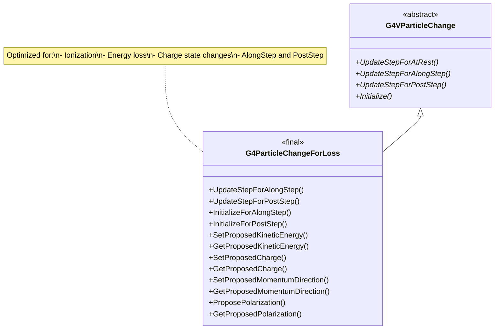
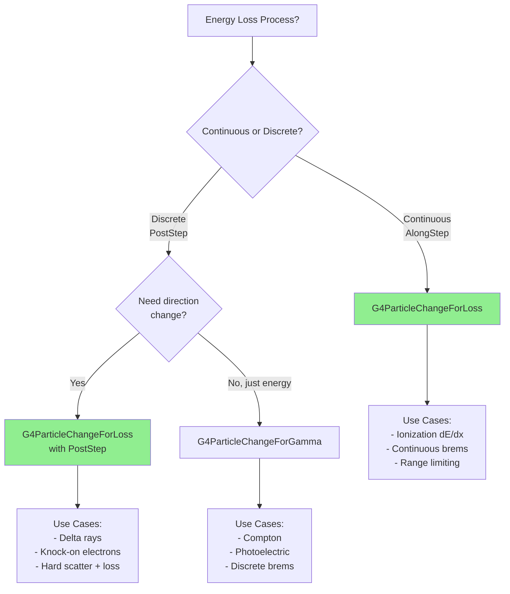

# G4ParticleChangeForLoss

**File**: `source/track/include/G4ParticleChangeForLoss.hh`

## Overview

G4ParticleChangeForLoss is a specialized concrete implementation of G4VParticleChange designed for continuous energy loss processes with ionization. It provides an optimized interface for processes that gradually lose energy along a step, such as ionization and continuous bremsstrahlung. This class is marked as `final`, indicating it is a complete, optimized implementation that cannot be further derived.

## Class Description

G4ParticleChangeForLoss is the standard particle change class for electromagnetic energy loss processes. It offers:

- **Dual Update Support**: Implements both UpdateStepForAlongStep() and UpdateStepForPostStep()
- **Energy Loss Focus**: Optimized for continuous dE/dx processes
- **Charge State Tracking**: Manages dynamic charge changes during ionization
- **Polarization Support**: Tracks particle polarization through energy loss
- **Specialized Initialization**: Provides InitializeForAlongStep() and InitializeForPostStep()
- **Performance Optimized**: Minimal overhead for high-frequency energy loss calculations

**Typical Use Cases**:
- Ionization (continuous energy loss)
- Multiple scattering with energy loss
- Bremsstrahlung (continuous component)
- Any process with gradual energy deposition along the step

**Revision History**: Originally by Hisaya Kurashige (1998), revised by Vladimir Ivantchenko (2004, 2022).

## Inheritance Hierarchy



**Key Points**:
- Inherits from [G4VParticleChange](./g4vparticlechange.md)
- Marked as `final` - cannot be further derived
- Implements both AlongStep and PostStep updates (no AtRest)
- Manages charge state changes for ions

## Constructor & Destructor

### Constructor

```cpp
G4ParticleChangeForLoss();
```

Creates a G4ParticleChangeForLoss object with default initialization.

**Location**: `G4ParticleChangeForLoss.hh:46`

**Initialization**:
- proposedKinEnergy = 0.0
- currentCharge = 0.0
- proposedMomentumDirection = (0, 0, 0)
- proposedPolarization = (0, 0, 0)

### Destructor

```cpp
~G4ParticleChangeForLoss() override = default;
```

Default virtual destructor.

**Location**: `G4ParticleChangeForLoss.hh:48`

### Deleted Copy Operations

```cpp
G4ParticleChangeForLoss(const G4ParticleChangeForLoss& right) = delete;
G4ParticleChangeForLoss& operator=(const G4ParticleChangeForLoss& right) = delete;
```

Copy construction and assignment are explicitly disabled.

**Location**: `G4ParticleChangeForLoss.hh:50-51`

## Update Step Methods

### UpdateStepForAlongStep

```cpp
G4Step* UpdateStepForAlongStep(G4Step* step) final;
```

Updates the G4Step for continuous energy loss processes.

**Parameters**:
- `step`: Pointer to the current step

**Returns**: Pointer to the updated G4Step

**Location**: `G4ParticleChangeForLoss.hh:55`

**Usage**: Called by stepping manager after AlongStepDoIt() for continuous processes like ionization. This is the primary use case for this class.

**Behavior**:
- Updates energy continuously along the step
- Does not change momentum direction (handled separately by MSC)
- Updates charge state if changed
- Accumulates energy deposit

**Marked as**: `final` - cannot be overridden.

### UpdateStepForPostStep

```cpp
G4Step* UpdateStepForPostStep(G4Step* step) final;
```

Updates the G4Step for discrete energy loss events.

**Parameters**:
- `step`: Pointer to the current step

**Returns**: Pointer to the updated G4Step

**Location**: `G4ParticleChangeForLoss.hh:56`

**Usage**: Called by stepping manager after PostStepDoIt() for discrete interactions that may occur during energy loss (e.g., delta ray production, knock-on electrons).

**Behavior**:
- Updates energy, direction, and polarization
- Can add secondary particles
- Updates charge state

**Marked as**: `final` - cannot be overridden.

### UpdateStepForAtRest

**Not Implemented**: Energy loss is not an at-rest process. The base class version is not overridden.

## Initialization Methods

### InitializeForAlongStep

```cpp
inline void InitializeForAlongStep(const G4Track& track);
```

Initializes properties for AlongStep energy loss processes.

**Parameters**:
- `track`: Reference to the current track

**Location**: `G4ParticleChangeForLoss.hh:59`

**Implementation**: `G4ParticleChangeForLoss.hh:164-172` (inline)

```cpp
inline void G4ParticleChangeForLoss::InitializeForAlongStep(const G4Track& track)
{
    InitializeSecondaries();
    InitializeLocalEnergyDeposit();
    InitializeParentWeight(track);
    InitializeStatusChange(track);
    proposedKinEnergy = track.GetKineticEnergy();
    currentCharge = track.GetDynamicParticle()->GetCharge();
}
```

**Usage**: Call at the beginning of AlongStepDoIt() for continuous energy loss.

**Note**: Does not initialize direction or polarization (not changed in pure energy loss).

### InitializeForPostStep

```cpp
inline void InitializeForPostStep(const G4Track& track);
```

Initializes properties for PostStep discrete interactions.

**Parameters**:
- `track`: Reference to the current track

**Location**: `G4ParticleChangeForLoss.hh:60`

**Implementation**: `G4ParticleChangeForLoss.hh:175-181` (inline)

```cpp
inline void G4ParticleChangeForLoss::InitializeForPostStep(const G4Track& track)
{
    InitializeForAlongStep(track);
    proposedMomentumDirection = track.GetMomentumDirection();
    proposedPolarization = track.GetPolarization();
}
```

**Usage**: Call at the beginning of PostStepDoIt() for discrete events during energy loss.

**Note**: Calls InitializeForAlongStep() and adds direction/polarization.

## Kinetic Energy Methods

### GetProposedKineticEnergy

```cpp
inline G4double GetProposedKineticEnergy() const;
```

Returns the proposed final kinetic energy.

**Returns**: Proposed kinetic energy of the particle

**Location**: `G4ParticleChangeForLoss.hh:67`

**Implementation**: `G4ParticleChangeForLoss.hh:102-105` (inline)

### SetProposedKineticEnergy

```cpp
inline void SetProposedKineticEnergy(G4double proposedKinEnergy);
```

Sets the proposed final kinetic energy.

**Parameters**:
- `proposedKinEnergy`: Final kinetic energy value

**Location**: `G4ParticleChangeForLoss.hh:68`

**Implementation**: `G4ParticleChangeForLoss.hh:108-111` (inline)

**Usage Example**:
```cpp
// Continuous energy loss
G4double initialEnergy = track.GetKineticEnergy();
G4double energyLoss = ComputeEnergyLoss(stepLength);
aParticleChange.SetProposedKineticEnergy(initialEnergy - energyLoss);
```

## Charge Methods

### GetProposedCharge

```cpp
inline G4double GetProposedCharge() const;
```

Returns the proposed dynamic charge.

**Returns**: Proposed charge of the particle

**Location**: `G4ParticleChangeForLoss.hh:63`

**Implementation**: `G4ParticleChangeForLoss.hh:113-116` (inline)

**Usage**: Important for ions that can change charge state during ionization.

### SetProposedCharge

```cpp
inline void SetProposedCharge(G4double theCharge);
```

Sets the proposed dynamic charge.

**Parameters**:
- `theCharge`: Final charge value

**Location**: `G4ParticleChangeForLoss.hh:64`

**Implementation**: `G4ParticleChangeForLoss.hh:119-122` (inline)

**Usage Example**:
```cpp
// Ion loses electron during ionization
G4double currentCharge = track.GetDynamicParticle()->GetCharge();
G4double newCharge = currentCharge + 1.0*eplus;  // One more positive
aParticleChange.SetProposedCharge(newCharge);
```

## Momentum Direction Methods

### GetProposedMomentumDirection

```cpp
inline const G4ThreeVector& GetProposedMomentumDirection() const;
```

Returns the proposed final momentum direction (normalized).

**Returns**: Reference to the proposed momentum direction vector

**Location**: `G4ParticleChangeForLoss.hh:72`

**Implementation**: `G4ParticleChangeForLoss.hh:125-129` (inline)

**Note**: Returns a reference (not pointer) for efficiency.

### SetProposedMomentumDirection

```cpp
inline void SetProposedMomentumDirection(const G4ThreeVector& dir);
```

Sets the proposed final momentum direction.

**Parameters**:
- `dir`: Final momentum direction vector (should be normalized)

**Location**: `G4ParticleChangeForLoss.hh:73`

**Implementation**: `G4ParticleChangeForLoss.hh:139-142` (inline)

### ProposeMomentumDirection

```cpp
inline void ProposeMomentumDirection(const G4ThreeVector& Pfinal);
```

Sets the proposed final momentum direction (alternative method name).

**Parameters**:
- `Pfinal`: Final momentum direction vector (should be normalized)

**Location**: `G4ParticleChangeForLoss.hh:74`

**Implementation**: `G4ParticleChangeForLoss.hh:132-135` (inline)

**Note**: Identical to SetProposedMomentumDirection(). Provided for API consistency.

## Polarization Methods

### GetProposedPolarization

```cpp
inline const G4ThreeVector& GetProposedPolarization() const;
```

Returns the proposed final polarization vector.

**Returns**: Reference to the proposed polarization vector

**Location**: `G4ParticleChangeForLoss.hh:76`

**Implementation**: `G4ParticleChangeForLoss.hh:145-148` (inline)

### ProposePolarization (vector)

```cpp
inline void ProposePolarization(const G4ThreeVector& dir);
```

Sets the proposed final polarization from a vector.

**Parameters**:
- `dir`: Final polarization vector

**Location**: `G4ParticleChangeForLoss.hh:77`

**Implementation**: `G4ParticleChangeForLoss.hh:151-154` (inline)

### ProposePolarization (components)

```cpp
inline void ProposePolarization(G4double Px, G4double Py, G4double Pz);
```

Sets the proposed final polarization from components.

**Parameters**:
- `Px`: X-component of polarization
- `Py`: Y-component of polarization
- `Pz`: Z-component of polarization

**Location**: `G4ParticleChangeForLoss.hh:78`

**Implementation**: `G4ParticleChangeForLoss.hh:156-161` (inline)

**Note**: Uses set() instead of individual setX/Y/Z for efficiency.

## Debug Method

### DumpInfo

```cpp
void DumpInfo() const final;
```

Prints detailed information about the particle change state.

**Location**: `G4ParticleChangeForLoss.hh:80`

**Output Includes**:
- Track status
- Proposed kinetic energy
- Proposed charge
- Proposed momentum direction
- Proposed polarization
- Number of secondaries
- Local energy deposit

**Marked as**: `final` - cannot be overridden.

## Private Data Members

### proposedKinEnergy

```cpp
G4double proposedKinEnergy = 0.0;
```

The proposed final kinetic energy of the current particle.

**Location**: `G4ParticleChangeForLoss.hh:84`

### currentCharge

```cpp
G4double currentCharge = 0.0;
```

The proposed final charge of the current particle.

**Location**: `G4ParticleChangeForLoss.hh:87`

**Note**: Called "current" but stores the proposed final charge.

### proposedMomentumDirection

```cpp
G4ThreeVector proposedMomentumDirection;
```

The proposed final momentum direction of the current particle (normalized).

**Location**: `G4ParticleChangeForLoss.hh:90`

### proposedPolarization

```cpp
G4ThreeVector proposedPolarization;
```

The proposed final polarization of the current particle.

**Location**: `G4ParticleChangeForLoss.hh:93`

## Usage Examples

### Continuous Ionization (AlongStep)

```cpp
// Example: Ionization energy loss along step
G4VParticleChange* G4Ionization::AlongStepDoIt(
    const G4Track& track, const G4Step& step)
{
    fParticleChangeForLoss->InitializeForAlongStep(track);

    G4double initialEnergy = track.GetKineticEnergy();
    G4double stepLength = step.GetStepLength();

    // Compute continuous energy loss (dE/dx * step)
    G4double dEdx = ComputeDEDX(initialEnergy);
    G4double energyLoss = dEdx * stepLength;

    // Energy lost but below delta-ray threshold → local deposit
    G4double continuousLoss = energyLoss;

    // Propose final energy
    G4double finalEnergy = initialEnergy - continuousLoss;
    if (finalEnergy < 0.0) finalEnergy = 0.0;

    fParticleChangeForLoss->SetProposedKineticEnergy(finalEnergy);
    fParticleChangeForLoss->ProposeLocalEnergyDeposit(continuousLoss);

    // Particle continues if energy > 0
    if (finalEnergy > 0.0) {
        fParticleChangeForLoss->ProposeTrackStatus(fAlive);
    } else {
        fParticleChangeForLoss->ProposeTrackStatus(fStopButAlive);
    }

    return fParticleChangeForLoss;
}
```

### Delta Ray Production (PostStep)

```cpp
// Example: Discrete delta ray (knock-on electron) production
G4VParticleChange* G4Ionization::PostStepDoIt(
    const G4Track& track, const G4Step& step)
{
    fParticleChangeForLoss->InitializeForPostStep(track);

    G4double initialEnergy = track.GetKineticEnergy();
    G4ThreeVector initialDirection = track.GetMomentumDirection();

    // Sample delta ray energy above production threshold
    G4double deltaRayEnergy = SampleDeltaRayEnergy(initialEnergy);

    // Primary particle loses energy and changes direction slightly
    G4double finalEnergy = initialEnergy - deltaRayEnergy;
    G4ThreeVector finalDirection = SamplePrimaryDeflection(
        initialDirection, initialEnergy, deltaRayEnergy);

    fParticleChangeForLoss->SetProposedKineticEnergy(finalEnergy);
    fParticleChangeForLoss->SetProposedMomentumDirection(finalDirection);

    // Create delta ray
    G4ThreeVector deltaDirection = SampleDeltaDirection(
        initialDirection, finalDirection, deltaRayEnergy);

    G4DynamicParticle* deltaRay = new G4DynamicParticle(
        G4Electron::Definition(), deltaDirection, deltaRayEnergy);

    fParticleChangeForLoss->SetNumberOfSecondaries(1);
    fParticleChangeForLoss->AddSecondary(deltaRay);

    return fParticleChangeForLoss;
}
```

### Ion Charge State Change

```cpp
// Example: Heavy ion losing electron during ionization
G4VParticleChange* G4IonIonization::AlongStepDoIt(
    const G4Track& track, const G4Step& step)
{
    fParticleChangeForLoss->InitializeForAlongStep(track);

    // Ion properties
    G4double initialEnergy = track.GetKineticEnergy();
    G4double currentCharge = track.GetDynamicParticle()->GetCharge();
    G4int Z = track.GetParticleDefinition()->GetAtomicNumber();

    // Compute energy loss
    G4double stepLength = step.GetStepLength();
    G4double dEdx = ComputeIonDEDX(initialEnergy, Z, currentCharge);
    G4double energyLoss = dEdx * stepLength;

    G4double finalEnergy = initialEnergy - energyLoss;
    fParticleChangeForLoss->SetProposedKineticEnergy(finalEnergy);

    // Check if ion charge state changes (loses electron)
    if (ShouldCaptureElectron(currentCharge, Z)) {
        // Ion captures electron → becomes more negative
        G4double newCharge = currentCharge - 1.0*eplus;
        fParticleChangeForLoss->SetProposedCharge(newCharge);
    } else if (ShouldLoseElectron(currentCharge, Z)) {
        // Ion loses electron → becomes more positive
        G4double newCharge = currentCharge + 1.0*eplus;
        fParticleChangeForLoss->SetProposedCharge(newCharge);
    }
    // else: charge state unchanged

    fParticleChangeForLoss->ProposeLocalEnergyDeposit(energyLoss);

    return fParticleChangeForLoss;
}
```

### Combined Energy Loss and Scattering

```cpp
// Example: Process combining energy loss with direction change
G4VParticleChange* G4MixedProcess::AlongStepDoIt(
    const G4Track& track, const G4Step& step)
{
    fParticleChangeForLoss->InitializeForAlongStep(track);

    G4double initialEnergy = track.GetKineticEnergy();
    G4double stepLength = step.GetStepLength();

    // Energy loss component
    G4double dEdx = ComputeDEDX(initialEnergy);
    G4double energyLoss = dEdx * stepLength;
    G4double finalEnergy = initialEnergy - energyLoss;

    // Note: For pure energy loss without direction change,
    // don't call SetProposedMomentumDirection()
    // Direction change handled by separate MSC process

    fParticleChangeForLoss->SetProposedKineticEnergy(finalEnergy);
    fParticleChangeForLoss->ProposeLocalEnergyDeposit(energyLoss);

    return fParticleChangeForLoss;
}
```

### Bremsstrahlung (Continuous Component)

```cpp
// Example: Continuous bremsstrahlung energy loss
G4VParticleChange* G4eBremsstrahlung::AlongStepDoIt(
    const G4Track& track, const G4Step& step)
{
    fParticleChangeForLoss->InitializeForAlongStep(track);

    G4double initialEnergy = track.GetKineticEnergy();
    G4double stepLength = step.GetStepLength();

    // Continuous radiative loss
    G4double dEdx_rad = ComputeRadiativeDEDX(initialEnergy);
    G4double radiativeLoss = dEdx_rad * stepLength;

    // Photons below threshold → local deposit
    G4double finalEnergy = initialEnergy - radiativeLoss;

    fParticleChangeForLoss->SetProposedKineticEnergy(finalEnergy);
    fParticleChangeForLoss->ProposeLocalEnergyDeposit(radiativeLoss);

    return fParticleChangeForLoss;
}
```

### Range Limitation (Stopping)

```cpp
// Example: Particle stopping due to energy loss
G4VParticleChange* G4Ionization::AlongStepDoIt(
    const G4Track& track, const G4Step& step)
{
    fParticleChangeForLoss->InitializeForAlongStep(track);

    G4double initialEnergy = track.GetKineticEnergy();
    G4double stepLength = step.GetStepLength();

    // Compute energy loss
    G4double dEdx = ComputeDEDX(initialEnergy);
    G4double energyLoss = dEdx * stepLength;

    G4double finalEnergy = initialEnergy - energyLoss;

    // Check if particle stops
    if (finalEnergy <= 0.0) {
        // Particle stopped - deposit all remaining energy
        finalEnergy = 0.0;
        fParticleChangeForLoss->SetProposedKineticEnergy(0.0);
        fParticleChangeForLoss->ProposeLocalEnergyDeposit(initialEnergy);
        fParticleChangeForLoss->ProposeTrackStatus(fStopButAlive);
    } else {
        // Particle continues
        fParticleChangeForLoss->SetProposedKineticEnergy(finalEnergy);
        fParticleChangeForLoss->ProposeLocalEnergyDeposit(energyLoss);
        fParticleChangeForLoss->ProposeTrackStatus(fAlive);
    }

    return fParticleChangeForLoss;
}
```

### Sub-Cutoff Secondary Production

```cpp
// Example: Handling secondaries below production threshold
G4VParticleChange* G4Ionization::PostStepDoIt(
    const G4Track& track, const G4Step& step)
{
    fParticleChangeForLoss->InitializeForPostStep(track);

    G4double initialEnergy = track.GetKineticEnergy();
    G4double secondaryEnergy = SampleSecondaryEnergy(initialEnergy);
    G4double productionCut = GetProductionCut();

    G4double finalEnergy = initialEnergy - secondaryEnergy;
    fParticleChangeForLoss->SetProposedKineticEnergy(finalEnergy);

    // Only create secondary if above threshold
    if (secondaryEnergy > productionCut) {
        G4ThreeVector direction = SampleSecondaryDirection();
        G4DynamicParticle* secondary = new G4DynamicParticle(
            G4Electron::Definition(), direction, secondaryEnergy);

        fParticleChangeForLoss->SetNumberOfSecondaries(1);
        fParticleChangeForLoss->AddSecondary(secondary);
    } else {
        // Below threshold → deposit locally
        fParticleChangeForLoss->ProposeLocalEnergyDeposit(secondaryEnergy);
    }

    return fParticleChangeForLoss;
}
```

## Process Type Decision Diagram



## Comparison with Other ParticleChange Classes

**G4ParticleChangeForLoss vs G4ParticleChangeForGamma**:

| Feature | G4ParticleChangeForLoss | G4ParticleChangeForGamma |
|---------|------------------------|--------------------------|
| AlongStep | Yes (primary use) | No |
| PostStep | Yes | Yes |
| Charge state | Yes | No |
| Direction change | Yes | Yes |
| Typical use | Ionization, energy loss | Discrete EM interactions |
| Process type | Continuous | Discrete |

**When to Use G4ParticleChangeForLoss**:
- Continuous energy loss (ionization, dE/dx)
- Processes that modify energy along the step
- Ion charge state changes
- Range-limited particles
- Combined energy loss + direction change

**When to Use Alternatives**:
- **G4ParticleChangeForGamma**: Discrete EM (Compton, photoelectric)
- **G4ParticleChangeForMSC**: Pure multiple scattering without energy loss
- **G4ParticleChange**: Complex processes needing full state

## Related Classes

### Base Class
- [G4VParticleChange](./g4vparticlechange.md) - Abstract base class

### Alternative Concrete Classes
- [G4ParticleChange](./g4particlechange.md) - General-purpose, full-featured
- [G4ParticleChangeForGamma](./g4particlechangeforgamma.md) - For discrete EM processes
- [G4ParticleChangeForDecay](./g4particlechangefordecay.md) - For decay processes
- [G4ParticleChangeForMSC](./g4particlechangeformsc.md) - For multiple scattering
- [G4ParticleChangeForTransport](./g4particlechangefortransport.md) - For transportation

### Energy Loss Process Classes
- G4VEnergyLossProcess - Base class for EM energy loss
- G4ionIonisation - Ion ionization
- G4eIonisation - Electron/positron ionization
- G4MuIonisation - Muon ionization
- G4hIonisation - Hadron ionization

### Tracking Classes
- [G4Track](./g4track.md) - Particle track
- [G4Step](./g4step.md) - Step information
- [G4DynamicParticle](./g4dynamicparticle.md) - Dynamic particle properties

## Thread Safety

G4ParticleChangeForLoss objects are **not thread-safe** and must **not be shared** between threads.

**Thread-Safe Pattern**:
```cpp
class MyEnergyLossProcess : public G4VContinuousDiscreteProcess
{
public:
    MyEnergyLossProcess() : G4VContinuousDiscreteProcess("MyELoss")
    {
        // Each thread creates its own instance
        fParticleChangeForLoss = new G4ParticleChangeForLoss();
    }

    ~MyEnergyLossProcess()
    {
        delete fParticleChangeForLoss;
    }

private:
    G4ParticleChangeForLoss* fParticleChangeForLoss;  // Thread-local
};
```

## Common Pitfalls

### 1. Modifying Direction in AlongStep Energy Loss Only

```cpp
// WRONG - pure energy loss shouldn't change direction
G4VParticleChange* AlongStepDoIt(...)
{
    fParticleChange->InitializeForAlongStep(track);
    fParticleChange->SetProposedKineticEnergy(newEnergy);
    fParticleChange->SetProposedMomentumDirection(newDir);  // Don't!
    return fParticleChange;
}

// CORRECT - direction handled by separate MSC process
G4VParticleChange* AlongStepDoIt(...)
{
    fParticleChange->InitializeForAlongStep(track);
    fParticleChange->SetProposedKineticEnergy(newEnergy);
    // MSC process will handle direction change
    return fParticleChange;
}
```

### 2. Wrong Initialization for Process Type

```cpp
// WRONG - using PostStep init for AlongStep
G4VParticleChange* AlongStepDoIt(...)
{
    fParticleChange->InitializeForPostStep(track);  // Overhead!
    ...
}

// CORRECT
G4VParticleChange* AlongStepDoIt(...)
{
    fParticleChange->InitializeForAlongStep(track);  // Minimal
    ...
}
```

### 3. Forgetting Charge State Update

```cpp
// WRONG - charge changes but not updated
// Ion loses electron but charge not changed
fParticleChange->SetProposedKineticEnergy(newEnergy);
// Missing: SetProposedCharge(newCharge)

// CORRECT
fParticleChange->SetProposedKineticEnergy(newEnergy);
G4double newCharge = currentCharge + 1.0*eplus;
fParticleChange->SetProposedCharge(newCharge);
```

### 4. Not Handling Range Limitation

```cpp
// WRONG - negative energy possible
G4double finalEnergy = initialEnergy - energyLoss;
fParticleChange->SetProposedKineticEnergy(finalEnergy);  // May be < 0!

// CORRECT - check for stopping
G4double finalEnergy = initialEnergy - energyLoss;
if (finalEnergy <= 0.0) {
    fParticleChange->SetProposedKineticEnergy(0.0);
    fParticleChange->ProposeTrackStatus(fStopButAlive);
    fParticleChange->ProposeLocalEnergyDeposit(initialEnergy);
} else {
    fParticleChange->SetProposedKineticEnergy(finalEnergy);
    fParticleChange->ProposeLocalEnergyDeposit(energyLoss);
}
```

## Implementation Notes

### AlongStep Energy Loss

In AlongStep processes:
- Energy decreases continuously along the step
- Direction typically unchanged (MSC handles direction separately)
- Local deposit represents energy lost below threshold
- Must handle range limitation (particle stopping)

### PostStep with Energy Loss

In PostStep processes:
- Discrete interaction with energy transfer
- Both energy and direction can change
- Secondaries created if above threshold
- Combined with AlongStep losses

### Charge State Management

The currentCharge member:
- Tracks dynamic charge of ions
- Updated when ion captures/loses electrons
- Important for accurate dE/dx calculation
- Affects electromagnetic interactions

## Performance Considerations

1. **Initialization**: Use InitializeForAlongStep() for pure energy loss (lighter than InitializeForPostStep())
2. **Inline Methods**: All getters/setters are inline for zero overhead
3. **Minimal State**: Only stores essential properties for energy loss
4. **Final Class**: Enables compiler devirtualization

## Validation and Debugging

### Enable Debug Mode

```cpp
fParticleChangeForLoss->SetDebugFlag();
fParticleChangeForLoss->SetVerboseLevel(2);
```

### Energy Conservation Check

```cpp
G4double initialEnergy = track.GetKineticEnergy();
G4double finalEnergy = fParticleChangeForLoss->GetProposedKineticEnergy();
G4double localDeposit = fParticleChangeForLoss->GetLocalEnergyDeposit();

// Sum secondary energies
G4double secondaryEnergy = 0.0;
for (G4int i = 0; i < fParticleChangeForLoss->GetNumberOfSecondaries(); ++i) {
    secondaryEnergy += fParticleChangeForLoss->GetSecondary(i)
                       ->GetKineticEnergy();
}

G4double total = finalEnergy + localDeposit + secondaryEnergy;
G4double diff = std::abs(total - initialEnergy);

if (diff > 1.0*eV) {
    G4cerr << "Energy not conserved: " << diff/eV << " eV" << G4endl;
}
```

## Version History

- **March 23, 1998**: Original implementation by Hisaya Kurashige
- **January 16, 2004**: Revision by Vladimir Ivantchenko
  - Optimized for energy loss processes
  - Added charge state management
  - Improved AlongStep/PostStep separation
- **August 24, 2022**: Further optimization by Vladimir Ivantchenko
  - Marked as final
  - Enhanced inline implementations

## See Also

### Documentation
- [Track Module Overview](../track-overview.md)
- [EM Physics Guide](../../processes/electromagnetic-guide.md)
- [Energy Loss Processes](../../processes/energy-loss.md)

### Source Files
- Header: `source/track/include/G4ParticleChangeForLoss.hh`
- Implementation: `source/track/src/G4ParticleChangeForLoss.cc`
