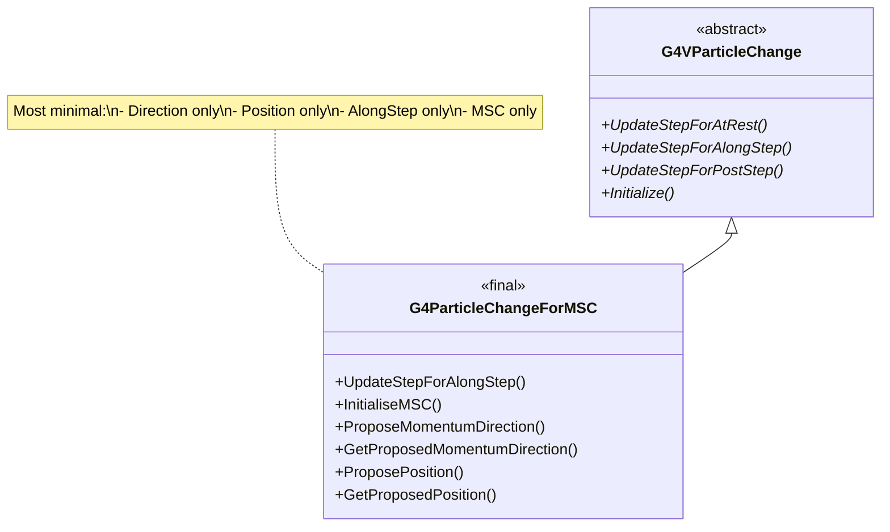
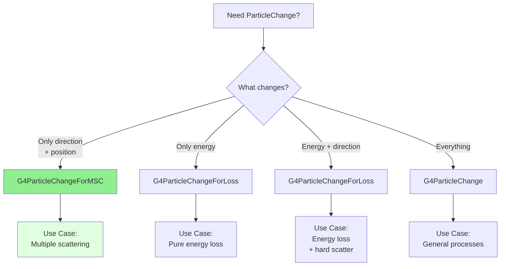

# G4ParticleChangeForMSC

**File**: `source/track/include/G4ParticleChangeForMSC.hh`

## Overview

G4ParticleChangeForMSC is a highly specialized concrete implementation of G4VParticleChange designed exclusively for multiple Coulomb scattering (MSC) processes. It provides the most minimal interface of all ParticleChange classes, handling only momentum direction and position changes - the two properties modified by multiple scattering. This class is marked as `final`, indicating it is a complete, optimized implementation specifically tailored for MSC.

## Class Description

G4ParticleChangeForMSC is the most streamlined ParticleChange class in Geant4, optimized for the specific needs of multiple scattering:

- **Minimal Interface**: Only manages momentum direction and position
- **MSC Specific**: Designed exclusively for multiple Coulomb scattering
- **AlongStep Only**: Only implements UpdateStepForAlongStep()
- **Maximum Performance**: Smallest memory footprint and fastest updates
- **Specialized Initialization**: Uses InitialiseMSC() tailored for MSC needs
- **Final Implementation**: Cannot be derived, enabling full optimization

**Purpose**: Multiple scattering changes particle direction (angular deflection) and can cause lateral displacement, but does not change energy or other properties. This class captures exactly those changes.

**Typical Use Cases**:
- Urban multiple scattering model
- Wentzel multiple scattering model
- Goudsmit-Saunderson multiple scattering
- Any MSC implementation

**Revision History**: Originally by Hisaya Kurashige (1998), revised by Vladimir Ivantchenko (2004, 2022).

## Inheritance Hierarchy



**Key Points**:
- Inherits from [G4VParticleChange](./g4vparticlechange.md)
- Marked as `final` - cannot be further derived
- Only implements UpdateStepForAlongStep() (MSC is continuous)
- Smallest interface - only 2 properties modified

## Constructor & Destructor

### Constructor

```cpp
G4ParticleChangeForMSC();
```

Creates a G4ParticleChangeForMSC object with default initialization.

**Location**: `G4ParticleChangeForMSC.hh:48`

**Initialization**:
- theMomentumDirection = (0, 0, 0)
- thePosition = (0, 0, 0)

### Destructor

```cpp
~G4ParticleChangeForMSC() override = default;
```

Default virtual destructor.

**Location**: `G4ParticleChangeForMSC.hh:50`

### Deleted Copy Operations

```cpp
G4ParticleChangeForMSC(const G4ParticleChangeForMSC& right) = delete;
G4ParticleChangeForMSC& operator=(const G4ParticleChangeForMSC& right) = delete;
```

Copy construction and assignment are explicitly disabled.

**Location**: `G4ParticleChangeForMSC.hh:52-54`

## Update Step Method

### UpdateStepForAlongStep

```cpp
G4Step* UpdateStepForAlongStep(G4Step* step) final;
```

Updates the G4Step for multiple scattering along the step.

**Parameters**:
- `step`: Pointer to the current step

**Returns**: Pointer to the updated G4Step

**Location**: `G4ParticleChangeForMSC.hh:57`

**Behavior**:
- Updates momentum direction (angular deflection from MSC)
- Updates position (lateral displacement from MSC)
- Does **not** change energy (MSC is elastic scattering)
- Does **not** change polarization
- Does **not** add secondaries

**Usage**: Called by stepping manager after AlongStepDoIt() of MSC process.

**Marked as**: `final` - cannot be overridden.

### UpdateStepForPostStep and UpdateStepForAtRest

**Not Implemented**: Multiple scattering is a continuous AlongStep process, not discrete. These methods are not overridden.

## Initialization Method

### InitialiseMSC

```cpp
inline void InitialiseMSC(const G4Track& track, const G4Step& step);
```

Initializes properties for multiple scattering from track and step.

**Parameters**:
- `track`: Reference to the current track
- `step`: Reference to the current step

**Location**: `G4ParticleChangeForMSC.hh:60`

**Implementation**: `G4ParticleChangeForMSC.hh:100-108` (inline)

```cpp
inline void G4ParticleChangeForMSC::InitialiseMSC(const G4Track& track,
                                                   const G4Step& step)
{
    theStatusChange = track.GetTrackStatus();
    auto poststep = step.GetPostStepPoint();
    thePosition = poststep->GetPosition();
    theMomentumDirection = poststep->GetMomentumDirection();
    theCurrentTrack = &track;
}
```

**Usage**: Must be called at the beginning of AlongStepDoIt() in MSC processes.

**Note**:
- Takes both track and step (unusual - most take only track)
- Initializes from PostStepPoint (already contains accumulated changes)
- Minimal initialization - only status, position, direction
- Does not call base class initialization methods

## Momentum Direction Methods

### ProposeMomentumDirection

```cpp
inline void ProposeMomentumDirection(const G4ThreeVector& P);
```

Sets the proposed final momentum direction after scattering.

**Parameters**:
- `P`: Final momentum direction vector (should be normalized)

**Location**: `G4ParticleChangeForMSC.hh:62`

**Implementation**: `G4ParticleChangeForMSC.hh:78-82` (inline)

**Usage Example**:
```cpp
// After sampling MSC deflection
G4ThreeVector deflectedDirection = SampleMSCDeflection(originalDirection);
aParticleChange.ProposeMomentumDirection(deflectedDirection);
```

### GetProposedMomentumDirection

```cpp
inline const G4ThreeVector* GetProposedMomentumDirection() const;
```

Returns the proposed final momentum direction.

**Returns**: Pointer to the momentum direction vector

**Location**: `G4ParticleChangeForMSC.hh:63`

**Implementation**: `G4ParticleChangeForMSC.hh:84-88` (inline)

**Note**: Returns a **pointer** (not reference), consistent with G4ParticleChange interface.

## Position Methods

### ProposePosition

```cpp
inline void ProposePosition(const G4ThreeVector& P);
```

Sets the proposed final position after lateral displacement.

**Parameters**:
- `P`: Final position vector (global coordinates)

**Location**: `G4ParticleChangeForMSC.hh:65`

**Implementation**: `G4ParticleChangeForMSC.hh:90-93` (inline)

**Usage**: Used when MSC causes lateral displacement perpendicular to the original direction.

**Example**:
```cpp
// After computing lateral displacement
G4ThreeVector originalPosition = track.GetPosition();
G4ThreeVector displacement = ComputeLateralDisplacement();
G4ThreeVector newPosition = originalPosition + displacement;
aParticleChange.ProposePosition(newPosition);
```

### GetProposedPosition

```cpp
inline const G4ThreeVector& GetProposedPosition() const;
```

Returns the proposed final position.

**Returns**: Reference to the position vector

**Location**: `G4ParticleChangeForMSC.hh:66`

**Implementation**: `G4ParticleChangeForMSC.hh:95-98` (inline)

**Note**: Returns a **reference** (not pointer), for efficient access.

## Private Data Members

### theMomentumDirection

```cpp
G4ThreeVector theMomentumDirection;
```

Final momentum direction after multiple scattering (normalized).

**Location**: `G4ParticleChangeForMSC.hh:70`

**Description**: The cumulative angular deflection from multiple small-angle scatters.

### thePosition

```cpp
G4ThreeVector thePosition;
```

Final position after lateral displacement from multiple scattering.

**Location**: `G4ParticleChangeForMSC.hh:74`

**Description**: The position change due to perpendicular displacement from the original straight-line path.

## Usage Examples

### Basic Multiple Scattering

```cpp
// Example: Urban multiple scattering model
G4VParticleChange* G4UrbanMscModel::AlongStepDoIt(
    const G4Track& track, const G4Step& step)
{
    // Initialize for MSC
    fParticleChange->InitialiseMSC(track, step);

    // Get initial direction and position
    G4ThreeVector initialDirection = step.GetPostStepPoint()->GetMomentumDirection();
    G4ThreeVector initialPosition = step.GetPostStepPoint()->GetPosition();

    G4double stepLength = step.GetStepLength();
    G4double kineticEnergy = track.GetKineticEnergy();

    // Sample scattering angles
    G4double theta = SampleScatteringAngle(stepLength, kineticEnergy);
    G4double phi = 2.0 * CLHEP::pi * G4UniformRand();

    // Compute new direction
    G4ThreeVector finalDirection = RotateDirection(initialDirection, theta, phi);

    // Update direction
    fParticleChange->ProposeMomentumDirection(finalDirection);

    // Usually position unchanged for simple MSC
    // (lateral displacement often negligible)

    return fParticleChange;
}
```

### MSC with Lateral Displacement

```cpp
// Example: MSC with lateral displacement
G4VParticleChange* G4WentzelVIModel::AlongStepDoIt(
    const G4Track& track, const G4Step& step)
{
    fParticleChange->InitialiseMSC(track, step);

    G4ThreeVector initialDirection = step.GetPostStepPoint()->GetMomentumDirection();
    G4ThreeVector initialPosition = step.GetPostStepPoint()->GetPosition();

    G4double stepLength = step.GetStepLength();
    G4double kineticEnergy = track.GetKineticEnergy();

    // Sample angular deflection
    G4double theta = SampleTheta(stepLength, kineticEnergy);
    G4double phi = SamplePhi();

    // Compute final direction
    G4ThreeVector finalDirection = ApplyDeflection(initialDirection, theta, phi);
    fParticleChange->ProposeMomentumDirection(finalDirection);

    // Compute lateral displacement
    // Particle scatters throughout step, causing sideways shift
    G4double displacementMagnitude = ComputeLateralDisplacement(theta, stepLength);
    G4ThreeVector displacementDirection = GetPerpendicularDirection(
        initialDirection, finalDirection);

    G4ThreeVector displacement = displacementMagnitude * displacementDirection;
    G4ThreeVector finalPosition = initialPosition + displacement;

    fParticleChange->ProposePosition(finalPosition);

    return fParticleChange;
}
```

### Single Scattering Mode

```cpp
// Example: Single scattering (for very thin targets)
G4VParticleChange* G4SingleScattering::AlongStepDoIt(
    const G4Track& track, const G4Step& step)
{
    fParticleChange->InitialiseMSC(track, step);

    G4ThreeVector initialDirection = step.GetPostStepPoint()->GetMomentumDirection();

    // Single Coulomb scattering event
    G4double theta = SampleRutherfordAngle();
    G4double phi = 2.0 * CLHEP::pi * G4UniformRand();

    // Large angle possible in single scattering
    G4ThreeVector finalDirection = RotateDirection(initialDirection, theta, phi);

    fParticleChange->ProposeMomentumDirection(finalDirection);

    // Position typically unchanged in single scatter approximation

    return fParticleChange;
}
```

### Energy-Dependent MSC

```cpp
// Example: MSC with energy-dependent scattering
G4VParticleChange* G4UrbanMscModel::AlongStepDoIt(
    const G4Track& track, const G4Step& step)
{
    fParticleChange->InitialiseMSC(track, step);

    G4double kineticEnergy = track.GetKineticEnergy();
    G4double stepLength = step.GetStepLength();

    G4ThreeVector initialDirection = step.GetPostStepPoint()->GetMomentumDirection();

    // Low energy: more scattering
    // High energy: less scattering (more forward peaked)
    G4double scatteringPower = ComputeScatteringPower(kineticEnergy);

    // Sample from appropriate angular distribution
    G4double theta;
    if (kineticEnergy < 10.0*MeV) {
        // Use detailed Highland formula
        theta = SampleHighlandDistribution(stepLength, kineticEnergy);
    } else {
        // Use asymptotic approximation
        theta = SampleAsymptoticMSC(stepLength, kineticEnergy);
    }

    G4double phi = 2.0 * CLHEP::pi * G4UniformRand();

    G4ThreeVector finalDirection = RotateDirection(initialDirection, theta, phi);
    fParticleChange->ProposeMomentumDirection(finalDirection);

    return fParticleChange;
}
```

### Material-Dependent MSC

```cpp
// Example: MSC accounting for material properties
G4VParticleChange* G4UrbanMscModel::AlongStepDoIt(
    const G4Track& track, const G4Step& step)
{
    fParticleChange->InitialiseMSC(track, step);

    // Get material properties
    const G4Material* material = track.GetMaterial();
    G4double Z = GetEffectiveZ(material);  // Effective atomic number
    G4double density = material->GetDensity();

    G4double kineticEnergy = track.GetKineticEnergy();
    G4double stepLength = step.GetStepLength();

    // Scattering increases with Z and density
    G4double theta0 = ComputeCharacteristicAngle(stepLength, kineticEnergy, Z);

    // Sample from Gaussian approximation (valid for many scatters)
    G4double theta = SampleGaussianTheta(theta0);
    G4double phi = 2.0 * CLHEP::pi * G4UniformRand();

    G4ThreeVector initialDirection = step.GetPostStepPoint()->GetMomentumDirection();
    G4ThreeVector finalDirection = RotateDirection(initialDirection, theta, phi);

    fParticleChange->ProposeMomentumDirection(finalDirection);

    return fParticleChange;
}
```

### True Path Length Correction

```cpp
// Example: MSC with path length correction
G4VParticleChange* G4UrbanMscModel::AlongStepDoIt(
    const G4Track& track, const G4Step& step)
{
    fParticleChange->InitialiseMSC(track, step);

    G4double geometricLength = step.GetStepLength();

    // MSC causes zigzag path - true path > geometric path
    G4double truePathLength = ComputeTruePathLength(geometricLength);

    // Set true path length for range calculations
    fParticleChange->ProposeTrueStepLength(truePathLength);

    // Sample scattering
    G4ThreeVector initialDirection = step.GetPostStepPoint()->GetMomentumDirection();
    G4double theta = SampleTheta(geometricLength);
    G4double phi = 2.0 * CLHEP::pi * G4UniformRand();

    G4ThreeVector finalDirection = RotateDirection(initialDirection, theta, phi);
    fParticleChange->ProposeMomentumDirection(finalDirection);

    return fParticleChange;
}
```

### Boundary Handling in MSC

```cpp
// Example: MSC near volume boundary
G4VParticleChange* G4UrbanMscModel::AlongStepDoIt(
    const G4Track& track, const G4Step& step)
{
    fParticleChange->InitialiseMSC(track, step);

    G4bool nearBoundary = step.GetPostStepPoint()->GetStepStatus() == fGeomBoundary;

    G4ThreeVector initialDirection = step.GetPostStepPoint()->GetMomentumDirection();
    G4double stepLength = step.GetStepLength();

    G4double theta;
    if (nearBoundary && stepLength < safetyDistance) {
        // Reduce scattering near boundaries to avoid geometry issues
        theta = SampleReducedScattering(stepLength);
    } else {
        // Normal scattering
        theta = SampleScatteringAngle(stepLength);
    }

    G4double phi = 2.0 * CLHEP::pi * G4UniformRand();

    G4ThreeVector finalDirection = RotateDirection(initialDirection, theta, phi);
    fParticleChange->ProposeMomentumDirection(finalDirection);

    return fParticleChange;
}
```

## Multiple Scattering Concepts

### Angular Deflection

Multiple scattering causes cumulative angular deflection:
- Many small-angle Coulomb scatters
- Gaussian distribution for large N (central limit theorem)
- Characteristic angle θ₀ ∝ 1/p (momentum dependent)
- Increases with path length: θ_rms ∝ √L

### Lateral Displacement

Particle doesn't travel in straight line:
- Zigzag path causes sideways shift
- Displacement typically ~1/3 of step length times characteristic angle
- Important for thin targets, less important for bulk materials
- Can affect geometry navigation

### True Path Length

Due to zigzag motion:
- Geometric path: straight line from start to end
- True path: actual zigzag distance traveled
- True path > Geometric path
- Important for range calculations and energy loss

## Implementation Notes

### Why So Minimal?

MSC only needs to modify two quantities:
1. **Direction**: Angular deflection from multiple scatters
2. **Position**: Lateral displacement from zigzag path

Everything else (energy, polarization, charge) is **unchanged** by MSC:
- MSC is elastic scattering (no energy loss)
- No secondaries created
- No polarization change in most models

This minimal interface is optimal for MSC's needs.

### Separation from Energy Loss

In Geant4, MSC and energy loss are **separate** processes:
- **G4ParticleChangeForMSC**: Handles direction + position changes
- **G4ParticleChangeForLoss**: Handles energy changes
- Both processes run in AlongStep
- Changes are combined by stepping manager

This separation allows:
- Modular design
- Different models for each
- Clear responsibilities

### Initialization from PostStepPoint

Unlike other ParticleChange classes that initialize from track (PreStepPoint), MSC initializes from **PostStepPoint**:

**Reason**: PostStepPoint already contains accumulated changes from other AlongStep processes (like energy loss). MSC needs to apply its changes on top of those.

## Comparison with Other ParticleChange Classes



**Size Comparison**:
- G4ParticleChangeForMSC: ~48 bytes (2 vectors)
- G4ParticleChangeForGamma: ~56 bytes (1 double + 2 vectors)
- G4ParticleChangeForLoss: ~64 bytes (2 doubles + 2 vectors)
- G4ParticleChange: ~200+ bytes (complete state)

## Related Classes

### Base Class
- [G4VParticleChange](./g4vparticlechange.md) - Abstract base class

### Alternative Concrete Classes
- [G4ParticleChange](./g4particlechange.md) - General-purpose, full state
- [G4ParticleChangeForGamma](./g4particlechangeforgamma.md) - For discrete EM
- [G4ParticleChangeForLoss](./g4particlechangeforloss.md) - For energy loss
- [G4ParticleChangeForDecay](./g4particlechangefordecay.md) - For decay
- [G4ParticleChangeForTransport](./g4particlechangefortransport.md) - For transportation

### Multiple Scattering Classes
- G4VMultipleScattering - Base class for MSC processes
- G4UrbanMscModel - Urban MSC model (most common)
- G4WentzelVIModel - Wentzel VI MSC model
- G4GoudsmitSaundersonMscModel - Goudsmit-Saunderson model
- G4eCoulombScatteringModel - Single scattering model

### Tracking Classes
- [G4Track](./g4track.md) - Particle track
- [G4Step](./g4step.md) - Step information
- [G4StepPoint](./g4steppoint.md) - Pre/post step point

## Thread Safety

G4ParticleChangeForMSC objects are **not thread-safe** and must **not be shared** between threads.

**Thread-Safe Pattern**:
```cpp
class MyMSCProcess : public G4VMultipleScattering
{
public:
    MyMSCProcess() : G4VMultipleScattering("MyMSC")
    {
        // Each thread creates its own instance
        fParticleChange = new G4ParticleChangeForMSC();
    }

    ~MyMSCProcess()
    {
        delete fParticleChange;
    }

private:
    G4ParticleChangeForMSC* fParticleChange;  // Thread-local
};
```

## Common Pitfalls

### 1. Trying to Change Energy

```cpp
// WRONG - MSC doesn't change energy
fParticleChange->ProposeEnergy(newEnergy);  // Method doesn't exist!

// CORRECT - MSC only changes direction
fParticleChange->ProposeMomentumDirection(newDirection);
```

### 2. Using Wrong Initialization

```cpp
// WRONG - using generic initialization
fParticleChange->Initialize(track);

// CORRECT - use MSC-specific initialization
fParticleChange->InitialiseMSC(track, step);
```

### 3. Forgetting to Normalize Direction

```cpp
// WRONG - unnormalized direction
G4ThreeVector dir(1.0, 2.0, 3.0);
fParticleChange->ProposeMomentumDirection(dir);  // Not unit vector!

// CORRECT
G4ThreeVector dir(1.0, 2.0, 3.0);
dir = dir.unit();
fParticleChange->ProposeMomentumDirection(dir);
```

### 4. Using for Non-MSC Processes

```cpp
// WRONG - trying to use MSC change for other processes
G4VParticleChange* MyIonization::AlongStepDoIt(...)
{
    // Need energy change, not just direction!
    return fParticleChangeForMSC;  // Won't work
}

// CORRECT - use appropriate class
G4VParticleChange* MyIonization::AlongStepDoIt(...)
{
    return fParticleChangeForLoss;
}
```

## Performance Optimizations

1. **Absolute Minimum State**: Only 2 vectors (48 bytes)
2. **Inline Methods**: Zero overhead for all operations
3. **Specialized Initialization**: Minimal setup from PostStepPoint
4. **Final Class**: Enables full devirtualization
5. **No Virtual Calls**: Within MSC process updates

## Validation and Debugging

### Visual Debugging

```cpp
// Print scattering information
G4cout << "MSC deflection angle: "
       << std::acos(initialDir.dot(finalDir)) / degree << " degrees" << G4endl;
G4cout << "Lateral displacement: "
       << (finalPos - initialPos).mag() / mm << " mm" << G4endl;
```

### Angular Distribution Check

```cpp
// Verify MSC produces correct angular distribution
// Should be approximately Gaussian for many scatters
std::vector<G4double> angles;
for (int i = 0; i < 10000; ++i) {
    G4double theta = SampleScatteringAngle();
    angles.push_back(theta);
}
// Check if distribution matches expected
```

## Version History

- **March 23, 1998**: Original implementation by Hisaya Kurashige
- **January 16, 2004**: Revision by Vladimir Ivantchenko
  - Optimized for MSC
  - Specialized initialization
- **August 23, 2022**: Further optimization by Vladimir Ivantchenko
  - Marked as final
  - Streamlined interface

## See Also

### Documentation
- [Track Module Overview](../track-overview.md)
- [Multiple Scattering in Geant4](../../processes/multiple-scattering.md)
- [EM Physics Guide](../../processes/electromagnetic-guide.md)

### Source Files
- Header: `source/track/include/G4ParticleChangeForMSC.hh`
- Implementation: `source/track/src/G4ParticleChangeForMSC.cc`

### Related Documentation
- Highland formula for MSC
- Molière theory of multiple scattering
- Wentzel model
- Goudsmit-Saunderson theory
