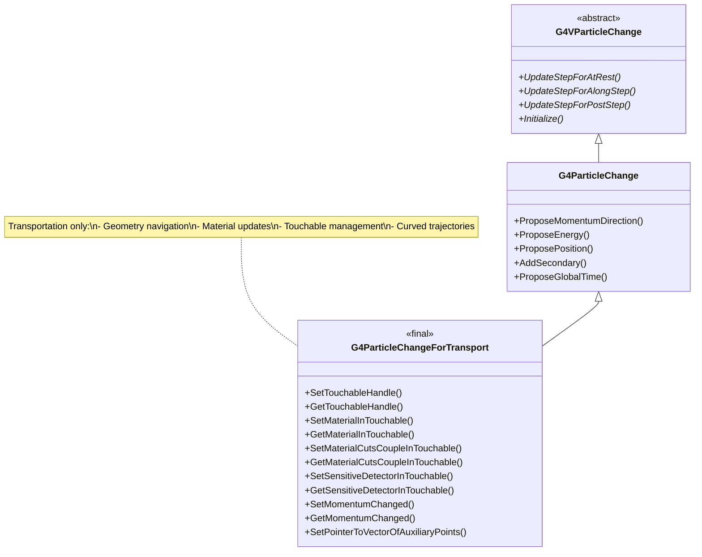
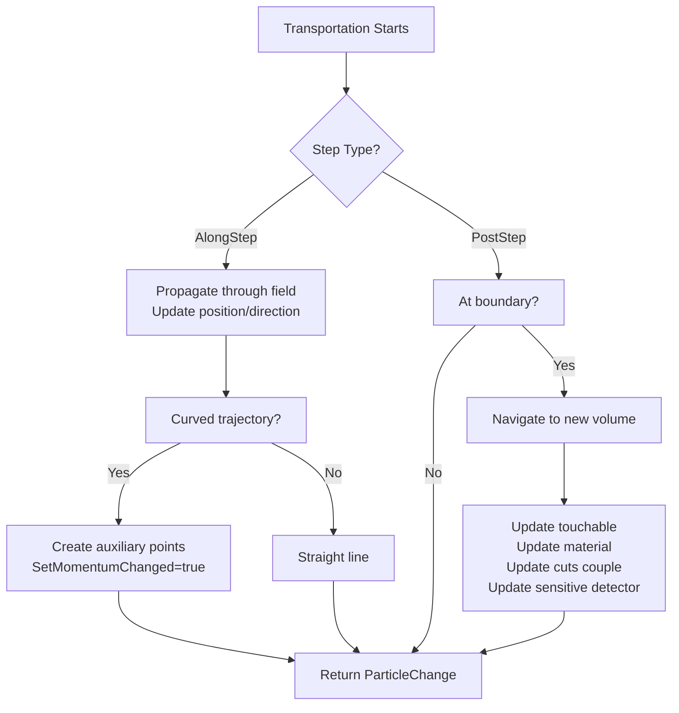

# G4ParticleChangeForTransport

**File**: `source/track/include/G4ParticleChangeForTransport.hh`

## Overview

G4ParticleChangeForTransport is a specialized concrete implementation designed exclusively for the transportation process in Geant4. It extends G4ParticleChange with geometry-specific functionality for managing touchables, materials, material cuts couples, and sensitive detectors as particles move through the detector geometry. This class is marked as `final`, indicating it is the complete implementation for transportation.

## Class Description

G4ParticleChangeForTransport is unique among ParticleChange classes because it:

- **Extends G4ParticleChange**: Inherits complete particle state management, then adds geometry features
- **Geometry Integration**: Manages touchables (geometry navigation handles)
- **Material Tracking**: Updates material and material-cuts-couple information
- **Sensitive Detector Management**: Tracks sensitive detector associations
- **Curved Trajectory Support**: Handles auxiliary points for smooth trajectory representation
- **Transportation Specific**: Used only by G4Transportation and related processes
- **All Update Types**: Implements UpdateStepForAlongStep(), UpdateStepForAtRest(), and UpdateStepForPostStep()

**Purpose**: Transportation moves particles through geometry, crossing volume boundaries and updating geometric context. This class captures all state changes during transportation.

**Typical Use Cases**:
- G4Transportation - Standard transportation process
- G4CoupledTransportation - Transportation with field propagation
- Geometry boundary crossing
- Volume transitions

**Author**: Hisaya Kurashige (May 10, 1998)

## Inheritance Hierarchy



**Key Points**:
- Extends [G4ParticleChange](./g4particlechange.md) (not G4VParticleChange directly)
- Inherits all particle state management from G4ParticleChange
- Adds geometry-specific features
- Marked as `final` - cannot be further derived

## Constructor & Destructor

### Constructor

```cpp
G4ParticleChangeForTransport();
```

Creates a G4ParticleChangeForTransport object.

**Location**: `G4ParticleChangeForTransport.hh:49`

**Initialization**:
- Inherits G4ParticleChange initialization
- theTouchableHandle = null handle
- isMomentumChanged = false
- theMaterialChange = nullptr
- theMaterialCutsCoupleChange = nullptr
- theSensitiveDetectorChange = nullptr
- fpVectorOfAuxiliaryPointsPointer = nullptr

### Destructor

```cpp
~G4ParticleChangeForTransport() override = default;
```

Default virtual destructor.

**Location**: `G4ParticleChangeForTransport.hh:51`

**Note**: Touchable handles have their own memory management through reference counting.

### Deleted Copy Operations

```cpp
G4ParticleChangeForTransport(const G4ParticleChangeForTransport& right) = delete;
G4ParticleChangeForTransport& operator=(const G4ParticleChangeForTransport& right) = delete;
```

Copy construction and assignment are explicitly disabled.

**Location**: `G4ParticleChangeForTransport.hh:53-54`

## Update Step Methods

G4ParticleChangeForTransport overrides all three update methods from G4ParticleChange.

### UpdateStepForAlongStep

```cpp
G4Step* UpdateStepForAlongStep(G4Step* Step) final;
```

Updates the G4Step during transportation along the step.

**Parameters**:
- `Step`: Pointer to the current step

**Returns**: Pointer to the updated G4Step

**Location**: `G4ParticleChangeForTransport.hh:60`

**Usage**: Called during particle propagation through geometry. Updates position, momentum, and geometry context.

**Marked as**: `final` - cannot be overridden.

### UpdateStepForAtRest

```cpp
G4Step* UpdateStepForAtRest(G4Step* Step) final;
```

Updates the G4Step for at-rest transportation (unusual case).

**Parameters**:
- `Step`: Pointer to the current step

**Returns**: Pointer to the updated G4Step

**Location**: `G4ParticleChangeForTransport.hh:61`

**Usage**: Rarely used - transportation is typically not an at-rest process.

**Marked as**: `final` - cannot be overridden.

### UpdateStepForPostStep

```cpp
G4Step* UpdateStepForPostStep(G4Step* Step) final;
```

Updates the G4Step at the end of transportation (e.g., at boundary).

**Parameters**:
- `Step`: Pointer to the current step

**Returns**: Pointer to the updated G4Step

**Location**: `G4ParticleChangeForTransport.hh:62`

**Usage**: Called when transportation completes (typically at volume boundary). Updates final position and geometry context.

**Marked as**: `final` - cannot be overridden.

### Initialize

```cpp
void Initialize(const G4Track& track) final;
```

Initializes all properties from the current track.

**Parameters**:
- `track`: Reference to the current track

**Location**: `G4ParticleChangeForTransport.hh:66`

**Usage**: Must be called at the beginning of transportation DoIt() method.

**Marked as**: `final` - cannot be overridden.

## Touchable Methods

The touchable represents the geometrical context (volume hierarchy, transformations) of a particle's location.

### GetTouchableHandle

```cpp
inline const G4TouchableHandle& GetTouchableHandle() const;
```

Returns the touchable handle for the current particle location.

**Returns**: Reference to the touchable handle

**Location**: `G4ParticleChangeForTransport.hh:73`

**Note**: Touchable updated only **after PostStepDoIt** completes. During AlongStep, uses old touchable.

### SetTouchableHandle

```cpp
inline void SetTouchableHandle(const G4TouchableHandle& fTouchable);
```

Sets the touchable handle for the new particle location.

**Parameters**:
- `fTouchable`: New touchable handle after geometry navigation

**Location**: `G4ParticleChangeForTransport.hh:74`

**Usage**: Called by transportation when particle crosses volume boundary.

**Example**:
```cpp
// After geometry navigation
G4TouchableHandle newTouchable = navigator->CreateTouchableHandle();
aParticleChange.SetTouchableHandle(newTouchable);
```

## Material Methods

### GetMaterialInTouchable

```cpp
inline G4Material* GetMaterialInTouchable() const;
```

Returns the material in the current touchable.

**Returns**: Pointer to G4Material

**Location**: `G4ParticleChangeForTransport.hh:79`

### SetMaterialInTouchable

```cpp
inline void SetMaterialInTouchable(G4Material* fMaterial);
```

Sets the material for the current touchable.

**Parameters**:
- `fMaterial`: Pointer to the material

**Location**: `G4ParticleChangeForTransport.hh:80`

**Usage**: Updates material information when particle enters new volume.

## Material Cuts Couple Methods

Material cuts couples combine material with production cuts for efficient secondary production threshold access.

### GetMaterialCutsCoupleInTouchable

```cpp
inline const G4MaterialCutsCouple* GetMaterialCutsCoupleInTouchable() const;
```

Returns the material-cuts-couple in the current touchable.

**Returns**: Pointer to const G4MaterialCutsCouple

**Location**: `G4ParticleChangeForTransport.hh:83`

### SetMaterialCutsCoupleInTouchable

```cpp
inline void SetMaterialCutsCoupleInTouchable(
    const G4MaterialCutsCouple* fMaterialCutsCouple);
```

Sets the material-cuts-couple for the current touchable.

**Parameters**:
- `fMaterialCutsCouple`: Pointer to the material-cuts-couple

**Location**: `G4ParticleChangeForTransport.hh:84-85`

**Usage**: Updated when particle crosses into volume with different production cuts.

## Sensitive Detector Methods

### GetSensitiveDetectorInTouchable

```cpp
inline G4VSensitiveDetector* GetSensitiveDetectorInTouchable() const;
```

Returns the sensitive detector in the current touchable.

**Returns**: Pointer to G4VSensitiveDetector (nullptr if no SD)

**Location**: `G4ParticleChangeForTransport.hh:89`

### SetSensitiveDetectorInTouchable

```cpp
inline void SetSensitiveDetectorInTouchable(
    G4VSensitiveDetector* fSensitiveDetector);
```

Sets the sensitive detector for the current touchable.

**Parameters**:
- `fSensitiveDetector`: Pointer to the sensitive detector

**Location**: `G4ParticleChangeForTransport.hh:90-91`

**Usage**: Updated when particle enters/exits sensitive volume (detector).

## Momentum Change Flag Methods

### GetMomentumChanged

```cpp
inline G4bool GetMomentumChanged() const;
```

Returns whether momentum changed during this step.

**Returns**: True if momentum changed

**Location**: `G4ParticleChangeForTransport.hh:94`

### SetMomentumChanged

```cpp
inline void SetMomentumChanged(G4bool b);
```

Sets flag indicating momentum changed.

**Parameters**:
- `b`: True if momentum changed

**Location**: `G4ParticleChangeForTransport.hh:95`

**Usage**: Set to true when trajectory curvature or MSC changes direction during transport.

## Auxiliary Points Methods

Auxiliary points represent intermediate positions along curved trajectories (e.g., in magnetic fields).

### SetPointerToVectorOfAuxiliaryPoints

```cpp
inline void SetPointerToVectorOfAuxiliaryPoints(
    std::vector<G4ThreeVector>* vec);
```

Sets pointer to vector of auxiliary trajectory points.

**Parameters**:
- `vec`: Pointer to vector of 3D position points along curved trajectory

**Location**: `G4ParticleChangeForTransport.hh:97-98`

**Usage**: Used for smooth trajectory visualization and accurate geometry intersection with curved paths.

### GetPointerToVectorOfAuxiliaryPoints

```cpp
inline std::vector<G4ThreeVector>* GetPointerToVectorOfAuxiliaryPoints() const;
```

Returns pointer to vector of auxiliary trajectory points.

**Returns**: Pointer to vector of auxiliary points (nullptr if no curved trajectory)

**Location**: `G4ParticleChangeForTransport.hh:99-100`

## Debug Method

### DumpInfo

```cpp
void DumpInfo() const final;
```

Prints detailed information about the particle change state.

**Location**: `G4ParticleChangeForTransport.hh:103`

**Output Includes**:
- All G4ParticleChange information (energy, position, momentum, etc.)
- Touchable information
- Material information
- Material-cuts-couple
- Sensitive detector
- Momentum changed flag
- Auxiliary points

**Marked as**: `final` - cannot be overridden.

## Private Data Members

### theTouchableHandle

```cpp
G4TouchableHandle theTouchableHandle;
```

Touchable handle for the new particle location after transportation.

**Location**: `G4ParticleChangeForTransport.hh:107`

**Note**: G4TouchableHandle uses reference counting for automatic memory management.

### isMomentumChanged

```cpp
G4bool isMomentumChanged = false;
```

Flag indicating whether momentum changed during transport.

**Location**: `G4ParticleChangeForTransport.hh:110`

**Usage**: Set to true when particle trajectory curved (magnetic field) or scattered (MSC during transport).

### theMaterialChange

```cpp
G4Material* theMaterialChange = nullptr;
```

Material where particle currently resides.

**Location**: `G4ParticleChangeForTransport.hh:113`

### theMaterialCutsCoupleChange

```cpp
const G4MaterialCutsCouple* theMaterialCutsCoupleChange = nullptr;
```

Material-cuts-couple for current location.

**Location**: `G4ParticleChangeForTransport.hh:115`

### theSensitiveDetectorChange

```cpp
G4VSensitiveDetector* theSensitiveDetectorChange = nullptr;
```

Sensitive detector at current location (nullptr if none).

**Location**: `G4ParticleChangeForTransport.hh:117`

### fpVectorOfAuxiliaryPointsPointer

```cpp
std::vector<G4ThreeVector>* fpVectorOfAuxiliaryPointsPointer = nullptr;
```

Pointer to vector of auxiliary points for curved trajectory representation.

**Location**: `G4ParticleChangeForTransport.hh:121`

**Note**: Does **not** own the vector - just holds pointer. Ownership managed by transportation process.

## Usage Examples

### Basic Transportation

```cpp
// Example: Simple straight-line transportation
G4VParticleChange* G4Transportation::AlongStepDoIt(
    const G4Track& track, const G4Step& step)
{
    fParticleChange.Initialize(track);

    // Get initial state
    G4ThreeVector startPosition = track.GetPosition();
    G4ThreeVector direction = track.GetMomentumDirection();
    G4double stepLength = step.GetStepLength();

    // Compute final position (straight line)
    G4ThreeVector endPosition = startPosition + stepLength * direction;

    // Update particle change
    fParticleChange.ProposePosition(endPosition);
    fParticleChange.ProposeTrackStatus(fAlive);

    return &fParticleChange;
}
```

### Transportation with Boundary Crossing

```cpp
// Example: Transportation across volume boundary
G4VParticleChange* G4Transportation::PostStepDoIt(
    const G4Track& track, const G4Step& step)
{
    fParticleChange.Initialize(track);

    // Particle reached boundary - update geometry context
    G4StepPoint* postStepPoint = step.GetPostStepPoint();

    if (postStepPoint->GetStepStatus() == fGeomBoundary)
    {
        // Geometry navigator provides new touchable
        G4TouchableHandle newTouchable = fNavigator->CreateTouchableHistory();
        fParticleChange.SetTouchableHandle(newTouchable);

        // Update material information
        G4VPhysicalVolume* newVolume = newTouchable->GetVolume();
        G4Material* newMaterial = newVolume->GetLogicalVolume()->GetMaterial();
        fParticleChange.SetMaterialInTouchable(newMaterial);

        // Update material-cuts-couple
        const G4MaterialCutsCouple* newCouple =
            newVolume->GetLogicalVolume()->GetMaterialCutsCouple();
        fParticleChange.SetMaterialCutsCoupleInTouchable(newCouple);

        // Update sensitive detector
        G4VSensitiveDetector* newSD =
            newVolume->GetLogicalVolume()->GetSensitiveDetector();
        fParticleChange.SetSensitiveDetectorInTouchable(newSD);
    }

    return &fParticleChange;
}
```

### Transportation in Magnetic Field

```cpp
// Example: Curved trajectory in magnetic field
G4VParticleChange* G4Transportation::AlongStepDoIt(
    const G4Track& track, const G4Step& step)
{
    fParticleChange.Initialize(track);

    G4ThreeVector startPosition = track.GetPosition();
    G4ThreeVector startDirection = track.GetMomentumDirection();
    G4double stepLength = step.GetStepLength();

    // Integrate equation of motion in field
    std::vector<G4ThreeVector> auxiliaryPoints;
    G4ThreeVector endPosition;
    G4ThreeVector endDirection;

    IntegrateCurvedTrajectory(startPosition, startDirection, stepLength,
                              endPosition, endDirection, auxiliaryPoints);

    // Update final state
    fParticleChange.ProposePosition(endPosition);
    fParticleChange.ProposeMomentumDirection(endDirection);

    // Direction changed due to field
    fParticleChange.SetMomentumChanged(true);

    // Store auxiliary points for trajectory visualization
    fParticleChange.SetPointerToVectorOfAuxiliaryPoints(&auxiliaryPoints);

    return &fParticleChange;
}
```

### Transportation with Multiple Scattering

```cpp
// Example: Transportation with MSC affecting trajectory
G4VParticleChange* G4CoupledTransportation::AlongStepDoIt(
    const G4Track& track, const G4Step& step)
{
    fParticleChange.Initialize(track);

    G4ThreeVector startPosition = track.GetPosition();
    G4ThreeVector startDirection = track.GetMomentumDirection();
    G4double stepLength = step.GetStepLength();

    // Multiple scattering during transport
    G4ThreeVector endDirection = ApplyMultipleScattering(
        startDirection, stepLength);

    // Direction changed by MSC
    if (endDirection != startDirection) {
        fParticleChange.SetMomentumChanged(true);
    }

    // Compute end position (possibly with lateral displacement)
    G4ThreeVector displacement = ComputeLateralDisplacement(
        startDirection, endDirection, stepLength);

    G4ThreeVector endPosition = startPosition + stepLength * startDirection
                              + displacement;

    fParticleChange.ProposePosition(endPosition);
    fParticleChange.ProposeMomentumDirection(endDirection);

    return &fParticleChange;
}
```

### Entering Sensitive Detector

```cpp
// Example: Particle entering detector volume
G4VParticleChange* G4Transportation::PostStepDoIt(
    const G4Track& track, const G4Step& step)
{
    fParticleChange.Initialize(track);

    // Check if entering sensitive volume
    G4StepPoint* postStepPoint = step.GetPostStepPoint();

    if (postStepPoint->GetStepStatus() == fGeomBoundary)
    {
        G4TouchableHandle newTouchable = fNavigator->CreateTouchableHistory();
        fParticleChange.SetTouchableHandle(newTouchable);

        G4VPhysicalVolume* newVolume = newTouchable->GetVolume();
        G4LogicalVolume* newLogicalVolume = newVolume->GetLogicalVolume();

        // Update material and cuts
        fParticleChange.SetMaterialInTouchable(
            newLogicalVolume->GetMaterial());
        fParticleChange.SetMaterialCutsCoupleInTouchable(
            newLogicalVolume->GetMaterialCutsCouple());

        // Check for sensitive detector
        G4VSensitiveDetector* sd = newLogicalVolume->GetSensitiveDetector();
        if (sd != nullptr) {
            // Entering detector - set SD
            fParticleChange.SetSensitiveDetectorInTouchable(sd);
            G4cout << "Particle entered detector: " << sd->GetName() << G4endl;
        } else {
            fParticleChange.SetSensitiveDetectorInTouchable(nullptr);
        }
    }

    return &fParticleChange;
}
```

### Material Change Detection

```cpp
// Example: Detecting material changes during transport
G4VParticleChange* G4Transportation::PostStepDoIt(
    const G4Track& track, const G4Step& step)
{
    fParticleChange.Initialize(track);

    G4Material* oldMaterial = track.GetMaterial();

    // Update geometry context
    G4TouchableHandle newTouchable = fNavigator->CreateTouchableHistory();
    fParticleChange.SetTouchableHandle(newTouchable);

    G4Material* newMaterial =
        newTouchable->GetVolume()->GetLogicalVolume()->GetMaterial();
    fParticleChange.SetMaterialInTouchable(newMaterial);

    // Check if material changed
    if (newMaterial != oldMaterial) {
        G4cout << "Material changed from " << oldMaterial->GetName()
               << " to " << newMaterial->GetName() << G4endl;

        // May need to recalculate physics tables, cross sections, etc.
        // (handled automatically by Geant4 framework)
    }

    return &fParticleChange;
}
```

### Curved Trajectory Visualization

```cpp
// Example: Creating auxiliary points for curved trajectory
G4VParticleChange* G4Transportation::AlongStepDoIt(
    const G4Track& track, const G4Step& step)
{
    fParticleChange.Initialize(track);

    G4ThreeVector startPos = track.GetPosition();
    G4ThreeVector startDir = track.GetMomentumDirection();
    G4double totalStep = step.GetStepLength();

    // Divide step into segments for smooth curve
    const G4int nSegments = 10;
    std::vector<G4ThreeVector> auxiliaryPoints;
    auxiliaryPoints.reserve(nSegments);

    G4double segmentLength = totalStep / nSegments;
    G4ThreeVector currentPos = startPos;
    G4ThreeVector currentDir = startDir;

    for (G4int i = 1; i < nSegments; ++i) {
        // Integrate one segment
        IntegrateOneStep(currentPos, currentDir, segmentLength,
                        currentPos, currentDir);

        // Store intermediate point
        auxiliaryPoints.push_back(currentPos);
    }

    // Final integration
    G4ThreeVector endPos, endDir;
    IntegrateOneStep(currentPos, currentDir, segmentLength,
                    endPos, endDir);

    // Update particle change
    fParticleChange.ProposePosition(endPos);
    fParticleChange.ProposeMomentumDirection(endDir);
    fParticleChange.SetMomentumChanged(true);

    // Provide auxiliary points for trajectory
    fParticleChange.SetPointerToVectorOfAuxiliaryPoints(&auxiliaryPoints);

    return &fParticleChange;
}
```

## Transportation Process Flow



## Comparison with Parent Class

**G4ParticleChangeForTransport vs G4ParticleChange**:

| Feature | G4ParticleChange | G4ParticleChangeForTransport |
|---------|------------------|------------------------------|
| All particle state | Yes | Yes (inherited) |
| Touchable | No | Yes |
| Material tracking | No | Yes |
| Cuts couple | No | Yes |
| Sensitive detector | No | Yes |
| Momentum changed flag | No | Yes |
| Auxiliary points | No | Yes |
| Typical use | Physics processes | Transportation only |

## Related Classes

### Base and Parent Classes
- [G4VParticleChange](./g4vparticlechange.md) - Abstract base class
- [G4ParticleChange](./g4particlechange.md) - Direct parent class

### Alternative Concrete Classes
- [G4ParticleChangeForGamma](./g4particlechangeforgamma.md) - For discrete EM
- [G4ParticleChangeForLoss](./g4particlechangeforloss.md) - For energy loss
- [G4ParticleChangeForDecay](./g4particlechangefordecay.md) - For decay
- [G4ParticleChangeForMSC](./g4particlechangeformsc.md) - For MSC

### Geometry Classes
- G4Navigator - Geometry navigation
- G4TouchableHistory - Touchable implementation
- G4VTouchable - Touchable base class
- G4VPhysicalVolume - Physical volume
- G4LogicalVolume - Logical volume

### Transportation Classes
- G4Transportation - Standard transportation
- G4CoupledTransportation - With field propagation
- G4Transportation - Neutron transportation

### Material Classes
- G4Material - Material definition
- G4MaterialCutsCouple - Material with production cuts
- G4ProductionCuts - Production cut values

### Detector Classes
- G4VSensitiveDetector - Sensitive detector base class

### Tracking Classes
- [G4Track](./g4track.md) - Particle track
- [G4Step](./g4step.md) - Step information
- [G4StepPoint](./g4steppoint.md) - Pre/post step points

## Thread Safety

G4ParticleChangeForTransport objects are **not thread-safe** and must **not be shared** between threads.

**Thread-Safe Pattern**:
```cpp
class G4Transportation : public G4VProcess
{
public:
    G4Transportation() : G4VProcess("Transportation")
    {
        // Each thread creates its own instance
        // No explicit ParticleChange creation - use member directly
    }

private:
    G4ParticleChangeForTransport fParticleChange;  // Thread-local member
};
```

**Note**: G4Transportation typically uses a member variable (not pointer) for the particle change.

## Implementation Notes

### Why Extend G4ParticleChange?

G4ParticleChangeForTransport extends G4ParticleChange (rather than G4VParticleChange) because:

1. **Complete State Needed**: Transportation may need to modify any particle property
2. **Code Reuse**: Inherits all G4ParticleChange functionality
3. **Additional Context**: Adds geometry-specific information on top

### Touchable Management

Touchables use G4TouchableHandle with reference counting:
- Automatic memory management
- Safe to copy handles
- Touchable deleted when last handle released
- No explicit delete needed

### Material Updates

Material and cuts must be updated together:
- Material defines physical properties
- Cuts define production thresholds
- MaterialCutsCouple provides efficient combined access
- Updated atomically during boundary crossing

### Auxiliary Points Ownership

The auxiliary points vector is **not owned** by ParticleChange:
- ParticleChange stores only a pointer
- Vector owned by transportation process
- Must remain valid during step processing
- Used by trajectory classes for visualization

## Common Pitfalls

### 1. Forgetting to Update All Geometry Context

```cpp
// WRONG - incomplete update at boundary
fParticleChange.SetTouchableHandle(newTouchable);
// Missing: material, cuts couple, sensitive detector

// CORRECT - update everything
fParticleChange.SetTouchableHandle(newTouchable);
fParticleChange.SetMaterialInTouchable(newMaterial);
fParticleChange.SetMaterialCutsCoupleInTouchable(newCouple);
fParticleChange.SetSensitiveDetectorInTouchable(newSD);
```

### 2. Auxiliary Points Vector Lifetime

```cpp
// WRONG - vector goes out of scope
{
    std::vector<G4ThreeVector> auxPoints;
    // ... fill auxPoints ...
    fParticleChange.SetPointerToVectorOfAuxiliaryPoints(&auxPoints);
}  // auxPoints destroyed - pointer now invalid!
return &fParticleChange;  // Dangling pointer!

// CORRECT - vector outlives step
std::vector<G4ThreeVector> auxPoints;  // Member or persistent
// ... fill auxPoints ...
fParticleChange.SetPointerToVectorOfAuxiliaryPoints(&auxPoints);
return &fParticleChange;
```

### 3. Not Setting Momentum Changed Flag

```cpp
// WRONG - direction changed but flag not set
G4ThreeVector newDirection = CurvedTrajectoryDirection();
fParticleChange.ProposeMomentumDirection(newDirection);
// Missing: SetMomentumChanged(true)

// CORRECT
G4ThreeVector newDirection = CurvedTrajectoryDirection();
fParticleChange.ProposeMomentumDirection(newDirection);
fParticleChange.SetMomentumChanged(true);
```

### 4. Using for Non-Transportation Processes

```cpp
// WRONG - using transport change for physics process
G4VParticleChange* MyPhysicsProcess::PostStepDoIt(...)
{
    G4ParticleChangeForTransport change;  // Overkill!
    // Don't need geometry features
}

// CORRECT - use appropriate class
G4VParticleChange* MyPhysicsProcess::PostStepDoIt(...)
{
    G4ParticleChangeForGamma change;  // Or other appropriate type
}
```

## Performance Considerations

1. **Touchable Handles**: Reference counting adds small overhead but ensures safety
2. **Material Lookup**: MaterialCutsCouple provides fast access to production cuts
3. **Auxiliary Points**: Only create when needed (curved trajectories, visualization)
4. **Member Variable**: Transportation uses member (not pointer) to avoid allocation

## Validation and Debugging

### Debug Output

```cpp
// Enable transportation debug
G4Transportation* transport = /* get transport process */;
transport->SetVerboseLevel(2);

// Or use ParticleChange directly
fParticleChange.SetVerboseLevel(2);
fParticleChange.DumpInfo();
```

### Geometry Consistency Check

```cpp
// Verify geometry context is consistent
G4Material* touchableMaterial =
    fParticleChange.GetTouchableHandle()->GetVolume()
        ->GetLogicalVolume()->GetMaterial();

G4Material* storedMaterial = fParticleChange.GetMaterialInTouchable();

if (touchableMaterial != storedMaterial) {
    G4cerr << "Material inconsistency!" << G4endl;
}
```

## Version History

- **May 10, 1998**: Original implementation by Hisaya Kurashige
- Subsequent updates:
  - Added material-cuts-couple support
  - Added sensitive detector tracking
  - Added auxiliary points for curved trajectories
  - Added momentum changed flag
  - Marked as final for optimization

## See Also

### Documentation
- [Track Module Overview](../track-overview.md)
- [Geometry and Navigation](../../geometry/navigation.md)
- [Transportation Process](../../processes/transportation.md)

### Source Files
- Header: `source/track/include/G4ParticleChangeForTransport.hh`
- Inline: `source/track/include/G4ParticleChangeForTransport.icc`
- Implementation: `source/track/src/G4ParticleChangeForTransport.cc`

### Related Documentation
- G4Navigator documentation
- Touchable geometry representation
- Field propagation in Geant4
- Sensitive detectors guide
