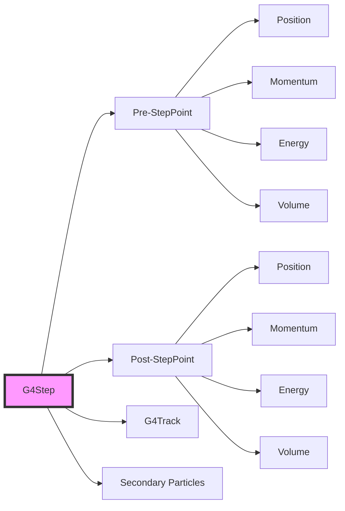
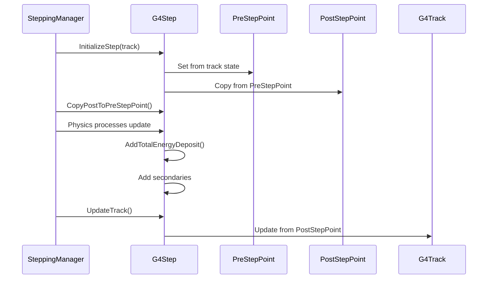
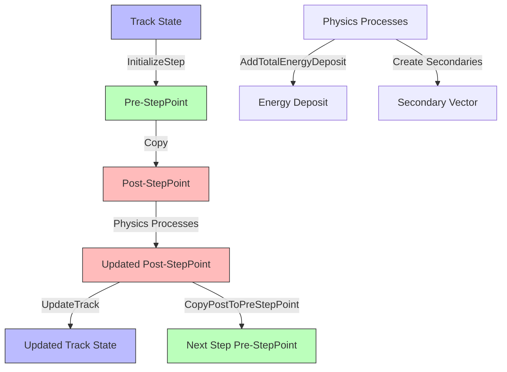

# G4Step

**File**: `source/track/include/G4Step.hh`

## Overview

G4Step is the fundamental class in Geant4 that represents a single step of a particle being tracked through the detector. It encapsulates all information about the particle's state change during one step of the simulation, including position changes, energy deposition, secondary particle production, and the physical processes that occurred.

## Class Description

G4Step provides a complete snapshot of what happens to a particle during one step of its trajectory. The class contains:

- **Step points**: Pre-step and post-step points (G4StepPoint) defining the beginning and end of the step
- **Track information**: Reference to the parent G4Track being stepped
- **Energy deposition**: Total and non-ionizing energy deposited during the step
- **Secondary particles**: Container for particles produced during the step
- **Step geometry**: Length and position changes
- **Control flags**: Steering information for the stepping manager

A step is the fundamental unit of simulation in Geant4. All physics processes, sensitive detectors, and user actions operate on steps.

## Step Point Relationship



## Step Life Cycle



## Constructors & Destructor

### Constructor

```cpp
G4Step();
```

**Location**: G4Step.hh:63

Creates a new step object with all member variables initialized to default values.

**Initial State**:
- Step points are created as `nullptr`
- Energy deposits set to 0.0
- Step length is 0.0
- Secondary vector is `nullptr`

### Destructor

```cpp
~G4Step();
```

**Location**: G4Step.hh:64

Destroys the step object.

**Note**: The destructor does NOT delete the secondary tracks in the secondary vector. The caller is responsible for managing secondary track lifetime.

### Copy Constructor

```cpp
G4Step(const G4Step&);
```

**Location**: G4Step.hh:67

Performs a deep copy of the step.

### Assignment Operator

```cpp
G4Step& operator=(const G4Step&);
```

**Location**: G4Step.hh:68

Assigns step data from another step object.

## Track Access Methods

### GetTrack

```cpp
inline G4Track* GetTrack() const;
```

**Location**: G4Step.hh:71, G4Step.icc:169-172

Returns the track associated with this step.

**Returns**: Pointer to the current G4Track

**Usage**: Access particle properties, track ID, parent ID, etc.

```cpp
G4Step* aStep = /* ... */;
G4Track* track = aStep->GetTrack();
G4int trackID = track->GetTrackID();
```

### SetTrack

```cpp
inline void SetTrack(G4Track* value);
```

**Location**: G4Step.hh:72, G4Step.icc:174-177

Associates a track with this step.

**Parameters**:
- `value`: Pointer to the track

**Note**: Internal method used by the stepping manager.

## Step Point Access Methods

### GetPreStepPoint

```cpp
inline G4StepPoint* GetPreStepPoint() const;
```

**Location**: G4Step.hh:75, G4Step.icc:35-38

Returns the pre-step point containing the particle state at the beginning of the step.

**Returns**: Pointer to the pre-step point

**Usage**: Access initial position, momentum, energy, volume, etc.

```cpp
G4StepPoint* prePoint = aStep->GetPreStepPoint();
G4ThreeVector position = prePoint->GetPosition();
G4double energy = prePoint->GetKineticEnergy();
```

### SetPreStepPoint

```cpp
inline void SetPreStepPoint(G4StepPoint* value);
```

**Location**: G4Step.hh:76, G4Step.icc:40-44

Sets the pre-step point, deleting any existing pre-step point.

**Parameters**:
- `value`: Pointer to the new pre-step point

**Warning**: The previous step point object is deleted automatically.

### ResetPreStepPoint

```cpp
inline G4StepPoint* ResetPreStepPoint(G4StepPoint* value = nullptr);
```

**Location**: G4Step.hh:77, G4Step.icc:46-51

Replaces the pre-step point without deleting the old one.

**Parameters**:
- `value`: Pointer to the new pre-step point (default: nullptr)

**Returns**: Pointer to the previous pre-step point

**Important**: The caller is responsible for deleting the returned step point.

### GetPostStepPoint

```cpp
inline G4StepPoint* GetPostStepPoint() const;
```

**Location**: G4Step.hh:84, G4Step.icc:53-56

Returns the post-step point containing the particle state at the end of the step.

**Returns**: Pointer to the post-step point

**Usage**: Access final position, momentum, energy, volume, process that limited the step, etc.

```cpp
G4StepPoint* postPoint = aStep->GetPostStepPoint();
G4VPhysicalVolume* volume = postPoint->GetPhysicalVolume();
const G4VProcess* process = postPoint->GetProcessDefinedStep();
```

### SetPostStepPoint

```cpp
inline void SetPostStepPoint(G4StepPoint* value);
```

**Location**: G4Step.hh:85, G4Step.icc:58-62

Sets the post-step point, deleting any existing post-step point.

**Parameters**:
- `value`: Pointer to the new post-step point

**Warning**: The previous step point object is deleted automatically.

### ResetPostStepPoint

```cpp
inline G4StepPoint* ResetPostStepPoint(G4StepPoint* value = nullptr);
```

**Location**: G4Step.hh:86, G4Step.icc:64-69

Replaces the post-step point without deleting the old one.

**Parameters**:
- `value`: Pointer to the new post-step point (default: nullptr)

**Returns**: Pointer to the previous post-step point

**Important**: The caller is responsible for deleting the returned step point.

## Step Length Methods

### GetStepLength

```cpp
inline G4double GetStepLength() const;
```

**Location**: G4Step.hh:93, G4Step.icc:71-74

Returns the actual step length.

**Returns**: Step length in Geant4 length units

**Note**: The step length is the geometrical distance traveled along the track, which may be limited by geometry boundaries, physics processes, or user constraints.

```cpp
G4double stepLength = aStep->GetStepLength();
G4double distanceInCm = stepLength / CLHEP::cm;
```

### SetStepLength

```cpp
inline void SetStepLength(G4double value);
```

**Location**: G4Step.hh:94, G4Step.icc:76-79

Sets the step length.

**Parameters**:
- `value`: Step length in Geant4 units

**Note**: Updated during stepping by AlongStepDoIt processes.

## Energy Deposition Methods

### GetTotalEnergyDeposit

```cpp
inline G4double GetTotalEnergyDeposit() const;
```

**Location**: G4Step.hh:100, G4Step.icc:91-94

Returns the total energy deposited in the volume during this step.

**Returns**: Energy deposit in Geant4 energy units

**Usage**: Critical for calorimetry, dosimetry, and scoring applications.

```cpp
G4double edep = aStep->GetTotalEnergyDeposit();
G4double edepMeV = edep / CLHEP::MeV;
```

**Important**: Use this method (not GetDeltaEnergy) for energy deposition calculations, as it accounts for energy carried away by secondaries.

### SetTotalEnergyDeposit

```cpp
inline void SetTotalEnergyDeposit(G4double value);
```

**Location**: G4Step.hh:101, G4Step.icc:96-99

Sets the total energy deposit.

**Parameters**:
- `value`: Energy deposit value

**Note**: Typically used internally by physics processes.

### AddTotalEnergyDeposit

```cpp
inline void AddTotalEnergyDeposit(G4double value);
```

**Location**: G4Step.hh:112, G4Step.icc:111-114

Adds energy to the total energy deposit.

**Parameters**:
- `value`: Energy to add

**Usage**: Physics processes call this to accumulate energy deposition.

```cpp
aStep->AddTotalEnergyDeposit(ionizationEnergy);
```

### ResetTotalEnergyDeposit

```cpp
inline void ResetTotalEnergyDeposit();
```

**Location**: G4Step.hh:113, G4Step.icc:116-120

Resets both total and non-ionizing energy deposits to zero.

**Note**: Also clears non-ionizing energy deposit.

### GetNonIonizingEnergyDeposit

```cpp
inline G4double GetNonIonizingEnergyDeposit() const;
```

**Location**: G4Step.hh:104, G4Step.icc:101-104

Returns the non-ionizing energy deposit (NIEL - Non-Ionizing Energy Loss).

**Returns**: Non-ionizing energy deposit in Geant4 units

**Usage**: Important for radiation damage studies in semiconductors and other materials.

### SetNonIonizingEnergyDeposit

```cpp
inline void SetNonIonizingEnergyDeposit(G4double value);
```

**Location**: G4Step.hh:105, G4Step.icc:106-109

Sets the non-ionizing energy deposit.

**Parameters**:
- `value`: Non-ionizing energy value

### AddNonIonizingEnergyDeposit

```cpp
inline void AddNonIonizingEnergyDeposit(G4double value);
```

**Location**: G4Step.hh:116, G4Step.icc:122-125

Adds energy to the non-ionizing energy deposit.

**Parameters**:
- `value`: Non-ionizing energy to add

### ResetNonIonizingEnergyDeposit

```cpp
inline void ResetNonIonizingEnergyDeposit();
```

**Location**: G4Step.hh:117, G4Step.icc:127-130

Resets the non-ionizing energy deposit to zero.

## Delta Methods (State Changes)

### GetDeltaPosition

```cpp
inline G4ThreeVector GetDeltaPosition() const;
```

**Location**: G4Step.hh:130, G4Step.icc:81-84

Returns the change in position during the step.

**Returns**: Displacement vector (post-position - pre-position)

**Implementation**:
```cpp
return fpPostStepPoint->GetPosition() - fpPreStepPoint->GetPosition();
```

**Usage**: Calculate particle displacement, track trajectory, etc.

```cpp
G4ThreeVector displacement = aStep->GetDeltaPosition();
G4double distance = displacement.mag();
```

### GetDeltaTime

```cpp
inline G4double GetDeltaTime() const;
```

**Location**: G4Step.hh:131, G4Step.icc:86-89

Returns the time elapsed during the step.

**Returns**: Time difference (post-time - pre-time) in Geant4 time units

**Implementation**:
```cpp
return fpPostStepPoint->GetLocalTime() - fpPreStepPoint->GetLocalTime();
```

### GetDeltaMomentum

```cpp
inline G4ThreeVector GetDeltaMomentum() const;
```

**Location**: G4Step.hh:134, G4Step.icc:137-140

Returns the change in momentum during the step.

**Returns**: Momentum change vector (post-momentum - pre-momentum)

**Warning**: Do not use this to compute energy deposition. Use GetTotalEnergyDeposit() instead, as it accounts for secondary production.

### GetDeltaEnergy

```cpp
inline G4double GetDeltaEnergy() const;
```

**Location**: G4Step.hh:135, G4Step.icc:132-135

Returns the change in kinetic energy during the step.

**Returns**: Energy difference (post-energy - pre-energy)

**Warning**: This is NOT the energy deposited in the material. It's the change in the particle's kinetic energy, which may differ from deposited energy due to secondary particle production. Always use GetTotalEnergyDeposit() for energy scoring.

## Volume Boundary Flags

### IsFirstStepInVolume

```cpp
inline G4bool IsFirstStepInVolume() const;
```

**Location**: G4Step.hh:120, G4Step.icc:298-301

Checks if this is the first step in the current volume.

**Returns**: True if first step in volume

**Note**: According to the header comment (G4Step.hh:128), these flags are not currently used.

### IsLastStepInVolume

```cpp
inline G4bool IsLastStepInVolume() const;
```

**Location**: G4Step.hh:121, G4Step.icc:303-306

Checks if this is the last step in the current volume.

**Returns**: True if last step in volume

### SetFirstStepFlag

```cpp
inline void SetFirstStepFlag();
```

**Location**: G4Step.hh:123, G4Step.icc:308-311

Marks this step as the first in a volume.

### ClearFirstStepFlag

```cpp
inline void ClearFirstStepFlag();
```

**Location**: G4Step.hh:124, G4Step.icc:313-316

Clears the first-step-in-volume flag.

### SetLastStepFlag

```cpp
inline void SetLastStepFlag();
```

**Location**: G4Step.hh:125, G4Step.icc:318-321

Marks this step as the last in a volume.

### ClearLastStepFlag

```cpp
inline void ClearLastStepFlag();
```

**Location**: G4Step.hh:126, G4Step.icc:323-326

Clears the last-step-in-volume flag.

## Stepping Control

### GetControlFlag

```cpp
inline G4SteppingControl GetControlFlag() const;
```

**Location**: G4Step.hh:108, G4Step.icc:147-150

Returns the stepping control flag.

**Returns**: Control flag value (G4SteppingControl enum)

**Usage**: Physics processes can set control flags to influence stepping behavior (e.g., force interaction, kill track, etc.)

### SetControlFlag

```cpp
inline void SetControlFlag(G4SteppingControl StepControlFlag);
```

**Location**: G4Step.hh:109, G4Step.icc:142-145

Sets the stepping control flag.

**Parameters**:
- `StepControlFlag`: Control flag value

**Common Values**:
- `NormalCondition`: Normal stepping
- `AvoidHitInvocation`: Skip sensitive detector
- `Debug`: Debug mode

## Step Management Methods

### InitializeStep

```cpp
inline void InitializeStep(G4Track* aValue);
```

**Location**: G4Step.hh:141, G4Step.icc:179-231

Initializes the step at the beginning of tracking.

**Parameters**:
- `aValue`: Pointer to the track being initialized

**Actions Performed**:
1. Sets the track reference
2. Resets step length to 0
3. Resets energy deposits to 0
4. Initializes pre-step point from track state
5. Copies pre-step point to post-step point
6. Sets safety, process, and status information

**Note**: This is a critical internal method called by the stepping manager.

### UpdateTrack

```cpp
inline void UpdateTrack();
```

**Location**: G4Step.hh:144, G4Step.icc:233-260

Updates the track with information from the post-step point.

**Actions Performed**:
1. Updates track position, global time, local time
2. Updates dynamic particle properties (mass, charge, proper time)
3. Updates momentum direction, kinetic energy, polarization
4. Sets track step length
5. Updates touchable (geometry navigation)
6. Updates weight and velocity

**Usage**: Called by stepping manager after all processes have acted on the step.

### CopyPostToPreStepPoint

```cpp
inline void CopyPostToPreStepPoint();
```

**Location**: G4Step.hh:147, G4Step.icc:152-160

Copies the post-step point to the pre-step point for the next step.

**Actions Performed**:
1. Copies all post-step point data to pre-step point
2. Sets post-step status to `fUndefined`
3. Stores the number of secondaries created in the previous step

**Usage**: Called at the beginning of each new step to prepare for the next iteration.

## Secondary Particle Methods

### GetSecondary

```cpp
inline const G4TrackVector* GetSecondary() const;
```

**Location**: G4Step.hh:161, G4Step.icc:267-270

Returns the secondary track vector.

**Returns**: Const pointer to vector of secondary tracks

**Note**: This vector contains ALL secondaries created during tracking of the current track, not just those from the current step.

```cpp
const G4TrackVector* secondaries = aStep->GetSecondary();
if (secondaries) {
    for (auto* track : *secondaries) {
        // Process secondary track
    }
}
```

### GetfSecondary

```cpp
inline G4TrackVector* GetfSecondary();
```

**Location**: G4Step.hh:162, G4Step.icc:272-275

Returns non-const pointer to the secondary track vector.

**Returns**: Pointer to vector of secondary tracks

**Note**: For internal use; prefer GetSecondary() for read-only access.

### GetNumberOfSecondariesInCurrentStep

```cpp
inline std::size_t GetNumberOfSecondariesInCurrentStep() const;
```

**Location**: G4Step.hh:156, G4Step.icc:262-265

Returns the number of secondaries created in the current step only.

**Returns**: Number of secondaries in current step

**Implementation**: Computes the difference between total secondaries and secondaries from previous steps.

```cpp
std::size_t nNew = aStep->GetNumberOfSecondariesInCurrentStep();
const G4TrackVector* secondaries = aStep->GetSecondary();
// Access last nNew elements for current step secondaries
```

### GetSecondaryInCurrentStep

```cpp
const std::vector<const G4Track*>* GetSecondaryInCurrentStep() const;
```

**Location**: G4Step.hh:159

Returns a vector containing only the secondaries from the current step.

**Returns**: Pointer to vector of const track pointers for current step secondaries

**Usage**: More convenient than GetNumberOfSecondariesInCurrentStep when you need to iterate over current step secondaries.

### SetSecondary

```cpp
inline void SetSecondary(G4TrackVector* value);
```

**Location**: G4Step.hh:174, G4Step.icc:277-280

Sets the secondary track vector.

**Parameters**:
- `value`: Pointer to the secondary track vector

**Note**: Internal method used by the stepping manager.

### NewSecondaryVector

```cpp
inline G4TrackVector* NewSecondaryVector();
```

**Location**: G4Step.hh:163, G4Step.icc:282-286

Creates a new secondary track vector.

**Returns**: Pointer to the newly created vector

**Usage**: Called by the stepping manager if no secondary vector exists.

### DeleteSecondaryVector

```cpp
inline void DeleteSecondaryVector();
```

**Location**: G4Step.hh:170, G4Step.icc:288-296

Deletes the secondary track vector.

**Important**: This does NOT delete the G4Track objects inside the vector. The caller must manage secondary track lifetime separately.

**Implementation**:
```cpp
if(fSecondary != nullptr) {
    fSecondary->clear();
    delete fSecondary;
    fSecondary = nullptr;
}
```

## Auxiliary Points Methods

### SetPointerToVectorOfAuxiliaryPoints

```cpp
inline void SetPointerToVectorOfAuxiliaryPoints(std::vector<G4ThreeVector>* vec);
```

**Location**: G4Step.hh:150, G4Step.icc:328-332

Sets the auxiliary points vector pointer.

**Parameters**:
- `vec`: Pointer to vector of 3D points

**Usage**: Some physics processes (e.g., multiple scattering, curved tracks) may store intermediate points along a step.

### GetPointerToVectorOfAuxiliaryPoints

```cpp
inline std::vector<G4ThreeVector>* GetPointerToVectorOfAuxiliaryPoints() const;
```

**Location**: G4Step.hh:151, G4Step.icc:334-338

Returns the auxiliary points vector pointer.

**Returns**: Pointer to vector of auxiliary 3D points, or nullptr if not set

**Usage**: Retrieve intermediate points for visualization or detailed track reconstruction.

## Data Members

### Protected Members

```cpp
G4double fTotalEnergyDeposit = 0.0;          // Total energy deposited in step
G4double fNonIonizingEnergyDeposit = 0.0;    // Non-ionizing energy deposit (NIEL)
```

**Location**: G4Step.hh:179-183

### Private Members

```cpp
G4StepPoint* fpPreStepPoint = nullptr;                      // Pre-step point
G4StepPoint* fpPostStepPoint = nullptr;                     // Post-step point
G4double fStepLength = 0.0;                                 // Step length
G4Track* fpTrack = nullptr;                                 // Associated track
G4SteppingControl fpSteppingControlFlag = NormalCondition;  // Control flag
G4bool fFirstStepInVolume = false;                          // First step flag
G4bool fLastStepInVolume = false;                           // Last step flag
G4TrackVector* fSecondary = nullptr;                        // Secondary tracks
std::size_t nSecondaryByLastStep = 0;                       // Previous secondaries count
std::vector<const G4Track*>* secondaryInCurrentStep = nullptr;  // Current step secondaries
std::vector<G4ThreeVector>* fpVectorOfAuxiliaryPointsPointer = nullptr;  // Auxiliary points
```

**Location**: G4Step.hh:187-210

## Usage Examples

### Basic Step Information Access

```cpp
void MySteppingAction::UserSteppingAction(const G4Step* aStep) {
    // Get step points
    G4StepPoint* prePoint = aStep->GetPreStepPoint();
    G4StepPoint* postPoint = aStep->GetPostStepPoint();

    // Get step length
    G4double stepLength = aStep->GetStepLength();

    // Get energy deposit
    G4double edep = aStep->GetTotalEnergyDeposit();

    // Get particle information from track
    G4Track* track = aStep->GetTrack();
    G4int trackID = track->GetTrackID();
    G4String particleName = track->GetDefinition()->GetParticleName();

    G4cout << "Particle: " << particleName
           << " TrackID: " << trackID
           << " Step length: " << stepLength / CLHEP::mm << " mm"
           << " Energy deposit: " << edep / CLHEP::MeV << " MeV"
           << G4endl;
}
```

### Volume Boundary Crossing Detection

```cpp
void DetectBoundaryCrossing(const G4Step* aStep) {
    G4StepPoint* prePoint = aStep->GetPreStepPoint();
    G4StepPoint* postPoint = aStep->GetPostStepPoint();

    G4VPhysicalVolume* preVolume = prePoint->GetPhysicalVolume();
    G4VPhysicalVolume* postVolume = postPoint->GetPhysicalVolume();

    if (preVolume != postVolume) {
        G4cout << "Boundary crossing detected!" << G4endl;
        if (preVolume) {
            G4cout << "  From: " << preVolume->GetName() << G4endl;
        }
        if (postVolume) {
            G4cout << "  To: " << postVolume->GetName() << G4endl;
        }
    }
}
```

### Sensitive Detector Hit Processing

```cpp
G4bool MySensitiveDetector::ProcessHits(G4Step* aStep, G4TouchableHistory*) {
    // Get energy deposit
    G4double edep = aStep->GetTotalEnergyDeposit();
    if (edep == 0.) return false;

    // Get position of energy deposit (mid-point)
    G4StepPoint* prePoint = aStep->GetPreStepPoint();
    G4StepPoint* postPoint = aStep->GetPostStepPoint();
    G4ThreeVector position = 0.5 * (prePoint->GetPosition() +
                                     postPoint->GetPosition());

    // Get time
    G4double time = prePoint->GetGlobalTime();

    // Get track information
    G4Track* track = aStep->GetTrack();
    G4int trackID = track->GetTrackID();
    G4int parentID = track->GetParentID();

    // Create hit
    MyHit* hit = new MyHit();
    hit->SetEdep(edep);
    hit->SetPosition(position);
    hit->SetTime(time);
    hit->SetTrackID(trackID);
    hit->SetParentID(parentID);

    fHitsCollection->insert(hit);
    return true;
}
```

### Secondary Particle Analysis

```cpp
void AnalyzeSecondaries(const G4Step* aStep) {
    // Get secondaries from current step only
    std::size_t nSecondaries = aStep->GetNumberOfSecondariesInCurrentStep();

    if (nSecondaries > 0) {
        const G4TrackVector* secondaries = aStep->GetSecondary();
        std::size_t totalSecondaries = secondaries->size();

        G4cout << "Secondaries created in this step: " << nSecondaries << G4endl;

        // Iterate over secondaries from current step
        // (they are at the end of the vector)
        for (std::size_t i = totalSecondaries - nSecondaries;
             i < totalSecondaries; ++i) {
            G4Track* secondary = (*secondaries)[i];
            G4String particleName = secondary->GetDefinition()->GetParticleName();
            G4double kineticEnergy = secondary->GetKineticEnergy();

            G4cout << "  Secondary " << (i - (totalSecondaries - nSecondaries) + 1)
                   << ": " << particleName
                   << " with KE = " << kineticEnergy / CLHEP::MeV << " MeV"
                   << G4endl;
        }
    }
}
```

### Process Identification

```cpp
void IdentifyProcess(const G4Step* aStep) {
    G4StepPoint* postPoint = aStep->GetPostStepPoint();
    const G4VProcess* process = postPoint->GetProcessDefinedStep();

    if (process) {
        G4String processName = process->GetProcessName();
        G4ProcessType processType = process->GetProcessType();

        G4cout << "Step limited by process: " << processName
               << " (type: " << processType << ")" << G4endl;

        // Check for specific processes
        if (processName == "Transportation") {
            G4cout << "  Geometric boundary crossing" << G4endl;
        } else if (processName == "compt") {
            G4cout << "  Compton scattering occurred" << G4endl;
        } else if (processName == "eBrem") {
            G4cout << "  Bremsstrahlung occurred" << G4endl;
        }
    }
}
```

### Track Trajectory Recording

```cpp
void RecordTrajectory(const G4Step* aStep, std::vector<G4ThreeVector>& trajectory) {
    // Add post-step position to trajectory
    G4StepPoint* postPoint = aStep->GetPostStepPoint();
    trajectory.push_back(postPoint->GetPosition());

    // Check for auxiliary points (e.g., from multiple scattering)
    std::vector<G4ThreeVector>* auxPoints =
        aStep->GetPointerToVectorOfAuxiliaryPoints();

    if (auxPoints && !auxPoints->empty()) {
        G4cout << "Step has " << auxPoints->size()
               << " auxiliary points" << G4endl;

        // Insert auxiliary points for smooth trajectory
        trajectory.insert(trajectory.end(),
                         auxPoints->begin(),
                         auxPoints->end());
    }
}
```

### Energy Deposition Scoring

```cpp
void ScoreEnergyDeposition(const G4Step* aStep,
                          std::map<G4String, G4double>& energyMap) {
    // Get energy deposits
    G4double totalEdep = aStep->GetTotalEnergyDeposit();
    G4double nielEdep = aStep->GetNonIonizingEnergyDeposit();
    G4double ionizingEdep = totalEdep - nielEdep;

    if (totalEdep > 0.) {
        // Get volume name
        G4StepPoint* prePoint = aStep->GetPreStepPoint();
        G4VPhysicalVolume* volume = prePoint->GetPhysicalVolume();
        G4String volumeName = volume->GetName();

        // Score by volume
        energyMap[volumeName] += totalEdep;

        G4cout << "Energy deposit in " << volumeName << ":"
               << "\n  Total: " << totalEdep / CLHEP::MeV << " MeV"
               << "\n  Ionizing: " << ionizingEdep / CLHEP::MeV << " MeV"
               << "\n  NIEL: " << nielEdep / CLHEP::MeV << " MeV"
               << G4endl;
    }
}
```

### Step Filtering Example

```cpp
G4bool FilterStep(const G4Step* aStep) {
    // Only process steps in specific volume
    G4StepPoint* prePoint = aStep->GetPreStepPoint();
    G4VPhysicalVolume* volume = prePoint->GetPhysicalVolume();
    if (volume->GetName() != "Detector") return false;

    // Only process steps with significant energy deposit
    if (aStep->GetTotalEnergyDeposit() < 1.0 * CLHEP::keV) return false;

    // Only process primary particles
    G4Track* track = aStep->GetTrack();
    if (track->GetParentID() != 0) return false;

    // Only process specific particle types
    G4String particleName = track->GetDefinition()->GetParticleName();
    if (particleName != "gamma" && particleName != "e-") return false;

    return true;  // Step passes all filters
}
```

## Step Data Flow Diagram



## Thread Safety

**Thread Safety**: G4Step objects are **NOT thread safe**. Each worker thread in multi-threaded mode has its own independent stepping manager and step objects.

**Multi-threading Considerations**:
- Each thread maintains its own G4Step instances
- Step objects should never be shared between threads
- User actions receive thread-local step pointers
- Scoring and histogramming must use thread-safe accumulators

**Example Thread-Safe Scoring**:
```cpp
// In stepping action (thread-local)
void MySteppingAction::UserSteppingAction(const G4Step* aStep) {
    G4double edep = aStep->GetTotalEnergyDeposit();

    // Use G4Threading-safe scoring
    auto runAction = static_cast<MyRunAction*>(
        G4RunManager::GetRunManager()->GetUserRunAction());
    runAction->AddEnergyDeposit(edep);  // Must be thread-safe
}

// In run action (uses thread-local data)
void MyRunAction::AddEnergyDeposit(G4double edep) {
    fEdep += edep;  // Thread-local accumulator
}

// Merge results in Merge() method
void MyRunAction::Merge(const G4Run* run) {
    const MyRunAction* localRun = static_cast<const MyRunAction*>(run);
    fEdep += localRun->fEdep;  // Combine thread results
}
```

## Performance Considerations

### Memory Management

- **Step Point Ownership**: G4Step owns its step points and deletes them in the destructor
- **Secondary Management**: G4Step owns the secondary vector but NOT the secondary tracks themselves
- **Auxiliary Points**: The step only stores a pointer; caller manages the vector lifetime

### Efficient Step Access

```cpp
// Good: Cache frequently accessed values
void ProcessStep(const G4Step* aStep) {
    G4StepPoint* prePoint = aStep->GetPreStepPoint();   // Cache once
    G4StepPoint* postPoint = aStep->GetPostStepPoint(); // Cache once

    G4ThreeVector pos = prePoint->GetPosition();
    G4double time = prePoint->GetGlobalTime();
    // ... use cached pointers
}

// Avoid: Repeated function calls
void ProcessStepBad(const G4Step* aStep) {
    G4ThreeVector pos = aStep->GetPreStepPoint()->GetPosition();  // Call each time
    G4double time = aStep->GetPreStepPoint()->GetGlobalTime();    // Call each time
    // ... inefficient
}
```

## Common Pitfalls

### 1. Energy Deposition vs. Energy Loss

**Wrong**:
```cpp
// DON'T use delta energy for scoring!
G4double edep = aStep->GetDeltaEnergy();  // WRONG for energy scoring
```

**Correct**:
```cpp
// DO use total energy deposit
G4double edep = aStep->GetTotalEnergyDeposit();  // CORRECT
```

**Reason**: GetDeltaEnergy() returns the change in the particle's kinetic energy, which doesn't account for energy carried away by secondary particles. GetTotalEnergyDeposit() properly accounts for all energy left in the volume.

### 2. Secondary Track Management

**Wrong**:
```cpp
// DON'T delete secondary tracks through the step!
G4TrackVector* secondaries = aStep->GetfSecondary();
for (auto* track : *secondaries) {
    delete track;  // WRONG - stepping manager owns these
}
```

**Correct**:
```cpp
// DO let the tracking manager handle secondary lifetime
const G4TrackVector* secondaries = aStep->GetSecondary();
for (auto* track : *secondaries) {
    // Just read information, don't delete
    G4String name = track->GetDefinition()->GetParticleName();
}
```

### 3. Null Pointer Checks

**Wrong**:
```cpp
// Assuming volume always exists
G4String name = aStep->GetPostStepPoint()->GetPhysicalVolume()->GetName();
```

**Correct**:
```cpp
// Always check for nullptr when track might leave world
G4StepPoint* postPoint = aStep->GetPostStepPoint();
G4VPhysicalVolume* volume = postPoint->GetPhysicalVolume();
if (volume) {
    G4String name = volume->GetName();
} else {
    // Track left world volume
    G4cout << "Track left the world" << G4endl;
}
```

## Related Classes

- [G4Track](./g4track.md) - The particle being tracked; parent of G4Step
- [G4StepPoint](./g4steppoint.md) - Contains state information at step boundaries
- [G4SteppingManager](./g4steppingmanager.md) - Manages the stepping loop
- [G4VProcess](../processes/g4vprocess.md) - Base class for physics processes that operate on steps
- [G4UserSteppingAction](./g4usersteppingaction.md) - User hook for step-by-step actions
- [G4VSensitiveDetector](../hits/g4vsensitivedetector.md) - Processes hits using step information
- [G4TrackVector](./g4trackvector.md) - Container for secondary tracks
- [G4StepStatus](./g4stepstatus.md) - Enumeration of step status values
- [G4SteppingControl](./g4steppingcontrol.md) - Enumeration of stepping control flags

## See Also

- **Track Module**: [Overview](../index.md)
- **Stepping Process**: [Stepping Manager Documentation](./g4steppingmanager.md)
- **User Actions**: [Stepping Action Guide](./g4usersteppingaction.md)
- **Sensitive Detectors**: [Hit Processing](../hits/g4vsensitivedetector.md)
- **Physics Processes**: [Process Overview](../processes/index.md)

## Authors

**Original Authors**:
- Katsuya Amako (Katsuya.Amako@kek.jp)
- Takashi Sasaki (Takashi.Sasaki@kek.jp)

**Revisions**:
- Hisaya Kurashige (1998-2007)

## Version History

The G4Step class has been a fundamental part of Geant4 since its inception and has remained relatively stable. Key aspects:

- Core functionality established in initial Geant4 releases
- Non-ionizing energy deposit tracking added for radiation damage studies
- Auxiliary points support added for better trajectory representation
- Secondary tracking improved to distinguish current step vs. accumulated secondaries
- Thread safety verified for multi-threaded mode (Geant4 10.0+)
