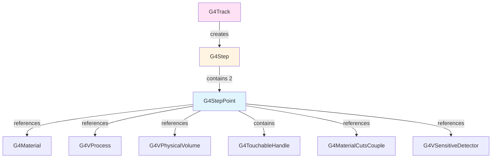
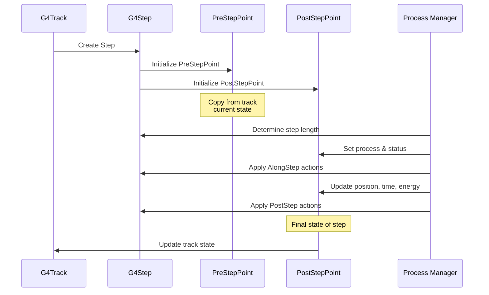

# G4StepPoint

**File**: `source/track/include/G4StepPoint.hh`

## Overview

G4StepPoint represents information associated with each end of a step in Geant4 particle tracking. Every G4Step object contains two G4StepPoint instances: one for the pre-step point and one for the post-step point. These points capture the complete space-time state of the particle at the beginning and end of each step, including position, momentum, energy, time, material properties, and process information.

## Class Description

G4StepPoint is a fundamental class in the Geant4 tracking system that stores:

- **Space-time data**: Position, local time, global time, and proper time
- **Kinematic data**: Momentum direction, kinetic energy, velocity, and relativistic factors
- **Geometry data**: Physical volume, touchable handle, and safety distance
- **Material data**: Material pointer and material cuts couple
- **Process information**: Which process defined the step and step status
- **Particle properties**: Mass, charge, magnetic moment, and polarization
- **Tracking weight**: Statistical weight for biasing schemes

## Relationship with Other Classes



## Enumerations

### G4StepStatus

Defines the source that determined the step length:

```cpp
enum G4StepStatus {
  fWorldBoundary,          // Step reached the world boundary
  fGeomBoundary,           // Step defined by a geometry boundary
  fAtRestDoItProc,         // Step defined by a PreStepDoItVector
  fAlongStepDoItProc,      // Step defined by a AlongStepDoItVector
  fPostStepDoItProc,       // Step defined by a PostStepDoItVector
  fUserDefinedLimit,       // Step defined by user limit in the logical volume
  fExclusivelyForcedProc,  // Step defined by an exclusively forced PostStepDoIt process
  fUndefined               // Step not defined yet
};
```

**File**: `source/track/include/G4StepStatus.hh`

## Constructors & Destructor

### Default Constructor

```cpp
G4StepPoint() = default;
```

Creates a G4StepPoint with default-initialized members.

**Location**: G4StepPoint.hh:59

**Note**: All numeric members are initialized to zero, pointers to nullptr.

### Copy Constructor

```cpp
G4StepPoint(const G4StepPoint&) = default;
```

Creates a copy of an existing G4StepPoint.

**Location**: G4StepPoint.hh:63

**Note**: Performs memberwise copy including the touchable handle.

### Destructor

```cpp
~G4StepPoint() = default;
```

Destroys the G4StepPoint object.

**Location**: G4StepPoint.hh:60

**Note**: Uses default destruction. The touchable handle manages its own memory.

### Assignment Operator

```cpp
G4StepPoint& operator=(const G4StepPoint&);
```

Assigns values from another G4StepPoint.

**Location**: G4StepPoint.hh:64, G4StepPoint.cc:34-61

**Implementation**: Custom implementation with self-assignment check. Copies all data members including position, times, momentum, material pointers, and process information.

## Position Methods

### GetPosition

```cpp
const G4ThreeVector& GetPosition() const;
```

Returns the position where the track is located at this step point.

**Returns**: Reference to position vector (const)

**Location**: G4StepPoint.hh:67, G4StepPoint.icc:31-34

**Units**: Default Geant4 length units (mm)

### SetPosition

```cpp
void SetPosition(const G4ThreeVector& aValue);
```

Sets the position of the step point.

**Parameters**:
- `aValue`: Position vector

**Location**: G4StepPoint.hh:68, G4StepPoint.icc:36-39

### AddPosition

```cpp
void AddPosition(const G4ThreeVector& aValue);
```

Adds a displacement to the current position.

**Parameters**:
- `aValue`: Position increment to add

**Location**: G4StepPoint.hh:69, G4StepPoint.icc:41-44

**Note**: Useful for coordinate transformations.

## Time Methods

### GetLocalTime

```cpp
G4double GetLocalTime() const;
```

Returns the time since the track was created.

**Returns**: Local time in Geant4 time units

**Location**: G4StepPoint.hh:72, G4StepPoint.icc:46-49

**Units**: Default Geant4 time units (ns)

**Definition**: Time elapsed since the particle was created (not since event start).

### SetLocalTime

```cpp
void SetLocalTime(const G4double aValue);
```

Sets the local time.

**Parameters**:
- `aValue`: Local time value

**Location**: G4StepPoint.hh:73, G4StepPoint.icc:51-54

### AddLocalTime

```cpp
void AddLocalTime(const G4double aValue);
```

Adds a time increment to the local time.

**Parameters**:
- `aValue`: Time increment to add

**Location**: G4StepPoint.hh:74, G4StepPoint.icc:56-59

### GetGlobalTime

```cpp
G4double GetGlobalTime() const;
```

Returns the time since the event started.

**Returns**: Global time in Geant4 time units

**Location**: G4StepPoint.hh:77, G4StepPoint.icc:61-64

**Units**: Default Geant4 time units (ns)

**Definition**: Time elapsed since the current event began. This includes time before the track was created.

### SetGlobalTime

```cpp
void SetGlobalTime(const G4double aValue);
```

Sets the global time.

**Parameters**:
- `aValue`: Global time value

**Location**: G4StepPoint.hh:78, G4StepPoint.icc:66-69

### AddGlobalTime

```cpp
void AddGlobalTime(const G4double aValue);
```

Adds a time increment to the global time.

**Parameters**:
- `aValue`: Time increment to add

**Location**: G4StepPoint.hh:79, G4StepPoint.icc:71-74

### GetProperTime

```cpp
G4double GetProperTime() const;
```

Returns the proper time of the particle.

**Returns**: Proper time in the particle's rest frame

**Location**: G4StepPoint.hh:82, G4StepPoint.icc:76-79

**Units**: Default Geant4 time units (ns)

**Definition**: Time measured in the particle's rest frame, accounting for relativistic time dilation.

### SetProperTime

```cpp
void SetProperTime(const G4double aValue);
```

Sets the proper time.

**Parameters**:
- `aValue`: Proper time value

**Location**: G4StepPoint.hh:83, G4StepPoint.icc:81-84

### AddProperTime

```cpp
void AddProperTime(const G4double aValue);
```

Adds a time increment to the proper time.

**Parameters**:
- `aValue`: Time increment to add

**Location**: G4StepPoint.hh:84, G4StepPoint.icc:86-89

## Momentum and Energy Methods

### GetMomentumDirection

```cpp
const G4ThreeVector& GetMomentumDirection() const;
```

Returns the direction of momentum.

**Returns**: Reference to momentum direction unit vector (const)

**Location**: G4StepPoint.hh:87, G4StepPoint.icc:91-94

**Note**: This should always be a unit vector.

### SetMomentumDirection

```cpp
void SetMomentumDirection(const G4ThreeVector& aValue);
```

Sets the momentum direction.

**Parameters**:
- `aValue`: Momentum direction (should be unit vector)

**Location**: G4StepPoint.hh:88, G4StepPoint.icc:96-99

**Important**: The caller is responsible for ensuring the vector is normalized.

### AddMomentumDirection

```cpp
void AddMomentumDirection(const G4ThreeVector& aValue);
```

Adds a vector to the momentum direction.

**Parameters**:
- `aValue`: Vector to add

**Location**: G4StepPoint.hh:89, G4StepPoint.icc:101-104

**Warning**: Result may not be normalized. Use with caution.

### GetMomentum

```cpp
G4ThreeVector GetMomentum() const;
```

Calculates and returns the total momentum vector of the track.

**Returns**: Momentum vector (computed from kinetic energy, mass, and direction)

**Location**: G4StepPoint.hh:92, G4StepPoint.icc:106-113

**Implementation**:
```cpp
G4double tMomentum = sqrt(E_k * E_k + 2 * E_k * m);
return direction * tMomentum;
```

**Units**: Default Geant4 energy/c units (MeV/c)

### GetKineticEnergy

```cpp
G4double GetKineticEnergy() const;
```

Returns the kinetic energy of the track.

**Returns**: Kinetic energy

**Location**: G4StepPoint.hh:98, G4StepPoint.icc:120-123

**Units**: Default Geant4 energy units (MeV)

### SetKineticEnergy

```cpp
void SetKineticEnergy(const G4double aValue);
```

Sets the kinetic energy.

**Parameters**:
- `aValue`: Kinetic energy value

**Location**: G4StepPoint.hh:99, G4StepPoint.icc:125-128

### AddKineticEnergy

```cpp
void AddKineticEnergy(const G4double aValue);
```

Adds an energy increment to the kinetic energy.

**Parameters**:
- `aValue`: Energy increment to add

**Location**: G4StepPoint.hh:100, G4StepPoint.icc:130-133

### GetTotalEnergy

```cpp
G4double GetTotalEnergy() const;
```

Returns the total energy (kinetic + rest mass) of the track.

**Returns**: Total energy = kinetic energy + mass

**Location**: G4StepPoint.hh:95, G4StepPoint.icc:115-118

**Formula**: E_total = E_kinetic + m

**Units**: Default Geant4 energy units (MeV)

### GetVelocity

```cpp
G4double GetVelocity() const;
```

Returns the velocity of the particle.

**Returns**: Velocity

**Location**: G4StepPoint.hh:103, G4StepPoint.icc:135-138

**Units**: Default Geant4 velocity units (mm/ns)

### SetVelocity

```cpp
void SetVelocity(G4double v);
```

Sets the velocity of the particle.

**Parameters**:
- `v`: Velocity value

**Location**: G4StepPoint.hh:104, G4StepPoint.icc:140-143

### GetBeta

```cpp
G4double GetBeta() const;
```

Returns the velocity in units of the speed of light (β = v/c).

**Returns**: Dimensionless velocity (0 to 1)

**Location**: G4StepPoint.hh:107, G4StepPoint.icc:145-148

**Formula**: β = v / c

**Range**: [0, 1] where 0 is at rest and 1 is the speed of light

### GetGamma

```cpp
G4double GetGamma() const;
```

Returns the Lorentz gamma factor.

**Returns**: Gamma factor γ = 1/√(1-β²)

**Location**: G4StepPoint.hh:110, G4StepPoint.icc:150-154

**Formula**: γ = (E_kinetic + m) / m

**Special Case**: Returns DBL_MAX for massless particles (m = 0)

**Range**: [1, ∞) where 1 is at rest

## Geometry and Material Methods

### GetPhysicalVolume

```cpp
G4VPhysicalVolume* GetPhysicalVolume() const;
```

Returns the physical volume at this step point.

**Returns**: Pointer to the physical volume

**Location**: G4StepPoint.hh:113, G4StepPoint.icc:156-159

**Implementation**: Returns the volume from the touchable handle.

### GetTouchable

```cpp
const G4VTouchable* GetTouchable() const;
```

Returns the touchable at this step point.

**Returns**: Pointer to touchable (const)

**Location**: G4StepPoint.hh:115, G4StepPoint.icc:161-164

**Note**: Touchables provide navigation history in the geometry tree.

### GetTouchableHandle

```cpp
const G4TouchableHandle& GetTouchableHandle() const;
```

Returns the touchable handle.

**Returns**: Reference to touchable handle (const)

**Location**: G4StepPoint.hh:116, G4StepPoint.icc:166-169

**Note**: The handle provides reference-counted access to the touchable.

### SetTouchableHandle

```cpp
void SetTouchableHandle(const G4TouchableHandle& apValue);
```

Sets the touchable handle.

**Parameters**:
- `apValue`: Touchable handle to set

**Location**: G4StepPoint.hh:117, G4StepPoint.icc:171-174

### GetMaterial

```cpp
G4Material* GetMaterial() const;
```

Returns the material at this step point.

**Returns**: Pointer to G4Material

**Location**: G4StepPoint.hh:119, G4StepPoint.icc:253-256

**See Also**: [G4Material](../../materials/api/g4material.md)

### SetMaterial

```cpp
void SetMaterial(G4Material*);
```

Sets the material pointer.

**Parameters**:
- `material`: Pointer to G4Material

**Location**: G4StepPoint.hh:120, G4StepPoint.icc:258-261

### GetMaterialCutsCouple

```cpp
const G4MaterialCutsCouple* GetMaterialCutsCouple() const;
```

Returns the material cuts couple at this step point.

**Returns**: Pointer to G4MaterialCutsCouple (const)

**Location**: G4StepPoint.hh:122, G4StepPoint.icc:263-266

**Note**: The material cuts couple combines material properties with production cuts for secondary particles.

### SetMaterialCutsCouple

```cpp
void SetMaterialCutsCouple(const G4MaterialCutsCouple*);
```

Sets the material cuts couple.

**Parameters**:
- `materialCutsCouple`: Pointer to G4MaterialCutsCouple

**Location**: G4StepPoint.hh:123, G4StepPoint.icc:268-272

### GetSensitiveDetector

```cpp
G4VSensitiveDetector* GetSensitiveDetector() const;
```

Returns the sensitive detector associated with the volume at this step point.

**Returns**: Pointer to G4VSensitiveDetector, or nullptr if none

**Location**: G4StepPoint.hh:125, G4StepPoint.icc:274-277

### SetSensitiveDetector

```cpp
void SetSensitiveDetector(G4VSensitiveDetector*);
```

Sets the sensitive detector pointer.

**Parameters**:
- `aValue`: Pointer to G4VSensitiveDetector

**Location**: G4StepPoint.hh:126, G4StepPoint.icc:279-282

### GetSafety

```cpp
G4double GetSafety() const;
```

Returns the safety distance at this step point.

**Returns**: Safety distance

**Location**: G4StepPoint.hh:128, G4StepPoint.icc:176-179

**Units**: Default Geant4 length units (mm)

**Definition**: The safety is the distance to the nearest volume boundary. Within this distance, the particle can move in any direction without hitting a boundary.

### SetSafety

```cpp
void SetSafety(const G4double aValue);
```

Sets the safety distance.

**Parameters**:
- `aValue`: Safety distance value

**Location**: G4StepPoint.hh:129, G4StepPoint.icc:181-184

## Process and Status Methods

### GetStepStatus

```cpp
G4StepStatus GetStepStatus() const;
```

Returns the step status indicating what limited the step.

**Returns**: G4StepStatus enumeration value

**Location**: G4StepPoint.hh:135, G4StepPoint.icc:201-204

**See**: G4StepStatus enumeration for possible values

### SetStepStatus

```cpp
void SetStepStatus(const G4StepStatus aValue);
```

Sets the step status.

**Parameters**:
- `aValue`: Step status value

**Location**: G4StepPoint.hh:136, G4StepPoint.icc:206-209

### GetProcessDefinedStep

```cpp
const G4VProcess* GetProcessDefinedStep() const;
```

Returns the process that defined this step.

**Returns**: Pointer to G4VProcess (const), or nullptr

**Location**: G4StepPoint.hh:138, G4StepPoint.icc:211-216

**Important**: If the pointer is nullptr, this means the step was defined by a user-defined limit in the current volume, not by a physics process.

### SetProcessDefinedStep

```cpp
void SetProcessDefinedStep(const G4VProcess* aValue);
```

Sets the process that defined the step.

**Parameters**:
- `aValue`: Pointer to G4VProcess

**Location**: G4StepPoint.hh:141, G4StepPoint.icc:218-221

## Particle Property Methods

### GetMass

```cpp
G4double GetMass() const;
```

Returns the dynamical mass of the particle.

**Returns**: Particle mass

**Location**: G4StepPoint.hh:143, G4StepPoint.icc:223-226

**Units**: Default Geant4 energy units (MeV/c²)

**Note**: This is the dynamical mass, which may differ from the particle definition mass in some cases.

### SetMass

```cpp
void SetMass(G4double value);
```

Sets the particle mass.

**Parameters**:
- `value`: Mass value

**Location**: G4StepPoint.hh:144, G4StepPoint.icc:228-231

### GetCharge

```cpp
G4double GetCharge() const;
```

Returns the dynamical charge of the particle.

**Returns**: Particle charge

**Location**: G4StepPoint.hh:146, G4StepPoint.icc:233-236

**Units**: Units of elementary charge (e)

### SetCharge

```cpp
void SetCharge(G4double value);
```

Sets the particle charge.

**Parameters**:
- `value`: Charge value

**Location**: G4StepPoint.hh:147, G4StepPoint.icc:238-241

### GetMagneticMoment

```cpp
G4double GetMagneticMoment() const;
```

Returns the dynamical magnetic moment of the particle.

**Returns**: Magnetic moment

**Location**: G4StepPoint.hh:149, G4StepPoint.icc:243-246

**Units**: Default Geant4 magnetic moment units

### SetMagneticMoment

```cpp
void SetMagneticMoment(G4double value);
```

Sets the magnetic moment.

**Parameters**:
- `value`: Magnetic moment value

**Location**: G4StepPoint.hh:150, G4StepPoint.icc:248-251

## Polarization Methods

### GetPolarization

```cpp
const G4ThreeVector& GetPolarization() const;
```

Returns the polarization vector of the particle.

**Returns**: Reference to polarization vector (const)

**Location**: G4StepPoint.hh:131, G4StepPoint.icc:186-189

**Note**: Used for polarized particle tracking.

### SetPolarization

```cpp
void SetPolarization(const G4ThreeVector& aValue);
```

Sets the polarization vector.

**Parameters**:
- `aValue`: Polarization vector

**Location**: G4StepPoint.hh:132, G4StepPoint.icc:191-194

### AddPolarization

```cpp
void AddPolarization(const G4ThreeVector& aValue);
```

Adds a vector to the polarization.

**Parameters**:
- `aValue`: Vector to add

**Location**: G4StepPoint.hh:133, G4StepPoint.icc:196-199

## Weight Methods

### GetWeight

```cpp
G4double GetWeight() const;
```

Returns the track weight.

**Returns**: Statistical weight

**Location**: G4StepPoint.hh:153, G4StepPoint.icc:289-292

**Default**: 1.0

**Note**: Used in variance reduction techniques and biasing schemes.

### SetWeight

```cpp
void SetWeight(G4double aValue);
```

Sets the track weight.

**Parameters**:
- `aValue`: Weight value

**Location**: G4StepPoint.hh:152, G4StepPoint.icc:284-287

## Data Members

### Position and Time

```cpp
G4ThreeVector fPosition;           // Position of the step point
G4double fGlobalTime = 0.0;        // Time since event creation
G4double fLocalTime = 0.0;         // Time since track creation
G4double fProperTime = 0.0;        // Time in particle's rest frame
```

**Location**: G4StepPoint.hh:157-163

### Momentum and Energy

```cpp
G4ThreeVector fMomentumDirection;  // Direction of momentum (unit vector)
G4double fKineticEnergy = 0.0;     // Kinetic energy
G4double fVelocity = 0.0;          // Velocity
```

**Location**: G4StepPoint.hh:164-167

### Geometry and Material

```cpp
G4TouchableHandle fpTouchable;                     // Touchable handle
G4Material* fpMaterial = nullptr;                  // Material pointer
const G4MaterialCutsCouple* fpMaterialCutsCouple = nullptr;  // Cuts couple
G4VSensitiveDetector* fpSensitiveDetector = nullptr;  // Sensitive detector
G4double fSafety = 0.0;                           // Safety distance
```

**Location**: G4StepPoint.hh:168-175

### Particle Properties

```cpp
G4ThreeVector fPolarization;       // Particle polarization
G4double fMass = 0.0;              // Dynamical mass
G4double fCharge = 0.0;            // Dynamical charge
G4double fMagneticMoment = 0.0;    // Dynamical magnetic moment
G4double fWeight = 0.0;            // Track weight
```

**Location**: G4StepPoint.hh:176, 181-188

### Process Information

```cpp
G4StepStatus fStepStatus = fUndefined;              // Step status
const G4VProcess* fpProcessDefinedStep = nullptr;   // Process that defined step
```

**Location**: G4StepPoint.hh:177-180

## Step Point Workflow



## Usage Examples

### Accessing Step Point Information in User Actions

```cpp
void MySteppingAction::UserSteppingAction(const G4Step* step) {
    // Get pre-step and post-step points
    G4StepPoint* preStepPoint = step->GetPreStepPoint();
    G4StepPoint* postStepPoint = step->GetPostStepPoint();

    // Access position information
    G4ThreeVector prePosition = preStepPoint->GetPosition();
    G4ThreeVector postPosition = postStepPoint->GetPosition();
    G4double stepLength = (postPosition - prePosition).mag();

    G4cout << "Step from " << prePosition << " to " << postPosition
           << " (length: " << stepLength/mm << " mm)" << G4endl;
}
```

### Analyzing Energy Deposition

```cpp
void MySteppingAction::UserSteppingAction(const G4Step* step) {
    G4StepPoint* preStepPoint = step->GetPreStepPoint();
    G4StepPoint* postStepPoint = step->GetPostStepPoint();

    // Calculate energy deposition
    G4double preKE = preStepPoint->GetKineticEnergy();
    G4double postKE = postStepPoint->GetKineticEnergy();
    G4double energyDeposit = preKE - postKE;

    // Get material information
    G4Material* material = preStepPoint->GetMaterial();

    G4cout << "Energy deposited: " << energyDeposit/MeV << " MeV in "
           << material->GetName() << G4endl;
}
```

### Checking Geometry Boundaries

```cpp
void MySteppingAction::UserSteppingAction(const G4Step* step) {
    G4StepPoint* postStepPoint = step->GetPostStepPoint();

    // Check if particle crossed a boundary
    if (postStepPoint->GetStepStatus() == fGeomBoundary) {
        G4VPhysicalVolume* preVolume =
            step->GetPreStepPoint()->GetPhysicalVolume();
        G4VPhysicalVolume* postVolume =
            postStepPoint->GetPhysicalVolume();

        G4cout << "Crossed boundary from " << preVolume->GetName()
               << " to " << postVolume->GetName() << G4endl;
    }
}
```

### Identifying Process Information

```cpp
void MySteppingAction::UserSteppingAction(const G4Step* step) {
    G4StepPoint* postStepPoint = step->GetPostStepPoint();

    // Get the process that defined the step
    const G4VProcess* process = postStepPoint->GetProcessDefinedStep();

    if (process) {
        G4cout << "Step limited by process: " << process->GetProcessName()
               << G4endl;
    } else {
        G4cout << "Step limited by user-defined limit" << G4endl;
    }

    // Check step status
    G4StepStatus status = postStepPoint->GetStepStatus();
    switch(status) {
        case fWorldBoundary:
            G4cout << "Reached world boundary" << G4endl;
            break;
        case fGeomBoundary:
            G4cout << "Reached geometry boundary" << G4endl;
            break;
        case fPostStepDoItProc:
            G4cout << "Limited by discrete process" << G4endl;
            break;
        default:
            break;
    }
}
```

### Working with Time Information

```cpp
void MySteppingAction::UserSteppingAction(const G4Step* step) {
    G4StepPoint* postStepPoint = step->GetPostStepPoint();

    // Get different time measurements
    G4double globalTime = postStepPoint->GetGlobalTime();
    G4double localTime = postStepPoint->GetLocalTime();
    G4double properTime = postStepPoint->GetProperTime();

    G4cout << "Global time: " << globalTime/ns << " ns" << G4endl;
    G4cout << "Local time: " << localTime/ns << " ns" << G4endl;
    G4cout << "Proper time: " << properTime/ns << " ns" << G4endl;

    // For relativistic particles, proper time differs from local time
    G4double beta = postStepPoint->GetBeta();
    G4double gamma = postStepPoint->GetGamma();
    G4cout << "β = " << beta << ", γ = " << gamma << G4endl;
}
```

### Accessing Relativistic Quantities

```cpp
void MySteppingAction::UserSteppingAction(const G4Step* step) {
    G4StepPoint* postStepPoint = step->GetPostStepPoint();

    // Get energy and momentum
    G4double kineticE = postStepPoint->GetKineticEnergy();
    G4double totalE = postStepPoint->GetTotalEnergy();
    G4ThreeVector momentum = postStepPoint->GetMomentum();
    G4double momentumMag = momentum.mag();

    // Get relativistic factors
    G4double velocity = postStepPoint->GetVelocity();
    G4double beta = postStepPoint->GetBeta();
    G4double gamma = postStepPoint->GetGamma();

    G4cout << "Kinetic energy: " << kineticE/MeV << " MeV" << G4endl;
    G4cout << "Total energy: " << totalE/MeV << " MeV" << G4endl;
    G4cout << "Momentum: " << momentumMag/(MeV) << " MeV/c" << G4endl;
    G4cout << "Velocity: " << velocity/(mm/ns) << " mm/ns" << G4endl;
    G4cout << "β = " << beta << ", γ = " << gamma << G4endl;
}
```

### Using Safety for Optimization

```cpp
void MySteppingAction::UserSteppingAction(const G4Step* step) {
    G4StepPoint* postStepPoint = step->GetPostStepPoint();

    // Get safety distance
    G4double safety = postStepPoint->GetSafety();

    if (safety > 1.0*cm) {
        G4cout << "Particle is far from boundaries (safety = "
               << safety/cm << " cm)" << G4endl;
        // Can potentially take larger steps
    } else {
        G4cout << "Particle is near boundary (safety = "
               << safety/mm << " mm)" << G4endl;
        // Need careful navigation
    }
}
```

### Working with Sensitive Detectors

```cpp
void MySteppingAction::UserSteppingAction(const G4Step* step) {
    G4StepPoint* preStepPoint = step->GetPreStepPoint();
    G4StepPoint* postStepPoint = step->GetPostStepPoint();

    // Check if we're in a sensitive detector
    G4VSensitiveDetector* sd = postStepPoint->GetSensitiveDetector();

    if (sd) {
        G4cout << "In sensitive detector: " << sd->GetName() << G4endl;

        // Access material information
        G4Material* material = postStepPoint->GetMaterial();
        G4double density = material->GetDensity();

        G4cout << "Material: " << material->GetName()
               << " (density: " << density/(g/cm3) << " g/cm3)" << G4endl;
    }
}
```

### Tracking Particle Properties

```cpp
void MySteppingAction::UserSteppingAction(const G4Step* step) {
    G4StepPoint* postStepPoint = step->GetPostStepPoint();

    // Get particle properties from step point
    G4double mass = postStepPoint->GetMass();
    G4double charge = postStepPoint->GetCharge();
    G4double weight = postStepPoint->GetWeight();

    G4cout << "Particle mass: " << mass/MeV << " MeV/c²" << G4endl;
    G4cout << "Particle charge: " << charge/eplus << " e" << G4endl;
    G4cout << "Track weight: " << weight << G4endl;

    // Check for importance biasing
    if (weight != 1.0) {
        G4cout << "Track is biased with weight " << weight << G4endl;
    }
}
```

## Thread Safety

G4StepPoint is **not thread-safe** for concurrent modification. However, in Geant4's multi-threaded mode:

- Each worker thread maintains its own tracking stack and step objects
- G4StepPoint objects are created and used within a single thread
- Read-only access to step points in const contexts is safe
- Pointers to shared read-only objects (materials, volumes, processes) are thread-safe

**Important Guidelines**:
- Do not share G4StepPoint objects between threads
- Do not modify G4StepPoint objects from multiple threads
- Access to referenced shared objects (G4Material, G4VProcess) is safe if they are const

## Performance Considerations

### Memory Layout

G4StepPoint uses inline methods extensively for performance:
- Position, time, and energy accessors are inline for zero overhead
- Total size is approximately 200-250 bytes per instance
- Two instances per step (pre and post)

### Calculation Overhead

Some methods involve computation:
- `GetMomentum()`: Calculates momentum from kinetic energy and mass
- `GetTotalEnergy()`: Simple addition of kinetic energy and mass
- `GetGamma()`: Division operation, handles massless particle case
- `GetBeta()`: Division by speed of light constant

**Recommendation**: If you need these values multiple times, store them in local variables.

### Example: Efficient Access

```cpp
// Less efficient - multiple calculations
for (int i = 0; i < 1000; ++i) {
    Process(postStepPoint->GetMomentum(),
            postStepPoint->GetTotalEnergy());
}

// More efficient - calculate once
G4ThreeVector momentum = postStepPoint->GetMomentum();
G4double totalEnergy = postStepPoint->GetTotalEnergy();
for (int i = 0; i < 1000; ++i) {
    Process(momentum, totalEnergy);
}
```

## Common Pitfalls and Best Practices

### Pitfall 1: Modifying Pre-Step Point

```cpp
// WRONG - Don't modify pre-step point in user code
G4StepPoint* preStepPoint = step->GetPreStepPoint();
preStepPoint->SetKineticEnergy(newEnergy);  // Bad!
```

**Best Practice**: The pre-step point represents the state before the step. Modifications should be done through physics processes or by modifying the post-step point and track.

### Pitfall 2: Dereferencing Null Process Pointer

```cpp
// WRONG - Process can be nullptr
const G4VProcess* process = postStepPoint->GetProcessDefinedStep();
G4String name = process->GetProcessName();  // May crash!

// CORRECT
const G4VProcess* process = postStepPoint->GetProcessDefinedStep();
if (process) {
    G4String name = process->GetProcessName();
} else {
    // Step limited by user-defined limit
}
```

### Pitfall 3: Comparing Floating Point Times Directly

```cpp
// WRONG - Direct floating point comparison
if (postStepPoint->GetGlobalTime() == targetTime) { ... }

// CORRECT - Use tolerance
const G4double tolerance = 1.0e-9 * ns;
if (std::abs(postStepPoint->GetGlobalTime() - targetTime) < tolerance) { ... }
```

### Pitfall 4: Assuming Normalized Momentum Direction

```cpp
// After using AddMomentumDirection, vector may not be normalized
postStepPoint->AddMomentumDirection(delta);
G4ThreeVector dir = postStepPoint->GetMomentumDirection();
// dir may not be a unit vector!

// If you need a unit vector after modification:
postStepPoint->SetMomentumDirection(dir.unit());
```

### Best Practice: Const Correctness

```cpp
// Use const pointers when only reading
void AnalyzeStep(const G4Step* step) {
    const G4StepPoint* preStepPoint = step->GetPreStepPoint();
    const G4StepPoint* postStepPoint = step->GetPostStepPoint();

    // Now you can't accidentally modify them
    G4ThreeVector pos = preStepPoint->GetPosition();
    // preStepPoint->SetPosition(pos);  // Won't compile
}
```

## Related Classes

### Core Tracking Classes
- [G4Step](./g4step.md) - Contains pre-step and post-step points
- [G4Track](./g4track.md) - Represents a particle being tracked
- [G4TrackStatus](./g4trackstatus.md) - Track status enumeration

### Geometry Classes
- [G4VPhysicalVolume](../geometry/api/g4vphysicalvolume.md) - Physical volume reference
- [G4TouchableHandle](../geometry/api/g4touchablehandle.md) - Navigation history
- [G4VTouchable](../geometry/api/g4vtouchable.md) - Touchable interface

### Material Classes
- [G4Material](../../materials/api/g4material.md) - Material properties
- [G4MaterialCutsCouple](../particles/api/g4materialcutscouple.md) - Material with production cuts

### Process Classes
- [G4VProcess](../processes/api/g4vprocess.md) - Base class for physics processes
- [G4ProcessManager](../processes/api/g4processmanager.md) - Manages processes for particle types

### Detector Classes
- [G4VSensitiveDetector](../detector/api/g4vsensitivedetector.md) - Sensitive detector interface

## See Also

- [Track Module Overview](../index.md) - Overview of the track module
- [Stepping in Geant4](../guides/stepping.md) - Detailed guide to stepping mechanism
- [User Actions](../guides/user-actions.md) - How to use step points in user code
- [Geometry Navigation](../../geometry/guides/navigation.md) - Understanding touchables and navigation

## Version History

**Author**: Hisaya Kurashige, 16 February 2000

**Location**:
- Header: `source/track/include/G4StepPoint.hh`
- Inline Implementation: `source/track/include/G4StepPoint.icc`
- Source: `source/track/src/G4StepPoint.cc`

Key implementation notes:
- Uses default constructor and destructor
- Custom assignment operator with self-assignment check
- Extensive use of inline methods for performance
- Proper handling of shared pointers (touchable handle)
- Careful design for use in multi-threaded environment
