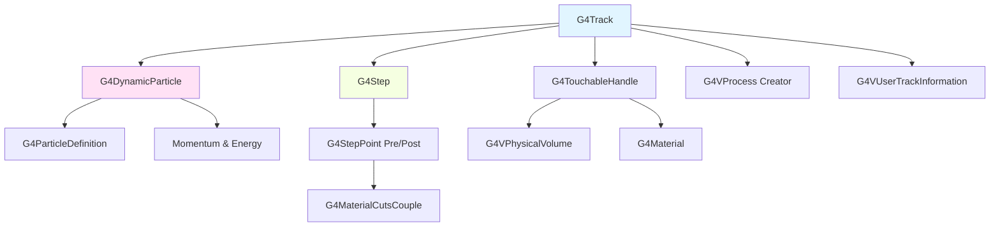
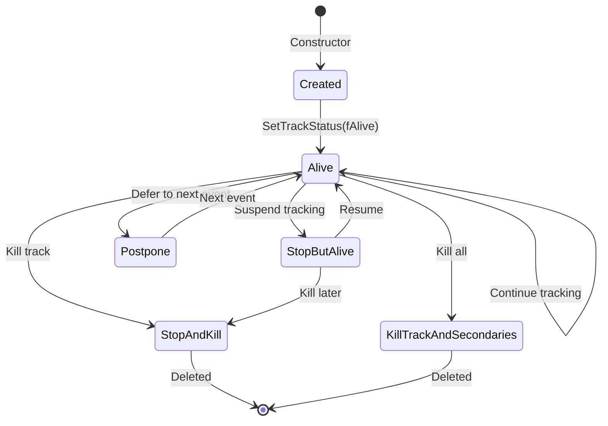

# G4Track

**File**: `source/track/include/G4Track.hh`

## Overview

G4Track is the central class in Geant4's tracking system, representing a particle under active tracking. It encapsulates all information about a particle's current state, history, and relationship to the detector geometry. The track contains both transient information (current position, momentum, time) and persistent information (vertex conditions, creator process, parent ID).

## Class Description

G4Track describes the complete state of a particle being tracked through the detector simulation. It includes:

- **Current state**: Position, time, momentum, energy, and polarization
- **Particle information**: Dynamic particle properties and particle definition
- **Geometry information**: Current volume, material, and touchable handle
- **History information**: Vertex position, creator process, parent track
- **Tracking control**: Track status, step information, and tracking flags
- **User extensions**: Custom user information and auxiliary data

The G4Track object is continuously updated during tracking as the particle moves through the detector, interacts with materials, and undergoes physics processes.

## Architecture Diagram



## Constructors & Destructor

### Default Constructor

```cpp
G4Track();
```

Creates an empty track object with default values.

**Location**: G4Track.hh:68

**Note**: Typically not used directly. Tracks are usually created with particle and position information.

### Constructor (with DynamicParticle)

```cpp
G4Track(G4DynamicParticle* apValueDynamicParticle,
        G4double aValueTime,
        const G4ThreeVector& aValuePosition);
```

Creates a track with specified particle, time, and position.

**Parameters**:
- `apValueDynamicParticle`: Pointer to the dynamic particle (takes ownership)
- `aValueTime`: Global time (time since event creation)
- `aValuePosition`: Initial 3D position in global coordinates

**Location**: G4Track.hh:70-72

**Usage**: This is the standard constructor used when creating primary tracks or secondary particles.

**Example**:
```cpp
// Create a dynamic particle
G4DynamicParticle* dynamicParticle = new G4DynamicParticle(
    particleDefinition,
    G4ThreeVector(0, 0, 1),  // momentum direction
    kineticEnergy
);

// Create track at origin with global time 0
G4Track* track = new G4Track(dynamicParticle, 0.0*ns, G4ThreeVector(0, 0, 0));
```

### Copy Constructor

```cpp
G4Track(const G4Track&, G4bool copyTouchables = true);
```

Creates a copy of a track, optionally copying touchable handles.

**Parameters**:
- Track to copy (unnamed)
- `copyTouchables`: If true, copies touchable handles; if false, omits them (default: true)

**Location**: G4Track.hh:75-76

**Note**: Copies track information but not tracking state (e.g., step number is reset).

### Destructor

```cpp
~G4Track();
```

Destroys the track object and deletes the associated dynamic particle.

**Location**: G4Track.hh:78

**Note**: The destructor also cleans up auxiliary track information.

## Memory Management

### operator new

```cpp
inline void* operator new(std::size_t);
```

Allocates memory using G4Allocator for efficient track object management.

**Location**: G4Track.hh:81, G4Track.icc:41-48

**Note**: Uses a specialized allocator to minimize memory allocation overhead during tracking.

### operator delete

```cpp
inline void operator delete(void* aTrack);
```

Deallocates memory back to the G4Allocator pool.

**Location**: G4Track.hh:83, G4Track.icc:50-53

## Assignment and Comparison Operators

### Assignment Operator

```cpp
G4Track& operator=(const G4Track&);
```

Assigns one track to another.

**Location**: G4Track.hh:86

### Equality Operators

```cpp
inline G4bool operator==(const G4Track&);
inline G4bool operator!=(const G4Track&);
```

Compares tracks by address (pointer comparison).

**Location**: G4Track.hh:89-90, G4Track.icc:55-63

**Note**: Two tracks are equal only if they are the same object in memory.

### CopyTrackInfo

```cpp
void CopyTrackInfo(const G4Track&, G4bool copyTouchables = true);
```

Copies track information from another track without copying tracking state.

**Parameters**:
- Track to copy from (unnamed)
- `copyTouchables`: Whether to copy touchable handles (default: true)

**Location**: G4Track.hh:93-94

## Track Identification

### GetTrackID / SetTrackID

```cpp
inline G4int GetTrackID() const;
inline void SetTrackID(const G4int aValue);
```

Gets or sets the unique track ID.

**Location**: G4Track.hh:96-97, G4Track.icc:95-103

**Note**: Track ID 0 is reserved for error conditions. Primary particles typically start with ID 1.

**Example**:
```cpp
G4int trackID = track->GetTrackID();
if (trackID == 1) {
    // This is a primary particle
}
```

### GetParentID / SetParentID

```cpp
inline G4int GetParentID() const;
inline void SetParentID(const G4int aValue);
```

Gets or sets the parent track ID.

**Location**: G4Track.hh:100-101, G4Track.icc:84-92

**Note**: Parent ID 0 indicates a primary particle (no parent). For secondary particles, this is the ID of the track that created them.

**Example**:
```cpp
if (track->GetParentID() == 0) {
    // Primary particle from event generator
} else {
    G4cout << "Created by track " << track->GetParentID() << G4endl;
}
```

## Particle Information

### GetDynamicParticle

```cpp
inline const G4DynamicParticle* GetDynamicParticle() const;
```

Returns a pointer to the associated dynamic particle.

**Returns**: Const pointer to G4DynamicParticle containing particle state

**Location**: G4Track.hh:103-104, G4Track.icc:66-69

**Usage**: Access detailed particle properties like charge, magnetic moment, pre-assigned decay time, etc.

### GetParticleDefinition

```cpp
inline const G4ParticleDefinition* GetParticleDefinition() const;
```

Returns the particle definition (particle type).

**Returns**: Const pointer to G4ParticleDefinition

**Location**: G4Track.hh:106-107, G4Track.icc:78-81

**Example**:
```cpp
const G4ParticleDefinition* particleDef = track->GetParticleDefinition();
G4String particleName = particleDef->GetParticleName();
G4int pdgEncoding = particleDef->GetPDGEncoding();
```

### GetDefinition

```cpp
inline G4ParticleDefinition* GetDefinition() const;
```

Returns the particle definition (non-const version).

**Returns**: Pointer to G4ParticleDefinition

**Location**: G4Track.hh:108-109, G4Track.icc:72-75

**Note**: Obsolete method provided for backwards compatibility. Prefer GetParticleDefinition().

## Position and Time

### GetPosition / SetPosition

```cpp
inline const G4ThreeVector& GetPosition() const;
inline void SetPosition(const G4ThreeVector& aValue);
```

Gets or sets the current particle position in global coordinates.

**Location**: G4Track.hh:111-112, G4Track.icc:106-114

**Example**:
```cpp
G4ThreeVector pos = track->GetPosition();
G4double r = pos.mag();  // Distance from origin
G4double x = pos.x();
G4double y = pos.y();
G4double z = pos.z();
```

### GetGlobalTime / SetGlobalTime

```cpp
inline G4double GetGlobalTime() const;
inline void SetGlobalTime(const G4double aValue);
```

Gets or sets the global time since the event started.

**Returns**: Time in Geant4 internal units (typically ns)

**Location**: G4Track.hh:115-116, G4Track.icc:117-125

**Note**: Global time accumulates from the beginning of the event and includes all delays from particle creation.

**Example**:
```cpp
G4double globalTime = track->GetGlobalTime();
if (globalTime > 100*ns) {
    // Late-arriving particle
}
```

### GetLocalTime / SetLocalTime

```cpp
inline G4double GetLocalTime() const;
inline void SetLocalTime(const G4double aValue);
```

Gets or sets the local time since the track was created.

**Returns**: Time in Geant4 internal units (typically ns)

**Location**: G4Track.hh:119-120, G4Track.icc:128-136

**Note**: Local time is reset to zero when the track is created and measures only this track's lifetime.

**Example**:
```cpp
G4double localTime = track->GetLocalTime();
G4double globalTime = track->GetGlobalTime();
// Time when track was created:
G4double creationTime = globalTime - localTime;
```

### GetProperTime / SetProperTime

```cpp
inline G4double GetProperTime() const;
inline void SetProperTime(const G4double aValue);
```

Gets or sets the proper time of the particle (in its rest frame).

**Returns**: Proper time in Geant4 internal units

**Location**: G4Track.hh:123-124, G4Track.icc:139-147

**Note**: Proper time accounts for time dilation effects. Delegated to G4DynamicParticle.

## Volume and Material Access

### GetVolume / GetNextVolume

```cpp
inline G4VPhysicalVolume* GetVolume() const;
inline G4VPhysicalVolume* GetNextVolume() const;
```

Gets the current or next physical volume.

**Returns**: Pointer to G4VPhysicalVolume, or nullptr if not available

**Location**: G4Track.hh:127-128, G4Track.icc:179-187

**Usage**:
- `GetVolume()`: Returns the volume where the particle currently is
- `GetNextVolume()`: Returns the volume the particle is entering (during geometry boundary crossing)

**Example**:
```cpp
G4VPhysicalVolume* currentVolume = track->GetVolume();
if (currentVolume) {
    G4String volumeName = currentVolume->GetName();
    G4LogicalVolume* logVol = currentVolume->GetLogicalVolume();
}
```

### GetMaterial / GetNextMaterial

```cpp
inline G4Material* GetMaterial() const;
inline G4Material* GetNextMaterial() const;
```

Gets the current or next material.

**Returns**: Pointer to G4Material

**Location**: G4Track.hh:131-132, G4Track.icc:200-208

**Note**: Requires fpStep to be set. These methods access material through the step points.

**Example**:
```cpp
G4Material* material = track->GetMaterial();
G4String matName = material->GetName();
G4double density = material->GetDensity();

// Check for boundary crossing
G4Material* nextMat = track->GetNextMaterial();
if (nextMat != material) {
    // Particle is crossing material boundary
}
```

### GetMaterialCutsCouple / GetNextMaterialCutsCouple

```cpp
inline const G4MaterialCutsCouple* GetMaterialCutsCouple() const;
inline const G4MaterialCutsCouple* GetNextMaterialCutsCouple() const;
```

Gets the current or next material-cuts couple.

**Returns**: Const pointer to G4MaterialCutsCouple

**Location**: G4Track.hh:134-135, G4Track.icc:190-198

**Note**: MaterialCutsCouple combines material with production cuts for that region.

### Touchable Handles

#### Current Touchable

```cpp
inline const G4VTouchable* GetTouchable() const;
inline const G4TouchableHandle& GetTouchableHandle() const;
inline void SetTouchableHandle(const G4TouchableHandle& apValue);
```

Gets or sets the current touchable (geometry navigation state).

**Location**: G4Track.hh:137-139, G4Track.icc:211-224

**Usage**: Touchable provides the complete geometry hierarchy (world → daughter → granddaughter...).

#### Next Touchable

```cpp
inline const G4VTouchable* GetNextTouchable() const;
inline const G4TouchableHandle& GetNextTouchableHandle() const;
inline void SetNextTouchableHandle(const G4TouchableHandle& apValue);
```

Gets or sets the next touchable (for geometry boundary crossing).

**Location**: G4Track.hh:141-143, G4Track.icc:226-239

#### Origin Touchable

```cpp
inline const G4VTouchable* GetOriginTouchable() const;
inline const G4TouchableHandle& GetOriginTouchableHandle() const;
inline void SetOriginTouchableHandle(const G4TouchableHandle& apValue);
```

Gets or sets the touchable at the track's origin (vertex).

**Location**: G4Track.hh:145-147, G4Track.icc:241-254

**Example**:
```cpp
const G4VTouchable* touchable = track->GetTouchable();
G4int depth = touchable->GetHistoryDepth();
for (G4int i = 0; i <= depth; ++i) {
    G4VPhysicalVolume* vol = touchable->GetVolume(i);
    G4cout << "Level " << i << ": " << vol->GetName() << G4endl;
}
```

## Energy and Momentum

### GetKineticEnergy / SetKineticEnergy

```cpp
inline G4double GetKineticEnergy() const;
inline void SetKineticEnergy(const G4double aValue);
```

Gets or sets the kinetic energy.

**Returns**: Kinetic energy in Geant4 internal units (typically MeV)

**Location**: G4Track.hh:149-151, G4Track.icc:257-265

**Note**: Delegated to G4DynamicParticle.

**Example**:
```cpp
G4double kinE = track->GetKineticEnergy();
if (kinE < 1*keV) {
    // Low energy particle
    track->SetTrackStatus(fStopAndKill);
}
```

### GetTotalEnergy

```cpp
inline G4double GetTotalEnergy() const;
```

Gets the total energy (kinetic + rest mass energy).

**Returns**: Total energy in Geant4 internal units (typically MeV)

**Location**: G4Track.hh:150, G4Track.icc:268-271

**Example**:
```cpp
G4double totalE = track->GetTotalEnergy();
G4double mass = track->GetParticleDefinition()->GetPDGMass();
G4double kinE = totalE - mass;
```

### GetMomentum

```cpp
inline G4ThreeVector GetMomentum() const;
```

Gets the momentum vector.

**Returns**: 3D momentum vector in Geant4 internal units

**Location**: G4Track.hh:154, G4Track.icc:274-277

**Example**:
```cpp
G4ThreeVector momentum = track->GetMomentum();
G4double px = momentum.x();
G4double py = momentum.y();
G4double pz = momentum.z();
G4double p = momentum.mag();
```

### GetMomentumDirection / SetMomentumDirection

```cpp
inline const G4ThreeVector& GetMomentumDirection() const;
inline void SetMomentumDirection(const G4ThreeVector& aValue);
```

Gets or sets the momentum direction (unit vector).

**Returns**: Reference to normalized 3D direction vector

**Location**: G4Track.hh:155-156, G4Track.icc:280-288

**Example**:
```cpp
G4ThreeVector dir = track->GetMomentumDirection();
G4double theta = dir.theta();  // Polar angle
G4double phi = dir.phi();      // Azimuthal angle

// Scatter the particle
G4ThreeVector newDir(sin(theta)*cos(phi+0.1),
                     sin(theta)*sin(phi+0.1),
                     cos(theta));
track->SetMomentumDirection(newDir);
```

## Velocity

### GetVelocity / SetVelocity

```cpp
inline G4double GetVelocity() const;
inline void SetVelocity(G4double val);
```

Gets or sets the particle velocity.

**Returns**: Velocity in Geant4 internal units (mm/ns)

**Location**: G4Track.hh:159-160, G4Track.icc:150-166

**Note**: For optical photons, velocity is calculated from refractive index. For other particles, computed from beta.

**Example**:
```cpp
G4double velocity = track->GetVelocity();
G4double beta = velocity / CLHEP::c_light;
G4double timeToTravel = distance / velocity;
```

### CalculateVelocity

```cpp
inline G4double CalculateVelocity() const;
```

Calculates and returns the velocity.

**Returns**: Velocity in Geant4 internal units

**Location**: G4Track.hh:163, G4Track.icc:158-161

**Note**: Currently equivalent to GetVelocity().

### CalculateVelocityForOpticalPhoton

```cpp
G4double CalculateVelocityForOpticalPhoton() const;
```

Calculates velocity for optical photons considering material refractive index.

**Returns**: Velocity in material (c/n where n is refractive index)

**Location**: G4Track.hh:164

**Note**: This is called internally by GetVelocity() for optical photons. It uses cached group velocity values for efficiency.

### UseGivenVelocity

```cpp
inline G4bool UseGivenVelocity() const;
inline void UseGivenVelocity(G4bool val);
```

Controls whether to use explicitly set velocity or calculate it.

**Parameters**:
- `val`: True to use set velocity, false to calculate

**Location**: G4Track.hh:166-167, G4Track.icc:168-176

**Usage**: Set to true when you want to override automatic velocity calculation.

## Polarization

### GetPolarization / SetPolarization

```cpp
inline const G4ThreeVector& GetPolarization() const;
inline void SetPolarization(const G4ThreeVector& aValue);
```

Gets or sets the particle polarization vector.

**Returns**: Reference to polarization 3-vector

**Location**: G4Track.hh:169-170, G4Track.icc:291-299

**Note**: Particularly important for photons and spin-polarized particles. Delegated to G4DynamicParticle.

**Example**:
```cpp
// For a polarized photon
G4ThreeVector polarization(1, 0, 0);  // Linear polarization along x
track->SetPolarization(polarization);

// Later retrieve it
G4ThreeVector pol = track->GetPolarization();
```

## Track Status and Flags

### GetTrackStatus / SetTrackStatus

```cpp
inline G4TrackStatus GetTrackStatus() const;
inline void SetTrackStatus(const G4TrackStatus aTrackStatus);
```

Gets or sets the track status.

**Location**: G4Track.hh:173-174, G4Track.icc:302-310

**Status Values**:
- `fAlive`: Track is alive and should continue tracking
- `fStopButAlive`: Track should stop but stay in stack (suspended)
- `fStopAndKill`: Track should be stopped and removed
- `fKillTrackAndSecondaries`: Kill track and all secondaries
- `fSuspend`: Suspend track temporarily
- `fPostponeToNextEvent`: Postpone tracking to next event

**Example**:
```cpp
G4TrackStatus status = track->GetTrackStatus();
if (status == fStopAndKill) {
    // Track has been killed by a process
}

// Kill a track manually
if (track->GetKineticEnergy() < 100*eV) {
    track->SetTrackStatus(fStopAndKill);
}
```

### IsBelowThreshold / SetBelowThresholdFlag

```cpp
inline G4bool IsBelowThreshold() const;
inline void SetBelowThresholdFlag(G4bool value = true);
```

Gets or sets whether track energy is below threshold.

**Location**: G4Track.hh:177-181, G4Track.icc:458-466

**Note**: When true, indicates the particle's kinetic energy is below the threshold energy in the current material, determined by range cut values. The track may still continue if GoodForTracking is true.

**Example**:
```cpp
if (track->IsBelowThreshold() && !track->IsGoodForTracking()) {
    // Track is below threshold and should be killed
    track->SetTrackStatus(fStopAndKill);
}
```

### IsGoodForTracking / SetGoodForTrackingFlag

```cpp
inline G4bool IsGoodForTracking() const;
inline void SetGoodForTrackingFlag(G4bool value = true);
```

Gets or sets whether track should be tracked even below threshold.

**Location**: G4Track.hh:183-187, G4Track.icc:469-477

**Note**: Physics processes can set this flag to force tracking of low-energy particles that would normally be below threshold.

## Track Length and Step Information

### GetTrackLength / AddTrackLength

```cpp
inline G4double GetTrackLength() const;
inline void AddTrackLength(const G4double aValue);
```

Gets the accumulated track length or adds to it.

**Returns**: Total track length in Geant4 internal units (typically mm)

**Location**: G4Track.hh:189-190, G4Track.icc:313-322

**Note**: Track length is the path length traveled by the particle, not the straight-line distance.

**Example**:
```cpp
G4double totalLength = track->GetTrackLength();
G4ThreeVector displacement = track->GetPosition() - track->GetVertexPosition();
G4double straightDistance = displacement.mag();
// totalLength >= straightDistance (equality only for straight path)
```

### GetStep / SetStep

```cpp
inline const G4Step* GetStep() const;
inline void SetStep(const G4Step* aValue);
```

Gets or sets the current step.

**Returns**: Const pointer to G4Step

**Location**: G4Track.hh:193-194, G4Track.icc:501-509

**Note**: The step contains detailed information about what happened during the current tracking step.

**Example**:
```cpp
const G4Step* step = track->GetStep();
G4StepPoint* prePoint = step->GetPreStepPoint();
G4StepPoint* postPoint = step->GetPostStepPoint();
G4double stepLength = step->GetStepLength();
G4double energyDeposit = step->GetTotalEnergyDeposit();
```

### GetCurrentStepNumber / IncrementCurrentStepNumber

```cpp
inline G4int GetCurrentStepNumber() const;
inline void IncrementCurrentStepNumber();
```

Gets the current step number or increments it.

**Returns**: Number of steps taken by this track

**Location**: G4Track.hh:197-198, G4Track.icc:325-333

**Example**:
```cpp
G4int nSteps = track->GetCurrentStepNumber();
if (nSteps > 10000) {
    G4cout << "Warning: Track has taken " << nSteps << " steps" << G4endl;
}
```

### GetStepLength / SetStepLength

```cpp
inline G4double GetStepLength() const;
inline void SetStepLength(G4double value);
```

Gets or sets the proposed step length.

**Location**: G4Track.hh:200-205, G4Track.icc:336-344

**Note**: Before AlongStepDoIt loop, contains the initial step length proposed by processes. After AlongStepDoIt, equals the actual step length.

## Vertex Information

The vertex represents where the track was created. These methods store and retrieve the initial conditions at track creation.

### GetVertexPosition / SetVertexPosition

```cpp
inline const G4ThreeVector& GetVertexPosition() const;
inline void SetVertexPosition(const G4ThreeVector& aValue);
```

Gets or sets the position where the track was created.

**Returns**: Reference to vertex position 3-vector

**Location**: G4Track.hh:207-208, G4Track.icc:347-355

**Example**:
```cpp
G4ThreeVector vtxPos = track->GetVertexPosition();
G4ThreeVector currentPos = track->GetPosition();
G4double distanceTraveled = (currentPos - vtxPos).mag();
```

### GetVertexMomentumDirection / SetVertexMomentumDirection

```cpp
inline const G4ThreeVector& GetVertexMomentumDirection() const;
inline void SetVertexMomentumDirection(const G4ThreeVector& aValue);
```

Gets or sets the momentum direction at track creation.

**Returns**: Reference to vertex momentum direction

**Location**: G4Track.hh:211-212, G4Track.icc:357-365

**Example**:
```cpp
G4ThreeVector vtxDir = track->GetVertexMomentumDirection();
G4ThreeVector currentDir = track->GetMomentumDirection();
G4double scatteringAngle = std::acos(vtxDir.dot(currentDir));
```

### GetVertexKineticEnergy / SetVertexKineticEnergy

```cpp
inline G4double GetVertexKineticEnergy() const;
inline void SetVertexKineticEnergy(const G4double aValue);
```

Gets or sets the kinetic energy at track creation.

**Returns**: Vertex kinetic energy

**Location**: G4Track.hh:214-215, G4Track.icc:367-375

**Example**:
```cpp
G4double vtxEnergy = track->GetVertexKineticEnergy();
G4double currentEnergy = track->GetKineticEnergy();
G4double energyLost = vtxEnergy - currentEnergy;
```

### GetLogicalVolumeAtVertex / SetLogicalVolumeAtVertex

```cpp
inline const G4LogicalVolume* GetLogicalVolumeAtVertex() const;
inline void SetLogicalVolumeAtVertex(const G4LogicalVolume*);
```

Gets or sets the logical volume where the track was created.

**Returns**: Const pointer to G4LogicalVolume

**Location**: G4Track.hh:217-218, G4Track.icc:377-385

**Example**:
```cpp
const G4LogicalVolume* vtxVolume = track->GetLogicalVolumeAtVertex();
if (vtxVolume) {
    G4String volumeName = vtxVolume->GetName();
    G4Material* vtxMaterial = vtxVolume->GetMaterial();
}
```

## Creator Process Information

### GetCreatorProcess / SetCreatorProcess

```cpp
inline const G4VProcess* GetCreatorProcess() const;
inline void SetCreatorProcess(const G4VProcess* aValue);
```

Gets or sets the physics process that created this track.

**Returns**: Const pointer to G4VProcess, or nullptr for primary particles

**Location**: G4Track.hh:220-221, G4Track.icc:387-399

**Note**: If null, the track is a primary particle from the event generator.

**Example**:
```cpp
const G4VProcess* creator = track->GetCreatorProcess();
if (creator == nullptr) {
    G4cout << "Primary particle" << G4endl;
} else {
    G4String processName = creator->GetProcessName();
    G4cout << "Created by: " << processName << G4endl;
}
```

### Creator Model Information

```cpp
inline void SetCreatorModelID(const G4int id);
inline G4int GetCreatorModelID() const;
inline G4int GetCreatorModelIndex() const;
inline const G4String GetCreatorModelName() const;
```

Gets or sets information about the physics model that created the track.

**Location**: G4Track.hh:223-230, G4Track.icc:401-419

**Returns**:
- `GetCreatorModelID()`: Model ID (unique identifier)
- `GetCreatorModelIndex()`: Model index (for user plotting)
- `GetCreatorModelName()`: Model name string

**Note**: Each model has three unique identifiers: ID, index, and name. ID and name are used internally, index is for user analysis.

**Example**:
```cpp
G4int modelID = track->GetCreatorModelID();
G4String modelName = track->GetCreatorModelName();
G4cout << "Created by model: " << modelName
       << " (ID=" << modelID << ")" << G4endl;
```

## Parent Resonance Information

Short-lived resonances (ω, φ, ρ, Δ, etc.) do not create track objects. These methods track information about resonance parents.

### GetParentResonanceDef / SetParentResonanceDef

```cpp
inline const G4ParticleDefinition* GetParentResonanceDef() const;
inline void SetParentResonanceDef(const G4ParticleDefinition* parent);
```

Gets or sets the particle definition of the parent resonance.

**Returns**: Const pointer to G4ParticleDefinition, or nullptr if no resonance parent

**Location**: G4Track.hh:232-233, G4Track.icc:421-429

### GetParentResonanceID / SetParentResonanceID

```cpp
inline G4int GetParentResonanceID() const;
inline void SetParentResonanceID(const G4int parentID);
```

Gets or sets the unique ID of the parent resonance.

**Returns**: Resonance ID (mass in keV), or 0 if no resonance parent

**Location**: G4Track.hh:234-235, G4Track.icc:431-439

**Note**: The ID is the rounded integer of the resonance mass in keV. This allows determining if multiple tracks came from the same resonance decay.

### HasParentResonance

```cpp
inline G4bool HasParentResonance() const;
```

Checks if this track originated from a resonance parent.

**Returns**: True if parent was a short-lived resonance

**Location**: G4Track.hh:236, G4Track.icc:441-443

### GetParentResonancePDGEncoding

```cpp
inline G4int GetParentResonancePDGEncoding() const;
```

Gets the PDG encoding of the parent resonance.

**Returns**: PDG code, or 0 if no resonance parent

**Location**: G4Track.hh:237, G4Track.icc:445-447

### GetParentResonanceName

```cpp
inline G4String GetParentResonanceName() const;
```

Gets the name of the parent resonance.

**Returns**: Particle name, or empty string if no resonance parent

**Location**: G4Track.hh:238, G4Track.icc:449-451

### GetParentResonanceMass

```cpp
inline G4double GetParentResonanceMass() const;
```

Gets the mass of the parent resonance.

**Returns**: Mass in Geant4 units, or 0 if no resonance parent

**Location**: G4Track.hh:239, G4Track.icc:453-455

**Note**: Calculated from the resonance ID (ID * keV).

**Example**:
```cpp
if (track->HasParentResonance()) {
    G4String resonanceName = track->GetParentResonanceName();
    G4double mass = track->GetParentResonanceMass();
    G4int resonanceID = track->GetParentResonanceID();

    G4cout << "Decay product of " << resonanceName
           << " (mass=" << mass/MeV << " MeV, ID=" << resonanceID << ")"
           << G4endl;
}
```

## Track Weight

### GetWeight / SetWeight

```cpp
inline G4double GetWeight() const;
inline void SetWeight(G4double aValue);
```

Gets or sets the track weight (for biasing techniques).

**Returns**: Weight value (default: 1.0)

**Location**: G4Track.hh:255-256, G4Track.icc:480-488

**Usage**: Used in variance reduction techniques. Tracks with higher weights represent more particles.

**Example**:
```cpp
// Apply weight for variance reduction
G4double weight = track->GetWeight();
track->SetWeight(weight * 2.0);  // Double the statistical weight

// When scoring, multiply by weight
G4double edep = step->GetTotalEnergyDeposit();
G4double weightedEdep = edep * track->GetWeight();
```

## User Information

### GetUserInformation / SetUserInformation

```cpp
inline G4VUserTrackInformation* GetUserInformation() const;
inline void SetUserInformation(G4VUserTrackInformation* aValue) const;
```

Gets or sets user-defined track information.

**Location**: G4Track.hh:259-260, G4Track.icc:491-499

**Usage**: Derive from G4VUserTrackInformation to attach custom data to tracks.

**Example**:
```cpp
// Define custom information class
class MyTrackInfo : public G4VUserTrackInformation {
public:
    G4int customID;
    G4bool isInteresting;
};

// Attach to track
MyTrackInfo* info = new MyTrackInfo();
info->customID = 42;
info->isInteresting = true;
track->SetUserInformation(info);

// Retrieve later
MyTrackInfo* retrievedInfo =
    dynamic_cast<MyTrackInfo*>(track->GetUserInformation());
if (retrievedInfo) {
    G4int id = retrievedInfo->customID;
}
```

## Auxiliary Track Information

These methods provide a more sophisticated mechanism for attaching multiple pieces of information to a track using integer IDs or string names.

### SetAuxiliaryTrackInformation

```cpp
void SetAuxiliaryTrackInformation(G4int id,
                                  G4VAuxiliaryTrackInformation* info) const;
```

Attaches auxiliary information with an integer ID.

**Parameters**:
- `id`: Unique identifier for this information
- `info`: Pointer to auxiliary information object

**Location**: G4Track.hh:263-264

### GetAuxiliaryTrackInformation

```cpp
G4VAuxiliaryTrackInformation* GetAuxiliaryTrackInformation(G4int id) const;
```

Retrieves auxiliary information by ID.

**Parameters**:
- `id`: The identifier to look up

**Returns**: Pointer to auxiliary information, or nullptr if not found

**Location**: G4Track.hh:265

### GetAuxiliaryTrackInformationMap

```cpp
inline std::map<G4int, G4VAuxiliaryTrackInformation*>*
       GetAuxiliaryTrackInformationMap() const;
```

Returns the complete map of auxiliary track information.

**Returns**: Pointer to the map, or nullptr if no auxiliary information exists

**Location**: G4Track.hh:266-267, G4Track.icc:511-515

### RemoveAuxiliaryTrackInformation

```cpp
void RemoveAuxiliaryTrackInformation(G4int id);
void RemoveAuxiliaryTrackInformation(G4String& name);
```

Removes auxiliary information by ID or name.

**Location**: G4Track.hh:269-270

**Note**: The G4VAuxiliaryTrackInformation object itself is NOT deleted, only removed from the map.

**Example**:
```cpp
// Create and attach auxiliary info
MyAuxInfo* auxInfo = new MyAuxInfo();
track->SetAuxiliaryTrackInformation(100, auxInfo);

// Retrieve later
MyAuxInfo* retrieved = dynamic_cast<MyAuxInfo*>(
    track->GetAuxiliaryTrackInformation(100)
);

// Remove from track (but don't delete the object)
track->RemoveAuxiliaryTrackInformation(100);
```

## Data Members

### Position and Time

```cpp
G4ThreeVector fPosition;          // Current position (G4Track.hh:279)
G4double fGlobalTime = 0.0;       // Time since event start (G4Track.hh:281)
G4double fLocalTime = 0.0;        // Time since track creation (G4Track.hh:283)
G4double fTrackLength = 0.0;      // Accumulated path length (G4Track.hh:285)
G4double fVelocity = 0.0;         // Particle velocity (G4Track.hh:288)
```

### Geometry Navigation

```cpp
G4TouchableHandle fpTouchable;        // Current touchable (G4Track.hh:290)
G4TouchableHandle fpNextTouchable;    // Next touchable (G4Track.hh:291)
G4TouchableHandle fpOriginTouchable;  // Origin touchable (G4Track.hh:292)
```

### Particle Information

```cpp
G4DynamicParticle* fpDynamicParticle = nullptr;  // Dynamic particle (G4Track.hh:295)
mutable G4TrackStatus fTrackStatus = fAlive;     // Track status (G4Track.hh:296)
```

### Step Information

```cpp
G4double fStepLength = 0.0;       // Current/proposed step length (G4Track.hh:298)
G4double fWeight = 1.0;           // Track weight for biasing (G4Track.hh:304)
const G4Step* fpStep = nullptr;   // Current step (G4Track.hh:307)
G4int fCurrentStepNumber = 0;     // Number of steps taken (G4Track.hh:331)
```

### Vertex Information

```cpp
G4ThreeVector fVtxPosition;                      // Vertex position (G4Track.hh:309)
G4ThreeVector fVtxMomentumDirection;            // Vertex momentum direction (G4Track.hh:311)
G4double fVtxKineticEnergy = 0.0;               // Vertex kinetic energy (G4Track.hh:313)
const G4LogicalVolume* fpLVAtVertex = nullptr;  // Logical volume at vertex (G4Track.hh:315)
const G4VProcess* fpCreatorProcess = nullptr;   // Creator process (G4Track.hh:317)
```

### Track Identification

```cpp
G4int fParentID = 0;              // Parent track ID (G4Track.hh:345)
G4int fTrackID = 0;               // This track's ID (G4Track.hh:346)
G4int fCreatorModelID = -1;       // Creator physics model ID (G4Track.hh:334)
```

### Parent Resonance

```cpp
const G4ParticleDefinition* fParentResonanceDef = nullptr;  // Parent resonance (G4Track.hh:337)
G4int fParentResonanceID = 0;                               // Resonance unique ID (G4Track.hh:341)
```

### Tracking Flags

```cpp
G4bool fBelowThreshold = false;   // Energy below threshold (G4Track.hh:348)
G4bool fGoodForTracking = false;  // Track even if below threshold (G4Track.hh:351)
G4bool is_OpticalPhoton = false;  // Is optical photon (G4Track.hh:355)
G4bool useGivenVelocity = false;  // Use set velocity, don't calculate (G4Track.hh:357)
G4bool fCopyTouchables = true;    // Copy touchables in copy constructor (G4Track.hh:361)
```

### User Information

```cpp
mutable G4VUserTrackInformation* fpUserInformation = nullptr;  // User info (G4Track.hh:320)
mutable std::map<G4int, G4VAuxiliaryTrackInformation*>*
        fpAuxiliaryTrackInformationMap = nullptr;              // Auxiliary info (G4Track.hh:328)
```

### Optical Photon Velocity Cache

```cpp
mutable G4Material* prev_mat = nullptr;              // Previous material (G4Track.hh:322)
mutable G4MaterialPropertyVector* groupvel = nullptr; // Group velocity vector (G4Track.hh:323)
mutable G4double prev_velocity = 0.0;                // Previous velocity (G4Track.hh:324)
mutable G4double prev_momentum = 0.0;                // Previous momentum (G4Track.hh:325)
```

**Note**: These cached values optimize velocity calculation for optical photons.

## Usage Examples

### Creating a Primary Track

```cpp
// Define particle type
G4ParticleDefinition* electron =
    G4ParticleTable::GetParticleTable()->FindParticle("e-");

// Create dynamic particle
G4ThreeVector momentum(0, 0, 1);  // Direction
G4double kineticEnergy = 10*MeV;
G4DynamicParticle* dynamicParticle =
    new G4DynamicParticle(electron, momentum, kineticEnergy);

// Create track
G4ThreeVector position(0, 0, 0);
G4double time = 0.0;
G4Track* track = new G4Track(dynamicParticle, time, position);

// Set track ID (primary particle)
track->SetTrackID(1);
track->SetParentID(0);  // 0 indicates primary

// Set vertex information
track->SetVertexPosition(position);
track->SetVertexMomentumDirection(momentum);
track->SetVertexKineticEnergy(kineticEnergy);
```

### Creating a Secondary Track

```cpp
// In a physics process, create a secondary particle
const G4Track* parentTrack = step->GetTrack();
G4ThreeVector position = step->GetPostStepPoint()->GetPosition();
G4double time = step->GetPostStepPoint()->GetGlobalTime();

// Create secondary particle (e.g., gamma from bremsstrahlung)
G4ParticleDefinition* gamma = G4Gamma::GammaDefinition();
G4DynamicParticle* dynamicGamma =
    new G4DynamicParticle(gamma, gammaDirection, gammaEnergy);

// Create secondary track
G4Track* secondaryTrack = new G4Track(dynamicGamma, time, position);

// Set parentage
secondaryTrack->SetParentID(parentTrack->GetTrackID());
secondaryTrack->SetCreatorProcess(process);  // The process creating it

// Copy touchable from parent
secondaryTrack->SetTouchableHandle(parentTrack->GetTouchableHandle());

// Set vertex information
secondaryTrack->SetVertexPosition(position);
secondaryTrack->SetVertexMomentumDirection(gammaDirection);
secondaryTrack->SetVertexKineticEnergy(gammaEnergy);
secondaryTrack->SetLogicalVolumeAtVertex(
    parentTrack->GetVolume()->GetLogicalVolume()
);
```

### Tracking Analysis in Stepping Action

```cpp
void MySteppingAction::UserSteppingAction(const G4Step* step) {
    const G4Track* track = step->GetTrack();

    // Get particle information
    G4String particleName =
        track->GetParticleDefinition()->GetParticleName();
    G4int trackID = track->GetTrackID();
    G4int parentID = track->GetParentID();

    // Get position and energy
    G4ThreeVector pos = track->GetPosition();
    G4double kinE = track->GetKineticEnergy();

    // Get volume and material
    G4VPhysicalVolume* volume = track->GetVolume();
    G4Material* material = track->GetMaterial();

    // Track progress
    G4int stepNum = track->GetCurrentStepNumber();
    G4double trackLength = track->GetTrackLength();

    // Output track information
    G4cout << "Step " << stepNum << ": "
           << particleName << " (ID=" << trackID
           << ", parent=" << parentID << ")"
           << " at " << pos/mm << " mm"
           << " in " << volume->GetName()
           << " E=" << kinE/MeV << " MeV"
           << G4endl;

    // Kill low-energy particles in certain volumes
    if (volume->GetName() == "Absorber" && kinE < 1*keV) {
        track->SetTrackStatus(fStopAndKill);
    }
}
```

### Vertex Analysis

```cpp
void AnalyzeTrack(const G4Track* track) {
    // Compare current state with vertex
    G4ThreeVector vtxPos = track->GetVertexPosition();
    G4ThreeVector currentPos = track->GetPosition();
    G4double displacement = (currentPos - vtxPos).mag();

    G4double vtxEnergy = track->GetVertexKineticEnergy();
    G4double currentEnergy = track->GetKineticEnergy();
    G4double energyLoss = vtxEnergy - currentEnergy;

    G4ThreeVector vtxDir = track->GetVertexMomentumDirection();
    G4ThreeVector currentDir = track->GetMomentumDirection();
    G4double deflection = std::acos(vtxDir.dot(currentDir)) * 180./CLHEP::pi;

    G4cout << "Track analysis:" << G4endl
           << "  Displacement: " << displacement/cm << " cm" << G4endl
           << "  Energy loss: " << energyLoss/MeV << " MeV" << G4endl
           << "  Deflection: " << deflection << " degrees" << G4endl;

    // Check creator
    const G4VProcess* creator = track->GetCreatorProcess();
    if (creator) {
        G4cout << "  Created by: " << creator->GetProcessName() << G4endl;
        G4String modelName = track->GetCreatorModelName();
        G4cout << "  Model: " << modelName << G4endl;
    } else {
        G4cout << "  Primary particle" << G4endl;
    }
}
```

### Geometry Navigation with Touchables

```cpp
void PrintGeometryHierarchy(const G4Track* track) {
    const G4VTouchable* touchable = track->GetTouchable();
    if (!touchable) {
        G4cout << "No touchable!" << G4endl;
        return;
    }

    G4int depth = touchable->GetHistoryDepth();
    G4cout << "Geometry hierarchy (depth = " << depth << "):" << G4endl;

    for (G4int i = 0; i <= depth; ++i) {
        G4VPhysicalVolume* vol = touchable->GetVolume(i);
        G4int copyNo = touchable->GetCopyNumber(i);
        G4ThreeVector translation = touchable->GetTranslation(i);

        G4cout << "  Level " << i << ": "
               << vol->GetName()
               << " (copy " << copyNo << ")"
               << " at " << translation/mm << " mm"
               << G4endl;
    }
}
```

### Track Weight for Variance Reduction

```cpp
// In a biasing process
void ApplyBiasing(G4Track* track) {
    G4double originalWeight = track->GetWeight();

    // Example: Russian roulette for low-energy particles
    G4double kinE = track->GetKineticEnergy();
    if (kinE < 100*keV) {
        G4double survivalProb = 0.5;
        if (G4UniformRand() < survivalProb) {
            // Particle survives with increased weight
            track->SetWeight(originalWeight / survivalProb);
        } else {
            // Kill particle
            track->SetTrackStatus(fStopAndKill);
        }
    }

    // Example: Splitting for important particles
    G4String volumeName = track->GetVolume()->GetName();
    if (volumeName == "Detector" && kinE > 1*MeV) {
        // This track continues with reduced weight
        track->SetWeight(originalWeight / 2.0);

        // Create a clone (in actual implementation)
        // G4Track* clone = CloneTrack(track);
        // clone->SetWeight(originalWeight / 2.0);
        // Add clone to stack...
    }
}
```

### Optical Photon Handling

```cpp
void HandleOpticalPhoton(G4Track* track) {
    const G4ParticleDefinition* particle = track->GetParticleDefinition();

    if (particle == G4OpticalPhoton::OpticalPhotonDefinition()) {
        // Get wavelength
        G4double energy = track->GetKineticEnergy();
        G4double wavelength = CLHEP::h_Planck * CLHEP::c_light / energy;

        // Get velocity (considers refractive index)
        G4double velocity = track->GetVelocity();
        G4Material* material = track->GetMaterial();

        // Get polarization
        G4ThreeVector polarization = track->GetPolarization();

        G4cout << "Optical photon:" << G4endl
               << "  Wavelength: " << wavelength/nm << " nm" << G4endl
               << "  Velocity: " << velocity/(mm/ns) << " mm/ns" << G4endl
               << "  Material: " << material->GetName() << G4endl
               << "  Polarization: " << polarization << G4endl;
    }
}
```

## Track Lifecycle Diagram



## Thread Safety

**Not Thread-Safe**: G4Track objects are **not thread-safe**. Each track should only be accessed by one thread at a time.

**Multi-Threading Considerations**:
- In MT mode, each worker thread has its own event and track stack
- Tracks are not shared between threads
- The G4Allocator for tracks is thread-local
- User information attached to tracks should also be thread-safe

**Best Practices**:
- Do not store G4Track pointers between events in MT mode
- Do not share track information between threads
- Use thread-local storage for track analysis data
- Ensure user information classes are thread-safe if used in MT

## Performance Considerations

### Memory Allocation

G4Track uses a specialized `G4Allocator` for efficient memory management:
- Tracks are frequently created and destroyed during simulation
- The allocator maintains a memory pool to avoid repeated malloc/free calls
- Significantly faster than standard new/delete for short-lived objects

### Caching

Optical photon velocity calculation uses caching:
- Previous material, momentum, and velocity are cached
- Reduces expensive group velocity lookup in material property tables
- Automatically invalidated when material or momentum changes

### Step Information

Material and material-cuts-couple access requires the step to be set:
- `GetMaterial()` and `GetMaterialCutsCouple()` access step point information
- Ensure `SetStep()` is called before using these methods
- In user actions, the step is already set correctly

## Common Pitfalls

### 1. Modifying Track in Const Methods

**Problem**: Some getter methods are const but return non-const pointers:
```cpp
G4VPhysicalVolume* vol = track->GetVolume();  // Non-const from const method
```

**Solution**: Use const-correctness when possible. The track itself shouldn't be modified in const contexts.

### 2. Material Access Before Step

**Problem**: Calling `GetMaterial()` before step is set:
```cpp
G4Track* track = new G4Track(particle, time, pos);
G4Material* mat = track->GetMaterial();  // CRASH! Step not set
```

**Solution**: Material access requires step. Use volume to get material if step isn't available:
```cpp
G4Material* mat = track->GetVolume()->GetLogicalVolume()->GetMaterial();
```

### 3. Confusing Time Types

**Problem**: Not distinguishing between global, local, and proper time:
```cpp
G4double time = track->GetGlobalTime();  // Which time is this?
```

**Solution**: Use the appropriate time for your needs:
- Global time: From event start (includes parent delays)
- Local time: From track creation (this particle's lifetime)
- Proper time: In particle rest frame (accounts for time dilation)

### 4. Deleting Tracks Manually

**Problem**: Deleting tracks that are managed by Geant4:
```cpp
G4Track* track = step->GetTrack();
delete track;  // BAD! Geant4 manages this
```

**Solution**: Use track status to control track lifetime:
```cpp
track->SetTrackStatus(fStopAndKill);  // Correct way
```

## See Also

### Related Classes

- [G4Step](./g4step.md) - Information about what happened during a step
- [G4StepPoint](./g4steppoint.md) - Pre- and post-step state information
- [G4DynamicParticle](./g4dynamicparticle.md) - Dynamic properties of the particle
- [G4ParticleDefinition](../particles/g4particledefinition.md) - Static particle properties
- [G4VProcess](../processes/g4vprocess.md) - Base class for physics processes
- [G4TrackStatus](./g4trackstatus.md) - Enumeration of track status values
- [G4TouchableHandle](../geometry/g4touchablehandle.md) - Smart handle for geometry navigation
- [G4VPhysicalVolume](../geometry/g4vphysicalvolume.md) - Physical volume in detector
- [G4Material](../materials/g4material.md) - Material properties
- [G4VUserTrackInformation](./g4vusertrack information.md) - Base class for user information

### User Actions

- G4UserTrackingAction - Called at track start/end
- G4UserSteppingAction - Called at each step
- G4UserStackingAction - Controls track stacking

### Related Modules

- [Track Module](../index.md#track) - Overview of tracking module
- [Event Module](../../event/index.md) - Event processing
- [Tracking Module](../../tracking/index.md) - Tracking control

## Version History

Key changes from header comments (G4Track.hh:37-39):

- **Author**: Katsuya Amako, KEK - 1995
- **Revisions**: Hisaya Kurashige, 1998-2011
- Added parent resonance information for short-lived resonances
- Added creator model ID tracking via G4PhysicsModelCatalog
- Added auxiliary track information map
- Added velocity caching for optical photons
- Added various tracking flags (BelowThreshold, GoodForTracking)
- Enhanced touchable handling with origin touchable
- Added user information support
