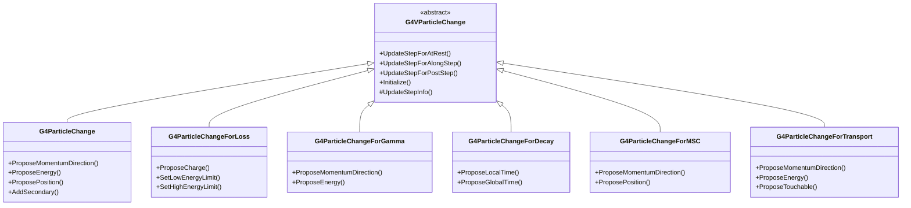

# G4VParticleChange

**File**: `source/track/include/G4VParticleChange.hh`

## Overview

G4VParticleChange is the abstract base class for representing particle changes in Geant4. It encapsulates the results after invocation of a physics process, including the final state of the parent particle (momentum, energy, track status, etc.) and secondary particles generated by the interaction. All energy and momentum values are assumed to be in the global reference system.

## Class Description

G4VParticleChange provides the infrastructure for physics processes to communicate their results to the tracking system. The class serves as a "change container" that stores:

- **Parent particle final state**: Track status, position, time, energy deposition
- **Step information**: True step length, stepping control flags, volume boundaries
- **Secondary particles**: Generated particles from the interaction
- **Weight management**: Particle weights for variance reduction techniques
- **Debug support**: Validation and debugging capabilities

Derived classes implement specific `UpdateStep` methods for different process types (AtRest, AlongStep, PostStep) and add additional state information as needed.

## Inheritance Hierarchy



## Related Enumerations

### G4TrackStatus

Used to specify the final status of a track after a process.

```cpp
enum G4TrackStatus {
  fAlive,            // Continue tracking
  fStopButAlive,     // Track stopped but still alive
  fStopAndKill,      // Track stopped and killed
  fKillTrackAndSecondaries,  // Kill track and all secondaries
  fSuspend,          // Temporarily suspended
  fPostponeToNextEvent      // Postpone to next event
};
```

**Location**: `G4TrackStatus.hh`

### G4SteppingControl

Used to control the stepping manager's behavior.

```cpp
enum G4SteppingControl {
  NormalCondition,           // Normal stepping
  AvoidHitInvocation,       // Avoid calling sensitive detector
  Debug,                    // Debug mode
  ...
};
```

**Location**: `G4SteppingControl.hh`

## Constructor & Destructor

### Constructor

```cpp
G4VParticleChange();
```

Creates a G4VParticleChange object with default initialization.

**Location**: `G4VParticleChange.hh:72`

**Default Values**:
- `theStatusChange = fAlive`
- `theSteppingControlFlag = NormalCondition`
- `theLocalEnergyDeposit = 0.0`
- `theNonIonizingEnergyDeposit = 0.0`
- `theTrueStepLength = 0.0`
- `theParentWeight = 1.0`
- `theNumberOfSecondaries = 0`
- `verboseLevel = 1`

### Destructor

```cpp
virtual ~G4VParticleChange() = default;
```

Virtual destructor (default implementation).

**Location**: `G4VParticleChange.hh:74`

### Deleted Copy Operations

```cpp
G4VParticleChange(const G4VParticleChange& right) = delete;
G4VParticleChange& operator=(const G4VParticleChange& right) = delete;
```

Copy construction and assignment are explicitly disabled.

**Location**: `G4VParticleChange.hh:76-77`

## Virtual Methods for Updating G4Step

These pure virtual methods must be implemented by derived classes to update the G4Step with process results.

### UpdateStepForAtRest

```cpp
virtual G4Step* UpdateStepForAtRest(G4Step* Step);
```

Updates the G4Step for AtRest processes (e.g., radioactive decay).

**Parameters**:
- `Step`: Pointer to the current step

**Returns**: Pointer to the updated G4Step

**Location**: `G4VParticleChange.hh:81`

**Usage**: Called by the stepping manager after an AtRest process's DoIt() method. The process modifies the step using final state information stored in this object.

### UpdateStepForAlongStep

```cpp
virtual G4Step* UpdateStepForAlongStep(G4Step* Step);
```

Updates the G4Step for AlongStep processes (e.g., continuous energy loss, multiple scattering).

**Parameters**:
- `Step`: Pointer to the current step

**Returns**: Pointer to the updated G4Step

**Location**: `G4VParticleChange.hh:82`

**Usage**: Called by the stepping manager after an AlongStep process's DoIt() method. AlongStep processes may compute changes relative to the initial state, which are accumulated in the PostStepPoint.

### UpdateStepForPostStep

```cpp
virtual G4Step* UpdateStepForPostStep(G4Step* Step);
```

Updates the G4Step for PostStep processes (e.g., discrete interactions like Compton scattering).

**Parameters**:
- `Step`: Pointer to the current step

**Returns**: Pointer to the updated G4Step

**Location**: `G4VParticleChange.hh:83`

**Usage**: Called by the stepping manager after a PostStep process's DoIt() method. The process sets the final state of the particle after the interaction.

### Initialize

```cpp
virtual void Initialize(const G4Track& track);
```

Initializes the particle change object from the current track state.

**Parameters**:
- `track`: Reference to the current track

**Location**: `G4VParticleChange.hh:88`

**Implementation**: `G4VParticleChange.icc:206-214`

**Usage**: Must be called by each process at the beginning of its DoIt() method to refresh the final state information. This ensures the object starts with the current particle state.

**Implementation Details**:
```cpp
inline void G4VParticleChange::Initialize(const G4Track& track)
{
  InitializeStatusChange(track);      // Set status from track
  InitializeLocalEnergyDeposit();     // Clear energy deposit
  InitializeSteppingControl();        // Reset stepping control
  InitializeSecondaries();            // Clear secondaries
  InitializeParentWeight(track);      // Set parent weight
  InitializeFromStep(track.GetStep()); // Set step info
}
```

## True Path Length Methods

### GetTrueStepLength

```cpp
inline G4double GetTrueStepLength() const;
```

Returns the true geometric step length.

**Returns**: True step length in Geant4 length units

**Location**: `G4VParticleChange.hh:94`

**Implementation**: `G4VParticleChange.icc:108-111`

### ProposeTrueStepLength

```cpp
inline void ProposeTrueStepLength(G4double truePathLength);
```

Sets the true geometric step length.

**Parameters**:
- `truePathLength`: True step length

**Location**: `G4VParticleChange.hh:95`

**Implementation**: `G4VParticleChange.icc:113-116`

**Usage**: Used by processes to specify the actual geometric distance traveled, which may differ from the "physics" step length for curved paths.

## Local Energy Deposit Methods

### GetLocalEnergyDeposit

```cpp
inline G4double GetLocalEnergyDeposit() const;
```

Returns the locally deposited energy.

**Returns**: Energy deposited at the interaction point

**Location**: `G4VParticleChange.hh:100`

**Implementation**: `G4VParticleChange.icc:87-90`

**Note**: Local energy deposit represents energy lost to secondaries that were not generated because they were below production thresholds. This energy is deposited locally in the current step.

### ProposeLocalEnergyDeposit

```cpp
inline void ProposeLocalEnergyDeposit(G4double anEnergyPart);
```

Sets the locally deposited energy.

**Parameters**:
- `anEnergyPart`: Energy to deposit locally

**Location**: `G4VParticleChange.hh:101`

**Implementation**: `G4VParticleChange.icc:92-95`

## Non-Ionizing Energy Deposit Methods

### GetNonIonizingEnergyDeposit

```cpp
inline G4double GetNonIonizingEnergyDeposit() const;
```

Returns the non-ionizing energy deposit.

**Returns**: Non-ionizing energy deposited

**Location**: `G4VParticleChange.hh:106`

**Implementation**: `G4VParticleChange.icc:97-100`

**Note**: Non-ionizing energy deposit is the portion of local energy deposit that does not cause ionization of atoms (e.g., lattice damage in semiconductors).

### ProposeNonIonizingEnergyDeposit

```cpp
inline void ProposeNonIonizingEnergyDeposit(G4double anEnergyPart);
```

Sets the non-ionizing energy deposit.

**Parameters**:
- `anEnergyPart`: Non-ionizing energy to deposit

**Location**: `G4VParticleChange.hh:107`

**Implementation**: `G4VParticleChange.icc:102-106`

## Track Status Methods

### GetTrackStatus

```cpp
inline G4TrackStatus GetTrackStatus() const;
```

Returns the proposed final track status.

**Returns**: Track status enumeration value

**Location**: `G4VParticleChange.hh:112`

**Implementation**: `G4VParticleChange.icc:51-54`

### ProposeTrackStatus

```cpp
inline void ProposeTrackStatus(G4TrackStatus status);
```

Sets the final track status.

**Parameters**:
- `status`: Track status (fAlive, fStopAndKill, etc.)

**Location**: `G4VParticleChange.hh:113`

**Implementation**: `G4VParticleChange.icc:41-44`

**Usage**: Processes use this to indicate whether the particle should continue (fAlive), be killed (fStopAndKill), or have another status after the interaction.

### GetCurrentTrack

```cpp
inline const G4Track* GetCurrentTrack() const;
```

Returns a pointer to the current track being processed.

**Returns**: Const pointer to the current G4Track

**Location**: `G4VParticleChange.hh:116`

**Implementation**: `G4VParticleChange.icc:46-49`

## Stepping Control Methods

### GetSteppingControl

```cpp
inline G4SteppingControl GetSteppingControl() const;
```

Returns the stepping control flag.

**Returns**: Stepping control flag

**Location**: `G4VParticleChange.hh:121`

**Implementation**: `G4VParticleChange.icc:56-59`

### ProposeSteppingControl

```cpp
inline void ProposeSteppingControl(G4SteppingControl StepControlFlag);
```

Sets the stepping control flag to modify stepping manager behavior.

**Parameters**:
- `StepControlFlag`: Control flag value

**Location**: `G4VParticleChange.hh:122`

**Implementation**: `G4VParticleChange.icc:61-65`

**Usage**: Allows processes to influence stepping behavior, such as avoiding sensitive detector invocation or entering debug mode.

## Volume Boundary Methods

### GetFirstStepInVolume

```cpp
inline G4bool GetFirstStepInVolume() const;
```

Returns whether this is the first step in a volume.

**Returns**: True if first step in volume

**Location**: `G4VParticleChange.hh:127`

**Implementation**: `G4VParticleChange.icc:67-70`

### GetLastStepInVolume

```cpp
inline G4bool GetLastStepInVolume() const;
```

Returns whether this is the last step in a volume.

**Returns**: True if last step in volume

**Location**: `G4VParticleChange.hh:128`

**Implementation**: `G4VParticleChange.icc:72-75`

### ProposeFirstStepInVolume

```cpp
inline void ProposeFirstStepInVolume(G4bool flag);
```

Sets the first-step-in-volume flag.

**Parameters**:
- `flag`: True if first step

**Location**: `G4VParticleChange.hh:129`

**Implementation**: `G4VParticleChange.icc:77-80`

### ProposeLastStepInVolume

```cpp
inline void ProposeLastStepInVolume(G4bool flag);
```

Sets the last-step-in-volume flag.

**Parameters**:
- `flag`: True if last step

**Location**: `G4VParticleChange.hh:130`

**Implementation**: `G4VParticleChange.icc:82-85`

## Secondary Particle Management

### Clear

```cpp
inline void Clear();
```

Clears the contents of the particle change object.

**Location**: `G4VParticleChange.hh:134`

**Implementation**: `G4VParticleChange.icc:154-159`

**Usage**: Should be called after the tracking (stepping) manager removes all secondaries from theListOfSecondaries. Resets the number of secondaries to zero and boundary flags.

### SetNumberOfSecondaries

```cpp
inline void SetNumberOfSecondaries(G4int totSecondaries);
```

Reserves memory for the specified number of secondary particles.

**Parameters**:
- `totSecondaries`: Expected number of secondaries to be added

**Location**: `G4VParticleChange.hh:139`

**Implementation**: `G4VParticleChange.icc:193-201`

**Usage**: Must be called just before AddSecondary() to secure memory space. Resets theNumberOfSecondaries to zero (incremented with each AddSecondary() call). Resizes the internal vector if needed.

### GetNumberOfSecondaries

```cpp
inline G4int GetNumberOfSecondaries() const;
```

Returns the current number of secondary particles.

**Returns**: Number of secondaries in the list

**Location**: `G4VParticleChange.hh:145`

**Implementation**: `G4VParticleChange.icc:36-39`

### GetSecondary

```cpp
inline G4Track* GetSecondary(G4int anIndex) const;
```

Returns a pointer to a secondary particle by index.

**Parameters**:
- `anIndex`: Index of the secondary (0-based)

**Returns**: Pointer to the G4Track

**Location**: `G4VParticleChange.hh:148`

**Implementation**: `G4VParticleChange.icc:31-34`

**Warning**: No boundary checking is performed. Ensure anIndex < GetNumberOfSecondaries().

### AddSecondary

```cpp
void AddSecondary(G4Track* aSecondary);
```

Adds a secondary particle to the list.

**Parameters**:
- `aSecondary`: Pointer to the secondary track to add

**Location**: `G4VParticleChange.hh:152`

**Usage**: Call SetNumberOfSecondaries() first to allocate space. The secondary's weight is automatically set to the parent weight unless fSetSecondaryWeightByProcess is true.

## Weight Management Methods

### GetWeight

```cpp
inline G4double GetWeight() const;
```

Returns the weight of the parent (current) track.

**Returns**: Track weight

**Location**: `G4VParticleChange.hh:157`

**Implementation**: `G4VParticleChange.icc:133-136`

### GetParentWeight

```cpp
inline G4double GetParentWeight() const;
```

Returns the weight of the parent track (same as GetWeight).

**Returns**: Parent track weight

**Location**: `G4VParticleChange.hh:158`

**Implementation**: `G4VParticleChange.icc:128-131`

### ProposeWeight

```cpp
inline void ProposeWeight(G4double finalWeight);
```

Sets the final weight of the parent track.

**Parameters**:
- `finalWeight`: New weight value

**Location**: `G4VParticleChange.hh:161`

**Implementation**: `G4VParticleChange.icc:241-245`

**Usage for AlongStep**: For AlongStepDoIt processes, the parent weight is accumulated in a multiplicative manner. If two processes propose weights W1 and W2 for a track with initial weight W0, the final weight is: (W1/W0) * (W2/W0) * W0.

### ProposeParentWeight

```cpp
inline void ProposeParentWeight(G4double finalWeight);
```

Sets the final weight of the parent track (same as ProposeWeight).

**Parameters**:
- `finalWeight`: New weight value

**Location**: `G4VParticleChange.hh:162`

**Implementation**: `G4VParticleChange.icc:247-250`

### SetSecondaryWeightByProcess

```cpp
inline void SetSecondaryWeightByProcess(G4bool flag);
```

Controls whether the process sets secondary weights.

**Parameters**:
- `flag`: True if process manages secondary weights

**Location**: `G4VParticleChange.hh:169`

**Implementation**: `G4VParticleChange.icc:231-234`

**Default Behavior (flag=false)**: Secondary track weights are automatically set to the parent weight.

**When flag=true**: The process is responsible for setting secondary weights; ParticleChange will not modify them.

**Important**: If multiple processes in AlongStepDoIt() propose parent weight changes and add secondaries with this flag set to false, secondary weights may be incorrect.

### IsSecondaryWeightSetByProcess

```cpp
inline G4bool IsSecondaryWeightSetByProcess() const;
```

Returns whether secondary weights are managed by the process.

**Returns**: True if process sets secondary weights

**Location**: `G4VParticleChange.hh:170`

**Implementation**: `G4VParticleChange.icc:236-239`

### SetParentWeightByProcess (Obsolete)

```cpp
void SetParentWeightByProcess(G4bool flag);
G4bool IsParentWeightSetByProcess() const;
```

Obsolete methods for parent weight management.

**Location**: `G4VParticleChange.hh:182-183`

**Status**: Deprecated - do not use in new code.

## Debugging and Validation Methods

### DumpInfo

```cpp
virtual void DumpInfo() const;
```

Prints detailed information about the particle change state.

**Location**: `G4VParticleChange.hh:188`

**Usage**: Useful for debugging process implementations. Outputs track status, energy deposits, secondaries, etc.

### SetVerboseLevel

```cpp
inline void SetVerboseLevel(G4int vLevel);
```

Sets the verbosity level for debug output.

**Parameters**:
- `vLevel`: Verbosity level (0=silent, higher=more verbose)

**Location**: `G4VParticleChange.hh:191`

**Implementation**: `G4VParticleChange.icc:118-121`

### GetVerboseLevel

```cpp
inline G4int GetVerboseLevel() const;
```

Returns the current verbosity level.

**Returns**: Verbosity level

**Location**: `G4VParticleChange.hh:192`

**Implementation**: `G4VParticleChange.icc:123-126`

### CheckIt

```cpp
virtual G4bool CheckIt(const G4Track& track);
```

Performs validation checks on the particle change.

**Parameters**:
- `track`: Reference to the current track

**Returns**: True if checks pass, false otherwise

**Location**: `G4VParticleChange.hh:194`

**Usage**: Activated when debug flag is set and G4VERBOSE is defined. Validates energy-momentum conservation, checks secondary particles, etc.

### SetDebugFlag

```cpp
inline void SetDebugFlag();
```

Enables the debug flag to activate CheckIt() validation.

**Location**: `G4VParticleChange.hh:198`

**Implementation**: `G4VParticleChange.icc:221-224`

### ClearDebugFlag

```cpp
inline void ClearDebugFlag();
```

Disables the debug flag.

**Location**: `G4VParticleChange.hh:197`

**Implementation**: `G4VParticleChange.icc:216-219`

### GetDebugFlag

```cpp
inline G4bool GetDebugFlag() const;
```

Returns the current debug flag state.

**Returns**: True if debug mode is active

**Location**: `G4VParticleChange.hh:199`

**Implementation**: `G4VParticleChange.icc:226-229`

## Protected Methods

### UpdateStepInfo

```cpp
G4Step* UpdateStepInfo(G4Step* Step);
```

Updates G4Step-specific attributes (stepping control, local energy deposit, true step length).

**Parameters**:
- `Step`: Pointer to the step to update

**Returns**: Pointer to the updated step

**Location**: `G4VParticleChange.hh:205`

**Usage**: Called by derived classes' UpdateStep methods to apply common step updates.

### Initialization Helper Methods

These protected inline methods initialize specific aspects of the particle change:

#### InitializeLocalEnergyDeposit

```cpp
inline void InitializeLocalEnergyDeposit();
```

Clears local and non-ionizing energy deposits to zero.

**Location**: `G4VParticleChange.hh:209`

**Implementation**: `G4VParticleChange.icc:141-146`

#### InitializeSteppingControl

```cpp
inline void InitializeSteppingControl();
```

Resets stepping control flag to NormalCondition.

**Location**: `G4VParticleChange.hh:210`

**Implementation**: `G4VParticleChange.icc:148-152`

#### InitializeParentWeight

```cpp
inline void InitializeParentWeight(const G4Track& track);
```

Sets parent weight from the track and resets the proposal flag.

**Parameters**:
- `track`: Reference to the current track

**Location**: `G4VParticleChange.hh:211`

**Implementation**: `G4VParticleChange.icc:168-173`

#### InitializeStatusChange

```cpp
inline void InitializeStatusChange(const G4Track& track);
```

Sets track status from the current track.

**Parameters**:
- `track`: Reference to the current track

**Location**: `G4VParticleChange.hh:212`

**Implementation**: `G4VParticleChange.icc:161-166`

#### InitializeSecondaries

```cpp
inline void InitializeSecondaries();
```

Resets the secondary particle count to zero.

**Location**: `G4VParticleChange.hh:213`

**Implementation**: `G4VParticleChange.icc:188-191`

#### InitializeFromStep

```cpp
inline void InitializeFromStep(const G4Step* step);
```

Initializes from step information (global time, true step length, boundary flags).

**Parameters**:
- `step`: Pointer to the current step

**Location**: `G4VParticleChange.hh:214`

**Implementation**: `G4VParticleChange.icc:175-183`

### Utility Methods

#### ComputeBeta

```cpp
inline G4double ComputeBeta(G4double kinEnergy);
```

Computes the relativistic beta (v/c) from kinetic energy.

**Parameters**:
- `kinEnergy`: Kinetic energy of the particle

**Returns**: Beta value (v/c)

**Location**: `G4VParticleChange.hh:216`

**Implementation**: `G4VParticleChange.icc:252-256`

**Formula**: β = sqrt(E_k * (E_k + 2m)) / (E_k + m), where m is the particle mass.

#### CheckSecondary

```cpp
G4bool CheckSecondary(G4Track& track);
```

Validates a secondary track in debug mode.

**Parameters**:
- `track`: Reference to the secondary track

**Returns**: True if validation passes

**Location**: `G4VParticleChange.hh:218`

**Usage**: Called internally during debugging to validate secondary particle properties.

#### Accuracy Methods

```cpp
G4double GetAccuracyForWarning() const;
G4double GetAccuracyForException() const;
```

Returns accuracy thresholds for validation warnings and exceptions.

**Location**: `G4VParticleChange.hh:222-223`

## Protected Data Members

### Accuracy Constants

```cpp
static const G4double accuracyForWarning;
static const G4double accuracyForException;
static const G4int maxError;
```

Static constants defining accuracy levels for validation checks.

**Location**: `G4VParticleChange.hh:227-229`

### Track Reference

```cpp
const G4Track* theCurrentTrack = nullptr;
```

Pointer to the current track being processed.

**Location**: `G4VParticleChange.hh:232`

**Note**: Set by InitializeStatusChange() during Initialize().

### Track Status

```cpp
G4TrackStatus theStatusChange = fAlive;
```

The proposed final track status.

**Location**: `G4VParticleChange.hh:234`

**Default**: fAlive (track continues)

### Stepping Control

```cpp
G4SteppingControl theSteppingControlFlag = NormalCondition;
```

Flag to control stepping manager behavior.

**Location**: `G4VParticleChange.hh:237`

**Default**: NormalCondition

### Energy Deposits

```cpp
G4double theLocalEnergyDeposit = 0.0;
```

Energy deposited locally due to sub-threshold secondaries.

**Location**: `G4VParticleChange.hh:240`

**Note**: This represents energy lost to secondaries not generated because they were below production cuts. Sum of local energy deposit and continuous process energy loss gives total energy loss in the step.

```cpp
G4double theNonIonizingEnergyDeposit = 0.0;
```

Non-ionizing component of local energy deposit.

**Location**: `G4VParticleChange.hh:249`

**Note**: Portion of local energy deposit that doesn't ionize atoms (e.g., lattice damage).

### Step Length

```cpp
G4double theTrueStepLength = 0.0;
```

The true geometric step length.

**Location**: `G4VParticleChange.hh:253`

**Note**: May differ from "physics" step length for processes with curved trajectories.

### Weight Information

```cpp
G4double theParentWeight = 1.0;
```

Weight of the parent track.

**Location**: `G4VParticleChange.hh:256`

**Default**: 1.0 (unbiased)

```cpp
G4bool isParentWeightProposed = false;
```

Flag indicating if parent weight has been modified.

**Location**: `G4VParticleChange.hh:278`

```cpp
G4bool fSetSecondaryWeightByProcess = false;
```

Flag controlling whether process sets secondary weights.

**Location**: `G4VParticleChange.hh:280`

**Default**: false (ParticleChange sets secondary weights to parent weight)

### Time Information

```cpp
G4double theParentGlobalTime = 0.0;
```

Global time of the parent track.

**Location**: `G4VParticleChange.hh:259`

**Note**: Used only for validation in debug mode.

### Secondary Particle Management

```cpp
G4int theNumberOfSecondaries = 0;
```

Current number of secondary particles.

**Location**: `G4VParticleChange.hh:263`

```cpp
G4int theSizeOftheListOfSecondaries = 0;
```

Allocated size of the secondary list.

**Location**: `G4VParticleChange.hh:266`

```cpp
std::vector<G4Track*> theListOfSecondaries;
```

Vector storing pointers to secondary tracks.

**Location**: `G4VParticleChange.hh:285`

### Boundary Flags

```cpp
G4bool theFirstStepInVolume = false;
G4bool theLastStepInVolume = false;
```

Flags indicating boundary crossings.

**Location**: `G4VParticleChange.hh:274-275`

**Usage**: Used to track when a particle enters or exits a volume.

### Debugging

```cpp
G4int verboseLevel = 1;
```

Verbosity level for output.

**Location**: `G4VParticleChange.hh:269`

**Default**: 1

```cpp
G4int nError = 0;
```

Error counter for validation.

**Location**: `G4VParticleChange.hh:272`

```cpp
G4bool debugFlag = false;
```

Debug mode flag.

**Location**: `G4VParticleChange.hh:283`

**Default**: false

## Usage Examples

### Basic Usage in a Process DoIt Method

```cpp
// In a physics process's PostStepDoIt method
G4VParticleChange* MyProcess::PostStepDoIt(const G4Track& track,
                                            const G4Step& step)
{
    // Initialize the particle change from current track state
    aParticleChange.Initialize(track);

    // Propose the final track status
    aParticleChange.ProposeTrackStatus(fStopAndKill);

    // Propose local energy deposit (below-threshold secondaries)
    aParticleChange.ProposeLocalEnergyDeposit(1.5*keV);

    // Set number of secondaries to be added
    aParticleChange.SetNumberOfSecondaries(2);

    // Add secondary particles
    G4Track* secondary1 = new G4Track(...);
    aParticleChange.AddSecondary(secondary1);

    G4Track* secondary2 = new G4Track(...);
    aParticleChange.AddSecondary(secondary2);

    return &aParticleChange;
}
```

### Energy Conservation Example

```cpp
// Example showing proper energy accounting
G4VParticleChange* MyProcess::PostStepDoIt(const G4Track& track,
                                            const G4Step& step)
{
    aParticleChange.Initialize(track);

    G4double initialEnergy = track.GetKineticEnergy();
    G4double finalEnergy = 0.0;  // Primary stopped

    // Calculate secondary energies
    G4double secondary1Energy = 10.0*MeV;
    G4double secondary2Energy = 5.0*MeV;

    // Energy below production threshold (not created as secondary)
    G4double belowThreshold = 1.0*keV;

    // Local deposit ensures energy conservation:
    // initialEnergy = finalEnergy + secondary1Energy + secondary2Energy
    //                 + belowThreshold + localDeposit
    G4double localDeposit = initialEnergy - finalEnergy
                          - secondary1Energy - secondary2Energy
                          - belowThreshold;

    aParticleChange.ProposeLocalEnergyDeposit(localDeposit);
    aParticleChange.ProposeTrackStatus(fStopAndKill);

    // Add secondaries
    aParticleChange.SetNumberOfSecondaries(2);
    // ... create and add secondary tracks ...

    return &aParticleChange;
}
```

### AlongStep Process with Weight Management

```cpp
// AlongStep process example with weight adjustment
G4VParticleChange* MyContinuousProcess::AlongStepDoIt(
    const G4Track& track, const G4Step& step)
{
    aParticleChange.Initialize(track);

    // For variance reduction, adjust weight
    G4double survivalProbability = 0.8;
    G4double currentWeight = track.GetWeight();
    G4double newWeight = currentWeight * survivalProbability;

    aParticleChange.ProposeWeight(newWeight);

    // If adding secondaries with custom weights
    aParticleChange.SetSecondaryWeightByProcess(true);
    aParticleChange.SetNumberOfSecondaries(1);

    G4Track* secondary = new G4Track(...);
    secondary->SetWeight(currentWeight * (1.0 - survivalProbability));
    aParticleChange.AddSecondary(secondary);

    return &aParticleChange;
}
```

### Debug Mode Usage

```cpp
// Enable debugging for validation during development
void MyProcess::StartTracking(G4Track* track)
{
    aParticleChange.SetDebugFlag();
    aParticleChange.SetVerboseLevel(2);
}

G4VParticleChange* MyProcess::PostStepDoIt(const G4Track& track,
                                            const G4Step& step)
{
    aParticleChange.Initialize(track);

    // ... perform process logic ...

    // Validate before returning (called automatically when debug flag is set)
    if (aParticleChange.GetDebugFlag()) {
        if (!aParticleChange.CheckIt(track)) {
            G4cerr << "Particle change validation failed!" << G4endl;
            aParticleChange.DumpInfo();
        }
    }

    return &aParticleChange;
}
```

### Derived Class Implementation Example

```cpp
// Example of implementing UpdateStepForPostStep in a derived class
class MyParticleChange : public G4VParticleChange
{
public:
    G4Step* UpdateStepForPostStep(G4Step* pStep) override
    {
        // First update common step information
        G4VParticleChange::UpdateStepInfo(pStep);

        // Get step points
        G4StepPoint* pPostStepPoint = pStep->GetPostStepPoint();

        // Update post-step point with final state
        pPostStepPoint->SetMomentumDirection(theMomentumDirection);
        pPostStepPoint->SetKineticEnergy(theEnergyChange);
        pPostStepPoint->SetPosition(thePositionChange);

        // Update track status
        pStep->GetTrack()->SetTrackStatus(theStatusChange);

        return pStep;
    }

private:
    G4ThreeVector theMomentumDirection;
    G4double theEnergyChange;
    G4ThreeVector thePositionChange;
};
```

## Derived Classes

G4VParticleChange serves as the base class for specialized particle change classes:

### [G4ParticleChange](./g4particlechange.md)
General-purpose particle change class for discrete processes. Stores complete final state including position, momentum direction, energy, time, and polarization.

**Location**: `source/track/include/G4ParticleChange.hh`

**Use Case**: General discrete processes like Compton scattering, photoelectric effect

### [G4ParticleChangeForLoss](./g4particlechangeforloss.md)
Specialized for continuous energy loss processes with ionization.

**Location**: `source/track/include/G4ParticleChangeForLoss.hh`

**Use Case**: Ionization, bremsstrahlung (continuous parts)

### [G4ParticleChangeForGamma](./g4particlechangeforgamma.md)
Optimized for electromagnetic processes involving photons and electrons.

**Location**: `source/track/include/G4ParticleChangeForGamma.hh`

**Use Case**: Gamma conversion, Compton scattering, photoelectric effect

### [G4ParticleChangeForDecay](./g4particlechangefordecay.md)
Specialized for particle decay processes (both at-rest and in-flight).

**Location**: `source/track/include/G4ParticleChangeForDecay.hh`

**Use Case**: Radioactive decay, particle decay

### [G4ParticleChangeForMSC](./g4particlechangeformsc.md)
Specialized for multiple scattering processes.

**Location**: `source/track/include/G4ParticleChangeForMSC.hh`

**Use Case**: Multiple Coulomb scattering

### [G4ParticleChangeForTransport](./g4particlechangefortransport.md)
Used by transportation process to update particle position and handle geometry boundaries.

**Location**: `source/track/include/G4ParticleChangeForTransport.hh`

**Use Case**: Particle transportation, geometry navigation

### G4ParticleChangeForNothing
Minimal particle change for processes that don't modify the track.

**Location**: `source/processes/biasing/generic/include/G4ParticleChangeForNothing.hh`

**Use Case**: Biasing processes that observe but don't modify

### G4ParticleChangeForOccurenceBiasing
Specialized for occurrence biasing in variance reduction.

**Location**: `source/processes/biasing/generic/include/G4ParticleChangeForOccurenceBiasing.hh`

**Use Case**: Biasing process occurrence rates

## Thread Safety

G4VParticleChange objects are **not thread-safe** and should **not be shared** between threads. Each worker thread in a multi-threaded Geant4 application must have its own instance of particle change objects.

**Thread-Safe Usage Pattern**:
```cpp
class MyProcess : public G4VProcess
{
public:
    MyProcess() : G4VProcess("MyProcess")
    {
        // Constructor called per thread in multi-threaded mode
        pParticleChange = new MyParticleChange();
    }

    virtual ~MyProcess()
    {
        delete pParticleChange;
    }

private:
    MyParticleChange* pParticleChange;  // Thread-local instance
};
```

**Key Points**:
- Each physics process instance has its own G4VParticleChange object
- Process instances are created per-thread in multi-threaded mode
- Static data members (accuracyForWarning, accuracyForException, maxError) are shared read-only constants

## Related Classes

### Core Tracking Classes
- [G4Track](./g4track.md) - Represents a particle being tracked
- [G4Step](./g4step.md) - Represents a step in the tracking process
- [G4StepPoint](./g4steppoint.md) - Information at pre/post step points
- [G4VProcess](./g4vprocess.md) - Base class for physics processes

### Physics Process Base Classes
- [G4VDiscreteProcess](./g4vdiscreteprocess.md) - Base for discrete processes
- [G4VContinuousProcess](./g4vcontinuousprocess.md) - Base for continuous processes
- [G4VContinuousDiscreteProcess](./g4vcontinuousdiscreteprocess.md) - Base for mixed processes

### Secondary Particle Classes
- [G4DynamicParticle](./g4dynamicparticle.md) - Dynamic particle properties
- [G4ParticleDefinition](./g4particledefinition.md) - Static particle properties

### Stepping Manager
- [G4SteppingManager](./g4steppingmanager.md) - Manages the stepping process
- [G4TrackingManager](./g4trackingmanager.md) - Manages track lifecycle

## Implementation Notes

### Memory Management
- **Secondaries**: Ownership of secondary G4Track objects is transferred to the tracking system when added via AddSecondary()
- **Cleanup**: Call Clear() after the tracking manager processes secondaries
- **Vector Resizing**: SetNumberOfSecondaries() resizes the internal vector only if needed, maintaining allocated space for efficiency

### Energy-Momentum Conservation
Processes must ensure energy-momentum conservation:
- **Total Energy**: Initial energy = Final energy + Secondary energies + Local deposit
- **Momentum**: Vector sum of final and secondary momenta should equal initial momentum (within accuracy)
- **Validation**: CheckIt() method validates conservation when debug flag is set

### Weight Handling
Weight management for variance reduction:
- **Default**: Secondary weights inherit parent weight automatically
- **Custom**: Use SetSecondaryWeightByProcess(true) for process-controlled weights
- **AlongStep**: Multiple AlongStep processes multiply weight factors

## Version History

Key developments (from header comments):

- **23 March 1998**: Original implementation by Hisaya Kurashige
- Subsequent versions added:
  - Non-ionizing energy deposit support
  - Secondary weight management capabilities
  - Volume boundary tracking flags
  - Enhanced debugging and validation features
  - Thread-safety considerations for multi-threaded Geant4

## See Also

### Documentation
- [Track Module Overview](../track-overview.md)
- [Physics Process Guide](../../processes/physics-process-guide.md)
- [Stepping and Tracking](../stepping-and-tracking.md)

### Related API Documentation
- [G4ParticleChange](./g4particlechange.md) - Main derived class
- [G4VProcess](./g4vprocess.md) - Base class for physics processes
- [G4Track](./g4track.md) - Track representation
- [G4Step](./g4step.md) - Step information

### Source Files
- Header: `source/track/include/G4VParticleChange.hh`
- Inline: `source/track/include/G4VParticleChange.icc`
- Implementation: `source/track/src/G4VParticleChange.cc`
