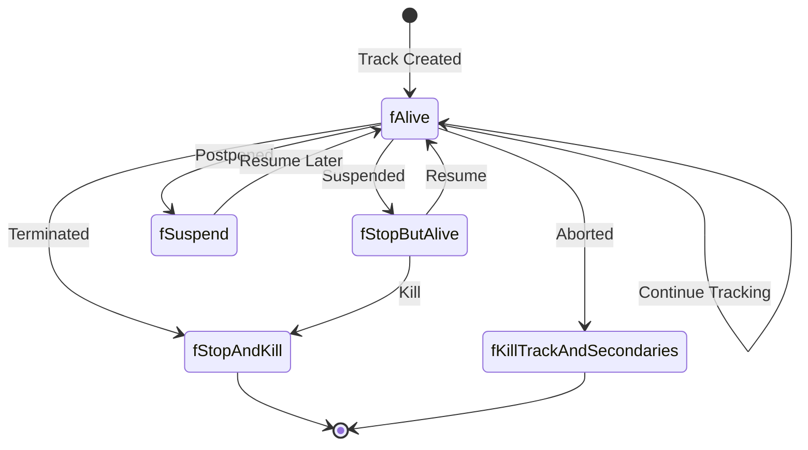
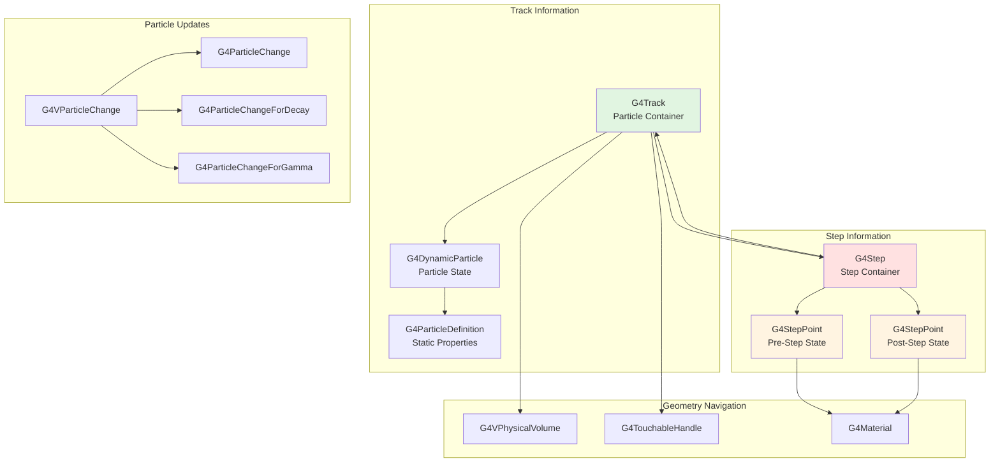
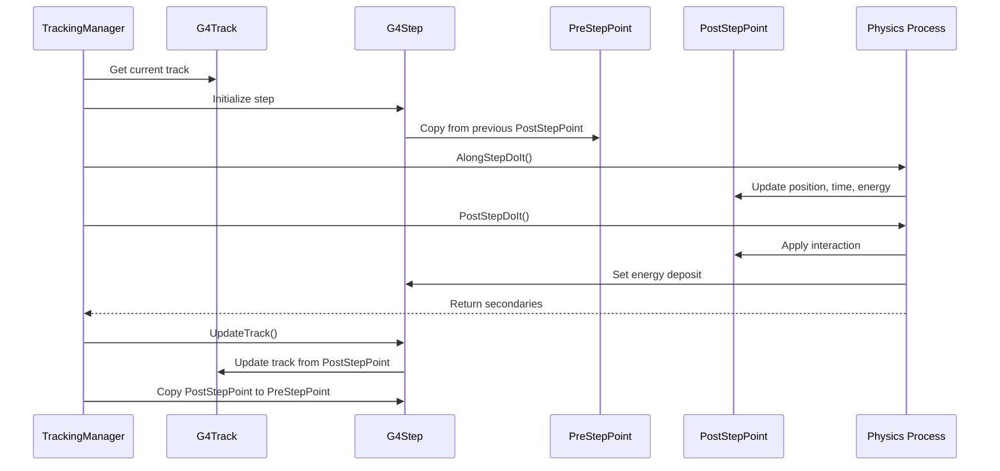
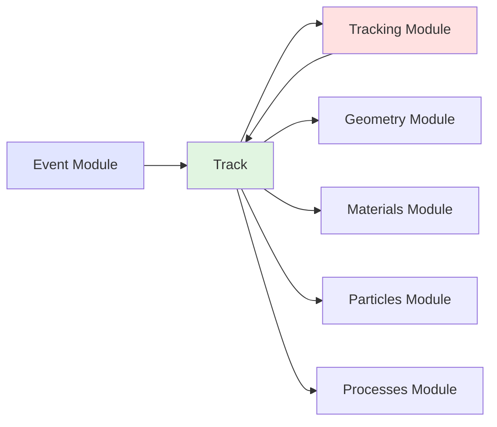

# Track Module

## Overview

The Track module provides the fundamental data structures for representing particles during simulation in Geant4. It defines how particle state information is stored, tracked, and updated as particles propagate through the detector geometry and interact with materials.

::: tip Module Location
**Source:** `source/track/`
**Headers:** `source/track/include/`
:::

## Purpose and Scope

The Track module serves as the foundation for particle tracking in Geant4:

- **Track Container**: `G4Track` holds all information about a particle being tracked
- **Step Representation**: `G4Step` represents discrete simulation steps
- **Step Points**: `G4StepPoint` captures particle state at step boundaries
- **Particle Changes**: Classes for updating particle properties after physics interactions
- **User Extensions**: Interfaces for attaching custom information to tracks

## Core Concepts

### Track vs Event vs Run

```
G4Run
  └── Multiple G4Events
        └── Multiple G4Tracks
              └── Multiple G4Steps
                    ├── G4StepPoint (Pre)
                    └── G4StepPoint (Post)
```

- **Run**: Collection of events with same beam/geometry configuration
- **Event**: Single simulated interaction with primary particles
- **Track**: Individual particle being tracked from creation to termination
- **Step**: Discrete segment of track between two points

### Track Lifecycle



## Architecture

### Core Components



### Step Processing Flow



## Key Classes

### Track Container

| Class | Purpose | Header |
|-------|---------|--------|
| [**G4Track**](api/g4track.md) | Main track container with particle state and history | `G4Track.hh` |
| **G4TrackVector** | Vector container for multiple tracks | `G4TrackVector.hh` |
| **G4TrackStatus** | Enumeration of track states | `G4TrackStatus.hh` |

### Step Representation

| Class | Purpose | Header |
|-------|---------|--------|
| [**G4Step**](api/g4step.md) | Step information container | `G4Step.hh` |
| [**G4StepPoint**](api/g4steppoint.md) | Particle state at step boundary | `G4StepPoint.hh` |
| **G4StepStatus** | Enumeration of step boundary types | `G4StepStatus.hh` |
| **G4SteppingControl** | Control flags for stepping | `G4SteppingControl.hh` |

### Particle Changes

| Class | Purpose | Header |
|-------|---------|--------|
| [**G4VParticleChange**](api/g4vparticlechange.md) | Base class for particle state changes | `G4VParticleChange.hh` |
| **G4ParticleChange** | Generic particle state changes | `G4ParticleChange.hh` |
| **G4ParticleChangeForDecay** | Changes specific to decay processes | `G4ParticleChangeForDecay.hh` |
| **G4ParticleChangeForGamma** | Changes for electromagnetic shower processes | `G4ParticleChangeForGamma.hh` |
| **G4ParticleChangeForLoss** | Changes for continuous energy loss | `G4ParticleChangeForLoss.hh` |
| **G4ParticleChangeForMSC** | Changes for multiple scattering | `G4ParticleChangeForMSC.hh` |
| **G4ParticleChangeForTransport** | Changes for transportation process | `G4ParticleChangeForTransport.hh` |

### User Extensions

| Class | Purpose | Header |
|-------|---------|--------|
| **G4VUserTrackInformation** | Base for user-defined track information | `G4VUserTrackInformation.hh` |
| **G4VAuxiliaryTrackInformation** | Auxiliary track information interface | `G4VAuxiliaryTrackInformation.hh` |

## Track Status Values

```cpp
enum G4TrackStatus {
    fAlive,                        // Track is alive and being processed
    fStopButAlive,                 // Track is stopped but may resume
    fStopAndKill,                  // Track has stopped and should be killed
    fKillTrackAndSecondaries,      // Kill track and all secondaries
    fSuspend,                      // Suspend track for later processing
    fPostponeToNextEvent           // Postpone to next event
};
```

## Step Status Values

```cpp
enum G4StepStatus {
    fWorldBoundary,         // Step reached world volume boundary
    fGeomBoundary,          // Step limited by geometry boundary
    fAtRestDoItProc,        // Step by AtRest process
    fAlongStepDoItProc,     // Step by AlongStep process
    fPostStepDoItProc,      // Step by PostStep process
    fUserDefinedLimit,      // Step by user-defined limit
    fExclusivelyForcedProc, // Step exclusively forced by process
    fUndefined              // Undefined status
};
```

## Usage Patterns

### Accessing Track Information

```cpp
void MySteppingAction::UserSteppingAction(const G4Step* step)
{
    // Get track from step
    G4Track* track = step->GetTrack();

    // Track identification
    G4int trackID = track->GetTrackID();
    G4int parentID = track->GetParentID();

    // Particle properties
    G4String particleName = track->GetParticleDefinition()->GetParticleName();
    G4double kineticE = track->GetKineticEnergy();
    G4ThreeVector momentum = track->GetMomentum();

    // Position and time
    G4ThreeVector position = track->GetPosition();
    G4double globalTime = track->GetGlobalTime();
    G4double localTime = track->GetLocalTime();

    // Volume information
    G4VPhysicalVolume* volume = track->GetVolume();
    G4Material* material = track->GetMaterial();

    // Track status
    G4TrackStatus status = track->GetTrackStatus();
    if (status == fStopAndKill) {
        G4cout << "Track " << trackID << " terminated" << G4endl;
    }
}
```

### Analyzing Steps

```cpp
void AnalyzeStep(const G4Step* step)
{
    // Pre and post step points
    G4StepPoint* prePoint = step->GetPreStepPoint();
    G4StepPoint* postPoint = step->GetPostStepPoint();

    // Step characteristics
    G4double stepLength = step->GetStepLength();
    G4double energyDeposit = step->GetTotalEnergyDeposit();
    G4double nonIonizingDeposit = step->GetNonIonizingEnergyDeposit();

    // Position change
    G4ThreeVector deltaPosition = step->GetDeltaPosition();
    G4double deltaTime = step->GetDeltaTime();

    // Energy and momentum change
    G4double deltaE = step->GetDeltaEnergy();
    G4ThreeVector deltaP = step->GetDeltaMomentum();

    // Step status
    G4StepStatus preStatus = prePoint->GetStepStatus();
    G4StepStatus postStatus = postPoint->GetStepStatus();

    if (postStatus == fGeomBoundary) {
        G4cout << "Particle crossed geometry boundary" << G4endl;
    }

    // Process that defined the step
    const G4VProcess* process = postPoint->GetProcessDefinedStep();
    if (process) {
        G4String processName = process->GetProcessName();
        G4cout << "Step limited by: " << processName << G4endl;
    }
}
```

### Working with Step Points

```cpp
void CompareStepPoints(const G4Step* step)
{
    G4StepPoint* prePoint = step->GetPreStepPoint();
    G4StepPoint* postPoint = step->GetPostStepPoint();

    // Spatial information
    G4ThreeVector prePos = prePoint->GetPosition();
    G4ThreeVector postPos = postPoint->GetPosition();
    G4ThreeVector displacement = postPos - prePos;

    // Temporal information
    G4double preTime = prePoint->GetGlobalTime();
    G4double postTime = postPoint->GetGlobalTime();
    G4double elapsedTime = postTime - preTime;

    // Kinematic information
    G4double preKE = prePoint->GetKineticEnergy();
    G4double postKE = postPoint->GetKineticEnergy();
    G4double energyLoss = preKE - postKE;

    // Material information
    G4Material* preMaterial = prePoint->GetMaterial();
    G4Material* postMaterial = postPoint->GetMaterial();

    if (preMaterial != postMaterial) {
        G4cout << "Material boundary crossed:" << G4endl;
        G4cout << "  From: " << preMaterial->GetName() << G4endl;
        G4cout << "  To: " << postMaterial->GetName() << G4endl;
    }

    // Velocity and relativistic factors
    G4double beta = postPoint->GetBeta();
    G4double gamma = postPoint->GetGamma();
    G4double velocity = postPoint->GetVelocity();
}
```

### Track Killing and Status Control

```cpp
void MySteppingAction::UserSteppingAction(const G4Step* step)
{
    G4Track* track = step->GetTrack();

    // Kill track if it leaves region of interest
    G4VPhysicalVolume* volume = track->GetVolume();
    if (volume->GetName() == "OuterWorld") {
        track->SetTrackStatus(fStopAndKill);
        return;
    }

    // Kill low energy particles
    if (track->GetKineticEnergy() < 1*keV) {
        track->SetTrackStatus(fStopAndKill);
        return;
    }

    // Suspend high energy particles for special processing
    if (track->GetKineticEnergy() > 100*GeV) {
        track->SetTrackStatus(fSuspend);
        // Will be resumed later
    }
}
```

### Secondary Particle Access

```cpp
void ProcessSecondaries(const G4Step* step)
{
    // Get secondaries created in this step
    const std::vector<const G4Track*>* secondaries =
        step->GetSecondaryInCurrentStep();

    if (secondaries) {
        G4cout << "Number of secondaries: "
               << secondaries->size() << G4endl;

        for (const G4Track* secondary : *secondaries) {
            G4String particleName =
                secondary->GetParticleDefinition()->GetParticleName();
            G4double energy = secondary->GetKineticEnergy();

            G4cout << "  Secondary: " << particleName
                   << " with E = " << energy/MeV << " MeV" << G4endl;
        }
    }

    // All secondaries accumulated during track processing
    const G4TrackVector* allSecondaries = step->GetSecondary();
    if (allSecondaries) {
        G4cout << "Total secondaries in track: "
               << allSecondaries->size() << G4endl;
    }
}
```

### Custom Track Information

```cpp
// Define custom track information
class MyTrackInfo : public G4VUserTrackInformation
{
public:
    MyTrackInfo() = default;
    ~MyTrackInfo() override = default;

    void Print() const override {
        G4cout << "My custom info: " << customData << G4endl;
    }

    G4int detectorRegion = 0;
    G4double weightFactor = 1.0;
    std::string customData;
};

// Attach to track
void AttachTrackInfo(G4Track* track)
{
    MyTrackInfo* info = new MyTrackInfo();
    info->detectorRegion = 1;
    info->weightFactor = 2.0;
    info->customData = "Special particle";

    track->SetUserInformation(info);
}

// Retrieve from track
void RetrieveTrackInfo(const G4Track* track)
{
    MyTrackInfo* info =
        dynamic_cast<MyTrackInfo*>(track->GetUserInformation());

    if (info) {
        G4cout << "Detector region: " << info->detectorRegion << G4endl;
        G4cout << "Weight factor: " << info->weightFactor << G4endl;
        info->Print();
    }
}
```

## Advanced Features

### Auxiliary Track Information

Multiple pieces of information can be attached to a track:

```cpp
// Define auxiliary information
class MyAuxInfo : public G4VAuxiliaryTrackInformation
{
public:
    G4int category = 0;
    G4double score = 0.0;
};

// Attach with unique ID
void AttachAuxInfo(G4Track* track)
{
    MyAuxInfo* auxInfo = new MyAuxInfo();
    auxInfo->category = 5;
    auxInfo->score = 123.45;

    G4int infoID = 1001;  // Unique identifier
    track->SetAuxiliaryTrackInformation(infoID, auxInfo);
}

// Retrieve by ID
void RetrieveAuxInfo(const G4Track* track)
{
    G4int infoID = 1001;
    MyAuxInfo* auxInfo = dynamic_cast<MyAuxInfo*>(
        track->GetAuxiliaryTrackInformation(infoID));

    if (auxInfo) {
        G4cout << "Category: " << auxInfo->category << G4endl;
        G4cout << "Score: " << auxInfo->score << G4endl;
    }
}
```

### Track Weight for Variance Reduction

```cpp
void ApplyWeighting(G4Track* track)
{
    // Set importance weight
    track->SetWeight(2.5);

    // Get current weight
    G4double weight = track->GetWeight();

    // Adjust weight based on particle energy
    if (track->GetKineticEnergy() > 10*GeV) {
        track->SetWeight(weight * 0.5);
    }
}
```

### Vertex Information

Every track remembers where it was created:

```cpp
void AnalyzeVertex(const G4Track* track)
{
    // Vertex position
    G4ThreeVector vertexPos = track->GetVertexPosition();

    // Initial kinematics
    G4ThreeVector vertexMomDir = track->GetVertexMomentumDirection();
    G4double vertexKE = track->GetVertexKineticEnergy();

    // Volume where track was created
    const G4LogicalVolume* vertexVolume =
        track->GetLogicalVolumeAtVertex();

    // Creator process
    const G4VProcess* creator = track->GetCreatorProcess();
    if (creator) {
        G4cout << "Created by: " << creator->GetProcessName() << G4endl;
    } else {
        G4cout << "Primary particle" << G4endl;
    }

    // Creator physics model
    G4int modelID = track->GetCreatorModelID();
    G4String modelName = track->GetCreatorModelName();
    if (modelID >= 0) {
        G4cout << "Physics model: " << modelName
               << " (ID: " << modelID << ")" << G4endl;
    }
}
```

### Resonance Parent Information

For particles from short-lived resonances:

```cpp
void CheckResonanceParent(const G4Track* track)
{
    if (track->HasParentResonance()) {
        const G4ParticleDefinition* resonance =
            track->GetParentResonanceDef();

        G4int resonanceID = track->GetParentResonanceID();
        G4int pdg = track->GetParentResonancePDGEncoding();
        G4String name = track->GetParentResonanceName();
        G4double mass = track->GetParentResonanceMass();

        G4cout << "Parent resonance: " << name << G4endl;
        G4cout << "  PDG: " << pdg << G4endl;
        G4cout << "  Mass: " << mass/GeV << " GeV" << G4endl;
        G4cout << "  ID: " << resonanceID << G4endl;
    }
}
```

## Thread Safety

### Multi-Threading Considerations

- **G4Track**: Thread-local, created per-event in each worker thread
- **G4Step**: Thread-local, one per track
- **G4StepPoint**: Thread-local, created/updated during stepping
- **Memory Management**: Uses `G4Allocator` for efficient allocation

### Track Allocator

```cpp
// Tracks use custom allocator
G4Allocator<G4Track>* trackAllocator = G4Track::GetAllocator();

// Efficient allocation
G4Track* track = new G4Track(...);  // Uses custom allocator
delete track;  // Returns to allocator pool
```

## Performance Considerations

1. **Memory Efficiency**: Custom allocators minimize allocation overhead
2. **Step Points**: PreStepPoint copied from previous PostStepPoint (efficient)
3. **Touchable Handles**: Reference-counted geometry navigation (no deep copies)
4. **Velocity Caching**: Velocity calculation cached in track
5. **Material Caching**: Material properties cached during stepping

## Integration with Other Modules



### Dependencies

- **Particles Module**: Provides `G4DynamicParticle` and `G4ParticleDefinition`
- **Geometry Module**: Provides volume and touchable information
- **Materials Module**: Material properties for track location
- **Event Module**: Tracks created from event primary particles

### Used By

- **Tracking Module**: Uses tracks for step-by-step simulation
- **Processes Module**: Reads/modifies track state via particle changes
- **Digits & Hits Module**: Accesses track information for detector response
- **Analysis Module**: Extracts track data for analysis

## Common Patterns

### Track Loop in Tracking Manager

```cpp
// Simplified tracking loop
void G4TrackingManager::ProcessOneTrack(G4Track* track)
{
    // Initialize track
    track->SetTrackStatus(fAlive);
    fpUserTrackingAction->PreUserTrackingAction(track);

    while (track->GetTrackStatus() == fAlive) {
        // Initialize step
        G4Step* step = track->GetStep();
        step->InitializeStep(track);

        // Invoke physics processes
        InvokeAlongStepDoItProcs();
        InvokePostStepDoItProcs();

        // Update track from step
        step->UpdateTrack();

        // User stepping action
        fpUserSteppingAction->UserSteppingAction(step);

        // Prepare for next step
        step->CopyPostToPreStepPoint();
    }

    fpUserTrackingAction->PostUserTrackingAction(track);
}
```

### Energy Deposition Tracking

```cpp
class MySteppingAction : public G4UserSteppingAction
{
public:
    void UserSteppingAction(const G4Step* step) override
    {
        G4double edep = step->GetTotalEnergyDeposit();
        if (edep > 0) {
            G4String volumeName =
                step->GetPreStepPoint()->GetPhysicalVolume()->GetName();

            energyMap[volumeName] += edep;

            G4cout << "Energy " << edep/keV << " keV deposited in "
                   << volumeName << G4endl;
        }
    }

private:
    std::map<G4String, G4double> energyMap;
};
```

## API Documentation

- [G4Track](api/g4track.md) - Track container class
- [G4Step](api/g4step.md) - Step representation
- [G4StepPoint](api/g4steppoint.md) - Step boundary information
- [G4VParticleChange](api/g4vparticlechange.md) - Particle state changes

## Source Files

Key source files in `source/track/`:

```
source/track/
├── include/
│   ├── G4Track.hh                          # Main track container
│   ├── G4Step.hh                           # Step representation
│   ├── G4StepPoint.hh                      # Step point information
│   ├── G4TrackStatus.hh                    # Track status enumeration
│   ├── G4StepStatus.hh                     # Step status enumeration
│   ├── G4VParticleChange.hh                # Particle change base class
│   ├── G4ParticleChange.hh                 # Generic particle change
│   ├── G4ParticleChangeForDecay.hh         # Decay-specific changes
│   ├── G4ParticleChangeForGamma.hh         # EM shower changes
│   ├── G4VUserTrackInformation.hh          # User track info interface
│   └── G4VAuxiliaryTrackInformation.hh     # Auxiliary info interface
└── src/
    ├── G4Track.cc
    ├── G4Step.cc
    ├── G4StepPoint.cc
    └── G4VParticleChange.cc
```

::: tip Related Documentation
- [Event Module](../event/index.md) - Event and primary particle generation
- [Run Module](../run/index.md) - Run management and event loop
- [Materials Module](../materials/index.md) - Material definitions
- [Visualization](../../visualization.md) - Module dependency diagrams
- [Documentation Progress](../../documentation-progress.md) - Track progress
:::

## See Also

- **Geant4 User's Guide**: Chapter on Tracking and Physics
- **Track Lifecycle**: Understanding track states and transitions
- **Step Processing**: How steps are created and updated
- **Particle Changes**: How physics processes modify tracks

---

::: info Next Steps
After understanding the Track module, explore:
1. **Tracking Module** - How tracks are processed step-by-step
2. **Processes Module** - Physics processes that modify tracks
3. **Geometry Module** - How tracks navigate through detector geometry
:::
