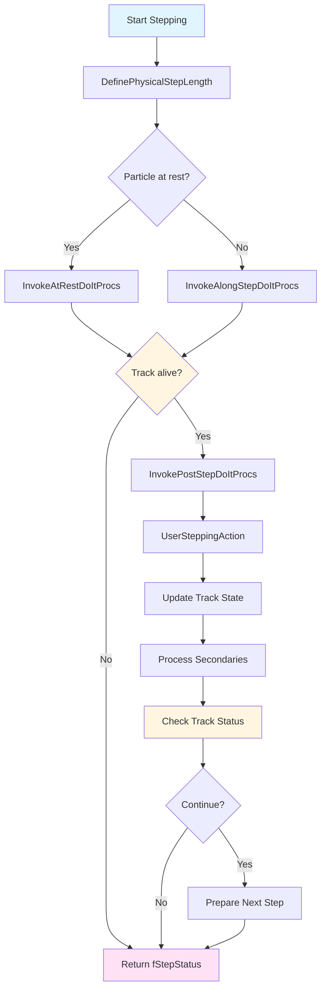

# G4SteppingManager API Documentation

## Overview

`G4SteppingManager` is the core stepping engine in Geant4 that orchestrates particle transportation and physics interactions during each step of particle tracking. It manages message passing between different physics categories (geometry, transportation, processes) and executes the fundamental stepping algorithm that moves particles through the detector while applying physics processes.

::: tip Header File
**Location:** `source/tracking/include/G4SteppingManager.hh`
**Source:** `source/tracking/src/G4SteppingManager.cc`
:::

## Class Declaration

```cpp
class G4SteppingManager
{
 public:
  G4SteppingManager();
  ~G4SteppingManager();

  // Core stepping method
  G4StepStatus Stepping();

  // Initialization
  void SetInitialStep(G4Track* valueTrack);

  // Access methods
  const G4TrackVector* GetSecondary() const;
  G4Track* GetTrack() const;
  G4Step* GetStep() const;
  G4StepPoint* GetfPreStepPoint();
  G4StepPoint* GetfPostStepPoint();

  // Configuration
  void SetUserAction(G4UserSteppingAction* apAction);
  void SetVerboseLevel(G4int vLevel);
  void SetVerbose(G4VSteppingVerbose*);
  void SetNavigator(G4Navigator* value);

  // Process information access
  G4VProcess* GetfCurrentProcess();
  G4ProcessVector* GetfAtRestDoItVector();
  G4ProcessVector* GetfAlongStepDoItVector();
  G4ProcessVector* GetfPostStepDoItVector();

  // [Many getter methods for internal state...]

 private:
  void DefinePhysicalStepLength();
  void InvokeAtRestDoItProcs();
  void InvokeAlongStepDoItProcs();
  void InvokePostStepDoItProcs();
  G4int ProcessSecondariesFromParticleChange();
  G4double CalculateSafety();

  // [Internal data members...]
};
```

## Key Characteristics

- **Stepping Engine**: Core algorithm for particle propagation
- **Process Coordinator**: Manages all physics process invocations
- **Step Builder**: Constructs step information from process outputs
- **Kernel-Only**: Used exclusively by G4TrackingManager
- **Message Hub**: Coordinates geometry, transport, and physics
- **Performance Critical**: Called millions of times per simulation

## Constructor and Destructor

### Constructor
`source/tracking/include/G4SteppingManager.hh:84`

```cpp
G4SteppingManager();
```

**Purpose:** Creates stepping manager and initializes stepping infrastructure

**Behavior:**
- Creates secondary track vector
- Initializes step and step points
- Sets up process vectors
- Creates verbose output handler
- Initializes all internal state variables

**Note:** Must be dynamically allocated. Automatically done by G4TrackingManager.

### Destructor
`source/tracking/include/G4SteppingManager.hh:85`

```cpp
~G4SteppingManager();
```

**Purpose:** Cleans up stepping manager resources

**Behavior:**
- Deletes step and step point objects
- Cleans up secondary vector
- Releases verbose handler
- Frees process vector resources

## Core Stepping Methods

### Stepping()
`source/tracking/include/G4SteppingManager.hh:100`

```cpp
G4StepStatus Stepping();
```

**Purpose:** Executes one complete step of particle tracking

**Returns:** `G4StepStatus` indicating step outcome
- `fWorldBoundary` - Reached world boundary
- `fGeomBoundary` - Crossed geometry boundary
- `fAlongStepDoItProc` - Limited by along-step process
- `fPostStepDoItProc` - Limited by post-step process
- `fUserDefinedLimit` - User-imposed step limit
- `fExclusivelyForcedProc` - Exclusively forced process
- `fUndefined` - Step status not yet determined

**Stepping Algorithm:**

The stepping algorithm is the heart of Geant4 simulation and follows this sequence:

#### **Phase 1: Physical Step Length Determination**

```cpp
// 1. Define physical step length
DefinePhysicalStepLength();
```

This critical phase calls `GetPhysicalInteractionLength` (GPIL) for all active processes:

**At-Rest Processes** (for particles at rest):
```cpp
for (each AtRestProcess) {
    G4double proposedTime = process->AtRestGPIL(track, &condition);
    // Select process with minimum time
}
```

**Along-Step Processes** (continuous effects):
```cpp
for (each AlongStepProcess) {
    G4double proposedStep = process->AlongStepGPIL(track, prevStepSize,
                                                    currentSafety, &condition);
    // Select minimum step
}
```

Examples: Continuous energy loss, multiple scattering, transportation

**Post-Step Processes** (discrete interactions):
```cpp
for (each PostStepProcess) {
    G4double proposedStep = process->PostStepGPIL(track, prevStepSize,
                                                   &condition);
    // Select minimum step
}
```

Examples: Decay, ionization, bremsstrahlung, Compton scattering

**Result:** Minimum physical step length is selected

#### **Phase 2: Geometry Navigation**

```cpp
// 2. Transportation proposes step to next boundary
G4double geometryStep = fNavigator->ComputeStep(position, direction,
                                                 proposedPhysicsStep);

// 3. Select minimum of physics and geometry steps
PhysicalStep = min(proposedPhysicsStep, geometryStep);
```

**Key Concepts:**
- Physics processes propose steps based on interaction probabilities
- Geometry limits step at volume boundaries
- Actual step = minimum of all proposals
- Ensures particle doesn't cross boundaries without detection

#### **Phase 3: At-Rest Interactions** (if particle at rest)

```cpp
// 4. If track is stopped, invoke at-rest processes
if (fTrack->GetKineticEnergy() == 0) {
    InvokeAtRestDoItProcs();
}
```

**What Happens:**
- Process selected in Phase 1 is invoked
- Particle may decay or annihilate
- Secondaries may be produced
- Track status may change

**Example:** Positron annihilation at rest → 2 gammas

#### **Phase 4: Along-Step Actions**

```cpp
// 5. Invoke along-step processes
InvokeAlongStepDoItProcs();
```

**Transportation AlongStepDoIt:**
- Moves particle from pre-step to post-step point
- Updates position, time, and touchable
- Checks for geometry boundaries
- Updates material-cuts couple

**Physics AlongStepDoIt:**
- Applies continuous energy loss
- Applies multiple scattering (direction change)
- Accumulates non-ionizing energy loss
- May produce secondaries (delta rays)

**Execution Order:**
```cpp
for (each selected AlongStepProcess) {
    G4VParticleChange* particleChange = process->AlongStepDoIt(track, step);
    particleChange->UpdateStepForAlongStep(step);
}
```

#### **Phase 5: Post-Step Actions**

```cpp
// 6. Invoke post-step processes
InvokePostStepDoItProcs();
```

**Process Invocation:**
```cpp
for (each selected PostStepProcess) {
    G4VParticleChange* particleChange = process->PostStepDoIt(track, step);

    // Update track from particle change
    particleChange->UpdateStepForPostStep(step);

    // Collect secondaries
    G4int nSecondaries = particleChange->GetNumberOfSecondaries();
    for (G4int i = 0; i < nSecondaries; ++i) {
        fSecondary->push_back(particleChange->GetSecondary(i));
    }
}
```

**Common Post-Step Processes:**
- Photoelectric effect
- Compton scattering
- Pair production
- Ionization (discrete part)
- Bremsstrahlung
- Decay in flight
- Hadronic interactions

#### **Phase 6: User Stepping Action**

```cpp
// 7. Call user stepping action if defined
if (fUserSteppingAction) {
    fUserSteppingAction->UserSteppingAction(step);
}
```

**User Capabilities:**
- Examine step information
- Analyze energy deposition
- Collect scoring data
- Modify track status (kill, suspend)
- Record custom information

#### **Phase 7: Step Finalization**

```cpp
// 8. Update track
fTrack->SetPosition(postStepPoint->GetPosition());
fTrack->SetGlobalTime(postStepPoint->GetGlobalTime());
fTrack->SetLocalTime(postStepPoint->GetLocalTime());
fTrack->AddTrackLength(step->GetStepLength());
fTrack->IncrementCurrentStepNumber();

// 9. Check track status
if (fTrack->GetTrackStatus() != fAlive) {
    return fStepStatus;  // Exit stepping loop
}

// 10. Prepare for next step
SwapPreAndPostStepPoints();
```

**Detailed Stepping Flow Diagram:**



**Example Usage:**
```cpp
// In G4TrackingManager::ProcessOneTrack
void G4TrackingManager::ProcessOneTrack(G4Track* aTrack) {
    fpSteppingManager->SetInitialStep(aTrack);

    while (aTrack->GetTrackStatus() == fAlive) {
        G4StepStatus stepStatus = fpSteppingManager->Stepping();

        // Step completed, track updated
        // Secondaries available in stepping manager
    }
}
```

### SetInitialStep()
`source/tracking/include/G4SteppingManager.hh:105`

```cpp
void SetInitialStep(G4Track* valueTrack);
```

**Purpose:** Initializes the first step for a new track

**Parameters:**
- `valueTrack`: Track to be initialized

**Behavior:**
- Sets up pre-step point with track's initial conditions
- Copies position, momentum, energy to pre-step point
- Initializes material, volume, touchable
- Sets step number to 0
- Initializes safety values
- Prepares for first GPIL calls

**When Called:** Once per track before entering stepping loop

**Example:**
```cpp
// In tracking manager
fpSteppingManager->SetInitialStep(newTrack);
// Now ready to start stepping
```

## Process Invocation Methods (Private)

### DefinePhysicalStepLength()
`source/tracking/include/G4SteppingManager.hh:164`

```cpp
void DefinePhysicalStepLength();
```

**Purpose:** Determines the step length by querying all active processes

**Algorithm:**
1. Query all at-rest processes (if particle at rest)
2. Query all along-step processes (including transportation)
3. Query all post-step processes
4. Select minimum proposed step
5. Identify which process(es) to invoke

**Key Variables Set:**
- `PhysicalStep`: The actual step length to be taken
- `fStepStatus`: Why this step length was chosen
- Process selection flags in DoIt vectors

### InvokeAtRestDoItProcs()
`source/tracking/include/G4SteppingManager.hh:166`

```cpp
void InvokeAtRestDoItProcs();
```

**Purpose:** Invokes at-rest processes for stopped particles

**When Called:** Only when particle kinetic energy is zero

**Processes Invoked:**
- Decay at rest (e.g., muon decay)
- Annihilation (e.g., positron annihilation)
- Nuclear capture

**Output:**
- May change track status
- May produce secondaries
- Updates particle state via G4VParticleChange

### InvokeAlongStepDoItProcs()
`source/tracking/include/G4SteppingManager.hh:167`

```cpp
void InvokeAlongStepDoItProcs();
```

**Purpose:** Invokes all selected along-step processes

**Processes Invoked:**
- Transportation (always invoked)
- Continuous energy loss (ionization, bremsstrahlung)
- Multiple scattering
- Cherenkov radiation
- Transition radiation

**Key Actions:**
- Particle position updated by transportation
- Energy continuously decreased
- Direction may change (multiple scattering)
- Secondaries may be produced
- Volume boundaries detected

### InvokePostStepDoItProcs()
`source/tracking/include/G4SteppingManager.hh:168`

```cpp
void InvokePostStepDoItProcs();
```

**Purpose:** Invokes all selected post-step processes

**Processes Invoked:**
- Discrete electromagnetic processes
- Hadronic interactions
- Decay in flight
- Optical photon processes
- User-defined limits

**Key Actions:**
- Discrete interactions occur
- Primary particle may disappear
- Secondaries frequently produced
- Track status may change

### ProcessSecondariesFromParticleChange()
`source/tracking/include/G4SteppingManager.hh:170`

```cpp
G4int ProcessSecondariesFromParticleChange();
```

**Purpose:** Extracts and processes secondary particles from particle change

**Returns:** Number of secondaries processed

**Behavior:**
- Gets secondaries from G4VParticleChange
- Sets parent ID, creator process, etc.
- Adds to secondary track vector
- Clears secondaries from particle change

## Access Methods

### GetTrack() / GetStep()
`source/tracking/include/G4SteppingManager.hh:91, 94, 400, 409`

```cpp
G4Track* GetTrack() const;
G4Step* GetStep() const;
```

**Purpose:** Access current track and step

**Returns:** Pointer to track/step object

**Example:**
```cpp
G4Track* track = stepMgr->GetTrack();
G4Step* step = stepMgr->GetStep();

G4double edep = step->GetTotalEnergyDeposit();
G4double stepLength = step->GetStepLength();
```

### GetfPreStepPoint() / GetfPostStepPoint()
`source/tracking/include/G4SteppingManager.hh:123-124, 297-299`

```cpp
G4StepPoint* GetfPreStepPoint();
G4StepPoint* GetfPostStepPoint();
```

**Purpose:** Access pre- and post-step points

**Returns:** Pointer to step point

**Example:**
```cpp
G4StepPoint* prePoint = stepMgr->GetfPreStepPoint();
G4StepPoint* postPoint = stepMgr->GetfPostStepPoint();

G4ThreeVector prePos = prePoint->GetPosition();
G4ThreeVector postPos = postPoint->GetPosition();
G4Material* material = prePoint->GetMaterial();
```

### GetSecondary() / GetfSecondary()
`source/tracking/include/G4SteppingManager.hh:89, 121, 386-389, 293`

```cpp
const G4TrackVector* GetSecondary() const;
G4TrackVector* GetfSecondary();
```

**Purpose:** Access secondary particles generated during step

**Returns:** Vector of secondary tracks

**Example:**
```cpp
const G4TrackVector* secondaries = stepMgr->GetSecondary();

G4cout << "Generated " << secondaries->size() << " secondaries:" << G4endl;
for (const auto* track : *secondaries) {
    G4String name = track->GetDefinition()->GetParticleName();
    G4double energy = track->GetKineticEnergy();
    G4cout << "  " << name << " E=" << energy/MeV << " MeV" << G4endl;
}
```

### Process Vector Access

Multiple methods provide access to process vectors:

```cpp
G4ProcessVector* GetfAtRestDoItVector();        // Line 128, 307
G4ProcessVector* GetfAlongStepDoItVector();     // Line 129, 309-312
G4ProcessVector* GetfPostStepDoItVector();      // Line 130, 314
G4ProcessVector* GetfAtRestGetPhysIntVector();  // Line 133, 316-319
G4ProcessVector* GetfAlongStepGetPhysIntVector(); // Line 134, 321-324
G4ProcessVector* GetfPostStepGetPhysIntVector();  // Line 135, 326-329
```

**Purpose:** Access lists of processes by category

**Example:**
```cpp
G4ProcessVector* postStepProcs = stepMgr->GetfPostStepDoItVector();

G4cout << "Post-step processes:" << G4endl;
for (size_t i = 0; i < postStepProcs->size(); ++i) {
    G4VProcess* proc = (*postStepProcs)[i];
    if (proc) {
        G4cout << "  " << proc->GetProcessName() << G4endl;
    }
}
```

### GetfCurrentProcess()
`source/tracking/include/G4SteppingManager.hh:127, 305`

```cpp
G4VProcess* GetfCurrentProcess();
```

**Purpose:** Returns the process that was just executed

**Returns:** Pointer to most recently invoked process

**Usage:** Identify which process limited the step or produced secondaries

**Example:**
```cpp
G4VProcess* process = stepMgr->GetfCurrentProcess();
if (process) {
    G4String processName = process->GetProcessName();
    G4cout << "Last process: " << processName << G4endl;
}
```

### Step Length Information

```cpp
G4double GetPhysicalStep();      // Line 109, 269
G4double GetGeometricalStep();   // Line 110, 271
G4double GetCorrectedStep();     // Line 111, 273
```

**Purpose:** Access different step length values

**Meanings:**
- `PhysicalStep`: Actual step taken
- `GeometricalStep`: Distance to nearest boundary
- `CorrectedStep`: Step corrected for safety

**Example:**
```cpp
G4double physStep = stepMgr->GetPhysicalStep();
G4double geomStep = stepMgr->GetGeometricalStep();

if (geomStep < physStep) {
    G4cout << "Step limited by geometry" << G4endl;
} else {
    G4cout << "Step limited by physics" << G4endl;
}
```

## Configuration Methods

### SetUserAction()
`source/tracking/include/G4SteppingManager.hh:90, 393-396`

```cpp
void SetUserAction(G4UserSteppingAction* apAction);
```

**Purpose:** Sets user stepping action callback

**Parameters:**
- `apAction`: User stepping action or nullptr

**Example:**
```cpp
MySteppingAction* action = new MySteppingAction();
stepMgr->SetUserAction(action);
```

### SetVerboseLevel() / SetVerbose()
`source/tracking/include/G4SteppingManager.hh:92-93, 402, 404-407`

```cpp
void SetVerboseLevel(G4int vLevel);
void SetVerbose(G4VSteppingVerbose*);
```

**Purpose:** Controls stepping verbosity

**Parameters:**
- `vLevel`: Verbosity level (0=silent, 1=minimal, 2=detailed, 3+=very detailed)
- Custom verbose handler

**Example:**
```cpp
// Enable detailed stepping output
stepMgr->SetVerboseLevel(2);

// Use custom verbose handler
MySteppingVerbose* verbose = new MySteppingVerbose();
stepMgr->SetVerbose(verbose);
```

### SetNavigator()
`source/tracking/include/G4SteppingManager.hh:95, 391`

```cpp
void SetNavigator(G4Navigator* value);
```

**Purpose:** Sets the geometry navigator

**Parameters:**
- `value`: Geometry navigator instance

**Note:** Normally set automatically by tracking manager

## Detailed Stepping Example

```cpp
// Complete stepping example in user code
void MySteppingAction::UserSteppingAction(const G4Step* step) {
    // Get stepping manager (if needed for advanced access)
    // Usually not necessary - step contains most information

    // Access step information
    G4StepPoint* prePoint = step->GetPreStepPoint();
    G4StepPoint* postPoint = step->GetPostStepPoint();

    // Position and time
    G4ThreeVector prePos = prePoint->GetPosition();
    G4ThreeVector postPos = postPoint->GetPosition();
    G4double globalTime = postPoint->GetGlobalTime();

    // Energy
    G4double preEnergy = prePoint->GetKineticEnergy();
    G4double postEnergy = postPoint->GetKineticEnergy();
    G4double energyDep = step->GetTotalEnergyDeposit();

    // Geometry
    G4VPhysicalVolume* volume = prePoint->GetPhysicalVolume();
    G4String volumeName = volume->GetName();

    // Process information
    const G4VProcess* process = postPoint->GetProcessDefinedStep();
    G4String processName = process ? process->GetProcessName() : "None";

    // Step characteristics
    G4double stepLength = step->GetStepLength();
    G4StepStatus status = postPoint->GetStepStatus();

    // Analyze step
    G4cout << "Step in " << volumeName << G4endl;
    G4cout << "  Length: " << stepLength/mm << " mm" << G4endl;
    G4cout << "  Energy deposit: " << energyDep/keV << " keV" << G4endl;
    G4cout << "  Process: " << processName << G4endl;

    // Check for boundary crossing
    if (status == fGeomBoundary) {
        G4VPhysicalVolume* nextVolume = postPoint->GetPhysicalVolume();
        G4cout << "  Crossed boundary to "
               << nextVolume->GetName() << G4endl;
    }

    // Access secondaries if generated
    const G4TrackVector* secondaries = step->GetSecondary();
    if (secondaries && secondaries->size() > 0) {
        G4cout << "  Produced " << secondaries->size()
               << " secondaries" << G4endl;
    }

    // Conditional track killing
    if (volume->GetName() == "Absorber" && postEnergy < 1*keV) {
        step->GetTrack()->SetTrackStatus(fStopAndKill);
    }
}
```

## Process Selection Logic

Understanding how processes are selected is crucial for debugging and optimization:

```cpp
// Example: How DefinePhysicalStepLength works

// 1. Initialize with large step
G4double proposedStep = DBL_MAX;
G4ForceCondition condition;

// 2. Query all along-step processes
for (size_t i = 0; i < MAXofAlongStepLoops; ++i) {
    G4VProcess* process = (*fAlongStepGetPhysIntVector)[i];

    G4double thisStep = process->AlongStepGetPhysicalInteractionLength(
        *fTrack, fPreviousStepSize, currentMinimumStep,
        proposedSafety, &condition);

    if (thisStep < proposedStep) {
        proposedStep = thisStep;
        fAlongStepDoItProcTriggered = i;  // Remember this process
    }
}

// 3. Query all post-step processes similarly
for (size_t i = 0; i < MAXofPostStepLoops; ++i) {
    G4VProcess* process = (*fPostStepGetPhysIntVector)[i];

    G4double thisStep = process->PostStepGetPhysicalInteractionLength(
        *fTrack, fPreviousStepSize, &condition);

    if (thisStep < proposedStep) {
        proposedStep = thisStep;
        fPostStepDoItProcTriggered = i;  // Remember this process
        fStepStatus = fPostStepDoItProc;
    }
}

// 4. Check geometry limit
if (fNavigator->GeometryStep() < proposedStep) {
    proposedStep = fNavigator->GeometryStep();
    fStepStatus = fGeomBoundary;
}
```

## Performance Considerations

### Critical Path

`Stepping()` is called millions to billions of times:
- Optimize user stepping actions
- Minimize allocations in hot path
- Avoid I/O in stepping action
- Cache frequently accessed values

### Process Overhead

Each step involves multiple process queries:
- GPIL calls for all processes
- DoIt calls for selected processes
- Consider disabling unnecessary processes

**Example:**
```cpp
// Good: Lightweight stepping action
void UserSteppingAction(const G4Step* step) {
    fTotalEdep += step->GetTotalEnergyDeposit();  // Fast accumulation
}

// Bad: Heavy operation in stepping action
void UserSteppingAction(const G4Step* step) {
    WriteToFile(step);  // I/O in hot path - very slow!
    PerformComplexAnalysis(step);  // CPU intensive - avoid!
}
```

### Memory Management

- Step objects are reused, not reallocated
- Secondary vector grows as needed
- Process vectors are static per particle type

## Thread Safety

::: warning Not Thread-Safe
G4SteppingManager is **not thread-safe**. In multi-threaded mode:
- Each worker thread has its own instance
- No sharing between threads
- User stepping actions are per-thread
:::

**Best Practices:**
- Use thread-local storage for counters
- Avoid static variables in user actions
- Each thread processes independent events

## Common Patterns

### Pattern 1: Energy Deposition Scoring

```cpp
void MySSteppingAction::UserSteppingAction(const G4Step* step) {
    // Only score in detector volume
    if (step->GetPreStepPoint()->GetPhysicalVolume()->GetName() == "Detector") {
        G4double edep = step->GetTotalEnergyDeposit();
        if (edep > 0) {
            fTotalEnergyDeposit += edep;
            fHitPosition = step->GetPostStepPoint()->GetPosition();
        }
    }
}
```

### Pattern 2: Boundary Crossing Detection

```cpp
void MySteppingAction::UserSteppingAction(const G4Step* step) {
    G4StepPoint* postPoint = step->GetPostStepPoint();

    if (postPoint->GetStepStatus() == fGeomBoundary) {
        G4VPhysicalVolume* currentVol = step->GetPreStepPoint()->GetPhysicalVolume();
        G4VPhysicalVolume* nextVol = postPoint->GetPhysicalVolume();

        G4cout << "Boundary crossing: "
               << currentVol->GetName() << " → "
               << nextVol->GetName() << G4endl;

        // Record boundary crossing
        RecordBoundaryCrossing(currentVol, nextVol, postPoint->GetPosition());
    }
}
```

### Pattern 3: Process Monitoring

```cpp
void MySteppingAction::UserSteppingAction(const G4Step* step) {
    const G4VProcess* process = step->GetPostStepPoint()->GetProcessDefinedStep();

    if (process) {
        G4String processName = process->GetProcessName();
        fProcessCounts[processName]++;

        // Track specific processes
        if (processName == "phot") {  // Photoelectric effect
            G4double energy = step->GetPreStepPoint()->GetKineticEnergy();
            fPhotoelectricEnergySpectrum.push_back(energy);
        }
    }
}
```

## Related Classes

### Core Tracking
- [G4TrackingManager](g4trackingmanager.md) - Tracking controller
- [G4UserSteppingAction](g4usersteppingaction.md) - User stepping hooks
- [G4VSteppingVerbose](g4vsteppingverbose.md) - Verbose output base

### Track and Step
- [G4Track](../track/api/g4track.md) - Track information
- [G4Step](../track/api/g4step.md) - Step information
- [G4StepPoint](../track/api/g4steppoint.md) - Pre/post step state

### Processes
- G4VProcess - Process base class
- G4ProcessManager - Process management
- G4VParticleChange - Process output

### Geometry
- G4Navigator - Geometry navigation
- G4VPhysicalVolume - Physical volumes
- G4TouchableHandle - Geometry state

## See Also

- [Tracking Module Overview](../overview.md)
- [Physics Processes](../../processes/overview.md)
- [Geometry Navigation](../../geometry/overview.md)

---

::: info Source Reference
Complete implementation in:
- Header: `source/tracking/include/G4SteppingManager.hh`
- Source: `source/tracking/src/G4SteppingManager.cc`
- Related: `source/tracking/src/G4SteppingManager2.cc` (process invocations)
:::
