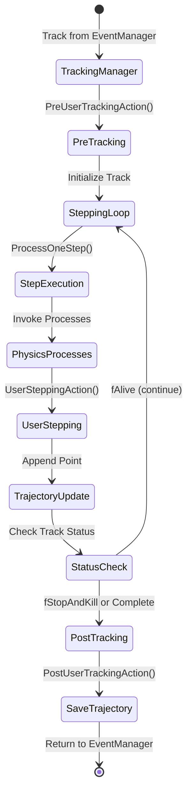
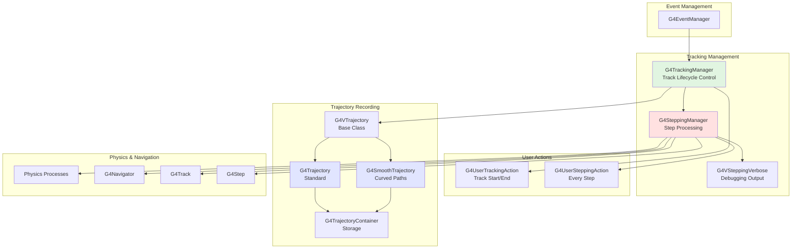
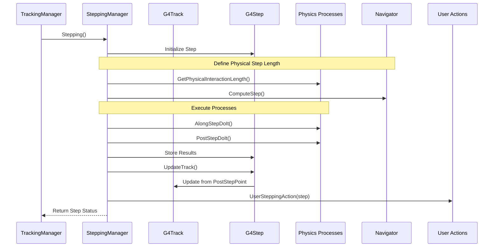
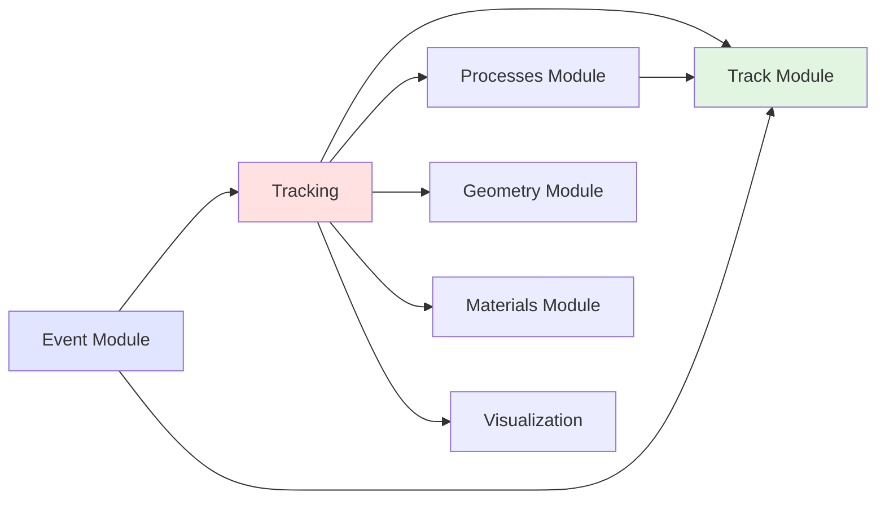

# Tracking Module

## Overview

The Tracking module is the core engine that manages particle propagation through the detector geometry in Geant4. It orchestrates the step-by-step simulation of particles, coordinating between physics processes, geometry navigation, and user actions. This module acts as the bridge between high-level event management and low-level step processing.

::: tip Module Location
**Source:** `source/tracking/`
**Headers:** `source/tracking/include/`
:::

## Purpose and Scope

The Tracking module serves as the central coordinator for particle simulation in Geant4:

- **Tracking Management**: `G4TrackingManager` controls the complete lifecycle of each track
- **Stepping Control**: `G4SteppingManager` handles individual step processing and physics process invocation
- **Trajectory Recording**: Classes for storing and visualizing particle paths
- **Verbose Output**: Configurable debugging and monitoring capabilities
- **User Actions**: Hooks for custom tracking and stepping behavior

## Core Concepts

### Simulation Hierarchy

```
G4Run
  └── Multiple G4Events
        └── Multiple G4Tracks (managed by TrackingManager)
              └── Multiple G4Steps (managed by SteppingManager)
                    ├── Physics Process Selection
                    ├── Step Execution
                    └── User Actions
```

- **TrackingManager**: Receives tracks from EventManager, manages complete track lifecycle
- **SteppingManager**: Executes individual steps, invokes physics processes
- **Trajectory**: Optional recording of particle path for visualization/analysis
- **User Actions**: G4UserTrackingAction and G4UserSteppingAction for customization

### Track Processing Flow



### Stepping Process Details

The stepping process involves three types of physics process invocations:

1. **AtRestDoIt**: For particles at rest (decay, absorption)
2. **AlongStepDoIt**: Continuous processes during step (energy loss, multiple scattering)
3. **PostStepDoIt**: Discrete processes at step end (interactions, boundary crossing)

## Architecture

### Tracking Components



### Stepping Manager Workflow



## Key Classes

### Tracking Management

| Class | Purpose | Header |
|-------|---------|--------|
| **G4TrackingManager** | Manages complete track lifecycle from creation to termination | `G4TrackingManager.hh` |
| **G4VTrackingManager** | Abstract base for custom tracking managers | `G4VTrackingManager.hh` |
| **G4TrackingMessenger** | UI commands for tracking control | `G4TrackingMessenger.hh` |

### Stepping Management

| Class | Purpose | Header |
|-------|---------|--------|
| **G4SteppingManager** | Executes individual steps and invokes physics processes | `G4SteppingManager.hh` |
| **G4VSteppingVerbose** | Abstract base for stepping verbosity | `G4VSteppingVerbose.hh` |
| **G4SteppingVerbose** | Standard stepping verbose output | `G4SteppingVerbose.hh` |
| **G4SteppingVerboseWithUnits** | Verbose output with unit formatting | `G4SteppingVerboseWithUnits.hh` |

### Trajectories

| Class | Purpose | Header |
|-------|---------|--------|
| **G4VTrajectory** | Abstract base class for particle trajectories | `G4VTrajectory.hh` |
| **G4Trajectory** | Standard trajectory with point list | `G4Trajectory.hh` |
| **G4SmoothTrajectory** | Trajectory with auxiliary points for smooth curves | `G4SmoothTrajectory.hh` |
| **G4RichTrajectory** | Trajectory with additional information per point | `G4RichTrajectory.hh` |
| **G4VTrajectoryPoint** | Abstract base for trajectory points | `G4VTrajectoryPoint.hh` |
| **G4TrajectoryPoint** | Standard trajectory point | `G4TrajectoryPoint.hh` |
| **G4SmoothTrajectoryPoint** | Point with auxiliary interpolation data | `G4SmoothTrajectoryPoint.hh` |

### User Actions

| Class | Purpose | Header |
|-------|---------|--------|
| [**G4UserTrackingAction**](api/g4usertrackingaction.md) | User hook for track start and end | `G4UserTrackingAction.hh` |
| [**G4UserSteppingAction**](api/g4usersteppingaction.md) | User hook called at every step | `G4UserSteppingAction.hh` |
| **G4MultiTrackingAction** | Composite pattern for multiple tracking actions | `G4MultiTrackingAction.hh` |
| **G4MultiSteppingAction** | Composite pattern for multiple stepping actions | `G4MultiSteppingAction.hh` |

### Specialized Trajectories

| Class | Purpose | Header |
|-------|---------|--------|
| **G4ClonedTrajectory** | Thread-safe cloned trajectory | `G4ClonedTrajectory.hh` |
| **G4ClonedSmoothTrajectory** | Thread-safe cloned smooth trajectory | `G4ClonedSmoothTrajectory.hh` |
| **G4ClonedRichTrajectory** | Thread-safe cloned rich trajectory | `G4ClonedRichTrajectory.hh` |

## Tracking Manager Lifecycle

### ProcessOneTrack Method

The `G4TrackingManager::ProcessOneTrack()` method orchestrates the complete tracking of a particle:

```cpp
void G4TrackingManager::ProcessOneTrack(G4Track* aTrack)
{
    // 1. Initialize track
    fpTrack = aTrack;
    fpTrack->SetTrackStatus(fAlive);

    // 2. Pre-tracking user action
    if (fpUserTrackingAction) {
        fpUserTrackingAction->PreUserTrackingAction(fpTrack);
    }

    // 3. Initialize trajectory storage if requested
    if (StoreTrajectory > 0) {
        fpTrajectory = new G4Trajectory(aTrack);
    }

    // 4. Initialize stepping
    fpSteppingManager->SetInitialStep(fpTrack);

    // 5. Stepping loop - continue until track dies
    while (fpTrack->GetTrackStatus() == fAlive) {
        fpSteppingManager->Stepping();

        // Append to trajectory if storing
        if (fpTrajectory) {
            fpTrajectory->AppendStep(fpTrack->GetStep());
        }
    }

    // 6. Post-tracking user action
    if (fpUserTrackingAction) {
        fpUserTrackingAction->PostUserTrackingAction(fpTrack);
    }

    // 7. Return trajectory to event if stored
    // Trajectory is deleted by G4EventManager
}
```

## Usage Patterns

### Basic Tracking Setup

```cpp
// In initialization
G4TrackingManager* trackingManager = new G4TrackingManager();

// Set user actions (optional)
trackingManager->SetUserAction(new MyTrackingAction());
trackingManager->SetUserAction(new MySteppingAction());

// Control trajectory storage
trackingManager->SetStoreTrajectory(1);  // 0=off, 1=on

// Set verbosity
trackingManager->SetVerboseLevel(1);
```

### Custom Tracking Action

```cpp
class MyTrackingAction : public G4UserTrackingAction
{
public:
    void PreUserTrackingAction(const G4Track* track) override
    {
        // Called at track start
        G4int trackID = track->GetTrackID();
        G4String particle = track->GetDefinition()->GetParticleName();

        G4cout << "Starting track " << trackID
               << " (" << particle << ")" << G4endl;

        // Control trajectory storage per track
        if (particle == "gamma" || particle == "e-" || particle == "e+") {
            fpTrackingManager->SetStoreTrajectory(true);
        } else {
            fpTrackingManager->SetStoreTrajectory(false);
        }
    }

    void PostUserTrackingAction(const G4Track* track) override
    {
        // Called at track end
        G4double trackLength = track->GetTrackLength();
        G4cout << "Track completed, length: "
               << trackLength/mm << " mm" << G4endl;

        // Access stored trajectory
        G4VTrajectory* trajectory = fpTrackingManager->GimmeTrajectory();
        if (trajectory) {
            G4int nPoints = trajectory->GetPointEntries();
            G4cout << "  Trajectory has " << nPoints << " points" << G4endl;
        }
    }
};
```

### Custom Stepping Action

```cpp
class MySteppingAction : public G4UserSteppingAction
{
public:
    void UserSteppingAction(const G4Step* step) override
    {
        // Called at every step - keep lightweight!

        // Get step information
        G4Track* track = step->GetTrack();
        G4double edep = step->GetTotalEnergyDeposit();

        // Energy deposition in detector
        if (edep > 0.) {
            G4String volumeName =
                step->GetPreStepPoint()->GetPhysicalVolume()->GetName();

            if (volumeName == "Detector") {
                fTotalEdep += edep;
            }
        }

        // Kill low-energy particles
        if (track->GetKineticEnergy() < 1.0*keV) {
            track->SetTrackStatus(fStopAndKill);
        }

        // Detect volume boundary crossing
        if (step->GetPostStepPoint()->GetStepStatus() == fGeomBoundary) {
            G4String nextVolume =
                step->GetPostStepPoint()->GetPhysicalVolume()->GetName();
            if (nextVolume == "Detector") {
                G4cout << "Particle entered detector" << G4endl;
            }
        }
    }

private:
    G4double fTotalEdep = 0.0;
};
```

### Working with Trajectories

```cpp
// Enable trajectory storage
G4TrackingManager* trackingManager = GetTrackingManager();
trackingManager->SetStoreTrajectory(1);

// Access trajectory in PostUserTrackingAction
void MyTrackingAction::PostUserTrackingAction(const G4Track* track)
{
    G4VTrajectory* trajectory = fpTrackingManager->GimmeTrajectory();

    if (trajectory) {
        // Get trajectory information
        G4int trackID = trajectory->GetTrackID();
        G4int parentID = trajectory->GetParentID();
        G4String particleName = trajectory->GetParticleName();
        G4double charge = trajectory->GetCharge();

        // Iterate over trajectory points
        G4int nPoints = trajectory->GetPointEntries();
        for (G4int i = 0; i < nPoints; ++i) {
            G4VTrajectoryPoint* point = trajectory->GetPoint(i);
            G4ThreeVector position = point->GetPosition();

            G4cout << "Point " << i << ": " << position << G4endl;
        }

        // Trajectory is automatically saved to G4Event
        // and will be visualized if visualization is enabled
    }
}
```

### Smooth Trajectory for Curved Paths

```cpp
// Use G4SmoothTrajectory for better visualization of curved tracks
// in magnetic fields or continuous processes

// In tracking manager initialization
auto trajectory = new G4SmoothTrajectory(track);

// G4SmoothTrajectory automatically adds auxiliary points
// between steps for smoother curve interpolation
// Useful for:
// - Charged particles in magnetic fields
// - Continuous energy loss processes
// - Better visualization quality
```

### Stepping Verbosity

```cpp
// Set up custom verbose output
class MySteppingVerbose : public G4SteppingVerbose
{
public:
    void StepInfo() override
    {
        // Custom step information output
        G4cout << "Step #" << fTrack->GetCurrentStepNumber()
               << " in " << fTrack->GetVolume()->GetName()
               << ", E = " << fTrack->GetKineticEnergy()/MeV << " MeV"
               << G4endl;
    }

    void TrackingStarted() override
    {
        G4cout << "=== Starting track " << fTrack->GetTrackID()
               << " ===" << G4endl;
    }
};

// Register verbose class
G4VSteppingVerbose::SetInstance(new MySteppingVerbose());

// Set verbosity level
trackingManager->SetVerboseLevel(1);  // 0=silent, 1=basic, 2+=detailed
```

### Process Selection and Invocation

```cpp
// The SteppingManager selects and invokes physics processes
// Users typically don't call these directly, but understanding
// the process helps with debugging

// In G4SteppingManager::Stepping():

// 1. Define physical step length
//    - Query all processes for their proposed step lengths
//    - Select minimum (most restrictive) step length
DefinePhysicalStepLength();

// 2. Invoke AlongStep processes (continuous)
//    - Energy loss, multiple scattering
//    - Applied during the step
InvokeAlongStepDoItProcs();

// 3. Invoke PostStep processes (discrete)
//    - Interactions, decays, boundary crossing
//    - Applied at step end
InvokePostStepDoItProcs();

// 4. Update track from particle changes
//    - Apply energy, momentum, position changes
//    - Create secondary particles
ProcessSecondariesFromParticleChange();
```

## Advanced Features

### Multiple User Actions

```cpp
// Use composite pattern for multiple user actions
auto multiTracking = new G4MultiTrackingAction();
multiTracking->push_back(new MyTrackingAction1());
multiTracking->push_back(new MyTrackingAction2());
SetUserAction(multiTracking);

auto multiStepping = new G4MultiSteppingAction();
multiStepping->push_back(new MySteppingAction1());
multiStepping->push_back(new MySteppingAction2());
SetUserAction(multiStepping);
```

### Track Filtering

```cpp
class FilteringTrackingAction : public G4UserTrackingAction
{
public:
    void PreUserTrackingAction(const G4Track* track) override
    {
        G4String particle = track->GetDefinition()->GetParticleName();
        G4double energy = track->GetKineticEnergy();
        G4int parentID = track->GetParentID();

        // Save only:
        // 1. All primary particles
        // 2. Secondary e-, e+, gamma above 1 MeV
        bool save = false;

        if (parentID == 0) {
            save = true;  // Always save primaries
        } else if (energy > 1.0*MeV) {
            if (particle == "e-" || particle == "e+" || particle == "gamma") {
                save = true;
            }
        }

        fpTrackingManager->SetStoreTrajectory(save);
    }
};
```

### Conditional Track Killing

```cpp
class KillingSteppingAction : public G4UserSteppingAction
{
public:
    void UserSteppingAction(const G4Step* step) override
    {
        G4Track* track = step->GetTrack();

        // Kill condition 1: Particle left world
        if (!step->GetPostStepPoint()->GetPhysicalVolume()) {
            track->SetTrackStatus(fStopAndKill);
            return;
        }

        // Kill condition 2: Low energy outside region of interest
        G4String volumeName =
            step->GetPreStepPoint()->GetPhysicalVolume()->GetName();

        if (volumeName != "Detector" && volumeName != "Target") {
            if (track->GetKineticEnergy() < 10.0*keV) {
                track->SetTrackStatus(fStopAndKill);
                return;
            }
        }

        // Kill condition 3: Traveled too far
        if (track->GetTrackLength() > 10.0*m) {
            track->SetTrackStatus(fStopAndKill);
            return;
        }
    }
};
```

## Integration with Other Modules



### Module Dependencies

**Tracking Module Uses:**
- **Track Module**: G4Track, G4Step, G4StepPoint for state information
- **Processes Module**: Physics process invocation and particle changes
- **Geometry Module**: G4Navigator for geometry navigation
- **Particles Module**: Particle definitions
- **Materials Module**: Material properties

**Tracking Module Provides To:**
- **Event Module**: Track processing and trajectory storage
- **Visualization Module**: Trajectories for display
- **User Code**: Hooks via user actions
- **Analysis Code**: Step and track information

### Event Manager Integration

```cpp
// G4EventManager calls G4TrackingManager for each track
void G4EventManager::DoProcessing(G4Event* anEvent)
{
    // Process primary tracks
    G4TrackVector* primaries = anEvent->GetPrimaryVertex()->GetPrimary();

    for (auto track : *primaries) {
        fpTrackingManager->ProcessOneTrack(track);

        // Get secondaries
        G4TrackVector* secondaries = fpTrackingManager->GimmeSecondaries();

        // Stack secondaries for processing
        for (auto secondary : *secondaries) {
            fpStackManager->PushOneTrack(secondary);
        }
    }

    // Process secondary tracks from stack
    while (!fpStackManager->IsEmpty()) {
        G4Track* track = fpStackManager->PopNextTrack();
        fpTrackingManager->ProcessOneTrack(track);
        // ... handle new secondaries
    }
}
```

## Thread Safety

### Multi-Threading Considerations

- **G4TrackingManager**: Thread-local instance per worker thread
- **G4SteppingManager**: Thread-local instance per worker thread
- **User Actions**: Separate instance per worker thread
- **Trajectories**: Thread-local storage, cloned for master thread if needed
- **G4Allocator**: Thread-safe custom allocators for trajectories

### Thread-Safe Patterns

```cpp
class MyTrackingAction : public G4UserTrackingAction
{
public:
    void PreUserTrackingAction(const G4Track* track) override
    {
        // Thread-local counter (each thread has its own)
        G4ThreadLocal static G4int trackCount = 0;
        trackCount++;

        // Safe: Read-only access to const track
        G4String particle = track->GetDefinition()->GetParticleName();

        // Safe: Thread-local trajectory storage
        fpTrackingManager->SetStoreTrajectory(true);
    }
};
```

### Trajectory Cloning for Master Thread

```cpp
// In sub-event parallel mode, trajectories must be cloned
// for the master thread

// Automatic cloning in G4Event
G4VTrajectory* trajectory = new G4Trajectory(track);
// ... trajectory is populated during tracking ...

// At end of event, trajectory is cloned for master
G4VTrajectory* clonedTrajectory = trajectory->CloneForMaster();
// Cloned trajectory uses master thread allocator
```

## Performance Considerations

### Tracking Performance

1. **Stepping Frequency**: Most time-consuming part of simulation
   - Minimize work in UserSteppingAction
   - Use efficient geometry (fewer volumes = fewer boundary crossings)
   - Appropriate production cuts reduce step count

2. **Trajectory Storage**: Memory and time overhead
   - Store only necessary trajectories
   - Use trajectory filtering in PreUserTrackingAction
   - Consider disabling for production runs

3. **Verbosity**: Significant performance impact
   - Use verbosity only for debugging
   - Set to 0 for production runs
   - Conditional output based on particle type/energy

4. **User Actions**: Called frequently
   - Keep UserSteppingAction extremely lightweight
   - Avoid file I/O in stepping action
   - Use early returns for conditional processing

### Optimization Tips

```cpp
class OptimizedSteppingAction : public G4UserSteppingAction
{
public:
    OptimizedSteppingAction()
        : fDetectorName("Detector"),  // Cache string comparison
          fMinEdep(0.1*keV)          // Cache threshold
    {}

    void UserSteppingAction(const G4Step* step) override
    {
        // Early return - most common case
        G4double edep = step->GetTotalEnergyDeposit();
        if (edep <= 0.) return;

        // Early return - below threshold
        if (edep < fMinEdep) return;

        // Only check volume if necessary
        G4VPhysicalVolume* volume =
            step->GetPreStepPoint()->GetPhysicalVolume();

        // Single string comparison with cached name
        if (volume && volume->GetName() == fDetectorName) {
            fTotalEdep += edep;  // Minimal processing
        }
    }

private:
    const G4String fDetectorName;  // Cached
    const G4double fMinEdep;       // Cached
    G4double fTotalEdep = 0.0;     // Accumulator
};
```

## Common Patterns

### Pattern 1: Selective Trajectory Storage

```cpp
void MyTrackingAction::PreUserTrackingAction(const G4Track* track)
{
    // Only save primary particles and high-energy secondaries
    bool save = (track->GetParentID() == 0) ||
                (track->GetKineticEnergy() > 10*MeV);

    fpTrackingManager->SetStoreTrajectory(save);
}
```

### Pattern 2: Volume-Specific Scoring

```cpp
void MySteppingAction::UserSteppingAction(const G4Step* step)
{
    G4double edep = step->GetTotalEnergyDeposit();
    if (edep <= 0.) return;

    G4String volumeName =
        step->GetPreStepPoint()->GetPhysicalVolume()->GetName();

    // Accumulate by volume
    fEdepByVolume[volumeName] += edep;
}
```

### Pattern 3: Boundary Detection

```cpp
void MySteppingAction::UserSteppingAction(const G4Step* step)
{
    if (step->GetPostStepPoint()->GetStepStatus() == fGeomBoundary) {
        G4VPhysicalVolume* nextVol =
            step->GetPostStepPoint()->GetPhysicalVolume();

        if (nextVol && nextVol->GetName() == "Detector") {
            // Particle entered detector
            G4Track* track = step->GetTrack();
            RecordDetectorEntry(track);
        }
    }
}
```

### Pattern 4: Process Monitoring

```cpp
void MySteppingAction::UserSteppingAction(const G4Step* step)
{
    const G4VProcess* process =
        step->GetPostStepPoint()->GetProcessDefinedStep();

    if (process) {
        G4String processName = process->GetProcessName();

        // Count specific processes
        if (processName == "compt" || processName == "phot") {
            fInteractionCount[processName]++;
        }
    }
}
```

## Debugging and Monitoring

### Enabling Tracking Verbosity

```cpp
// In initialization or via UI command
trackingManager->SetVerboseLevel(1);

// UI command
/tracking/verbose 1

// Verbose levels:
// 0 = Silent
// 1 = Track start/end
// 2 = Step-by-step with basic info
// 3 = Step-by-step with detailed info
// 4+ = Maximum detail (very slow)
```

### Custom Verbose Output

```cpp
class MySteppingVerbose : public G4SteppingVerbose
{
public:
    void StepInfo() override
    {
        G4cout << "Step " << fTrack->GetCurrentStepNumber()
               << " | " << fTrack->GetDefinition()->GetParticleName()
               << " | E=" << fTrack->GetKineticEnergy()/MeV << " MeV"
               << " | Vol=" << fCurrentVolume->GetName()
               << " | Edep=" << fStep->GetTotalEnergyDeposit()/keV << " keV"
               << G4endl;
    }
};

// Set before run initialization
G4VSteppingVerbose::SetInstance(new MySteppingVerbose());
```

## API Documentation

### User Actions
- [G4UserTrackingAction](api/g4usertrackingaction.md) - Track start/end user hooks
- [G4UserSteppingAction](api/g4usersteppingaction.md) - Per-step user hooks

### Related Classes
- [G4Track](../track/api/g4track.md) - Track container
- [G4Step](../track/api/g4step.md) - Step information
- [G4StepPoint](../track/api/g4steppoint.md) - Step boundary data

## Source Files

Key source files in `source/tracking/`:

```
source/tracking/
├── include/
│   ├── G4TrackingManager.hh              # Track lifecycle manager
│   ├── G4SteppingManager.hh              # Step processing engine
│   ├── G4VTrajectory.hh                  # Trajectory base class
│   ├── G4Trajectory.hh                   # Standard trajectory
│   ├── G4SmoothTrajectory.hh             # Smooth curved trajectory
│   ├── G4RichTrajectory.hh               # Rich trajectory with details
│   ├── G4VSteppingVerbose.hh             # Verbose base class
│   ├── G4SteppingVerbose.hh              # Standard verbose output
│   ├── G4UserTrackingAction.hh           # User tracking action
│   ├── G4UserSteppingAction.hh           # User stepping action
│   ├── G4TrajectoryPoint.hh              # Trajectory point
│   └── G4VTrajectoryPoint.hh             # Trajectory point base
└── src/
    ├── G4TrackingManager.cc
    ├── G4SteppingManager.cc
    ├── G4Trajectory.cc
    ├── G4SmoothTrajectory.cc
    └── G4SteppingVerbose.cc
```

::: tip Related Documentation
- [Track Module](../track/index.md) - Track and Step data structures
- [Event Module](../event/index.md) - Event management and primary generation
- [Processes Module](../processes/index.md) - Physics process implementation
- [Run Module](../run/index.md) - Run management and event loop
- [Documentation Progress](../../documentation-progress.md) - Track progress
:::

## See Also

- **Geant4 User's Guide**: Chapter on Tracking and Physics Processes
- **Application Developer's Guide**: Section on User Actions
- **Tracking and Physics**: Understanding the stepping loop
- **Trajectory Visualization**: Using trajectories for event display

---

::: info Next Steps
After understanding the Tracking module, explore:
1. **Track Module** - Understand G4Track and G4Step data structures
2. **Processes Module** - Learn how physics processes work
3. **Event Module** - See how events and tracks are managed
4. **Geometry Module** - Understand navigation and boundary detection
:::
