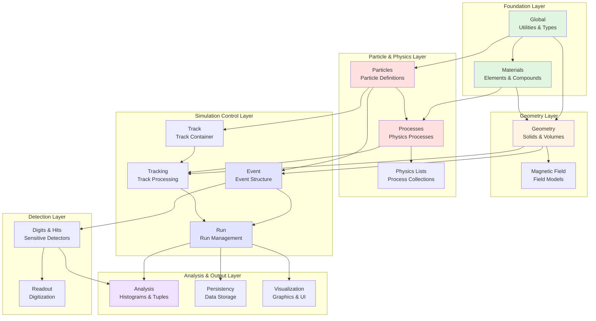
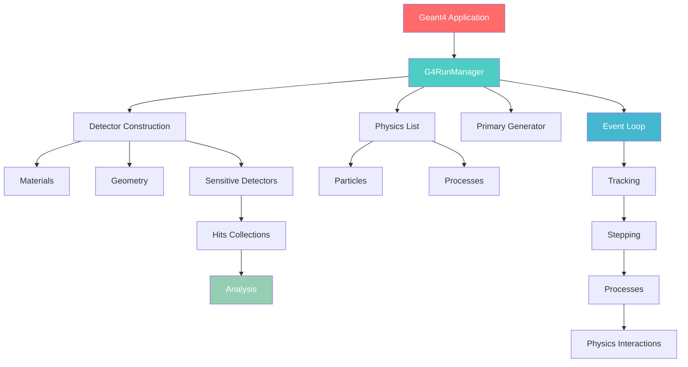
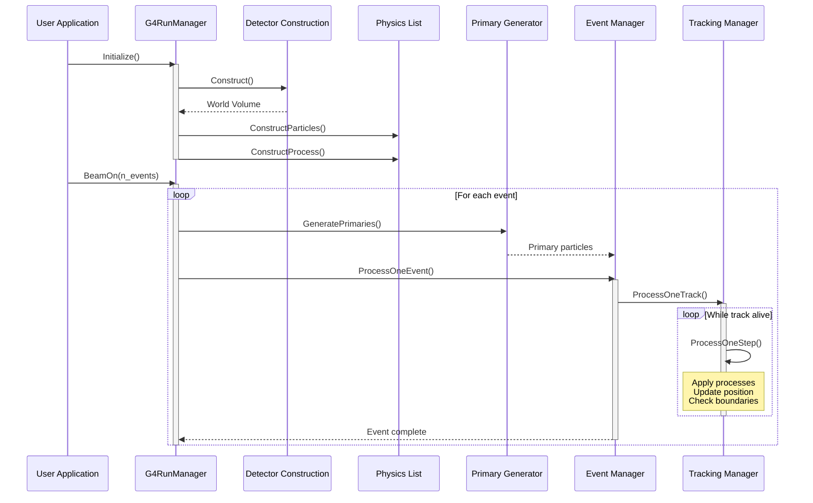
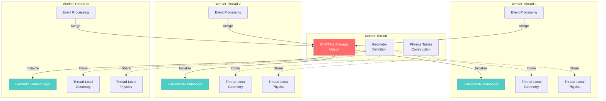
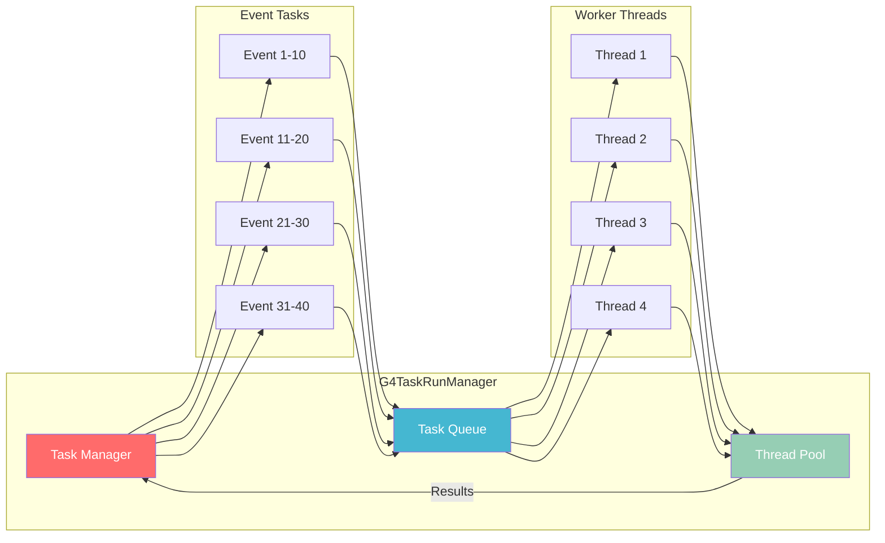
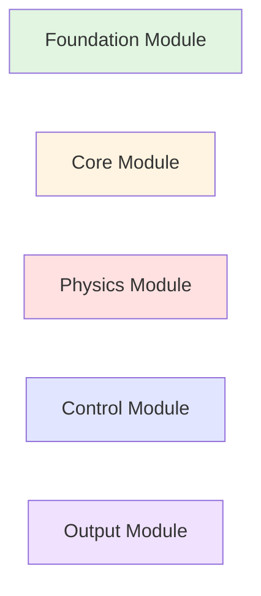

# Geant4 Architecture Visualization

An interactive exploration of the Geant4 toolkit's modular architecture and class relationships.

## Module Dependency Graph

This diagram shows how the major Geant4 modules depend on each other. Click on any module to explore its classes.



## Core Module Relationships

### Hierarchical View



## Materials Module Class Hierarchy

```mermaid
classDiagram
    class G4Isotope {
        -G4String name
        -G4int Z
        -G4int N
        -G4double A
        +GetZ() G4int
        +GetN() G4int
        +GetA() G4double
    }

    class G4Element {
        -G4String name
        -G4double Z
        -G4double A
        -vector~G4Isotope*~ isotopes
        +AddIsotope(G4Isotope*, G4double)
        +GetZ() G4double
        +GetA() G4double
    }

    class G4Material {
        -G4String name
        -G4double density
        -G4State state
        -vector~G4Element*~ elements
        +AddElement(G4Element*, G4double)
        +GetDensity() G4double
        +GetRadlen() G4double
    }

    class G4IonisParamElm {
        -G4double meanExcitationEnergy
        -G4double* shellCorrectionVector
        +GetMeanExcitationEnergy() G4double
    }

    G4Isotope --> G4Element : composed of
    G4Element --> G4Material : composed of
    G4Element --> G4IonisParamElm : has

    click G4Isotope "/geant4/modules/materials/api/g4isotope" "G4Isotope API Documentation"
    click G4Element "/geant4/modules/materials/api/g4element" "G4Element API Documentation"
    click G4Material "/geant4/modules/materials/api/g4material" "G4Material API Documentation"
    click G4IonisParamElm "/geant4/modules/materials/api/g4ionisparamelm" "G4IonisParamElm API Documentation"
```

## Run Module Class Hierarchy

```mermaid
classDiagram
    class G4RunManager {
        <<singleton>>
        +Initialize()
        +BeamOn(G4int)
        +SetUserInitialization()
        +SetUserAction()
        #DoEventLoop()
        #ProcessOneEvent()
    }

    class G4MTRunManager {
        -G4int nworkers
        -vector~G4Thread*~ workers
        +SetNumberOfThreads(G4int)
        +GetNumberOfThreads() G4int
        #InitializeThreadPool()
        #CreateAndStartWorkers()
    }

    class G4TaskRunManager {
        -PTL::TaskManager* taskManager
        -G4int grainsize
        +GetTaskManager() static
        +GetThreadPool() static
        #SubmitTasks()
    }

    class G4Run {
        -G4int runID
        -G4int numberOfEvent
        -G4HCtable* HCtable
        +RecordEvent()
        +Merge(G4Run*)
        +GetRunID() G4int
    }

    class G4WorkerRunManager {
        -G4int workerID
        +ProcessOneEvent(G4int)
        +MergePartialResults()
    }

    G4RunManager <|-- G4MTRunManager : extends
    G4MTRunManager <|-- G4TaskRunManager : extends
    G4RunManager <|-- G4WorkerRunManager : extends
    G4RunManager --> G4Run : manages
    G4MTRunManager --> G4WorkerRunManager : creates

    click G4RunManager "/geant4/modules/run/api/g4runmanager" "G4RunManager API Documentation"
    click G4MTRunManager "/geant4/modules/run/api/g4mtrunmanager" "G4MTRunManager API Documentation"
    click G4Run "/geant4/modules/run/api/g4run" "G4Run API Documentation"
```

## Event Module Class Hierarchy

```mermaid
classDiagram
    class G4Event {
        -G4int eventID
        -G4PrimaryVertex* thePrimaryVertex
        -G4HCofThisEvent* HC
        -G4DCofThisEvent* DC
        -G4TrajectoryContainer* trajectoryContainer
        +GetEventID() G4int
        +AddPrimaryVertex(G4PrimaryVertex*)
        +GetPrimaryVertex(G4int) G4PrimaryVertex*
        +GetHCofThisEvent() G4HCofThisEvent*
        +KeepTheEvent(G4bool)
    }

    class G4PrimaryVertex {
        -G4double X0, Y0, Z0, T0
        -G4PrimaryParticle* theParticle
        -G4PrimaryVertex* nextVertex
        -G4double Weight0
        +GetPosition() G4ThreeVector
        +GetT0() G4double
        +SetPrimary(G4PrimaryParticle*)
        +GetPrimary(G4int) G4PrimaryParticle*
        +GetNumberOfParticle() G4int
    }

    class G4PrimaryParticle {
        -G4int PDGcode
        -G4ParticleDefinition* G4code
        -G4ThreeVector direction
        -G4double kinE
        -G4PrimaryParticle* nextParticle
        -G4PrimaryParticle* daughterParticle
        +GetPDGcode() G4int
        +GetMomentum() G4ThreeVector
        +GetKineticEnergy() G4double
        +SetDaughter(G4PrimaryParticle*)
    }

    class G4EventManager {
        <<singleton>>
        -G4Event* currentEvent
        -G4StackManager* trackContainer
        -G4TrackingManager* trackManager
        +ProcessOneEvent(G4Event*)
        +GetEventManager() static
        +AbortCurrentEvent()
        +SetUserAction()
    }

    G4Event --> G4PrimaryVertex : contains
    G4PrimaryVertex --> G4PrimaryParticle : contains
    G4EventManager --> G4Event : processes

    click G4Event "/geant4/modules/event/api/g4event" "G4Event API Documentation"
    click G4PrimaryVertex "/geant4/modules/event/api/g4primaryvertex" "G4PrimaryVertex API Documentation"
    click G4PrimaryParticle "/geant4/modules/event/api/g4primaryparticle" "G4PrimaryParticle API Documentation"
    click G4EventManager "/geant4/modules/event/api/g4eventmanager" "G4EventManager API Documentation"
```

## Event Processing Sequence



## Particles Module Class Hierarchy

```mermaid
classDiagram
    class G4ParticleDefinition {
        -G4String theParticleName
        -G4double thePDGMass
        -G4double thePDGCharge
        -G4int thePDGEncoding
        -G4DecayTable* theDecayTable
        -G4ProcessManager* theProcessManager
        +GetParticleName() G4String
        +GetPDGMass() G4double
        +GetPDGCharge() G4double
        +GetPDGEncoding() G4int
        +GetDecayTable() G4DecayTable*
        +GetProcessManager() G4ProcessManager*
    }

    class G4ParticleTable {
        <<singleton>>
        -static G4ParticleTable* fgParticleTable
        -G4PTblDictionary* fDictionary
        -G4IonTable* fIonTable
        +GetParticleTable() static
        +FindParticle(G4String) G4ParticleDefinition*
        +FindParticle(G4int) G4ParticleDefinition*
        +GetIonTable() G4IonTable*
        +Insert(G4ParticleDefinition*)
    }

    class G4DynamicParticle {
        -const G4ParticleDefinition* theParticleDefinition
        -G4ThreeVector theMomentumDirection
        -G4double theKineticEnergy
        -G4ThreeVector thePolarization
        -G4double theProperTime
        +GetParticleDefinition() G4ParticleDefinition*
        +GetMomentum() G4ThreeVector
        +GetKineticEnergy() G4double
        +SetKineticEnergy(G4double)
        +GetBeta() G4double
    }

    class G4IonTable {
        -G4ParticleTable* particleTable
        -G4NuclideTable* pNuclideTable
        +GetIon(G4int Z, G4int A) G4ParticleDefinition*
        +GetIon(G4int encoding) G4ParticleDefinition*
        +GetMuonicAtom(G4int Z, G4int A) G4ParticleDefinition*
        +GetIonName(G4int Z, G4int A) G4String
        +GetLifeTime(G4int Z, G4int A) G4double
    }

    class G4DecayTable {
        -std::vector~G4VDecayChannel*~ channels
        +Insert(G4VDecayChannel*)
        +SelectADecayChannel() G4VDecayChannel*
        +GetDecayChannel(G4int) G4VDecayChannel*
        +entries() G4int
    }

    class G4VDecayChannel {
        <<abstract>>
        -G4String* daughters_name
        -G4double rbranch
        -G4int numberOfDaughters
        +GetBR() G4double
        +GetNumberOfDaughters() G4int
        +DecayIt(G4double) G4DecayProducts*
    }

    class G4Electron {
        <<singleton>>
        +Definition() static G4ParticleDefinition*
        +Electron() static G4Electron*
    }

    class G4Proton {
        <<singleton>>
        +Definition() static G4ParticleDefinition*
        +Proton() static G4Proton*
    }

    class G4Gamma {
        <<singleton>>
        +Definition() static G4ParticleDefinition*
        +Gamma() static G4Gamma*
    }

    G4ParticleTable o-- G4ParticleDefinition : manages
    G4ParticleTable *-- G4IonTable : contains
    G4ParticleDefinition *-- G4DecayTable : may have
    G4DecayTable o-- G4VDecayChannel : contains
    G4DynamicParticle --> G4ParticleDefinition : references
    G4Electron --|> G4ParticleDefinition : inherits
    G4Proton --|> G4ParticleDefinition : inherits
    G4Gamma --|> G4ParticleDefinition : inherits

    click G4ParticleDefinition "/geant4/modules/particles/api/g4particledefinition" "G4ParticleDefinition API"
    click G4ParticleTable "/geant4/modules/particles/api/g4particletable" "G4ParticleTable API"
    click G4DynamicParticle "/geant4/modules/particles/api/g4dynamicparticle" "G4DynamicParticle API"
    click G4IonTable "/geant4/modules/particles/api/g4iontable" "G4IonTable API"
    click G4DecayTable "/geant4/modules/particles/api/g4decaytable" "G4DecayTable API"
    click G4VDecayChannel "/geant4/modules/particles/api/g4vdecaychannel" "G4VDecayChannel API"
```

## Multi-Threading Architecture



## Task-Based Parallelism Flow



## Interactive Module Explorer

::: info Quick Navigation
- [Materials Module →](/modules/materials/) - Isotopes, elements, and material definitions
- [Event Module →](/modules/event/) - Event generation and primary particle management
- [Run Module →](/modules/run/) - Simulation control and event loop management
- [Particles Module →](/modules/particles/) - Particle definitions and properties
- [Architecture Overview →](/architecture) - High-level system architecture
:::

## Module Statistics

| Module | Classes | Dependencies | Documentation Status |
|--------|---------|--------------|---------------------|
| **materials** | 44 | global | ✅ 4/44 classes documented |
| **event** | 36 | global, particles | ✅ 4/36 classes documented |
| **run** | 15+ | global, event, tracking | ✅ 3/15 classes documented |
| global | 60+ | - | ⏳ Pending |
| geometry | 150+ | global, materials | ⏳ Pending |
| **particles** | 252 | global | ✅ 13/252 classes documented |
| processes | 250+ | particles, geometry | ⏳ Pending |
| tracking | 40+ | event, geometry | ⏳ Pending |

## Legend



## Next Steps

Explore the architecture in more detail:

1. **Start with Materials** - Understanding how matter is represented
2. **Move to Run Control** - Learn how simulations are orchestrated
3. **Dive into Processes** - Explore the physics behind particle interactions
4. **Study Geometry** - See how detectors are modeled

::: tip Interactive Diagrams
Click on any class or module in the diagrams above to navigate directly to its documentation!
:::
